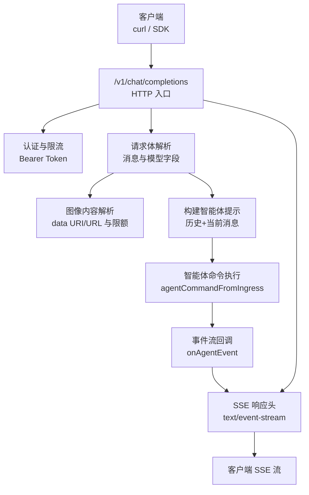
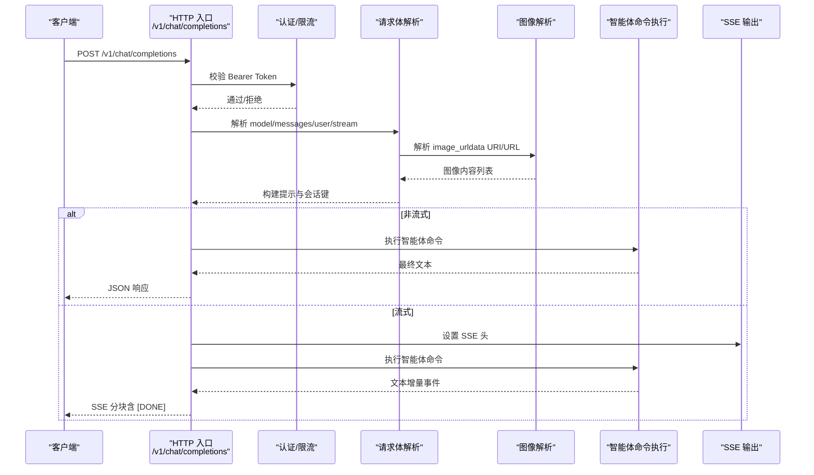
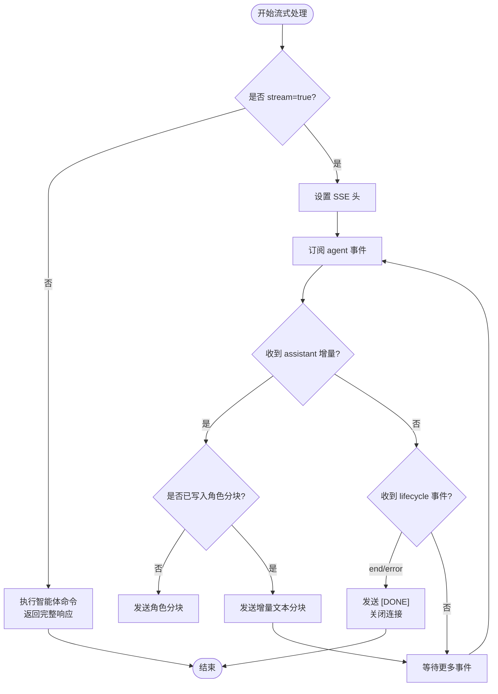
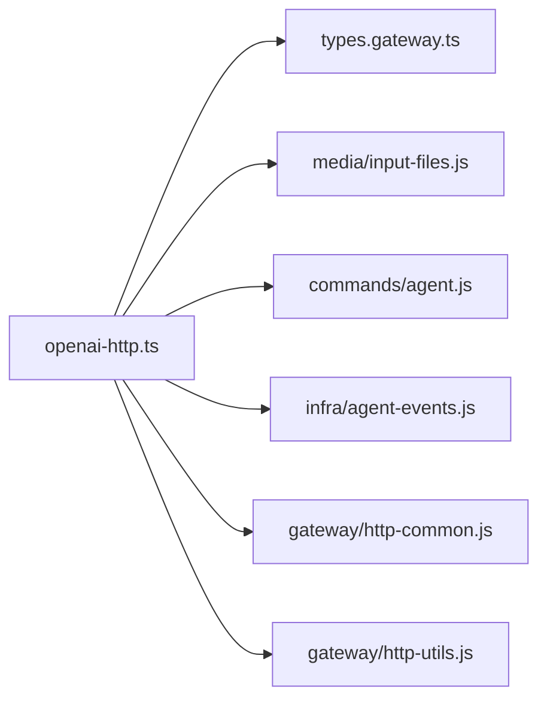

# OpenAI 兼容 API

<cite>
**本文引用的文件**
- [openai-http.ts](file://src/gateway/openai-http.ts)
- [openai-http.test.ts](file://src/gateway/openai-http.test.ts)
- [openai-http.message-channel.test.ts](file://src/gateway/openai-http.message-channel.test.ts)
- [openai-http.image-budget.test.ts](file://src/gateway/openai-http.image-budget.test.ts)
- [types.gateway.ts](file://src/config/types.gateway.ts)
- [openai-http-api.md](file://docs/zh-CN/gateway/openai-http-api.md)
- [SECURITY.md](file://SECURITY.md)
- [openai-compat.ts](file://src/agents/model-compat.ts)
</cite>

## 目录
1. [简介](#简介)
2. [项目结构](#项目结构)
3. [核心组件](#核心组件)
4. [架构总览](#架构总览)
5. [详细组件分析](#详细组件分析)
6. [依赖关系分析](#依赖关系分析)
7. [性能考量](#性能考量)
8. [故障排除指南](#故障排除指南)
9. [结论](#结论)
10. [附录](#附录)

## 简介
本文件面向集成 OpenAI 兼容 API 的开发者，系统性阐述 /v1/chat/completions 端点的实现机制，覆盖以下关键主题：
- 请求参数映射：如何将 OpenAI 风格的消息数组解析为内部智能体提示，并处理 system/developer/system 以外的角色与内容类型。
- 响应格式转换：非流式与流式模式下的响应结构，以及 SSE 事件序列。
- 流式传输处理：SSE 分块写入、终止条件与错误兜底。
- 认证机制：Bearer Token 的使用方式与速率限制。
- 代理选择策略：model 字段与自定义头部的优先级与行为。
- 会话管理：基于 user 字段与自定义头部的会话键生成策略。
- 启用/禁用配置、安全边界与最佳实践。
- 完整 API 参考、参数说明、示例与故障排除。

## 项目结构
OpenAI 兼容 API 的实现位于网关层，核心入口为 HTTP 处理函数，配合通用的认证、限流与请求上下文解析工具，最终将请求委派给智能体命令执行器。

图表来源
- [openai-http.ts:408-613](file://src/gateway/openai-http.ts#L408-L613)

章节来源
- [openai-http.ts:1-613](file://src/gateway/openai-http.ts#L1-L613)
- [openai-http-api.md:15-126](file://docs/zh-CN/gateway/openai-http-api.md#L15-L126)

## 核心组件
- HTTP 入口与路由
  - 路径：/v1/chat/completions
  - 方法：POST
  - 默认禁用，需显式开启配置项 gateway.http.endpoints.chatCompletions.enabled
- 认证与限流
  - Bearer Token：使用网关认证配置（token/password 模式）
  - 支持按 IP 的速率限制
- 请求体解析
  - model：用于选择智能体（支持 openclaw:<agentId>、agent:<agentId> 别名）
  - messages：OpenAI 风格消息数组，支持 text 与 image_url 内容部分
  - user：可选，用于稳定派生会话键
  - stream：可选，true 时启用 SSE 流式输出
- 图像输入
  - 支持 data URI 与受限 URL（可配置白名单）
  - 有最大数量与总字节限额
- 会话管理
  - 默认每请求无状态（每次调用生成新会话键）
  - 若提供 user 字段，则基于该字符串派生稳定会话键
  - 可通过 x-openclaw-session-key 完全自定义会话键
- 智能体执行
  - 将解析后的提示与图像内容转为 agentCommand 输入
  - 执行后通过事件回调回推文本增量

章节来源
- [openai-http.ts:408-613](file://src/gateway/openai-http.ts#L408-L613)
- [types.gateway.ts:216-257](file://src/config/types.gateway.ts#L216-L257)
- [openai-http-api.md:26-50](file://docs/zh-CN/gateway/openai-http-api.md#L26-L50)

## 架构总览
下图展示从请求进入至响应返回的关键流程与数据流。

图表来源
- [openai-http.ts:408-613](file://src/gateway/openai-http.ts#L408-L613)

## 详细组件分析

### 请求参数映射
- model 字段
  - 支持 openclaw:<agentId> 与 agent:<agentId> 两种形式
  - 也可通过 x-openclaw-agent-id 自定义智能体 ID
  - 两者同时存在时，自定义头部优先
- messages 数组
  - 支持 role: user/assistant/tool/system/developer/function
  - content 支持纯文本与多部分（text 与 image_url）
  - system/developer 角色内容被抽取为额外系统提示
  - function 角色会被归一化为 tool
- user 字段
  - 用于稳定派生会话键，重复调用可共享同一会话
- x-openclaw-session-key
  - 完全自定义会话键，覆盖 user 与默认规则
- x-openclaw-message-channel
  - 透传消息通道标识，未设置时默认 webchat

章节来源
- [openai-http.ts:431-441](file://src/gateway/openai-http.ts#L431-L441)
- [openai-http.ts:321-387](file://src/gateway/openai-http.ts#L321-L387)
- [openai-http.message-channel.test.ts:47-59](file://src/gateway/openai-http.message-channel.test.ts#L47-L59)

### 响应格式转换
- 非流式
  - 返回标准 OpenAI chat.completion 结构，包含 id/object/created/model/choices/usage
  - choices[0].message.role 固定为 assistant
  - finish_reason 在非流式场景固定为 stop
- 流式（SSE）
  - Content-Type: text/event-stream
  - 每个事件行：data: <JSON>
  - 首个事件包含角色分块（delta.role=assistant）
  - 后续事件为增量文本（delta.content）
  - 终止事件：data: [DONE]
  - 生命周期事件：当智能体结束或出错时触发 [DONE] 并关闭连接

章节来源
- [openai-http.ts:487-500](file://src/gateway/openai-http.ts#L487-L500)
- [openai-http.ts:123-150](file://src/gateway/openai-http.ts#L123-L150)
- [openai-http.ts:510-554](file://src/gateway/openai-http.ts#L510-L554)

### 流式传输处理
- SSE 写入
  - setSseHeaders 设置必要的响应头
  - writeAssistantRoleChunk 发送首条角色分块
  - writeAssistantContentChunk 发送增量文本分块
  - writeDone 发送 [DONE] 并关闭连接
- 事件监听
  - onAgentEvent 监听智能体事件流
  - 当收到生命周期事件 end/error 时，关闭连接并发送 [DONE]
- 错误兜底
  - 执行失败时，发送包含错误文本的分块并标记 finish_reason=stop
  - 最终仍发送 [DONE] 保证客户端正确收尾

图表来源
- [openai-http.ts:516-613](file://src/gateway/openai-http.ts#L516-L613)

章节来源
- [openai-http.ts:510-554](file://src/gateway/openai-http.ts#L510-L554)
- [openai-http.ts:556-613](file://src/gateway/openai-http.ts#L556-L613)

### 认证机制（Bearer Token）
- 使用网关认证配置进行校验
  - token 模式：Authorization: Bearer <gateway.auth.token>
  - password 模式：Authorization: Bearer <gateway.auth.password>
- 支持按 IP 的速率限制，失败多次可能返回 429 并带 retry-after
- 安全边界
  - 该端点为“受信任操作者”面，等价于对网关的 operator 访问权限，不区分 per-user/per-scope 权限

章节来源
- [openai-http-api.md:26-36](file://docs/zh-CN/gateway/openai-http-api.md#L26-L36)
- [openai-http.test.ts:596-637](file://src/gateway/openai-http.test.ts#L596-L637)
- [SECURITY.md:58](file://SECURITY.md#L58)
- [SECURITY.md:95](file://SECURITY.md#L95)

### 代理选择策略（model 与自定义头部）
- model 字段
  - openclaw:<agentId> 与 agent:<agentId> 两种形式
  - 未提供时默认 openclaw
- 自定义头部
  - x-openclaw-agent-id：覆盖 model 中的 agentId
  - x-openclaw-session-key：完全自定义会话键
  - x-openclaw-message-channel：透传消息通道，默认 webchat
- 优先级
  - x-openclaw-agent-id 优先于 model 中的 agentId
  - x-openclaw-session-key 优先于 user 与默认派生逻辑

章节来源
- [openai-http.ts:431-441](file://src/gateway/openai-http.ts#L431-L441)
- [openai-http.message-channel.test.ts:47-59](file://src/gateway/openai-http.message-channel.test.ts#L47-L59)
- [openai-http.test.ts:183-229](file://src/gateway/openai-http.test.ts#L183-L229)

### 会话管理行为
- 默认行为
  - 每次请求生成新的会话键（无状态）
- 稳定会话
  - 若提供 user 字符串，基于该字符串派生稳定会话键
- 完全控制
  - 通过 x-openclaw-session-key 显式指定会话键
- 消息通道
  - 未设置 x-openclaw-message-channel 时，默认 webchat

章节来源
- [openai-http.ts:434-441](file://src/gateway/openai-http.ts#L434-L441)
- [openai-http.message-channel.test.ts:55-58](file://src/gateway/openai-http.message-channel.test.ts#L55-L58)

### 图像输入与限额
- 支持 data URI 与受限 URL
  - data URI 必须为 base64 编码
  - URL 受 allowlist 与超时/重定向限制
- 限额
  - 最大图像数量：默认 8
  - 总解码字节数上限：默认 20MB
  - 单张最大字节：默认 10MB
  - MIME 类型白名单：默认允许常见图片类型
- 字节计算
  - 对于 data URI，按解码后字节计入总限额
  - 对于 URL，按下载后字节计入总限额

章节来源
- [openai-http.ts:279-314](file://src/gateway/openai-http.ts#L279-L314)
- [openai-http.ts:74-97](file://src/gateway/openai-http.ts#L74-L97)
- [openai-http.image-budget.test.ts:21-67](file://src/gateway/openai-http.image-budget.test.ts#L21-L67)

### OpenAI 兼容性与模型特性
- 对于非原生 OpenAI 兼容后端，自动调整兼容标志：
  - 关闭 developer 角色支持
  - 关闭流式 usage 块
  - 关闭严格工具校验
- 仅当明确启用且非原生 OpenAI 基础地址时生效

章节来源
- [openai-compat.ts:51-95](file://src/agents/model-compat.ts#L51-L95)

## 依赖关系分析
- 组件耦合
  - HTTP 层仅负责协议与格式转换，不直接访问外部模型服务
  - 智能体命令执行器负责实际推理与工具调用
- 外部依赖
  - 认证与限流：网关统一鉴权与速率限制
  - 图像解析：媒体输入工具链（data URI/URL、MIME 白名单、限额）
- 循环依赖
  - 未见循环导入；各模块职责清晰

图表来源
- [openai-http.ts:1-31](file://src/gateway/openai-http.ts#L1-L31)

章节来源
- [openai-http.ts:1-31](file://src/gateway/openai-http.ts#L1-L31)

## 性能考量
- SSE 流式传输
  - 适合长文本生成与实时反馈
  - 注意客户端缓冲与网络延迟对事件到达的影响
- 图像处理
  - data URI 会增加解码成本与内存占用
  - URL 图像需考虑网络超时与重定向开销
- 会话键稳定性
  - 使用 user 或自定义会话键可减少重复上下文重建成本
- 速率限制
  - 合理配置 gateway.auth.rateLimit，避免突发流量导致 429

## 故障排除指南
- 端点 404
  - 原因：默认禁用，需在配置中开启 gateway.http.endpoints.chatCompletions.enabled
  - 参考：[openai-http-api.md:52-82](file://docs/zh-CN/gateway/openai-http-api.md#L52-L82)
- 认证失败 401
  - 原因：Bearer Token 错误或缺失
  - 参考：[openai-http.test.ts:173-181](file://src/gateway/openai-http.test.ts#L173-L181)
- 速率限制 429
  - 原因：连续认证失败触发限流
  - 参考：[openai-http.test.ts:596-637](file://src/gateway/openai-http.test.ts#L596-L637)
- 请求体无效 400
  - 原因：缺少用户消息、非法 image_url、MIME 不在白名单、超出图像限额
  - 参考：[openai-http.test.ts:428-453](file://src/gateway/openai-http.test.ts#L428-L453)
- 流式传输异常
  - 确认客户端正确处理 SSE 事件与 [DONE] 终止
  - 参考：[openai-http.test.ts:639-749](file://src/gateway/openai-http.test.ts#L639-L749)
- 安全边界误解
  - 该端点为受信任操作者面，不提供 per-user/per-scope 权限细分
  - 参考：[SECURITY.md:58](file://SECURITY.md#L58), [SECURITY.md:95](file://SECURITY.md#L95)

章节来源
- [openai-http-api.md:52-82](file://docs/zh-CN/gateway/openai-http-api.md#L52-L82)
- [openai-http.test.ts:173-181](file://src/gateway/openai-http.test.ts#L173-L181)
- [openai-http.test.ts:596-637](file://src/gateway/openai-http.test.ts#L596-L637)
- [openai-http.test.ts:428-453](file://src/gateway/openai-http.test.ts#L428-L453)
- [openai-http.test.ts:639-749](file://src/gateway/openai-http.test.ts#L639-L749)
- [SECURITY.md:58](file://SECURITY.md#L58)
- [SECURITY.md:95](file://SECURITY.md#L95)

## 结论
OpenAI 兼容 API 在网关层提供了与 OpenAI Chat Completions 高度一致的接口体验，具备完善的认证、限流、图像输入限额与流式传输能力。通过 model 与自定义头部灵活选择智能体与会话，满足多场景集成需求。建议在生产环境谨慎配置速率限制与图像限额，并遵循“受信任操作者”安全边界，避免误用细粒度权限假设。

## 附录

### API 参考与示例
- 端点
  - POST /v1/chat/completions
  - 默认禁用，需在配置中开启
- 认证
  - Authorization: Bearer <token>
  - 支持 token/password 模式
- 选择智能体
  - model: openclaw:<agentId> 或 agent:<agentId>
  - x-openclaw-agent-id: <agentId>（默认 main）
- 会话控制
  - user: <string>（可选，用于稳定会话键）
  - x-openclaw-session-key: <sessionKey>（完全自定义）
- 图像输入
  - messages[].content 支持 image_url（data URI/base64 或受限 URL）
  - 受限于配置中的 maxImageParts 与 maxTotalImageBytes
- 流式传输
  - stream: true
  - Content-Type: text/event-stream
  - 事件：chat.completion.chunk；终止：[DONE]

章节来源
- [openai-http-api.md:15-126](file://docs/zh-CN/gateway/openai-http-api.md#L15-L126)
- [openai-http.ts:431-441](file://src/gateway/openai-http.ts#L431-L441)
- [types.gateway.ts:216-257](file://src/config/types.gateway.ts#L216-L257)