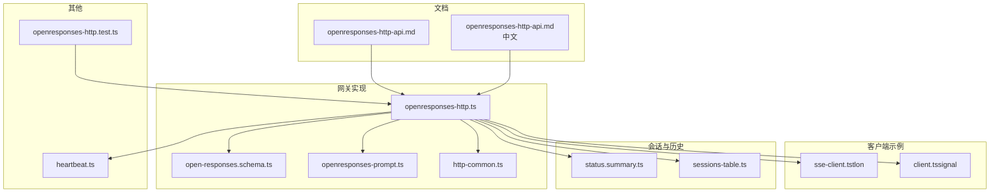
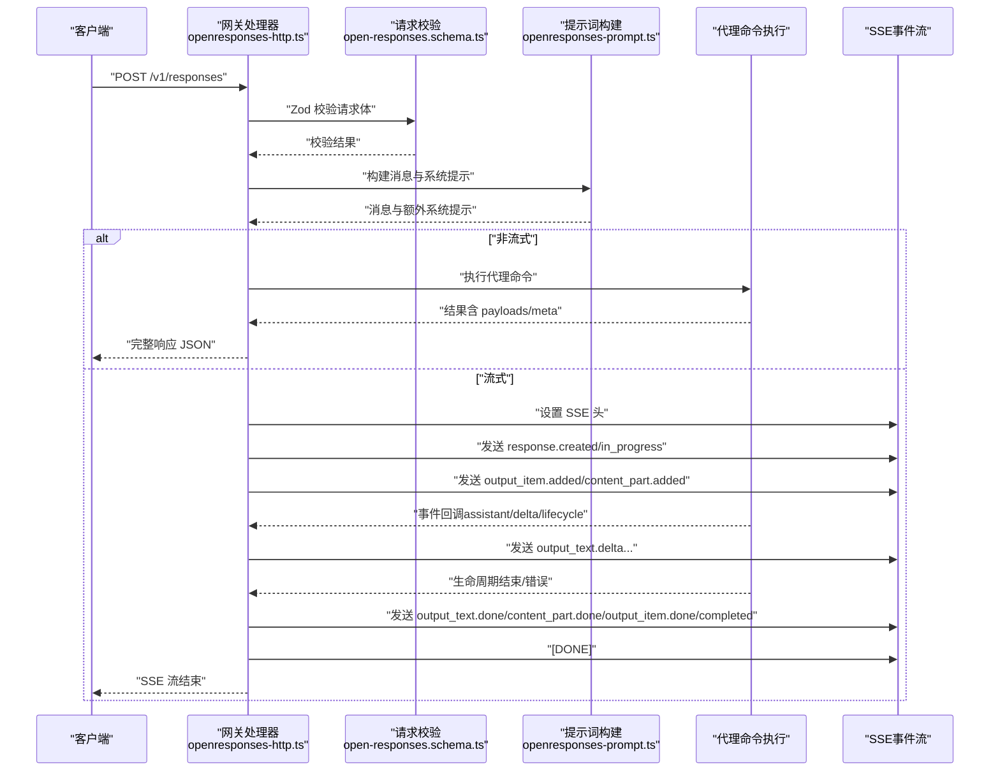
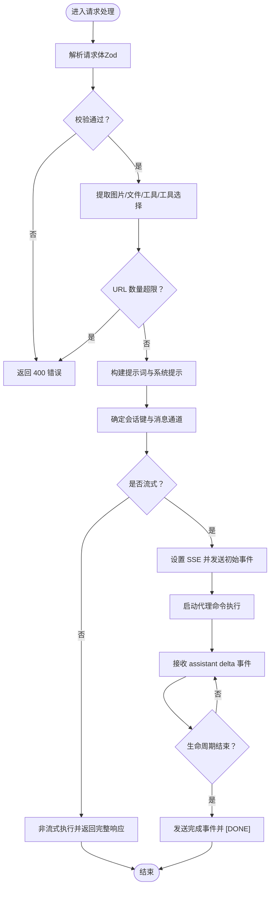
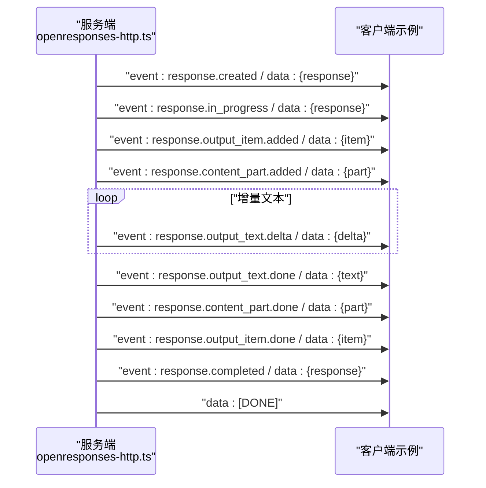
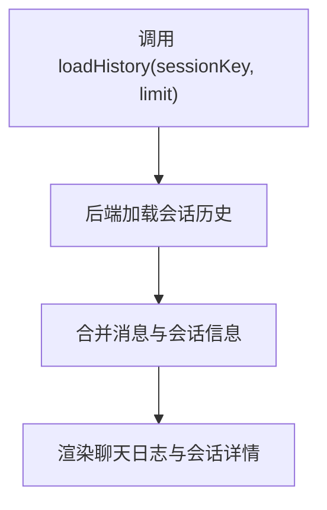
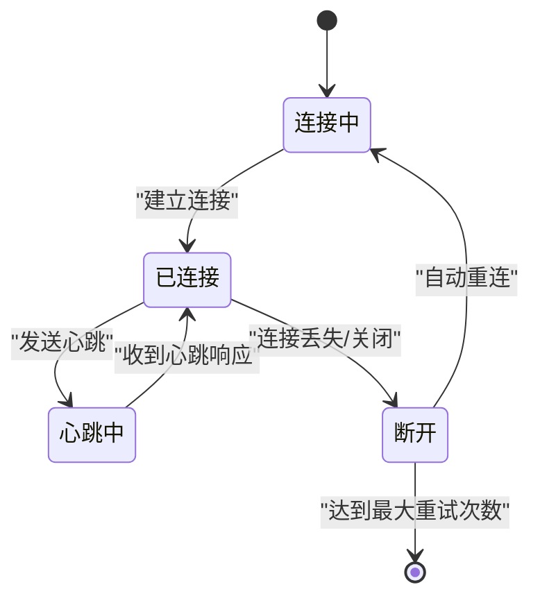
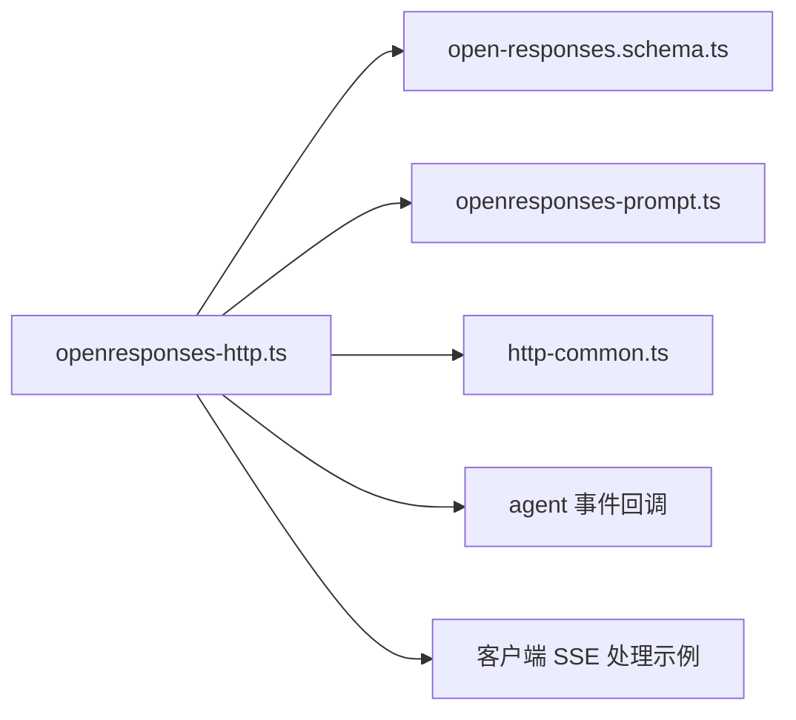

# 响应查询 API

<cite>
**本文引用的文件**
- [openresponses-http-api.md](file://docs/gateway/openresponses-http-api.md)
- [openresponses-http-api.md（中文）](file://docs/zh-CN/gateway/openresponses-http-api.md)
- [openresponses-http.ts](file://src/gateway/openresponses-http.ts)
- [open-responses.schema.ts](file://src/gateway/open-responses.schema.ts)
- [openresponses-prompt.ts](file://src/gateway/openresponses-prompt.ts)
- [http-common.ts](file://src/gateway/http-common.ts)
- [sse-client.ts（tlon）](file://extensions/tlon/src/urbit/sse-client.ts)
- [client.ts（signal）](file://extensions/signal/src/client.ts)
- [status.summary.ts](file://src/commands/status.summary.ts)
- [sessions-table.ts](file://src/commands/sessions-table.ts)
- [heartbeat.ts](file://src/auto-reply/heartbeat.ts)
- [openresponses-http.test.ts](file://src/gateway/openresponses-http.test.ts)
</cite>

## 目录
1. [简介](#简介)
2. [项目结构](#项目结构)
3. [核心组件](#核心组件)
4. [架构总览](#架构总览)
5. [详细组件分析](#详细组件分析)
6. [依赖关系分析](#依赖关系分析)
7. [性能考量](#性能考量)
8. [故障排查指南](#故障排查指南)
9. [结论](#结论)
10. [附录](#附录)

## 简介
本文件面向需要集成 OpenResponses 兼容 HTTP API 的开发者，系统性阐述响应查询 API 的设计与实现，重点覆盖以下方面：
- SSE（Server-Sent Events）连接管理与事件格式规范
- 状态查询接口、会话状态获取与响应历史管理
- 连接建立、心跳机制、断线重连与错误恢复策略
- 响应格式、事件类型与客户端集成要点
- 完整的 API 参考与最佳实践

该 API 由网关模块提供，端点为 POST /v1/responses，默认关闭，需在配置中启用。

## 项目结构
围绕响应查询 API 的相关文件主要分布在以下位置：
- 文档：docs/gateway/openresponses-http-api.md 与中文版本
- 网关实现：src/gateway/openresponses-http.ts
- 数据模型与校验：src/gateway/open-responses.schema.ts
- 提示词构建：src/gateway/openresponses-prompt.ts
- HTTP 通用能力：src/gateway/http-common.ts
- 客户端 SSE 处理示例：extensions/tlon/src/urbit/sse-client.ts、extensions/signal/src/client.ts
- 会话状态与历史：src/commands/status.summary.ts、src/commands/sessions-table.ts
- 心跳机制：src/auto-reply/heartbeat.ts
- 测试：src/gateway/openresponses-http.test.ts

图表来源
- [openresponses-http.ts:1-847](file://src/gateway/openresponses-http.ts#L1-L847)
- [open-responses.schema.ts:1-362](file://src/gateway/open-responses.schema.ts#L1-L362)
- [openresponses-prompt.ts:1-71](file://src/gateway/openresponses-prompt.ts#L1-L71)
- [http-common.ts:73-108](file://src/gateway/http-common.ts#L73-L108)
- [openresponses-http-api.md:1-294](file://docs/gateway/openresponses-http-api.md#L1-L294)
- [openresponses-http-api.md（中文）:1-318](file://docs/zh-CN/gateway/openresponses-http-api.md#L1-L318)
- [sse-client.ts（tlon）:205-302](file://extensions/tlon/src/urbit/sse-client.ts#L205-L302)
- [client.ts（signal）:159-215](file://extensions/signal/src/client.ts#L159-L215)
- [status.summary.ts:189-230](file://src/commands/status.summary.ts#L189-L230)
- [sessions-table.ts:38-71](file://src/commands/sessions-table.ts#L38-L71)
- [heartbeat.ts:1-172](file://src/auto-reply/heartbeat.ts#L1-L172)
- [openresponses-http.test.ts:143-183](file://src/gateway/openresponses-http.test.ts#L143-L183)

章节来源
- [openresponses-http.ts:1-847](file://src/gateway/openresponses-http.ts#L1-L847)
- [open-responses.schema.ts:1-362](file://src/gateway/open-responses.schema.ts#L1-L362)
- [openresponses-prompt.ts:1-71](file://src/gateway/openresponses-prompt.ts#L1-L71)
- [http-common.ts:73-108](file://src/gateway/http-common.ts#L73-L108)
- [openresponses-http-api.md:1-294](file://docs/gateway/openresponses-http-api.md#L1-L294)
- [openresponses-http-api.md（中文）:1-318](file://docs/zh-CN/gateway/openresponses-http-api.md#L1-L318)

## 核心组件
- 请求处理与路由
  - 网关通过统一的 JSON POST 处理器拦截 /v1/responses，进行鉴权、速率限制与请求体大小限制。
  - 使用 Zod 校验请求体结构，确保字段合法。
- 输入解析与预处理
  - 支持字符串或基于 item 的输入；解析 message、function_call_output、input_image、input_file 等。
  - 从 URL 或 base64 提取图片与文件内容，并注入到系统提示或上下文中。
  - 工具选择（tool_choice）支持 none/required/function，必要时生成额外系统提示。
- 会话与上下文
  - 默认按请求生成新会话键；若提供 user 字段则派生稳定会话键，便于跨请求共享会话。
  - 将 instructions、工具选择提示与文件内容拼接到系统提示中，增强上下文。
- 非流式与流式响应
  - 非流式：直接执行代理命令，聚合 payloads 返回完整响应。
  - 流式：设置 SSE 头，发送一系列事件，最终以 [DONE] 结束。
- 事件与响应资源
  - 事件类型覆盖 response.created、response.in_progress、response.output_item.added、response.content_part.added、response.output_text.delta、response.output_text.done、response.content_part.done、response.output_item.done、response.completed、response.failed。
  - 响应资源包含 id、object、created_at、status、model、output、usage、error 等字段。

章节来源
- [openresponses-http.ts:265-800](file://src/gateway/openresponses-http.ts#L265-L800)
- [open-responses.schema.ts:181-206](file://src/gateway/open-responses.schema.ts#L181-L206)
- [open-responses.schema.ts:284-361](file://src/gateway/open-responses.schema.ts#L284-L361)
- [openresponses-prompt.ts:25-70](file://src/gateway/openresponses-prompt.ts#L25-L70)
- [openresponses-http-api.md:227-247](file://docs/gateway/openresponses-http-api.md#L227-L247)

## 架构总览
下图展示从客户端到网关再到代理执行与事件分发的整体流程。

图表来源
- [openresponses-http.ts:265-800](file://src/gateway/openresponses-http.ts#L265-L800)
- [open-responses.schema.ts:181-206](file://src/gateway/open-responses.schema.ts#L181-L206)
- [openresponses-prompt.ts:25-70](file://src/gateway/openresponses-prompt.ts#L25-L70)

## 详细组件分析

### 组件一：请求处理与输入解析
- 路由与鉴权
  - 通过统一的 handleGatewayPostJsonEndpoint 拦截 /v1/responses，支持可信代理与速率限制。
  - 使用 Zod CreateResponseBodySchema 校验请求体，非法请求返回 400。
- 输入解析
  - 支持字符串或 ItemParam 数组；对 message、function_call_output、input_image、input_file 分别处理。
  - URL 来源的 input_image/input_file 会统计数量，超过 maxUrlParts 即报错。
  - 文件内容注入到系统提示（ephemeral），图片可同时注入到提示与视觉输入。
- 工具选择
  - tool_choice 支持 none/required/function；required 且未提供工具时报错；function 不存在时报错。
- 会话键与消息通道
  - 若提供 user，则派生稳定会话键；否则每次请求生成新会话键。
  - 默认消息通道为 webchat，可通过头部覆盖。

图表来源
- [openresponses-http.ts:265-800](file://src/gateway/openresponses-http.ts#L265-L800)
- [open-responses.schema.ts:181-206](file://src/gateway/open-responses.schema.ts#L181-L206)

章节来源
- [openresponses-http.ts:265-436](file://src/gateway/openresponses-http.ts#L265-L436)
- [open-responses.schema.ts:181-206](file://src/gateway/open-responses.schema.ts#L181-L206)

### 组件二：SSE 事件与客户端处理
- 服务端事件
  - Content-Type: text/event-stream；每条事件以 event: <type> 与 data: <json> 表示；流以 data: [DONE] 结束。
  - 事件类型：response.created、response.in_progress、response.output_item.added、response.content_part.added、response.output_text.delta、response.output_text.done、response.content_part.done、response.output_item.done、response.completed、response.failed。
- 客户端处理（tlon）
  - 逐块读取流，按 \n\n 切分事件；解析 id 与 data；跟踪事件 ID 并按阈值发送确认；解析 JSON 并分发到对应处理器。
- 客户端处理（signal）
  - 逐行解析 event/data/id；累积多行 data；遇到空行 flush 事件；调用回调 onEvent。

图表来源
- [openresponses-http.ts:61-64](file://src/gateway/openresponses-http.ts#L61-L64)
- [openresponses-http.ts:624-655](file://src/gateway/openresponses-http.ts#L624-L655)
- [openresponses-http.ts:657-692](file://src/gateway/openresponses-http.ts#L657-L692)
- [openresponses-http.ts:694-714](file://src/gateway/openresponses-http.ts#L694-L714)
- [open-responses.schema.ts:284-361](file://src/gateway/open-responses.schema.ts#L284-L361)
- [sse-client.ts（tlon）:205-302](file://extensions/tlon/src/urbit/sse-client.ts#L205-L302)
- [client.ts（signal）:159-215](file://extensions/signal/src/client.ts#L159-L215)

章节来源
- [openresponses-http.ts:61-64](file://src/gateway/openresponses-http.ts#L61-L64)
- [open-responses.schema.ts:284-361](file://src/gateway/open-responses.schema.ts#L284-L361)
- [sse-client.ts（tlon）:205-302](file://extensions/tlon/src/urbit/sse-client.ts#L205-L302)
- [client.ts（signal）:159-215](file://extensions/signal/src/client.ts#L159-L215)

### 组件三：状态查询与会话历史
- 状态摘要
  - 通过状态汇总接口可获取各代理的会话列表、最近更新时间、令牌用量等关键信息。
- 会话表格
  - 将内存中的会话存储转换为显示行，按 updatedAt 排序，便于前端展示。
- 历史加载
  - TUI 中通过 loadHistory 接口按 sessionKey 加载历史消息与会话元信息，支持 limit 控制。

图表来源
- [status.summary.ts:189-230](file://src/commands/status.summary.ts#L189-L230)
- [sessions-table.ts:42-71](file://src/commands/sessions-table.ts#L42-L71)
- [tui-session-actions.ts:288-322](file://src/tui/tui-session-actions.ts#L288-L322)

章节来源
- [status.summary.ts:189-230](file://src/commands/status.summary.ts#L189-L230)
- [sessions-table.ts:42-71](file://src/commands/sessions-table.ts#L42-L71)
- [tui-session-actions.ts:288-322](file://src/tui/tui-session-actions.ts#L288-L322)

### 组件四：心跳机制与断线重连
- 心跳
  - 系统内置心跳提示与默认周期，可判断内容是否“实质为空”以决定是否跳过心跳调用。
- 断线重连
  - 客户端示例展示了基于事件流的断开检测与自动重连逻辑；服务端侧通过 SSE keep-alive 与 [DONE] 结束保证连接健康。
- 错误恢复
  - 对网络类错误（如超时、连接被拒）进行分类，指导降级与重试策略。

图表来源
- [heartbeat.ts:1-172](file://src/auto-reply/heartbeat.ts#L1-L172)
- [sse-client.ts（tlon）:233-238](file://extensions/tlon/src/urbit/sse-client.ts#L233-L238)

章节来源
- [heartbeat.ts:1-172](file://src/auto-reply/heartbeat.ts#L1-L172)
- [sse-client.ts（tlon）:233-238](file://extensions/tlon/src/urbit/sse-client.ts#L233-L238)

## 依赖关系分析
- 组件耦合
  - openresponses-http.ts 依赖 open-responses.schema.ts（请求/响应与事件模式）、openresponses-prompt.ts（提示词构建）、http-common.ts（SSE 头与 [DONE] 写入）。
  - 事件通过 onAgentEvent 回调驱动，最终写入 SSE。
- 外部依赖
  - 客户端示例展示了标准的 SSE 流解析与事件分发，可作为集成参考。
- 循环依赖
  - 未见循环导入；模块职责清晰，数据流单向。

图表来源
- [openresponses-http.ts:1-847](file://src/gateway/openresponses-http.ts#L1-L847)
- [open-responses.schema.ts:1-362](file://src/gateway/open-responses.schema.ts#L1-L362)
- [openresponses-prompt.ts:1-71](file://src/gateway/openresponses-prompt.ts#L1-L71)
- [http-common.ts:73-108](file://src/gateway/http-common.ts#L73-L108)
- [sse-client.ts（tlon）:205-302](file://extensions/tlon/src/urbit/sse-client.ts#L205-L302)

章节来源
- [openresponses-http.ts:1-847](file://src/gateway/openresponses-http.ts#L1-L847)
- [open-responses.schema.ts:1-362](file://src/gateway/open-responses.schema.ts#L1-L362)
- [openresponses-prompt.ts:1-71](file://src/gateway/openresponses-prompt.ts#L1-L71)
- [http-common.ts:73-108](file://src/gateway/http-common.ts#L73-L108)

## 性能考量
- 流式传输
  - SSE 逐字节增量推送，降低首包延迟；客户端应尽快消费事件，避免阻塞。
- 令牌用量
  - usage 字段在底层提供者返回时填充，建议在流式场景中周期性上报或在完成事件中一次性获取。
- 限制与配额
  - 通过 maxBodyBytes、maxUrlParts、文件/图片大小与 MIME 白名单等参数控制资源消耗。
- 会话与历史
  - 历史加载支持 limit 控制，避免一次性拉取过多数据导致内存压力。

## 故障排查指南
- 常见错误
  - 401 缺失/无效认证；400 无效请求体；404 端点未启用或路径不匹配。
- 诊断步骤
  - 确认 gateway.http.endpoints.responses.enabled 已开启。
  - 检查 Authorization 头与模型选择头（model/x-openclaw-agent-id）。
  - 若使用流式，确认客户端正确处理 SSE 事件与 [DONE] 结束标记。
  - 若出现网络错误，检查代理与防火墙策略，结合心跳与重连策略定位问题。
- 单元测试参考
  - 测试覆盖了端点禁用、请求体校验失败等场景，可据此快速定位问题。

章节来源
- [openresponses-http-api.md:252-258](file://docs/gateway/openresponses-http-api.md#L252-L258)
- [openresponses-http.test.ts:143-183](file://src/gateway/openresponses-http.test.ts#L143-L183)

## 结论
响应查询 API 在保持 OpenResponses 兼容的同时，提供了灵活的输入形式、强大的工具调用能力与完善的 SSE 事件体系。通过合理的会话管理、事件分发与错误恢复策略，能够满足大多数实时对话与工具编排场景的需求。建议在生产环境中配合严格的速率限制、URL 白名单与资源上限配置，确保稳定性与安全性。

## 附录

### API 参考（POST /v1/responses）
- 端点
  - POST /v1/responses
  - 与网关相同端口（HTTP + WebSocket 复用）
- 认证与路由
  - Authorization: Bearer <token>
  - 选择代理：model: "openclaw:<agentId>" 或 x-openclaw-agent-id
  - 显式会话路由：x-openclaw-session-key
- 请求体（支持）
  - input: 字符串或 ItemParam 数组
  - instructions: 合并到系统提示
  - tools: 客户端工具定义
  - tool_choice: none/required/function
  - stream: 是否启用 SSE
  - max_output_tokens: 最佳努力输出限制
  - user: 稳定会话路由
- 请求体（接受但忽略）
  - max_tool_calls、reasoning、metadata、store、previous_response_id、truncation
- 响应
  - 非流式：完整 ResponseResource
  - 流式：SSE 事件流，以 [DONE] 结束
- 错误
  - JSON 对象：{ "error": { "message": "...", "type": "invalid_request_error" } }
  - 常见：401 缺失/无效认证；400 无效请求体；405 方法错误

章节来源
- [openresponses-http-api.md:15-30](file://docs/gateway/openresponses-http-api.md#L15-L30)
- [openresponses-http-api.md:39-59](file://docs/gateway/openresponses-http-api.md#L39-L59)
- [openresponses-http-api.md:252-258](file://docs/gateway/openresponses-http-api.md#L252-L258)
- [open-responses.schema.ts:181-206](file://src/gateway/open-responses.schema.ts#L181-L206)
- [open-responses.schema.ts:264-281](file://src/gateway/open-responses.schema.ts#L264-L281)

### 事件类型与格式
- 事件类型
  - response.created、response.in_progress、response.output_item.added、response.content_part.added、response.output_text.delta、response.output_text.done、response.content_part.done、response.output_item.done、response.completed、response.failed
- 事件格式
  - event: <type>
  - data: <JSON>
  - 流结束：data: [DONE]

章节来源
- [openresponses-http-api.md:227-247](file://docs/gateway/openresponses-http-api.md#L227-L247)
- [open-responses.schema.ts:284-361](file://src/gateway/open-responses.schema.ts#L284-L361)

### 客户端集成要点
- SSE 解析
  - 按行解析 event/data/id；累积多行 data；遇到空行 flush 事件。
- 断线重连
  - 检测流结束与异常，按指数退避策略重连；服务端侧保持 keep-alive 与 [DONE] 结束。
- 事件分发
  - 根据事件类型与 id 将增量文本与最终完成事件分发到 UI 或业务逻辑。

章节来源
- [client.ts（signal）:159-215](file://extensions/signal/src/client.ts#L159-L215)
- [sse-client.ts（tlon）:205-302](file://extensions/tlon/src/urbit/sse-client.ts#L205-L302)