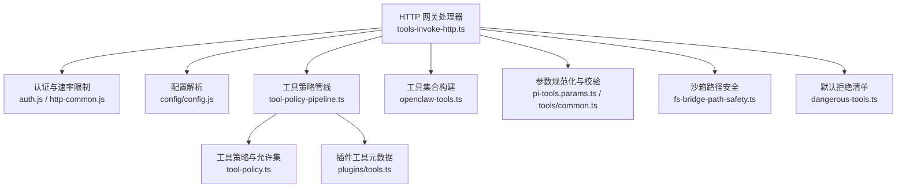
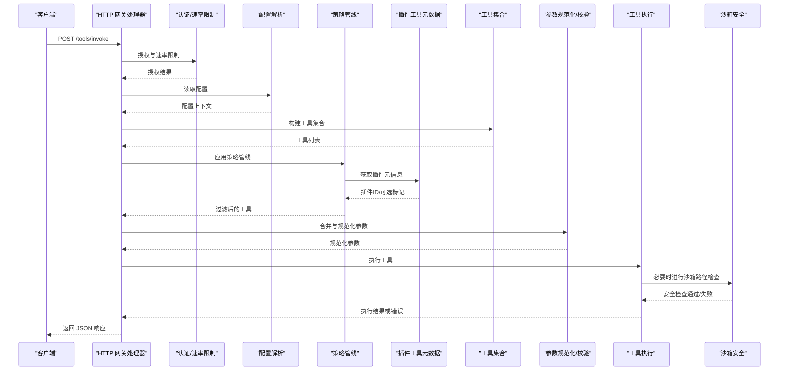
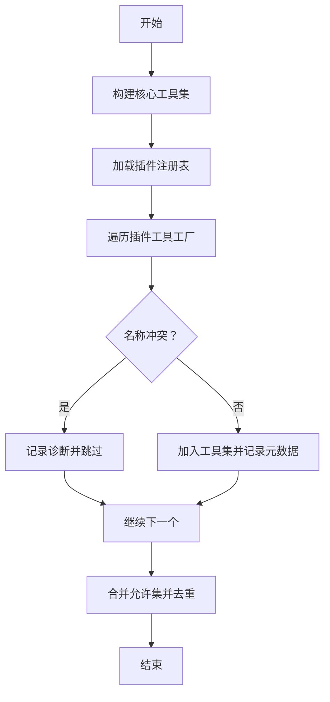
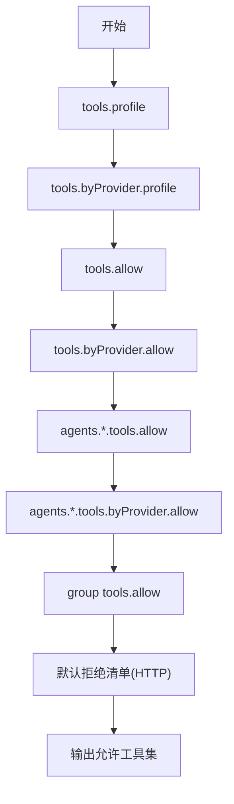
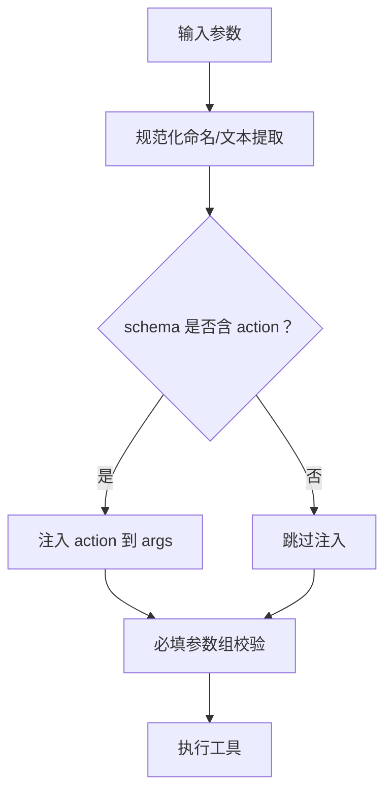
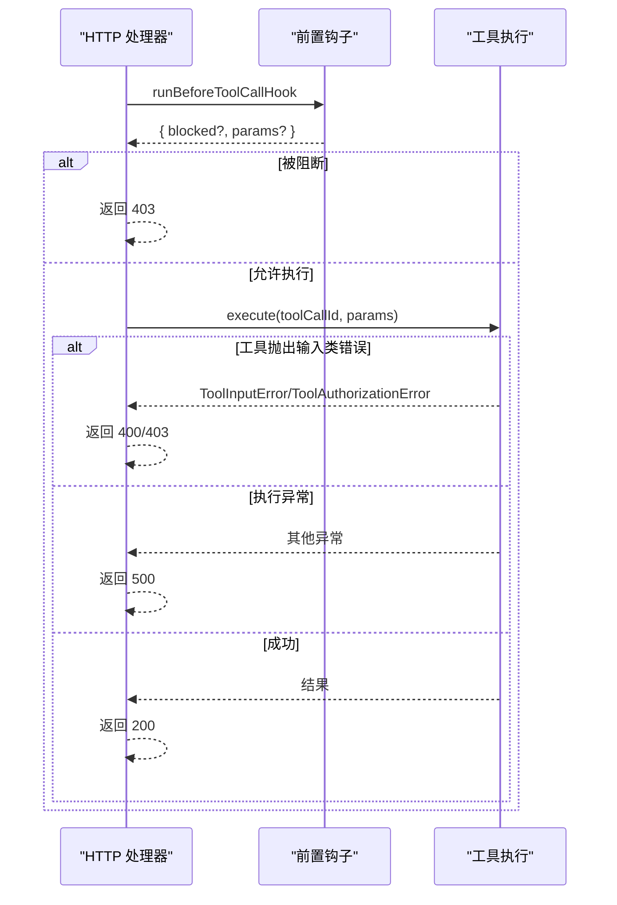
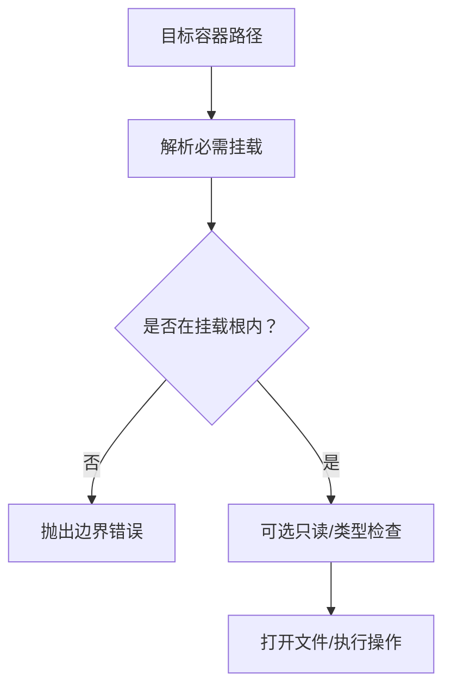
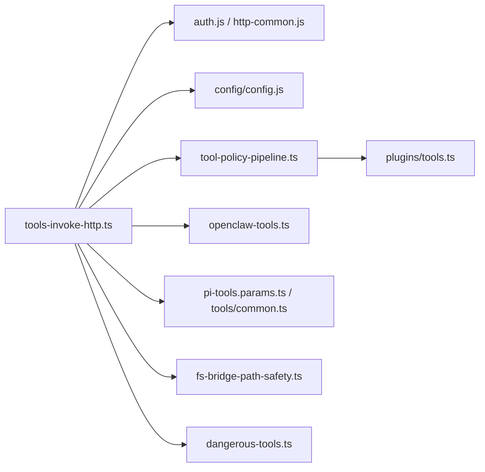

# 工具调用 API

<cite>
**本文引用的文件**
- [tools-invoke-http.ts](file://src/gateway/tools-invoke-http.ts)
- [tools-invoke-http-api.md](file://docs/gateway/tools-invoke-http-api.md)
- [openclaw-tools.ts](file://src/agents/openclaw-tools.ts)
- [tools.ts](file://src/plugins/tools.ts)
- [pi-tools.params.ts](file://src/agents/pi-tools.params.ts)
- [common.ts](file://src/agents/tools/common.ts)
- [dangerous-tools.ts](file://src/security/dangerous-tools.ts)
- [fs-bridge-path-safety.ts](file://src/agents/sandbox/fs-bridge-path-safety.ts)
- [tool-policy-pipeline.ts](file://src/agents/tool-policy-pipeline.ts)
- [tool-policy.ts](file://src/agents/tool-policy.ts)
</cite>

## 目录
1. [简介](#简介)
2. [项目结构](#项目结构)
3. [核心组件](#核心组件)
4. [架构总览](#架构总览)
5. [详细组件分析](#详细组件分析)
6. [依赖关系分析](#依赖关系分析)
7. [性能考量](#性能考量)
8. [故障排查指南](#故障排查指南)
9. [结论](#结论)
10. [附录](#附录)

## 简介
本文件面向需要通过 HTTP 直接调用工具（非完整代理回合）的开发者与集成方，系统性阐述“工具调用 HTTP API”的实现与使用方式。内容覆盖工具发现机制、参数验证流程、执行接口规范、请求/响应格式、错误处理策略、权限控制、沙箱安全边界、执行超时管理、工具注册与动态加载、以及版本化与兼容性注意事项。

## 项目结构
该能力由网关层 HTTP 处理器、工具构建与筛选、策略管线、参数规范化与校验、沙箱路径安全检查等模块协同完成。下图给出与本主题直接相关的模块关系映射。

**图表来源**
- [tools-invoke-http.ts:136-360](file://src/gateway/tools-invoke-http.ts#L136-L360)
- [tool-policy-pipeline.ts:66-88](file://src/agents/tool-policy-pipeline.ts#L66-L88)
- [tool-policy.ts:75-92](file://src/agents/tool-policy.ts#L75-L92)
- [tools.ts:45-142](file://src/plugins/tools.ts#L45-L142)
- [openclaw-tools.ts:30-241](file://src/agents/openclaw-tools.ts#L30-L241)
- [pi-tools.params.ts:85-115](file://src/agents/pi-tools.params.ts#L85-L115)
- [common.ts:27-43](file://src/agents/tools/common.ts#L27-L43)
- [fs-bridge-path-safety.ts:47-280](file://src/agents/sandbox/fs-bridge-path-safety.ts#L47-L280)
- [dangerous-tools.ts:9-20](file://src/security/dangerous-tools.ts#L9-L20)

**章节来源**
- [tools-invoke-http.ts:136-360](file://src/gateway/tools-invoke-http.ts#L136-L360)
- [tools-invoke-http-api.md:1-111](file://docs/gateway/tools-invoke-http-api.md#L1-L111)

## 核心组件
- HTTP 入口与路由：负责匹配 /tools/invoke 路径、方法校验、读取并解析请求体、限流与认证。
- 工具发现与构建：聚合核心工具与插件工具，按策略允许集进行过滤。
- 策略与权限：多级策略管线（profile/provider/global/agent/group/subagent），叠加默认拒绝清单。
- 参数规范化与校验：统一参数命名、必填校验、文本提取与规范化。
- 执行与错误处理：钩子前置检查、工具执行、输入错误与执行异常分类返回。
- 沙箱安全：路径边界检查、只读约束、符号链接与锚定路径解析。
- 默认拒绝清单：对高风险工具在 HTTP 表面默认禁用，并支持自定义扩展。

**章节来源**
- [tools-invoke-http.ts:136-360](file://src/gateway/tools-invoke-http.ts#L136-L360)
- [openclaw-tools.ts:30-241](file://src/agents/openclaw-tools.ts#L30-L241)
- [tool-policy-pipeline.ts:18-63](file://src/agents/tool-policy-pipeline.ts#L18-L63)
- [tool-policy.ts:75-92](file://src/agents/tool-policy.ts#L75-L92)
- [pi-tools.params.ts:85-115](file://src/agents/pi-tools.params.ts#L85-L115)
- [common.ts:27-43](file://src/agents/tools/common.ts#L27-L43)
- [fs-bridge-path-safety.ts:47-141](file://src/agents/sandbox/fs-bridge-path-safety.ts#L47-L141)
- [dangerous-tools.ts:9-20](file://src/security/dangerous-tools.ts#L9-L20)

## 架构总览
下图展示一次 /tools/invoke 请求从接入到执行的关键步骤与模块交互。

**图表来源**
- [tools-invoke-http.ts:136-360](file://src/gateway/tools-invoke-http.ts#L136-L360)
- [tool-policy-pipeline.ts:66-88](file://src/agents/tool-policy-pipeline.ts#L66-L88)
- [tools.ts:45-142](file://src/plugins/tools.ts#L45-L142)
- [openclaw-tools.ts:30-241](file://src/agents/openclaw-tools.ts#L30-L241)
- [pi-tools.params.ts:85-115](file://src/agents/pi-tools.params.ts#L85-L115)
- [common.ts:214-225](file://src/agents/tools/common.ts#L214-L225)
- [fs-bridge-path-safety.ts:47-141](file://src/agents/sandbox/fs-bridge-path-safety.ts#L47-L141)

## 详细组件分析

### HTTP 接口规范与请求/响应
- 终端地址：POST /tools/invoke
- 认证：Bearer Token；支持速率限制与回退 IP 解析
- 请求体字段
  - tool（字符串，必填）：目标工具名
  - action（字符串，可选）：当工具 schema 支持时自动注入到 args.action
  - args（对象，可选）：工具特定参数
  - sessionKey（字符串，可选）：会话键，默认使用主会话
  - dryRun（布尔，可选）：保留字段，当前忽略
- 响应
  - 200：成功，返回 { ok: true, result }
  - 400：无效请求或工具输入错误，返回 { ok: false, error: { type, message } }
  - 401：未授权
  - 429：认证速率受限（带 Retry-After）
  - 404：工具不可用（未找到或不在白名单）
  - 405：方法不允许
  - 500：工具执行异常（消息已清洗）

**章节来源**
- [tools-invoke-http-api.md:13-111](file://docs/gateway/tools-invoke-http-api.md#L13-L111)
- [tools-invoke-http.ts:136-360](file://src/gateway/tools-invoke-http.ts#L136-L360)

### 工具发现与动态加载
- 工具来源
  - 核心工具：由 openclaw-tools 构建，包含浏览器、节点、会话、消息、TTS、网关、Web 搜索/抓取、图像/PDF 等
  - 插件工具：通过插件加载器扫描注册表，工厂函数产出工具列表，去重与冲突检测
- 允许集与去重
  - 使用 collectExplicitAllowlist 收集多级策略中的 allow 列表
  - 对插件工具按 pluginId/名称去重，避免与核心工具同名冲突
- 元数据
  - 通过 getPluginToolMeta 为工具附加 pluginId 与 optional 标记，便于策略分组与过滤

**图表来源**
- [openclaw-tools.ts:219-241](file://src/agents/openclaw-tools.ts#L219-L241)
- [tools.ts:45-142](file://src/plugins/tools.ts#L45-L142)

**章节来源**
- [openclaw-tools.ts:30-241](file://src/agents/openclaw-tools.ts#L30-L241)
- [tools.ts:45-142](file://src/plugins/tools.ts#L45-L142)

### 权限控制与策略管线
- 策略层级（按优先级）
  - tools.profile / tools.byProvider.profile
  - tools.allow / tools.byProvider.allow
  - agents.<id>.tools.allow / agents.<id>.tools.byProvider.allow
  - group 策略（基于 sessionKey 映射的群组/频道）
  - subagent 策略（当 sessionKey 为子代理）
- 默认拒绝清单（HTTP 表面）
  - sessions_spawn、sessions_send、gateway、whatsapp_login 等
  - 可通过 gateway.tools.deny/gateway.tools.allow 自定义
- 策略应用
  - buildDefaultToolPolicyPipelineSteps 定义步骤
  - applyToolPolicyPipeline 逐级过滤工具
  - stripPluginOnlyAllowlist 防止仅插件工具的 allowlist 导致核心工具被意外屏蔽

**图表来源**
- [tool-policy-pipeline.ts:18-63](file://src/agents/tool-policy-pipeline.ts#L18-L63)
- [tool-policy.ts:75-92](file://src/agents/tool-policy.ts#L75-L92)
- [dangerous-tools.ts:9-20](file://src/security/dangerous-tools.ts#L9-L20)

**章节来源**
- [tool-policy-pipeline.ts:18-63](file://src/agents/tool-policy-pipeline.ts#L18-L63)
- [tool-policy.ts:75-92](file://src/agents/tool-policy.ts#L75-L92)
- [dangerous-tools.ts:9-20](file://src/security/dangerous-tools.ts#L9-L20)

### 参数验证与规范化
- 命名与别名
  - 将 Claude Code 约定（如 file_path、old_string、new_string）映射到内部约定（path、oldText、newText）
  - 若 schema 支持 action 字段，且 args 未显式提供，则将 action 注入 args
- 必填参数组
  - 提供通用 RequiredParamGroup 机制，用于校验一组互斥键中至少满足一个
- 执行前包装
  - wrapToolParamNormalization 在执行前统一规范化与必填校验

**图表来源**
- [pi-tools.params.ts:85-115](file://src/agents/pi-tools.params.ts#L85-L115)
- [pi-tools.params.ts:168-204](file://src/agents/pi-tools.params.ts#L168-L204)
- [pi-tools.params.ts:207-225](file://src/agents/pi-tools.params.ts#L207-L225)

**章节来源**
- [pi-tools.params.ts:85-115](file://src/agents/pi-tools.params.ts#L85-L115)
- [pi-tools.params.ts:168-204](file://src/agents/pi-tools.params.ts#L168-L204)
- [pi-tools.params.ts:207-225](file://src/agents/pi-tools.params.ts#L207-L225)

### 执行接口与错误处理
- 钩子前置检查
  - runBeforeToolCallHook 在执行前进行阻断判定与参数透传
- 错误分类
  - ToolInputError/ToolAuthorizationError：映射为 400/403 并携带类型与消息
  - 其他异常：返回 500，消息已清洗
- 输入状态解析
  - resolveToolInputErrorStatus 统一识别工具输入类错误并返回对应状态码

**图表来源**
- [tools-invoke-http.ts:315-357](file://src/gateway/tools-invoke-http.ts#L315-L357)
- [common.ts:27-43](file://src/agents/tools/common.ts#L27-L43)

**章节来源**
- [tools-invoke-http.ts:315-357](file://src/gateway/tools-invoke-http.ts#L315-L357)
- [common.ts:27-43](file://src/agents/tools/common.ts#L27-L43)

### 沙箱安全边界
- 路径边界检查
  - SandboxFsPathGuard 保证访问路径位于挂载根内，防止逃逸
  - 支持只读约束、类型约束（如目录）、符号链接处理策略
- 锚定与固定路径
  - 提供 resolveAnchoredSandboxEntry/resolvePinnedEntry 等方法，确保路径解析稳定
- 文件打开边界
  - openBoundaryFile 限定宿主机路径必须在指定挂载根内

**图表来源**
- [fs-bridge-path-safety.ts:110-141](file://src/agents/sandbox/fs-bridge-path-safety.ts#L110-L141)
- [fs-bridge-path-safety.ts:143-160](file://src/agents/sandbox/fs-bridge-path-safety.ts#L143-L160)

**章节来源**
- [fs-bridge-path-safety.ts:47-280](file://src/agents/sandbox/fs-bridge-path-safety.ts#L47-L280)

### 版本管理与兼容性
- 工具参数兼容
  - patchToolSchemaForClaudeCompatibility 与 normalizeToolParams 适配不同模型/提供者的参数风格差异
- 测试环境隔离
  - 在测试环境中对部分内存工具进行禁用提示，避免误用
- 插件生态
  - 插件工具通过工厂函数动态注册，允许按需启用/禁用与去重

**章节来源**
- [pi-tools.params.ts:117-166](file://src/agents/pi-tools.params.ts#L117-L166)
- [tools-invoke-http.ts:184-199](file://src/gateway/tools-invoke-http.ts#L184-L199)
- [tools.ts:45-142](file://src/plugins/tools.ts#L45-L142)

## 依赖关系分析
- 模块耦合
  - HTTP 层依赖认证、配置、策略、工具构建与参数校验
  - 策略层依赖插件元数据与工具集合，形成“策略→工具”的过滤链
  - 沙箱层独立于执行逻辑，但被工具执行可能间接调用
- 外部依赖
  - Node 内置模块（fs、path、http）与第三方媒体/类型检测工具（在工具内部使用）
- 循环依赖
  - 当前设计以“单向依赖”为主：HTTP 层→策略层→工具层→执行层，未见循环

**图表来源**
- [tools-invoke-http.ts:1-37](file://src/gateway/tools-invoke-http.ts#L1-L37)
- [tool-policy-pipeline.ts:1-11](file://src/agents/tool-policy-pipeline.ts#L1-L11)
- [tools.ts:1-9](file://src/plugins/tools.ts#L1-L9)
- [openclaw-tools.ts:1-28](file://src/agents/openclaw-tools.ts#L1-L28)
- [pi-tools.params.ts:1-7](file://src/agents/pi-tools.params.ts#L1-L7)
- [common.ts:1-6](file://src/agents/tools/common.ts#L1-L6)
- [fs-bridge-path-safety.ts:1-7](file://src/agents/sandbox/fs-bridge-path-safety.ts#L1-L7)
- [dangerous-tools.ts:1-3](file://src/security/dangerous-tools.ts#L1-L3)

**章节来源**
- [tools-invoke-http.ts:1-37](file://src/gateway/tools-invoke-http.ts#L1-L37)
- [tool-policy-pipeline.ts:1-11](file://src/agents/tool-policy-pipeline.ts#L1-L11)
- [tools.ts:1-9](file://src/plugins/tools.ts#L1-L9)
- [openclaw-tools.ts:1-28](file://src/agents/openclaw-tools.ts#L1-L28)
- [pi-tools.params.ts:1-7](file://src/agents/pi-tools.params.ts#L1-L7)
- [common.ts:1-6](file://src/agents/tools/common.ts#L1-L6)
- [fs-bridge-path-safety.ts:1-7](file://src/agents/sandbox/fs-bridge-path-safety.ts#L1-L7)
- [dangerous-tools.ts:1-3](file://src/security/dangerous-tools.ts#L1-L3)

## 性能考量
- 请求体大小限制：默认 2MB，可通过构造参数调整
- 工具构建热路径优化：在插件禁用时快速短路，避免不必要的插件发现
- 策略过滤批量化：一次性收集 allow 列表并去重，减少重复计算
- 参数规范化最小化：仅在必要时进行文本提取与规范化
- 沙箱检查按需触发：仅在工具执行涉及文件系统操作时进行边界检查

[本节为通用指导，不直接分析具体文件]

## 故障排查指南
- 400/403/404/500
  - 400：检查请求体字段与工具参数是否符合 schema；确认 action 注入是否正确
  - 403：确认前置钩子是否阻断；检查 ownerOnly 工具与发送者权限
  - 404：确认工具名拼写与策略允许集；检查默认拒绝清单
  - 500：查看日志中的执行异常摘要（消息已清洗）
- 429
  - 速率限制触发，等待 Retry-After 后重试
- 401
  - Bearer Token 缺失或无效；检查网关认证模式与令牌
- 沙箱路径错误
  - 确认访问路径位于挂载根内，避免符号链接逃逸或只读挂载写入

**章节来源**
- [tools-invoke-http.ts:117-134](file://src/gateway/tools-invoke-http.ts#L117-L134)
- [tools-invoke-http.ts:343-357](file://src/gateway/tools-invoke-http.ts#L343-L357)
- [fs-bridge-path-safety.ts:110-141](file://src/agents/sandbox/fs-bridge-path-safety.ts#L110-L141)

## 结论
“工具调用 HTTP API”在保持简单易用的同时，通过严格的策略管线、参数规范化与沙箱安全边界，提供了可控、可观测、可扩展的工具执行通道。建议在生产环境：
- 明确各层级策略与默认拒绝清单
- 使用钩子与 ownerOnly 限制敏感工具
- 对高风险工具仅在必要场景开放
- 关注参数 schema 与 action 注入一致性
- 在工具执行前进行充分的参数校验与预检查

[本节为总结性内容，不直接分析具体文件]

## 附录

### API 参考（请求/响应）
- 终端：POST /tools/invoke
- 认证：Authorization: Bearer <token>
- 请求体字段
  - tool（字符串，必填）
  - action（字符串，可选）
  - args（对象，可选）
  - sessionKey（字符串，可选）
  - dryRun（布尔，可选）
- 响应状态
  - 200：{ ok: true, result }
  - 400：{ ok: false, error: { type, message } }
  - 401：未授权
  - 429：速率受限（带 Retry-After）
  - 404：工具不可用
  - 405：方法不允许
  - 500：执行异常（消息已清洗）

**章节来源**
- [tools-invoke-http-api.md:13-111](file://docs/gateway/tools-invoke-http-api.md#L13-L111)

### 示例（集成要点）
- 使用 curl 发送请求，设置 Authorization 与 Content-Type
- 通过 x-openclaw-* 头传递消息渠道/账号上下文，辅助策略解析
- 注意默认拒绝清单与自定义 deny/allow 配置

**章节来源**
- [tools-invoke-http-api.md:89-111](file://docs/gateway/tools-invoke-http-api.md#L89-L111)