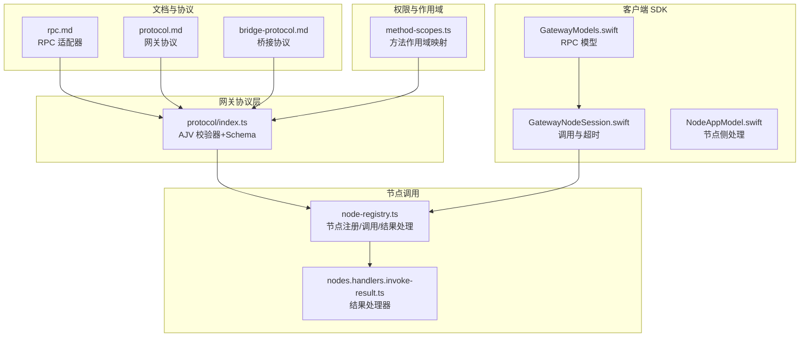
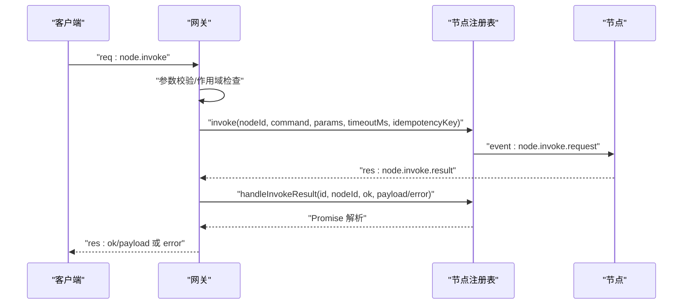
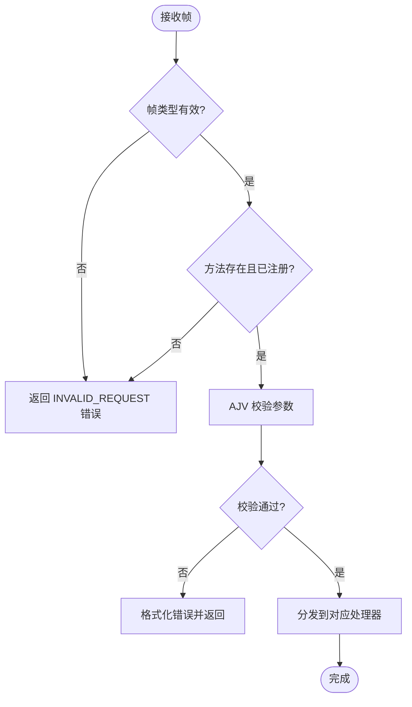
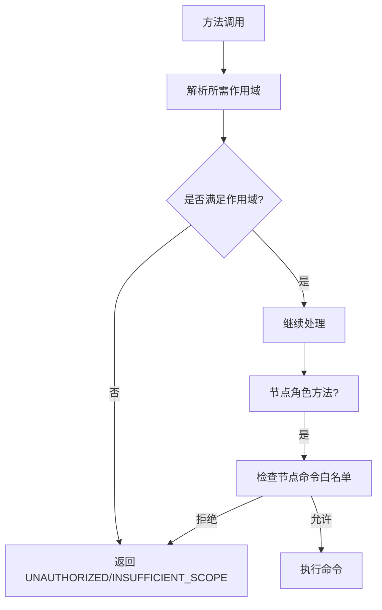
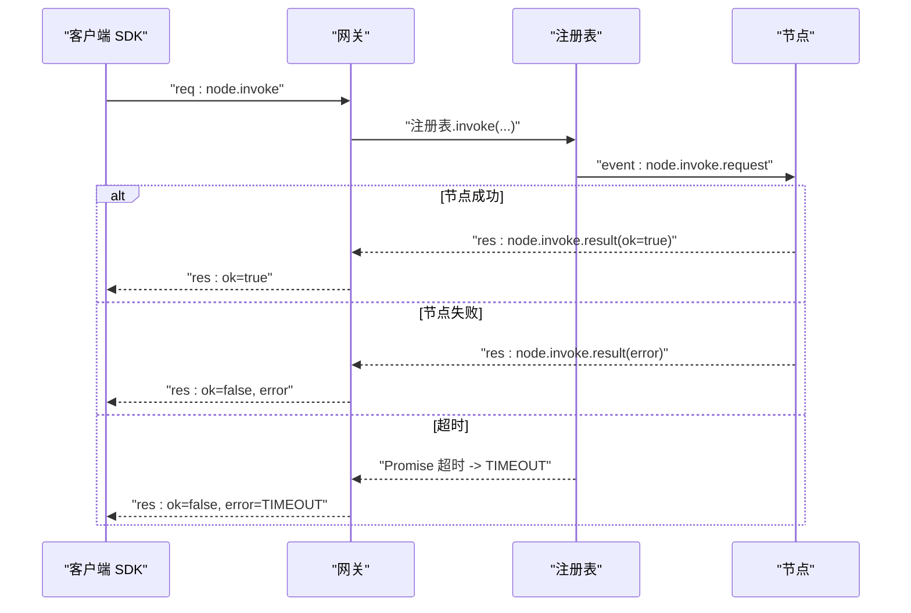
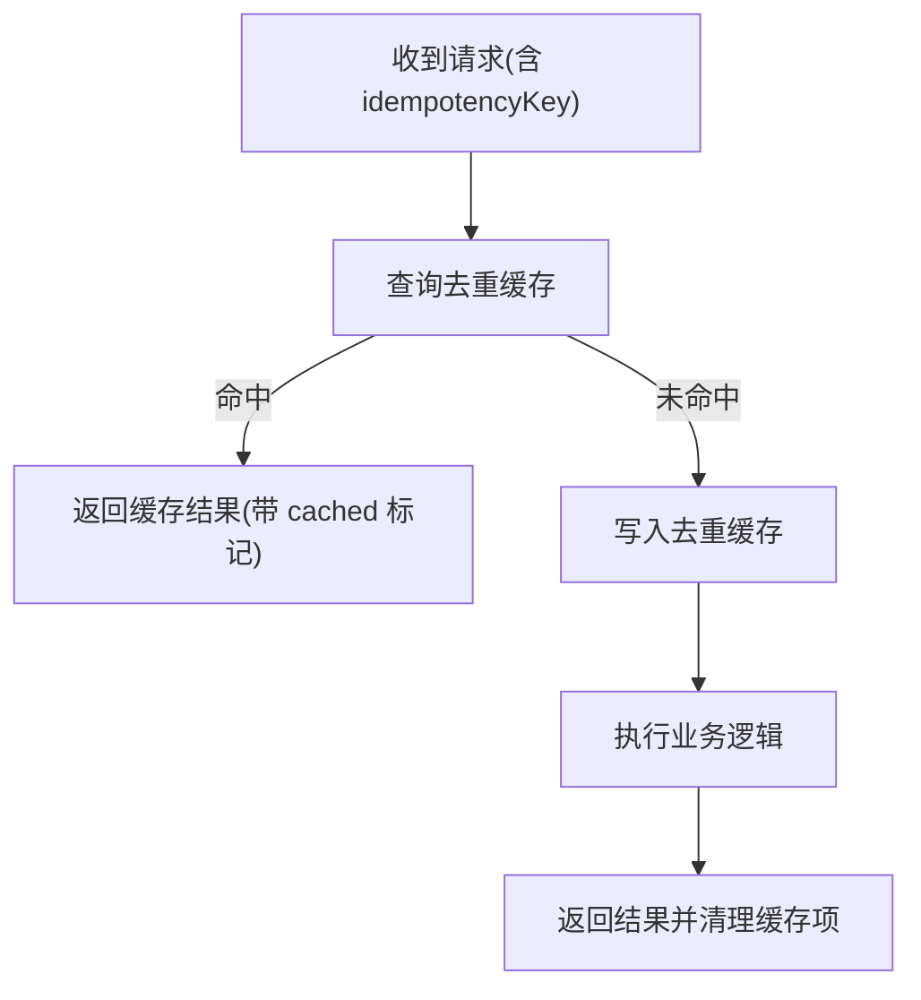
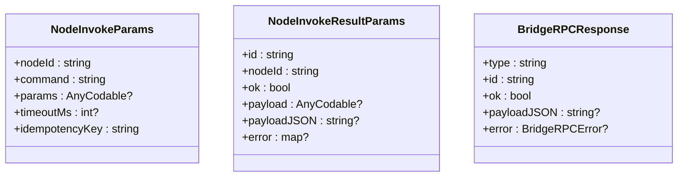
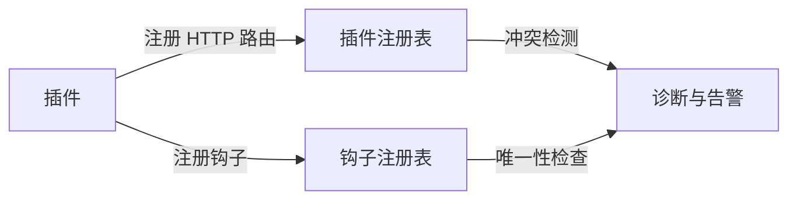
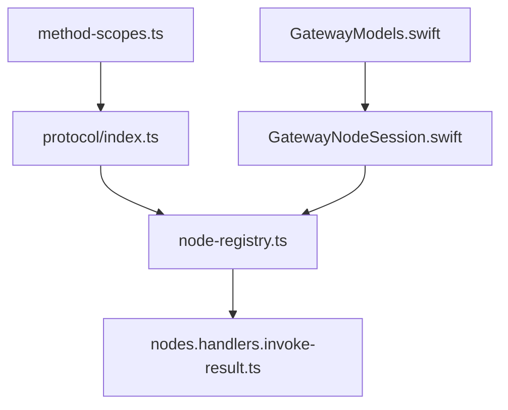

# RPC 调用协议

<cite>
**本文引用的文件**
- [rpc.md](file://docs/reference/rpc.md)
- [protocol.md](file://docs/gateway/protocol.md)
- [bridge-protocol.md](file://docs/gateway/bridge-protocol.md)
- [index.ts](file://src/gateway/protocol/index.ts)
- [node-registry.ts](file://src/gateway/node-registry.ts)
- [nodes.handlers.invoke-result.ts](file://src/gateway/server-methods/nodes.handlers.invoke-result.ts)
- [nodes.handlers.invoke-result.test.ts](file://apps/android/app/src/test/java/ai/openclaw/app/gateway/GatewaySessionInvokeTest.kt)
- [GatewayModels.swift](file://apps/shared/OpenClawKit/Sources/OpenClawProtocol/GatewayModels.swift)
- [GatewayNodeSession.swift](file://apps/shared/OpenClawKit/Sources/OpenClawKit/GatewayNodeSession.swift)
- [NodeAppModel.swift](file://apps/ios/Sources/Model/NodeAppModel.swift)
- [method-scopes.ts](file://src/gateway/method-scopes.ts)
- [server.auth.default-token.suite.ts](file://src/gateway/server.auth.default-token.suite.ts)
- [send.ts](file://src/gateway/server-methods/send.ts)
- [dedupe.test.ts](file://src/infra/dedupe.test.ts)
- [http-utils.ts](file://src/gateway/http-utils.ts)
</cite>

## 目录
1. [引言](#引言)
2. [项目结构](#项目结构)
3. [核心组件](#核心组件)
4. [架构总览](#架构总览)
5. [详细组件分析](#详细组件分析)
6. [依赖关系分析](#依赖关系分析)
7. [性能考量](#性能考量)
8. [故障排查指南](#故障排查指南)
9. [结论](#结论)
10. [附录](#附录)

## 引言
本文件系统化阐述 OpenClaw 的 RPC 调用协议与实现，覆盖请求/响应格式、参数校验、方法注册与权限作用域、异步调用与超时管理、幂等性键与重复请求防护、错误传播与一致性保障、调试与可观测性，以及方法扩展、插件集成与向后兼容策略。目标读者既包括需要对接或扩展 RPC 表面的开发者，也包括希望理解内部工作机制的运维与测试人员。

## 项目结构
围绕 RPC 协议的关键目录与文件：
- 文档层：参考 RPC 适配器、网关协议与桥接协议文档，定义了帧模型、握手流程、版本与安全策略。
- 网关协议层：通过 AJV 校验器生成的类型与校验函数，统一请求/响应/事件帧的结构与字段约束。
- 节点注册与调用：节点会话注册、待处理调用队列、超时与结果回传。
- 客户端 SDK：跨平台（Swift/Android/iOS）对 RPC 模型与调用流程的封装。
- 权限与作用域：方法级作用域映射、管理员方法前缀、设备令牌与配对策略。
- 插件与扩展：HTTP 路由注册、钩子注册、插件请求处理与冲突检测。
- 可靠性与去重：通用去重缓存、幂等键在具体方法中的应用。

**图表来源**
- [rpc.md:1-44](file://docs/reference/rpc.md#L1-L44)
- [protocol.md:1-268](file://docs/gateway/protocol.md#L1-L268)
- [bridge-protocol.md:1-92](file://docs/gateway/bridge-protocol.md#L1-L92)
- [index.ts:1-673](file://src/gateway/protocol/index.ts#L1-L673)
- [node-registry.ts:1-210](file://src/gateway/node-registry.ts#L1-L210)
- [nodes.handlers.invoke-result.ts:1-71](file://src/gateway/server-methods/nodes.handlers.invoke-result.ts#L1-L71)
- [GatewayModels.swift:859-921](file://apps/shared/OpenClawKit/Sources/OpenClawProtocol/GatewayModels.swift#L859-L921)
- [GatewayNodeSession.swift:120-155](file://apps/shared/OpenClawKit/Sources/OpenClawKit/GatewayNodeSession.swift#L120-L155)
- [NodeAppModel.swift:2014-2023](file://apps/ios/Sources/Model/NodeAppModel.swift#L2014-L2023)
- [method-scopes.ts:136-181](file://src/gateway/method-scopes.ts#L136-L181)

**章节来源**
- [rpc.md:1-44](file://docs/reference/rpc.md#L1-L44)
- [protocol.md:1-268](file://docs/gateway/protocol.md#L1-L268)
- [bridge-protocol.md:1-92](file://docs/gateway/bridge-protocol.md#L1-L92)
- [index.ts:1-673](file://src/gateway/protocol/index.ts#L1-L673)

## 核心组件
- 请求/响应/事件帧模型与校验：基于 TypeBox Schema 生成的 AJV 校验器，确保所有 RPC 参数合法。
- 节点调用生命周期：从发起调用、等待结果到超时/断连处理。
- 幂等性与重复请求防护：通过幂等键去重与去重缓存避免重复执行。
- 权限与作用域：方法级作用域映射、管理员方法前缀、设备令牌与配对。
- 插件扩展：HTTP 路由注册、钩子注册、插件请求处理。
- 跨平台模型：共享 Swift 模型与各端调用封装。

**章节来源**
- [index.ts:253-458](file://src/gateway/protocol/index.ts#L253-L458)
- [node-registry.ts:107-155](file://src/gateway/node-registry.ts#L107-L155)
- [GatewayModels.swift:859-921](file://apps/shared/OpenClawKit/Sources/OpenClawProtocol/GatewayModels.swift#L859-L921)
- [method-scopes.ts:136-181](file://src/gateway/method-scopes.ts#L136-L181)

## 架构总览
下图展示从客户端发起 RPC 到节点执行与结果回传的端到端流程，以及权限作用域与去重防护的横切关注点。

**图表来源**
- [protocol.md:127-134](file://docs/gateway/protocol.md#L127-L134)
- [index.ts:302-305](file://src/gateway/protocol/index.ts#L302-L305)
- [node-registry.ts:107-155](file://src/gateway/node-registry.ts#L107-L155)
- [nodes.handlers.invoke-result.ts:25-71](file://src/gateway/server-methods/nodes.handlers.invoke-result.ts#L25-L71)

## 详细组件分析

### 请求/响应/事件帧与参数校验
- 帧类型：请求（req）、响应（res）、事件（event）。
- 参数校验：通过 AJV 编译的校验函数对每个方法的参数进行严格校验，错误信息可格式化输出。
- 版本与生成：协议版本与模型由 TypeBox 定义并通过脚本生成，确保跨语言一致性。

**图表来源**
- [protocol.md:127-134](file://docs/gateway/protocol.md#L127-L134)
- [index.ts:253-458](file://src/gateway/protocol/index.ts#L253-L458)

**章节来源**
- [protocol.md:127-134](file://docs/gateway/protocol.md#L127-L134)
- [index.ts:253-458](file://src/gateway/protocol/index.ts#L253-L458)

### 方法注册机制与权限作用域
- 方法作用域映射：通过方法名到作用域的映射表，以及管理员方法前缀规则，确定每个方法所需的最小作用域。
- 角色与作用域：operator 与 node 角色在握手时声明，operator 具有读写/管理/审批/配对等作用域；node 仅能访问其能力声明的命令白名单。
- 设备令牌与配对：首次连接颁发设备令牌，支持轮换与吊销；迁移阶段保留旧签名兼容但受配对元数据约束。

**图表来源**
- [method-scopes.ts:136-181](file://src/gateway/method-scopes.ts#L136-L181)
- [protocol.md:135-164](file://docs/gateway/protocol.md#L135-L164)

**章节来源**
- [method-scopes.ts:136-181](file://src/gateway/method-scopes.ts#L136-L181)
- [protocol.md:135-164](file://docs/gateway/protocol.md#L135-L164)
- [server.auth.default-token.suite.ts:217-233](file://src/gateway/server.auth.default-token.suite.ts#L217-L233)

### 异步调用处理、超时管理与错误传播
- 客户端侧超时：SDK 在发起调用后启动独立超时任务，先到者优先，避免竞态。
- 网关侧超时：为每次调用分配唯一请求 ID，并在指定时间内等待结果，否则返回超时错误。
- 错误传播：节点侧错误被包装为可用的错误形状，携带细节以便上层诊断。

**图表来源**
- [GatewayNodeSession.swift:120-155](file://apps/shared/OpenClawKit/Sources/OpenClawKit/GatewayNodeSession.swift#L120-L155)
- [node-registry.ts:107-155](file://src/gateway/node-registry.ts#L107-L155)
- [nodes.handlers.invoke-result.ts:25-71](file://src/gateway/server-methods/nodes.handlers.invoke-result.ts#L25-L71)

**章节来源**
- [GatewayNodeSession.swift:120-155](file://apps/shared/OpenClawKit/Sources/OpenClawKit/GatewayNodeSession.swift#L120-L155)
- [node-registry.ts:107-155](file://src/gateway/node-registry.ts#L107-L155)
- [nodes.handlers.invoke-result.ts:25-71](file://src/gateway/server-methods/nodes.handlers.invoke-result.ts#L25-L71)

### 幂等性键、重复请求防护与状态一致性
- 幂等性键：所有可能产生副作用的方法均要求提供幂等键，用于去重与一致性保障。
- 去重缓存：通用去重缓存支持 TTL 与容量限制，重复请求直接命中缓存结果。
- 结果忽略：延迟到达的结果会被网关忽略并返回成功，减少噪声日志。

**图表来源**
- [send.ts:326-374](file://src/gateway/server-methods/send.ts#L326-L374)
- [dedupe.test.ts:1-35](file://src/infra/dedupe.test.ts#L1-L35)
- [nodes.handlers.invoke-result.ts:62-68](file://src/gateway/server-methods/nodes.handlers.invoke-result.ts#L62-L68)

**章节来源**
- [send.ts:326-374](file://src/gateway/server-methods/send.ts#L326-L374)
- [dedupe.test.ts:1-35](file://src/infra/dedupe.test.ts#L1-L35)
- [nodes.handlers.invoke-result.ts:62-68](file://src/gateway/server-methods/nodes.handlers.invoke-result.ts#L62-L68)

### 响应处理与跨平台模型
- 响应模型：统一的响应帧包含 ok、payload 或 error 字段，便于客户端一致处理。
- 跨平台模型：共享 Swift 模型定义了节点调用与结果参数，确保各端一致。

**图表来源**
- [GatewayModels.swift:859-921](file://apps/shared/OpenClawKit/Sources/OpenClawProtocol/GatewayModels.swift#L859-L921)
- [BridgeRPCResponse:241-261](file://apps/shared/OpenClawKit/Sources/OpenClawKit/BridgeFrames.swift#L241-L261)

**章节来源**
- [GatewayModels.swift:859-921](file://apps/shared/OpenClawKit/Sources/OpenClawProtocol/GatewayModels.swift#L859-L921)
- [BridgeRPCResponse:241-261](file://apps/shared/OpenClawKit/Sources/OpenClawKit/BridgeFrames.swift#L241-L261)

### 方法扩展机制、插件集成与向后兼容
- 插件 HTTP 路由：插件可注册 HTTP 路由，需指定路径与认证方式，系统检测重叠并给出诊断。
- 钩子注册：插件可注册命名钩子，系统确保名称唯一并按优先级排序。
- 向后兼容：协议版本通过常量维护，生成脚本确保跨语言模型一致；方法作用域映射与管理员前缀规则保持稳定。

**图表来源**
- [plugins/registry.ts:379-416](file://src/plugins/registry.ts#L379-L416)
- [plugins/registry.ts:271-300](file://src/plugins/registry.ts#L271-L300)

**章节来源**
- [plugins/registry.ts:379-416](file://src/plugins/registry.ts#L379-L416)
- [plugins/registry.ts:271-300](file://src/plugins/registry.ts#L271-L300)

### 调试工具、日志记录与性能监控
- 调试建议：遵循文档中的适配器指南，保持稳定的 ID、合理的超时与重试策略。
- 日志：SDK 在超时场景记录日志，网关对延迟结果进行 debug 级别日志记录。
- 性能：通过去重缓存降低重复请求开销；合理设置超时阈值平衡吞吐与可靠性。

**章节来源**
- [rpc.md:39-44](file://docs/reference/rpc.md#L39-L44)
- [GatewayNodeSession.swift:141-148](file://apps/shared/OpenClawKit/Sources/OpenClawKit/GatewayNodeSession.swift#L141-L148)
- [nodes.handlers.invoke-result.ts:65-66](file://src/gateway/server-methods/nodes.handlers.invoke-result.ts#L65-L66)

## 依赖关系分析
- 协议层依赖：所有方法参数校验依赖 AJV 与 TypeBox Schema；节点调用依赖注册表与 WebSocket 会话。
- 客户端依赖：SDK 依赖共享模型与会话封装；节点侧依赖事件处理与调用结果回传。
- 权限依赖：方法作用域映射决定访问控制；设备令牌与配对影响连接策略。

**图表来源**
- [index.ts:1-673](file://src/gateway/protocol/index.ts#L1-L673)
- [node-registry.ts:1-210](file://src/gateway/node-registry.ts#L1-L210)
- [nodes.handlers.invoke-result.ts:1-71](file://src/gateway/server-methods/nodes.handlers.invoke-result.ts#L1-L71)
- [GatewayNodeSession.swift:120-155](file://apps/shared/OpenClawKit/Sources/OpenClawKit/GatewayNodeSession.swift#L120-L155)
- [GatewayModels.swift:859-921](file://apps/shared/OpenClawKit/Sources/OpenClawProtocol/GatewayModels.swift#L859-L921)
- [method-scopes.ts:136-181](file://src/gateway/method-scopes.ts#L136-L181)

**章节来源**
- [index.ts:1-673](file://src/gateway/protocol/index.ts#L1-L673)
- [node-registry.ts:1-210](file://src/gateway/node-registry.ts#L1-L210)
- [nodes.handlers.invoke-result.ts:1-71](file://src/gateway/server-methods/nodes.handlers.invoke-result.ts#L1-L71)
- [GatewayNodeSession.swift:120-155](file://apps/shared/OpenClawKit/Sources/OpenClawKit/GatewayNodeSession.swift#L120-L155)
- [GatewayModels.swift:859-921](file://apps/shared/OpenClawKit/Sources/OpenClawProtocol/GatewayModels.swift#L859-L921)
- [method-scopes.ts:136-181](file://src/gateway/method-scopes.ts#L136-L181)

## 性能考量
- 去重缓存：对高并发重复请求显著降低后端压力，建议合理设置 TTL 与容量上限。
- 超时策略：客户端与网关双层超时，避免长时间占用资源；根据方法特性调整默认与最大超时。
- 事件驱动：节点与网关间通过事件帧通信，减少轮询开销。
- 模型生成：通过生成脚本确保跨语言模型一致，减少序列化/反序列化成本。

[本节为通用指导，无需特定文件来源]

## 故障排查指南
- 连接与鉴权
  - 设备签名与非ces：遵循 v2/v3 签名规范，确保 nonce 正确传递与签名有效。
  - 设备令牌：若鉴权失败，检查是否可重试设备令牌或更新配置。
- 节点调用
  - 节点不可达：确认节点已连接且 nodeId 正确；检查网关日志中“延迟结果忽略”的 debug 信息。
  - 超时：调整超时阈值或优化节点处理时间；查看 SDK 超时日志。
- 幂等性与重复请求
  - 重复请求：确认幂等键唯一且未过期；检查去重缓存命中情况。
- 权限与作用域
  - 作用域不足：核对方法所需作用域与连接时声明的 scopes；管理员方法需更高权限。
- 插件集成
  - 路由冲突：检查路由路径与匹配模式，避免与已有路由冲突；关注诊断日志。

**章节来源**
- [protocol.md:200-215](file://docs/gateway/protocol.md#L200-L215)
- [protocol.md:231-256](file://docs/gateway/protocol.md#L231-L256)
- [nodes.handlers.invoke-result.ts:48-52](file://src/gateway/server-methods/nodes.handlers.invoke-result.ts#L48-L52)
- [nodes.handlers.invoke-result.ts:62-68](file://src/gateway/server-methods/nodes.handlers.invoke-result.ts#L62-L68)
- [GatewayNodeSession.swift:141-148](file://apps/shared/OpenClawKit/Sources/OpenClawKit/GatewayNodeSession.swift#L141-L148)
- [method-scopes.ts:136-181](file://src/gateway/method-scopes.ts#L136-L181)
- [plugins/registry.ts:379-416](file://src/plugins/registry.ts#L379-L416)

## 结论
OpenClaw 的 RPC 协议以严格的帧模型与参数校验为基础，结合节点注册表与去重缓存，提供了可靠的异步调用、超时管理与幂等性保障。通过方法级作用域与设备令牌机制，确保访问控制与安全性。插件体系进一步增强了扩展能力，配合生成式模型与版本策略，兼顾了向后兼容与演进空间。建议在生产环境中遵循文档的适配器指南与调试实践，持续监控与优化超时与去重策略。

[本节为总结，无需特定文件来源]

## 附录
- 外部 CLI 适配器模式：HTTP 守护进程与 stdio 子进程两种模式，分别适用于不同通道集成场景。
- 会话与代理解析：在 HTTP 层支持从头或模型解析代理与会话键，便于多租户与多用户场景。

**章节来源**
- [rpc.md:13-44](file://docs/reference/rpc.md#L13-L44)
- [http-utils.ts:53-80](file://src/gateway/http-utils.ts#L53-L80)