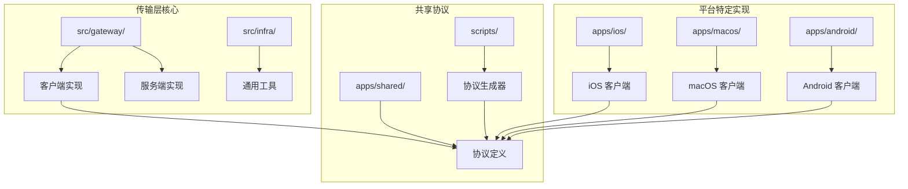
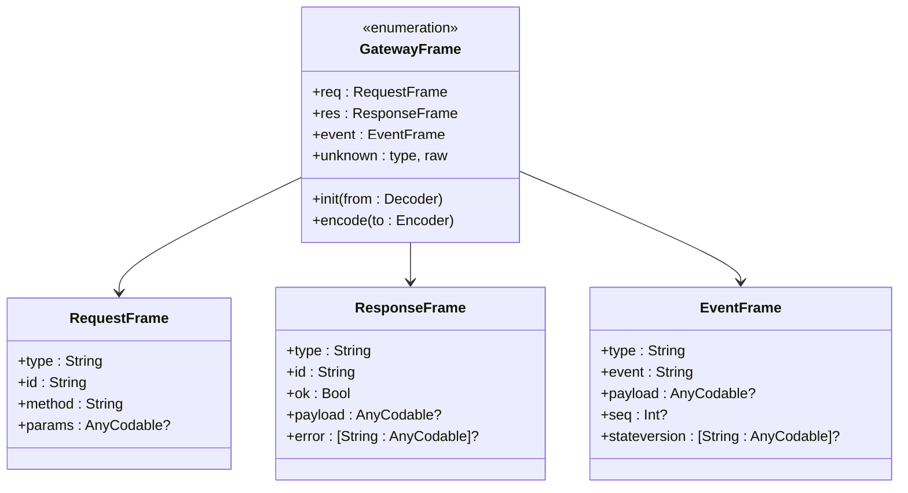
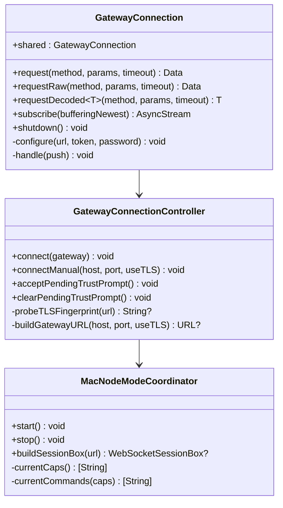
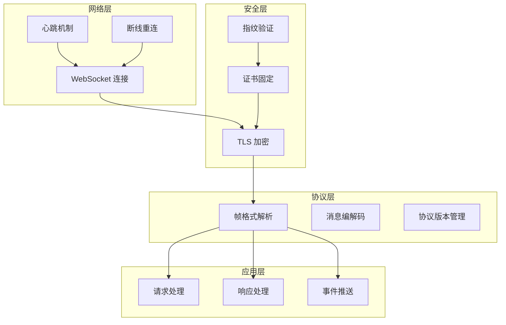
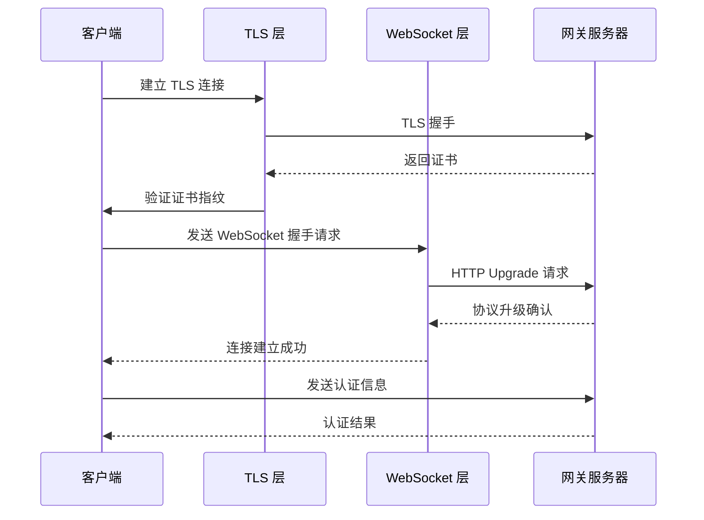
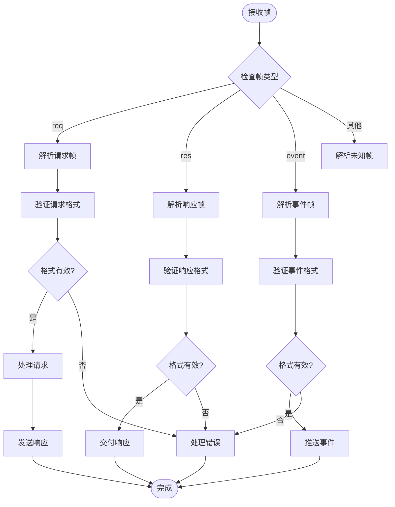
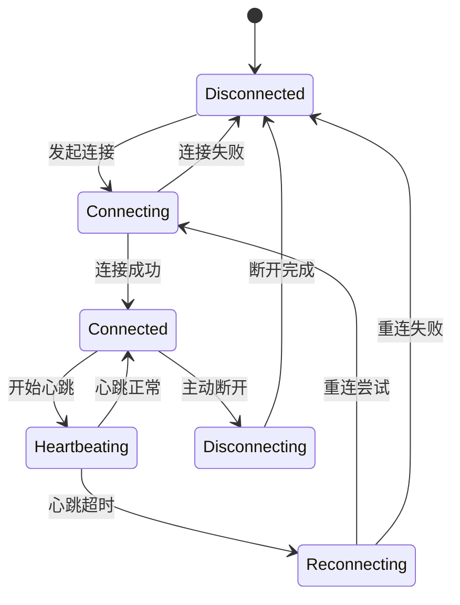
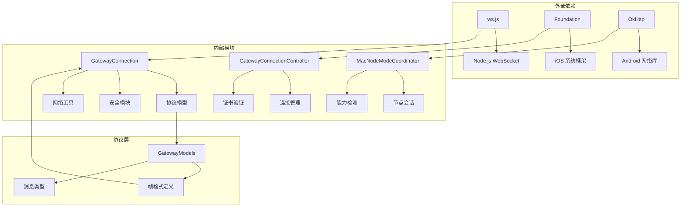

# WebSocket 传输层

<cite>
**本文档引用的文件**
- [GatewayModels.swift](file://apps/shared/OpenClawKit/Sources/OpenClawProtocol/GatewayModels.swift)
- [GatewayModels.swift](file://apps/macos/Sources/OpenClawProtocol/GatewayModels.swift)
- [GatewayConnection.swift](file://apps/macos/Sources/OpenClaw/GatewayConnection.swift)
- [GatewayConnectionController.swift](file://apps/ios/Sources/Gateway/GatewayConnectionController.swift)
- [MacNodeModeCoordinator.swift](file://apps/macos/Sources/OpenClaw/NodeMode/MacNodeModeCoordinator.swift)
- [GatewayTLSPinning.swift](file://apps/shared/OpenClawKit/Sources/OpenClawKit/GatewayTLSPinning.swift)
- [ws.ts](file://src/infra/ws.ts)
- [protocol-gen-swift.ts](file://scripts/protocol-gen-swift.ts)
- [client.watchdog.test.ts](file://src/gateway/client.watchdog.test.ts)
- [net.ts](file://src/gateway/net.ts)
- [GatewaySession.kt](file://apps/android/app/src/main/java/ai/openclaw/app/gateway/GatewaySession.kt)
</cite>

## 目录
1. [简介](#简介)
2. [项目结构](#项目结构)
3. [核心组件](#核心组件)
4. [架构概览](#架构概览)
5. [详细组件分析](#详细组件分析)
6. [依赖关系分析](#依赖关系分析)
7. [性能考虑](#性能考虑)
8. [故障排除指南](#故障排除指南)
9. [结论](#结论)

## 简介

WebSocket 传输层是 OpenClaw 系统的核心通信基础设施，负责在客户端与网关服务器之间建立持久化的双向通信通道。该传输层实现了完整的 WebSocket 协议栈，包括连接建立、帧格式规范、消息编解码、连接状态管理和安全传输等功能。

本传输层支持多种客户端角色，包括 operator（操作员）和 node（节点），并针对不同平台（iOS、macOS、Android）提供了专门的实现优化。系统采用 TypeScript/JavaScript 作为后端实现，Swift 作为前端实现语言，并通过统一的协议模型确保跨平台兼容性。

## 项目结构

WebSocket 传输层在项目中采用分层架构设计，主要分布在以下目录：



**图表来源**
- [GatewayConnection.swift:1-800](file://apps/macos/Sources/OpenClaw/GatewayConnection.swift#L1-L800)
- [GatewayConnectionController.swift:1-800](file://apps/ios/Sources/Gateway/GatewayConnectionController.swift#L1-L800)
- [GatewayModels.swift:1-800](file://apps/shared/OpenClawKit/Sources/OpenClawProtocol/GatewayModels.swift#L1-L800)

**章节来源**
- [GatewayConnection.swift:1-800](file://apps/macos/Sources/OpenClaw/GatewayConnection.swift#L1-L800)
- [GatewayConnectionController.swift:1-800](file://apps/ios/Sources/Gateway/GatewayConnectionController.swift#L1-L800)
- [GatewayModels.swift:1-800](file://apps/shared/OpenClawKit/Sources/OpenClawProtocol/GatewayModels.swift#L1-L800)

## 核心组件

### 协议模型定义

传输层基于统一的协议模型，定义了完整的消息格式和帧类型：



**图表来源**
- [GatewayModels.swift:3547-3587](file://apps/shared/OpenClawKit/Sources/OpenClawProtocol/GatewayModels.swift#L3547-L3587)
- [GatewayModels.swift:119-203](file://apps/macos/Sources/OpenClawProtocol/GatewayModels.swift#L119-L203)

### 连接管理器



**图表来源**
- [GatewayConnection.swift:51-426](file://apps/macos/Sources/OpenClaw/GatewayConnection.swift#L51-L426)
- [GatewayConnectionController.swift:22-482](file://apps/ios/Sources/Gateway/GatewayConnectionController.swift#L22-L482)
- [MacNodeModeCoordinator.swift:6-187](file://apps/macos/Sources/OpenClaw/NodeMode/MacNodeModeCoordinator.swift#L6-L187)

**章节来源**
- [GatewayModels.swift:3547-3587](file://apps/shared/OpenClawKit/Sources/OpenClawProtocol/GatewayModels.swift#L3547-L3587)
- [GatewayConnection.swift:51-426](file://apps/macos/Sources/OpenClaw/GatewayConnection.swift#L51-L426)
- [GatewayConnectionController.swift:22-482](file://apps/ios/Sources/Gateway/GatewayConnectionController.swift#L22-L482)
- [MacNodeModeCoordinator.swift:6-187](file://apps/macos/Sources/OpenClaw/NodeMode/MacNodeModeCoordinator.swift#L6-L187)

## 架构概览

WebSocket 传输层采用分层架构，从底层到上层依次为：网络层、安全层、协议层、应用层。



**图表来源**
- [GatewayTLSPinning.swift:66-87](file://apps/shared/OpenClawKit/Sources/OpenClawKit/GatewayTLSPinning.swift#L66-L87)
- [GatewayConnection.swift:159-252](file://apps/macos/Sources/OpenClaw/GatewayConnection.swift#L159-L252)
- [client.watchdog.test.ts:39-86](file://src/gateway/client.watchdog.test.ts#L39-L86)

## 详细组件分析

### 连接建立流程

WebSocket 连接建立遵循标准的握手协议，但在此实现中增加了额外的安全验证步骤：



**图表来源**
- [GatewayConnectionController.swift:1005-1083](file://apps/ios/Sources/Gateway/GatewayConnectionController.swift#L1005-L1083)
- [GatewayTLSPinning.swift:77-87](file://apps/shared/OpenClawKit/Sources/OpenClawKit/GatewayTLSPinning.swift#L77-L87)

### 帧格式规范

传输层支持三种主要的帧类型，每种都有特定的用途和负载格式：

#### 请求帧 (RequestFrame)
用于客户端向服务器发送请求，包含方法调用和参数信息。

#### 响应帧 (ResponseFrame)  
用于服务器对客户端请求的响应，包含执行结果或错误信息。

#### 事件帧 (EventFrame)
用于服务器主动推送事件给客户端，包含事件类型和数据负载。



**图表来源**
- [GatewayModels.swift:119-203](file://apps/shared/OpenClawKit/Sources/OpenClawProtocol/GatewayModels.swift#L119-L203)
- [protocol-gen-swift.ts:158-247](file://scripts/protocol-gen-swift.ts#L158-L247)

**章节来源**
- [GatewayModels.swift:119-203](file://apps/shared/OpenClawKit/Sources/OpenClawProtocol/GatewayModels.swift#L119-L203)
- [protocol-gen-swift.ts:158-247](file://scripts/protocol-gen-swift.ts#L158-L247)

### 消息编解码机制

传输层采用 JSON 作为默认的编码格式，支持复杂的数据结构和嵌套对象：

#### 文本帧的 JSON 负载格式
- 使用 UTF-8 编码
- 支持任意深度的对象嵌套
- 包含类型标识符以区分帧类型
- 参数字段支持可选值

#### 序列化规则
1. **类型安全**：所有消息都包含明确的类型标识
2. **版本兼容**：支持协议版本协商和向后兼容
3. **错误处理**：提供详细的错误信息和重试机制
4. **超时控制**：每个请求都有独立的超时配置

**章节来源**
- [ws.ts:4-21](file://src/infra/ws.ts#L4-L21)
- [GatewayModels.swift:1-800](file://apps/shared/OpenClawKit/Sources/OpenClawProtocol/GatewayModels.swift#L1-L800)

### 连接状态管理

传输层实现了完善的连接状态管理，包括自动重连、心跳检测和状态同步：



**图表来源**
- [client.watchdog.test.ts:39-86](file://src/gateway/client.watchdog.test.ts#L39-L86)
- [GatewayConnection.swift:159-252](file://apps/macos/Sources/OpenClaw/GatewayConnection.swift#L159-L252)

### 心跳机制

心跳机制用于检测连接的活跃状态，防止网络中间设备关闭空闲连接：

#### 心跳配置
- **默认间隔**：30 秒
- **超时阈值**：2 倍心跳间隔
- **异常处理**：超时后自动触发重连

#### 心跳流程
1. 定期发送心跳消息
2. 监听服务器的心跳响应
3. 超时则标记连接异常
4. 触发断线重连流程

**章节来源**
- [GatewaySession.kt:334-364](file://apps/android/app/src/main/java/ai/openclaw/app/gateway/GatewaySession.kt#L334-L364)
- [client.watchdog.test.ts:39-86](file://src/gateway/client.watchdog.test.ts#L39-L86)

### 断线重连策略

系统实现了智能的断线重连策略，根据不同的场景采用不同的重连策略：

```mermaid
flowchart TD
ConnectionLost[连接丢失] --> CheckContext{检查连接上下文}
CheckContext --> |本地模式| LocalRetry[本地重试]
CheckContext --> |远程模式| RemoteRetry[远程重试]
CheckContext --> |无配置| NoRetry[不重试]
LocalRetry --> SpawnGateway[启动网关进程]
SpawnGateway --> WaitGateway[等待网关就绪]
WaitGateway --> RetryConnect[重试连接]
RemoteRetry --> StopTunnels[停止隧道]
StopTunnels --> CreateTunnel[创建新隧道]
CreateTunnel --> RetryConnect
RetryConnect --> ConnectSuccess{连接成功?}
ConnectSuccess --> |是| ResumeOperations[恢复操作]
ConnectSuccess --> |否| ExponentialBackoff[指数退避]
ExponentialBackoff --> MaxRetries{达到最大重试次数?}
MaxRetries --> |否| WaitAndRetry[等待后重试]
MaxRetries --> |是| NotifyFailure[通知失败]
ResumeOperations --> [*]
WaitAndRetry --> RetryConnect
NotifyFailure --> [*]
```

**图表来源**
- [GatewayConnection.swift:179-250](file://apps/macos/Sources/OpenClaw/GatewayConnection.swift#L179-L250)

**章节来源**
- [GatewayConnection.swift:179-250](file://apps/macos/Sources/OpenClaw/GatewayConnection.swift#L179-L250)

### 安全考虑

传输层实现了多层次的安全保护机制：

#### TLS 支持
- **强制 TLS**：生产环境必须使用 TLS 加密
- **证书验证**：验证服务器证书的有效性
- **协议版本**：支持现代 TLS 协议版本

#### 证书固定 (Certificate Pinning)
- **指纹存储**：将可信证书指纹存储在本地
- **动态验证**：首次连接时验证证书指纹
- **用户交互**：提供证书信任确认界面

#### 加密通信
- **端到端加密**：敏感数据在传输过程中加密
- **会话安全**：维护安全的会话状态
- **防重放攻击**：防止消息被重放

**章节来源**
- [GatewayConnectionController.swift:1005-1083](file://apps/ios/Sources/Gateway/GatewayConnectionController.swift#L1005-L1083)
- [GatewayTLSPinning.swift:66-87](file://apps/shared/OpenClawKit/Sources/OpenClawKit/GatewayTLSPinning.swift#L66-L87)
- [net.ts:436-481](file://src/gateway/net.ts#L436-L481)

### 不同客户端角色的传输差异

#### Operator（操作员）客户端
- **功能特性**：支持完整的网关 API 调用
- **权限管理**：具备更高的权限级别
- **监控能力**：可以监控其他节点的状态

#### Node（节点）客户端
- **受限功能**：仅能访问节点相关的 API
- **代理模式**：作为其他系统的代理
- **资源限制**：有更严格的资源使用限制

**章节来源**
- [MacNodeModeCoordinator.swift:67-74](file://apps/macos/Sources/OpenClaw/NodeMode/MacNodeModeCoordinator.swift#L67-L74)

## 依赖关系分析

WebSocket 传输层的依赖关系呈现清晰的层次结构：



**图表来源**
- [GatewayConnection.swift:101-102](file://apps/macos/Sources/OpenClaw/GatewayConnection.swift#L101-L102)
- [GatewayConnectionController.swift:1-18](file://apps/ios/Sources/Gateway/GatewayConnectionController.swift#L1-L18)
- [MacNodeModeCoordinator.swift:1-12](file://apps/macos/Sources/OpenClaw/NodeMode/MacNodeModeCoordinator.swift#L1-L12)

**章节来源**
- [GatewayConnection.swift:101-102](file://apps/macos/Sources/OpenClaw/GatewayConnection.swift#L101-L102)
- [GatewayConnectionController.swift:1-18](file://apps/ios/Sources/Gateway/GatewayConnectionController.swift#L1-L18)
- [MacNodeModeCoordinator.swift:1-12](file://apps/macos/Sources/OpenClaw/NodeMode/MacNodeModeCoordinator.swift#L1-L12)

## 性能考虑

### 连接池管理
- **复用连接**：单个应用实例只维护一个 WebSocket 连接
- **连接复用**：同一连接支持多个并发请求
- **资源回收**：及时清理断开的连接和相关资源

### 内存管理
- **缓冲区大小**：合理设置消息缓冲区大小
- **内存泄漏防护**：确保事件监听器正确移除
- **大消息处理**：支持大文件传输的分块处理

### 网络优化
- **压缩算法**：启用消息压缩减少带宽占用
- **批量处理**：支持批量消息的合并发送
- **优先级队列**：重要消息优先传输

## 故障排除指南

### 常见问题诊断

#### 连接失败
1. **检查网络连接**：确认网络可达性和防火墙设置
2. **验证证书**：检查 TLS 证书的有效性和完整性
3. **查看日志**：分析连接过程中的错误信息

#### 心跳超时
1. **网络延迟**：检查网络延迟和丢包率
2. **服务器负载**：确认服务器资源充足
3. **客户端配置**：验证心跳间隔设置

#### 消息丢失
1. **缓冲区溢出**：检查消息缓冲区配置
2. **超时设置**：调整请求超时时间
3. **重试机制**：启用自动重试功能

**章节来源**
- [client.watchdog.test.ts:39-86](file://src/gateway/client.watchdog.test.ts#L39-L86)
- [GatewayConnection.swift:179-250](file://apps/macos/Sources/OpenClaw/GatewayConnection.swift#L179-L250)

## 结论

WebSocket 传输层作为 OpenClaw 系统的核心通信基础设施，实现了高可靠、高性能、安全的实时通信能力。通过统一的协议模型和多平台的实现，确保了不同客户端之间的无缝协作。

该传输层的主要优势包括：
- **协议一致性**：统一的消息格式和帧类型定义
- **安全性保障**：多层次的安全保护机制
- **可靠性保证**：完善的连接管理和重连策略
- **性能优化**：针对不同平台的专门优化
- **易用性**：简洁的 API 设计和丰富的功能

未来的发展方向包括进一步优化性能、增强安全功能、扩展协议支持以及改善开发者体验。