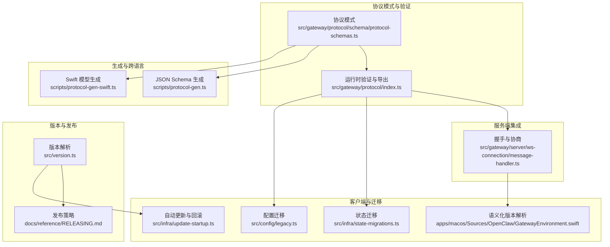
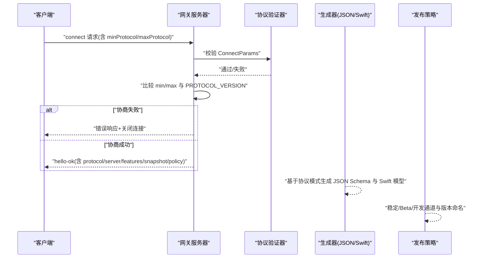
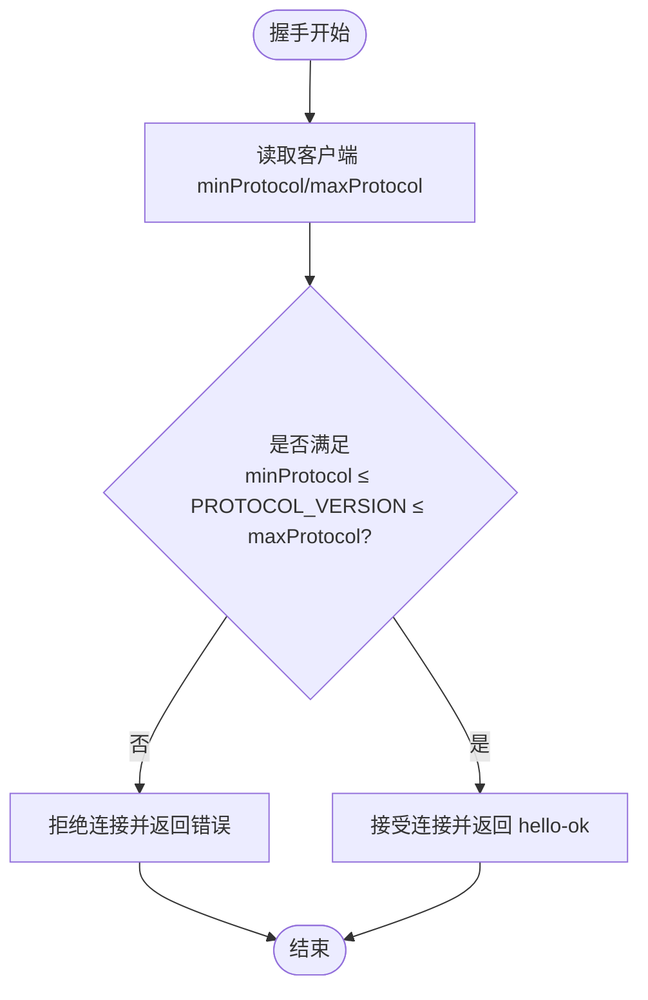
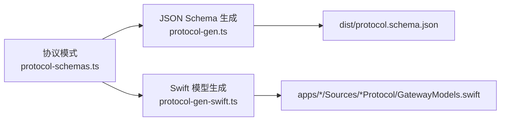
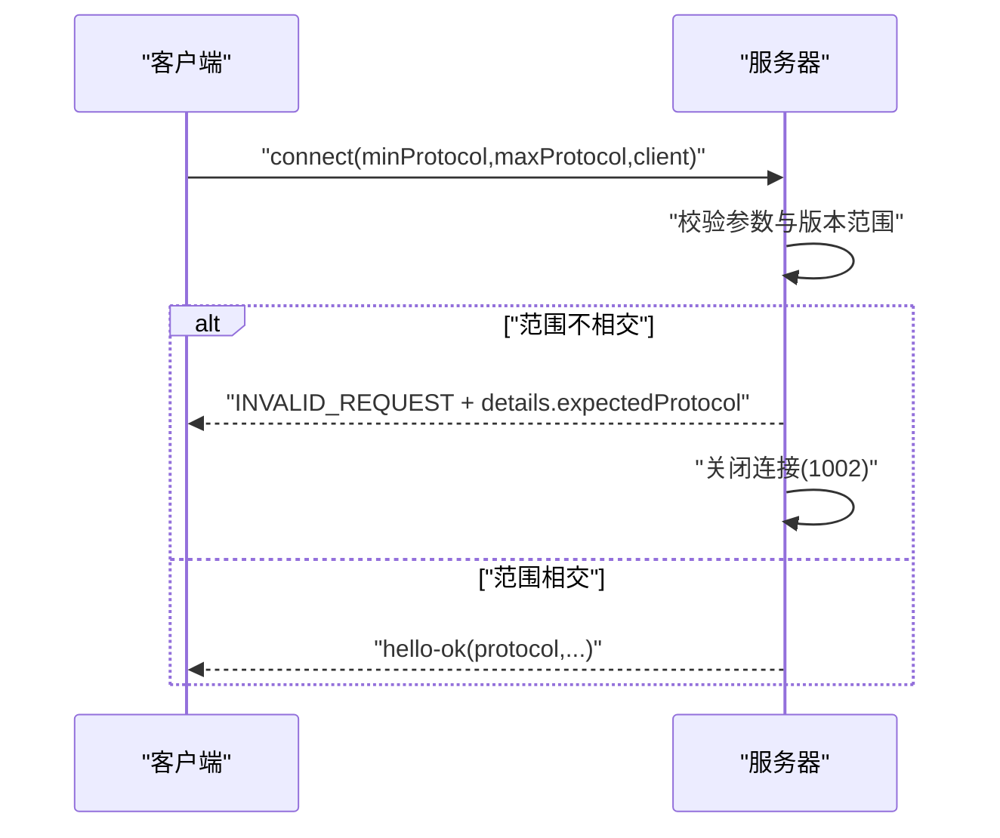
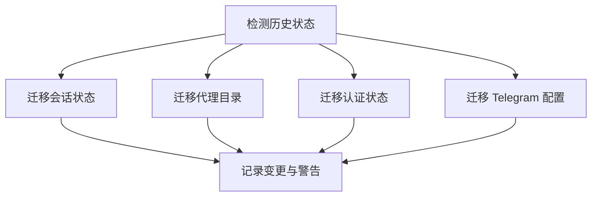
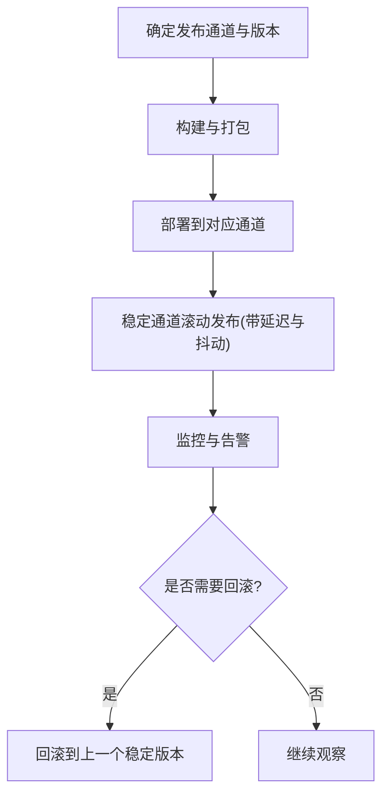
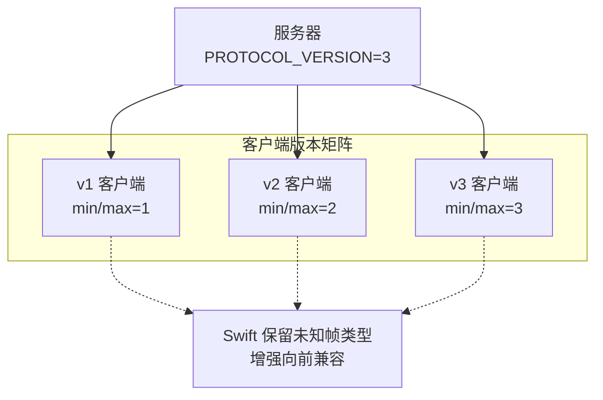
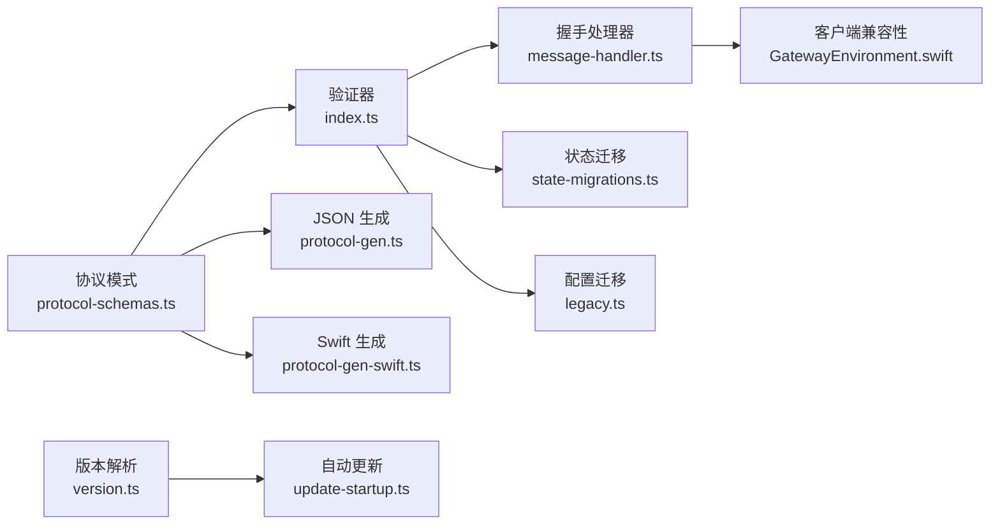

# 协议版本管理

<cite>
**本文引用的文件**   
- [protocol-schemas.ts](file://src/gateway/protocol/schema/protocol-schemas.ts)
- [index.ts](file://src/gateway/protocol/index.ts)
- [message-handler.ts](file://src/gateway/server/ws-connection/message-handler.ts)
- [protocol-gen.ts](file://scripts/protocol-gen.ts)
- [protocol-gen-swift.ts](file://scripts/protocol-gen-swift.ts)
- [typebox.md](file://docs/concepts/typebox.md)
- [bridge-protocol.md](file://docs/gateway/bridge-protocol.md)
- [version.ts](file://src/version.ts)
- [RELEASING.md](file://docs/reference/RELEASING.md)
- [GatewayEnvironment.swift](file://apps/macos/Sources/OpenClaw/GatewayEnvironment.swift)
- [state-migrations.ts](file://src/infra/state-migrations.ts)
- [legacy.ts](file://src/config/legacy.ts)
- [update-startup.ts](file://src/infra/update-startup.ts)
- [parallels-macos-smoke.sh](file://scripts/e2e/parallels-macos-smoke.sh)
- [parallels-windows-smoke.sh](file://scripts/e2e/parallels-windows-smoke.sh)
</cite>

## 目录
1. [简介](#简介)
2. [项目结构](#项目结构)
3. [核心组件](#核心组件)
4. [架构总览](#架构总览)
5. [详细组件分析](#详细组件分析)
6. [依赖关系分析](#依赖关系分析)
7. [性能考量](#性能考量)
8. [故障排查指南](#故障排查指南)
9. [结论](#结论)
10. [附录](#附录)

## 简介
本文件系统化阐述 OpenClaw 的协议版本管理机制，覆盖协议版本号定义、向后兼容策略、版本协商流程、最小/最大协议版本检查与降级处理、协议模式生成与跨语言同步、版本迁移与兼容性测试、发布与回滚流程，以及多客户端共存与渐进式升级策略。目标是为开发者与维护者提供可操作的技术参考与最佳实践。

## 项目结构
协议版本管理涉及以下关键目录与文件：
- 协议模式与类型定义：src/gateway/protocol/schema
- 运行时验证与导出：src/gateway/protocol/index.ts
- 服务器握手与协商：src/gateway/server/ws-connection/message-handler.ts
- JSON Schema 生成：scripts/protocol-gen.ts
- Swift 模型生成：scripts/protocol-gen-swift.ts
- 文档规范：docs/concepts/typebox.md、docs/gateway/bridge-protocol.md
- 版本解析与发布策略：src/version.ts、docs/reference/RELEASING.md
- 客户端语义化版本解析：apps/macos/Sources/OpenClaw/GatewayEnvironment.swift
- 状态迁移与兼容性：src/infra/state-migrations.ts、src/config/legacy.ts
- 自动更新与回滚：src/infra/update-startup.ts
- 端到端升级验证脚本：scripts/e2e/*.sh

**图表来源**
- [protocol-schemas.ts:1-302](file://src/gateway/protocol/schema/protocol-schemas.ts#L1-L302)
- [index.ts:1-673](file://src/gateway/protocol/index.ts#L1-L673)
- [protocol-gen.ts:1-52](file://scripts/protocol-gen.ts#L1-L52)
- [protocol-gen-swift.ts:1-248](file://scripts/protocol-gen-swift.ts#L1-L248)
- [message-handler.ts:343-385](file://src/gateway/server/ws-connection/message-handler.ts#L343-L385)
- [version.ts:1-129](file://src/version.ts#L1-L129)
- [RELEASING.md:1-43](file://docs/reference/RELEASING.md#L1-L43)
- [GatewayEnvironment.swift:1-38](file://apps/macos/Sources/OpenClaw/GatewayEnvironment.swift#L1-L38)
- [state-migrations.ts:943-982](file://src/infra/state-migrations.ts#L943-L982)
- [legacy.ts:42-58](file://src/config/legacy.ts#L42-L58)
- [update-startup.ts:156-482](file://src/infra/update-startup.ts#L156-L482)

**章节来源**
- [protocol-schemas.ts:1-302](file://src/gateway/protocol/schema/protocol-schemas.ts#L1-L302)
- [index.ts:1-673](file://src/gateway/protocol/index.ts#L1-L673)
- [protocol-gen.ts:1-52](file://scripts/protocol-gen.ts#L1-L52)
- [protocol-gen-swift.ts:1-248](file://scripts/protocol-gen-swift.ts#L1-L248)
- [message-handler.ts:343-385](file://src/gateway/server/ws-connection/message-handler.ts#L343-L385)
- [version.ts:1-129](file://src/version.ts#L1-L129)
- [RELEASING.md:1-43](file://docs/reference/RELEASING.md#L1-L43)
- [GatewayEnvironment.swift:1-38](file://apps/macos/Sources/OpenClaw/GatewayEnvironment.swift#L1-L38)
- [state-migrations.ts:943-982](file://src/infra/state-migrations.ts#L943-L982)
- [legacy.ts:42-58](file://src/config/legacy.ts#L42-L58)
- [update-startup.ts:156-482](file://src/infra/update-startup.ts#L156-L482)

## 核心组件
- 协议版本号与模式
  - 协议版本号在协议模式文件中集中定义，作为“单一事实来源”，用于服务器握手协商与客户端兼容性判断。
  - 协议模式通过 TypeBox 定义，驱动运行时 AJV 校验、JSON Schema 导出与 Swift 代码生成。
- 握手与协商
  - 服务器在首次握手时读取客户端上报的 minProtocol 与 maxProtocol，并与当前 PROTOCOL_VERSION 比较，不匹配则拒绝连接并返回错误。
- 生成与跨语言同步
  - JSON Schema 生成器输出 draft-07 规范的协议根模式，包含 discriminator 以区分帧类型。
  - Swift 生成器从同一协议模式派生强类型模型，包含帧枚举、错误码与协议版本常量。
- 版本解析与发布策略
  - 版本解析模块提供统一的二进制/包元数据解析与回退策略。
  - 发布策略文档定义稳定版、Beta 与开发版通道及命名规则。
- 客户端语义化版本
  - 客户端侧提供轻量语义化版本比较工具，用于兼容性检查与降级策略。
- 迁移与兼容性
  - 状态迁移与配置迁移保障历史数据平滑过渡。
  - 自动更新与回滚逻辑确保升级过程可控与可恢复。

**章节来源**
- [protocol-schemas.ts:301-301](file://src/gateway/protocol/schema/protocol-schemas.ts#L301-L301)
- [index.ts:253-458](file://src/gateway/protocol/index.ts#L253-L458)
- [protocol-gen.ts:9-42](file://scripts/protocol-gen.ts#L9-L42)
- [protocol-gen-swift.ts:30-34](file://scripts/protocol-gen-swift.ts#L30-L34)
- [message-handler.ts:370-385](file://src/gateway/server/ws-connection/message-handler.ts#L370-L385)
- [version.ts:67-129](file://src/version.ts#L67-L129)
- [RELEASING.md:11-26](file://docs/reference/RELEASING.md#L11-L26)
- [GatewayEnvironment.swift:6-38](file://apps/macos/Sources/OpenClaw/GatewayEnvironment.swift#L6-L38)
- [state-migrations.ts:943-982](file://src/infra/state-migrations.ts#L943-L982)
- [legacy.ts:42-58](file://src/config/legacy.ts#L42-L58)
- [update-startup.ts:156-482](file://src/infra/update-startup.ts#L156-L482)

## 架构总览
协议版本管理贯穿“模式定义—运行时校验—生成与同步—握手协商—发布与回滚”的全链路。

**图表来源**
- [message-handler.ts:343-385](file://src/gateway/server/ws-connection/message-handler.ts#L343-L385)
- [index.ts:253-458](file://src/gateway/protocol/index.ts#L253-L458)
- [protocol-gen.ts:9-42](file://scripts/protocol-gen.ts#L9-L42)
- [protocol-gen-swift.ts:30-34](file://scripts/protocol-gen-swift.ts#L30-L34)
- [RELEASING.md:11-26](file://docs/reference/RELEASING.md#L11-L26)

## 详细组件分析

### 组件A：协议版本号与向后兼容
- 协议版本号集中定义于协议模式文件，作为“单一事实来源”。
- 向后兼容策略：
  - 服务器在握手阶段进行最小/最大协议版本检查，仅接受完全匹配或在允许范围内的客户端。
  - Swift 生成器保留未知帧类型，避免旧客户端因新帧类型而崩溃。
- 版本协商流程要点：
  - 客户端发送 minProtocol 与 maxProtocol。
  - 服务器若 minProtocol > PROTOCOL_VERSION 或 maxProtocol < PROTOCOL_VERSION，则拒绝连接。
  - 成功后 hello-ok 返回实际使用的 protocol 值。

**图表来源**
- [message-handler.ts:370-385](file://src/gateway/server/ws-connection/message-handler.ts#L370-L385)
- [protocol-schemas.ts:301-301](file://src/gateway/protocol/schema/protocol-schemas.ts#L301-L301)
- [protocol-gen-swift.ts:204-210](file://scripts/protocol-gen-swift.ts#L204-L210)

**章节来源**
- [protocol-schemas.ts:301-301](file://src/gateway/protocol/schema/protocol-schemas.ts#L301-L301)
- [message-handler.ts:370-385](file://src/gateway/server/ws-connection/message-handler.ts#L370-L385)
- [protocol-gen-swift.ts:204-210](file://scripts/protocol-gen-swift.ts#L204-L210)

### 组件B：协议模式生成与跨语言支持
- JSON Schema 生成：
  - 输出根模式，包含 discriminator 以区分 req/res/event 帧类型。
  - 将所有协议模式作为 definitions 汇总，便于外部工具消费。
- Swift 模型生成：
  - 从同一协议模式派生强类型结构体与枚举。
  - 生成帧枚举 GatewayFrame，包含 unknown 分支以保留未知帧类型。
  - 内置错误码与协议版本常量，便于客户端侧使用。

**图表来源**
- [protocol-schemas.ts:162-299](file://src/gateway/protocol/schema/protocol-schemas.ts#L162-L299)
- [protocol-gen.ts:9-42](file://scripts/protocol-gen.ts#L9-L42)
- [protocol-gen-swift.ts:213-242](file://scripts/protocol-gen-swift.ts#L213-L242)

**章节来源**
- [protocol-gen.ts:9-42](file://scripts/protocol-gen.ts#L9-L42)
- [protocol-gen-swift.ts:30-34](file://scripts/protocol-gen-swift.ts#L30-L34)
- [protocol-gen-swift.ts:213-242](file://scripts/protocol-gen-swift.ts#L213-L242)

### 组件C：版本协商与降级处理
- 服务器握手处进行严格版本协商，不匹配直接拒绝。
- 客户端侧提供语义化版本解析工具，用于本地兼容性判断与降级决策。
- 文档明确桥接协议当前为隐式 v1，建议在破坏性变更前添加显式版本字段。

**图表来源**
- [message-handler.ts:343-385](file://src/gateway/server/ws-connection/message-handler.ts#L343-L385)
- [bridge-protocol.md:88-92](file://docs/gateway/bridge-protocol.md#L88-L92)
- [GatewayEnvironment.swift:6-38](file://apps/macos/Sources/OpenClaw/GatewayEnvironment.swift#L6-L38)

**章节来源**
- [message-handler.ts:343-385](file://src/gateway/server/ws-connection/message-handler.ts#L343-L385)
- [bridge-protocol.md:88-92](file://docs/gateway/bridge-protocol.md#L88-L92)
- [GatewayEnvironment.swift:6-38](file://apps/macos/Sources/OpenClaw/GatewayEnvironment.swift#L6-L38)

### 组件D：版本迁移工具与数据格式转换
- 状态迁移：
  - 针对历史状态检测与迁移，提供统一入口与日志记录，支持会话、代理目录、特定认证状态等迁移。
- 配置迁移：
  - 采用分段迁移列表，逐项应用并收集变更与警告，避免一次性大改造成风险。
- 数据格式转换：
  - 通过 AJV 编译的验证器在运行时对入站帧进行结构与类型校验，保证数据一致性。

**图表来源**
- [state-migrations.ts:943-982](file://src/infra/state-migrations.ts#L943-L982)
- [legacy.ts:42-58](file://src/config/legacy.ts#L42-L58)

**章节来源**
- [state-migrations.ts:943-982](file://src/infra/state-migrations.ts#L943-L982)
- [legacy.ts:42-58](file://src/config/legacy.ts#L42-L58)

### 组件E：版本发布流程、回滚与故障处理
- 发布策略：
  - 稳定版、Beta 与开发版三通道，版本命名遵循日期与预发行标签规则。
- 回滚策略：
  - 自动更新模块提供稳定窗口与抖动控制，避免大规模同时升级引发问题。
  - 升级失败时记录原因，支持后续人工干预或再次尝试。
- 故障处理：
  - 升级验证脚本覆盖快照恢复、安装最新版本、版本核验、引导与代理连通性验证等步骤。

**图表来源**
- [RELEASING.md:11-26](file://docs/reference/RELEASING.md#L11-L26)
- [update-startup.ts:156-482](file://src/infra/update-startup.ts#L156-L482)
- [parallels-macos-smoke.sh:696-768](file://scripts/e2e/parallels-macos-smoke.sh#L696-L768)
- [parallels-windows-smoke.sh:808-877](file://scripts/e2e/parallels-windows-smoke.sh#L808-L877)

**章节来源**
- [RELEASING.md:11-26](file://docs/reference/RELEASING.md#L11-L26)
- [update-startup.ts:156-482](file://src/infra/update-startup.ts#L156-L482)
- [parallels-macos-smoke.sh:696-768](file://scripts/e2e/parallels-macos-smoke.sh#L696-L768)
- [parallels-windows-smoke.sh:808-877](file://scripts/e2e/parallels-windows-smoke.sh#L808-L877)

### 组件F：多客户端版本共存与渐进式升级
- 多客户端共存：
  - 通过 minProtocol/maxProtocol 允许不同版本客户端并存，服务器按各自能力提供服务。
  - Swift 生成器保留未知帧类型，降低旧客户端对新协议的脆弱性。
- 渐进式升级：
  - 稳定通道采用延迟与抖动策略，逐步扩大升级范围。
  - 端到端脚本验证升级路径，确保关键功能在升级前后一致。

**图表来源**
- [protocol-gen-swift.ts:204-210](file://scripts/protocol-gen-swift.ts#L204-L210)
- [message-handler.ts:370-385](file://src/gateway/server/ws-connection/message-handler.ts#L370-L385)
- [update-startup.ts:424-434](file://src/infra/update-startup.ts#L424-L434)

**章节来源**
- [protocol-gen-swift.ts:204-210](file://scripts/protocol-gen-swift.ts#L204-L210)
- [message-handler.ts:370-385](file://src/gateway/server/ws-connection/message-handler.ts#L370-L385)
- [update-startup.ts:424-434](file://src/infra/update-startup.ts#L424-L434)

## 依赖关系分析
- 协议模式与验证
  - 协议模式文件导出 PROTOCOL_VERSION 与各帧/参数/结果的 TypeBox 模式。
  - 运行时验证器通过 AJV 编译上述模式，提供统一的校验接口。
- 生成与同步
  - JSON Schema 生成器依赖协议模式集合，Swift 生成器依赖同一集合与错误码映射。
- 服务器集成
  - 握手处理器读取客户端上报的 min/max 并与 PROTOCOL_VERSION 比较，决定接受或拒绝。
- 版本与发布
  - 版本解析模块为自动更新与发布策略提供统一的版本来源。
- 迁移与兼容
  - 状态迁移与配置迁移在升级前后保障数据一致性与可用性。

**图表来源**
- [protocol-schemas.ts:162-299](file://src/gateway/protocol/schema/protocol-schemas.ts#L162-L299)
- [index.ts:253-458](file://src/gateway/protocol/index.ts#L253-L458)
- [message-handler.ts:343-385](file://src/gateway/server/ws-connection/message-handler.ts#L343-L385)
- [protocol-gen.ts:9-42](file://scripts/protocol-gen.ts#L9-L42)
- [protocol-gen-swift.ts:30-34](file://scripts/protocol-gen-swift.ts#L30-L34)
- [version.ts:67-129](file://src/version.ts#L67-L129)
- [update-startup.ts:156-482](file://src/infra/update-startup.ts#L156-L482)
- [GatewayEnvironment.swift:6-38](file://apps/macos/Sources/OpenClaw/GatewayEnvironment.swift#L6-L38)
- [state-migrations.ts:943-982](file://src/infra/state-migrations.ts#L943-L982)
- [legacy.ts:42-58](file://src/config/legacy.ts#L42-L58)

**章节来源**
- [protocol-schemas.ts:162-299](file://src/gateway/protocol/schema/protocol-schemas.ts#L162-L299)
- [index.ts:253-458](file://src/gateway/protocol/index.ts#L253-L458)
- [message-handler.ts:343-385](file://src/gateway/server/ws-connection/message-handler.ts#L343-L385)
- [protocol-gen.ts:9-42](file://scripts/protocol-gen.ts#L9-L42)
- [protocol-gen-swift.ts:30-34](file://scripts/protocol-gen-swift.ts#L30-L34)
- [version.ts:67-129](file://src/version.ts#L67-L129)
- [update-startup.ts:156-482](file://src/infra/update-startup.ts#L156-L482)
- [GatewayEnvironment.swift:6-38](file://apps/macos/Sources/OpenClaw/GatewayEnvironment.swift#L6-L38)
- [state-migrations.ts:943-982](file://src/infra/state-migrations.ts#L943-L982)
- [legacy.ts:42-58](file://src/config/legacy.ts#L42-L58)

## 性能考量
- 握手阶段的版本协商与参数校验为 O(1)，对整体延迟影响有限。
- AJV 编译后的验证器在运行时具备较高性能，但应避免对大量动态模式反复编译。
- JSON Schema 与 Swift 模型生成属于构建期任务，建议纳入 CI 以减少本地负担。
- 自动更新的稳定窗口与抖动策略有助于分散升级峰值，降低服务器压力。

## 故障排查指南
- 协商失败
  - 现象：握手阶段立即断开，返回 INVALID_REQUEST，details 包含 expectedProtocol。
  - 排查：确认客户端上报的 min/max 是否与服务器 PROTOCOL_VERSION 覆盖。
- 类型校验失败
  - 现象：收到 res/error，包含详细校验信息。
  - 排查：根据 formatValidationErrors 输出定位字段与原因，修正参数或升级客户端。
- 升级失败
  - 现象：自动更新尝试失败，记录原因。
  - 排查：查看日志中的 reason 字段，必要时回滚至上一稳定版本并修复问题。

**章节来源**
- [message-handler.ts:356-383](file://src/gateway/server/ws-connection/message-handler.ts#L356-L383)
- [index.ts:424-458](file://src/gateway/protocol/index.ts#L424-L458)
- [update-startup.ts:449-471](file://src/infra/update-startup.ts#L449-L471)

## 结论
OpenClaw 的协议版本管理以“单一事实来源”的协议模式为核心，结合严格的握手协商、完善的生成与跨语言同步、稳健的迁移与发布策略，实现了高兼容性与可演进的协议体系。通过多客户端共存与渐进式升级，系统能够在快速迭代的同时保障稳定性与用户体验。

## 附录
- 参考文档
  - [TypeBox 协议概念:1-292](file://docs/concepts/typebox.md#L1-L292)
  - [桥接协议版本说明:88-92](file://docs/gateway/bridge-protocol.md#L88-L92)
  - [发布策略:1-43](file://docs/reference/RELEASING.md#L1-L43)
- 关键实现
  - [协议模式与版本号:301-301](file://src/gateway/protocol/schema/protocol-schemas.ts#L301-L301)
  - [运行时验证与导出:253-458](file://src/gateway/protocol/index.ts#L253-L458)
  - [握手与协商:343-385](file://src/gateway/server/ws-connection/message-handler.ts#L343-L385)
  - [JSON Schema 生成:9-42](file://scripts/protocol-gen.ts#L9-L42)
  - [Swift 模型生成:30-34](file://scripts/protocol-gen-swift.ts#L30-L34)
  - [版本解析:67-129](file://src/version.ts#L67-L129)
  - [状态迁移:943-982](file://src/infra/state-migrations.ts#L943-L982)
  - [配置迁移:42-58](file://src/config/legacy.ts#L42-L58)
  - [自动更新与回滚:156-482](file://src/infra/update-startup.ts#L156-L482)
  - [端到端升级验证脚本:696-768](file://scripts/e2e/parallels-macos-smoke.sh#L696-L768)
  - [端到端升级验证脚本:808-877](file://scripts/e2e/parallels-windows-smoke.sh#L808-L877)