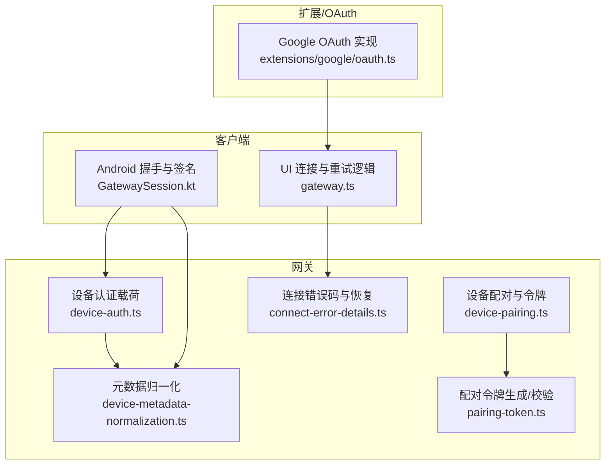
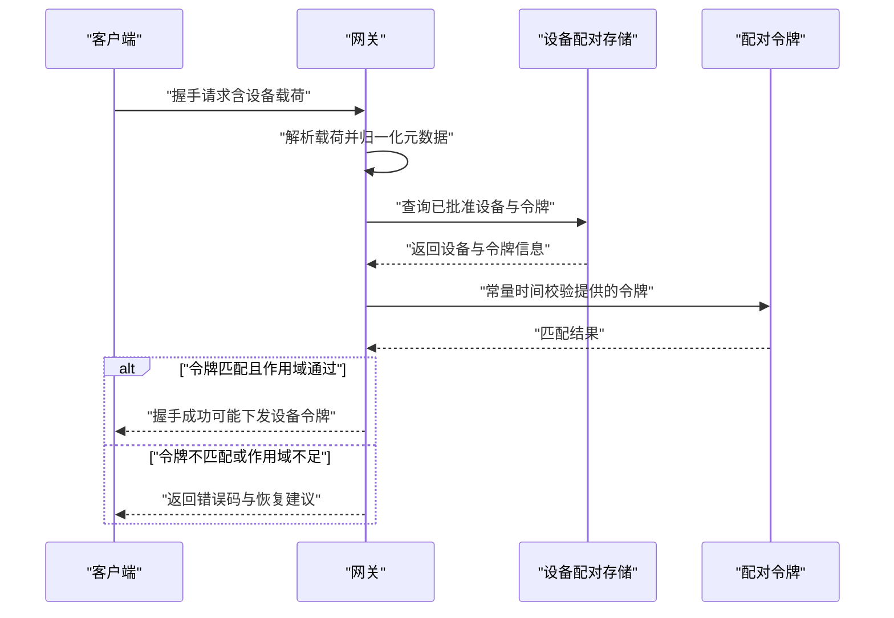
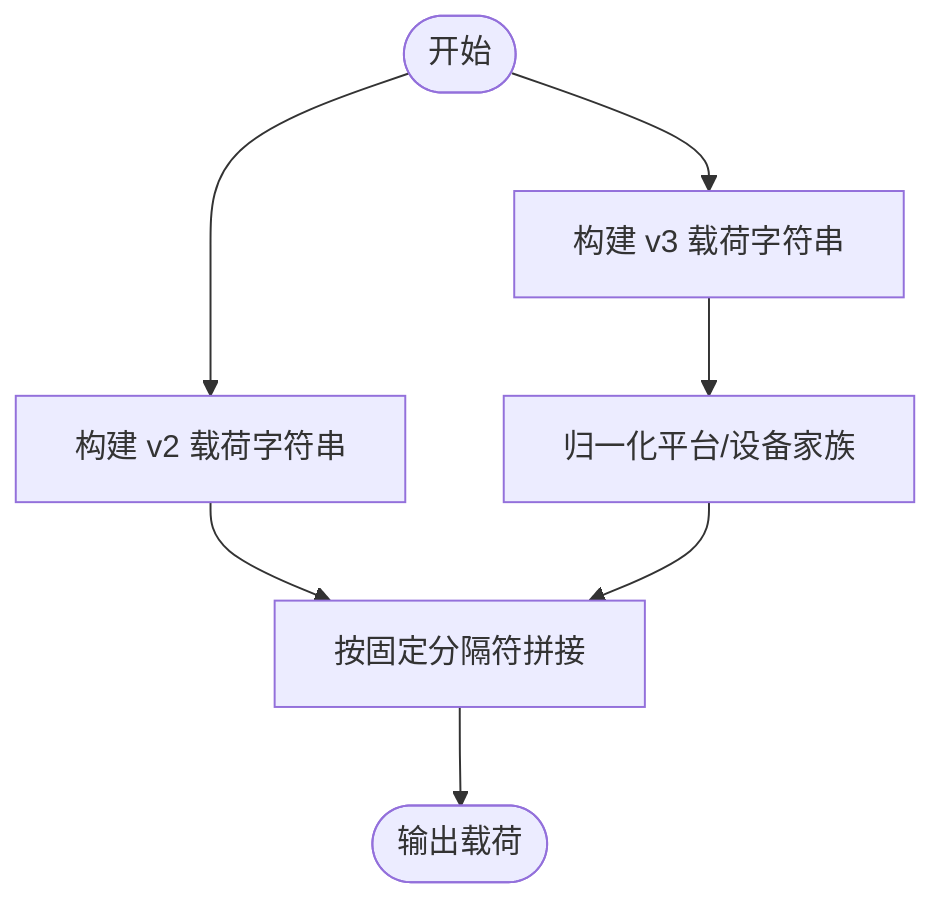
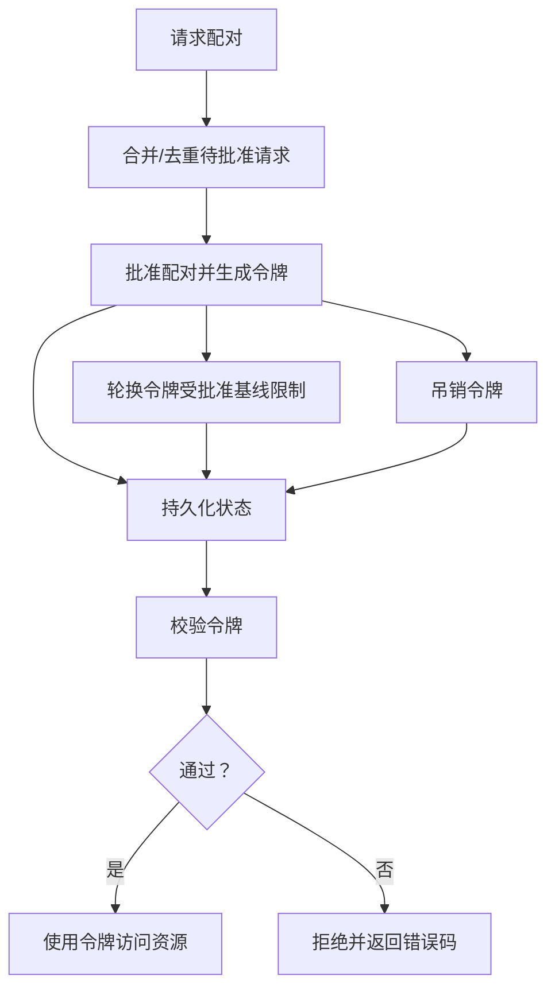
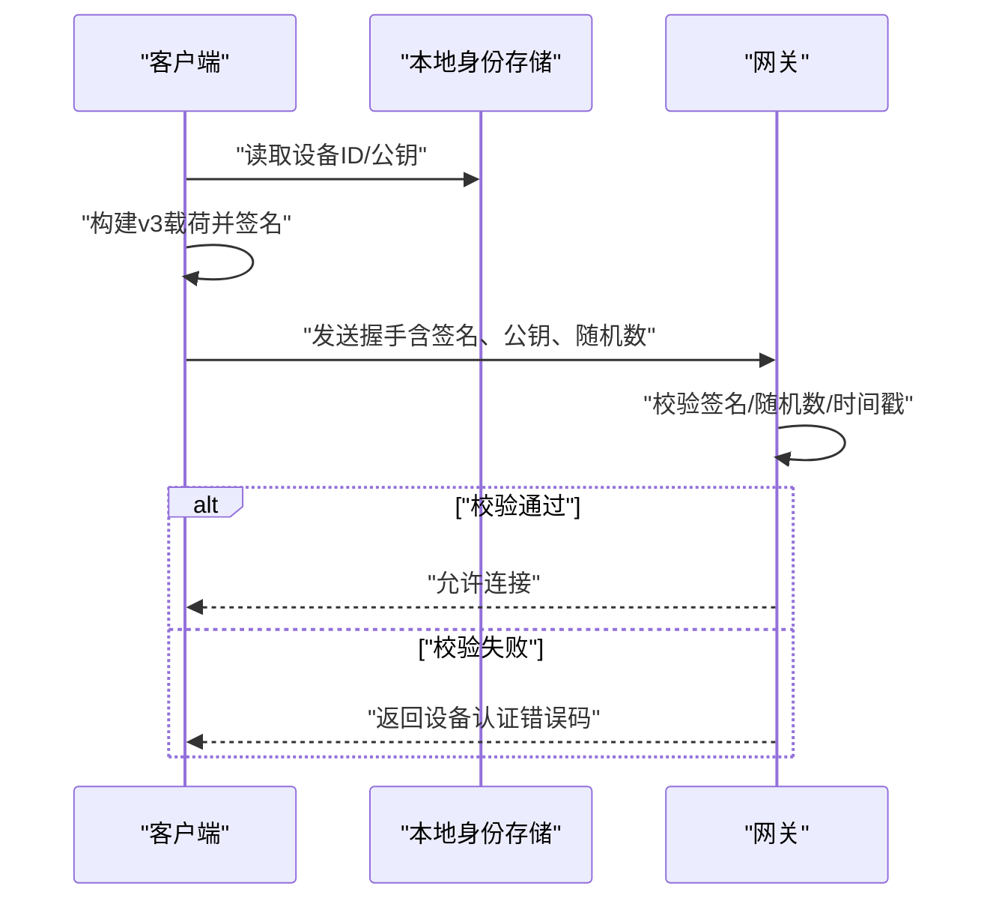
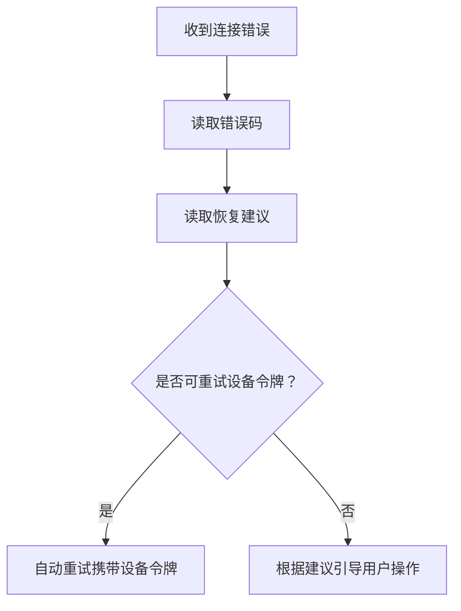
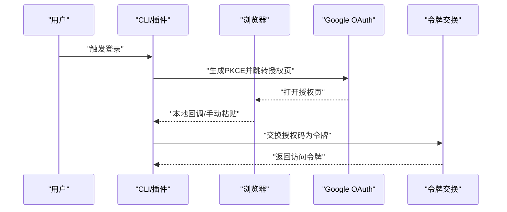
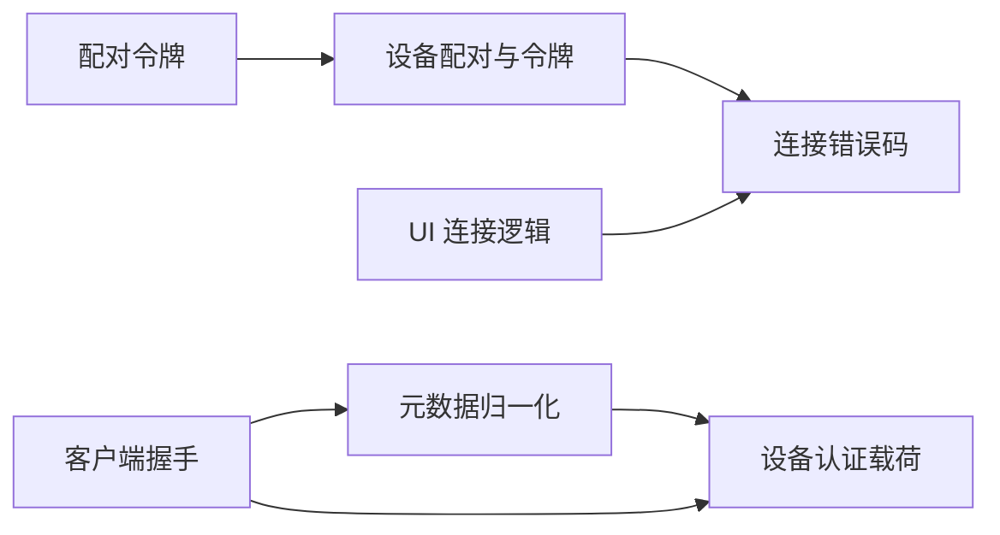

# 握手与认证

<cite>
**本文引用的文件**
- [device-auth.ts](file://src/gateway/device-auth.ts)
- [device-metadata-normalization.ts](file://src/gateway/device-metadata-normalization.ts)
- [device-pairing.ts](file://src/infra/device-pairing.ts)
- [pairing-token.ts](file://src/infra/pairing-token.ts)
- [connect-error-details.ts](file://src/gateway/protocol/connect-error-details.ts)
- [connect-error-details.test.ts](file://src/gateway/protocol/connect-error-details.test.ts)
- [device-auth.ts（共享）](file://src/shared/device-auth.ts)
- [GatewaySession.kt](file://apps/android/app/src/main/java/ai/openclaw/app/gateway/GatewaySession.kt)
- [DeviceAuthPayloadTest.kt](file://apps/android/app/src/test/java/ai/openclaw/app/gateway/DeviceAuthPayloadTest.kt)
- [gateway.ts（UI）](file://ui/src/ui/gateway.ts)
- [oauth.ts（Google）](file://extensions/google/oauth.ts)
</cite>

## 目录
1. [引言](#引言)
2. [项目结构](#项目结构)
3. [核心组件](#核心组件)
4. [架构总览](#架构总览)
5. [详细组件分析](#详细组件分析)
6. [依赖关系分析](#依赖关系分析)
7. [性能考量](#性能考量)
8. [故障排查指南](#故障排查指南)
9. [结论](#结论)
10. [附录](#附录)

## 引言
本文件系统性阐述 OpenClaw 的握手与认证机制，覆盖设备身份验证、挑战-响应流程、设备配对与信任建立、角色与权限授予、以及认证令牌的生成、验证与轮换。同时给出静态令牌、设备令牌与 OAuth 集成的实现要点，并提供错误码语义、恢复策略与安全最佳实践。

## 项目结构
围绕握手与认证的关键模块分布如下：
- 网关侧设备认证载荷构建与元数据归一化
- 设备配对与令牌管理（持久化、轮换、吊销）
- 连接错误码与恢复建议
- 客户端握手与设备签名
- OAuth 流程集成（以 Google 为例）

**图表来源**
- [device-auth.ts:1-54](file://src/gateway/device-auth.ts#L1-L54)
- [device-metadata-normalization.ts:1-32](file://src/gateway/device-metadata-normalization.ts#L1-L32)
- [device-pairing.ts:1-745](file://src/infra/device-pairing.ts#L1-L745)
- [pairing-token.ts:1-16](file://src/infra/pairing-token.ts#L1-L16)
- [connect-error-details.ts:1-141](file://src/gateway/protocol/connect-error-details.ts#L1-L141)
- [GatewaySession.kt:497-524](file://apps/android/app/src/main/java/ai/openclaw/app/gateway/GatewaySession.kt#L497-L524)
- [gateway.ts（UI）:328-358](file://ui/src/ui/gateway.ts#L328-L358)
- [oauth.ts（Google）:1-91](file://extensions/google/oauth.ts#L1-L91)

**章节来源**
- [device-auth.ts:1-54](file://src/gateway/device-auth.ts#L1-L54)
- [device-metadata-normalization.ts:1-32](file://src/gateway/device-metadata-normalization.ts#L1-L32)
- [device-pairing.ts:1-745](file://src/infra/device-pairing.ts#L1-L745)
- [pairing-token.ts:1-16](file://src/infra/pairing-token.ts#L1-L16)
- [connect-error-details.ts:1-141](file://src/gateway/protocol/connect-error-details.ts#L1-L141)
- [GatewaySession.kt:497-524](file://apps/android/app/src/main/java/ai/openclaw/app/gateway/GatewaySession.kt#L497-L524)
- [gateway.ts（UI）:328-358](file://ui/src/ui/gateway.ts#L328-L358)
- [oauth.ts（Google）:1-91](file://extensions/google/oauth.ts#L1-L91)

## 核心组件
- 设备认证载荷构建：定义 v2/v3 载荷字段序列化规则，包含设备 ID、客户端标识、模式、角色、作用域、签名时间戳、可选令牌与随机数等；v3 还包含平台与设备家族元数据。
- 元数据归一化：对平台/设备家族进行 ASCII 小写与裁剪，确保跨运行时一致性。
- 设备配对与令牌：维护待批准与已批准设备列表，生成/轮换/吊销设备令牌，校验请求作用域是否在批准基线内。
- 配对令牌：使用安全常量时间比较，避免时序侧信道。
- 连接错误码与恢复建议：标准化错误码与“下一步”建议，辅助 UI 自动重试或引导用户操作。
- 客户端握手：在连接前构造设备签名载荷，使用本地私钥签名并随连接上报公钥、签名、时间戳与随机数。
- OAuth 集成：以 Google 为例展示 PKCE 授权码流程、本地回调捕获与手动回传降级路径。

**章节来源**
- [device-auth.ts:4-54](file://src/gateway/device-auth.ts#L4-L54)
- [device-metadata-normalization.ts:13-21](file://src/gateway/device-metadata-normalization.ts#L13-L21)
- [device-pairing.ts:32-76](file://src/infra/device-pairing.ts#L32-L76)
- [pairing-token.ts:6-15](file://src/infra/pairing-token.ts#L6-L15)
- [connect-error-details.ts:1-88](file://src/gateway/protocol/connect-error-details.ts#L1-L88)
- [GatewaySession.kt:497-524](file://apps/android/app/src/main/java/ai/openclaw/app/gateway/GatewaySession.kt#L497-L524)
- [oauth.ts（Google）:15-91](file://extensions/google/oauth.ts#L15-L91)

## 架构总览
下图展示从客户端发起连接到网关完成设备身份验证与令牌校验的整体流程。

**图表来源**
- [device-auth.ts:20-54](file://src/gateway/device-auth.ts#L20-L54)
- [device-pairing.ts:526-574](file://src/infra/device-pairing.ts#L526-L574)
- [pairing-token.ts:10-15](file://src/infra/pairing-token.ts#L10-L15)
- [connect-error-details.ts:53-88](file://src/gateway/protocol/connect-error-details.ts#L53-L88)

## 详细组件分析

### 设备认证载荷与元数据归一化
- 载荷字段顺序与分隔符固定，便于跨语言一致计算。
- v3 在 v2 基础上增加平台与设备家族字段，并进行 ASCII 小写与裁剪，保证跨平台一致性。
- 归一化函数仅对 ASCII 字母执行小写转换，避免 Unicode 混淆字符影响。

**图表来源**
- [device-auth.ts:20-54](file://src/gateway/device-auth.ts#L20-L54)
- [device-metadata-normalization.ts:13-21](file://src/gateway/device-metadata-normalization.ts#L13-L21)

**章节来源**
- [device-auth.ts:4-54](file://src/gateway/device-auth.ts#L4-L54)
- [device-metadata-normalization.ts:1-32](file://src/gateway/device-metadata-normalization.ts#L1-L32)
- [DeviceAuthPayloadTest.kt:8-27](file://apps/android/app/src/test/java/ai/openclaw/app/gateway/DeviceAuthPayloadTest.kt#L8-L27)

### 设备配对与令牌生命周期
- 待批准请求合并与去重，支持静默/交互模式组合。
- 批准后生成/更新设备令牌，记录创建与轮换时间，支持吊销。
- 令牌校验包含：设备存在、角色非空、令牌未吊销、令牌常量时间匹配、批准基线与请求作用域允许性检查。
- 令牌轮换受批准作用域基线约束，确保变更在授权范围内。

**图表来源**
- [device-pairing.ts:303-440](file://src/infra/device-pairing.ts#L303-L440)
- [device-pairing.ts:526-574](file://src/infra/device-pairing.ts#L526-L574)
- [device-pairing.ts:656-703](file://src/infra/device-pairing.ts#L656-L703)
- [device-pairing.ts:705-731](file://src/infra/device-pairing.ts#L705-L731)

**章节来源**
- [device-pairing.ts:14-91](file://src/infra/device-pairing.ts#L14-L91)
- [device-pairing.ts:303-440](file://src/infra/device-pairing.ts#L303-L440)
- [device-pairing.ts:526-574](file://src/infra/device-pairing.ts#L526-L574)
- [device-pairing.ts:656-703](file://src/infra/device-pairing.ts#L656-L703)
- [device-pairing.ts:705-731](file://src/infra/device-pairing.ts#L705-L731)

### 客户端握手与设备签名
- 客户端在握手前构造 v3 载荷，使用本地私钥签名，随连接上报公钥、签名、时间戳与随机数。
- 网关侧校验签名有效性、时间戳新鲜度与随机数一致性。

**图表来源**
- [GatewaySession.kt:497-524](file://apps/android/app/src/main/java/ai/openclaw/app/gateway/GatewaySession.kt#L497-L524)
- [device-auth.ts:36-54](file://src/gateway/device-auth.ts#L36-L54)

**章节来源**
- [GatewaySession.kt:497-524](file://apps/android/app/src/main/java/ai/openclaw/app/gateway/GatewaySession.kt#L497-L524)
- [device-auth.ts:36-54](file://src/gateway/device-auth.ts#L36-L54)

### 连接错误码与恢复建议
- 错误码覆盖认证缺失、凭据不匹配、速率限制、TailScale 身份问题、设备认证无效等。
- 支持读取“可否用设备令牌重试”与“推荐下一步”等恢复建议，驱动 UI 自动重试或提示用户操作。

**图表来源**
- [connect-error-details.ts:1-88](file://src/gateway/protocol/connect-error-details.ts#L1-L88)
- [connect-error-details.ts:111-141](file://src/gateway/protocol/connect-error-details.ts#L111-L141)
- [gateway.ts（UI）:343-358](file://ui/src/ui/gateway.ts#L343-L358)

**章节来源**
- [connect-error-details.ts:1-141](file://src/gateway/protocol/connect-error-details.ts#L1-L141)
- [connect-error-details.test.ts:1-43](file://src/gateway/protocol/connect-error-details.test.ts#L1-L43)
- [gateway.ts（UI）:328-358](file://ui/src/ui/gateway.ts#L328-L358)

### OAuth 集成（以 Google 为例）
- 使用 PKCE 授权码流程，优先尝试本地回调捕获，失败则切换为手动粘贴回传。
- 严格校验 state 一致性，超时或端口占用等异常场景自动降级。

**图表来源**
- [oauth.ts（Google）:15-91](file://extensions/google/oauth.ts#L15-L91)

**章节来源**
- [oauth.ts（Google）:1-91](file://extensions/google/oauth.ts#L1-L91)

## 依赖关系分析
- 设备认证载荷依赖元数据归一化，确保跨平台一致性。
- 设备配对与令牌管理依赖配对令牌的安全比较与作用域兼容性检查。
- 客户端握手依赖本地身份存储与签名能力。
- UI 层依赖连接错误码与恢复建议，实现自动化重试与引导。

**图表来源**
- [device-auth.ts:1-2](file://src/gateway/device-auth.ts#L1-L2)
- [device-metadata-normalization.ts:1-32](file://src/gateway/device-metadata-normalization.ts#L1-L32)
- [pairing-token.ts:1-16](file://src/infra/pairing-token.ts#L1-L16)
- [device-pairing.ts:1-12](file://src/infra/device-pairing.ts#L1-L12)
- [GatewaySession.kt:497-524](file://apps/android/app/src/main/java/ai/openclaw/app/gateway/GatewaySession.kt#L497-L524)
- [gateway.ts（UI）:328-358](file://ui/src/ui/gateway.ts#L328-L358)

**章节来源**
- [device-auth.ts:1-2](file://src/gateway/device-auth.ts#L1-L2)
- [device-metadata-normalization.ts:1-32](file://src/gateway/device-metadata-normalization.ts#L1-L32)
- [pairing-token.ts:1-16](file://src/infra/pairing-token.ts#L1-L16)
- [device-pairing.ts:1-12](file://src/infra/device-pairing.ts#L1-L12)
- [GatewaySession.kt:497-524](file://apps/android/app/src/main/java/ai/openclaw/app/gateway/GatewaySession.kt#L497-L524)
- [gateway.ts（UI）:328-358](file://ui/src/ui/gateway.ts#L328-L358)

## 性能考量
- 令牌校验采用常量时间比较，避免时序攻击但带来微小 CPU 开销；整体成本与 JSON 解析和磁盘 IO 相比可忽略。
- 配对状态并发访问通过锁保护，避免竞态；建议在高并发场景下减少频繁轮换与吊销操作。
- 元数据归一化为纯字符串处理，开销极低。
- UI 自动重试需配合退避策略，避免对网关造成压力。

## 故障排查指南
- 常见错误码与含义
  - 认证必需/未授权：通常表示缺少有效认证凭据或未通过设备认证。
  - 认证令牌缺失/不匹配/未配置：客户端未提供或提供了错误令牌。
  - 设备令牌不匹配：网关侧保存的令牌与客户端提供的不一致。
  - 设备认证无效/设备ID不匹配/签名过期/随机数缺失/随机数不匹配/签名无效/公钥无效：设备端载荷或签名存在问题。
  - TailScale 身份缺失/代理缺失/WhoIs 失败/身份不匹配：网络/身份代理层问题。
  - 配对必需：设备未被批准。
- 恢复策略
  - 可用设备令牌重试：当建议允许或错误码明确为令牌不匹配时，重新发起连接并携带最新设备令牌。
  - 更新认证配置/凭据：当错误码指向配置缺失或凭据不匹配时，检查密钥、作用域与客户端配置。
  - 等待后重试：当错误码为限流或临时性错误时，等待后再试。
  - 审查认证配置：核对设备角色、作用域与批准基线的一致性。
- 定位步骤
  - 检查客户端是否正确构造 v3 载荷并签名，随机数是否传递。
  - 确认网关侧设备已批准且令牌未吊销。
  - 使用批准基线与请求作用域对比，确认范围允许性。
  - 对照错误码映射与恢复建议，执行相应操作。

**章节来源**
- [connect-error-details.ts:1-141](file://src/gateway/protocol/connect-error-details.ts#L1-L141)
- [connect-error-details.test.ts:1-43](file://src/gateway/protocol/connect-error-details.test.ts#L1-L43)
- [device-pairing.ts:526-574](file://src/infra/device-pairing.ts#L526-L574)
- [gateway.ts（UI）:343-358](file://ui/src/ui/gateway.ts#L343-L358)

## 结论
OpenClaw 的握手与认证体系以“设备身份+挑战-响应+配对令牌”为核心，结合严格的元数据归一化与作用域控制，确保跨平台一致性与最小权限原则。通过标准化错误码与恢复建议，配合 UI 自动化重试与人工引导，显著提升用户体验与可运维性。OAuth 集成为外部身份源提供了灵活接入路径。建议在生产中持续监控令牌健康状态、定期轮换并遵循最小权限原则。

## 附录
- 角色与作用域兼容性：由共享工具负责规范化与允许性判断，确保请求作用域在设备批准基线内。
- 设备令牌结构：包含角色、作用域、创建/轮换/吊销/最后使用时间戳，便于审计与治理。

**章节来源**
- [device-auth.ts（共享）:1-31](file://src/shared/device-auth.ts#L1-L31)
- [device-pairing.ts:32-49](file://src/infra/device-pairing.ts#L32-L49)