# 消息与事件系统

<cite>
**本文引用的文件**
- [system-presence.ts](file://src/infra/system-presence.ts)
- [server-node-subscriptions.ts](file://src/gateway/server-node-subscriptions.ts)
- [server-broadcast.ts](file://src/gateway/server-broadcast.ts)
- [frames.ts](file://src/gateway/protocol/schema/frames.ts)
- [GatewayModels.swift](file://apps/macos/Sources/OpenClawProtocol/GatewayModels.swift)
- [GatewayModels.swift](file://apps/shared/OpenClawKit/Sources/OpenClawProtocol/GatewayModels.swift)
- [GatewayChannelConfigureTests.swift](file://apps/macos/Tests/OpenClawIPCTests/GatewayChannelConfigureTests.swift)
- [diagnostic-events.ts](file://src/infra/diagnostic-events.ts)
- [heartbeat-events-filter.ts](file://src/infra/heartbeat-events-filter.ts)
- [system-events.ts](file://src/infra/system-events.ts)
- [inbound-debounce.ts](file://src/auto-reply/inbound-debounce.ts)
- [send-queue.test.ts](file://extensions/matrix/src/matrix/send-queue.test.ts)
- [bot-handlers.ts](file://src/line/bot-handlers.ts)
- [bot-handlers.test.ts](file://src/line/bot-handlers.test.ts)
- [passive-monitor.ts](file://extensions/shared/passive-monitor.ts)
- [app-events.ts](file://ui/src/ui/app-events.ts)
- [overview-event-log.ts](file://ui/src/ui/views/overview-event-log.ts)
- [debug.ts](file://ui/src/ui/views/debug.ts)
</cite>

## 目录
1. [简介](#简介)
2. [项目结构](#项目结构)
3. [核心组件](#核心组件)
4. [架构总览](#架构总览)
5. [详细组件分析](#详细组件分析)
6. [依赖关系分析](#依赖关系分析)
7. [性能考量](#性能考量)
8. [故障排查指南](#故障排查指南)
9. [结论](#结论)
10. [附录](#附录)

## 简介
本文件面向消息与事件系统，系统性阐述事件类型定义、事件路由机制与订阅管理、消息格式规范（含事件负载结构、序列号管理与状态版本控制）、系统存在性（presence）机制（设备状态跟踪与角色切换处理）、事件过滤、批量处理与性能优化策略、事件持久化与重放机制、故障恢复、事件监控与调试工具以及常见问题排查方法。内容基于仓库中的实际实现进行归纳总结，确保可追溯至具体源码文件。

## 项目结构
消息与事件系统横跨协议层、网关广播层、节点订阅层、诊断事件层、存在性管理、前端事件日志等多个模块，形成“协议定义—事件广播—订阅路由—状态版本—存在性—诊断监控”的完整闭环。

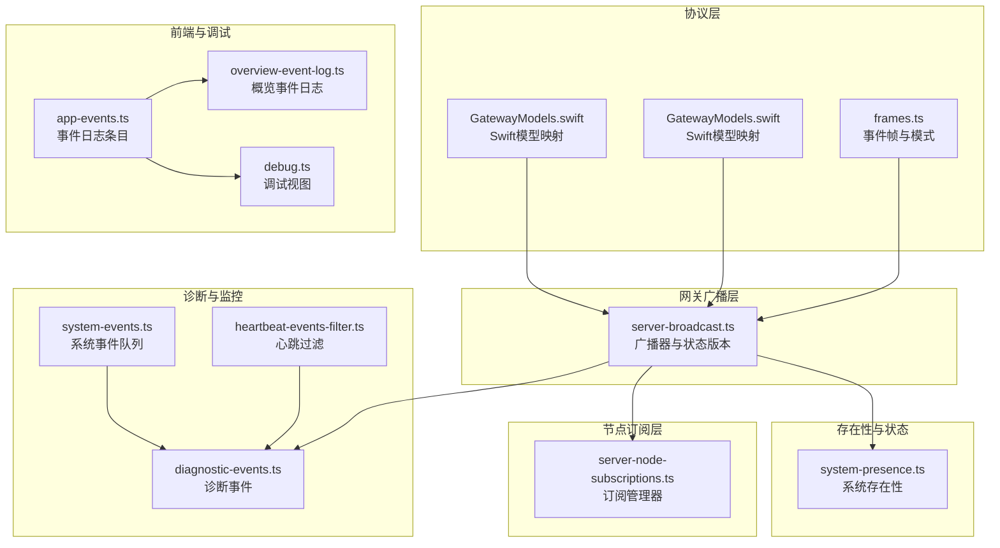

**图表来源**
- [frames.ts:147-156](file://src/gateway/protocol/schema/frames.ts#L147-L156)
- [server-broadcast.ts:57-131](file://src/gateway/server-broadcast.ts#L57-L131)
- [server-node-subscriptions.ts:33-164](file://src/gateway/server-node-subscriptions.ts#L33-L164)
- [system-presence.ts:1-290](file://src/infra/system-presence.ts#L1-L290)
- [diagnostic-events.ts:150-243](file://src/infra/diagnostic-events.ts#L150-L243)
- [heartbeat-events-filter.ts:86-96](file://src/infra/heartbeat-events-filter.ts#L86-L96)
- [system-events.ts:99-119](file://src/infra/system-events.ts#L99-L119)
- [app-events.ts:1-5](file://ui/src/ui/app-events.ts#L1-L5)
- [overview-event-log.ts:1-42](file://ui/src/ui/views/overview-event-log.ts#L1-L42)
- [debug.ts:1-34](file://ui/src/ui/views/debug.ts#L1-L34)
- [GatewayModels.swift:182-221](file://apps/macos/Sources/OpenClawProtocol/GatewayModels.swift#L182-L221)
- [GatewayModels.swift:182-221](file://apps/shared/OpenClawKit/Sources/OpenClawProtocol/GatewayModels.swift#L182-L221)

**章节来源**
- [frames.ts:147-156](file://src/gateway/protocol/schema/frames.ts#L147-L156)
- [server-broadcast.ts:57-131](file://src/gateway/server-broadcast.ts#L57-L131)
- [server-node-subscriptions.ts:33-164](file://src/gateway/server-node-subscriptions.ts#L33-L164)
- [system-presence.ts:1-290](file://src/infra/system-presence.ts#L1-L290)
- [diagnostic-events.ts:150-243](file://src/infra/diagnostic-events.ts#L150-L243)
- [heartbeat-events-filter.ts:86-96](file://src/infra/heartbeat-events-filter.ts#L86-L96)
- [system-events.ts:99-119](file://src/infra/system-events.ts#L99-L119)
- [app-events.ts:1-5](file://ui/src/ui/app-events.ts#L1-L5)
- [overview-event-log.ts:1-42](file://ui/src/ui/views/overview-event-log.ts#L1-L42)
- [debug.ts:1-34](file://ui/src/ui/views/debug.ts#L1-L34)
- [GatewayModels.swift:182-221](file://apps/macos/Sources/OpenClawProtocol/GatewayModels.swift#L182-L221)
- [GatewayModels.swift:182-221](file://apps/shared/OpenClawKit/Sources/OpenClawProtocol/GatewayModels.swift#L182-L221)

## 核心组件
- 事件帧与协议模式：定义事件帧结构、事件名、可选负载、序列号与状态版本字段，用于统一的事件传输与校验。
- 广播器与状态版本：负责事件广播、目标筛选、缓冲区保护与状态版本标记，支持按连接ID定向广播。
- 节点订阅管理器：维护节点到会话的订阅映射，支持按会话或全部订阅者发送事件。
- 系统存在性：聚合设备状态信息，提供更新、合并、列表与过期清理，支撑presence事件与状态版本。
- 诊断事件：统一的诊断事件发布/订阅机制，带有序列号与时间戳，隔离监听器异常。
- 心跳过滤与系统事件：过滤噪音心跳事件，提供系统事件队列的窥视与出队能力。
- 前端事件日志：UI侧事件日志条目结构与渲染，便于调试与监控。

**章节来源**
- [frames.ts:147-156](file://src/gateway/protocol/schema/frames.ts#L147-L156)
- [server-broadcast.ts:57-131](file://src/gateway/server-broadcast.ts#L57-L131)
- [server-node-subscriptions.ts:33-164](file://src/gateway/server-node-subscriptions.ts#L33-L164)
- [system-presence.ts:1-290](file://src/infra/system-presence.ts#L1-L290)
- [diagnostic-events.ts:150-243](file://src/infra/diagnostic-events.ts#L150-L243)
- [heartbeat-events-filter.ts:86-96](file://src/infra/heartbeat-events-filter.ts#L86-L96)
- [system-events.ts:99-119](file://src/infra/system-events.ts#L99-L119)
- [app-events.ts:1-5](file://ui/src/ui/app-events.ts#L1-L5)

## 架构总览
事件从协议层定义开始，经由广播器分发到订阅者，订阅者通过订阅管理器进行路由，同时系统存在性与状态版本参与事件上下文，诊断事件贯穿全链路提供可观测性。

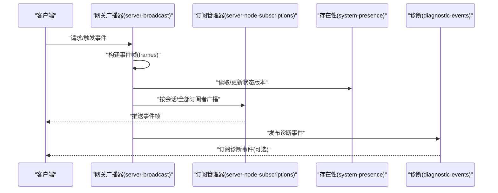

**图表来源**
- [server-broadcast.ts:60-118](file://src/gateway/server-broadcast.ts#L60-L118)
- [server-node-subscriptions.ts:100-133](file://src/gateway/server-node-subscriptions.ts#L100-L133)
- [system-presence.ts:193-246](file://src/infra/system-presence.ts#L193-L246)
- [frames.ts:147-156](file://src/gateway/protocol/schema/frames.ts#L147-L156)
- [diagnostic-events.ts:195-227](file://src/infra/diagnostic-events.ts#L195-L227)

## 详细组件分析

### 事件类型定义与消息格式规范
- 事件帧结构：事件帧包含类型标识、事件名、可选负载、可选序列号与可选状态版本，采用鉴别联合类型，便于强类型生成与校验。
- Swift模型映射：客户端Swift侧模型对齐事件帧字段，包括序列号与状态版本字段别名映射，保证跨语言一致性。
- 协议版本与兼容性：协议版本在服务端与客户端之间协商，未知帧类型保留以实现向前兼容。

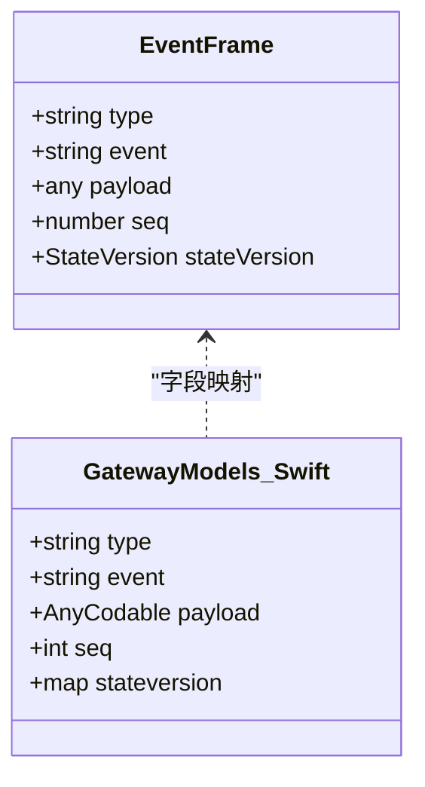

**图表来源**
- [frames.ts:147-156](file://src/gateway/protocol/schema/frames.ts#L147-L156)
- [GatewayModels.swift:182-202](file://apps/macos/Sources/OpenClawProtocol/GatewayModels.swift#L182-L202)
- [GatewayModels.swift:182-202](file://apps/shared/OpenClawKit/Sources/OpenClawProtocol/GatewayModels.swift#L182-L202)

**章节来源**
- [frames.ts:147-156](file://src/gateway/protocol/schema/frames.ts#L147-L156)
- [GatewayModels.swift:182-221](file://apps/macos/Sources/OpenClawProtocol/GatewayModels.swift#L182-L221)
- [GatewayModels.swift:182-221](file://apps/shared/OpenClawKit/Sources/OpenClawProtocol/GatewayModels.swift#L182-L221)

### 事件路由机制与订阅管理
- 订阅管理器提供订阅/取消订阅/清空订阅等操作，内部维护节点到会话集合与会话到节点集合的双向映射。
- 发送接口支持按会话发送、向所有订阅者广播、向所有已连接节点广播。
- 节点事件发送函数签名统一，便于在不同场景注入发送逻辑。

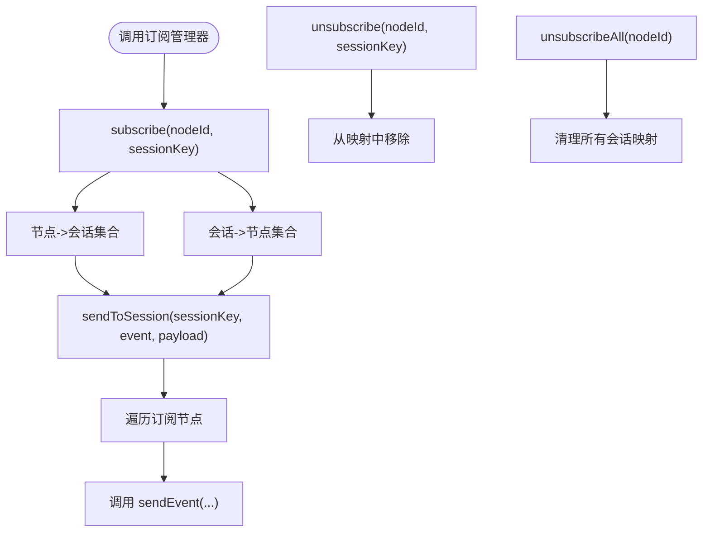

**图表来源**
- [server-node-subscriptions.ts:33-164](file://src/gateway/server-node-subscriptions.ts#L33-L164)

**章节来源**
- [server-node-subscriptions.ts:33-164](file://src/gateway/server-node-subscriptions.ts#L33-L164)

### 广播器与状态版本控制
- 广播器根据客户端作用域过滤敏感事件，支持按连接ID定向广播。
- 广播时自动分配序列号（非定向广播），并在帧中携带状态版本（如presence/health版本号）。
- 缓冲区保护：当客户端缓冲区超过阈值时，可选择丢弃或断开慢消费者，保障整体稳定性。

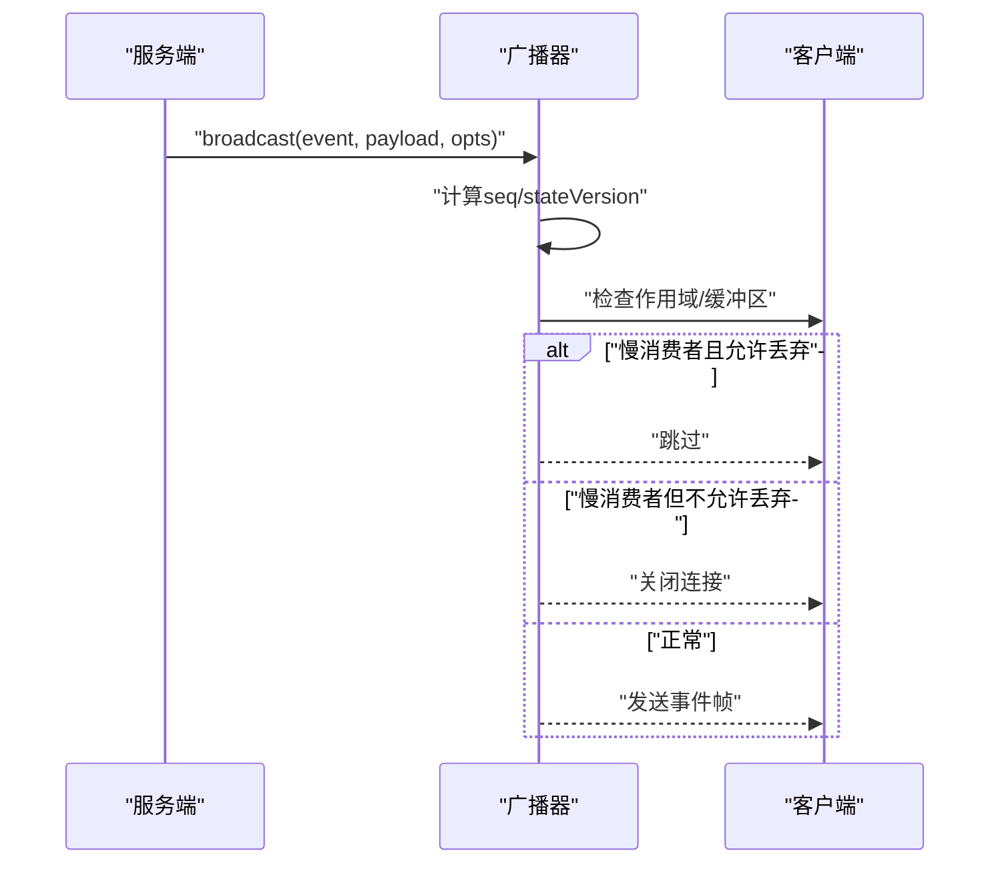

**图表来源**
- [server-broadcast.ts:57-131](file://src/gateway/server-broadcast.ts#L57-L131)

**章节来源**
- [server-broadcast.ts:57-131](file://src/gateway/server-broadcast.ts#L57-L131)

### 系统存在性（Presence）机制
- 存在性数据结构包含主机、IP、版本、平台、设备族、型号、最后输入秒数、模式、原因、设备ID、实例ID、文本、时间戳等字段。
- 更新流程：解析传入文本，合并payload与解析结果，按优先级合并角色与范围列表，生成变更摘要。
- 列表与过期：定期清理过期条目并限制最大数量，保持最近活跃设备可见。

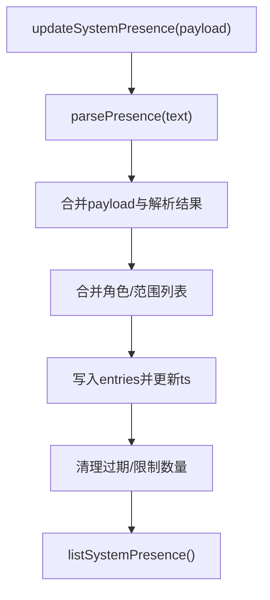

**图表来源**
- [system-presence.ts:193-246](file://src/infra/system-presence.ts#L193-L246)
- [system-presence.ts:270-289](file://src/infra/system-presence.ts#L270-L289)

**章节来源**
- [system-presence.ts:1-290](file://src/infra/system-presence.ts#L1-L290)

### 序列号管理与状态版本控制
- 事件帧包含可选序列号与状态版本字段，用于客户端侧顺序校验与状态一致性。
- 广播器在非定向广播时自增序列号；状态版本在广播选项中传入，供客户端感知状态变更。
- 测试用例验证序列号递增与缺失间隙检测，确保客户端能正确识别丢失事件。

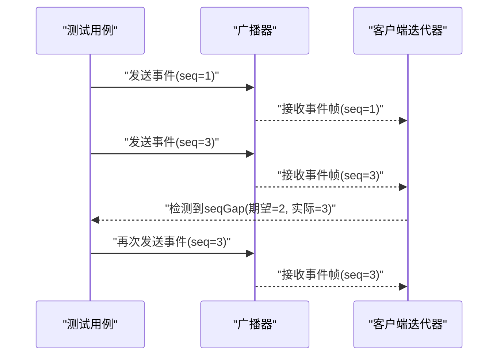

**图表来源**
- [GatewayChannelConfigureTests.swift:122-155](file://apps/macos/Tests/OpenClawIPCTests/GatewayChannelConfigureTests.swift#L122-L155)

**章节来源**
- [frames.ts:147-156](file://src/gateway/protocol/schema/frames.ts#L147-L156)
- [server-broadcast.ts:58-77](file://src/gateway/server-broadcast.ts#L58-L77)
- [GatewayChannelConfigureTests.swift:122-155](file://apps/macos/Tests/OpenClawIPCTests/GatewayChannelConfigureTests.swift#L122-L155)

### 事件过滤、批量处理与性能优化
- 心跳过滤：提供心跳噪音与执行完成事件的过滤规则，减少无效事件对系统的影响。
- 批量与串行化：针对特定通道（如Matrix房间）的消息发送进行串行化，避免并发冲突；同时支持按房间聚合发送。
- 去抖动：入站事件去抖动，支持默认窗口与按项定制窗口，先刷新缓冲再处理非去抖动项，提升吞吐与一致性。

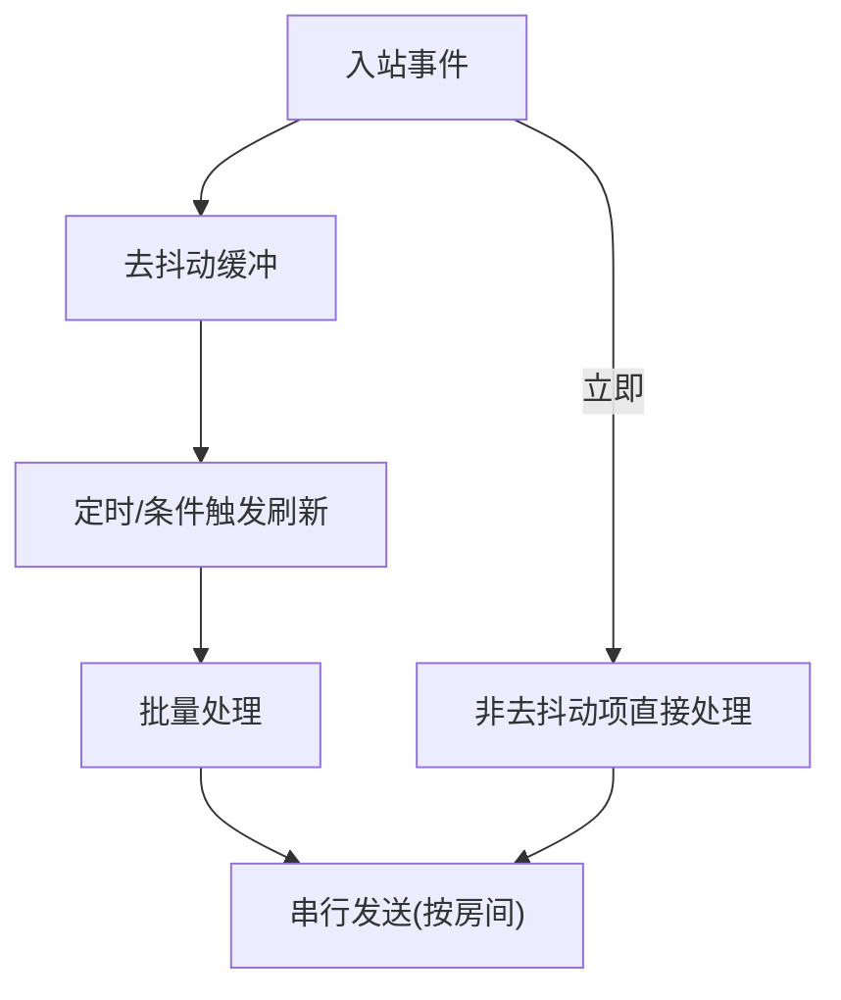

**图表来源**
- [heartbeat-events-filter.ts:86-96](file://src/infra/heartbeat-events-filter.ts#L86-L96)
- [inbound-debounce.ts:51-95](file://src/auto-reply/inbound-debounce.ts#L51-L95)
- [send-queue.test.ts:14-43](file://extensions/matrix/src/matrix/send-queue.test.ts#L14-L43)

**章节来源**
- [heartbeat-events-filter.ts:86-96](file://src/infra/heartbeat-events-filter.ts#L86-L96)
- [inbound-debounce.ts:51-95](file://src/auto-reply/inbound-debounce.ts#L51-L95)
- [send-queue.test.ts:1-46](file://extensions/matrix/src/matrix/send-queue.test.ts#L1-L46)

### 事件持久化、重放机制与故障恢复
- 重放检测：对重复事件进行去重，避免重复处理；对正在处理中的重复事件进行“飞行中”占位，确保并发重复事件只处理一次。
- 故障传播：飞行中重放失败会被镜像传播，确保并发重复事件同步失败，避免部分成功。
- 系统事件队列：提供系统事件的窥视与出队能力，便于在重启后恢复处理。

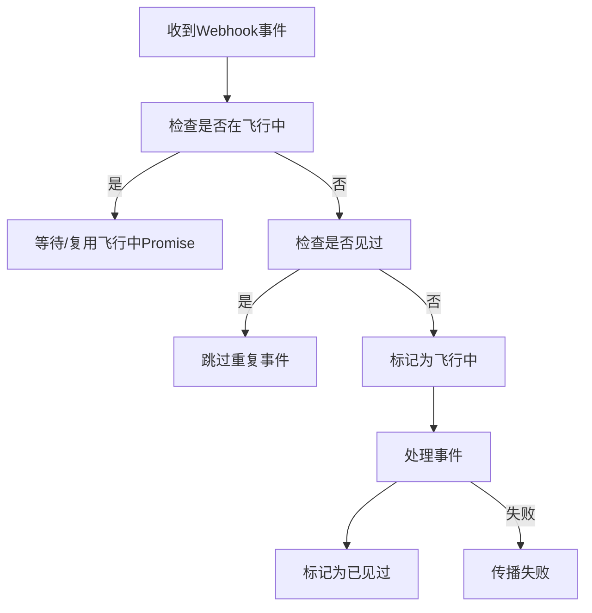

**图表来源**
- [bot-handlers.ts:187-222](file://src/line/bot-handlers.ts#L187-L222)
- [bot-handlers.test.ts:539-583](file://src/line/bot-handlers.test.ts#L539-L583)
- [system-events.ts:99-119](file://src/infra/system-events.ts#L99-L119)

**章节来源**
- [bot-handlers.ts:187-222](file://src/line/bot-handlers.ts#L187-L222)
- [bot-handlers.test.ts:539-583](file://src/line/bot-handlers.test.ts#L539-L583)
- [system-events.ts:99-119](file://src/infra/system-events.ts#L99-L119)

### 事件监控、调试工具与常见问题
- 诊断事件：统一的诊断事件发布/订阅，带有序列号与时间戳，隔离监听器异常，防止广播风暴影响。
- 心跳过滤：过滤噪音心跳事件，仅保留真实提醒类事件，降低噪声。
- 前端事件日志：UI侧事件日志条目结构与渲染，支持显示事件名、时间戳与负载片段，便于快速定位问题。
- 调试视图：提供加载状态、健康度、模型列表、心跳、事件日志与方法调用入口，辅助运维与开发调试。

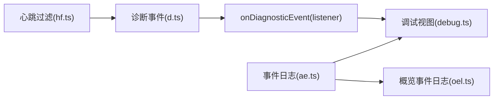

**图表来源**
- [diagnostic-events.ts:195-235](file://src/infra/diagnostic-events.ts#L195-L235)
- [heartbeat-events-filter.ts:86-96](file://src/infra/heartbeat-events-filter.ts#L86-L96)
- [app-events.ts:1-5](file://ui/src/ui/app-events.ts#L1-L5)
- [overview-event-log.ts:11-42](file://ui/src/ui/views/overview-event-log.ts#L11-L42)
- [debug.ts:23-34](file://ui/src/ui/views/debug.ts#L23-L34)

**章节来源**
- [diagnostic-events.ts:150-243](file://src/infra/diagnostic-events.ts#L150-L243)
- [heartbeat-events-filter.ts:86-96](file://src/infra/heartbeat-events-filter.ts#L86-L96)
- [app-events.ts:1-5](file://ui/src/ui/app-events.ts#L1-L5)
- [overview-event-log.ts:1-42](file://ui/src/ui/views/overview-event-log.ts#L1-L42)
- [debug.ts:1-34](file://ui/src/ui/views/debug.ts#L1-L34)

## 依赖关系分析
- 协议层依赖于TypeBox模式定义，确保事件帧结构严格一致。
- 广播器依赖订阅管理器与存在性模块，以提供状态版本与路由能力。
- 诊断事件作为横切关注点，被多个子系统使用，提供统一可观测性。
- 前端事件日志依赖应用事件条目结构，渲染事件历史。

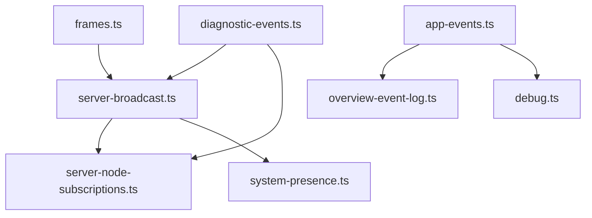

**图表来源**
- [frames.ts:147-156](file://src/gateway/protocol/schema/frames.ts#L147-L156)
- [server-broadcast.ts:57-131](file://src/gateway/server-broadcast.ts#L57-L131)
- [server-node-subscriptions.ts:33-164](file://src/gateway/server-node-subscriptions.ts#L33-L164)
- [system-presence.ts:1-290](file://src/infra/system-presence.ts#L1-L290)
- [diagnostic-events.ts:150-243](file://src/infra/diagnostic-events.ts#L150-L243)
- [app-events.ts:1-5](file://ui/src/ui/app-events.ts#L1-L5)
- [overview-event-log.ts:1-42](file://ui/src/ui/views/overview-event-log.ts#L1-L42)
- [debug.ts:1-34](file://ui/src/ui/views/debug.ts#L1-L34)

**章节来源**
- [frames.ts:147-156](file://src/gateway/protocol/schema/frames.ts#L147-L156)
- [server-broadcast.ts:57-131](file://src/gateway/server-broadcast.ts#L57-L131)
- [server-node-subscriptions.ts:33-164](file://src/gateway/server-node-subscriptions.ts#L33-L164)
- [system-presence.ts:1-290](file://src/infra/system-presence.ts#L1-L290)
- [diagnostic-events.ts:150-243](file://src/infra/diagnostic-events.ts#L150-L243)
- [app-events.ts:1-5](file://ui/src/ui/app-events.ts#L1-L5)
- [overview-event-log.ts:1-42](file://ui/src/ui/views/overview-event-log.ts#L1-L42)
- [debug.ts:1-34](file://ui/src/ui/views/debug.ts#L1-L34)

## 性能考量
- 缓冲区保护：广播器在慢消费者场景下可选择丢弃或断开，避免阻塞主广播路径。
- 作用域过滤：敏感事件仅对具备相应作用域的客户端开放，减少无意义广播。
- 去抖动与批量：入站事件去抖动与批量处理，降低瞬时峰值压力。
- 串行化发送：按房间串行化发送，避免并发冲突导致的重试与资源竞争。
- 过期与容量控制：存在性列表定期清理过期条目并限制最大数量，维持内存与查询效率。

[本节为通用性能讨论，无需列出具体文件来源]

## 故障排查指南
- 序列号不连续：检查客户端是否正确处理seqGap事件，确认事件帧中seq字段与期望值匹配。
- 慢消费者断开：观察广播器日志，确认客户端缓冲区阈值设置与网络状况；必要时降低事件速率或增大缓冲。
- 重复事件与飞行中冲突：确认重放检测逻辑是否生效，检查“飞行中”占位与失败传播是否按预期工作。
- 心跳噪音：启用心跳过滤，仅保留真实提醒事件，减少日志噪声。
- 诊断事件异常：确认诊断事件监听器未抛出异常，避免影响其他监听器；必要时隔离监听器进行定位。

**章节来源**
- [GatewayChannelConfigureTests.swift:122-155](file://apps/macos/Tests/OpenClawIPCTests/GatewayChannelConfigureTests.swift#L122-L155)
- [server-broadcast.ts:93-117](file://src/gateway/server-broadcast.ts#L93-L117)
- [bot-handlers.ts:187-222](file://src/line/bot-handlers.ts#L187-L222)
- [heartbeat-events-filter.ts:86-96](file://src/infra/heartbeat-events-filter.ts#L86-L96)
- [diagnostic-events.ts:210-225](file://src/infra/diagnostic-events.ts#L210-L225)

## 结论
本消息与事件系统通过严格的协议定义、可靠的广播与订阅机制、完善的序列号与状态版本控制、存在性与角色切换处理、事件过滤与批量优化、重放与故障恢复策略，以及全面的诊断与监控工具，形成了高可用、可观测、可扩展的事件基础设施。建议在生产环境中结合作用域过滤、缓冲区保护与去抖动策略，持续监控诊断事件与前端事件日志，以保障系统稳定运行。

[本节为总结性内容，无需列出具体文件来源]

## 附录
- 角色与范围：存在性更新支持角色与范围列表的合并，便于细粒度权限控制与状态展示。
- 事件负载结构：事件负载为任意JSON结构，需遵循各事件的Schema约束；Swift侧模型保留未知字段以兼容未来扩展。
- 状态版本：广播器支持在事件帧中携带状态版本，客户端据此判断状态新鲜度并决定是否触发刷新。

**章节来源**
- [system-presence.ts:159-191](file://src/infra/system-presence.ts#L159-L191)
- [frames.ts:147-156](file://src/gateway/protocol/schema/frames.ts#L147-L156)
- [server-broadcast.ts:18-26](file://src/gateway/server-broadcast.ts#L18-L26)