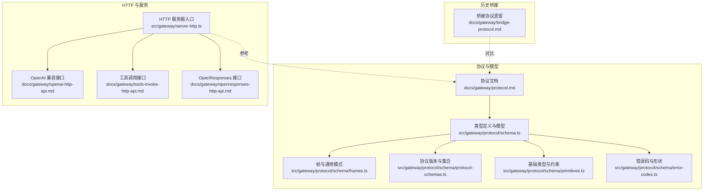
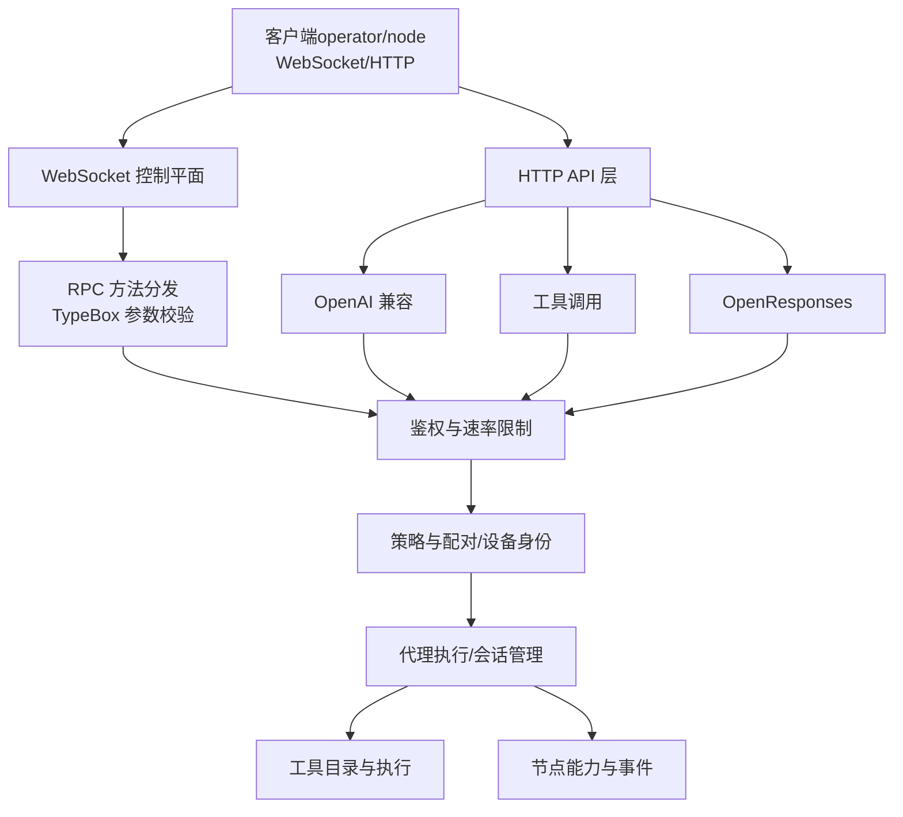
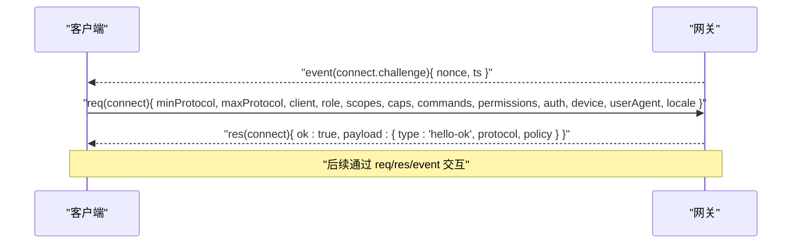
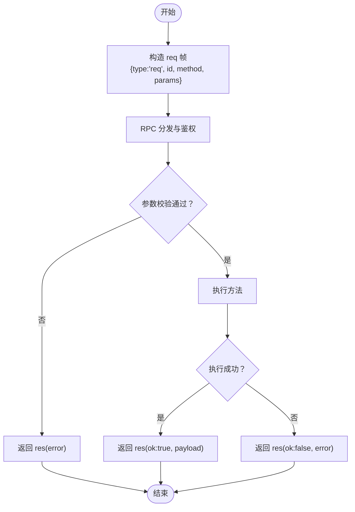
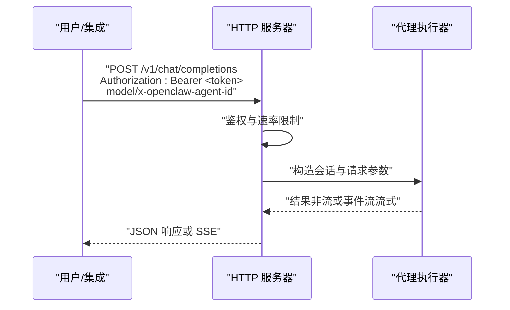
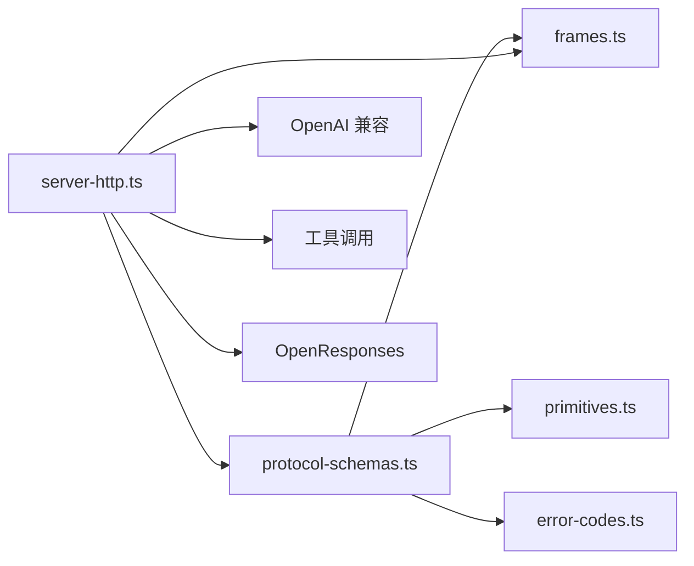

# 网关协议

<cite>
**本文引用的文件**
- [docs/gateway/protocol.md](file://docs/gateway/protocol.md)
- [docs/gateway/openai-http-api.md](file://docs/gateway/openai-http-api.md)
- [docs/gateway/openresponses-http-api.md](file://docs/gateway/openresponses-http-api.md)
- [docs/gateway/tools-invoke-http-api.md](file://docs/gateway/tools-invoke-http-api.md)
- [docs/gateway/bridge-protocol.md](file://docs/gateway/bridge-protocol.md)
- [docs/gateway/configuration.md](file://docs/gateway/configuration.md)
- [src/gateway/protocol/schema.ts](file://src/gateway/protocol/schema.ts)
- [src/gateway/protocol/schema/protocol-schemas.ts](file://src/gateway/protocol/schema/protocol-schemas.ts)
- [src/gateway/protocol/schema/frames.ts](file://src/gateway/protocol/schema/frames.ts)
- [src/gateway/protocol/schema/primitives.ts](file://src/gateway/protocol/schema/primitives.ts)
- [src/gateway/protocol/schema/error-codes.ts](file://src/gateway/protocol/schema/error-codes.ts)
- [src/gateway/server-http.ts](file://src/gateway/server-http.ts)
</cite>

## 目录
1. [简介](#简介)
2. [项目结构](#项目结构)
3. [核心组件](#核心组件)
4. [架构总览](#架构总览)
5. [详细组件分析](#详细组件分析)
6. [依赖关系分析](#依赖关系分析)
7. [性能考量](#性能考量)
8. [故障排查指南](#故障排查指南)
9. [结论](#结论)
10. [附录](#附录)

## 简介
本文件系统化梳理 OpenClaw 网关协议的技术规范，覆盖 WebSocket 控制平面协议、消息格式与通信流程；连接建立、握手协议与会话管理；RPC 调用规范（请求/响应、错误与重试）；以及 HTTP API（OpenAI 兼容、工具调用、OpenResponses）。同时提供协议版本管理、向后兼容与迁移指南，并给出调试工具、消息追踪与性能优化建议，以及桥接协议与第三方集成的适配方案。

## 项目结构
围绕“网关协议”的关键文档与源码分布如下：
- 协议与消息模型：位于 docs/gateway 与 src/gateway/protocol/schema
- HTTP API：OpenAI 兼容、工具调用、OpenResponses
- 服务器实现：HTTP/WS 复用服务、鉴权与速率限制
- 历史桥接协议：遗留 TCP JSONL 传输与配对流程

图表来源
- [docs/gateway/protocol.md:1-268](file://docs/gateway/protocol.md#L1-L268)
- [src/gateway/protocol/schema.ts:1-19](file://src/gateway/protocol/schema.ts#L1-L19)
- [src/gateway/protocol/schema/frames.ts:1-165](file://src/gateway/protocol/schema/frames.ts#L1-L165)
- [src/gateway/protocol/schema/protocol-schemas.ts:1-302](file://src/gateway/protocol/schema/protocol-schemas.ts#L1-L302)
- [src/gateway/protocol/schema/primitives.ts:1-85](file://src/gateway/protocol/schema/primitives.ts#L1-L85)
- [src/gateway/protocol/schema/error-codes.ts:1-24](file://src/gateway/protocol/schema/error-codes.ts#L1-L24)
- [src/gateway/server-http.ts:1-200](file://src/gateway/server-http.ts#L1-L200)
- [docs/gateway/openai-http-api.md:1-133](file://docs/gateway/openai-http-api.md#L1-L133)
- [docs/gateway/tools-invoke-http-api.md:1-111](file://docs/gateway/tools-invoke-http-api.md#L1-L111)
- [docs/gateway/openresponses-http-api.md:1-294](file://docs/gateway/openresponses-http-api.md#L1-L294)
- [docs/gateway/bridge-protocol.md:1-92](file://docs/gateway/bridge-protocol.md#L1-L92)

章节来源
- [docs/gateway/protocol.md:1-268](file://docs/gateway/protocol.md#L1-L268)
- [src/gateway/protocol/schema.ts:1-19](file://src/gateway/protocol/schema.ts#L1-L19)
- [src/gateway/server-http.ts:1-200](file://src/gateway/server-http.ts#L1-L200)

## 核心组件
- WebSocket 控制平面协议
  - 传输：WebSocket 文本帧（JSON）
  - 首帧必须为 connect 请求
  - 握手阶段：服务端下发挑战，客户端签名并返回 connect 参数
  - 帧类型：req（请求）、res（响应）、event（事件）
- 消息模型与版本
  - 协议版本号由 schema 统一导出
  - 所有方法参数与响应体由 TypeBox 模式校验
- 角色与作用域
  - operator：控制面客户端（CLI/UI/自动化）
  - node：能力宿主（摄像头/屏幕/画布/系统命令等）
  - operator 作用域：read/write/admin/approvals/pairing 等
  - node 能力声明：caps、commands、permissions
- 设备身份与配对
  - connect 阶段必须携带设备标识与签名
  - 支持设备级 token，可轮换/吊销
- HTTP API
  - OpenAI 兼容 /v1/chat/completions
  - 工具调用 /tools/invoke
  - OpenResponses /v1/responses
- 服务器实现要点
  - HTTP/WS 复用同一端口
  - 鉴权策略与速率限制
  - 插件路由与安全边界

章节来源
- [docs/gateway/protocol.md:10-268](file://docs/gateway/protocol.md#L10-L268)
- [src/gateway/protocol/schema/protocol-schemas.ts:162-302](file://src/gateway/protocol/schema/protocol-schemas.ts#L162-L302)
- [src/gateway/protocol/schema/frames.ts:126-165](file://src/gateway/protocol/schema/frames.ts#L126-L165)
- [docs/gateway/openai-http-api.md:1-133](file://docs/gateway/openai-http-api.md#L1-L133)
- [docs/gateway/tools-invoke-http-api.md:1-111](file://docs/gateway/tools-invoke-http-api.md#L1-L111)
- [docs/gateway/openresponses-http-api.md:1-294](file://docs/gateway/openresponses-http-api.md#L1-L294)
- [src/gateway/server-http.ts:715-759](file://src/gateway/server-http.ts#L715-L759)

## 架构总览
下图展示控制平面（WS）与 HTTP API 的整体交互，以及与插件生态的关系。

图表来源
- [docs/gateway/protocol.md:10-268](file://docs/gateway/protocol.md#L10-L268)
- [src/gateway/server-http.ts:715-759](file://src/gateway/server-http.ts#L715-L759)
- [docs/gateway/openai-http-api.md:1-133](file://docs/gateway/openai-http-api.md#L1-L133)
- [docs/gateway/tools-invoke-http-api.md:1-111](file://docs/gateway/tools-invoke-http-api.md#L1-L111)
- [docs/gateway/openresponses-http-api.md:1-294](file://docs/gateway/openresponses-http-api.md#L1-L294)

## 详细组件分析

### WebSocket 控制平面协议
- 连接建立与握手
  - 服务端先下发 connect.challenge（包含随机 nonce 与时间戳）
  - 客户端需对服务端 nonce 进行签名，并在 connect.params.device 中回传 nonce
  - connect.params 包含 min/maxProtocol、client、role、scopes、caps、commands、permissions、auth、locale、userAgent、device 等字段
  - 成功后返回 hello-ok，包含协议版本、features、snapshot、policy 等
- 帧格式
  - req：{type:"req", id, method, params}
  - res：{type:"res", id, ok, payload|error}
  - event：{type:"event", event, payload, seq?, stateVersion?}
- 角色与作用域
  - operator：具备 read/write/admin/approvals/pairing 等作用域
  - node：声明 caps/commands/permissions，服务端进行白名单校验
- 设备身份与配对
  - connect 必须包含 device.id/publicKey/signature/signedAt/nonce
  - 支持设备 token，可轮换/吊销
- 版本管理
  - PROTOCOL_VERSION 在 schema 中统一导出
  - 客户端需在 connect 中声明 min/maxProtocol 并与服务端匹配

图表来源
- [docs/gateway/protocol.md:22-90](file://docs/gateway/protocol.md#L22-L90)
- [src/gateway/protocol/schema/frames.ts:20-113](file://src/gateway/protocol/schema/frames.ts#L20-L113)

章节来源
- [docs/gateway/protocol.md:10-268](file://docs/gateway/protocol.md#L10-L268)
- [src/gateway/protocol/schema/frames.ts:126-165](file://src/gateway/protocol/schema/frames.ts#L126-L165)

### RPC 调用规范
- 帧与方法
  - req/res 帧承载 RPC 调用
  - 方法参数与返回值由 TypeBox 模式定义，集中于 protocol-schemas.ts
- 错误处理
  - res.error 形如 { code, message, details?, retryable?, retryAfterMs? }
  - 常见错误码：NOT_LINKED、NOT_PAIRED、AGENT_TIMEOUT、INVALID_REQUEST、UNAVAILABLE
- 身份与配对
  - connect 成功后可获得设备级 token，用于后续连接
  - 设备 token 可轮换/吊销
- 会话与状态
  - event 帧可携带 seq 与 stateVersion，支持状态快照与增量更新

图表来源
- [src/gateway/protocol/schema/protocol-schemas.ts:162-302](file://src/gateway/protocol/schema/protocol-schemas.ts#L162-L302)
- [src/gateway/protocol/schema/error-codes.ts:1-24](file://src/gateway/protocol/schema/error-codes.ts#L1-24)

章节来源
- [src/gateway/protocol/schema/protocol-schemas.ts:162-302](file://src/gateway/protocol/schema/protocol-schemas.ts#L162-L302)
- [src/gateway/protocol/schema/error-codes.ts:1-24](file://src/gateway/protocol/schema/error-codes.ts#L1-24)

### HTTP API：OpenAI 兼容
- 端点与启用
  - POST /v1/chat/completions
  - 默认关闭，需在配置中开启
- 鉴权
  - 使用 Bearer Token，遵循网关鉴权配置
  - 支持速率限制与 Retry-After
- 代理选择
  - model: "openclaw:<agentId>" 或 "agent:<agentId>"
  - x-openclaw-agent-id 头可显式指定
- 会话行为
  - 默认无状态（每次请求新会话）
  - 若请求包含 user，则派生稳定会话键以复用会话
- 流式输出
  - stream: true 返回 Server-Sent Events（text/event-stream）

图表来源
- [docs/gateway/openai-http-api.md:14-133](file://docs/gateway/openai-http-api.md#L14-L133)
- [src/gateway/server-http.ts:715-759](file://src/gateway/server-http.ts#L715-L759)

章节来源
- [docs/gateway/openai-http-api.md:1-133](file://docs/gateway/openai-http-api.md#L1-L133)
- [src/gateway/server-http.ts:715-759](file://src/gateway/server-http.ts#L715-L759)

### HTTP API：工具调用
- 端点
  - POST /tools/invoke（始终启用）
- 请求体
  - tool（必填）、action（可选）、args（可选）、sessionKey（可选）、dryRun（保留）
- 策略与路由
  - 严格遵循代理工具策略链（profile/allow/agents.* 等）
  - 存在默认拒绝列表（如 sessions_spawn/sessions_send/gateway 等）
- 响应
  - 200：{ ok: true, result }
  - 400/401/404/429/500：标准化错误对象

章节来源
- [docs/gateway/tools-invoke-http-api.md:1-111](file://docs/gateway/tools-invoke-http-api.md#L1-L111)

### HTTP API：OpenResponses
- 端点与启用
  - POST /v1/responses，默认关闭，需在配置中开启
- 鉴权与路由
  - 与 OpenAI 兼容端点一致的行为与安全边界
- 请求形态
  - 支持 items（message/function_call_output/reasoning/item_reference 等）
  - 支持 client-side function tools 与 tool_choice
  - 支持图片与文件输入（base64/URL，MIME 与大小限制）
- 会话行为
  - 默认无状态；若包含 user 则派生稳定会话键
- 流式输出
  - SSE，事件类型覆盖 response.* 生命周期

章节来源
- [docs/gateway/openresponses-http-api.md:1-294](file://docs/gateway/openresponses-http-api.md#L1-L294)

### 桥接协议（遗留）
- 传输
  - TCP JSONL（已不再内置监听器）
  - 可选 TLS（Bonjour TXT 记录包含指纹提示）
- 握手与配对
  - hello（含节点元数据与 token）
  - pair-request/pair-ok
- 帧与事件
  - req/res（受限 RPC）
  - invoke/invoke-res（节点命令）
  - event（节点信号/聊天订阅/执行生命周期）
- 尾线网络
  - 可绑定 tailnet，Bonjour 不跨网段

章节来源
- [docs/gateway/bridge-protocol.md:1-92](file://docs/gateway/bridge-protocol.md#L1-L92)

## 依赖关系分析
- 协议模型依赖
  - protocol-schemas.ts 汇总所有方法的参数/返回/事件模式
  - frames.ts 定义 req/res/event 三类帧与通用错误形状
  - primitives.ts 提供基础类型与约束（长度、枚举、SecretRef 等）
  - error-codes.ts 提供错误码与标准化错误形状工厂
- 服务器实现
  - server-http.ts 负责 HTTP/WS 复用、鉴权、速率限制、插件路由与各 HTTP API 的接入
  - 与协议模型强耦合，确保请求/响应符合 TypeBox 模式

图表来源
- [src/gateway/protocol/schema/protocol-schemas.ts:162-302](file://src/gateway/protocol/schema/protocol-schemas.ts#L162-L302)
- [src/gateway/protocol/schema/frames.ts:126-165](file://src/gateway/protocol/schema/frames.ts#L126-L165)
- [src/gateway/protocol/schema/primitives.ts:1-85](file://src/gateway/protocol/schema/primitives.ts#L1-85)
- [src/gateway/protocol/schema/error-codes.ts:1-24](file://src/gateway/protocol/schema/error-codes.ts#L1-24)
- [src/gateway/server-http.ts:715-759](file://src/gateway/server-http.ts#L715-L759)

章节来源
- [src/gateway/protocol/schema/protocol-schemas.ts:162-302](file://src/gateway/protocol/schema/protocol-schemas.ts#L162-L302)
- [src/gateway/protocol/schema/frames.ts:126-165](file://src/gateway/protocol/schema/frames.ts#L126-L165)
- [src/gateway/server-http.ts:715-759](file://src/gateway/server-http.ts#L715-L759)

## 性能考量
- 连接与心跳
  - hello-ok.policy.tickIntervalMs 决定心跳周期，客户端应据此维持长连健康
- 负载与缓冲
  - policy.maxPayload 与 policy.maxBufferedBytes 限制单次负载与缓冲上限
- 速率限制
  - HTTP 鉴权失败与频繁重试会触发限流（429 Retry-After）
- 会话与状态
  - 合理利用 stable session key（来自 user 或自定义头）减少重复初始化开销
- 流式输出
  - SSE 流式输出降低首字节延迟，适合长文本生成场景

## 故障排查指南
- 握手失败
  - 检查是否收到 connect.challenge 并正确签名 nonce
  - 确认 device.id/publicKey/signature/signedAt/nonce 完整且未过期
  - 核对 min/maxProtocol 是否与服务端版本匹配
- 鉴权问题
  - Bearer Token 不匹配或过期：根据 error.details.recommendedNextStep 采取下一步
  - 设备 token 可轮换/吊销，必要时重新配对
- HTTP 速率限制
  - 429 响应携带 Retry-After，避免短时间密集重试
- OpenAI/Responses 端点
  - 确认已启用对应端点并在同一端口复用 WS
  - 检查 model/x-openclaw-agent-id 与 sessionKey 设置
- 工具调用
  - 404 表示工具不可用或不在允许列表；检查工具策略与默认拒绝列表
- 诊断命令
  - 使用 openclaw doctor/status/logs/health 等命令辅助定位

章节来源
- [docs/gateway/protocol.md:200-268](file://docs/gateway/protocol.md#L200-L268)
- [docs/gateway/openai-http-api.md:19-42](file://docs/gateway/openai-http-api.md#L19-L42)
- [docs/gateway/tools-invoke-http-api.md:18-98](file://docs/gateway/tools-invoke-http-api.md#L18-L98)
- [docs/gateway/openresponses-http-api.md:220-266](file://docs/gateway/openresponses-http-api.md#L220-L266)

## 结论
本文档系统化阐述了 OpenClaw 网关协议的控制平面与 HTTP API，明确了握手、帧格式、角色作用域、设备身份与配对、RPC 规范、错误与重试、版本管理与迁移、以及性能与故障排查要点。建议在生产环境优先采用统一的 WebSocket 控制平面协议，并通过 HTTP API 提供 OpenAI/Responses 兼容能力，结合严格的策略与速率限制保障安全与稳定性。

## 附录

### 协议版本管理与迁移
- 版本号
  - PROTOCOL_VERSION 在 schema 中统一导出，客户端需在 connect 中声明 min/maxProtocol
- 迁移指南
  - 新客户端必须等待 connect.challenge 并使用 v2/v3 签名格式
  - 保持对 legacy v2 的兼容，但建议升级至 v3
  - 旧版签名/nonce 缺失或不匹配将返回 DEVICE_AUTH_* 错误码与稳定 reason

章节来源
- [src/gateway/protocol/schema/protocol-schemas.ts:301-302](file://src/gateway/protocol/schema/protocol-schemas.ts#L301-L302)
- [docs/gateway/protocol.md:231-256](file://docs/gateway/protocol.md#L231-L256)

### 第三方集成与桥接适配
- 插件路由与安全
  - server-http.ts 支持插件路由上下文与强制鉴权策略
  - 受保护路径自动启用网关鉴权
- 桥接协议（遗留）
  - TCP JSONL 已不再内置监听；如需对接遗留节点，参考桥接协议文档中的握手与事件映射

章节来源
- [src/gateway/server-http.ts:173-179](file://src/gateway/server-http.ts#L173-L179)
- [docs/gateway/bridge-protocol.md:42-92](file://docs/gateway/bridge-protocol.md#L42-L92)