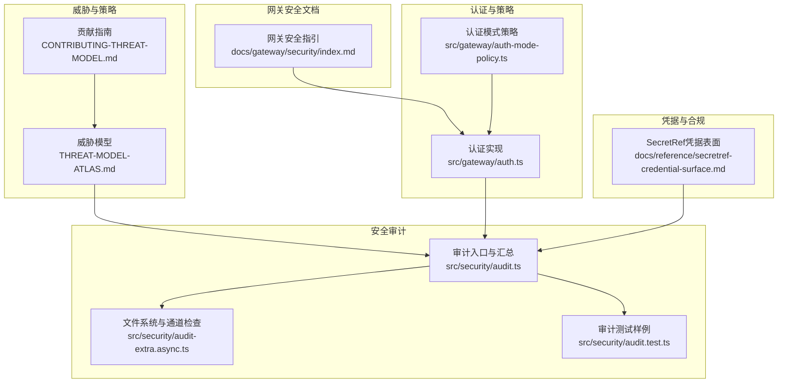
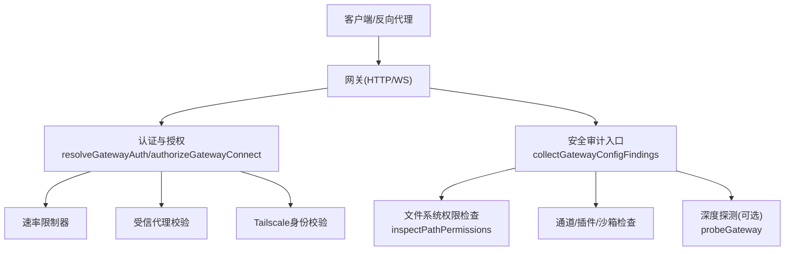
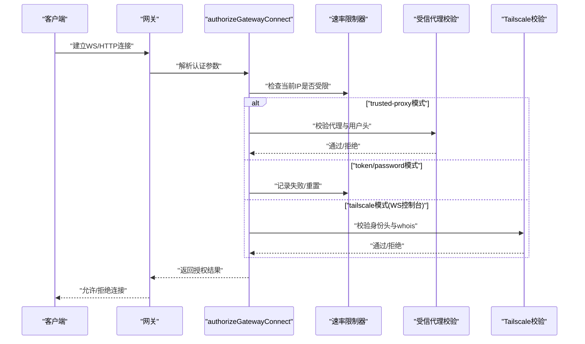
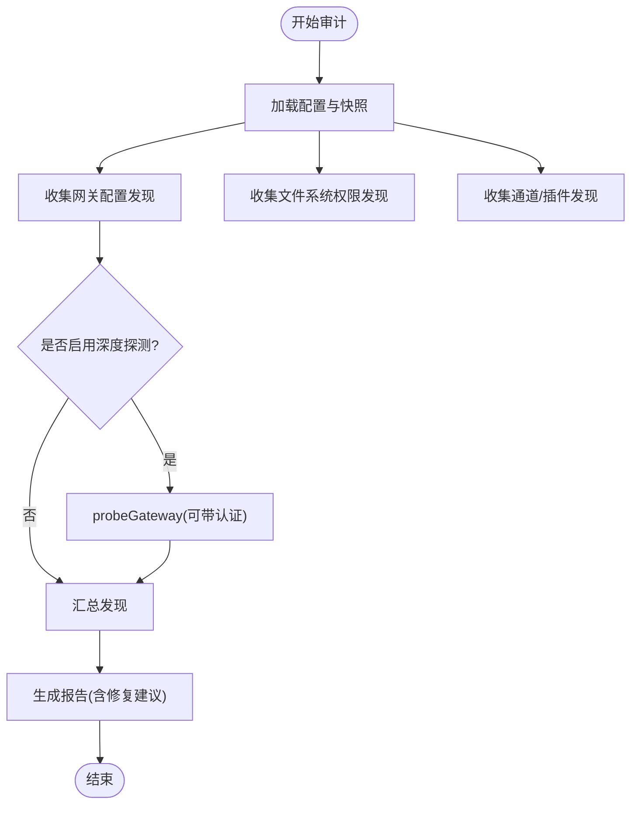
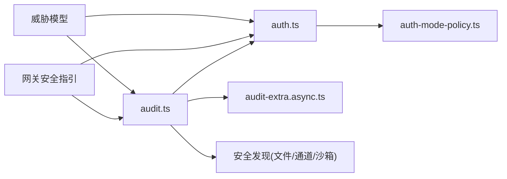

# 网关安全

<cite>
**本文引用的文件**
- [docs/security/THREAT-MODEL-ATLAS.md](file://docs/security/THREAT-MODEL-ATLAS.md)
- [docs/security/CONTRIBUTING-THREAT-MODEL.md](file://docs/security/CONTRIBUTING-THREAT-MODEL.md)
- [docs/gateway/security/index.md](file://docs/gateway/security/index.md)
- [docs/reference/secretref-credential-surface.md](file://docs/reference/secretref-credential-surface.md)
- [src/gateway/auth.ts](file://src/gateway/auth.ts)
- [src/gateway/auth-mode-policy.ts](file://src/gateway/auth-mode-policy.ts)
- [src/security/audit.ts](file://src/security/audit.ts)
- [src/security/audit-extra.async.ts](file://src/security/audit-extra.async.ts)
- [src/security/audit.test.ts](file://src/security/audit.test.ts)
- [SECURITY.md](file://SECURITY.md)
</cite>

## 目录
1. [简介](#简介)
2. [项目结构](#项目结构)
3. [核心组件](#核心组件)
4. [架构总览](#架构总览)
5. [详细组件分析](#详细组件分析)
6. [依赖关系分析](#依赖关系分析)
7. [性能考量](#性能考量)
8. [故障排查指南](#故障排查指南)
9. [结论](#结论)
10. [附录](#附录)

## 简介
本文件面向“网关安全系统”的设计与实现，聚焦于网关的安全架构、威胁模型与防护机制，覆盖密钥与凭据管理、敏感信息保护、安全配置、访问控制与权限、安全审计与日志、入侵检测与事件响应、以及多租户隔离与合规要点。内容基于仓库中的威胁模型、安全审计实现与网关认证模块，确保技术细节与可操作建议并重。

## 项目结构
围绕网关安全的关键文件分布如下：
- 威胁模型与贡献指南：用于理解整体威胁面与持续改进流程
- 网关安全文档：提供部署假设、访问控制、工具策略、反向代理与TLS/HSTS等实践
- 网关认证与模式策略：实现认证解析、速率限制、受信代理与Tailscale集成
- 安全审计与扩展：集中式安全审计、文件系统权限检查、通道安全与深度探测
- 凭据表面定义：明确SecretRef支持的凭据范围与边界

图表来源
- [docs/security/THREAT-MODEL-ATLAS.md:1-604](file://docs/security/THREAT-MODEL-ATLAS.md#L1-L604)
- [docs/gateway/security/index.md:1-800](file://docs/gateway/security/index.md#L1-L800)
- [src/gateway/auth.ts:1-495](file://src/gateway/auth.ts#L1-L495)
- [src/gateway/auth-mode-policy.ts:1-27](file://src/gateway/auth-mode-policy.ts#L1-L27)
- [src/security/audit.ts:1-800](file://src/security/audit.ts#L1-L800)
- [src/security/audit-extra.async.ts:915-981](file://src/security/audit-extra.async.ts#L915-L981)
- [docs/reference/secretref-credential-surface.md:1-133](file://docs/reference/secretref-credential-surface.md#L1-L133)

章节来源
- [docs/security/THREAT-MODEL-ATLAS.md:1-604](file://docs/security/THREAT-MODEL-ATLAS.md#L1-L604)
- [docs/gateway/security/index.md:1-800](file://docs/gateway/security/index.md#L1-L800)

## 核心组件
- 认证与授权
  - 解析与选择认证模式（token/password/trusted-proxy），并进行速率限制与受信代理校验
  - 支持Tailscale Serve身份头校验，限定WS控制台登录场景
- 安全审计
  - 统一收集与汇总安全发现，包括网关绑定/鉴权、受信代理、Tailscale、Control UI跨域与设备身份、mDNS广播、Docker沙箱、工具策略与插件可达性等
  - 文件系统权限检查（state/config/credentials/auth-profiles/log-file等）
- 凭据与SecretRef
  - 明确支持的凭据目标，指导凭据注入与审计
- 威胁模型
  - 基于MITRE ATLAS的系统架构、数据流、威胁分析与风险矩阵，给出优先级缓解建议

章节来源
- [src/gateway/auth.ts:208-495](file://src/gateway/auth.ts#L208-L495)
- [src/gateway/auth-mode-policy.ts:1-27](file://src/gateway/auth-mode-policy.ts#L1-L27)
- [src/security/audit.ts:352-701](file://src/security/audit.ts#L352-L701)
- [src/security/audit-extra.async.ts:915-981](file://src/security/audit-extra.async.ts#L915-L981)
- [docs/reference/secretref-credential-surface.md:19-133](file://docs/reference/secretref-credential-surface.md#L19-L133)
- [docs/security/THREAT-MODEL-ATLAS.md:138-527](file://docs/security/THREAT-MODEL-ATLAS.md#L138-L527)

## 架构总览
下图展示网关安全相关组件的交互关系与数据流：

图表来源
- [src/gateway/auth.ts:208-495](file://src/gateway/auth.ts#L208-L495)
- [src/security/audit.ts:352-701](file://src/security/audit.ts#L352-L701)
- [src/security/audit-extra.async.ts:915-981](file://src/security/audit-extra.async.ts#L915-L981)

## 详细组件分析

### 认证与授权（GatewayAuth）
- 模式解析
  - 支持显式模式（token/password/trusted-proxy）与默认回退；当同时配置token与password且未指定模式时，抛出明确错误提示
  - 支持通过环境变量与SecretRef解析凭据值
- 授权流程
  - 受信代理：校验代理地址、必要头部、用户头与白名单用户
  - Tailscale：仅在WS控制台场景启用，校验X-Forwarded-*与tailscale whois结果
  - 共享密钥：token/password均采用常量时间比较，失败计入速率限制
  - 速率限制：按共享密钥作用域统计失败次数，支持锁定窗口
- 本地直连判定
  - 结合XFF/X-Real-IP与受信代理列表，区分本地直连与代理转发

图表来源
- [src/gateway/auth.ts:369-495](file://src/gateway/auth.ts#L369-L495)

章节来源
- [src/gateway/auth.ts:208-495](file://src/gateway/auth.ts#L208-L495)
- [src/gateway/auth-mode-policy.ts:1-27](file://src/gateway/auth-mode-policy.ts#L1-L27)

### 安全审计（SecurityAudit）
- 审计范围
  - 网关配置：bind/auth、受信代理、Tailscale Serve/Funnel、Control UI跨域与设备身份、mDNS广播、危险开关
  - 文件系统：state/config/credentials/auth-profiles/log-file/include路径权限
  - 插件与通道：扩展工具可达性、通道安全策略
  - 深度探测：可选Live Gateway探测（带超时与认证）
- 发现分级
  - critical/warn/info三类，汇总统计并输出修复建议
- 关键检查点
  - gateway.bind_no_auth、gateway.loopback_no_auth、gateway.control_ui.allowed_origins_required
  - gateway.tools_invoke_http.dangerous_allow、gateway.nodes.allow_commands_dangerous
  - fs.config.perms_world_readable、fs.state_dir.perms_world_writable
  - sandbox.docker_config_mode_off、tools.exec.host_sandbox_no_sandbox_*等

图表来源
- [src/security/audit.ts:90-180](file://src/security/audit.ts#L90-L180)
- [src/security/audit.ts:352-701](file://src/security/audit.ts#L352-L701)
- [src/security/audit-extra.async.ts:915-981](file://src/security/audit-extra.async.ts#L915-L981)

章节来源
- [src/security/audit.ts:90-180](file://src/security/audit.ts#L90-L180)
- [src/security/audit.ts:352-701](file://src/security/audit.ts#L352-L701)
- [src/security/audit-extra.async.ts:915-981](file://src/security/audit-extra.async.ts#L915-L981)
- [src/security/audit.test.ts:383-424](file://src/security/audit.test.ts#L383-L424)

### 威胁模型（MITRE ATLAS）
- 系统架构与信任边界
  - UNTRUSTED ZONE → Channel Access → Session Isolation → Tool Execution → External Content → Supply Chain
- 数据流
  - F1-F6：消息路由、工具调用、外部抓取、技能分发、响应输出
- 主要威胁与风险矩阵
  - 执行类（Prompt Injection、间接注入、命令注入）、持久化（恶意技能、更新投毒、配置篡改）、防御规避（模式绕过、包装逃逸）、发现与集合（工具枚举、会话数据提取、凭证收割）、影响（未授权命令执行、资源耗尽、声誉损害）
- 关键建议
  - 立即：VirusTotal集成、技能沙箱、输出验证
  - 短期：速率限制、密钥加密、提升审批UX与URL白名单
  - 中期：通道加密验证、配置完整性校验、更新签名与版本固定

章节来源
- [docs/security/THREAT-MODEL-ATLAS.md:56-135](file://docs/security/THREAT-MODEL-ATLAS.md#L56-L135)
- [docs/security/THREAT-MODEL-ATLAS.md:138-527](file://docs/security/THREAT-MODEL-ATLAS.md#L138-L527)
- [docs/security/CONTRIBUTING-THREAT-MODEL.md:1-91](file://docs/security/CONTRIBUTING-THREAT-MODEL.md#L1-L91)

### 凭据与SecretRef
- 支持范围
  - openclaw.json目标：模型、技能、消息、Web搜索、网关认证/远程凭据、Hook令牌、各通道令牌/密钥等
  - auth-profiles.json目标：api_key/token两类引用
- 不在范围
  - 运行时生成/轮换、OAuth刷新材料、会话类工件等
- 实践要点
  - 使用SecretRef进行只读外部解析，避免在配置中直接存放明文
  - 对于网关认证密码，需注意启动阶段Secrets系统尚未初始化，应使用环境变量或明文字符串

章节来源
- [docs/reference/secretref-credential-surface.md:19-133](file://docs/reference/secretref-credential-surface.md#L19-L133)
- [src/gateway/auth.ts:238-247](file://src/gateway/auth.ts#L238-L247)

### 多租户与隔离
- 个人助理模型
  - 默认单用户/单信任边界，Operator控制面访问为受信控制面角色
  - sessionKey仅为路由选择，非用户授权令牌
- 共享Agent风险
  - 同一Agent被多人使用时，存在委托工具权限与上下文泄露风险
- 建议
  - 分离信任边界（独立网关/OS用户/主机/VPS）
  - 使用per-channel-peer会话隔离降低跨用户上下文泄漏

章节来源
- [docs/gateway/security/index.md:60-109](file://docs/gateway/security/index.md#L60-L109)
- [docs/gateway/security/index.md:78-96](file://docs/gateway/security/index.md#L78-L96)

## 依赖关系分析

图表来源
- [src/gateway/auth.ts:1-495](file://src/gateway/auth.ts#L1-L495)
- [src/gateway/auth-mode-policy.ts:1-27](file://src/gateway/auth-mode-policy.ts#L1-L27)
- [src/security/audit.ts:1-800](file://src/security/audit.ts#L1-L800)
- [src/security/audit-extra.async.ts:915-981](file://src/security/audit-extra.async.ts#L915-L981)
- [docs/gateway/security/index.md:1-800](file://docs/gateway/security/index.md#L1-L800)
- [docs/security/THREAT-MODEL-ATLAS.md:1-604](file://docs/security/THREAT-MODEL-ATLAS.md#L1-L604)

章节来源
- [src/gateway/auth.ts:1-495](file://src/gateway/auth.ts#L1-L495)
- [src/gateway/auth-mode-policy.ts:1-27](file://src/gateway/auth-mode-policy.ts#L1-L27)
- [src/security/audit.ts:1-800](file://src/security/audit.ts#L1-L800)
- [src/security/audit-extra.async.ts:915-981](file://src/security/audit-extra.async.ts#L915-L981)
- [docs/gateway/security/index.md:1-800](file://docs/gateway/security/index.md#L1-L800)
- [docs/security/THREAT-MODEL-ATLAS.md:1-604](file://docs/security/THREAT-MODEL-ATLAS.md#L1-L604)

## 性能考量
- 速率限制
  - 在认证失败路径引入失败计数与锁定窗口，避免暴力破解；对缺失凭据不计入失败槽位
- 深度探测
  - 可选的Live Gateway探测带超时控制，避免阻塞审计
- 文件系统检查
  - 权限检查为O(n)遍历include路径，建议在CI/离线场景批量执行

章节来源
- [src/gateway/auth.ts:406-422](file://src/gateway/auth.ts#L406-L422)
- [src/security/audit.ts:90-118](file://src/security/audit.ts#L90-L118)
- [src/security/audit-extra.async.ts:915-981](file://src/security/audit-extra.async.ts#L915-L981)

## 故障排查指南
- 常见问题定位
  - 网关暴露且无认证：gateway.bind_no_auth、gateway.loopback_no_auth
  - 受信代理配置不当：gateway.trusted_proxy_auth、gateway.trusted_proxy_no_proxies、gateway.trusted_proxy_no_user_header
  - Control UI跨域/设备身份：gateway.control_ui.allowed_origins_required、gateway.control_ui.device_auth_disabled
  - mDNS广播泄露：discovery.mdns_full_mode
  - Docker沙箱误配置：sandbox.docker_config_mode_off、sandbox.dangerous_network_mode
  - 工具策略与插件可达性：tools.profile_minimal_overridden、plugins.tools_reachable_permissive_policy
- 修复建议
  - 严格文件权限（state/config/credentials/auth-profiles/log-file）
  - 仅在必要时启用危险开关，优先使用loopback/Tailscale Serve
  - 为HTTP API保留速率限制，为Control UI配置明确allowedOrigins
  - 为受信代理配置严格的userHeader与allowUsers白名单

章节来源
- [src/security/audit.ts:352-701](file://src/security/audit.ts#L352-L701)
- [src/security/audit-extra.async.ts:915-981](file://src/security/audit-extra.async.ts#L915-L981)
- [docs/gateway/security/index.md:213-262](file://docs/gateway/security/index.md#L213-L262)

## 结论
本安全体系以“访问控制优先于智能”为核心理念，结合MITRE ATLAS威胁模型与内置安全审计，形成从认证、策略、工具、通道到文件系统的全链路防护闭环。通过SecretRef凭据管理、受信代理与Tailscale身份校验、速率限制与深度探测，以及严格的文件系统权限与合规边界，显著降低网关层面的暴露面与攻击面。建议在生产环境中默认启用loopback/Tailscale Serve、严格工具策略与沙箱、最小化公开暴露，并定期运行安全审计以持续加固。

## 附录

### 安全配置与最佳实践清单
- 认证
  - 使用token模式并设置足够长度随机token；必要时启用速率限制
  - 受信代理：配置userHeader与allowUsers白名单，严格trustedProxies
  - Tailscale Serve：仅在WS控制台启用身份头校验，避免在HTTP API场景使用
- 网络暴露
  - 默认bind: loopback；如需外网，使用Tailscale Serve而非LAN/Funnel
  - Control UI：配置allowedOrigins，禁用Host-header origin fallback
  - mDNS：推荐minimal或off，避免广播cliPath/sshPort
- 工具与策略
  - 默认deny高危工具（gateway、cron、sessions_*），按Agent细化
  - 沙箱：默认开启，严格network模式与workspaceOnly
- 凭据与密钥
  - 使用SecretRef管理模型/通道/API密钥；避免明文写入配置
  - 定期轮换gateway.auth.token/password，更新远程客户端凭据
- 审计与日志
  - 定期运行openclaw security audit/--deep，关注critical/warn项
  - 严格日志脱敏，避免敏感信息落盘

章节来源
- [docs/gateway/security/index.md:146-196](file://docs/gateway/security/index.md#L146-L196)
- [docs/reference/secretref-credential-surface.md:19-133](file://docs/reference/secretref-credential-surface.md#L19-L133)
- [src/gateway/auth.ts:406-422](file://src/gateway/auth.ts#L406-L422)
- [src/security/audit.ts:352-701](file://src/security/audit.ts#L352-L701)

### 安全事件响应流程
- 立即处置
  - 停止受影响Agent/网关，封锁入站（DM策略、群组白名单、提及门控）
  - 轮换网关认证令牌/密码、Hook令牌与可疑节点配对
  - 撤销/轮换模型提供商凭证
- 审查与取证
  - 审核网关日志与会话历史，识别异常工具调用
  - 清理不受信任的扩展与技能
- 复盘与加固
  - 运行--deep安全审计，确保无残留风险
  - 回归最小权限策略，收紧工具与通道策略

章节来源
- [docs/zh-CN/gateway/security/index.md:273-315](file://docs/zh-CN/gateway/security/index.md#L273-L315)
- [SECURITY.md:49-70](file://SECURITY.md#L49-L70)