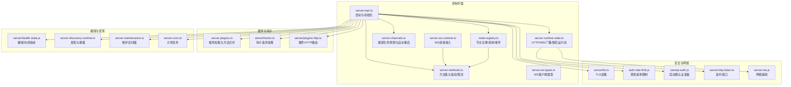
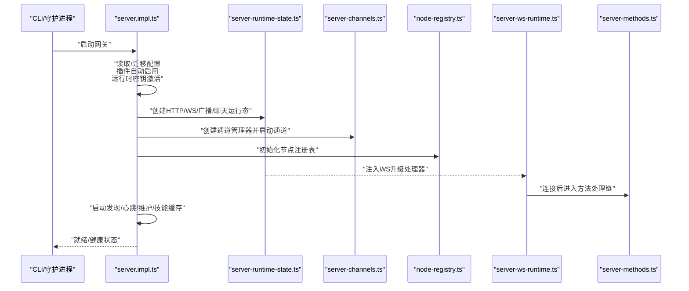
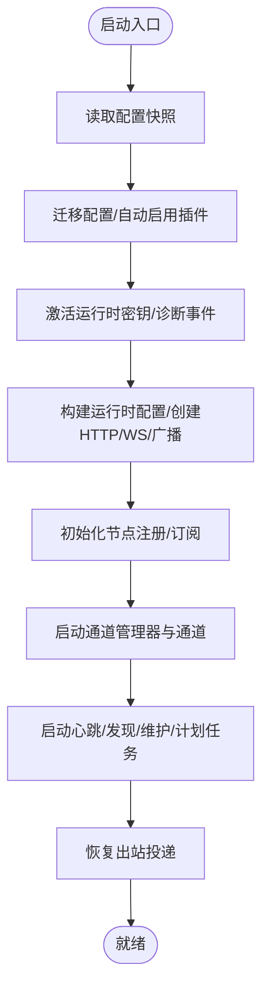
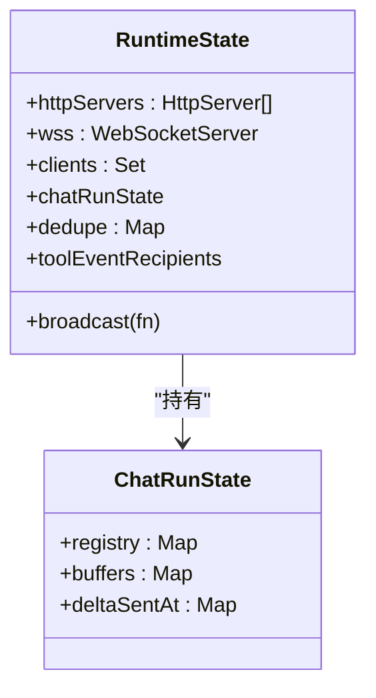
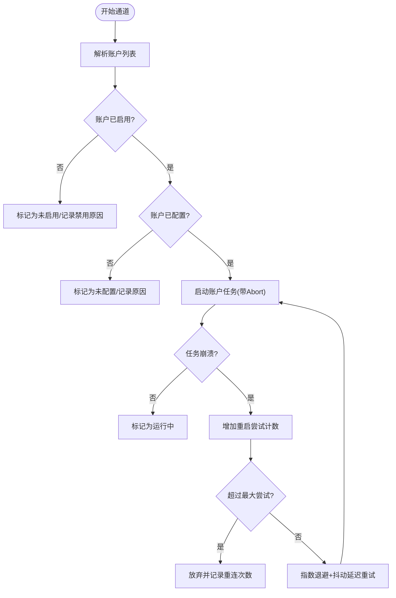
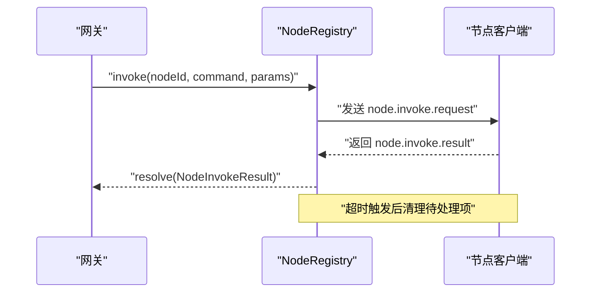
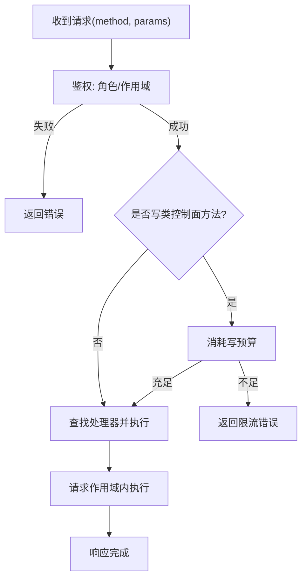
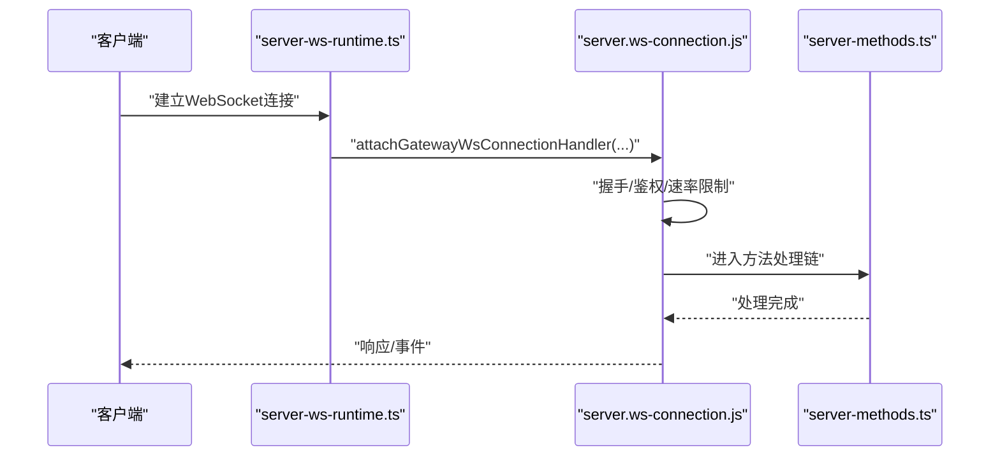
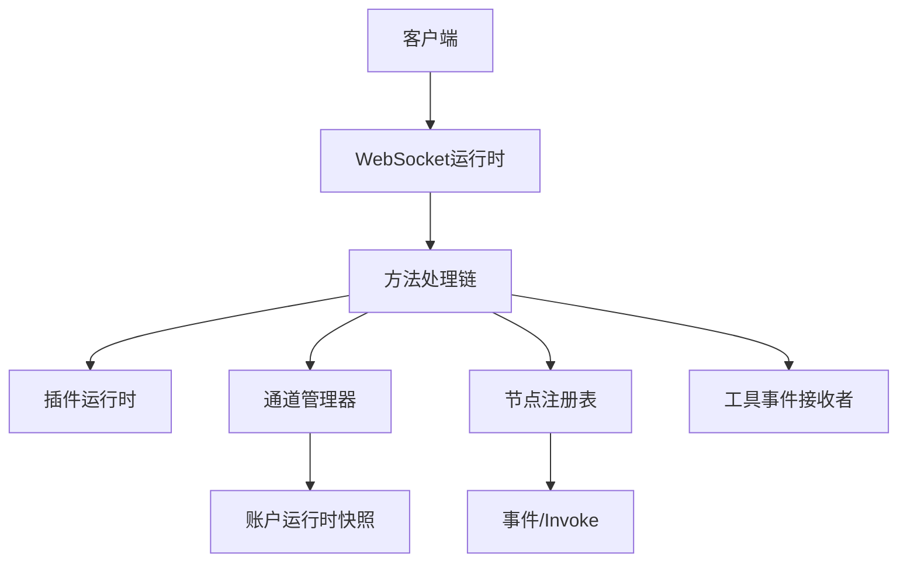
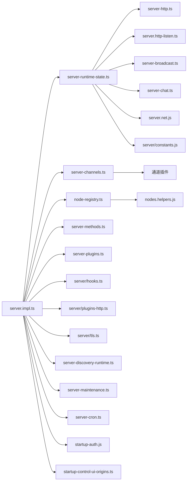

# 网关架构设计

<cite>
**本文引用的文件**
- [src/gateway/server.impl.ts](file://src/gateway/server.impl.ts)
- [src/gateway/server-runtime-state.ts](file://src/gateway/server-runtime-state.ts)
- [src/gateway/server-channels.ts](file://src/gateway/server-channels.ts)
- [src/gateway/node-registry.ts](file://src/gateway/node-registry.ts)
- [src/gateway/server-methods.ts](file://src/gateway/server-methods.ts)
- [src/gateway/server-ws-runtime.ts](file://src/gateway/server-ws-runtime.ts)
- [src/gateway/server.ws-types.ts](file://src/gateway/server.ws-types.ts)
- [src/cli/daemon-cli/lifecycle.ts](file://src/cli/daemon-cli/lifecycle.ts)
- [src/cli/daemon-cli/restart-health.ts](file://src/cli/daemon-cli/restart-health.ts)
- [src/gateway/startup-control-ui-origins.ts](file://src/gateway/startup-control-ui-origins.ts)
- [src/gateway/server.http-listen.ts](file://src/gateway/server.http-listen.ts)
- [src/gateway/server-http.ts](file://src/gateway/server-http.ts)
- [src/gateway/server-broadcast.ts](file://src/gateway/server-broadcast.ts)
- [src/gateway/server-chat.ts](file://src/gateway/server-chat.ts)
- [src/gateway/server/plugins-http.ts](file://src/gateway/server/plugins-http.ts)
- [src/gateway/server/hooks.ts](file://src/gateway/server/hooks.ts)
- [src/gateway/server/tls.ts](file://src/gateway/server/tls.ts)
- [src/gateway/server-discovery-runtime.ts](file://src/gateway/server-discovery-runtime.ts)
- [src/gateway/server-maintenance.ts](file://src/gateway/server-maintenance.ts)
- [src/gateway/server-cron.ts](file://src/gateway/server-cron.ts)
- [src/gateway/server-model-catalog.ts](file://src/gateway/server-model-catalog.ts)
- [src/gateway/server-plugins.ts](file://src/gateway/server-plugins.ts)
- [src/gateway/server-startup.ts](file://src/gateway/server-startup.ts)
- [src/gateway/server-tailscale.ts](file://src/gateway/server-tailscale.ts)
- [src/gateway/server-wizard-sessions.ts](file://src/gateway/server-wizard-sessions.ts)
- [src/gateway/server-node-subscriptions.ts](file://src/gateway/server-node-subscriptions.ts)
- [src/gateway/server-methods/nodes.helpers.ts](file://src/gateway/server-methods/nodes.helpers.ts)
- [src/gateway/server-methods/exec-approval.js](file://src/gateway/server-methods/exec-approval.js)
- [src/gateway/server-methods/secrets.js](file://src/gateway/server-methods/secrets.js)
- [src/gateway/server-methods/connect.js](file://src/gateway/server-methods/connect.js)
- [src/gateway/server-methods/chat.js](file://src/gateway/server-methods/chat.js)
- [src/gateway/server-methods/sessions.js](file://src/gateway/server-methods/sessions.js)
- [src/gateway/server-methods/skills.js](file://src/gateway/server-methods/skills.js)
- [src/gateway/server-methods/system.js](file://src/gateway/server-methods/system.js)
- [src/gateway/server-methods/tools-catalog.js](file://src/gateway/server-methods/tools-catalog.js)
- [src/gateway/server-methods/usage.js](file://src/gateway/server-methods/usage.js)
- [src/gateway/server-methods/agent.js](file://src/gateway/server-methods/agent.js)
- [src/gateway/server-methods/agents.js](file://src/gateway/server-methods/agents.js)
- [src/gateway/server-methods/browser.js](file://src/gateway/server-methods/browser.js)
- [src/gateway/server-methods/channels.js](file://src/gateway/server-methods/channels.js)
- [src/gateway/server-methods/config.js](file://src/gateway/server-methods/config.js)
- [src/gateway/server-methods/cron.js](file://src/gateway/server-methods/cron.js)
- [src/gateway/server-methods/devices.js](file://src/gateway/server-methods/devices.js)
- [src/gateway/server-methods/doctor.js](file://src/gateway/server-methods/doctor.js)
- [src/gateway/server-methods/exec-approvals.js](file://src/gateway/server-methods/exec-approvals.js)
- [src/gateway/server-methods/health.js](file://src/gateway/server-methods/health.js)
- [src/gateway/server-methods/logs.js](file://src/gateway/server-methods/logs.js)
- [src/gateway/server-methods/models.js](file://src/gateway/server-methods/models.js)
- [src/gateway/server-methods/nodes-pending.js](file://src/gateway/server-methods/nodes-pending.js)
- [src/gateway/server-methods/nodes.js](file://src/gateway/server-methods/nodes.js)
- [src/gateway/server-methods/push.js](file://src/gateway/server-methods/push.js)
- [src/gateway/server-methods/send.js](file://src/gateway/server-methods/send.js)
- [src/gateway/server-methods/talk.js](file://src/gateway/server-methods/talk.js)
- [src/gateway/server-methods/tts.js](file://src/gateway/server-methods/tts.js)
- [src/gateway/server-methods/update.js](file://src/gateway/server-methods/update.js)
- [src/gateway/server-methods/voicewake.js](file://src/gateway/server-methods/voicewake.js)
- [src/gateway/server-methods/web.js](file://src/gateway/server-methods/web.js)
- [src/gateway/server-methods/wizard.js](file://src/gateway/server-methods/wizard.js)
- [src/gateway/server-methods-list.js](file://src/gateway/server-methods-list.js)
- [src/gateway/events.js](file://src/gateway/events.js)
- [src/gateway/server/health-state.js](file://src/gateway/server/health-state.js)
- [src/gateway/server/readiness.js](file://src/gateway/server/readiness.js)
- [src/gateway/server-lanes.js](file://src/gateway/server-lanes.js)
- [src/gateway/server-session-key.js](file://src/gateway/server-session-key.js)
- [src/gateway/server-startup-log.js](file://src/gateway/server-startup-log.js)
- [src/gateway/server-close.js](file://src/gateway/server-close.js)
- [src/gateway/server-reload-handlers.js](file://src/gateway/server-reload-handlers.js)
- [src/gateway/server-runtime-config.js](file://src/gateway/server-runtime-config.js)
- [src/gateway/server-ws-runtime.js](file://src/gateway/server-ws-runtime.js)
- [src/gateway/server-mobile-nodes.js](file://src/gateway/server-mobile-nodes.js)
- [src/gateway/server-node-subscriptions.js](file://src/gateway/server-node-subscriptions.js)
- [src/gateway/server-methods/types.js](file://src/gateway/server-methods/types.js)
- [src/gateway/method-scopes.js](file://src/gateway/method-scopes.js)
- [src/gateway/role-policy.js](file://src/gateway/role-policy.js)
- [src/gateway/control-plane-audit.js](file://src/gateway/control-plane-audit.js)
- [src/gateway/control-plane-rate-limit.js](file://src/gateway/control-plane-rate-limit.js)
- [src/gateway/auth-rate-limit.js](file://src/gateway/auth-rate-limit.js)
- [src/gateway/startup-auth.js](file://src/gateway/startup-auth.js)
- [src/gateway/channel-health-monitor.js](file://src/gateway/channel-health-monitor.js)
- [src/gateway/server/constants.js](file://src/gateway/server/constants.js)
- [src/gateway/net.js](file://src/gateway/net.js)
- [src/gateway/server/ws-connection.js](file://src/gateway/server/ws-connection.js)
- [src/gateway/server/ws-types.js](file://src/gateway/server.ws-types.ts)
- [src/gateway/server/plugins-http.js](file://src/gateway/server/plugins-http.js)
- [src/gateway/server/hooks.js](file://src/gateway/server/hooks.js)
- [src/gateway/server/tls.js](file://src/gateway/server/tls.js)
- [src/gateway/server-discovery-runtime.js](file://src/gateway/server-discovery-runtime.js)
- [src/gateway/server-maintenance.js](file://src/gateway/server-maintenance.js)
- [src/gateway/server-cron.js](file://src/gateway/server-cron.js)
- [src/gateway/server-model-catalog.js](file://src/gateway/server-model-catalog.js)
- [src/gateway/server-plugins.js](file://src/gateway/server-plugins.js)
- [src/gateway/server-startup.js](file://src/gateway/server-startup.js)
- [src/gateway/server-tailscale.js](file://src/gateway/server-tailscale.js)
- [src/gateway/server-wizard-sessions.js](file://src/gateway/server-wizard-sessions.js)
- [src/gateway/server-node-subscriptions.js](file://src/gateway/server-node-subscriptions.js)
- [src/gateway/server-methods/nodes.helpers.js](file://src/gateway/server-methods/nodes.helpers.js)
- [src/gateway/server-methods/exec-approval.js](file://src/gateway/server-methods/exec-approval.js)
- [src/gateway/server-methods/secrets.js](file://src/gateway/server-methods/secrets.js)
- [src/gateway/server-methods/connect.js](file://src/gateway/server-methods/connect.js)
- [src/gateway/server-methods/chat.js](file://src/gateway/server-methods/chat.js)
- [src/gateway/server-methods/sessions.js](file://src/gateway/server-methods/sessions.js)
- [src/gateway/server-methods/skills.js](file://src/gateway/server-methods/skills.js)
- [src/gateway/server-methods/system.js](file://src/gateway/server-methods/system.js)
- [src/gateway/server-methods/tools-catalog.js](file://src/gateway/server-methods/tools-catalog.js)
- [src/gateway/server-methods/usage.js](file://src/gateway/server-methods/usage.js)
- [src/gateway/server-methods/agent.js](file://src/gateway/server-methods/agent.js)
- [src/gateway/server-methods/agents.js](file://src/gateway/server-methods/agents.js)
- [src/gateway/server-methods/browser.js](file://src/gateway/server-methods/browser.js)
- [src/gateway/server-methods/channels.js](file://src/gateway/server-methods/channels.js)
- [src/gateway/server-methods/config.js](file://src/gateway/server-methods/config.js)
- [src/gateway/server-methods/cron.js](file://src/gateway/server-methods/cron.js)
- [src/gateway/server-methods/devices.js](file://src/gateway/server-methods/devices.js)
- [src/gateway/server-methods/doctor.js](file://src/gateway/server-methods/doctor.js)
- [src/gateway/server-methods/exec-approvals.js](file://src/gateway/server-methods/exec-approvals.js)
- [src/gateway/server-methods/health.js](file://src/gateway/server-methods/health.js)
- [src/gateway/server-methods/logs.js](file://src/gateway/server-methods/logs.js)
- [src/gateway/server-methods/models.js](file://src/gateway/server-methods/models.js)
- [src/gateway/server-methods/nodes-pending.js](file://src/gateway/server-methods/nodes-pending.js)
- [src/gateway/server-methods/nodes.js](file://src/gateway/server-methods/nodes.js)
- [src/gateway/server-methods/push.js](file://src/gateway/server-methods/push.js)
- [src/gateway/server-methods/send.js](file://src/gateway/server-methods/send.js)
- [src/gateway/server-methods/talk.js](file://src/gateway/server-methods/talk.js)
- [src/gateway/server-methods/tts.js](file://src/gateway/server-methods/tts.js)
- [src/gateway/server-methods/update.js](file://src/gateway/server-methods/update.js)
- [src/gateway/server-methods/voicewake.js](file://src/gateway/server-methods/voicewake.js)
- [src/gateway/server-methods/web.js](file://src/gateway/server-methods/web.js)
- [src/gateway/server-methods/wizard.js](file://src/gateway/server-methods/wizard.js)
- [src/gateway/server-methods-list.js](file://src/gateway/server-methods-list.js)
- [src/gateway/events.js](file://src/gateway/events.js)
- [src/gateway/server/health-state.js](file://src/gateway/server/health-state.js)
- [src/gateway/server/readiness.js](file://src/gateway/server/readiness.js)
- [src/gateway/server-lanes.js](file://src/gateway/server-lanes.js)
- [src/gateway/server-session-key.js](file://src/gateway/server-session-key.js)
- [src/gateway/server-startup-log.js](file://src/gateway/server-startup-log.js)
- [src/gateway/server-close.js](file://src/gateway/server-close.js)
- [src/gateway/server-reload-handlers.js](file://src/gateway/server-reload-handlers.js)
- [src/gateway/server-runtime-config.js](file://src/gateway/server-runtime-config.js)
- [src/gateway/server-ws-runtime.js](file://src/gateway/server-ws-runtime.js)
- [src/gateway/server-mobile-nodes.js](file://src/gateway/server-mobile-nodes.js)
- [src/gateway/server-node-subscriptions.js](file://src/gateway/server-node-subscriptions.js)
- [src/gateway/server-methods/types.js](file://src/gateway/server-methods/types.js)
- [src/gateway/method-scopes.js](file://src/gateway/method-scopes.js)
- [src/gateway/role-policy.js](file://src/gateway/role-policy.js)
- [src/gateway/control-plane-audit.js](file://src/gateway/control-plane-audit.js)
- [src/gateway/control-plane-rate-limit.js](file://src/gateway/control-plane-rate-limit.js)
- [src/gateway/auth-rate-limit.js](file://src/gateway/auth-rate-limit.js)
- [src/gateway/startup-auth.js](file://src/gateway/startup-auth.js)
- [src/gateway/channel-health-monitor.js](file://src/gateway/channel-health-monitor.js)
- [src/gateway/server/constants.js](file://src/gateway/server/constants.js)
- [src/gateway/net.js](file://src/gateway/net.js)
- [src/gateway/server/ws-connection.js](file://src/gateway/server/ws-connection.js)
- [src/gateway/server.ws-types.js](file://src/gateway/server.ws-types.ts)
- [src/gateway/server/plugins-http.js](file://src/gateway/server.plugins-http.js)
- [src/gateway/server/hooks.js](file://src/gateway/server/hooks.js)
- [src/gateway/server/tls.js](file://src/gateway/server/tls.js)
- [src/gateway/server-discovery-runtime.js](file://src/gateway/server-discovery-runtime.js)
- [src/gateway/server-maintenance.js](file://src/gateway/server-maintenance.js)
- [src/gateway/server-cron.js](file://src/gateway/server-cron.js)
- [src/gateway/server-model-catalog.js](file://src/gateway/server-model-catalog.js)
- [src/gateway/server-plugins.js](file://src/gateway/server-plugins.js)
- [src/gateway/server-startup.js](file://src/gateway/server-startup.js)
- [src/gateway/server-tailscale.js](file://src/gateway/server-tailscale.js)
- [src/gateway/server-wizard-sessions.js](file://src/gateway/server-wizard-sessions.js)
- [src/gateway/server-node-subscriptions.js](file://src/gateway/server-node-subscriptions.js)
- [src/gateway/server-methods/nodes.helpers.js](file://src/gateway/server-methods/nodes.helpers.js)
- [src/gateway/server-methods/exec-approval.js](file://src/gateway/server-methods/exec-approval.js)
- [src/gateway/server-methods/secrets.js](file://src/gateway/server-methods/secrets.js)
- [src/gateway/server-methods/connect.js](file://src/gateway/server-methods/connect.js)
- [src/gateway/server-methods/chat.js](file://src/gateway/server-methods/chat.js)
- [src/gateway/server-methods/sessions.js](file://src/gateway/server-methods/sessions.js)
- [src/gateway/server-methods/skills.js](file://src/gateway/server-methods/skills.js)
- [src/gateway/server-methods/system.js](file://src/gateway/server-methods/system.js)
- [src/gateway/server-methods/tools-catalog.js](file://src/gateway/server-methods/tools-catalog.js)
- [src/gateway/server-methods/usage.js](file://src/gateway/server-methods/usage.js)
- [src/gateway/server-methods/agent.js](file://src/gateway/server-methods/agent.js)
- [src/gateway/server-methods/agents.js](file://src/gateway/server-methods/agents.js)
- [src/gateway/server-methods/browser.js](file://src/gateway/server-methods/browser.js)
- [src/gateway/server-methods/channels.js](file://src/gateway/server-methods/channels.js)
- [src/gateway/server-methods/config.js](file://src/gateway/server-methods/config.js)
- [src/gateway/server-methods/cron.js](file://src/gateway/server-methods/cron.js)
- [src/gateway/server-methods/devices.js](file://src/gateway/server-methods/devices.js)
- [src/gateway/server-methods/doctor.js](file://src/gateway/server-methods/doctor.js)
- [src/gateway/server-methods/exec-approvals.js](file://src/gateway/server-methods/exec-approvals.js)
- [src/gateway/server-methods/health.js](file://src/gateway/server-methods/health.js)
- [src/gateway/server-methods/logs.js](file://src/gateway/server-methods/logs.js)
- [src/gateway/server-methods/models.js](file://src/gateway/server-methods/models.js)
- [src/gateway/server-methods/nodes-pending.js](file://src/gateway/server-methods/nodes-pending.js)
- [src/gateway/server-methods/nodes.js](file://src/gateway/server-methods/nodes.js)
- [src/gateway/server-methods/push.js](file://src/gateway/server-methods/push.js)
- [src/gateway/server-methods/send.js](file://src/gateway/server-methods/send.js)
- [src/gateway/server-methods/talk.js](file://src/gateway/server-methods/talk.js)
- [src/gateway/server-methods/tts.js](file://src/gateway/server-methods/tts.js)
- [src/gateway/server-methods/update.js](file://src/gateway/server-methods/update.js)
- [src/gateway/server-methods/voicewake.js](file://src/gateway/server-methods/voicewake.js)
- [src/gateway/server-methods/web.js](file://src/gateway/server-methods/web.js)
- [src/gateway/server-methods/wizard.js](file://src/gateway/server-methods/wizard.js)
- [src/gateway/server-methods-list.js](file://src/gateway/server-methods-list.js)
- [src/gateway/events.js](file://src/gateway/events.js)
- [src/gateway/server/health-state.js](file://src/gateway/server/health-state.js)
- [src/gateway/server/readiness.js](file://src/gateway/server/readiness.js)
- [src/gateway/server-lanes.js](file://src/gateway/server-lanes.js)
- [src/gateway/server-session-key.js](file://src/gateway/server-session-key.js)
- [src/gateway/server-startup-log.js](file://src/gateway/server-startup-log.js)
- [src/gateway/server-close.js](file://src/gateway/server-close.js)
- [src/gateway/server-reload-handlers.js](file://src/gateway/server-reload-handlers.js)
- [src/gateway/server-runtime-config.js](file://src/gateway/server-runtime-config.js)
- [src/gateway/server-ws-runtime.js](file://src/gateway/server-ws-runtime.js)
- [src/gateway/server-mobile-nodes.js](file://src/gateway/server-mobile-nodes.js)
- [src/gateway/server-node-subscriptions.js](file://src/gateway/server-node-subscriptions.js)
- [src/gateway/server-methods/types.js](file://src/gateway/server-methods/types.js)
- [src/gateway/method-scopes.js](file://src/gateway/method-scopes.js)
- [src/gateway/role-policy.js](file://src/gateway/role-policy.js)
- [src/gateway/control-plane-audit.js](file://src/gateway/control-plane-audit.js)
- [src/gateway/control-plane-rate-limit.js](file://src/gateway/control-plane-rate-limit.js)
- [src/gateway/auth-rate-limit.js](file://src/gateway/auth-rate-limit.js)
- [src/gateway/startup-auth.js](file://src/gateway/startup-auth.js)
- [src/gateway/channel-health-monitor.js](file://src/gateway/channel-health-monitor.js)
- [src/gateway/server/constants.js](file://src/gateway/server/constants.js)
- [src/gateway/net.js](file://src/gateway/net.js)
- [src/gateway/server/ws-connection.js](file://src/gateway/server.ws-connection.js)
- [src/gateway/server.ws-types.js](file://src/gateway/server.ws-types.ts)
</cite>

## 目录
1. [引言](#引言)
2. [项目结构](#项目结构)
3. [核心组件](#核心组件)
4. [架构总览](#架构总览)
5. [详细组件分析](#详细组件分析)
6. [依赖分析](#依赖分析)
7. [性能考虑](#性能考虑)
8. [故障排查指南](#故障排查指南)
9. [结论](#结论)
10. [附录](#附录)

## 引言
本文件面向OpenClaw网关的控制平面，系统化阐述其整体架构与实现细节，重点覆盖服务启动流程、组件初始化顺序、内存与资源管理策略、核心职责（会话管理、消息路由、状态同步、资源协调）、与客户端、通道适配器、工具系统的交互模式与数据流，并给出架构决策的技术考量、性能优化策略与扩展性设计建议。文档同时提供多幅架构与流程图，帮助开发者快速理解系统设计思路。

## 项目结构
OpenClaw网关位于src/gateway目录下，采用“按职责分层 + 按功能模块聚合”的组织方式：
- 启动与生命周期：server.impl.ts负责启动前配置校验、认证引导、运行时迁移、插件加载、运行态构建与守护进程集成。
- 运行时基础设施：server-runtime-state.ts负责HTTP/WebSocket服务器、广播、聊天运行态、Canvas Host挂载等。
- 通道适配器：server-channels.ts负责通道生命周期管理、自动重启、运行快照与账户维度运行时状态维护。
- 节点注册与调用：node-registry.ts负责节点连接、事件发送、invoke请求/响应与超时处理。
- 方法与权限：server-methods.ts定义核心方法集与鉴权/限流策略；配套角色与作用域策略在method-scopes.js与role-policy.js中。
- 通信与协议：server.ws-types.ts定义WebSocket客户端上下文；server.ws-connection.js处理握手、鉴权与请求分发；server-ws-runtime.ts将WS连接接入方法处理链。
- 插件与钩子：server-plugins.ts加载插件并合并方法；server/hooks.ts处理钩子请求；server/plugins-http.ts处理插件HTTP路由。
- 健康与发现：server/health-state.js维护健康与在线版本；server-discovery-runtime.ts负责mDNS/Tailscale发现；server-maintenance.ts与server-cron.ts负责定时任务与清理。
- TLS与安全：server/tls.ts加载TLS；auth-rate-limit.js提供登录速率限制；startup-auth.js负责启动期认证准备。
- 其他支撑：server.http-listen.ts监听端口；server-broadcast.ts广播；server-session-key.js会话键解析；server-lanes.js并发控制；server-startup-log.js启动日志；server-close.js优雅关闭；server-reload-handlers.js热重载；server-runtime-config.js运行时配置解析；server-mobile-nodes.js移动端节点检测；server-node-subscriptions.js节点订阅管理；server-methods-list.js列出可用方法；server/constants.js常量；server/net.js网络辅助；server-methods/types.js方法类型定义。

**图表来源**
- [src/gateway/server.impl.ts](file://src/gateway/server.impl.ts#L266-L800)
- [src/gateway/server-runtime-state.ts](file://src/gateway/server-runtime-state.ts#L39-L232)
- [src/gateway/server-channels.ts](file://src/gateway/server-channels.ts#L110-L458)
- [src/gateway/node-registry.ts](file://src/gateway/node-registry.ts#L38-L210)
- [src/gateway/server-methods.ts](file://src/gateway/server-methods.ts#L68-L158)
- [src/gateway/server-ws-runtime.ts](file://src/gateway/server-ws-runtime.ts#L24-L45)
- [src/gateway/server.ws-types.ts](file://src/gateway/server.ws-types.ts#L4-L13)
- [src/gateway/server-plugins.ts](file://src/gateway/server-plugins.ts)
- [src/gateway/server/hooks.ts](file://src/gateway/server/hooks.ts)
- [src/gateway/server/plugins-http.ts](file://src/gateway/server/plugins-http.ts)
- [src/gateway/server/health-state.js](file://src/gateway/server/health-state.js)
- [src/gateway/server-discovery-runtime.ts](file://src/gateway/server-discovery-runtime.ts)
- [src/gateway/server-maintenance.ts](file://src/gateway/server-maintenance.ts)
- [src/gateway/server-cron.ts](file://src/gateway/server-cron.ts)
- [src/gateway/server/tls.ts](file://src/gateway/server/tls.ts)
- [src/gateway/auth-rate-limit.js](file://src/gateway/auth-rate-limit.js)
- [src/gateway/startup-auth.js](file://src/gateway/startup-auth.js)
- [src/gateway/server.http-listen.ts](file://src/gateway/server.http-listen.ts)
- [src/gateway/server.net.js](file://src/gateway/server.net.js)

**章节来源**
- [src/gateway/server.impl.ts](file://src/gateway/server.impl.ts#L266-L800)
- [src/gateway/server-runtime-state.ts](file://src/gateway/server-runtime-state.ts#L39-L232)
- [src/gateway/server-channels.ts](file://src/gateway/server-channels.ts#L110-L458)
- [src/gateway/node-registry.ts](file://src/gateway/node-registry.ts#L38-L210)
- [src/gateway/server-methods.ts](file://src/gateway/server-methods.ts#L68-L158)
- [src/gateway/server-ws-runtime.ts](file://src/gateway/server-ws-runtime.ts#L24-L45)
- [src/gateway/server.ws-types.ts](file://src/gateway/server.ws-types.ts#L4-L13)

## 核心组件
- 启动与初始化（server.impl.ts）
  - 配置读取与迁移、插件自动启用、运行时密钥激活、诊断心跳、重启策略、非回环绑定的Control UI允许来源种子。
  - 加载插件与通道方法，构建运行时配置，创建HTTP/WS服务器与Canvas Host，初始化节点注册、订阅、聊天运行态、心跳、发现、维护定时器、技能缓存与远程二进制刷新。
  - 启动通道、恢复出站投递、执行预启动迁移与安全检查。
- 运行时状态（server-runtime-state.ts）
  - 创建HTTP服务器、绑定主机与端口、配置TLS、创建WebSocket升级处理器、建立客户端集合与广播器、初始化聊天运行态与去重表、工具事件接收者注册。
- 通道管理（server-channels.ts）
  - 维护每个通道的账户级运行时快照，支持启动/停止/注销标记、自动重启（带退避策略与最大尝试次数）、手动停止标记、运行状态持久化。
- 节点注册与调用（node-registry.ts）
  - 注册/注销节点，记录连接元信息，发起node.invoke请求并等待结果，处理invoke结果回调，发送事件到节点。
- 方法与权限（server-methods.ts）
  - 定义核心方法集，统一鉴权（角色/作用域），对写类控制面方法进行速率限制，将请求派发至具体处理器。
- WebSocket运行时（server-ws-runtime.ts + server.ws-connection.js）
  - 将WebSocket连接接入方法处理链，处理握手、鉴权、速率限制、事件广播与上下文构建。

**章节来源**
- [src/gateway/server.impl.ts](file://src/gateway/server.impl.ts#L266-L800)
- [src/gateway/server-runtime-state.ts](file://src/gateway/server-runtime-state.ts#L39-L232)
- [src/gateway/server-channels.ts](file://src/gateway/server-channels.ts#L110-L458)
- [src/gateway/node-registry.ts](file://src/gateway/node-registry.ts#L38-L210)
- [src/gateway/server-methods.ts](file://src/gateway/server-methods.ts#L68-L158)
- [src/gateway/server-ws-runtime.ts](file://src/gateway/server-ws-runtime.ts#L24-L45)

## 架构总览
下图展示OpenClaw网关从启动到运行的关键路径与组件交互：

**图表来源**
- [src/gateway/server.impl.ts](file://src/gateway/server.impl.ts#L266-L800)
- [src/gateway/server-runtime-state.ts](file://src/gateway/server-runtime-state.ts#L39-L232)
- [src/gateway/server-channels.ts](file://src/gateway/server-channels.ts#L110-L458)
- [src/gateway/node-registry.ts](file://src/gateway/node-registry.ts#L38-L210)
- [src/gateway/server-ws-runtime.ts](file://src/gateway/server-ws-runtime.ts#L24-L45)
- [src/gateway/server-methods.ts](file://src/gateway/server-methods.ts#L68-L158)

## 详细组件分析

### 启动与生命周期（server.impl.ts）
- 关键职责
  - 配置快照读取与迁移、插件自动启用、运行时密钥激活与诊断事件、重启策略设置、非回环绑定的Control UI允许来源种子。
  - 插件与通道方法合并，构建运行时配置（绑定主机、端口、认证、TLS、HTTP端点开关），创建HTTP/WS服务器、Canvas Host、广播器、聊天运行态、节点注册与订阅、心跳与发现、维护定时器、技能缓存与远程二进制刷新、通道启动、出站投递恢复。
- 初始化顺序
  - 1) 读取配置快照并迁移；2) 插件自动启用并写回；3) 运行时密钥激活与诊断；4) 启动发现、技能缓存与远程二进制刷新；5) 创建运行时状态（HTTP/WS/广播/聊天）；6) 初始化节点注册与订阅；7) 启动通道；8) 启动心跳、维护定时器、计划任务；9) 恢复出站投递；10) 设置重启策略与预检。
- 内存与资源管理
  - 使用弱映射与集合管理会话级运行时对象；聊天运行态使用Map存储运行条目与缓冲；去重表用于消息去重；工具事件接收者注册用于事件路由；维护定时器清理过期资源（媒体、聊天运行态、去重项）。
- 错误处理
  - 启动期密钥不可用直接失败；通道异常按账户维度记录错误并自动重启（带退避与上限）；手动停止标记避免自动重启；出站投递恢复失败记录错误但不阻塞启动。

**图表来源**
- [src/gateway/server.impl.ts](file://src/gateway/server.impl.ts#L266-L800)

**章节来源**
- [src/gateway/server.impl.ts](file://src/gateway/server.impl.ts#L266-L800)

### 运行时状态（server-runtime-state.ts）
- 关键职责
  - 创建HTTP服务器（支持多绑定主机）、配置TLS、创建WebSocket升级处理器、建立客户端集合与广播器、初始化聊天运行态（运行条目、缓冲、时间戳）、工具事件接收者注册。
- 数据结构与复杂度
  - 客户端集合：Set，O(1)增删查；广播器：Map键值查找O(1)；聊天运行态：Map键值查找O(1)；去重表：Map键值查找O(1)。
- 性能与扩展
  - 支持多绑定主机以提升网络可达性；WebSocket最大负载常量控制内存占用；Canvas Host可选挂载以支持UI开发与热重载。

**图表来源**
- [src/gateway/server-runtime-state.ts](file://src/gateway/server-runtime-state.ts#L39-L232)

**章节来源**
- [src/gateway/server-runtime-state.ts](file://src/gateway/server-runtime-state.ts#L39-L232)

### 通道管理（server-channels.ts）
- 关键职责
  - 维护通道账户级运行时快照，支持启动/停止/注销标记、自动重启（指数退避+抖动，最大尝试次数）、手动停止标记、运行状态持久化。
- 数据结构与复杂度
  - 每个通道维护独立的运行时存储（AbortController、任务Promise、运行时快照），Map键值查找O(1)；账户维度状态聚合O(N)。
- 性能与扩展
  - 并行启动多个账户实例；自动重启策略避免频繁崩溃重启；手动停止标记防止误重启；注销标记更新最后错误信息。

**图表来源**
- [src/gateway/server-channels.ts](file://src/gateway/server-channels.ts#L110-L458)

**章节来源**
- [src/gateway/server-channels.ts](file://src/gateway/server-channels.ts#L110-L458)

### 节点注册与调用（node-registry.ts）
- 关键职责
  - 注册/注销节点，记录连接元信息（设备、平台、版本、能力、命令、权限、路径环境等），发起node.invoke请求并等待结果，处理invoke结果回调，发送事件到节点。
- 数据结构与复杂度
  - 节点映射：Map键值查找O(1)；待处理invoke：Map键值查找O(1)；超时定时器：setTimeout；断开清理遍历O(N)。
- 性能与扩展
  - UUID生成请求ID保证幂等；超时控制避免悬挂；断开时清理待处理invoke并返回错误；事件发送失败静默处理以降低耦合。

**图表来源**
- [src/gateway/node-registry.ts](file://src/gateway/node-registry.ts#L107-L181)

**章节来源**
- [src/gateway/node-registry.ts](file://src/gateway/node-registry.ts#L38-L210)

### 方法与权限（server-methods.ts）
- 关键职责
  - 定义核心方法集（连接、日志、语音唤醒、健康、通道、聊天、计划任务、设备、医生、执行审批、Web、模型、配置、向导、说话、工具目录、TTS、技能、会话、系统、更新、节点、推送、发送、用量、代理、代理组、浏览器等），统一鉴权（角色/作用域），对写类控制面方法进行速率限制。
- 权限与作用域
  - 角色解析与授权在role-policy.js与method-scopes.js中；管理员作用域绕过常规作用域检查；写类控制面方法受预算限制并记录审计信息。
- 扩展性
  - 通过extraHandlers参数动态注入新方法；withPluginRuntimeGatewayRequestScope确保插件运行时请求作用域内执行。

**图表来源**
- [src/gateway/server-methods.ts](file://src/gateway/server-methods.ts#L38-L158)
- [src/gateway/role-policy.js](file://src/gateway/role-policy.js)
- [src/gateway/method-scopes.js](file://src/gateway/method-scopes.js)
- [src/gateway/control-plane-rate-limit.js](file://src/gateway/control-plane-rate-limit.js)

**章节来源**
- [src/gateway/server-methods.ts](file://src/gateway/server-methods.ts#L68-L158)

### WebSocket运行时（server-ws-runtime.ts + server.ws-connection.js）
- 关键职责
  - 将WebSocket连接接入方法处理链，处理握手、鉴权（含浏览器速率限制）、速率限制、事件广播与上下文构建。
- 数据流
  - 连接建立后，根据连接参数与认证策略决定是否允许；随后进入方法处理链，所有处理器在请求作用域内执行，确保插件运行时可回注到网关。

**图表来源**
- [src/gateway/server-ws-runtime.ts](file://src/gateway/server-ws-runtime.ts#L24-L45)
- [src/gateway/server.ws-connection.js](file://src/gateway/server.ws-connection.js)
- [src/gateway/server-methods.ts](file://src/gateway/server-methods.ts#L68-L158)

**章节来源**
- [src/gateway/server-ws-runtime.ts](file://src/gateway/server-ws-runtime.ts#L24-L45)
- [src/gateway/server.ws-types.ts](file://src/gateway/server.ws-types.ts#L4-L13)

### 与客户端、通道适配器、工具系统的交互
- 客户端交互
  - 通过WebSocket连接，携带连接参数（设备、平台、版本、能力、命令、权限、路径环境等），经鉴权后进入方法处理链。
- 通道适配器
  - 通道插件通过gateway.startAccount/gateway.stopAccount钩子参与生命周期；账户维度运行时状态由通道管理器维护；注销时更新运行状态并记录最后错误。
- 工具系统
  - 工具事件接收者注册用于事件路由；聊天运行态与缓冲用于增量输出与去重；节点订阅管理用于定向事件投递。

**图表来源**
- [src/gateway/server-ws-runtime.ts](file://src/gateway/server-ws-runtime.ts#L24-L45)
- [src/gateway/server-methods.ts](file://src/gateway/server-methods.ts#L68-L158)
- [src/gateway/server-channels.ts](file://src/gateway/server-channels.ts#L110-L458)
- [src/gateway/node-registry.ts](file://src/gateway/node-registry.ts#L38-L210)
- [src/gateway/server-runtime-state.ts](file://src/gateway/server-runtime-state.ts#L39-L232)

**章节来源**
- [src/gateway/server-ws-runtime.ts](file://src/gateway/server-ws-runtime.ts#L24-L45)
- [src/gateway/server-methods.ts](file://src/gateway/server-methods.ts#L68-L158)
- [src/gateway/server-channels.ts](file://src/gateway/server-channels.ts#L110-L458)
- [src/gateway/node-registry.ts](file://src/gateway/node-registry.ts#L38-L210)
- [src/gateway/server-runtime-state.ts](file://src/gateway/server-runtime-state.ts#L39-L232)

## 依赖分析
- 组件耦合
  - server.impl.ts是中枢，依赖server-runtime-state.ts、server-channels.ts、node-registry.ts、server-methods.ts、server-plugins.ts、server/hooks.ts、server/plugins-http.ts、server/tls.ts、server-discovery-runtime.ts、server-maintenance.ts、server-cron.ts、server/startup-auth.js、server/startup-control-ui-origins.ts等。
  - server-runtime-state.ts依赖server-http.ts、server.http-listen.ts、server-broadcast.ts、server-chat.ts、server/plugins-http.ts、server/hooks.ts、server/tls.ts、server/net.js、server/constants.js。
  - server-channels.ts依赖通道插件索引、通道配置、回退策略与超时工具。
  - node-registry.ts依赖WebSocket类型与server-methods/nodes.helpers.js中的JSON解析。
- 外部依赖
  - ws库用于WebSocket服务器；Node.js内置crypto用于UUID；Node.js内置net用于网络辅助；第三方通道插件通过插件SDK集成。
- 循环依赖
  - 通过模块边界与运行时注入避免循环依赖；方法处理链通过extraHandlers参数注入避免编译期耦合。

**图表来源**
- [src/gateway/server.impl.ts](file://src/gateway/server.impl.ts#L266-L800)
- [src/gateway/server-runtime-state.ts](file://src/gateway/server-runtime-state.ts#L39-L232)
- [src/gateway/server-channels.ts](file://src/gateway/server-channels.ts#L110-L458)
- [src/gateway/node-registry.ts](file://src/gateway/node-registry.ts#L38-L210)
- [src/gateway/server-methods.ts](file://src/gateway/server-methods.ts#L68-L158)
- [src/gateway/server-plugins.ts](file://src/gateway/server-plugins.ts)
- [src/gateway/server/hooks.ts](file://src/gateway/server/hooks.ts)
- [src/gateway/server/plugins-http.ts](file://src/gateway/server/plugins-http.ts)
- [src/gateway/server/tls.ts](file://src/gateway/server/tls.ts)
- [src/gateway/server-discovery-runtime.ts](file://src/gateway/server-discovery-runtime.ts)
- [src/gateway/server-maintenance.ts](file://src/gateway/server-maintenance.ts)
- [src/gateway/server-cron.ts](file://src/gateway/server-cron.ts)
- [src/gateway/startup-auth.js](file://src/gateway/startup-auth.js)
- [src/gateway/startup-control-ui-origins.ts](file://src/gateway/startup-control-ui-origins.ts)
- [src/gateway/server-http.ts](file://src/gateway/server-http.ts)
- [src/gateway/server.http-listen.ts](file://src/gateway/server.http-listen.ts)
- [src/gateway/server-broadcast.ts](file://src/gateway/server-broadcast.ts)
- [src/gateway/server-chat.ts](file://src/gateway/server-chat.ts)
- [src/gateway/server.net.js](file://src/gateway/server.net.js)
- [src/gateway/server/constants.js](file://src/gateway/server/constants.js)
- [src/gateway/server-methods/nodes.helpers.js](file://src/gateway/server-methods/nodes.helpers.js)

**章节来源**
- [src/gateway/server.impl.ts](file://src/gateway/server.impl.ts#L266-L800)
- [src/gateway/server-runtime-state.ts](file://src/gateway/server-runtime-state.ts#L39-L232)
- [src/gateway/server-channels.ts](file://src/gateway/server-channels.ts#L110-L458)
- [src/gateway/node-registry.ts](file://src/gateway/node-registry.ts#L38-L210)
- [src/gateway/server-methods.ts](file://src/gateway/server-methods.ts#L68-L158)

## 性能考虑
- 启动阶段
  - 配置迁移与插件自动启用在启动早期完成，减少后续运行时抖动；运行时密钥激活与诊断事件仅在启用时开启，避免不必要的开销。
- 运行阶段
  - WebSocket最大负载常量控制内存占用；聊天运行态与去重表使用Map键值查找，O(1)访问；Canvas Host可选挂载，开发场景启用以支持热重载。
  - 通道自动重启采用指数退避+抖动，避免雪崩效应；最大尝试次数限制防止无限重试。
  - 节点invoke超时控制与断开清理，避免悬挂与内存泄漏。
- 控制面写入
  - 写类控制面方法受预算限制，记录审计信息，防止滥用与过载。
- 网络与安全
  - 非回环绑定警告与Control UI允许来源种子，确保安全暴露；TLS可选启用；登录速率限制保护认证面。

[本节为通用性能讨论，无需特定文件分析]

## 故障排查指南
- 启动失败
  - 配置无效或存在遗留项：查看启动日志与doctor命令输出；确认配置迁移与插件自动启用是否成功；检查密钥激活状态与诊断事件。
  - 启动期认证缺失：检查startup-auth.js生成与持久化逻辑；必要时手动设置认证令牌。
- 通道异常
  - 查看通道管理器日志与最后错误；确认账户启用/配置状态；检查自动重启尝试次数与退避策略；手动停止标记导致的不重启。
- 节点问题
  - invoke超时或断开：检查节点连接状态与网络；查看待处理invoke清理；确认事件发送失败的静默处理。
- 运行时异常
  - 出站投递恢复失败：查看恢复日志；确认数据库或队列状态；必要时手动干预。
- 重启与健康
  - 重启策略与预检：检查重启策略设置与预检函数；查看健康版本与在线版本；确认维护定时器与计划任务运行状态。

**章节来源**
- [src/gateway/server.impl.ts](file://src/gateway/server.impl.ts#L423-L463)
- [src/gateway/server-channels.ts](file://src/gateway/server-channels.ts#L240-L293)
- [src/gateway/node-registry.ts](file://src/gateway/node-registry.ts#L138-L154)
- [src/gateway/server/health-state.js](file://src/gateway/server/health-state.js)
- [src/gateway/server-maintenance.ts](file://src/gateway/server-maintenance.ts)
- [src/gateway/server-cron.ts](file://src/gateway/server-cron.ts)

## 结论
OpenClaw网关通过清晰的启动流程与模块化架构，实现了高可用、可观测与可扩展的控制平面。启动期的配置迁移、密钥激活与安全检查，运行期的通道生命周期管理、节点注册与调用、方法鉴权与限流、以及健康与发现机制，共同构成了稳定可靠的网关体系。未来可在以下方面持续演进：更细粒度的资源隔离、更强的可观测性与告警、更灵活的插件与通道扩展接口、以及更完善的灾难恢复与备份策略。

[本节为总结性内容，无需特定文件分析]

## 附录
- 守护进程与重启健康检查
  - CLI侧通过daemon-cli/lifecycle.ts与restart-health.ts协调网关启动、停止与重启健康检查，确保重启前后端口占用与健康状态一致。
- 配置与安全
  - startup-control-ui-origins.ts在非回环绑定时自动填充Control UI允许来源，避免跨域问题；auth-rate-limit.js与startup-auth.js提供登录速率限制与启动期认证准备。
- 网络与监听
  - server.http-listen.ts负责端口监听；server.net.js提供网络辅助；server.constants.js定义常量；server.ws-connection.js处理握手与鉴权。

**章节来源**
- [src/cli/daemon-cli/lifecycle.ts](file://src/cli/daemon-cli/lifecycle.ts#L193-L228)
- [src/cli/daemon-cli/restart-health.ts](file://src/cli/daemon-cli/restart-health.ts#L96-L124)
- [src/gateway/startup-control-ui-origins.ts](file://src/gateway/startup-control-ui-origins.ts#L46-L91)
- [src/gateway/auth-rate-limit.js](file://src/gateway/auth-rate-limit.js)
- [src/gateway/startup-auth.js](file://src/gateway/startup-auth.js)
- [src/gateway/server.http-listen.ts](file://src/gateway/server.http-listen.ts)
- [src/gateway/server.net.js](file://src/gateway/server.net.js)
- [src/gateway/server/constants.js](file://src/gateway/server/constants.js)
- [src/gateway/server.ws-connection.js](file://src/gateway/server.ws-connection.js)