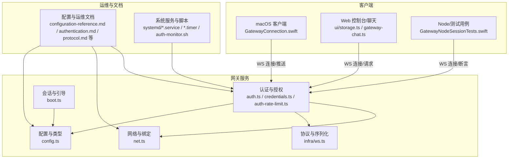
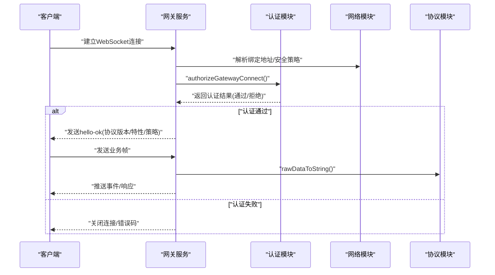
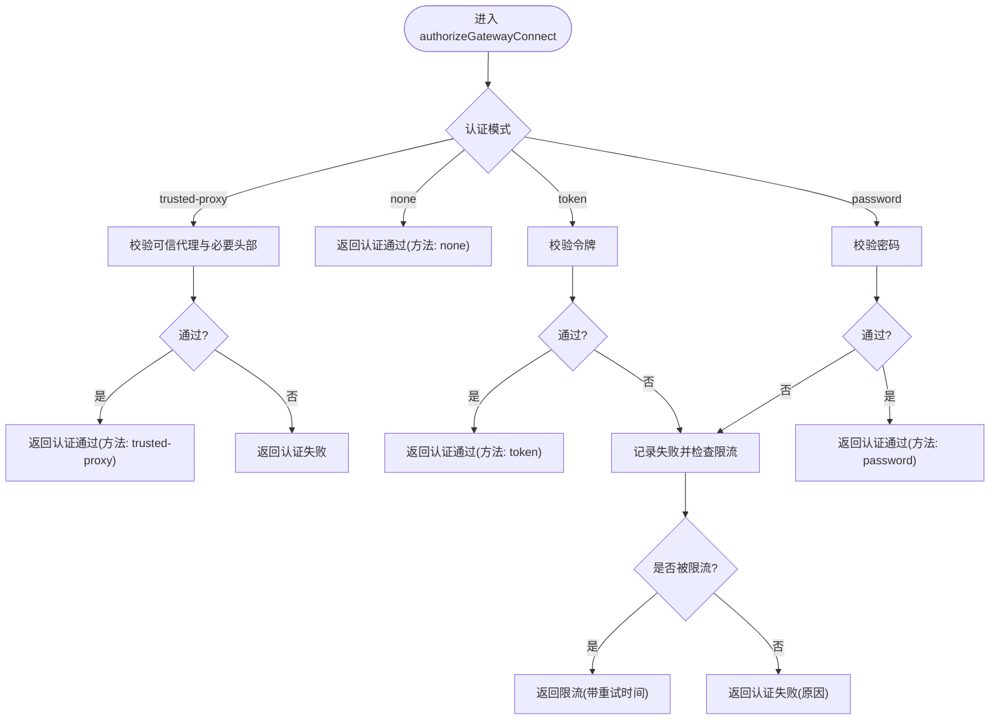
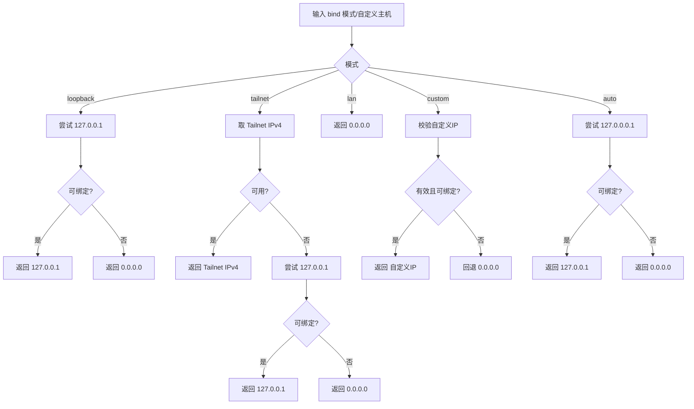
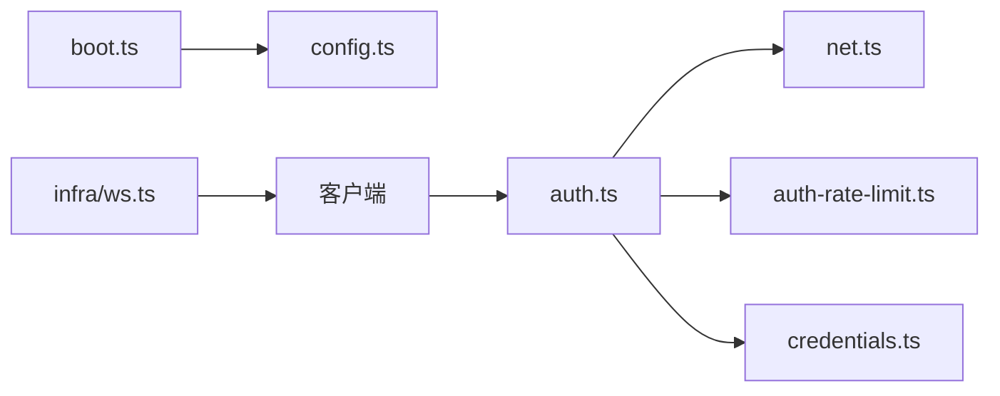
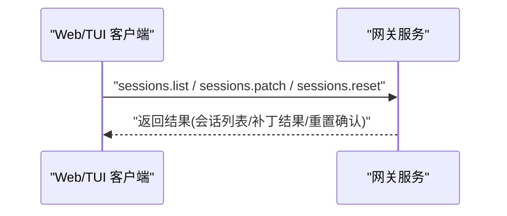

# 网关系统

<cite>
**本文引用的文件**
- [src/gateway/auth.ts](file://src/gateway/auth.ts)
- [src/gateway/credentials.ts](file://src/gateway/credentials.ts)
- [src/gateway/net.ts](file://src/gateway/net.ts)
- [src/gateway/auth-rate-limit.ts](file://src/gateway/auth-rate-limit.ts)
- [src/gateway/boot.ts](file://src/gateway/boot.ts)
- [src/infra/ws.ts](file://src/infra/ws.ts)
- [src/config/config.ts](file://src/config/config.ts)
- [docs/zh-CN/gateway/configuration-reference.md](file://docs/zh-CN/gateway/configuration-reference.md)
- [docs/zh-CN/gateway/authentication.md](file://docs/zh-CN/gateway/authentication.md)
- [docs/zh-CN/gateway/protocol.md](file://docs/zh-CN/gateway/protocol.md)
- [docs/zh-CN/gateway/heartbeat.md](file://docs/zh-CN/gateway/heartbeat.md)
- [docs/zh-CN/gateway/discovery.md](file://docs/zh-CN/gateway/discovery.md)
- [docs/zh-CN/gateway/pairing.md](file://docs/zh-CN/gateway/pairing.md)
- [docs/zh-CN/gateway/secrets.md](file://docs/zh-CN/gateway/secrets.md)
- [docs/zh-CN/gateway/logging.md](file://docs/zh-CN/gateway/logging.md)
- [docs/zh-CN/gateway/doctor.md](file://docs/zh-CN/gateway/doctor.md)
- [docs/zh-CN/gateway/troubleshooting.md](file://docs/zh-CN/gateway/troubleshooting.md)
- [docs/zh-CN/platforms/linux.md](file://docs/zh-CN/platforms/linux.md)
- [docs/zh-CN/platforms/macos.md](file://docs/zh-CN/platforms/macos.md)
- [docs/zh-CN/platforms/windows.md](file://docs/zh-CN/platforms/windows.md)
- [scripts/systemd/openclaw-auth-monitor.service](file://scripts/systemd/openclaw-auth-monitor.service)
- [scripts/systemd/openclaw-auth-monitor.timer](file://scripts/systemd/openclaw-auth-monitor.timer)
- [scripts/auth-monitor.sh](file://scripts/auth-monitor.sh)
- [apps/macos/Sources/OpenClaw/GatewayConnection.swift](file://apps/macos/Sources/OpenClaw/GatewayConnection.swift)
- [apps/shared/OpenClawKit/Tests/OpenClawKitTests/GatewayNodeSessionTests.swift](file://apps/shared/OpenClawKit/Tests/OpenClawKitTests/GatewayNodeSessionTests.swift)
- [src/tui/gateway-chat.ts](file://src/tui/gateway-chat.ts)
- [ui/src/ui/storage.ts](file://ui/src/ui/storage.ts)
- [src/shared/session-types.ts](file://src/shared/session-types.ts)
</cite>

## 目录
1. [简介](#简介)
2. [项目结构](#项目结构)
3. [核心组件](#核心组件)
4. [架构总览](#架构总览)
5. [详细组件分析](#详细组件分析)
6. [依赖关系分析](#依赖关系分析)
7. [性能考虑](#性能考虑)
8. [故障排查指南](#故障排查指南)
9. [结论](#结论)
10. [附录](#附录)

## 简介
本技术文档面向OpenClaw网关系统，聚焦其作为控制平面的核心职责：维护WebSocket连接、管理会话状态、实施安全认证与访问控制，并提供与客户端、通道适配器及工具系统的交互接口。文档覆盖协议规范、认证与授权、配置项、部署与运维（含守护进程、日志与性能调优）、以及第三方集成与扩展指引。

## 项目结构
网关系统由Node后端模块与多平台客户端组成，核心模块包括：
- 认证与授权：解析与验证接入凭据、速率限制、可信代理与Tailscale头认证
- 网络与绑定：主机地址解析、本地/私有网络判定、WebSocket URL安全策略
- 会话与引导：启动引导流程、会话映射快照与恢复
- 协议与序列化：WebSocket数据编码转换
- 配置与类型：配置加载、校验与类型导出
- 文档与运维：配置参考、认证说明、心跳/发现/配对、日志与排障、平台安装与守护进程

**图表来源**
- [src/gateway/auth.ts](file://src/gateway/auth.ts#L1-L504)
- [src/gateway/credentials.ts](file://src/gateway/credentials.ts#L1-L329)
- [src/gateway/net.ts](file://src/gateway/net.ts#L1-L457)
- [src/gateway/auth-rate-limit.ts](file://src/gateway/auth-rate-limit.ts#L1-L233)
- [src/gateway/boot.ts](file://src/gateway/boot.ts#L1-L204)
- [src/infra/ws.ts](file://src/infra/ws.ts#L1-L22)
- [src/config/config.ts](file://src/config/config.ts#L1-L28)
- [docs/zh-CN/gateway/configuration-reference.md](file://docs/zh-CN/gateway/configuration-reference.md)
- [docs/zh-CN/gateway/authentication.md](file://docs/zh-CN/gateway/authentication.md)
- [docs/zh-CN/gateway/protocol.md](file://docs/zh-CN/gateway/protocol.md)
- [scripts/systemd/openclaw-auth-monitor.service](file://scripts/systemd/openclaw-auth-monitor.service)
- [scripts/systemd/openclaw-auth-monitor.timer](file://scripts/systemd/openclaw-auth-monitor.timer)
- [scripts/auth-monitor.sh](file://scripts/auth-monitor.sh)
- [apps/macos/Sources/OpenClaw/GatewayConnection.swift](file://apps/macos/Sources/OpenClaw/GatewayConnection.swift#L396-L442)
- [apps/shared/OpenClawKit/Tests/OpenClawKitTests/GatewayNodeSessionTests.swift](file://apps/shared/OpenClawKit/Tests/OpenClawKitTests/GatewayNodeSessionTests.swift#L104-L152)
- [src/tui/gateway-chat.ts](file://src/tui/gateway-chat.ts#L231-L266)
- [ui/src/ui/storage.ts](file://ui/src/ui/storage.ts#L35-L70)

**章节来源**
- [src/gateway/auth.ts](file://src/gateway/auth.ts#L1-L504)
- [src/gateway/credentials.ts](file://src/gateway/credentials.ts#L1-L329)
- [src/gateway/net.ts](file://src/gateway/net.ts#L1-L457)
- [src/gateway/auth-rate-limit.ts](file://src/gateway/auth-rate-limit.ts#L1-L233)
- [src/gateway/boot.ts](file://src/gateway/boot.ts#L1-L204)
- [src/infra/ws.ts](file://src/infra/ws.ts#L1-L22)
- [src/config/config.ts](file://src/config/config.ts#L1-L28)

## 核心组件
- 认证与授权
  - 支持模式：无认证、令牌、密码、可信代理、Tailscale头认证
  - 凭据解析：从配置、环境变量、显式参数中选择优先级
  - 速率限制：基于内存的滑动窗口计数器，按作用域隔离
  - 可信代理与Tailscale：基于头部与Whois校验用户身份
- 网络与绑定
  - 绑定地址解析：loopback、lan、tailnet、auto、custom
  - 本地/私有网络判定：用于安全策略与本地直连识别
  - WebSocket URL安全：默认仅允许wss或loopback上的ws
- 协议与序列化
  - WebSocket原始数据到字符串的统一转换
- 会话与引导
  - 启动引导流程：读取BOOT.md并执行引导消息
  - 会话映射快照与恢复：保证引导期间会话一致性
- 配置与类型
  - 配置加载、校验与运行时快照
  - 类型导出便于上层使用

**章节来源**
- [src/gateway/auth.ts](file://src/gateway/auth.ts#L217-L292)
- [src/gateway/credentials.ts](file://src/gateway/credentials.ts#L130-L328)
- [src/gateway/auth-rate-limit.ts](file://src/gateway/auth-rate-limit.ts#L25-L72)
- [src/gateway/net.ts](file://src/gateway/net.ts#L221-L271)
- [src/infra/ws.ts](file://src/infra/ws.ts#L4-L21)
- [src/gateway/boot.ts](file://src/gateway/boot.ts#L138-L203)
- [src/config/config.ts](file://src/config/config.ts#L1-L28)

## 架构总览
下图展示网关作为控制平面的关键交互：客户端通过WebSocket连接网关；网关进行认证与授权；根据配置决定绑定地址与安全策略；处理心跳与会话；并通过工具系统与通道适配器协作。

**图表来源**
- [src/gateway/auth.ts](file://src/gateway/auth.ts#L378-L485)
- [src/gateway/net.ts](file://src/gateway/net.ts#L411-L456)
- [src/infra/ws.ts](file://src/infra/ws.ts#L4-L21)

## 详细组件分析

### 认证与授权组件
- 模式解析与配置注入
  - 支持从配置覆盖、环境变量、显式参数中解析令牌与密码
  - 当未配置令牌/密码且允许Tailscale时，可启用基于头的认证
- 可信代理与Tailscale认证
  - 基于可信代理列表与必要头部校验
  - Tailscale场景下结合Whois查询与请求头进行用户匹配
- 速率限制
  - 滑动窗口+锁定策略，默认每分钟最多10次失败尝试，锁定5分钟
  - 支持按作用域区分（如共享密钥、设备令牌、钩子认证）

**图表来源**
- [src/gateway/auth.ts](file://src/gateway/auth.ts#L378-L485)
- [src/gateway/auth-rate-limit.ts](file://src/gateway/auth-rate-limit.ts#L95-L232)

**章节来源**
- [src/gateway/auth.ts](file://src/gateway/auth.ts#L217-L292)
- [src/gateway/credentials.ts](file://src/gateway/credentials.ts#L130-L328)
- [src/gateway/auth-rate-limit.ts](file://src/gateway/auth-rate-limit.ts#L25-L72)

### 网络与绑定组件
- 绑定地址解析策略
  - loopback：优先127.0.0.1，不可用则回退0.0.0.0
  - lan：始终0.0.0.0
  - tailnet：优先Tailnet IPv4，否则回退127.0.0.1或0.0.0.0
  - auto/custom：自动检测或自定义IP，失败回退LAN
- 本地/私有网络判定
  - 用于识别本地直连与私有网络范围，影响安全策略
- WebSocket URL安全
  - 默认仅允许wss或loopback上的ws；可选在受信任私网开启

**图表来源**
- [src/gateway/net.ts](file://src/gateway/net.ts#L221-L271)

**章节来源**
- [src/gateway/net.ts](file://src/gateway/net.ts#L1-L457)

### 协议与序列化组件
- 将WebSocket原始数据统一转为字符串，兼容多种底层数据类型
- 为上层协议解析提供基础

**章节来源**
- [src/infra/ws.ts](file://src/infra/ws.ts#L4-L21)

### 会话与引导组件
- 引导流程
  - 读取工作区BOOT.md内容，构建引导提示
  - 在静默环境下执行Agent命令，完成后恢复会话映射
- 会话映射快照
  - 读取/更新会话存储，确保引导前后一致性

**章节来源**
- [src/gateway/boot.ts](file://src/gateway/boot.ts#L138-L203)

## 依赖关系分析
- 认证模块依赖网络模块解析客户端IP、可信代理与本地直连判断
- 认证模块依赖速率限制模块进行失败计数与锁定
- 客户端（macOS、Web、Node）均通过WebSocket与网关交互
- 配置模块为认证与网络策略提供运行时依据

**图表来源**
- [src/gateway/auth.ts](file://src/gateway/auth.ts#L1-L504)
- [src/gateway/net.ts](file://src/gateway/net.ts#L1-L457)
- [src/gateway/auth-rate-limit.ts](file://src/gateway/auth-rate-limit.ts#L1-L233)
- [src/gateway/credentials.ts](file://src/gateway/credentials.ts#L1-L329)
- [src/gateway/boot.ts](file://src/gateway/boot.ts#L1-L204)
- [src/infra/ws.ts](file://src/infra/ws.ts#L1-L22)
- [src/config/config.ts](file://src/config/config.ts#L1-L28)

**章节来源**
- [src/gateway/auth.ts](file://src/gateway/auth.ts#L1-L504)
- [src/gateway/net.ts](file://src/gateway/net.ts#L1-L457)
- [src/gateway/auth-rate-limit.ts](file://src/gateway/auth-rate-limit.ts#L1-L233)
- [src/gateway/credentials.ts](file://src/gateway/credentials.ts#L1-L329)
- [src/gateway/boot.ts](file://src/gateway/boot.ts#L1-L204)
- [src/infra/ws.ts](file://src/infra/ws.ts#L1-L22)
- [src/config/config.ts](file://src/config/config.ts#L1-L28)

## 性能考虑
- 速率限制
  - 默认每分钟最多10次失败尝试，锁定5分钟，避免暴力破解
  - 对本地回环地址豁免，保障CLI体验
- 内存计数器
  - 使用Map存储最近失败时间戳，定期清理过期条目
- 绑定地址选择
  - 优先选择可绑定的本地地址，减少监听失败与重启成本
- WebSocket URL安全
  - 默认仅允许TLS或本地明文，降低中间人风险

**章节来源**
- [src/gateway/auth-rate-limit.ts](file://src/gateway/auth-rate-limit.ts#L78-L81)
- [src/gateway/net.ts](file://src/gateway/net.ts#L411-L456)

## 故障排查指南
- 常见问题定位
  - 认证失败：检查令牌/密码配置、速率限制状态、可信代理与Tailscale头
  - 绑定失败：确认绑定模式与网络接口可用性
  - WebSocket不安全：确认URL协议与目标地址是否满足安全策略
- 排障文档
  - 提供认证、心跳、发现、配对、日志、医生检查等专题排障
- 平台安装与守护进程
  - Linux/macOS/Windows平台安装与守护进程配置参考

**章节来源**
- [docs/zh-CN/gateway/troubleshooting.md](file://docs/zh-CN/gateway/troubleshooting.md)
- [docs/zh-CN/gateway/doctor.md](file://docs/zh-CN/gateway/doctor.md)
- [docs/zh-CN/gateway/heartbeat.md](file://docs/zh-CN/gateway/heartbeat.md)
- [docs/zh-CN/gateway/discovery.md](file://docs/zh-CN/gateway/discovery.md)
- [docs/zh-CN/gateway/pairing.md](file://docs/zh-CN/gateway/pairing.md)
- [docs/zh-CN/gateway/logging.md](file://docs/zh-CN/gateway/logging.md)
- [docs/zh-CN/platforms/linux.md](file://docs/zh-CN/platforms/linux.md)
- [docs/zh-CN/platforms/macos.md](file://docs/zh-CN/platforms/macos.md)
- [docs/zh-CN/platforms/windows.md](file://docs/zh-CN/platforms/windows.md)

## 结论
OpenClaw网关系统以“安全、可控、可观测”为核心设计原则：通过灵活的认证模式与速率限制保障接入安全；通过严谨的网络与绑定策略确保本地与私网场景下的安全性；通过协议与会话模块提供稳定的控制面能力。配合完善的运维与排障文档，可支撑多平台客户端与第三方集成的稳定运行。

## 附录

### 配置参考与关键参数
- 网关端口与绑定
  - gateway.port、gateway.bind：WebSocket主机/端口与绑定模式
- 认证模式
  - gateway.auth.mode：none/token/password/trusted-proxy
  - gateway.auth.token/password：令牌/密码
  - gateway.auth.allowTailscale：启用Tailscale头认证
  - gateway.auth.trustedProxy：可信代理配置（用户头、允许用户、必填头）
- 远程网关
  - gateway.remote.url/token/password：远程目标与凭据
- 会话
  - session.*：会话存储路径与主键默认值
- 秘钥与凭证
  - secrets.*：密钥默认来源与引用解析

**章节来源**
- [docs/zh-CN/gateway/configuration-reference.md](file://docs/zh-CN/gateway/configuration-reference.md)
- [docs/zh-CN/gateway/secrets.md](file://docs/zh-CN/gateway/secrets.md)

### 协议规范与API参考
- 协议概述
  - WebSocket握手后的hello-ok帧包含协议版本、服务器信息、特性列表、快照与策略
  - 业务帧类型、事件与方法由协议文档定义
- 客户端交互
  - macOS客户端通过GatewayChannelActor建立连接并处理推送
  - Web控制台与TUI通过请求/响应与会话管理API交互
- 会话类型
  - 会话列表、补丁、重置等API与类型定义

**图表来源**
- [src/tui/gateway-chat.ts](file://src/tui/gateway-chat.ts#L231-L266)
- [src/shared/session-types.ts](file://src/shared/session-types.ts#L15-L28)

**章节来源**
- [docs/zh-CN/gateway/protocol.md](file://docs/zh-CN/gateway/protocol.md)
- [apps/macos/Sources/OpenClaw/GatewayConnection.swift](file://apps/macos/Sources/OpenClaw/GatewayConnection.swift#L396-L442)
- [apps/shared/OpenClawKit/Tests/OpenClawKitTests/GatewayNodeSessionTests.swift](file://apps/shared/OpenClawKit/Tests/OpenClawKitTests/GatewayNodeSessionTests.swift#L104-L152)
- [src/tui/gateway-chat.ts](file://src/tui/gateway-chat.ts#L231-L266)
- [src/shared/session-types.ts](file://src/shared/session-types.ts#L1-L28)

### 守护进程与部署运维
- 守护进程
  - systemd服务与定时任务：openclaw-auth-monitor.service / *.timer
  - 认证监控脚本：auth-monitor.sh
- 日志与健康
  - 网关日志与健康检查、心跳、发现、配对
- 平台安装
  - Linux/macOS/Windows平台安装与系统集成

**章节来源**
- [scripts/systemd/openclaw-auth-monitor.service](file://scripts/systemd/openclaw-auth-monitor.service)
- [scripts/systemd/openclaw-auth-monitor.timer](file://scripts/systemd/openclaw-auth-monitor.timer)
- [scripts/auth-monitor.sh](file://scripts/auth-monitor.sh)
- [docs/zh-CN/gateway/logging.md](file://docs/zh-CN/gateway/logging.md)
- [docs/zh-CN/gateway/heartbeat.md](file://docs/zh-CN/gateway/heartbeat.md)
- [docs/zh-CN/gateway/discovery.md](file://docs/zh-CN/gateway/discovery.md)
- [docs/zh-CN/gateway/pairing.md](file://docs/zh-CN/gateway/pairing.md)
- [docs/zh-CN/platforms/linux.md](file://docs/zh-CN/platforms/linux.md)
- [docs/zh-CN/platforms/macos.md](file://docs/zh-CN/platforms/macos.md)
- [docs/zh-CN/platforms/windows.md](file://docs/zh-CN/platforms/windows.md)