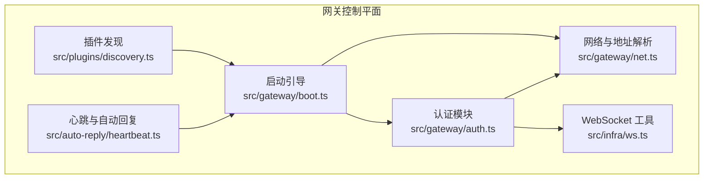
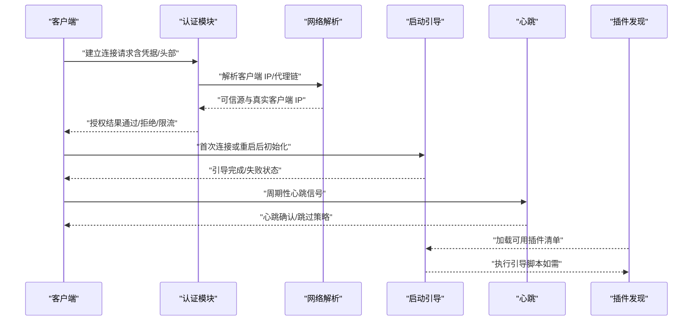
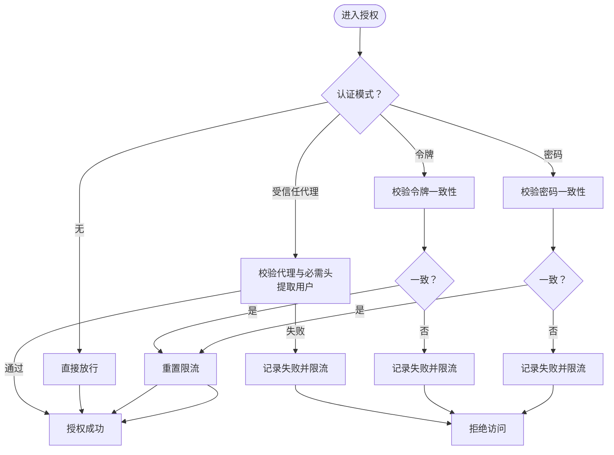
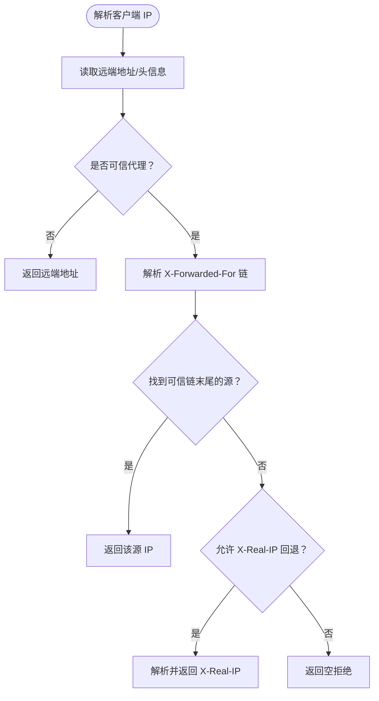
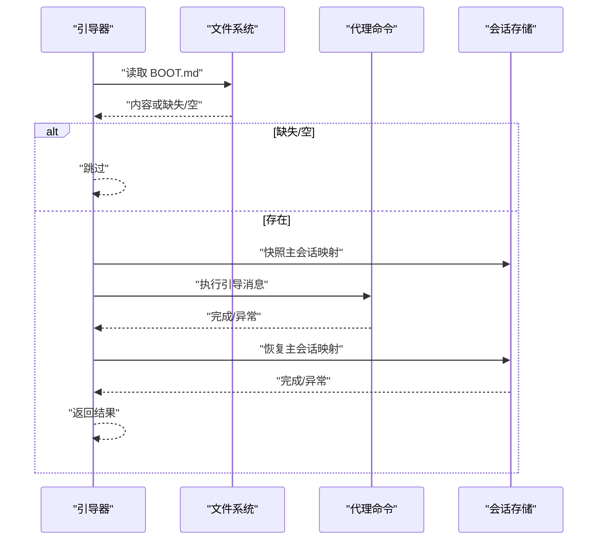
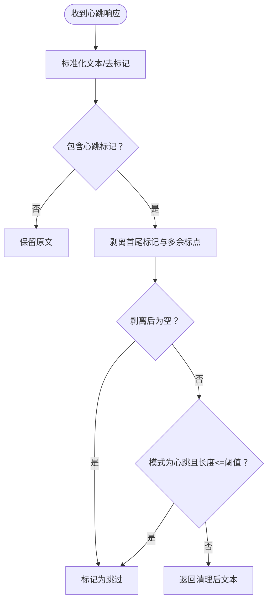
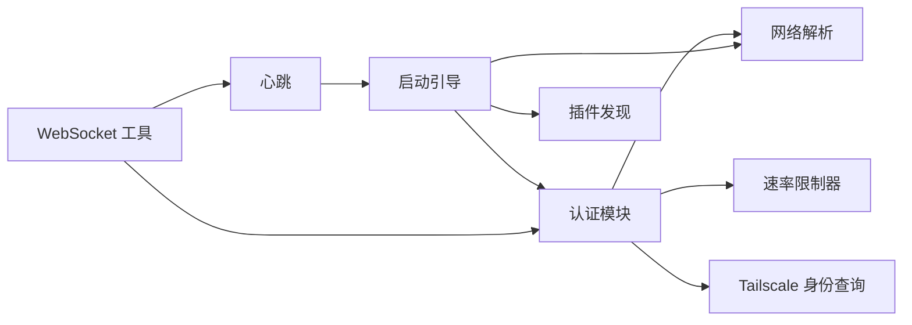

# 网关系统

<cite>
**本文引用的文件**
- [src/gateway/auth.ts](file://src/gateway/auth.ts)
- [src/gateway/net.ts](file://src/gateway/net.ts)
- [src/infra/ws.ts](file://src/infra/ws.ts)
- [src/gateway/boot.ts](file://src/gateway/boot.ts)
- [src/auto-reply/heartbeat.ts](file://src/auto-reply/heartbeat.ts)
- [src/plugins/discovery.ts](file://src/plugins/discovery.ts)
</cite>

## 目录
1. [简介](#简介)
2. [项目结构](#项目结构)
3. [核心组件](#核心组件)
4. [架构总览](#架构总览)
5. [详细组件分析](#详细组件分析)
6. [依赖关系分析](#依赖关系分析)
7. [性能考量](#性能考量)
8. [故障排除指南](#故障排除指南)
9. [结论](#结论)
10. [附录](#附录)

## 简介
本文件面向 OpenClaw 网关系统，聚焦于 WebSocket 控制平面的实现原理、协议规范与通信机制，系统性阐述网关的配置选项、认证流程、心跳监控与发现机制，并覆盖生命周期管理、状态同步与错误处理策略。同时提供 API 接口规范、消息格式定义与客户端集成指南，以及监控指标、性能调优与故障排除方法。

## 项目结构
网关系统由多个子模块协同工作：认证与网络解析（auth、net）、WebSocket 工具（infra/ws）、启动引导（boot）、心跳与自动回复（auto-reply/heartbeat）、插件发现（plugins/discovery）。这些模块共同构成控制平面的基础设施与运行时能力。

```mermaid
graph TB
subgraph "网关控制平面"
A["认证模块<br/>src/gateway/auth.ts"]
B["网络与地址解析<br/>src/gateway/net.ts"]
C["WebSocket 工具<br/>src/infra/ws.ts"]
D["启动引导<br/>src/gateway/boot.ts"]
E["心跳与自动回复<br/>src/auto-reply/heartbeat.ts"]
F["插件发现<br/>src/plugins/discovery.ts"]
end
A --> B
A --> C
D --> A
D --> B
E --> D
F --> D
```

**图表来源**
- [src/gateway/auth.ts:1-495](file://src/gateway/auth.ts#L1-L495)
- [src/gateway/net.ts:1-482](file://src/gateway/net.ts#L1-L482)
- [src/infra/ws.ts:1-22](file://src/infra/ws.ts#L1-L22)
- [src/gateway/boot.ts:1-204](file://src/gateway/boot.ts#L1-L204)
- [src/auto-reply/heartbeat.ts:1-172](file://src/auto-reply/heartbeat.ts#L1-L172)
- [src/plugins/discovery.ts:1-842](file://src/plugins/discovery.ts#L1-L842)

**章节来源**
- [src/gateway/auth.ts:1-495](file://src/gateway/auth.ts#L1-L495)
- [src/gateway/net.ts:1-482](file://src/gateway/net.ts#L1-L482)
- [src/infra/ws.ts:1-22](file://src/infra/ws.ts#L1-L22)
- [src/gateway/boot.ts:1-204](file://src/gateway/boot.ts#L1-L204)
- [src/auto-reply/heartbeat.ts:1-172](file://src/auto-reply/heartbeat.ts#L1-L172)
- [src/plugins/discovery.ts:1-842](file://src/plugins/discovery.ts#L1-L842)

## 核心组件
- 认证与授权：支持多种模式（无、令牌、密码、受信任代理），并结合速率限制与 Tailscale 身份校验。
- 网络与地址解析：提供本地/私网/回环地址判定、代理链解析、绑定主机选择与安全 WebSocket URL 校验。
- WebSocket 工具：统一原始数据到字符串的转换逻辑，便于上层协议处理。
- 启动引导：执行一次性引导脚本（BOOT.md）并进行会话映射快照与恢复。
- 心跳与自动回复：心跳内容空值判断、提示词解析与心跳标记剥离。
- 插件发现：扫描工作区与扩展根目录，构建候选插件集合并进行安全检查。

**章节来源**
- [src/gateway/auth.ts:1-495](file://src/gateway/auth.ts#L1-L495)
- [src/gateway/net.ts:1-482](file://src/gateway/net.ts#L1-L482)
- [src/infra/ws.ts:1-22](file://src/infra/ws.ts#L1-L22)
- [src/gateway/boot.ts:1-204](file://src/gateway/boot.ts#L1-L204)
- [src/auto-reply/heartbeat.ts:1-172](file://src/auto-reply/heartbeat.ts#L1-L172)
- [src/plugins/discovery.ts:1-842](file://src/plugins/discovery.ts#L1-L842)

## 架构总览
下图展示控制平面在认证、网络、引导与心跳之间的交互关系，以及与插件发现的协作。

```mermaid
sequenceDiagram
participant Client as "客户端"
participant Auth as "认证模块"
participant Net as "网络解析"
participant Boot as "启动引导"
participant Heartbeat as "心跳"
participant Plugins as "插件发现"
Client->>Auth : "建立连接请求含凭据/头部"
Auth->>Net : "解析客户端 IP/代理链"
Net-->>Auth : "可信源与真实客户端 IP"
Auth-->>Client : "授权结果通过/拒绝/限流"
Client->>Boot : "首次连接或重启后初始化"
Boot-->>Client : "引导完成/失败状态"
Client->>Heartbeat : "周期性心跳信号"
Heartbeat-->>Client : "心跳确认/跳过策略"
Plugins-->>Boot : "加载可用插件清单"
Boot-->>Plugins : "执行引导脚本如需"
```

**图表来源**
- [src/gateway/auth.ts:369-494](file://src/gateway/auth.ts#L369-L494)
- [src/gateway/net.ts:195-481](file://src/gateway/net.ts#L195-L481)
- [src/gateway/boot.ts:138-203](file://src/gateway/boot.ts#L138-L203)
- [src/auto-reply/heartbeat.ts:1-172](file://src/auto-reply/heartbeat.ts#L1-L172)
- [src/plugins/discovery.ts:750-842](file://src/plugins/discovery.ts#L750-L842)

## 详细组件分析

### 认证与授权（WebSocket 控制平面）
- 模式解析与优先级：支持“无”、“令牌”、“密码”、“受信任代理”，默认令牌模式；可被显式覆盖。
- 凭据来源：配置项与环境变量，支持密钥引用解析；密码模式在启动前需要明文或环境变量。
- 速率限制：对失败尝试按客户端 IP 进行限流，支持重试等待时间返回。
- Tailscale 集成：在非本地直连且允许时，通过反向查询验证用户身份与来源。
- 受信任代理：要求指定用户头与可选白名单，严格校验代理链与必需头。
- 授权入口：HTTP 与 WS 控制 UI 两种表面，后者允许基于 Tailscale 头部免令牌登录。

```mermaid
flowchart TD
Start(["进入授权"]) --> Mode{"认证模式？"}
Mode --> |受信任代理| Trusted["校验代理与必需头<br/>提取用户"]
Mode --> |无| AllowNone["直接放行"]
Mode --> |令牌| Token["校验令牌一致性"]
Mode --> |密码| Password["校验密码一致性"]
Trusted --> |通过| Done["授权成功"]
Trusted --> |失败| RL["记录失败并限流"] --> Deny["拒绝访问"]
AllowNone --> Done
Token --> TokOK{"一致？"}
TokOK --> |是| Reset["重置限流"] --> Done
TokOK --> |否| RL2["记录失败并限流"] --> Deny
Password --> PwdOK{"一致？"}
PwdOK --> |是| Reset --> Done
PwdOK --> |否| RL3["记录失败并限流"] --> Deny
```

**图表来源**
- [src/gateway/auth.ts:208-494](file://src/gateway/auth.ts#L208-L494)

**章节来源**
- [src/gateway/auth.ts:1-495](file://src/gateway/auth.ts#L1-L495)

### 网络与地址解析（绑定与安全）
- 绑定主机策略：支持 loopback、lan、tailnet、auto、custom，具备回退与可绑定测试。
- 客户端 IP 解析：从 socket 远端地址、X-Forwarded-For、X-Real-IP 解析，尊重可信代理链。
- 地址判定：回环、私网/环回、本地主机（含 .ts.net）等。
- 安全 WebSocket URL：默认仅允许 wss，ws 仅限回环；可选允许私有网络覆盖。

```mermaid
flowchart TD
S(["解析客户端 IP"]) --> R["读取远端地址/头信息"]
R --> T{"是否可信代理？"}
T --> |否| Ret["返回远端地址"]
T --> |是| F["解析 X-Forwarded-For 链"]
F --> Hop{"找到可信链末尾的源？"}
Hop --> |是| Src["返回该源 IP"]
Hop --> |否| Real{"允许 X-Real-IP 回退？"}
Real --> |是| RealIP["解析并返回 X-Real-IP"]
Real --> |否| Nil["返回空拒绝"]
```

**图表来源**
- [src/gateway/net.ts:195-210](file://src/gateway/net.ts#L195-L210)
- [src/gateway/net.ts:160-189](file://src/gateway/net.ts#L160-L189)

**章节来源**
- [src/gateway/net.ts:1-482](file://src/gateway/net.ts#L1-L482)

### WebSocket 工具（数据转换）
- 原始数据到字符串：兼容 string、Buffer、Array、ArrayBuffer 等输入，确保上层协议处理一致性。

**章节来源**
- [src/infra/ws.ts:1-22](file://src/infra/ws.ts#L1-L22)

### 启动引导（生命周期与状态）
- 引导文件（BOOT.md）：一次性执行引导指令，使用静默回复令牌避免噪声输出。
- 会话映射快照：在引导前后保存/恢复主会话映射，保证状态一致性。
- 失败处理：聚合引导执行与映射恢复的错误原因，返回失败状态。

```mermaid
sequenceDiagram
participant Boot as "引导器"
participant FS as "文件系统"
participant Agent as "代理命令"
participant Store as "会话存储"
Boot->>FS : "读取 BOOT.md"
FS-->>Boot : "内容或缺失/空"
alt 缺失/空
Boot-->>Boot : "跳过"
else 存在
Boot->>Store : "快照主会话映射"
Boot->>Agent : "执行引导消息"
Agent-->>Boot : "完成/异常"
Boot->>Store : "恢复主会话映射"
Store-->>Boot : "完成/异常"
Boot-->>Boot : "返回结果"
end
```

**图表来源**
- [src/gateway/boot.ts:138-203](file://src/gateway/boot.ts#L138-L203)

**章节来源**
- [src/gateway/boot.ts:1-204](file://src/gateway/boot.ts#L1-L204)

### 心跳与自动回复（监控与同步）
- 心跳内容空值判断：过滤注释与空白行，判定是否需要执行心跳。
- 提示词解析：支持自定义提示词，默认提示严格遵循工作区文件。
- 心跳标记剥离：去除首尾心跳标记与多余标点，必要时截断确认文本长度。

```mermaid
flowchart TD
H0(["收到心跳响应"]) --> H1["标准化文本/去标记"]
H1 --> H2{"包含心跳标记？"}
H2 --> |否| H3["保留原文"]
H2 --> |是| H4["剥离首尾标记与多余标点"]
H4 --> H5{"剥离后为空？"}
H5 --> |是| H6["标记为跳过"]
H5 --> |否| H7{"模式为心跳且长度<=阈值？"}
H7 --> |是| H6
H7 --> |否| H8["返回清理后文本"]
```

**图表来源**
- [src/auto-reply/heartbeat.ts:110-171](file://src/auto-reply/heartbeat.ts#L110-L171)

**章节来源**
- [src/auto-reply/heartbeat.ts:1-172](file://src/auto-reply/heartbeat.ts#L1-L172)

### 插件发现（扩展生态与安全）
- 发现范围：工作区、全局扩展根、额外路径、包入口与 Bundle 清单。
- 安全检查：禁止源逃逸根目录、禁止世界可写目录、可疑所有权检测。
- 缓存策略：短缓存窗口以合并启动阶段的突发扫描。

**章节来源**
- [src/plugins/discovery.ts:1-842](file://src/plugins/discovery.ts#L1-L842)

## 依赖关系分析
- 认证模块依赖网络解析（IP/代理/主机判定）与速率限制器；可选依赖 Tailscale 身份查询。
- 启动引导依赖会话存储与代理命令；与插件发现协作加载扩展。
- 心跳模块独立于认证与网络，但与引导流程配合用于状态同步。
- WebSocket 工具为通用层，被上层协议与控制 UI 使用。

```mermaid
graph LR
Auth["认证模块"] --> Net["网络解析"]
Auth --> Rate["速率限制器"]
Auth --> TS["Tailscale 身份查询"]
Boot["启动引导"] --> Auth
Boot --> Net
Boot --> Plugins["插件发现"]
Heartbeat["心跳"] --> Boot
WS["WebSocket 工具"] --> Auth
WS --> Heartbeat
```

**图表来源**
- [src/gateway/auth.ts:1-495](file://src/gateway/auth.ts#L1-L495)
- [src/gateway/net.ts:1-482](file://src/gateway/net.ts#L1-L482)
- [src/gateway/boot.ts:1-204](file://src/gateway/boot.ts#L1-L204)
- [src/auto-reply/heartbeat.ts:1-172](file://src/auto-reply/heartbeat.ts#L1-L172)
- [src/plugins/discovery.ts:1-842](file://src/plugins/discovery.ts#L1-L842)
- [src/infra/ws.ts:1-22](file://src/infra/ws.ts#L1-L22)

**章节来源**
- [src/gateway/auth.ts:1-495](file://src/gateway/auth.ts#L1-L495)
- [src/gateway/net.ts:1-482](file://src/gateway/net.ts#L1-L482)
- [src/gateway/boot.ts:1-204](file://src/gateway/boot.ts#L1-L204)
- [src/auto-reply/heartbeat.ts:1-172](file://src/auto-reply/heartbeat.ts#L1-L172)
- [src/plugins/discovery.ts:1-842](file://src/plugins/discovery.ts#L1-L842)
- [src/infra/ws.ts:1-22](file://src/infra/ws.ts#L1-L22)

## 性能考量
- 插件发现缓存：默认短缓存窗口减少重复扫描开销，可通过环境变量禁用或调整。
- 绑定主机测试：在无法绑定时快速回退，避免长时间阻塞。
- 速率限制：对失败尝试进行限流，降低暴力破解风险并减轻后端压力。
- 心跳优化：空内容快速跳过，避免不必要的模型调用。

**章节来源**
- [src/plugins/discovery.ts:40-70](file://src/plugins/discovery.ts#L40-L70)
- [src/gateway/net.ts:305-318](file://src/gateway/net.ts#L305-L318)
- [src/gateway/auth.ts:406-422](file://src/gateway/auth.ts#L406-L422)
- [src/auto-reply/heartbeat.ts:23-53](file://src/auto-reply/heartbeat.ts#L23-L53)

## 故障排除指南
- 认证失败
  - 检查令牌/密码是否正确配置，确认启动前密码必须为明文或环境变量。
  - 若启用受信任代理，确认代理链与必需头存在且用户在白名单中。
  - 若被限流，等待重试间隔后重试。
- WebSocket 不安全
  - 默认仅允许 wss；ws 仅限回环。若需在私网使用 ws，请评估安全策略。
- 绑定失败
  - 切换绑定模式（如从 tailnet 回退到 lan 或 auto），或更换自定义地址。
- 引导失败
  - 查看引导执行与会话映射恢复的错误信息，定位具体环节。
- 心跳无效
  - 确认心跳内容非空且包含有效任务；确认未被剥离为跳过状态。

**章节来源**
- [src/gateway/auth.ts:285-320](file://src/gateway/auth.ts#L285-L320)
- [src/gateway/net.ts:436-481](file://src/gateway/net.ts#L436-L481)
- [src/gateway/net.ts:246-296](file://src/gateway/net.ts#L246-L296)
- [src/gateway/boot.ts:138-203](file://src/gateway/boot.ts#L138-L203)
- [src/auto-reply/heartbeat.ts:110-171](file://src/auto-reply/heartbeat.ts#L110-L171)

## 结论
OpenClaw 网关系统通过严格的认证与网络解析、稳健的启动引导与心跳机制，以及可扩展的插件发现体系，构建了安全、可控且可维护的控制平面。建议在生产环境中启用 wss、合理配置认证模式与速率限制，并结合心跳与引导流程实现稳定的状态同步与可观测性。

## 附录

### WebSocket 控制平面协议规范（概要）
- 连接建立
  - 支持 wss（推荐）与 ws（回环默认允许，私网可选）。
  - 建议在控制 UI 表面允许基于 Tailscale 头部的免令牌登录。
- 认证握手
  - 令牌模式：在握手阶段携带令牌头或参数。
  - 密码模式：在握手阶段携带密码头或参数。
  - 受信任代理：由可信代理注入用户头，服务端校验代理链与必需头。
- 心跳与状态同步
  - 定期发送心跳信号，服务端根据内容空值判断是否执行。
  - 心跳确认文本可被剥离，避免噪声输出。
- 插件与扩展
  - 通过插件发现加载扩展，确保安全检查通过。

**章节来源**
- [src/gateway/auth.ts:369-494](file://src/gateway/auth.ts#L369-L494)
- [src/gateway/net.ts:436-481](file://src/gateway/net.ts#L436-L481)
- [src/auto-reply/heartbeat.ts:1-172](file://src/auto-reply/heartbeat.ts#L1-L172)
- [src/plugins/discovery.ts:1-842](file://src/plugins/discovery.ts#L1-L842)

### API 接口与消息格式（概要）
- 授权接口
  - 入参：认证配置、连接凭据、请求对象、可信代理列表、速率限制器、客户端 IP、限流作用域等。
  - 出参：授权结果（通过/拒绝/限流）、方法（无/令牌/密码/Tailscale/受信任代理）、重试等待时间等。
- 心跳接口
  - 输入：心跳内容（含可选标记）。
  - 输出：清理后的文本或跳过标志，必要时截断确认文本长度。
- 引导接口
  - 输入：配置、依赖、工作区目录、代理 ID。
  - 输出：运行结果（跳过/已运行/失败）及失败原因。

**章节来源**
- [src/gateway/auth.ts:66-85](file://src/gateway/auth.ts#L66-L85)
- [src/gateway/auth.ts:406-476](file://src/gateway/auth.ts#L406-L476)
- [src/auto-reply/heartbeat.ts:55-171](file://src/auto-reply/heartbeat.ts#L55-L171)
- [src/gateway/boot.ts:138-203](file://src/gateway/boot.ts#L138-L203)

### 客户端集成指南（概要）
- 选择认证方式：令牌或密码；在受信任网络可考虑受信任代理。
- 设置绑定与安全：优先使用 wss；ws 仅限回环或在私网启用。
- 实现握手：在连接时附带令牌/密码或由代理注入用户头。
- 心跳策略：定期发送心跳，遵循内容空值判断与标记剥离规则。
- 插件加载：确保扩展满足安全检查并通过插件发现流程。

**章节来源**
- [src/gateway/auth.ts:208-283](file://src/gateway/auth.ts#L208-L283)
- [src/gateway/net.ts:246-296](file://src/gateway/net.ts#L246-L296)
- [src/auto-reply/heartbeat.ts:23-53](file://src/auto-reply/heartbeat.ts#L23-L53)
- [src/plugins/discovery.ts:103-276](file://src/plugins/discovery.ts#L103-L276)