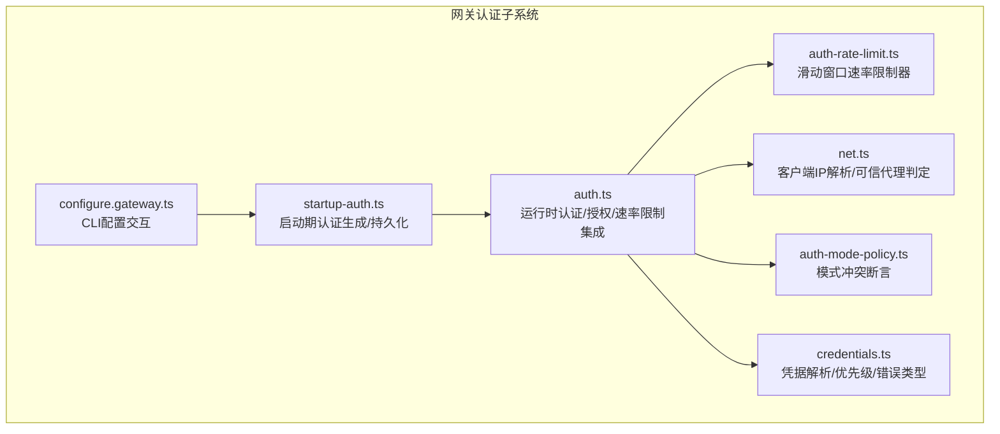
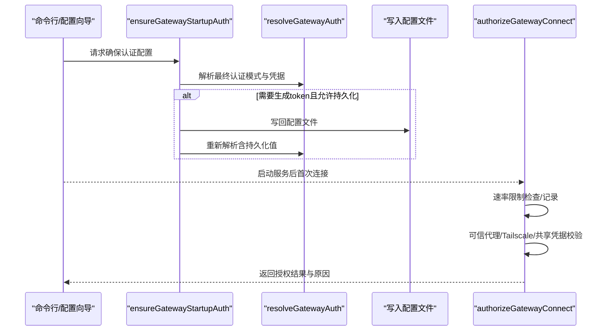
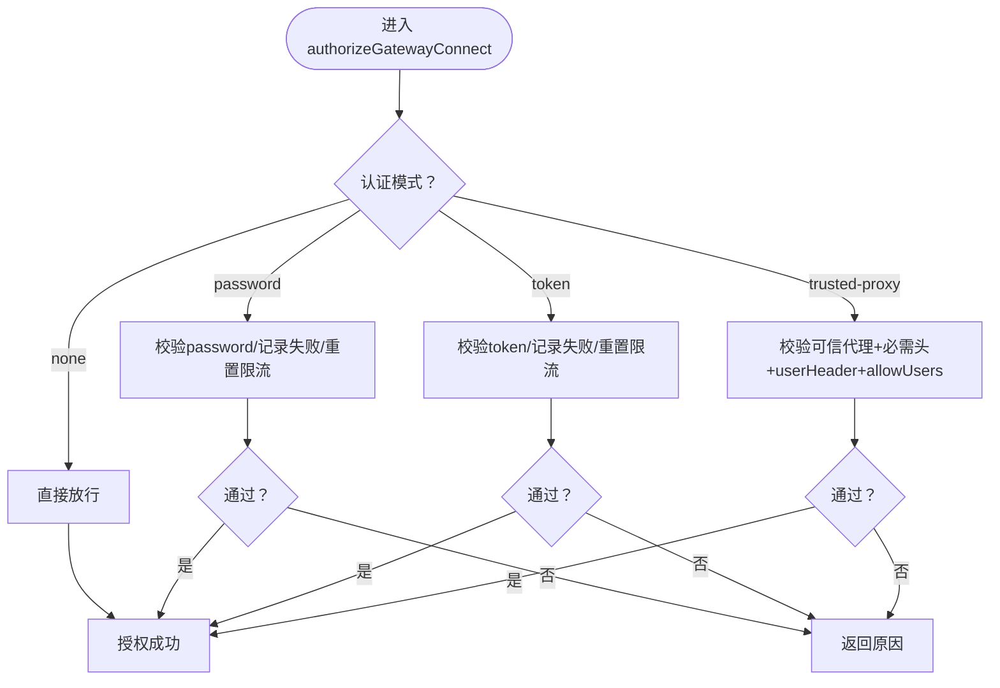
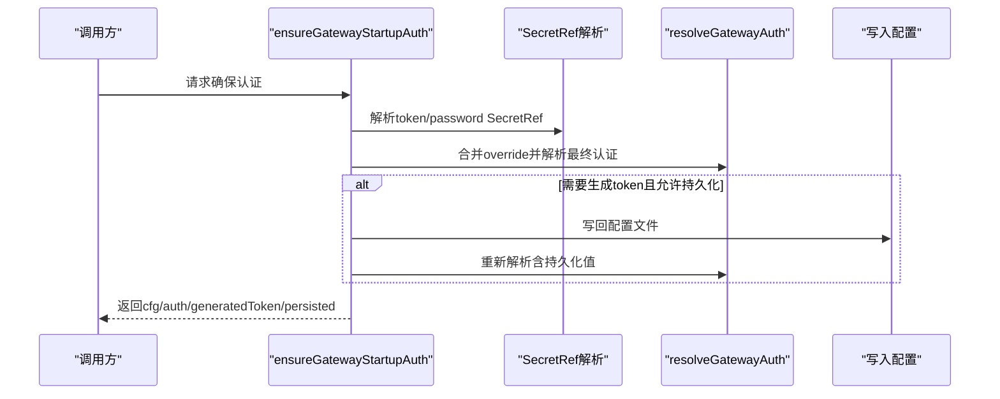
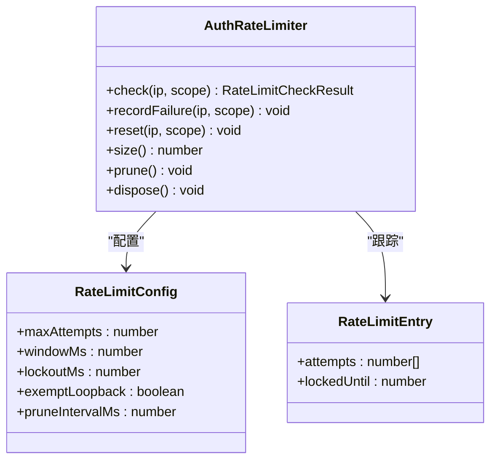
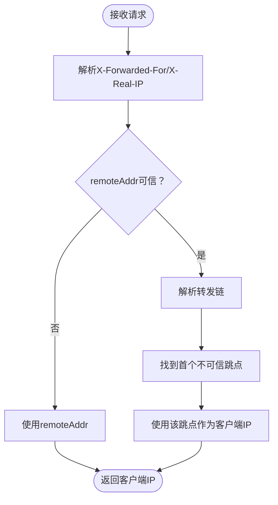
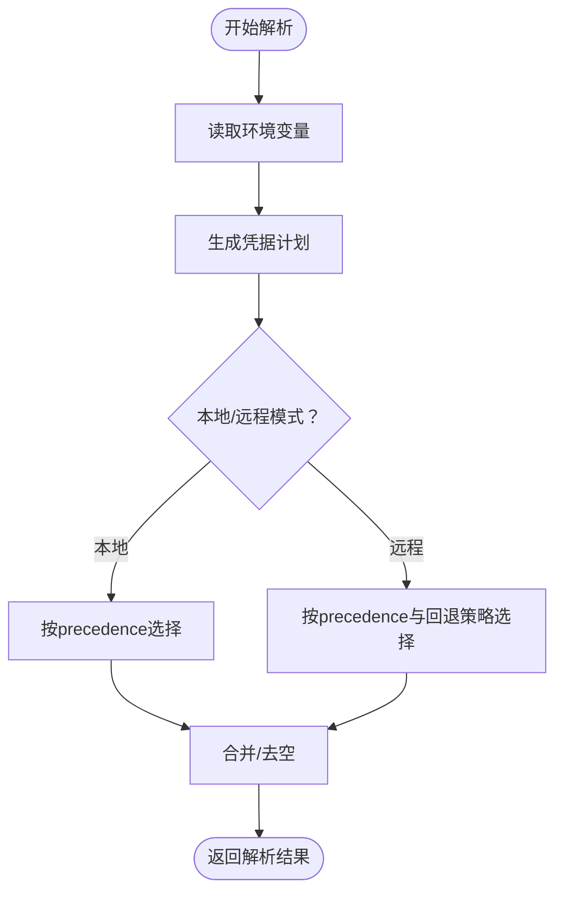
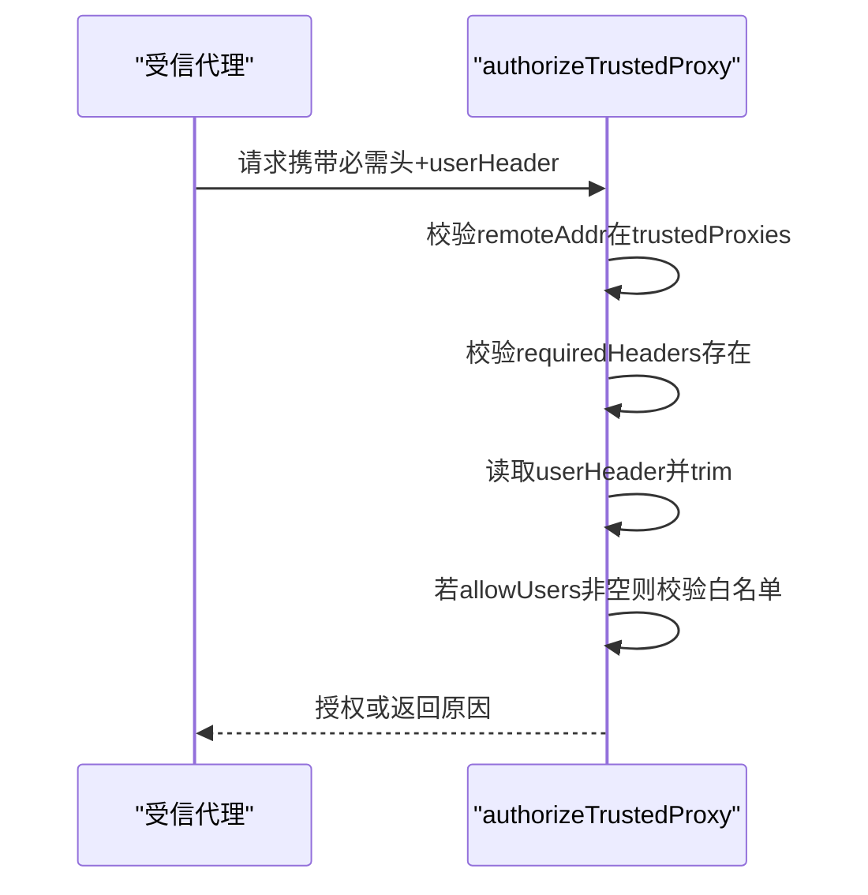
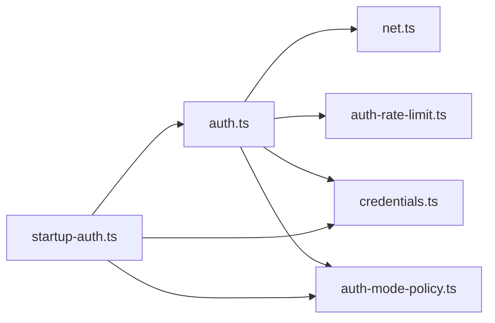

# 网关认证

<cite>
**本文引用的文件**
- [src/gateway/auth.ts](file://src/gateway/auth.ts)
- [src/gateway/startup-auth.ts](file://src/gateway/startup-auth.ts)
- [src/gateway/auth-rate-limit.ts](file://src/gateway/auth-rate-limit.ts)
- [src/gateway/net.ts](file://src/gateway/net.ts)
- [src/gateway/auth-mode-policy.ts](file://src/gateway/auth-mode-policy.ts)
- [src/gateway/credentials.ts](file://src/gateway/credentials.ts)
- [src/commands/configure.gateway.ts](file://src/commands/configure.gateway.ts)
- [docs/gateway/trusted-proxy-auth.md](file://docs/gateway/trusted-proxy-auth.md)
- [docs/gateway/authentication.md](file://docs/gateway/authentication.md)
- [src/gateway/auth.test.ts](file://src/gateway/auth.test.ts)
</cite>

## 目录
1. [简介](#简介)
2. [项目结构](#项目结构)
3. [核心组件](#核心组件)
4. [架构总览](#架构总览)
5. [详细组件分析](#详细组件分析)
6. [依赖关系分析](#依赖关系分析)
7. [性能考量](#性能考量)
8. [故障排除指南](#故障排除指南)
9. [结论](#结论)
10. [附录](#附录)

## 简介
本文件系统性阐述 OpenClaw 网关的认证体系：包括启动期认证策略、运行时认证流程、令牌与密码两种共享凭据模式、受信任代理（trusted-proxy）模式、Tailscale 头部认证、认证中间件与速率限制、认证状态与会话生命周期管理、配置项与安全策略、多网关环境下的认证策略，以及常见问题排查与最佳实践。

## 项目结构
围绕“网关认证”的关键源码与文档分布如下：
- 认证核心逻辑：src/gateway/auth.ts
- 启动期认证生成与持久化：src/gateway/startup-auth.ts
- 速率限制器：src/gateway/auth-rate-limit.ts
- 网络与客户端 IP 解析：src/gateway/net.ts
- 认证模式冲突断言：src/gateway/auth-mode-policy.ts
- 凭据解析与优先级：src/gateway/credentials.ts
- CLI 配置交互：src/commands/configure.gateway.ts
- 受信任代理配置参考与示例：docs/gateway/trusted-proxy-auth.md
- 模型认证与凭据管理（非网关入口认证）：docs/gateway/authentication.md
- 单元测试覆盖：src/gateway/auth.test.ts

图示来源
- [src/gateway/startup-auth.ts:1-317](file://src/gateway/startup-auth.ts#L1-L317)
- [src/gateway/auth.ts:1-495](file://src/gateway/auth.ts#L1-L495)
- [src/gateway/auth-rate-limit.ts:1-233](file://src/gateway/auth-rate-limit.ts#L1-L233)
- [src/gateway/net.ts:1-482](file://src/gateway/net.ts#L1-L482)
- [src/gateway/auth-mode-policy.ts:1-27](file://src/gateway/auth-mode-policy.ts#L1-L27)
- [src/gateway/credentials.ts:1-351](file://src/gateway/credentials.ts#L1-L351)
- [src/commands/configure.gateway.ts:281-326](file://src/commands/configure.gateway.ts#L281-L326)

章节来源
- [src/gateway/auth.ts:1-495](file://src/gateway/auth.ts#L1-L495)
- [src/gateway/startup-auth.ts:1-317](file://src/gateway/startup-auth.ts#L1-L317)
- [src/gateway/auth-rate-limit.ts:1-233](file://src/gateway/auth-rate-limit.ts#L1-L233)
- [src/gateway/net.ts:1-482](file://src/gateway/net.ts#L1-L482)
- [src/gateway/auth-mode-policy.ts:1-27](file://src/gateway/auth-mode-policy.ts#L1-L27)
- [src/gateway/credentials.ts:1-351](file://src/gateway/credentials.ts#L1-L351)
- [src/commands/configure.gateway.ts:281-326](file://src/commands/configure.gateway.ts#L281-L326)

## 核心组件
- 运行时认证与授权
  - 支持四种模式：none、token、password、trusted-proxy；支持 Tailscale 头部认证（仅 WS 控制界面启用）
  - 通过 authorizeGatewayConnect 统一处理，返回 GatewayAuthResult，包含方法、用户、原因、限流信息
- 启动期认证
  - 自动检测/生成 token，必要时写回配置文件；禁止 hooks.token 与 gateway token 相同
  - 支持模式覆盖（runtime override），但不持久化覆盖结果
- 速率限制
  - 基于内存的滑动窗口计数器，按 {scope, clientIp} 跟踪失败尝试；默认对本地回环豁免
  - 提供多个作用域（共享凭据、设备令牌、钩子等）
- 网络与可信代理
  - 客户端真实 IP 解析：优先使用 X-Forwarded-For，其次可选 X-Real-IP（需显式允许）
  - 可信代理地址匹配（CIDR/单IP），用于 trusted-proxy 模式校验
- 凭据解析
  - 支持从配置、环境变量、SecretRef 解析；明确优先级与错误类型（如 SecretRef 不可用）
- 模式冲突断言
  - 当同时配置了 token 与 password 且未显式指定 mode 时抛错，避免歧义

章节来源
- [src/gateway/auth.ts:32-85](file://src/gateway/auth.ts#L32-L85)
- [src/gateway/auth.ts:369-476](file://src/gateway/auth.ts#L369-L476)
- [src/gateway/startup-auth.ts:218-289](file://src/gateway/startup-auth.ts#L218-L289)
- [src/gateway/auth-rate-limit.ts:25-72](file://src/gateway/auth-rate-limit.ts#L25-L72)
- [src/gateway/net.ts:145-210](file://src/gateway/net.ts#L145-L210)
- [src/gateway/credentials.ts:79-106](file://src/gateway/credentials.ts#L79-L106)
- [src/gateway/auth-mode-policy.ts:7-26](file://src/gateway/auth-mode-policy.ts#L7-L26)

## 架构总览
下图展示“启动期认证生成”到“运行时连接授权”的整体流程，以及与网络、速率限制、凭据解析的交互。

图示来源
- [src/gateway/startup-auth.ts:218-289](file://src/gateway/startup-auth.ts#L218-L289)
- [src/gateway/auth.ts:208-283](file://src/gateway/auth.ts#L208-L283)
- [src/gateway/auth-rate-limit.ts:141-204](file://src/gateway/auth-rate-limit.ts#L141-L204)
- [src/gateway/net.ts:195-210](file://src/gateway/net.ts#L195-L210)

## 详细组件分析

### 组件A：运行时认证与授权（authorizeGatewayConnect）
- 功能要点
  - trusted-proxy 模式：校验请求来源是否在 trustedProxies 列表，检查必需头，提取 userHeader，可选 allowUsers 白名单
  - none 模式：直接放行
  - token/password 模式：比较凭据，正确则重置限流，错误则记录失败
  - Tailscale 头部认证：仅在 WS 控制界面启用，HTTP 接口默认禁用
  - 速率限制：对错误尝试进行记录；对缺失凭据（未配置客户端）不计入失败
- 关键路径
  - authorizeGatewayConnect → authorizeTrustedProxy → isTrustedProxyAddress
  - authorizeGatewayConnect → resolveRequestClientIp → resolveClientIp
  - authorizeGatewayConnect → rateLimiter.check/recordFailure/reset

图示来源
- [src/gateway/auth.ts:369-476](file://src/gateway/auth.ts#L369-L476)
- [src/gateway/auth.ts:326-363](file://src/gateway/auth.ts#L326-L363)
- [src/gateway/net.ts:145-210](file://src/gateway/net.ts#L145-L210)

章节来源
- [src/gateway/auth.ts:369-476](file://src/gateway/auth.ts#L369-L476)
- [src/gateway/auth.ts:326-363](file://src/gateway/auth.ts#L326-L363)
- [src/gateway/net.ts:145-210](file://src/gateway/net.ts#L145-L210)

### 组件B：启动期认证生成与持久化（ensureGatewayStartupAuth）
- 功能要点
  - 解析 token/password 的 SecretRef（若存在），合并 authOverride
  - 若 mode 为 token 且无 token，则生成随机 token 并可写回配置文件
  - 检查 hooks.token 与 gateway token 是否相同（必须不同）
  - 对 mode override 的情况不持久化覆盖结果
- 关键路径
  - ensureGatewayStartupAuth → resolveGatewayTokenSecretRef/resolveGatewayPasswordSecretRef
  - ensureGatewayStartupAuth → resolveGatewayAuth → assertHooksTokenSeparateFromGatewayAuth

图示来源
- [src/gateway/startup-auth.ts:218-289](file://src/gateway/startup-auth.ts#L218-L289)
- [src/gateway/auth.ts:208-283](file://src/gateway/auth.ts#L208-L283)

章节来源
- [src/gateway/startup-auth.ts:218-289](file://src/gateway/startup-auth.ts#L218-L289)
- [src/gateway/auth.ts:208-283](file://src/gateway/auth.ts#L208-L283)

### 组件C：速率限制器（AuthRateLimiter）
- 设计特性
  - 滑动窗口失败次数统计，超限锁定；默认对本地回环豁免
  - 多作用域隔离（共享凭据、设备令牌、钩子等）
  - 定期清理过期条目，避免内存膨胀
- 关键路径
  - check → recordFailure → reset
  - normalizeRateLimitClientIp → resolveClientIp

图示来源
- [src/gateway/auth-rate-limit.ts:25-72](file://src/gateway/auth-rate-limit.ts#L25-L72)
- [src/gateway/auth-rate-limit.ts:95-232](file://src/gateway/auth-rate-limit.ts#L95-L232)
- [src/gateway/net.ts:91-93](file://src/gateway/net.ts#L91-L93)

章节来源
- [src/gateway/auth-rate-limit.ts:1-233](file://src/gateway/auth-rate-limit.ts#L1-L233)
- [src/gateway/net.ts:91-93](file://src/gateway/net.ts#L91-L93)

### 组件D：网络与可信代理（resolveClientIp/isTrustedProxyAddress）
- 功能要点
  - 优先使用 X-Forwarded-For 中“第一个不可信跳点”的客户端 IP
  - 可选启用 X-Real-IP（需 allowRealIpFallback=true）
  - 可信代理匹配支持 CIDR 与单 IP
- 关键路径
  - resolveRequestClientIp → resolveClientIp → isTrustedProxyAddress

图示来源
- [src/gateway/net.ts:195-210](file://src/gateway/net.ts#L195-L210)
- [src/gateway/net.ts:160-189](file://src/gateway/net.ts#L160-L189)
- [src/gateway/net.ts:145-158](file://src/gateway/net.ts#L145-L158)

章节来源
- [src/gateway/net.ts:145-210](file://src/gateway/net.ts#L145-L210)

### 组件E：凭据解析与优先级（resolveGatewayCredentialsFromValues）
- 功能要点
  - 支持从配置、环境变量解析 token/password
  - 明确 precedence（config-first/env-first）与 mode（local/remote）
  - SecretRef 不可用时抛出特定错误类型，便于上层提示修复
- 关键路径
  - resolveGatewayCredentialsFromValues → firstDefined
  - resolveGatewayCredentialsFromConfig → createGatewayCredentialPlan

图示来源
- [src/gateway/credentials.ts:79-106](file://src/gateway/credentials.ts#L79-L106)
- [src/gateway/credentials.ts:253-323](file://src/gateway/credentials.ts#L253-L323)

章节来源
- [src/gateway/credentials.ts:79-106](file://src/gateway/credentials.ts#L79-L106)
- [src/gateway/credentials.ts:253-323](file://src/gateway/credentials.ts#L253-L323)

### 组件F：受信任代理认证（trusted-proxy）
- 工作原理
  - 网关仅接受来自 trustedProxies 列表的请求
  - 必须存在 requiredHeaders（如 x-forwarded-proto/host）
  - 从 userHeader 提取用户身份，可选 allowUsers 白名单
  - 与 CLI 配置交互：configure.gateway.ts 支持交互式输入 trustedProxies、userHeader、requiredHeaders、allowUsers
- 安全清单与迁移
  - 文档提供安全检查清单与迁移步骤，强调代理为唯一入口、最小化 trustedProxies、TLS 终止位置、allowUsers 限制

图示来源
- [src/gateway/auth.ts:326-363](file://src/gateway/auth.ts#L326-L363)
- [src/commands/configure.gateway.ts:281-326](file://src/commands/configure.gateway.ts#L281-L326)
- [docs/gateway/trusted-proxy-auth.md:50-90](file://docs/gateway/trusted-proxy-auth.md#L50-L90)

章节来源
- [src/gateway/auth.ts:326-363](file://src/gateway/auth.ts#L326-L363)
- [src/commands/configure.gateway.ts:281-326](file://src/commands/configure.gateway.ts#L281-L326)
- [docs/gateway/trusted-proxy-auth.md:50-90](file://docs/gateway/trusted-proxy-auth.md#L50-L90)

### 组件G：Tailscale 头部认证
- 行为说明
  - 默认 HTTP 接口禁用 Tailscale 头部认证
  - WS 控制界面显式启用，允许通过 Tailscale 用户头与 whois 校验
  - 仅在 allowTailscale 为真时生效
- 关键路径
  - authorizeGatewayConnect → resolveVerifiedTailscaleUser → readTailscaleWhoisIdentity

章节来源
- [src/gateway/auth.ts:424-437](file://src/gateway/auth.ts#L424-L437)
- [src/gateway/auth.ts:175-206](file://src/gateway/auth.ts#L175-L206)

## 依赖关系分析
- 模块耦合
  - auth.ts 依赖 net.ts（IP/代理判定）、auth-rate-limit.ts（限流）、credentials.ts（凭据解析）、auth-mode-policy.ts（模式断言）
  - startup-auth.ts 依赖 auth.ts（解析/断言）、credentials.ts（SecretRef 解析）、config 文件写入
- 外部依赖
  - Node 内置模块（http、net、os）
  - 无外部第三方依赖（限流器纯内存实现）

图示来源
- [src/gateway/auth.ts:1-23](file://src/gateway/auth.ts#L1-L23)
- [src/gateway/startup-auth.ts:1-16](file://src/gateway/startup-auth.ts#L1-L16)

章节来源
- [src/gateway/auth.ts:1-23](file://src/gateway/auth.ts#L1-L23)
- [src/gateway/startup-auth.ts:1-16](file://src/gateway/startup-auth.ts#L1-L16)

## 性能考量
- 速率限制器
  - 使用 Map 存储，定期清理；对本地回环豁免，避免误伤
  - 窗口大小与锁定期默认值平衡了防爆破与用户体验
- 客户端 IP 解析
  - 仅在需要时解析转发链，避免不必要的字符串处理
- 认证模式选择
  - none/token/password 模式开销低；trusted-proxy 模式额外进行头部校验与白名单检查
  - Tailscale 头部认证涉及外部 whois 查询，建议仅在 WS 控制界面启用

## 故障排除指南
- 常见失败原因与定位
  - token/password 缺失或不匹配：检查客户端是否正确传递凭据；确认 mode 与凭据是否一致
  - trusted_proxy_untrusted_source：核对 trustedProxies 是否包含代理 IP；容器 IP 变更时需更新
  - trusted_proxy_user_missing：确认代理已设置并传递 userHeader；检查拼写与大小写
  - trusted_proxy_missing_header_*：确认代理正确转发必需头
  - trusted_proxy_user_not_allowed：检查 allowUsers 白名单
  - rate_limited：等待 retryAfterMs 或减少失败尝试；确认是否误将“缺失凭据”当作暴力破解
- 测试与验证
  - 单测覆盖了 token/password 缺失/不匹配、trusted-proxy 各种拒绝情形、速率限制行为、Tailscale 头部认证开关差异
- 文档参考
  - 受信任代理安全清单与迁移步骤详见 trusted-proxy-auth 文档

章节来源
- [src/gateway/auth.test.ts:50-421](file://src/gateway/auth.test.ts#L50-L421)
- [docs/gateway/trusted-proxy-auth.md:276-322](file://docs/gateway/trusted-proxy-auth.md#L276-L322)

## 结论
OpenClaw 网关认证体系以“启动期生成/持久化 + 运行时统一授权”为核心，结合速率限制、可信代理与 Tailscale 头部认证，形成灵活且安全的多模式认证方案。通过清晰的模式断言、严格的凭据解析与错误类型、以及详尽的测试与文档，系统在易用性与安全性之间取得良好平衡。在多网关与受信代理环境中，应严格遵循安全清单与迁移步骤，确保代理为唯一入口并最小化可信代理列表。

## 附录

### 认证配置选项与最佳实践
- 模式选择
  - none：仅本地或受控网络访问
  - token/password：共享凭据，适合简单部署；注意轮换与速率限制
  - trusted-proxy：推荐在容器/K8s/反向代理场景使用；务必最小化 trustedProxies、强制 TLS、设置 allowUsers
  - Tailscale：适合尾网访问；WS 控制界面可启用头部认证
- 安全策略
  - 代理为唯一入口；代理剥离/覆盖转发头；TLS 终止于代理；HSTS 策略集中管理
  - 速率限制默认对本地回环豁免；生产环境建议收紧窗口与锁定期
  - hooks.token 与 gateway token 必须不同
- 最佳实践
  - 使用 SecretRef 管理敏感凭据；启动期解析 SecretRef 并可写回配置
  - 在受信代理模式下，先独立验证代理转发头再启用网关
  - 定期审计与安全扫描，关注受信代理配置告警

章节来源
- [src/gateway/startup-auth.ts:291-316](file://src/gateway/startup-auth.ts#L291-L316)
- [docs/gateway/trusted-proxy-auth.md:256-264](file://docs/gateway/trusted-proxy-auth.md#L256-L264)
- [src/gateway/auth-rate-limit.ts:95-100](file://src/gateway/auth-rate-limit.ts#L95-L100)