# 网关运维

<cite>
**本文引用的文件**
- [docs/gateway/index.md](file://docs/gateway/index.md)
- [docs/gateway/health.md](file://docs/gateway/health.md)
- [docs/gateway/logging.md](file://docs/gateway/logging.md)
- [docs/cli/gateway.md](file://docs/cli/gateway.md)
- [docs/cli/logs.md](file://docs/cli/logs.md)
- [docs/gateway/troubleshooting.md](file://docs/gateway/troubleshooting.md)
- [docs/gateway/configuration.md](file://docs/gateway/configuration.md)
- [docs/gateway/doctor.md](file://docs/gateway/doctor.md)
- [docs/help/troubleshooting.md](file://docs/help/troubleshooting.md)
- [docs/install/docker.md](file://docs/install/docker.md)
- [docs/install/kubernetes.md](file://docs/install/kubernetes.md)
- [docs/install/ansible.md](file://docs/install/ansible.md)
- [docs/install/updating.md](file://docs/install/updating.md)
- [scripts/recover-orphaned-processes.sh](file://scripts/recover-orphaned-processes.sh)
- [scripts/restart-mac.sh](file://scripts/restart-mac.sh)
- [scripts/clawlog.sh](file://scripts/clawlog.sh)
</cite>

## 目录
1. [简介](#简介)
2. [项目结构](#项目结构)
3. [核心组件](#核心组件)
4. [架构总览](#架构总览)
5. [详细组件分析](#详细组件分析)
6. [依赖分析](#依赖分析)
7. [性能考虑](#性能考虑)
8. [故障排查指南](#故障排查指南)
9. [结论](#结论)
10. [附录](#附录)

## 简介
本指南面向生产与日常运维场景，围绕 OpenClaw 网关（Gateway）的启动、停止、服务管理、健康检查、状态监控、日志与调试、自动化脚本、守护进程与重启策略、备份恢复与升级迁移、以及容量规划与性能调优进行系统化说明。内容以官方文档与脚本为依据，结合实际可执行命令与流程图，帮助快速定位问题、稳定运行与持续演进。

## 项目结构
- 运维相关文档集中在 docs/gateway、docs/cli、docs/install 与 docs/help 下，覆盖启动/停止、健康检查、日志、故障排查、配置、更新与部署等主题。
- 运维脚本位于 scripts/ 目录，包括进程回收、macOS 一键重启、日志采集等实用工具。

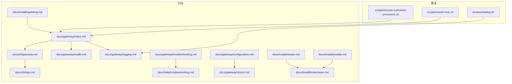

图表来源
- [docs/gateway/index.md:1-262](file://docs/gateway/index.md#L1-L262)
- [docs/cli/gateway.md:1-236](file://docs/cli/gateway.md#L1-L236)
- [docs/gateway/logging.md:1-114](file://docs/gateway/logging.md#L1-L114)
- [docs/gateway/health.md:1-45](file://docs/gateway/health.md#L1-L45)
- [docs/gateway/troubleshooting.md:1-380](file://docs/gateway/troubleshooting.md#L1-L380)
- [docs/gateway/configuration.md:1-634](file://docs/gateway/configuration.md#L1-L634)
- [docs/gateway/doctor.md:1-331](file://docs/gateway/doctor.md#L1-L331)
- [docs/help/troubleshooting.md:1-299](file://docs/help/troubleshooting.md#L1-L299)
- [docs/install/docker.md:1-844](file://docs/install/docker.md#L1-L844)
- [docs/install/kubernetes.md:1-192](file://docs/install/kubernetes.md#L1-L192)
- [docs/install/ansible.md:1-209](file://docs/install/ansible.md#L1-L209)
- [docs/install/updating.md:1-276](file://docs/install/updating.md#L1-L276)
- [scripts/recover-orphaned-processes.sh:1-192](file://scripts/recover-orphaned-processes.sh#L1-L192)
- [scripts/restart-mac.sh:1-270](file://scripts/restart-mac.sh#L1-L270)
- [scripts/clawlog.sh:1-322](file://scripts/clawlog.sh#L1-L322)

章节来源
- [docs/gateway/index.md:1-262](file://docs/gateway/index.md#L1-L262)
- [docs/cli/gateway.md:1-236](file://docs/cli/gateway.md#L1-L236)

## 核心组件
- 网关生命周期与服务管理：支持本地启动、远程访问、守护进程安装与状态查询；提供安装、启动、停止、重启、卸载等子命令。
- 健康检查与状态监控：提供健康快照、通道连通性探测、深度诊断与告警阈值配置。
- 日志体系：控制台输出与文件日志双通道，支持 WS 协议日志样式与敏感信息脱敏。
- 故障排查：症状导向的诊断流程、常见失败特征与修复步骤。
- 配置热重载：按类别区分热应用与需重启的变更，支持 hybrid/hot/restart/off 模式。
- 更新与回滚：推荐的升级路径、自动更新策略、回滚与固定版本方法。
- 部署与平台：Docker 容器化、Kubernetes 清单、Ansible 自动化安装与安全加固。

章节来源
- [docs/gateway/index.md:94-169](file://docs/gateway/index.md#L94-L169)
- [docs/gateway/health.md:27-44](file://docs/gateway/health.md#L27-L44)
- [docs/gateway/logging.md:13-114](file://docs/gateway/logging.md#L13-L114)
- [docs/gateway/configuration.md:436-474](file://docs/gateway/configuration.md#L436-L474)
- [docs/install/updating.md:1-276](file://docs/install/updating.md#L1-L276)

## 架构总览
下图展示网关在不同平台上的生命周期与服务管理关系，以及与 CLI、守护进程、容器化与编排系统的交互。

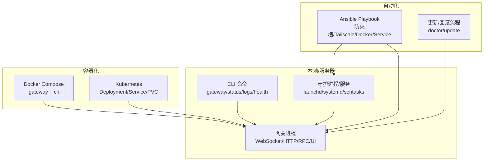

图表来源
- [docs/cli/gateway.md:180-236](file://docs/cli/gateway.md#L180-L236)
- [docs/install/docker.md:35-192](file://docs/install/docker.md#L35-L192)
- [docs/install/kubernetes.md:84-192](file://docs/install/kubernetes.md#L84-L192)
- [docs/install/ansible.md:42-111](file://docs/install/ansible.md#L42-L111)
- [docs/install/updating.md:131-276](file://docs/install/updating.md#L131-L276)

## 详细组件分析

### 启动与停止流程
- 本地启动：通过 CLI 子命令运行网关，支持端口、绑定模式、认证覆盖、强制重启、详细日志与 WS 日志样式等参数。
- 停止与重启：提供 stop/restart 子命令；守护进程场景使用 launchctl/systemctl 等原生命令。
- 远程访问：支持 Tailscale/VPN 与 SSH 隧道；隧道内仍需正确认证。

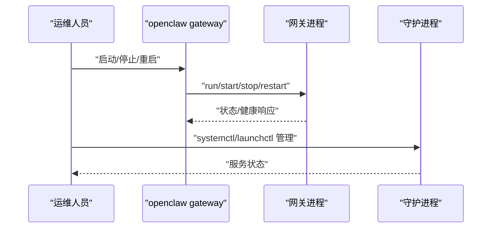

图表来源
- [docs/cli/gateway.md:22-63](file://docs/cli/gateway.md#L22-L63)
- [docs/gateway/index.md:125-169](file://docs/gateway/index.md#L125-L169)

章节来源
- [docs/cli/gateway.md:22-117](file://docs/cli/gateway.md#L22-L117)
- [docs/gateway/index.md:125-169](file://docs/gateway/index.md#L125-L169)

### 健康检查与状态监控
- 快速健康：status/health 命令与通道探测，确认运行态与 RPC 可达。
- 深度诊断：通道健康监控配置（检查周期、空闲阈值、每小时重启上限）、错误码与恢复指引。
- Docker/K8s 健康探针：/healthz /readyz 浅/深探针，容器内置 HEALTHCHECK。

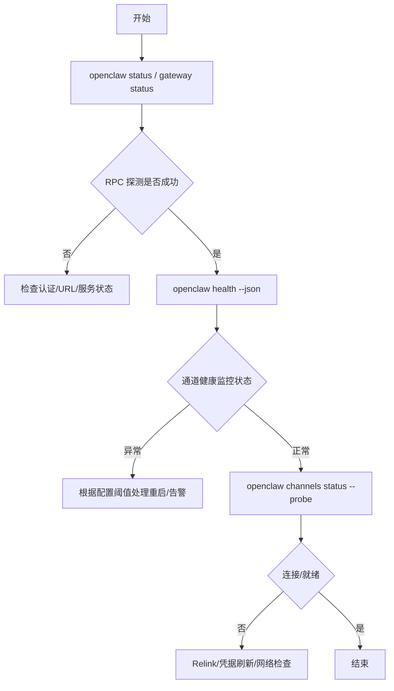

图表来源
- [docs/gateway/health.md:12-44](file://docs/gateway/health.md#L12-L44)
- [docs/gateway/index.md:216-234](file://docs/gateway/index.md#L216-L234)
- [docs/install/docker.md:469-495](file://docs/install/docker.md#L469-L495)

章节来源
- [docs/gateway/health.md:12-44](file://docs/gateway/health.md#L12-L44)
- [docs/gateway/index.md:216-234](file://docs/gateway/index.md#L216-L234)
- [docs/install/docker.md:469-495](file://docs/install/docker.md#L469-L495)

### 日志管理与调试
- 文件日志：默认滚动文件位于 /tmp/openclaw/，JSON 行格式；可通过配置调整路径与级别。
- 控制台日志：TTY 友好输出、子系统前缀、颜色与样式；支持 --verbose 与 WS 日志样式切换。
- 调试工具：RPC 尾随日志、macOS 统一日志采集脚本（clawlog），进程孤儿检测脚本。

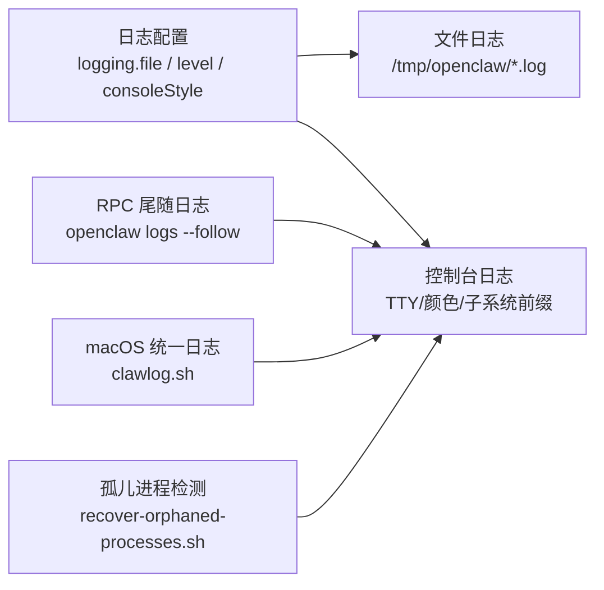

图表来源
- [docs/gateway/logging.md:18-114](file://docs/gateway/logging.md#L18-L114)
- [docs/cli/logs.md:9-29](file://docs/cli/logs.md#L9-L29)
- [scripts/clawlog.sh:1-322](file://scripts/clawlog.sh#L1-L322)
- [scripts/recover-orphaned-processes.sh:1-192](file://scripts/recover-orphaned-processes.sh#L1-L192)

章节来源
- [docs/gateway/logging.md:18-114](file://docs/gateway/logging.md#L18-L114)
- [docs/cli/logs.md:9-29](file://docs/cli/logs.md#L9-L29)
- [scripts/clawlog.sh:1-322](file://scripts/clawlog.sh#L1-L322)
- [scripts/recover-orphaned-processes.sh:1-192](file://scripts/recover-orphaned-processes.sh#L1-L192)

### 配置热重载与变更影响域
- 热重载模式：hybrid/hot/restart/off；hybrid 默认优先热应用安全变更，必要时自动重启。
- 影响域：通道、代理与模型、自动化、会话与消息、工具与媒体、UI 与杂项通常热应用；网关服务器与基础设施类变更需要重启。

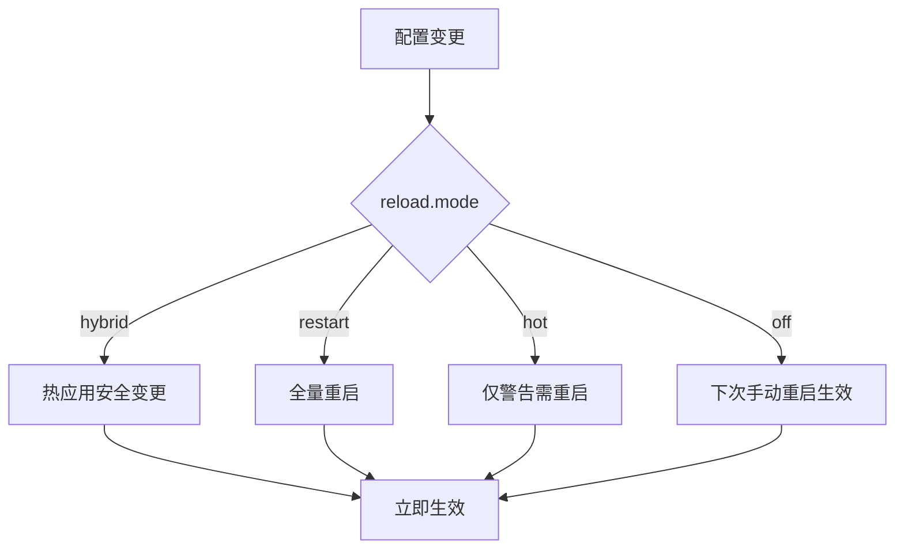

图表来源
- [docs/gateway/configuration.md:436-474](file://docs/gateway/configuration.md#L436-L474)

章节来源
- [docs/gateway/configuration.md:436-474](file://docs/gateway/configuration.md#L436-L474)

### 服务守护进程与进程管理
- macOS：launchd LaunchAgent，标签名遵循约定；doctor 可审计与修复服务配置漂移。
- Linux：systemd 用户服务与系统服务；启用 lingering 保证注销后存活。
- Windows/WSL2：systemd 用户服务；若未安装服务，先执行 install。
- macOS 一键重启：清理旧实例、打包、签名/无签名、安装 LaunchAgent、验证端口、启动应用。

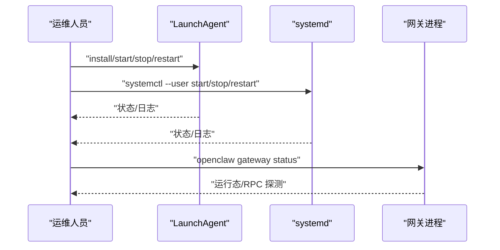

图表来源
- [docs/gateway/index.md:129-169](file://docs/gateway/index.md#L129-L169)
- [scripts/restart-mac.sh:1-270](file://scripts/restart-mac.sh#L1-L270)

章节来源
- [docs/gateway/index.md:129-169](file://docs/gateway/index.md#L129-L169)
- [scripts/restart-mac.sh:1-270](file://scripts/restart-mac.sh#L1-L270)

### 备份恢复与升级迁移
- 升级路径：网站安装器重跑（推荐）、包管理器升级、源码安装更新；更新后运行 doctor 并重启。
- 回滚策略：固定版本号（pin）或按日期检出历史提交；必要时清理缓存与重建。
- 迁移与修复：doctor 执行配置归一化、遗留状态迁移、服务迁移与清理提示、权限与安全检查。

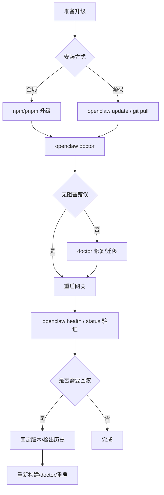

图表来源
- [docs/install/updating.md:131-276](file://docs/install/updating.md#L131-L276)
- [docs/gateway/doctor.md:14-84](file://docs/gateway/doctor.md#L14-L84)

章节来源
- [docs/install/updating.md:131-276](file://docs/install/updating.md#L131-L276)
- [docs/gateway/doctor.md:14-84](file://docs/gateway/doctor.md#L14-L84)

### 生产部署与平台
- Docker：容器化网关与 CLI，Compose 环境变量与挂载、健康探针、沙箱容器、安全注意事项。
- Kubernetes：Kustomize 清单、命名空间、Secret/ConfigMap/PVC、暴露方式与 TLS/VPN 模型。
- Ansible：防火墙、Tailscale、Docker、Systemd 硬化与一键安装。

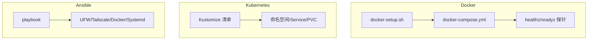

图表来源
- [docs/install/docker.md:35-192](file://docs/install/docker.md#L35-L192)
- [docs/install/kubernetes.md:84-192](file://docs/install/kubernetes.md#L84-L192)
- [docs/install/ansible.md:42-111](file://docs/install/ansible.md#L42-L111)

章节来源
- [docs/install/docker.md:35-192](file://docs/install/docker.md#L35-L192)
- [docs/install/kubernetes.md:84-192](file://docs/install/kubernetes.md#L84-L192)
- [docs/install/ansible.md:42-111](file://docs/install/ansible.md#L42-L111)

## 依赖分析
- CLI 与网关：CLI 通过 WebSocket 对网关执行 RPC，status/health/probe/logs 等命令均依赖 RPC 通道。
- 配置与热重载：配置文件被监听，按类别决定热应用或重启；doctor 在启动/更新时执行迁移与修复。
- 守护进程与平台：不同 OS 的服务管理器与标签命名约定；doctor 支持审计与修复服务元数据。
- 容器与编排：Docker/K8s 提供健康探针与隔离能力；Ansible 提供安全基线与自动化。

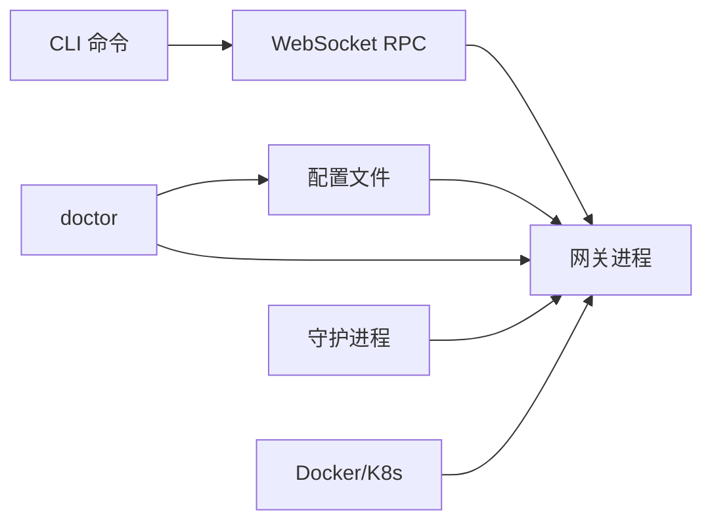

图表来源
- [docs/cli/gateway.md:64-117](file://docs/cli/gateway.md#L64-L117)
- [docs/gateway/configuration.md:476-534](file://docs/gateway/configuration.md#L476-L534)
- [docs/gateway/doctor.md:86-120](file://docs/gateway/doctor.md#L86-L120)
- [docs/gateway/index.md:129-169](file://docs/gateway/index.md#L129-L169)
- [docs/install/docker.md:469-495](file://docs/install/docker.md#L469-L495)
- [docs/install/kubernetes.md:84-192](file://docs/install/kubernetes.md#L84-L192)

章节来源
- [docs/cli/gateway.md:64-117](file://docs/cli/gateway.md#L64-L117)
- [docs/gateway/configuration.md:476-534](file://docs/gateway/configuration.md#L476-L534)
- [docs/gateway/doctor.md:86-120](file://docs/gateway/doctor.md#L86-L120)
- [docs/gateway/index.md:129-169](file://docs/gateway/index.md#L129-L169)
- [docs/install/docker.md:469-495](file://docs/install/docker.md#L469-L495)
- [docs/install/kubernetes.md:84-192](file://docs/install/kubernetes.md#L84-L192)

## 性能考虑
- 日志级别与输出：生产建议将文件日志级别设为 info 或更高，避免 trace/debug 的高开销；控制台级别与文件级别独立。
- WS 日志样式：在调试时使用 --verbose 与紧凑/完整样式，生产环境保持默认优化模式。
- 健康监控阈值：合理设置通道健康检查周期与空闲阈值，避免过度重启；限制每小时重启次数。
- 容器与编排：Docker/K8s 的健康探针与资源限制有助于稳定性；注意磁盘增长热点（会话、转录、日志）。
- 更新节奏：采用稳定的更新通道与自动更新策略，配合 doctor 与重启验证，降低变更风险。

## 故障排查指南
- 症状导向流程：先运行 status、probe、gateway status、doctor、channels status --probe、logs --follow，再进入具体章节。
- 常见失败特征与修复：
  - 绑定与认证：非 loopback 绑定需配置 token/password；端口占用需强制重启或更换端口。
  - 控制 UI 连接：设备身份/nonce/签名错误、令牌不匹配、URL/target 错误。
  - 通道连通：配对/允许列表/权限不足；组消息需提及规则。
  - Cron/心跳：调度器禁用、静默时段、目标账户无效。
  - 节点工具：后台不可用、权限缺失、执行批准/白名单。
  - 浏览器工具：浏览器启动失败、可执行路径错误、扩展中继未连接。
- 升级后异常：检查模式/URL/认证行为变化、绑定与认证更严格、配对/设备身份状态变化。

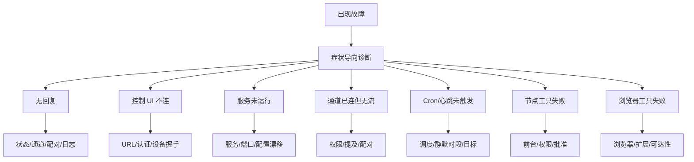

图表来源
- [docs/help/troubleshooting.md:68-298](file://docs/help/troubleshooting.md#L68-L298)
- [docs/gateway/troubleshooting.md:14-380](file://docs/gateway/troubleshooting.md#L14-L380)

章节来源
- [docs/help/troubleshooting.md:13-36](file://docs/help/troubleshooting.md#L13-L36)
- [docs/gateway/troubleshooting.md:14-380](file://docs/gateway/troubleshooting.md#L14-L380)

## 结论
通过规范化的启动/停止与服务管理、完善的健康检查与状态监控、清晰的日志与调试工具、严格的配置热重载与变更域划分、稳健的更新与回滚策略，以及容器化/K8s/Ansible 的生产级部署方案，可以实现 OpenClaw 网关的高可用与可维护性。建议在生产环境中结合 doctor、健康监控与自动化脚本，形成“观察—诊断—修复—验证”的闭环运维流程。

## 附录

### 运维命令参考（节选）
- 网关生命周期：status、install、start、stop、restart、uninstall、probe、call
- 健康与状态：health、channels status --probe、logs --follow
- 配置与热重载：config.get/patch/apply、reload.mode、hot vs restart
- 更新与回滚：openclaw update、doctor、固定版本/检出历史
- 容器与编排：Docker 健康探针、K8s 清单、Ansible 安全加固

章节来源
- [docs/cli/gateway.md:84-236](file://docs/cli/gateway.md#L84-L236)
- [docs/gateway/configuration.md:436-534](file://docs/gateway/configuration.md#L436-L534)
- [docs/install/updating.md:131-276](file://docs/install/updating.md#L131-L276)
- [docs/install/docker.md:469-495](file://docs/install/docker.md#L469-L495)
- [docs/install/kubernetes.md:84-192](file://docs/install/kubernetes.md#L84-L192)
- [docs/install/ansible.md:42-111](file://docs/install/ansible.md#L42-L111)

### 自动化脚本与工具
- 进程孤儿回收：扫描 codex/claude 相关进程，输出 JSON 并脱敏敏感参数。
- macOS 一键重启：锁文件并发控制、签名/无签名流程、LaunchAgent 安装、端口验证、启动应用。
- macOS 日志采集：统一子系统日志、时间范围、分类过滤、错误筛选、导出与流式输出。

章节来源
- [scripts/recover-orphaned-processes.sh:1-192](file://scripts/recover-orphaned-processes.sh#L1-L192)
- [scripts/restart-mac.sh:1-270](file://scripts/restart-mac.sh#L1-L270)
- [scripts/clawlog.sh:1-322](file://scripts/clawlog.sh#L1-L322)