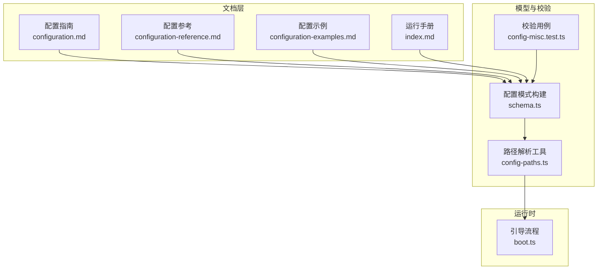
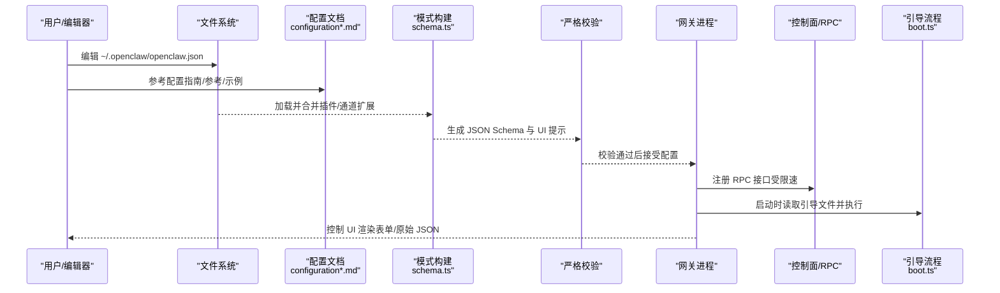
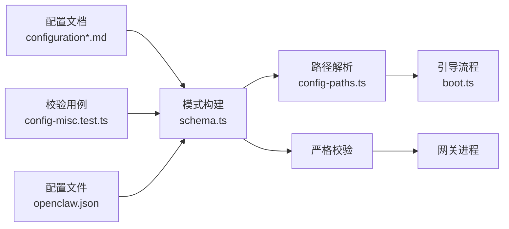

# 网关配置

<cite>
**本文引用的文件**
- [configuration.md](file://docs/gateway/configuration.md)
- [configuration-reference.md](file://docs/gateway/configuration-reference.md)
- [configuration-examples.md](file://docs/gateway/configuration-examples.md)
- [index.md](file://docs/gateway/index.md)
- [schema.ts](file://src/config/schema.ts)
- [config-paths.ts](file://src/config/config-paths.ts)
- [config-misc.test.ts](file://src/config/config-misc.test.ts)
- [boot.ts](file://src/gateway/boot.ts)
</cite>

## 目录
1. [简介](#简介)
2. [项目结构](#项目结构)
3. [核心组件](#核心组件)
4. [架构总览](#架构总览)
5. [详细组件分析](#详细组件分析)
6. [依赖关系分析](#依赖关系分析)
7. [性能考量](#性能考量)
8. [故障排除指南](#故障排除指南)
9. [结论](#结论)
10. [附录](#附录)

## 简介
本文件系统化梳理 OpenClaw 网关的配置体系，覆盖配置文件结构、参数选项、严格校验机制、端口绑定模式、控制界面配置、热重载模式与优先级规则，并提供完整配置参考、部署模板与最佳实践、加载顺序与环境变量覆盖、动态更新机制以及常见问题排查方法。目标是帮助用户在不同部署场景下快速、安全地完成网关配置。

## 项目结构
- 配置文档位于 docs/gateway 下，包含任务导向的配置指南、全量参考与示例。
- 运行时配置解析与校验由 src/config 与 src/gateway 组件负责，形成“文档—模型—实现”的闭环。

图表来源
- [configuration.md:1-634](file://docs/gateway/configuration.md#L1-L634)
- [configuration-reference.md:1-800](file://docs/gateway/configuration-reference.md#L1-L800)
- [configuration-examples.md:1-638](file://docs/gateway/configuration-examples.md#L1-L638)
- [index.md:1-262](file://docs/gateway/index.md#L1-L262)
- [schema.ts:1-712](file://src/config/schema.ts#L1-L712)
- [config-paths.ts:1-83](file://src/config/config-paths.ts#L1-L83)
- [config-misc.test.ts:1-483](file://src/config/config-misc.test.ts#L1-L483)
- [boot.ts:1-204](file://src/gateway/boot.ts#L1-L204)

章节来源
- [configuration.md:1-634](file://docs/gateway/configuration.md#L1-L634)
- [configuration-reference.md:1-800](file://docs/gateway/configuration-reference.md#L1-L800)
- [configuration-examples.md:1-638](file://docs/gateway/configuration-examples.md#L1-L638)
- [index.md:1-262](file://docs/gateway/index.md#L1-L262)

## 核心组件
- 配置格式与校验：采用 JSON5（支持注释与尾随逗号），严格遵循内置 JSON Schema，未知键或类型/取值非法将拒绝启动。
- 模式构建与 UI 提示：通过 schema.ts 动态合并插件与通道扩展的配置模式与 UI 提示，生成最终表单与校验规则。
- 路径解析与写入：config-paths.ts 提供安全的点位路径解析、设置、删除能力，避免原型链污染等风险。
- 热重载与控制面：支持 hybrid/hot/restart/off 四种模式；部分字段热应用，关键变更自动重启；RPC 接口受速率限制。
- 引导与会话映射：boot.ts 在启动阶段读取工作区引导文件并执行一次性检查，确保初始状态正确。

章节来源
- [schema.ts:1-712](file://src/config/schema.ts#L1-L712)
- [config-paths.ts:1-83](file://src/config/config-paths.ts#L1-L83)
- [config-misc.test.ts:1-483](file://src/config/config-misc.test.ts#L1-L483)
- [boot.ts:1-204](file://src/gateway/boot.ts#L1-L204)

## 架构总览
下图展示从配置文件到运行时的关键流转：文档定义字段语义 → 模式构建与 UI 提示 → 严格校验 → 热重载与控制面 → 启动与引导。

图表来源
- [configuration.md:1-634](file://docs/gateway/configuration.md#L1-L634)
- [configuration-reference.md:1-800](file://docs/gateway/configuration-reference.md#L1-L800)
- [configuration-examples.md:1-638](file://docs/gateway/configuration-examples.md#L1-L638)
- [schema.ts:429-484](file://src/config/schema.ts#L429-L484)
- [boot.ts:138-204](file://src/gateway/boot.ts#L138-L204)

## 详细组件分析

### 配置文件结构与参数选项
- 文件位置与格式：默认读取用户目录下的 JSON5 配置文件；支持注释与尾随逗号；未提供时使用安全默认。
- 字段组织：按功能域分层（如 gateway、channels、agents、session、tools、hooks、cron、models、ui、logging 等）。
- 严格校验：仅接受完全匹配模式的配置；未知键、类型不匹配、非法值将导致启动失败；诊断命令可用（doctor/status/logs/health）。

章节来源
- [configuration.md:10-74](file://docs/gateway/configuration.md#L10-L74)
- [configuration-reference.md:10-16](file://docs/gateway/configuration-reference.md#L10-L16)

### 端口绑定模式与控制界面
- 端口与绑定优先级：
  - 端口：CLI 参数 > 环境变量 > 配置字段 > 默认端口。
  - 绑定：CLI/覆盖 > 配置字段 > 默认回环绑定。
- 控制界面：可通过配置启用并自定义基础路径；控制 UI 基于模式渲染表单，同时保留原始 JSON 编辑入口。

章节来源
- [index.md:78-93](file://docs/gateway/index.md#L78-L93)
- [configuration.md:412-425](file://docs/gateway/configuration.md#L412-L425)

### 热重载模式与变更生效策略
- 模式：
  - hybrid（默认）：对安全变更即时热应用，关键变更自动重启。
  - hot：仅热应用安全变更，必要时记录警告交由人工处理。
  - restart：任何变更均重启。
  - off：禁用文件监听，需手动重启。
- 生效范围：大部分字段热应用；网关服务与基础设施类变更需重启。
- RPC 写入：受速率限制（每设备/IP 每分钟有限请求数），并有重启冷却策略。

章节来源
- [configuration.md:436-534](file://docs/gateway/configuration.md#L436-L534)
- [index.md:85-93](file://docs/gateway/index.md#L85-L93)

### 配置优先级与加载顺序
- 加载顺序：父进程环境变量 + 当前工作目录 .env + 用户目录 .env（两者不覆盖既有环境变量）；可在配置中内联 env 变量；支持环境变量替换语法。
- 优先级：CLI 参数 > 环境变量 > 配置文件 > 默认值。
- 多文件组织：支持 $include 将大配置拆分为多个文件，支持数组深合并与兄弟键覆盖。

章节来源
- [configuration.md:536-586](file://docs/gateway/configuration.md#L536-L586)
- [configuration.md:412-433](file://docs/gateway/configuration.md#L412-L433)

### 配置验证机制与错误处理
- 模式构建：基于 Zod Schema，动态合并插件与通道扩展的配置片段，生成最终模式与 UI 提示。
- 严格校验：未知键、非法类型、越界取值均被拒绝；提供明确的诊断信息与修复建议。
- 兼容性与迁移：对历史字段进行标记但不自动迁移，保留遗留问题以便人工修复。

章节来源
- [schema.ts:429-484](file://src/config/schema.ts#L429-L484)
- [config-misc.test.ts:398-482](file://src/config/config-misc.test.ts#L398-L482)

### 动态更新与控制面接口
- 控制面写入：提供 RPC 接口（config.apply、config.patch）进行全量替换或补丁式更新；需携带 baseHash 并可指定重启延迟与唤醒会话键。
- 速率限制：每设备/IP 每分钟有限请求次数，超限返回 UNAVAILABLE 并提示重试时间。
- 重启协同：挂起的重启请求会被合并，且重启周期间存在冷却窗口。

章节来源
- [configuration.md:476-534](file://docs/gateway/configuration.md#L476-L534)

### 引导流程与会话映射
- 引导文件：工作区内的引导文件在启动时被读取并执行一次性检查，确保初始状态正确。
- 会话映射快照：在引导前后对主会话映射进行快照与恢复，保证状态一致性。

章节来源
- [boot.ts:138-204](file://src/gateway/boot.ts#L138-L204)

## 依赖关系分析
- 文档与模式：配置指南与参考文档驱动模式构建，schema.ts 依据文档语义生成最终模式与 UI 提示。
- 安全路径：config-paths.ts 提供安全的路径解析与写入，避免原型链污染等风险。
- 校验与测试：config-misc.test.ts 通过大量用例覆盖边界条件与兼容性，保障模式的健壮性。
- 运行时集成：boot.ts 在启动阶段读取引导文件，与配置系统协同工作。

图表来源
- [configuration.md:1-634](file://docs/gateway/configuration.md#L1-L634)
- [configuration-reference.md:1-800](file://docs/gateway/configuration-reference.md#L1-L800)
- [schema.ts:1-712](file://src/config/schema.ts#L1-L712)
- [config-paths.ts:1-83](file://src/config/config-paths.ts#L1-L83)
- [config-misc.test.ts:1-483](file://src/config/config-misc.test.ts#L1-L483)
- [boot.ts:1-204](file://src/gateway/boot.ts#L1-L204)

章节来源
- [schema.ts:1-712](file://src/config/schema.ts#L1-L712)
- [config-paths.ts:1-83](file://src/config/config-paths.ts#L1-L83)
- [config-misc.test.ts:1-483](file://src/config/config-misc.test.ts#L1-L483)
- [boot.ts:1-204](file://src/gateway/boot.ts#L1-L204)

## 性能考量
- 热重载策略：hybrid 模式在安全变更上减少停机时间；关键变更自动重启，避免半生效状态。
- RPC 写入：速率限制与重启冷却防止频繁重启带来的抖动。
- 模式缓存：schema.ts 对合并后的模式进行缓存，降低重复构建开销。
- 路径解析：config-paths.ts 使用栈式解析与最小化对象重建，降低写入成本。

章节来源
- [configuration.md:436-534](file://docs/gateway/configuration.md#L436-L534)
- [schema.ts:398-406](file://src/config/schema.ts#L398-L406)

## 故障排除指南
- 启动失败（拒绝配置）：使用诊断命令定位具体字段与问题；根据提示修复或使用修复选项。
- 端口冲突/绑定问题：检查端口占用与绑定模式；非回环绑定需配置认证。
- 认证不匹配：客户端与网关的认证需一致。
- 热重载无效：确认变更是否属于热应用范围；必要时切换为 hybrid 或手动重启。
- RPC 写入受限：等待冷却窗口结束或降低写入频率。

章节来源
- [configuration.md:61-74](file://docs/gateway/configuration.md#L61-L74)
- [index.md:235-244](file://docs/gateway/index.md#L235-L244)

## 结论
OpenClaw 的网关配置系统以严格的 JSON Schema 为核心，结合动态模式构建与 UI 提示，实现了高可维护性与安全性。通过多样的热重载模式、清晰的优先级与加载顺序、完善的 RPC 写入与速率限制，以及引导流程的状态保护，系统在易用性与可靠性之间取得良好平衡。建议在生产环境中优先采用 hybrid 模式与严格的凭据管理，并配合诊断与健康检查工具进行持续运维。

## 附录

### 配置参考要点（摘要）
- 通用字段：gateway（端口、绑定、认证、远程、热重载）、channels（各通道策略与行为）、agents（工作区、模型、心跳、沙箱）、session（会话作用域、重置、存储）、tools/hooks/cron/models/ui/logging 等。
- 严格校验：未知键、非法类型、越界取值将拒绝启动；提供诊断命令辅助修复。
- 环境变量：支持 .env 与内联 env；支持字符串中的环境变量替换；可选择性导入 Shell 环境。
- 热重载：hybrid/hot/restart/off；大部分字段热应用，网关与基础设施类变更需重启。
- 控制面：RPC 写入受速率限制，重启合并与冷却策略保障稳定性。

章节来源
- [configuration.md:10-634](file://docs/gateway/configuration.md#L10-L634)
- [configuration-reference.md:1-800](file://docs/gateway/configuration-reference.md#L1-L800)