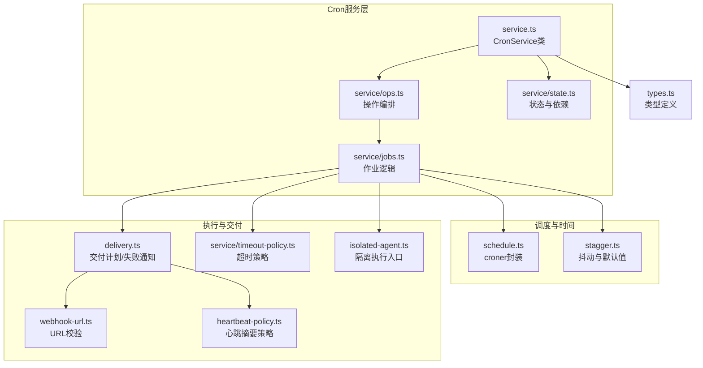
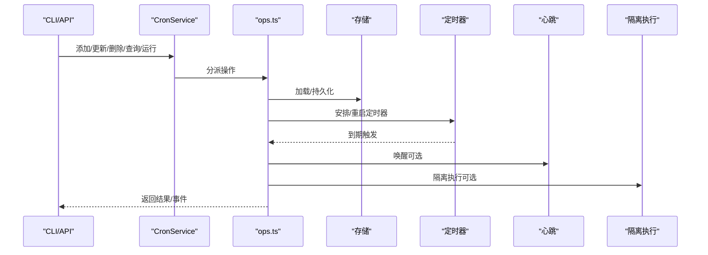
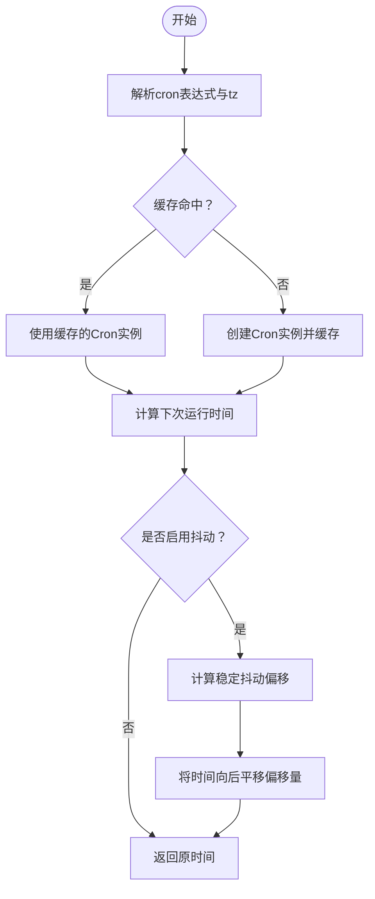
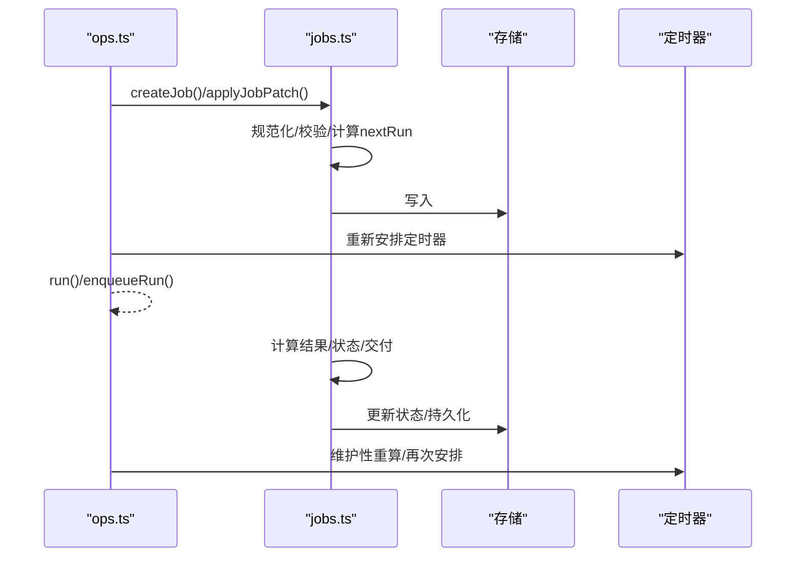
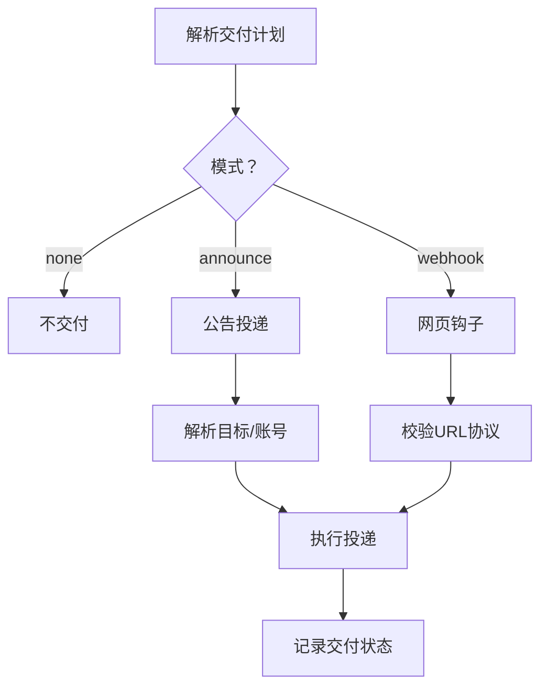
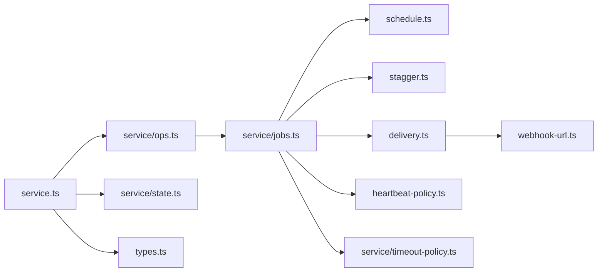

# Cron调度系统

<cite>
**本文引用的文件**
- [src/cron/service.ts](file://src/cron/service.ts)
- [src/cron/service/state.ts](file://src/cron/service/state.ts)
- [src/cron/service/ops.ts](file://src/cron/service/ops.ts)
- [src/cron/service/jobs.ts](file://src/cron/service/jobs.ts)
- [src/cron/schedule.ts](file://src/cron/schedule.ts)
- [src/cron/stagger.ts](file://src/cron/stagger.ts)
- [src/cron/types.ts](file://src/cron/types.ts)
- [src/cron/delivery.ts](file://src/cron/delivery.ts)
- [src/cron/webhook-url.ts](file://src/cron/webhook-url.ts)
- [src/cron/heartbeat-policy.ts](file://src/cron/heartbeat-policy.ts)
- [src/cron/service/timeout-policy.ts](file://src/cron/service/timeout-policy.ts)
- [src/cron/isolated-agent.ts](file://src/cron/isolated-agent.ts)
- [docs/automation/cron-jobs.md](file://docs/automation/cron-jobs.md)
- [docs/cli/cron.md](file://docs/cli/cron.md)
</cite>

## 目录
1. [简介](#简介)
2. [项目结构](#项目结构)
3. [核心组件](#核心组件)
4. [架构总览](#架构总览)
5. [详细组件分析](#详细组件分析)
6. [依赖关系分析](#依赖关系分析)
7. [性能考量](#性能考量)
8. [故障排查指南](#故障排查指南)
9. [结论](#结论)
10. [附录](#附录)

## 简介
本技术文档面向OpenClaw Cron调度系统，系统性阐述Cron作业的创建、配置、生命周期管理（创建、修改、暂停、删除、重新调度）、执行环境与上下文（参数传递、状态管理、结果处理），并提供常见调度场景示例、最佳实践、性能优化与资源管理建议，以及与系统其他组件的集成要点。

## 项目结构
Cron调度系统位于src/cron目录下，采用按职责分层的模块化组织：
- service：服务入口与操作编排（启动、停止、增删改查、运行、定时器）
- schedule/stagger：时间表达式解析与抖动计算
- types：类型定义与契约
- delivery：交付策略与失败通知
- webhook-url：Webhook URL校验
- heartbeat-policy：心跳与摘要投递策略
- timeout-policy：执行超时策略
- isolated-agent：隔离会话执行入口

图表来源
- [src/cron/service.ts](file://src/cron/service.ts#L1-L61)
- [src/cron/service/ops.ts](file://src/cron/service/ops.ts#L1-L120)
- [src/cron/service/jobs.ts](file://src/cron/service/jobs.ts#L1-L120)
- [src/cron/schedule.ts](file://src/cron/schedule.ts#L1-L60)
- [src/cron/stagger.ts](file://src/cron/stagger.ts#L1-L47)
- [src/cron/delivery.ts](file://src/cron/delivery.ts#L1-L120)
- [src/cron/webhook-url.ts](file://src/cron/webhook-url.ts#L1-L23)
- [src/cron/heartbeat-policy.ts](file://src/cron/heartbeat-policy.ts#L1-L49)
- [src/cron/service/timeout-policy.ts](file://src/cron/service/timeout-policy.ts#L1-L26)
- [src/cron/isolated-agent.ts](file://src/cron/isolated-agent.ts#L1-L2)
- [src/cron/types.ts](file://src/cron/types.ts#L1-L60)

章节来源
- [src/cron/service.ts](file://src/cron/service.ts#L1-L61)
- [src/cron/service/ops.ts](file://src/cron/service/ops.ts#L1-L120)
- [src/cron/service/jobs.ts](file://src/cron/service/jobs.ts#L1-L120)
- [src/cron/schedule.ts](file://src/cron/schedule.ts#L1-L60)
- [src/cron/stagger.ts](file://src/cron/stagger.ts#L1-L47)
- [src/cron/delivery.ts](file://src/cron/delivery.ts#L1-L120)
- [src/cron/webhook-url.ts](file://src/cron/webhook-url.ts#L1-L23)
- [src/cron/heartbeat-policy.ts](file://src/cron/heartbeat-policy.ts#L1-L49)
- [src/cron/service/timeout-policy.ts](file://src/cron/service/timeout-policy.ts#L1-L26)
- [src/cron/isolated-agent.ts](file://src/cron/isolated-agent.ts#L1-L2)
- [src/cron/types.ts](file://src/cron/types.ts#L1-L60)

## 核心组件
- CronService：对外暴露的Cron服务类，封装启动、停止、查询、增删改、运行、唤醒等能力。
- CronServiceDeps/State：服务依赖注入与内部状态管理，包括存储路径、日志、心跳回调、隔离执行回调、事件回调等。
- 作业模型与类型：CronJob、CronSchedule、CronPayload、CronDelivery、CronFailureAlert等。
- 调度与时间：基于croner的cron表达式解析与缓存；针对整点表达式的默认抖动窗口；稳定抖动偏移计算。
- 执行与交付：主会话systemEvent与隔离会话agentTurn两种执行路径；交付模式（无/公告/网页钩子）与失败通知；心跳摘要策略；超时策略。
- 操作编排：增删改查、手动运行、队列化执行、定时器管理、错过任务重放等。

章节来源
- [src/cron/service.ts](file://src/cron/service.ts#L7-L61)
- [src/cron/service/state.ts](file://src/cron/service/state.ts#L38-L170)
- [src/cron/types.ts](file://src/cron/types.ts#L5-L160)
- [src/cron/schedule.ts](file://src/cron/schedule.ts#L1-L60)
- [src/cron/stagger.ts](file://src/cron/stagger.ts#L1-L47)
- [src/cron/delivery.ts](file://src/cron/delivery.ts#L13-L120)
- [src/cron/heartbeat-policy.ts](file://src/cron/heartbeat-policy.ts#L31-L49)
- [src/cron/service/timeout-policy.ts](file://src/cron/service/timeout-policy.ts#L16-L26)

## 架构总览
Cron调度系统在Gateway进程中运行，持久化存储于本地JSON文件，通过定时器驱动触发执行。支持两类执行路径：
- 主会话（main）：入队systemEvent，在下一个心跳周期执行，适合需要共享主会话上下文的任务。
- 隔离会话（isolated）：在独立会话中执行agentTurn，适合后台任务或需要独立上下文的任务。

图表来源
- [src/cron/service.ts](file://src/cron/service.ts#L13-L60)
- [src/cron/service/ops.ts](file://src/cron/service/ops.ts#L92-L131)
- [src/cron/service/state.ts](file://src/cron/service/state.ts#L121-L170)

## 详细组件分析

### 时间表达式与调度策略
- cron表达式解析：使用croner库，支持带/不带秒的5/6字段表达式，并缓存解析结果以降低开销。
- 时区处理：优先使用显式tz，否则回退到系统时区；对特定时区存在已知年份回滚问题进行补偿。
- 整点抖动：对整点触发的cron表达式（如每小时0分）应用确定性抖动窗口，默认约5分钟，避免多实例同时触发导致的峰值。
- 稳定抖动偏移：基于jobId与staggerMs生成稳定的偏移量，确保同一job在同一抖动窗口内保持一致。

图表来源
- [src/cron/schedule.ts](file://src/cron/schedule.ts#L16-L47)
- [src/cron/stagger.ts](file://src/cron/stagger.ts#L39-L47)
- [src/cron/service/jobs.ts](file://src/cron/service/jobs.ts#L64-L90)

章节来源
- [src/cron/schedule.ts](file://src/cron/schedule.ts#L1-L170)
- [src/cron/stagger.ts](file://src/cron/stagger.ts#L1-L47)
- [src/cron/service/jobs.ts](file://src/cron/service/jobs.ts#L64-L118)

### 作业生命周期管理
- 创建：规范化输入、推导默认值（如deleteAfterRun、staggerMs）、校验约束（主会话仅支持systemEvent、隔离会话仅支持agentTurn）、计算首次运行时间。
- 修改：支持对schedule、payload、delivery、failureAlert、agentId、sessionKey等字段增量更新；对cron表达式变更保留现有stagger或回填默认值。
- 暂停/启用：通过enabled字段控制；禁用时清理nextRun与running标记。
- 删除：从内存与存储中移除；一次性作业成功后默认删除。
- 重新调度：更新schedule或enabled时自动重算nextRun；若nextRun已过期则维护性重算以避免静默推进。

图表来源
- [src/cron/service/ops.ts](file://src/cron/service/ops.ts#L236-L342)
- [src/cron/service/jobs.ts](file://src/cron/service/jobs.ts#L503-L560)
- [src/cron/service/jobs.ts](file://src/cron/service/jobs.ts#L562-L648)

章节来源
- [src/cron/service/ops.ts](file://src/cron/service/ops.ts#L236-L342)
- [src/cron/service/jobs.ts](file://src/cron/service/jobs.ts#L503-L560)
- [src/cron/service/jobs.ts](file://src/cron/service/jobs.ts#L562-L648)

### 执行环境与上下文
- 主会话（main）：payload必须为systemEvent；可选择立即唤醒心跳或等待下一心跳；适合需要共享主会话上下文的任务。
- 隔离会话（isolated）：payload必须为agentTurn；可覆盖模型、思考层级、超时、轻量上下文等；默认交付为公告，也可配置网页钩子或无交付。
- 轻量上下文：隔离执行可启用轻量上下文，避免注入完整工作空间引导文件，降低启动成本。
- 会话键与代理绑定：支持指定sessionKey与agentId，未指定时回退到默认代理。

章节来源
- [src/cron/types.ts](file://src/cron/types.ts#L85-L109)
- [src/cron/service/jobs.ts](file://src/cron/service/jobs.ts#L534-L559)
- [docs/automation/cron-jobs.md](file://docs/automation/cron-jobs.md#L135-L167)

### 交付与失败通知
- 交付模式：
  - 无：不投递到任何渠道，也不向主会话发送摘要。
  - 公告：直接通过消息通道投递摘要，避免重复投递；支持最佳努力模式。
  - 网页钩子：POST完成事件到指定URL，支持Bearer Token认证。
- 失败通知：可配置失败目的地，避免与主交付目标相同；支持公告或网页钩子两种模式。
- 心跳摘要策略：当仅产生心跳确认且无实质内容时，根据策略决定是否投递摘要。

图表来源
- [src/cron/delivery.ts](file://src/cron/delivery.ts#L50-L102)
- [src/cron/delivery.ts](file://src/cron/delivery.ts#L129-L209)
- [src/cron/webhook-url.ts](file://src/cron/webhook-url.ts#L5-L22)
- [src/cron/heartbeat-policy.ts](file://src/cron/heartbeat-policy.ts#L31-L49)

章节来源
- [src/cron/delivery.ts](file://src/cron/delivery.ts#L13-L210)
- [src/cron/webhook-url.ts](file://src/cron/webhook-url.ts#L1-L23)
- [src/cron/heartbeat-policy.ts](file://src/cron/heartbeat-policy.ts#L1-L49)

### 超时与重试策略
- 默认超时：普通作业10分钟；隔离agentTurn作业60分钟；可由payload.timeoutSeconds覆盖。
- 重试策略：
  - 单次作业（at）：瞬时错误（限流/过载/网络/服务端错误）最多重试3次，指数退避；永久错误直接禁用。
  - 周期作业（cron/every）：连续错误采用指数退避（30s→1m→5m→15m→60m），成功后重置。
- 错误分类：用于指导回退行为（如交付目标错误）。

章节来源
- [src/cron/service/timeout-policy.ts](file://src/cron/service/timeout-policy.ts#L16-L26)
- [docs/automation/cron-jobs.md](file://docs/automation/cron-jobs.md#L367-L398)

### 与系统组件的集成
- 与心跳（heartbeat）：主会话执行通过心跳触发；可配置立即唤醒或等待下一心跳；摘要投递遵循心跳策略。
- 与消息通道：公告投递通过outbound适配器实现；支持多账号、主题/论坛线程等目标格式。
- 与会话存储：隔离执行产生的会话与转录文件受会话保留策略控制，定期清理过期数据。
- 与网关配置：可通过配置项控制启用、存储路径、并发运行数、运行日志大小与行数、会话保留时长等。

章节来源
- [src/cron/heartbeat-policy.ts](file://src/cron/heartbeat-policy.ts#L31-L49)
- [src/cron/delivery.ts](file://src/cron/delivery.ts#L241-L301)
- [docs/automation/cron-jobs.md](file://docs/automation/cron-jobs.md#L445-L522)

## 依赖关系分析
- 低耦合高内聚：各模块职责清晰，通过types统一契约，通过service/ops集中编排。
- 关键依赖链：
  - service/ops依赖service/jobs进行业务逻辑与状态管理。
  - service/jobs依赖schedule/stagger进行时间计算与抖动。
  - delivery依赖webhook-url进行URL校验，依赖heartbeat-policy进行摘要策略。
  - service/state提供依赖注入与事件回调，贯穿整个执行链路。

图表来源
- [src/cron/service.ts](file://src/cron/service.ts#L1-L61)
- [src/cron/service/ops.ts](file://src/cron/service/ops.ts#L1-L27)
- [src/cron/service/jobs.ts](file://src/cron/service/jobs.ts#L1-L34)
- [src/cron/schedule.ts](file://src/cron/schedule.ts#L1-L6)
- [src/cron/stagger.ts](file://src/cron/stagger.ts#L1-L4)
- [src/cron/delivery.ts](file://src/cron/delivery.ts#L1-L12)
- [src/cron/webhook-url.ts](file://src/cron/webhook-url.ts#L1-L6)
- [src/cron/heartbeat-policy.ts](file://src/cron/heartbeat-policy.ts#L1-L4)
- [src/cron/service/timeout-policy.ts](file://src/cron/service/timeout-policy.ts#L1-L4)
- [src/cron/service/state.ts](file://src/cron/service/state.ts#L1-L14)
- [src/cron/types.ts](file://src/cron/types.ts#L1-L4)

章节来源
- [src/cron/service.ts](file://src/cron/service.ts#L1-L61)
- [src/cron/service/ops.ts](file://src/cron/service/ops.ts#L1-L27)
- [src/cron/service/jobs.ts](file://src/cron/service/jobs.ts#L1-L34)

## 性能考量
- 缓存与抖动：cron解析缓存与稳定抖动偏移缓存减少重复计算与热点竞争。
- 运行日志与会话清理：合理设置runLog.maxBytes/keepLines与sessionRetention，避免IO压力与磁盘占用。
- 并发与队列：手动运行通过命令队列排队，避免并发阻塞；单个CronLane限制争用。
- 超时保护：默认超时防止卡死影响整体调度；隔离执行更大超时上限以适应长任务。
- 高频场景建议：使用抖动、降低会话保留窗口、限制运行日志规模、将噪音任务改为隔离执行并配置最佳努力交付。

章节来源
- [src/cron/schedule.ts](file://src/cron/schedule.ts#L5-L31)
- [src/cron/stagger.ts](file://src/cron/stagger.ts#L39-L47)
- [src/cron/service/timeout-policy.ts](file://src/cron/service/timeout-policy.ts#L16-L26)
- [docs/automation/cron-jobs.md](file://docs/automation/cron-jobs.md#L463-L522)

## 故障排查指南
- 无作业运行：检查cron.enabled与环境变量；确认Gateway持续运行；核对cron时区与主机时区。
- 周期作业延迟：查看指数退避策略与成功后自动恢复；检查瞬时错误分类。
- Telegram投递异常：使用冒号分隔的主题格式（-1001234567890:topic:123）；避免斜杠分隔。
- 子代理公告重试：关注announceRetryCount与过期强制清理机制；检查请求方会话占用情况。
- 存储与迁移：doctor命令可修复旧版字段与notify: true到显式webhook迁移。

章节来源
- [docs/automation/cron-jobs.md](file://docs/automation/cron-jobs.md#L659-L686)
- [docs/cli/cron.md](file://docs/cli/cron.md#L28-L38)

## 结论
OpenClaw Cron调度系统提供了稳定、可扩展的后台任务执行框架，支持多种调度策略与执行路径，并通过交付与失败通知、超时与重试策略保障可靠性。通过合理的配置与最佳实践，可在高负载场景下保持良好性能与可观测性。

## 附录

### 常见调度场景与最佳实践
- 一次性提醒：使用at，主会话+立即唤醒，成功后删除。
- 每日简报：使用cron，隔离执行+公告投递至Slack/Telegram等。
- 高频检查：使用cron+stagger，避免整点风暴；必要时使用exact关闭抖动。
- 网络钩子：使用webhook模式，配合Bearer Token认证。
- 轻量任务：启用lightContext，避免注入完整工作空间引导文件。
- 多代理：主会话仅支持默认代理；非默认代理需使用隔离执行。

章节来源
- [docs/automation/cron-jobs.md](file://docs/automation/cron-jobs.md#L22-L652)
- [docs/cli/cron.md](file://docs/cli/cron.md#L19-L78)