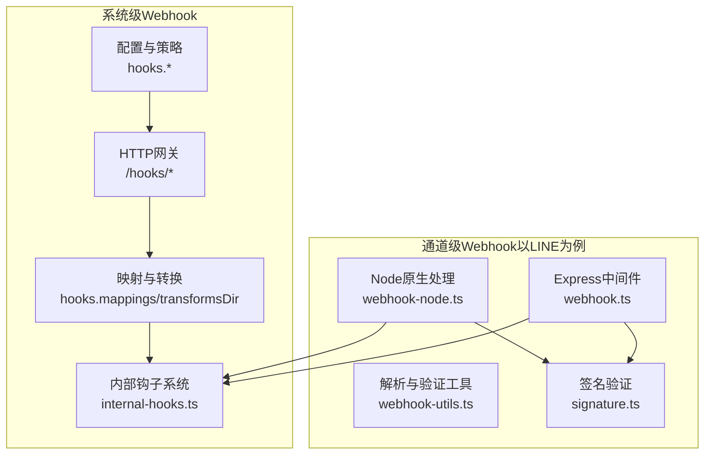
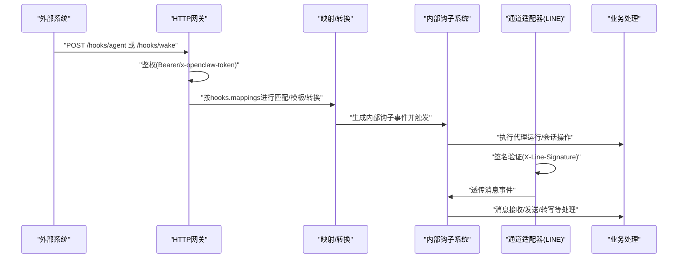
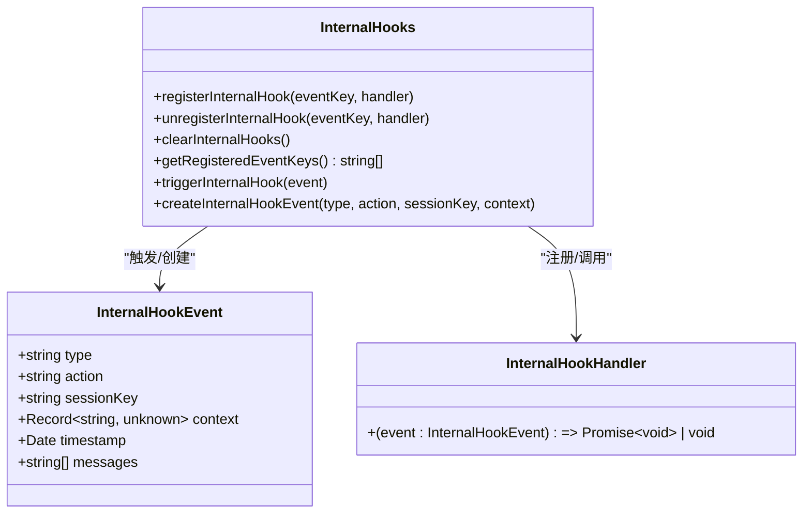
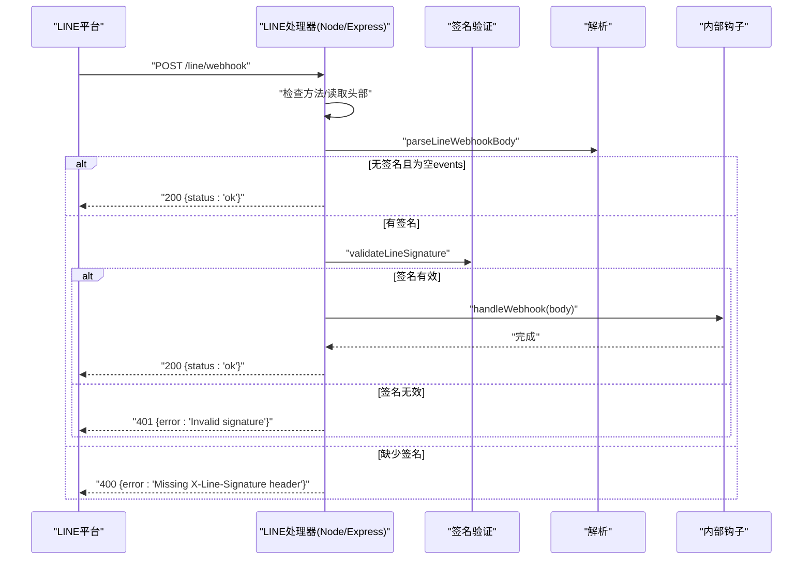
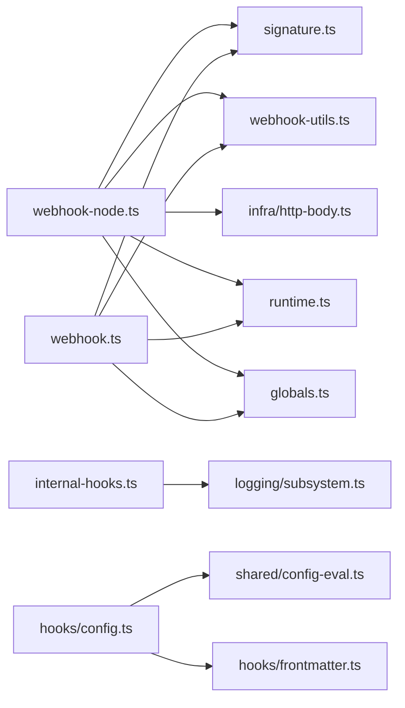

# Webhook系统

<cite>
**本文引用的文件**
- [docs/automation/webhook.md](file://docs/automation/webhook.md)
- [docs/cli/webhooks.md](file://docs/cli/webhooks.md)
- [src/hooks/hooks.ts](file://src/hooks/hooks.ts)
- [src/hooks/internal-hooks.ts](file://src/hooks/internal-hooks.ts)
- [src/hooks/types.ts](file://src/hooks/types.ts)
- [src/line/webhook-node.ts](file://src/line/webhook-node.ts)
- [src/line/webhook.ts](file://src/line/webhook.ts)
- [src/line/webhook-utils.ts](file://src/line/webhook-utils.ts)
- [src/line/signature.ts](file://src/line/signature.ts)
- [src/infra/http-body.ts](file://src/infra/http-body.ts)
- [src/globals.ts](file://src/globals.ts)
- [src/runtime.ts](file://src/runtime.ts)
- [src/shared/config-eval.ts](file://src/shared/config-eval.ts)
- [src/hooks/config.ts](file://src/hooks/config.ts)
- [src/hooks/frontmatter.ts](file://src/hooks/frontmatter.ts)
- [src/line/webhook-node.test.ts](file://src/line/webhook-node.test.ts)
</cite>

## 目录
1. [简介](#简介)
2. [项目结构](#项目结构)
3. [核心组件](#核心组件)
4. [架构总览](#架构总览)
5. [组件详解](#组件详解)
6. [依赖关系分析](#依赖关系分析)
7. [性能考量](#性能考量)
8. [故障排除指南](#故障排除指南)
9. [结论](#结论)
10. [附录](#附录)

## 简介
本文件面向OpenClaw的Webhook系统，系统性阐述其工作原理、实现机制与使用方式，覆盖以下主题：
- 事件订阅与消息格式：系统内钩子事件类型、消息钩子上下文模型、映射与转换机制
- 安全验证与签名验证：LINE通道的签名算法、头部校验、超时与大小限制
- 配置方法：URL路径、事件过滤、重试策略与错误处理
- 安全机制：令牌认证、速率限制、会话键策略与内容安全边界
- 事件类型清单与示例：从系统唤醒到代理运行、消息收发与转写等
- 调试技巧、监控与排障：常见状态码、日志与测试用例参考
- 自定义Webhook处理器与最佳实践：注册钩子、映射器与转换模块

## 项目结构
OpenClaw的Webhook能力由两条主线构成：
- 系统级HTTP Webhook入口（用于外部触发与集成）
- 通道级Webhook适配器（以LINE为例，负责签名验证与事件透传）

图表来源
- [src/hooks/internal-hooks.ts](file://src/hooks/internal-hooks.ts#L1-L422)
- [src/line/webhook-node.ts](file://src/line/webhook-node.ts#L1-L144)
- [src/line/webhook.ts](file://src/line/webhook.ts#L1-L117)
- [src/line/webhook-utils.ts](file://src/line/webhook-utils.ts#L1-L16)
- [src/line/signature.ts](file://src/line/signature.ts#L1-L19)

章节来源
- [src/hooks/internal-hooks.ts](file://src/hooks/internal-hooks.ts#L1-L422)
- [src/line/webhook-node.ts](file://src/line/webhook-node.ts#L1-L144)
- [src/line/webhook.ts](file://src/line/webhook.ts#L1-L117)
- [src/line/webhook-utils.ts](file://src/line/webhook-utils.ts#L1-L16)
- [src/line/signature.ts](file://src/line/signature.ts#L1-L19)

## 核心组件
- 系统级Webhook入口与路由
  - 文档定义了启用开关、令牌、路径与代理路由白名单等配置项，并给出/wake与/agent两个核心端点的请求与响应行为
- 内部钩子系统
  - 提供事件类型、上下文模型、注册/触发/注销钩子的统一机制；支持消息类事件（接收、发送、转写、预处理）与代理启动、网关启动等
- 通道级Webhook适配器（LINE）
  - Node原生与Express两种形态的处理器，均实现签名验证、请求体读取限制、超时控制与错误处理
  - 提供解析与验证工具函数，以及基于HMAC-SHA256的常量时间签名比较

章节来源
- [docs/automation/webhook.md](file://docs/automation/webhook.md#L1-L216)
- [src/hooks/internal-hooks.ts](file://src/hooks/internal-hooks.ts#L13-L172)
- [src/line/webhook-node.ts](file://src/line/webhook-node.ts#L31-L144)
- [src/line/webhook.ts](file://src/line/webhook.ts#L34-L117)
- [src/line/webhook-utils.ts](file://src/line/webhook-utils.ts#L1-L16)
- [src/line/signature.ts](file://src/line/signature.ts#L1-L19)

## 架构总览
下图展示系统级Webhook与通道级Webhook在整体中的位置与交互：

图表来源
- [docs/automation/webhook.md](file://docs/automation/webhook.md#L42-L158)
- [src/hooks/internal-hooks.ts](file://src/hooks/internal-hooks.ts#L159-L288)
- [src/line/webhook-node.ts](file://src/line/webhook-node.ts#L41-L142)
- [src/line/webhook.ts](file://src/line/webhook.ts#L34-L86)

## 组件详解

### 系统级Webhook入口与配置
- 启用与令牌
  - 开启hooks.enabled并设置hooks.token；默认路径为/hooks；可配置allowedAgentIds限制代理路由
- 认证方式
  - 推荐使用Authorization: Bearer <token>；也可使用x-openclaw-token；查询参数被拒绝
- 端点与负载
  - /hooks/wake：触发心跳或系统事件
  - /hooks/agent：隔离代理运行，支持name、agentId、sessionKey、wakeMode、deliver、channel、to、model、thinking、timeoutSeconds等字段
  - /hooks/<name>：通过hooks.mappings映射到标准动作，支持模板与JS/TS转换模块
- 响应与错误
  - 成功返回200；鉴权失败401；重复鉴权失败按客户端地址限流（429，含Retry-After）；无效负载400；请求过大413；其他500
- 会话键策略
  - 默认禁止请求覆盖sessionKey；可通过defaultSessionKey与allowedSessionKeyPrefixes进行约束与白名单管理

章节来源
- [docs/automation/webhook.md](file://docs/automation/webhook.md#L13-L27)
- [docs/automation/webhook.md](file://docs/automation/webhook.md#L34-L41)
- [docs/automation/webhook.md](file://docs/automation/webhook.md#L42-L96)
- [docs/automation/webhook.md](file://docs/automation/webhook.md#L98-L130)
- [docs/automation/webhook.md](file://docs/automation/webhook.md#L132-L158)
- [docs/automation/webhook.md](file://docs/automation/webhook.md#L159-L167)
- [docs/automation/webhook.md](file://docs/automation/webhook.md#L204-L216)

### 内部钩子系统（事件模型与注册）
- 事件类型
  - command、session、agent、gateway、message等
- 消息事件上下文
  - 收到/发送/转写/预处理等，包含from、to、channelId、conversationId、messageId、元数据等
- 注册/触发/注销
  - registerInternalHook(eventKey, handler)、triggerInternalHook(event)、unregisterInternalHook(eventKey, handler)、clearInternalHooks()、getRegisteredEventKeys()
  - 触发时同时匹配通用类型与具体type:action组合，异常被捕获并记录但不影响其他处理器

图表来源
- [src/hooks/internal-hooks.ts](file://src/hooks/internal-hooks.ts#L159-L172)
- [src/hooks/internal-hooks.ts](file://src/hooks/internal-hooks.ts#L214-L242)
- [src/hooks/internal-hooks.ts](file://src/hooks/internal-hooks.ts#L270-L288)
- [src/hooks/internal-hooks.ts](file://src/hooks/internal-hooks.ts#L298-L312)

章节来源
- [src/hooks/internal-hooks.ts](file://src/hooks/internal-hooks.ts#L13-L172)
- [src/hooks/internal-hooks.ts](file://src/hooks/internal-hooks.ts#L214-L242)
- [src/hooks/internal-hooks.ts](file://src/hooks/internal-hooks.ts#L270-L288)
- [src/hooks/internal-hooks.ts](file://src/hooks/internal-hooks.ts#L298-L312)

### 通道级Webhook适配器（LINE）
- Node原生处理器
  - 支持GET/HEAD/POST；未签名且为空events的请求视为验证请求，直接返回200；缺失签名返回400；签名不匹配返回401；解析失败返回400；请求体过大返回413；超时返回408；其他错误返回500
  - 读取限制：有签名时最大字节与超时更严格；无签名时采用较小上限
- Express中间件
  - 与Node版本一致的逻辑，便于在Express应用中集成
- 解析与验证
  - parseLineWebhookBody：JSON解析，失败返回null
  - isLineWebhookVerificationRequest：判断空events的验证请求
  - validateLineSignature：HMAC-SHA256 + 常量时间比较
- 错误处理与日志
  - 使用http-body的限制错误识别；错误通过runtime.error输出；日志级别使用logVerbose/danger

图表来源
- [src/line/webhook-node.ts](file://src/line/webhook-node.ts#L41-L142)
- [src/line/webhook.ts](file://src/line/webhook.ts#L34-L86)
- [src/line/webhook-utils.ts](file://src/line/webhook-utils.ts#L3-L15)
- [src/line/signature.ts](file://src/line/signature.ts#L3-L18)

章节来源
- [src/line/webhook-node.ts](file://src/line/webhook-node.ts#L31-L144)
- [src/line/webhook.ts](file://src/line/webhook.ts#L34-L117)
- [src/line/webhook-utils.ts](file://src/line/webhook-utils.ts#L1-L16)
- [src/line/signature.ts](file://src/line/signature.ts#L1-L19)

### 映射与转换（系统级Webhook）
- hooks.mappings：将任意载荷映射为标准动作（wake/agent），支持match、action与模板
- hooks.transformsDir + transform.module：加载JS/TS转换模块，需受控于配置目录与路径遍历保护
- deliver/channel/to：可将回复路由到聊天表面
- agentId与allowedAgentIds：限制显式代理路由
- defaultSessionKey、allowRequestSessionKey、allowedSessionKeyPrefixes：会话键策略
- allowUnsafeExternalContent：禁用外部内容安全包装（危险）

章节来源
- [docs/automation/webhook.md](file://docs/automation/webhook.md#L132-L158)
- [src/hooks/config.ts](file://src/hooks/config.ts#L24-L84)
- [src/hooks/frontmatter.ts](file://src/hooks/frontmatter.ts#L1-L68)

### CLI辅助与Gmail集成
- openclaw webhooks命令族：提供Gmail Pub/Sub设置与运行辅助
- 与自动化文档配合，实现邮件事件到OpenClaw的闭环

章节来源
- [docs/cli/webhooks.md](file://docs/cli/webhooks.md#L1-L26)
- [docs/automation/gmail-pubsub.md](file://docs/automation/gmail-pubsub.md#L1-L200)

## 依赖关系分析
- 外部依赖
  - LINE SDK类型（WebhookRequestBody）用于类型约束
  - Node内置crypto用于HMAC-SHA256签名验证
- 内部依赖
  - 日志与运行时：globals.ts、runtime.ts
  - 请求体读取与限制：infra/http-body.ts
  - 配置评估与钩子解析：shared/config-eval.ts、hooks/frontmatter.ts
  - 测试：line/webhook-node.test.ts覆盖验证请求、方法不支持、缺少签名等场景

图表来源
- [src/line/webhook-node.ts](file://src/line/webhook-node.ts#L1-L14)
- [src/line/signature.ts](file://src/line/signature.ts#L1-L1)
- [src/line/webhook-utils.ts](file://src/line/webhook-utils.ts#L1-L2)
- [src/infra/http-body.ts](file://src/infra/http-body.ts#L1-L200)
- [src/runtime.ts](file://src/runtime.ts#L1-L200)
- [src/globals.ts](file://src/globals.ts#L1-L200)
- [src/hooks/internal-hooks.ts](file://src/hooks/internal-hooks.ts#L1-L200)
- [src/hooks/config.ts](file://src/hooks/config.ts#L1-L85)
- [src/shared/config-eval.ts](file://src/shared/config-eval.ts#L1-L200)
- [src/hooks/frontmatter.ts](file://src/hooks/frontmatter.ts#L1-L68)

章节来源
- [src/line/webhook-node.ts](file://src/line/webhook-node.ts#L1-L14)
- [src/line/webhook.ts](file://src/line/webhook.ts#L1-L12)
- [src/hooks/config.ts](file://src/hooks/config.ts#L1-L18)
- [src/line/webhook-node.test.ts](file://src/line/webhook-node.test.ts#L85-L118)

## 性能考量
- 请求体限制与超时
  - 无签名请求采用更小上限与更快超时，降低恶意探测成本
  - 有签名请求允许更大体，但同样受最大字节限制
- 常量时间签名比较
  - 防止时序侧信道泄露，提升抗暴力破解能力
- 异步处理与错误隔离
  - 内部钩子处理器逐个执行并捕获异常，避免单个处理器失败影响全局

章节来源
- [src/line/webhook-node.ts](file://src/line/webhook-node.ts#L13-L16)
- [src/line/webhook-node.ts](file://src/line/webhook-node.ts#L73-L76)
- [src/line/signature.ts](file://src/line/signature.ts#L12-L18)
- [src/hooks/internal-hooks.ts](file://src/hooks/internal-hooks.ts#L280-L287)

## 故障排除指南
- 常见状态码
  - 400：缺少签名、无效载荷、缺少原始请求体
  - 401：签名无效
  - 405：方法不允许（仅接受GET/HEAD/POST）
  - 413：请求体过大
  - 429：重复鉴权失败（按客户端地址限流）
  - 500：内部服务器错误
- 调试要点
  - 查看verbose日志与runtime.error输出
  - 使用测试用例思路定位问题：验证请求、方法不支持、缺少签名、签名错误、解析失败、超大请求体、超时
- 监控建议
  - 关注鉴权失败次数与429频率
  - 记录签名验证失败与解析失败的统计
  - 对外部输入进行安全包装，必要时开启allowUnsafeExternalContent需谨慎

章节来源
- [docs/automation/webhook.md](file://docs/automation/webhook.md#L159-L167)
- [src/line/webhook-node.ts](file://src/line/webhook-node.ts#L122-L141)
- [src/line/webhook.ts](file://src/line/webhook.ts#L79-L85)
- [src/line/webhook-node.test.ts](file://src/line/webhook-node.test.ts#L85-L118)

## 结论
OpenClaw的Webhook体系以“系统级HTTP入口 + 通道级适配器 + 内部钩子系统”为核心，既满足外部系统集成需求，又确保消息通道的安全与可控。通过严格的令牌认证、签名验证、请求体限制与速率限制，结合灵活的映射与转换机制，系统在安全性与扩展性之间取得平衡。建议在生产环境中：
- 严格限制代理路由与会话键策略
- 保持令牌独立且轮换
- 对外部输入默认启用安全包装
- 使用CLI与自动化文档完善端到端流程

## 附录

### Webhook事件类型清单与示例
- 系统级
  - /hooks/wake：触发心跳或系统事件
  - /hooks/agent：隔离代理运行，支持name、agentId、sessionKey、wakeMode、deliver、channel、to、model、thinking、timeoutSeconds等
  - /hooks/<name>：通过hooks.mappings映射为标准动作
- 通道级（以LINE为例）
  - /line/webhook：接收消息事件，经签名验证后透传至内部钩子系统
- 内部钩子事件
  - message.received/sent/transcribed/preprocessed
  - agent.bootstrap、gateway.startup等

章节来源
- [docs/automation/webhook.md](file://docs/automation/webhook.md#L42-L96)
- [docs/automation/webhook.md](file://docs/automation/webhook.md#L132-L158)
- [src/hooks/internal-hooks.ts](file://src/hooks/internal-hooks.ts#L13-L172)
- [src/line/webhook.ts](file://src/line/webhook.ts#L96-L116)

### 创建自定义Webhook处理器与最佳实践
- 自定义内部钩子处理器
  - 使用registerInternalHook注册处理器，支持通用类型与具体type:action组合
  - 在触发时注意异常捕获与日志记录
- 映射与转换
  - hooks.mappings定义match/action与模板
  - hooks.transformsDir + transform.module编写转换逻辑，注意路径安全
- 最佳实践
  - 令牌独立管理，避免复用网关认证
  - 严格限制allowedAgentIds与allowedSessionKeyPrefixes
  - 默认启用安全包装，仅在可信场景关闭allowUnsafeExternalContent
  - 对外暴露的端点置于受信任网络或反向代理之后

章节来源
- [src/hooks/internal-hooks.ts](file://src/hooks/internal-hooks.ts#L214-L242)
- [src/hooks/internal-hooks.ts](file://src/hooks/internal-hooks.ts#L270-L288)
- [docs/automation/webhook.md](file://docs/automation/webhook.md#L204-L216)
- [src/hooks/config.ts](file://src/hooks/config.ts#L24-L84)