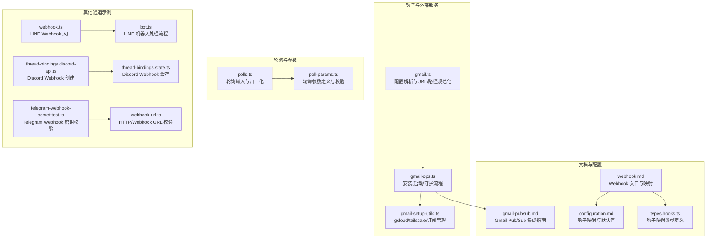
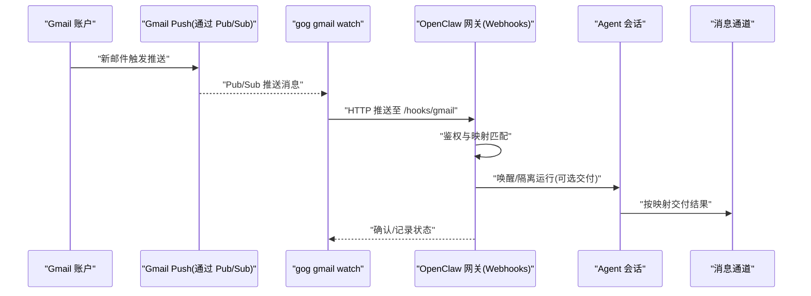
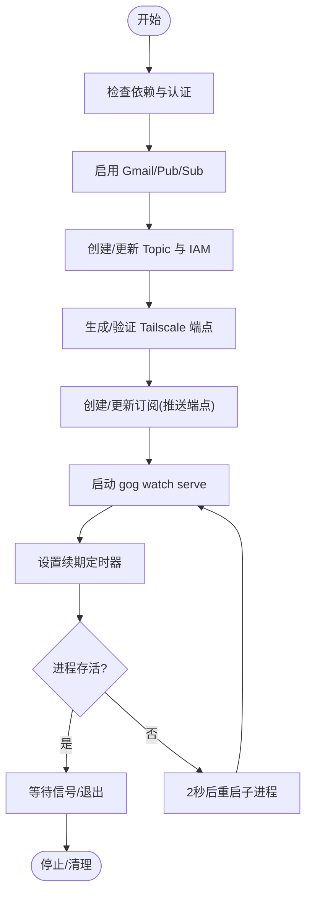
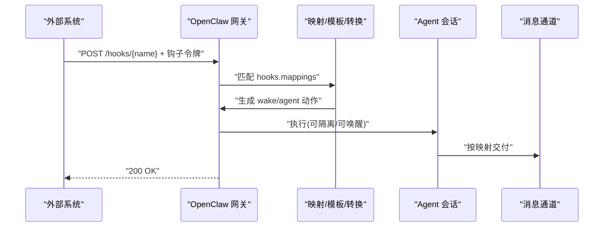
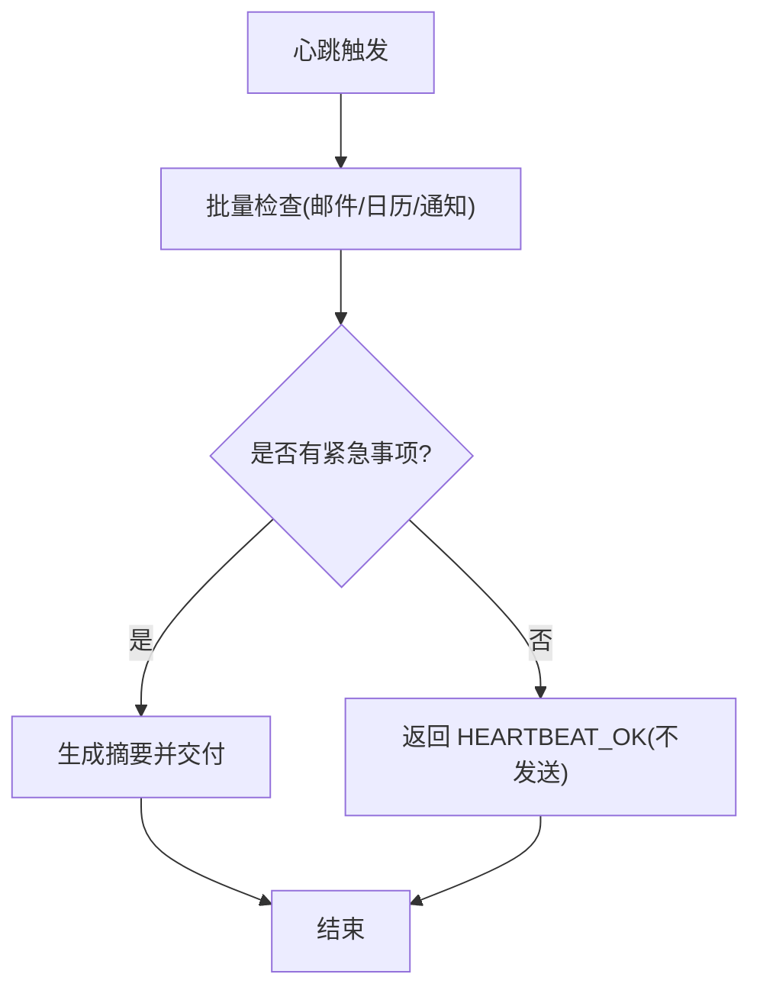
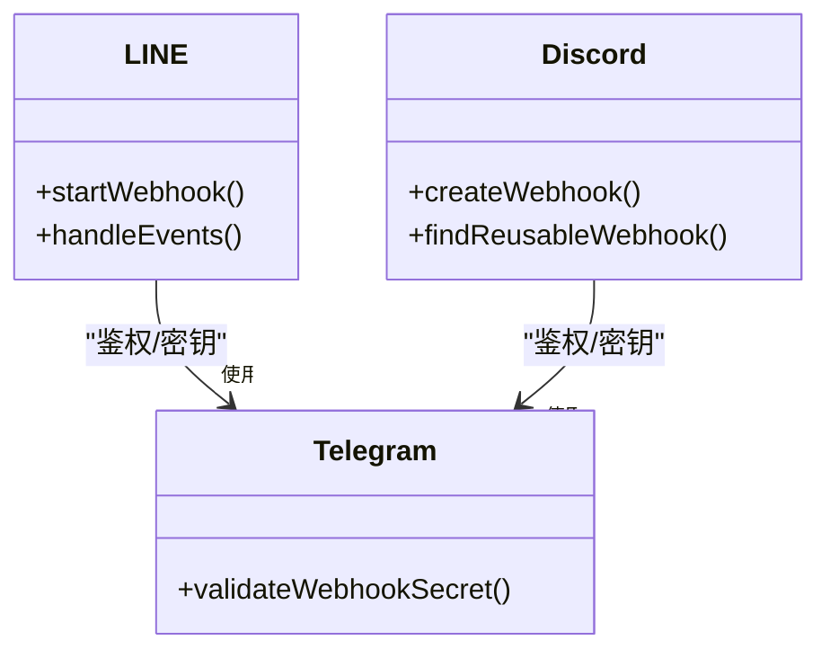
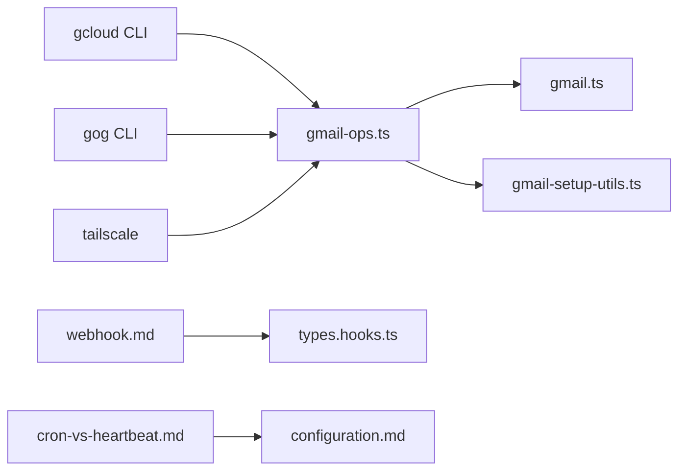

# 外部服务集成

<cite>
**本文引用的文件**
- [gmail.ts](file://src/hooks/gmail.ts)
- [gmail-ops.ts](file://src/hooks/gmail-ops.ts)
- [gmail-setup-utils.ts](file://src/hooks/gmail-setup-utils.ts)
- [gmail-pubsub.md](file://docs/automation/gmail-pubsub.md)
- [webhook.md](file://docs/automation/webhook.md)
- [configuration.md](file://docs/zh-CN/gateway/configuration.md)
- [cron-vs-heartbeat.md](file://docs/automation/cron-vs-heartbeat.md)
- [types.hooks.ts](file://src/config/types.hooks.ts)
- [polls.ts](file://src/polls.ts)
- [poll-params.ts](file://src/poll-params.ts)
- [webhook.ts](file://src/line/webhook.ts)
- [bot.ts](file://src/line/bot.ts)
- [thread-bindings.discord-api.ts](file://src/discord/monitor/thread-bindings.discord-api.ts)
- [thread-bindings.state.ts](file://src/discord/monitor/thread-bindings.state.ts)
- [telegram-webhook-secret.test.ts](file://src/config/telegram-webhook-secret.test.ts)
- [webhook-url.ts](file://src/cron/webhook-url.ts)
</cite>

## 目录
1. [简介](#简介)
2. [项目结构](#项目结构)
3. [核心组件](#核心组件)
4. [架构总览](#架构总览)
5. [详细组件分析](#详细组件分析)
6. [依赖关系分析](#依赖关系分析)
7. [性能考量](#性能考量)
8. [故障排查指南](#故障排查指南)
9. [结论](#结论)
10. [附录](#附录)

## 简介
本文件面向需要在 OpenClaw 中集成外部服务的工程师与运维人员，系统化阐述以下内容：
- 与外部服务的集成方式与实现机制：包括 Google Cloud Pub/Sub 推送、轮询机制、以及通过 Webhook 的通用接入。
- Gmail Pub/Sub 集成的完整配置与使用流程：订阅创建、消息处理、错误恢复与清理。
- 轮询机制的实现原理与适用场景：轮询间隔、超时处理与并发控制。
- 各类外部服务集成的配置示例与最佳实践：安全、性能优化与故障处理策略。
- 如何扩展新的外部服务集成与自定义集成方案。

## 项目结构
围绕外部服务集成的关键目录与文件：
- 钩子与外部服务集成入口：src/hooks 下的 Gmail 集成工具链与配置解析。
- 文档：docs/automation 与 docs/zh-CN 下的 Gmail Pub/Sub、Webhook、心跳与配置参考。
- 公共钩子类型与映射：src/config/types.hooks.ts。
- 轮询与参数解析：src/polls.ts、src/poll-params.ts。
- 其他通道的 Webhook 示例：LINE、Discord 等。

**图表来源**
- [gmail.ts](file://src/hooks/gmail.ts#L1-L272)
- [gmail-ops.ts](file://src/hooks/gmail-ops.ts#L1-L374)
- [gmail-setup-utils.ts](file://src/hooks/gmail-setup-utils.ts#L1-L384)
- [gmail-pubsub.md](file://docs/automation/gmail-pubsub.md#L1-L257)
- [webhook.md](file://docs/automation/webhook.md#L1-L216)
- [configuration.md](file://docs/zh-CN/gateway/configuration.md#L3107-L3144)
- [types.hooks.ts](file://src/config/types.hooks.ts#L1-L44)
- [polls.ts](file://src/polls.ts#L1-L101)
- [poll-params.ts](file://src/poll-params.ts#L1-L90)
- [webhook.ts](file://src/line/webhook.ts#L79-L116)
- [bot.ts](file://src/line/bot.ts#L38-L83)
- [thread-bindings.discord-api.ts](file://src/discord/monitor/thread-bindings.discord-api.ts#L157-L218)
- [thread-bindings.state.ts](file://src/discord/monitor/thread-bindings.state.ts#L323-L360)
- [telegram-webhook-secret.test.ts](file://src/config/telegram-webhook-secret.test.ts#L43-L96)
- [webhook-url.ts](file://src/cron/webhook-url.ts#L1-L22)

**章节来源**
- [gmail.ts](file://src/hooks/gmail.ts#L1-L272)
- [gmail-ops.ts](file://src/hooks/gmail-ops.ts#L1-L374)
- [gmail-setup-utils.ts](file://src/hooks/gmail-setup-utils.ts#L1-L384)
- [gmail-pubsub.md](file://docs/automation/gmail-pubsub.md#L1-L257)
- [webhook.md](file://docs/automation/webhook.md#L1-L216)
- [configuration.md](file://docs/zh-CN/gateway/configuration.md#L3107-L3144)
- [types.hooks.ts](file://src/config/types.hooks.ts#L1-L44)
- [polls.ts](file://src/polls.ts#L1-L101)
- [poll-params.ts](file://src/poll-params.ts#L1-L90)
- [webhook.ts](file://src/line/webhook.ts#L79-L116)
- [bot.ts](file://src/line/bot.ts#L38-L83)
- [thread-bindings.discord-api.ts](file://src/discord/monitor/thread-bindings.discord-api.ts#L157-L218)
- [thread-bindings.state.ts](file://src/discord/monitor/thread-bindings.state.ts#L323-L360)
- [telegram-webhook-secret.test.ts](file://src/config/telegram-webhook-secret.test.ts#L43-L96)
- [webhook-url.ts](file://src/cron/webhook-url.ts#L1-L22)

## 核心组件
- Gmail Pub/Sub 集成
  - 配置解析与默认值：账户、主题、订阅、推送令牌、钩子令牌、钩子 URL、是否包含正文、最大字节数、轮询续期周期、监听绑定与端口、路径、Tailscale 模式与路径等。
  - 安装与启动：自动检查依赖、GCP 认证、启用服务、创建/更新 Topic 与订阅、生成/验证 Tailscale 公网端点、启动 gog watch serve 并按周期续期。
  - 错误恢复：进程退出自动重启、定时续期、失败日志输出。
- Webhook 入口与映射
  - 提供 /hooks/wake、/hooks/agent 与自定义映射端点，支持令牌鉴权、会话键策略、交付目标与模型覆盖。
  - 支持通过映射进行 payload 转换与模板渲染，实现“唤醒”或“隔离 Agent 运行”两种动作。
- 轮询机制
  - 通过心跳（heartbeat）聚合多源检查，减少 API 调用次数，提升上下文连续性与自然节律。
  - 与 Cron 的对比：批量检查、降低开销、上下文感知、智能抑制。
- 其他通道示例
  - LINE：基于 Channel Secret 的 Webhook 入口与事件处理。
  - Discord：Webhook 创建与缓存复用，避免重复创建。
  - Telegram：Webhook URL 与密钥的配置校验。

**章节来源**
- [gmail.ts](file://src/hooks/gmail.ts#L19-L206)
- [gmail-ops.ts](file://src/hooks/gmail-ops.ts#L78-L374)
- [gmail-setup-utils.ts](file://src/hooks/gmail-setup-utils.ts#L158-L316)
- [webhook.md](file://docs/automation/webhook.md#L13-L216)
- [configuration.md](file://docs/zh-CN/gateway/configuration.md#L3107-L3144)
- [cron-vs-heartbeat.md](file://docs/automation/cron-vs-heartbeat.md#L29-L71)
- [webhook.ts](file://src/line/webhook.ts#L79-L116)
- [bot.ts](file://src/line/bot.ts#L38-L83)
- [thread-bindings.discord-api.ts](file://src/discord/monitor/thread-bindings.discord-api.ts#L157-L218)
- [thread-bindings.state.ts](file://src/discord/monitor/thread-bindings.state.ts#L323-L360)
- [telegram-webhook-secret.test.ts](file://src/config/telegram-webhook-secret.test.ts#L43-L96)

## 架构总览
下图展示 Gmail Pub/Sub -> gog watch serve -> OpenClaw Webhooks 的端到端流程，以及与心跳、轮询的关系。

**图表来源**
- [gmail-pubsub.md](file://docs/automation/gmail-pubsub.md#L9-L21)
- [gmail-ops.ts](file://src/hooks/gmail-ops.ts#L271-L374)
- [webhook.md](file://docs/automation/webhook.md#L42-L96)

## 详细组件分析

### Gmail Pub/Sub 集成
- 配置解析与默认值
  - 关键字段：账户、标签、主题、订阅、推送令牌、钩子令牌、钩子 URL、是否包含正文、最大字节数、轮询续期分钟数、监听绑定与端口、路径、Tailscale 模式与路径。
  - 路径规范化：支持根路径“/”与带前缀路径，Tailscale 场景下自动调整监听路径与公网路径。
- 安装与启动
  - 依赖检查：gcloud、gog、tailscale（按需）。
  - GCP 认证：若未登录则引导登录。
  - 服务启用：Gmail 与 Pub/Sub。
  - Topic/订阅：创建或更新 IAM 绑定，确保 Publisher 角色。
  - Tailscale 端点：根据模式生成公网 URL，并注入 token。
  - 启动 gog watch serve 并按周期续期 watch。
- 错误恢复
  - 子进程退出自动 2 秒后重启。
  - 定时器周期性调用 startGmailWatch，保证 watch 持续有效。
  - 失败时输出错误日志，不中断整体流程。

**图表来源**
- [gmail-ops.ts](file://src/hooks/gmail-ops.ts#L78-L374)
- [gmail-setup-utils.ts](file://src/hooks/gmail-setup-utils.ts#L158-L316)

**章节来源**
- [gmail.ts](file://src/hooks/gmail.ts#L19-L206)
- [gmail-ops.ts](file://src/hooks/gmail-ops.ts#L78-L374)
- [gmail-setup-utils.ts](file://src/hooks/gmail-setup-utils.ts#L158-L316)
- [gmail-pubsub.md](file://docs/automation/gmail-pubsub.md#L93-L200)

### Webhook 入口与映射
- 端点与鉴权
  - /hooks/wake：系统事件入队，可立即触发心跳。
  - /hooks/agent：隔离 Agent 运行，汇总到主会话，可选择交付到指定通道。
  - 自定义映射：通过 hooks.mappings 将任意 payload 转换为 wake/agent 行为，支持模板与 JS/TS 转换模块。
- 令牌与安全
  - 仅支持 Authorization Bearer 或 x-openclaw-token，拒绝查询字符串 token。
  - 支持会话键策略：默认禁止请求覆盖，可限制前缀。
  - 默认对不可信外部内容进行安全边界包裹，必要时可在映射中禁用（危险）。
- 映射与默认值
  - 支持 agentId、channel、to、model、thinking、timeoutSeconds 等覆盖项。
  - 配置参考：hooks.gmail 的默认值与路径建议。

**图表来源**
- [webhook.md](file://docs/automation/webhook.md#L42-L157)
- [configuration.md](file://docs/zh-CN/gateway/configuration.md#L3107-L3144)
- [types.hooks.ts](file://src/config/types.hooks.ts#L1-L44)

**章节来源**
- [webhook.md](file://docs/automation/webhook.md#L13-L216)
- [configuration.md](file://docs/zh-CN/gateway/configuration.md#L3107-L3144)
- [types.hooks.ts](file://src/config/types.hooks.ts#L1-L44)

### 轮询机制与心跳
- 心跳优势
  - 批量检查多个数据源，减少 API 调用成本。
  - 上下文感知与自然节律，智能抑制无须通知的情况。
- 适用场景
  - 多源监控（邮件、日历、通知等）合并为一次 Agent 运行。
  - 需要会话连续性的场景。
- 实现要点
  - 通过 agents.defaults.heartbeat 配置周期、活跃时段与目标。
  - 与 Cron 的对比：批量、低开销、上下文友好。

**图表来源**
- [cron-vs-heartbeat.md](file://docs/automation/cron-vs-heartbeat.md#L29-L71)

**章节来源**
- [cron-vs-heartbeat.md](file://docs/automation/cron-vs-heartbeat.md#L29-L71)

### 其他通道集成示例
- LINE
  - 通过 Channel Secret 初始化 Webhook，事件进入处理流程。
- Discord
  - 创建 Webhook 并缓存复用，避免重复创建。
- Telegram
  - 校验账户级 webhookUrl 与 webhookSecret 的组合，确保安全。

**图表来源**
- [webhook.ts](file://src/line/webhook.ts#L79-L116)
- [bot.ts](file://src/line/bot.ts#L38-L83)
- [thread-bindings.discord-api.ts](file://src/discord/monitor/thread-bindings.discord-api.ts#L157-L218)
- [thread-bindings.state.ts](file://src/discord/monitor/thread-bindings.state.ts#L323-L360)
- [telegram-webhook-secret.test.ts](file://src/config/telegram-webhook-secret.test.ts#L43-L96)

**章节来源**
- [webhook.ts](file://src/line/webhook.ts#L79-L116)
- [bot.ts](file://src/line/bot.ts#L38-L83)
- [thread-bindings.discord-api.ts](file://src/discord/monitor/thread-bindings.discord-api.ts#L157-L218)
- [thread-bindings.state.ts](file://src/discord/monitor/thread-bindings.state.ts#L323-L360)
- [telegram-webhook-secret.test.ts](file://src/config/telegram-webhook-secret.test.ts#L43-L96)

## 依赖关系分析
- Gmail Pub/Sub 集成依赖
  - gcloud：认证与服务启用、Topic/订阅管理。
  - gog：启动/续期 watch 与推送服务。
  - tailscale：公网端点与路径转发（可选）。
- Webhook 依赖
  - 钩子令牌与会话键策略。
  - 映射与转换模块（可选）。
- 轮询与心跳
  - 与 agents.defaults.heartbeat 配置耦合。

**图表来源**
- [gmail-ops.ts](file://src/hooks/gmail-ops.ts#L78-L269)
- [gmail-setup-utils.ts](file://src/hooks/gmail-setup-utils.ts#L158-L316)
- [gmail.ts](file://src/hooks/gmail.ts#L100-L206)
- [webhook.md](file://docs/automation/webhook.md#L13-L216)
- [types.hooks.ts](file://src/config/types.hooks.ts#L1-L44)
- [cron-vs-heartbeat.md](file://docs/automation/cron-vs-heartbeat.md#L29-L71)
- [configuration.md](file://docs/zh-CN/gateway/configuration.md#L3107-L3144)

**章节来源**
- [gmail-ops.ts](file://src/hooks/gmail-ops.ts#L78-L269)
- [gmail-setup-utils.ts](file://src/hooks/gmail-setup-utils.ts#L158-L316)
- [gmail.ts](file://src/hooks/gmail.ts#L100-L206)
- [webhook.md](file://docs/automation/webhook.md#L13-L216)
- [types.hooks.ts](file://src/config/types.hooks.ts#L1-L44)
- [cron-vs-heartbeat.md](file://docs/automation/cron-vs-heartbeat.md#L29-L71)
- [configuration.md](file://docs/zh-CN/gateway/configuration.md#L3107-L3144)

## 性能考量
- 减少 API 调用
  - 使用心跳聚合多源检查，避免多个独立 Cron 任务。
- 降低网络与计算开销
  - Gmail Pub/Sub 推送替代轮询，显著降低轮询频率与资源消耗。
- 会话与上下文
  - 心跳共享同一会话，便于上下文延续与自然跟进。
- 资源保护
  - 令牌鉴权、路径白名单、会话键前缀限制、默认安全边界包裹。

[本节为通用指导，无需具体文件分析]

## 故障排查指南
- Gmail Pub/Sub
  - 常见问题：Topic 所属项目与 OAuth 客户端项目不一致、缺少 Publisher 权限、仅收到 historyId 需要通过 gog history 获取详情。
  - 清理命令：停止 watch、删除订阅、删除 Topic。
- Webhook
  - 鉴权失败：检查 Authorization Bearer 或 x-openclaw-token 是否正确。
  - 超大负载：注意 413 状态码，适当降低 include-body 与 max-bytes。
  - 会话键策略：默认不允许请求覆盖，如需开启请设置 allowRequestSessionKey 并限制前缀。
- 通道集成
  - LINE：确认 Channel Secret 正确。
  - Discord：检查 Webhook 创建与缓存复用逻辑。
  - Telegram：确认 webhookUrl 与 webhookSecret 组合有效。

**章节来源**
- [gmail-pubsub.md](file://docs/automation/gmail-pubsub.md#L244-L256)
- [webhook.md](file://docs/automation/webhook.md#L204-L216)
- [webhook.ts](file://src/line/webhook.ts#L79-L116)
- [thread-bindings.discord-api.ts](file://src/discord/monitor/thread-bindings.discord-api.ts#L157-L218)
- [telegram-webhook-secret.test.ts](file://src/config/telegram-webhook-secret.test.ts#L43-L96)

## 结论
OpenClaw 提供了统一的外部服务集成框架：以 Webhook 作为通用入口，结合 Gmail Pub/Sub 推送与心跳/轮询机制，实现高可用、低开销且具备上下文感知的消息处理与自动化。通过严格的鉴权、会话键策略与安全边界包裹，保障集成的安全性与稳定性。对于新服务，推荐遵循现有映射与转换模式，快速完成对接与扩展。

[本节为总结，无需具体文件分析]

## 附录
- 配置示例与最佳实践
  - Gmail Pub/Sub：使用 openclaw webhooks gmail setup 一键配置，启用 hooks.gmail.preset 并设置映射交付到目标通道。
  - Webhook：启用 hooks.enabled 与 hooks.token，合理设置 hooks.defaultSessionKey 与 allowedSessionKeyPrefixes。
  - 心跳：在 agents.defaults.heartbeat 中设置周期与活跃时段，优先使用心跳而非多任务 Cron。
- 扩展新外部服务
  - 新建映射：在 hooks.mappings 中定义 match、action、模板或 transform.module。
  - 自定义转换：在 hooks.transformsDir 下编写 TS/JS 模块，确保路径解析安全。
  - 通道适配：参考 LINE/Discord/Telegram 的鉴权与 Webhook 流程，统一接入。

**章节来源**
- [gmail-pubsub.md](file://docs/automation/gmail-pubsub.md#L22-L120)
- [webhook.md](file://docs/automation/webhook.md#L13-L157)
- [configuration.md](file://docs/zh-CN/gateway/configuration.md#L3107-L3144)
- [cron-vs-heartbeat.md](file://docs/automation/cron-vs-heartbeat.md#L29-L71)