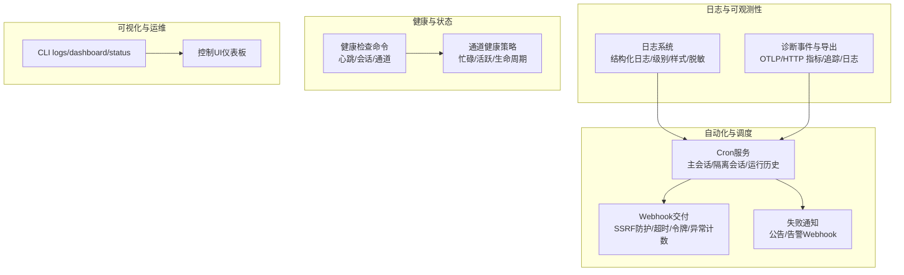
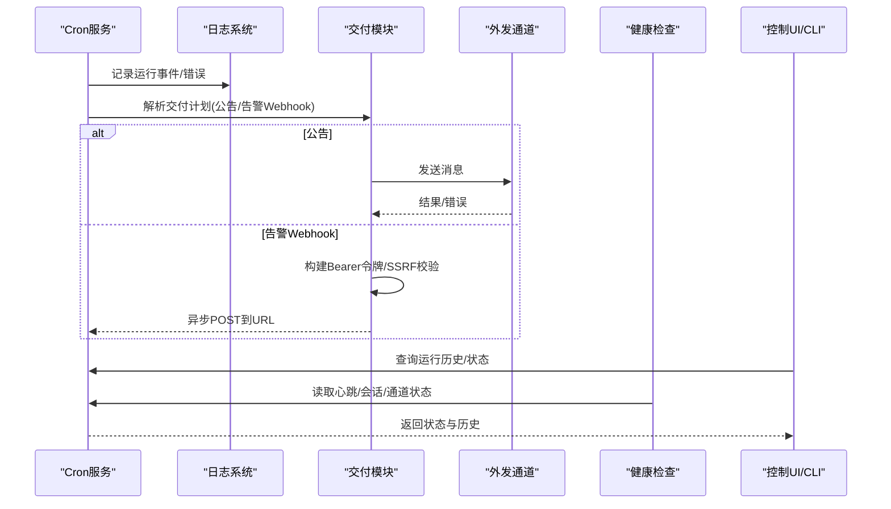
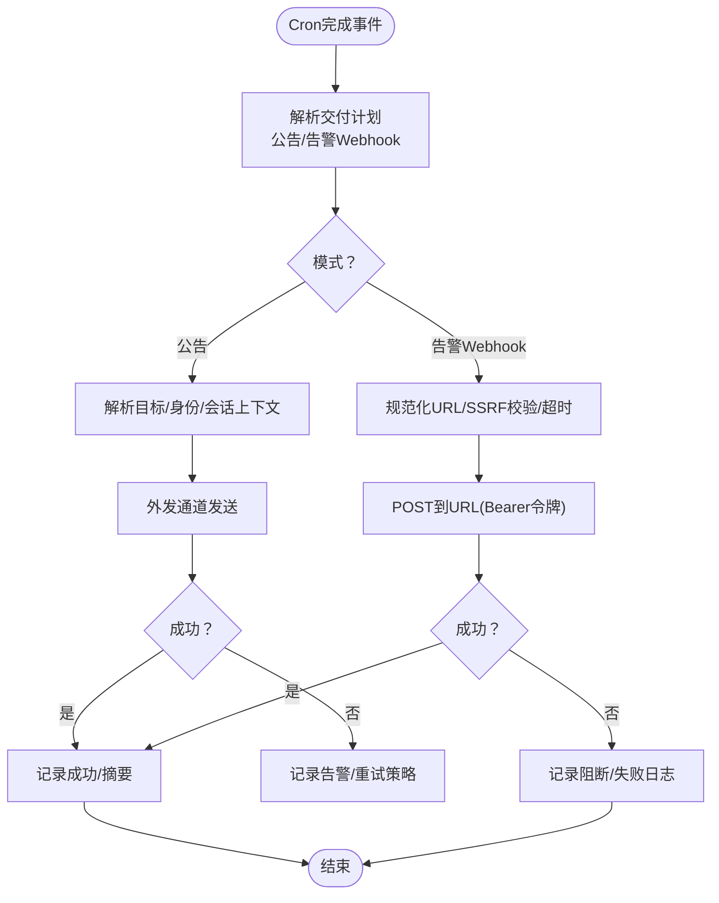
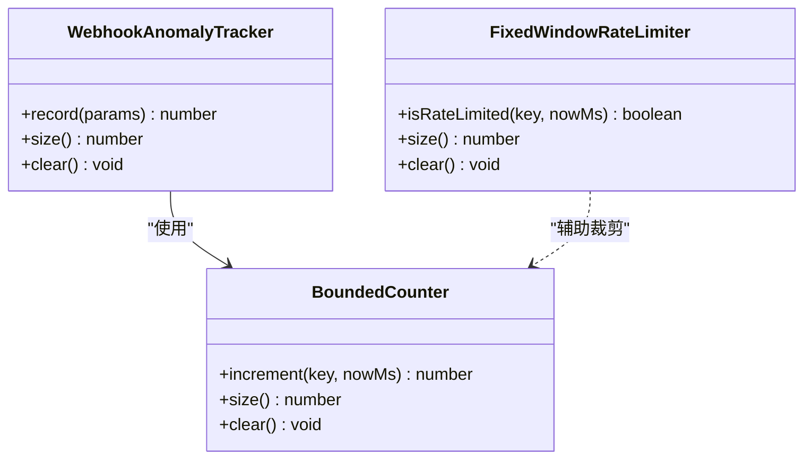
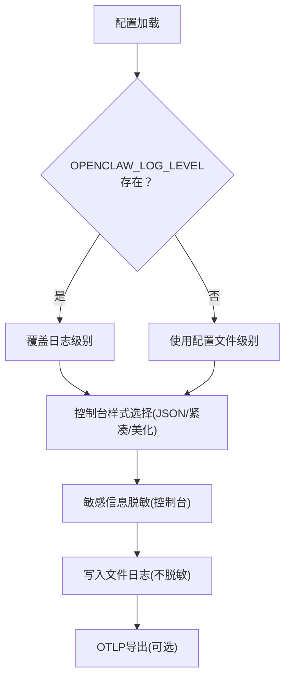
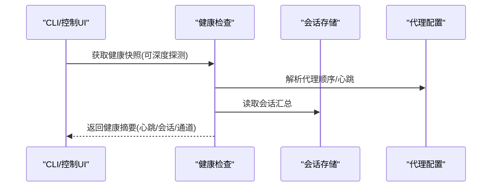
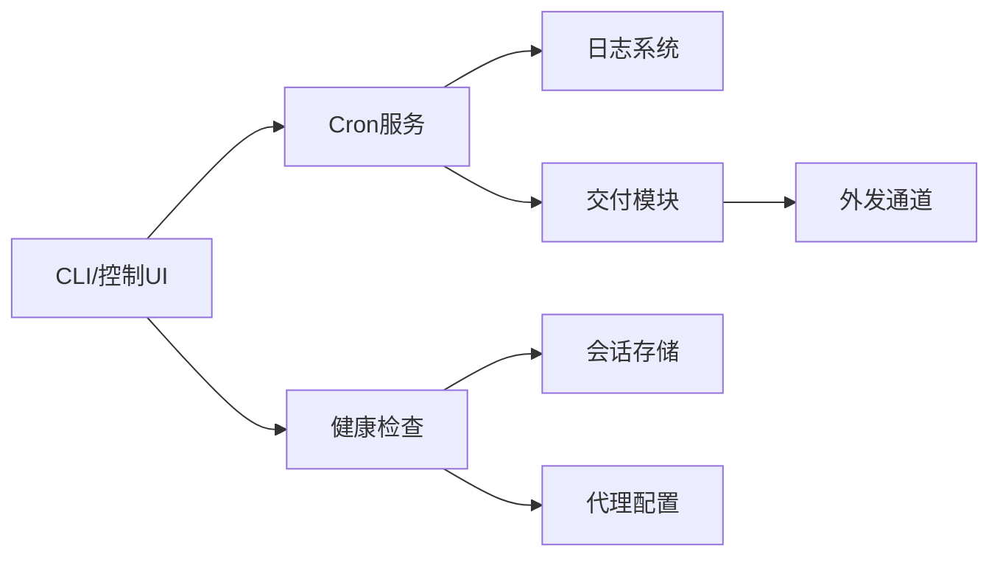

# 监控和日志

<cite>
**本文引用的文件**
- [docs/logging.md](file://docs/logging.md)
- [src/logging.ts](file://src/logging.ts)
- [src/gateway/server-cron.ts](file://src/gateway/server-cron.ts)
- [src/cron/delivery.ts](file://src/cron/delivery.ts)
- [src/plugin-sdk/webhook-memory-guards.ts](file://src/plugin-sdk/webhook-memory-guards.ts)
- [src/plugin-sdk/webhook-memory-guards.test.ts](file://src/plugin-sdk/webhook-memory-guards.test.ts)
- [src/cron/run-log.ts](file://src/cron/run-log.ts)
- [docs/automation/cron-jobs.md](file://docs/automation/cron-jobs.md)
- [src/commands/health.ts](file://src/commands/health.ts)
- [src/commands/status.command.ts](file://src/commands/status.command.ts)
- [src/gateway/channel-health-policy.ts](file://src/gateway/channel-health-policy.ts)
- [docs/web/dashboard.md](file://docs/web/dashboard.md)
- [docs/cli/dashboard.md](file://docs/cli/dashboard.md)
- [src/gateway/server.cron.test.ts](file://src/gateway/server.cron.test.ts)
- [src/cron/delivery.test.ts](file://src/cron/delivery.test.ts)
- [src/shared/usage-aggregates.ts](file://src/shared/usage-aggregates.ts)
</cite>

## 目录
1. [简介](#简介)
2. [项目结构](#项目结构)
3. [核心组件](#核心组件)
4. [架构总览](#架构总览)
5. [详细组件分析](#详细组件分析)
6. [依赖关系分析](#依赖关系分析)
7. [性能考量](#性能考量)
8. [故障排查指南](#故障排查指南)
9. [结论](#结论)
10. [附录](#附录)

## 简介
本文件面向OpenClaw自动化与集成系统的监控与日志，聚焦以下目标：
- 监控指标采集与分析：Webhook调用统计、Cron作业执行状态、钩子系统性能
- 日志记录最佳实践：日志级别、格式规范、敏感信息保护
- 健康检查机制与告警策略
- 故障诊断与问题排查方法
- 性能监控、资源使用与瓶颈分析工具与技巧
- 监控仪表板与告警规则配置建议
- 常见问题的诊断流程与解决方案

## 项目结构
OpenClaw的日志与监控涉及多个层面：
- 日志系统：统一的结构化日志记录与输出（文件与控制台），支持级别、样式与敏感信息脱敏
- Cron调度：内置任务调度器，支持主会话与隔离会话两种执行模式，具备运行历史记录与失败通知能力
- Webhook交付：对失败与异常进行限流与异常计数，避免噪声并保留关键信号
- 健康检查：通道健康评估、心跳与会话状态、队列深度与等待时间等
- 可视化与运维：CLI与控制UI用于打开仪表板、查看日志与状态

图示来源
- [src/logging.ts](file://src/logging.ts#L1-L70)
- [docs/logging.md](file://docs/logging.md#L1-L353)
- [src/gateway/server-cron.ts](file://src/gateway/server-cron.ts#L1-L506)
- [src/cron/delivery.ts](file://src/cron/delivery.ts#L1-L302)
- [src/plugin-sdk/webhook-memory-guards.ts](file://src/plugin-sdk/webhook-memory-guards.ts#L1-L197)
- [src/commands/health.ts](file://src/commands/health.ts#L252-L375)
- [src/gateway/channel-health-policy.ts](file://src/gateway/channel-health-policy.ts#L57-L81)
- [docs/web/dashboard.md](file://docs/web/dashboard.md#L1-L53)
- [docs/cli/dashboard.md](file://docs/cli/dashboard.md#L1-L23)

章节来源
- [docs/logging.md](file://docs/logging.md#L1-L353)
- [src/logging.ts](file://src/logging.ts#L1-L70)

## 核心组件
- 日志系统与配置
  - 文件日志（JSON Lines）与控制台输出，支持级别、样式与敏感信息脱敏
  - 通过环境变量与配置文件覆盖日志级别与输出样式
  - 支持诊断事件（OTLP/HTTP）导出，便于接入外部监控系统
- Cron调度与运行日志
  - 主会话与隔离会话两种执行路径；运行历史以JSONL记录，支持裁剪与保留策略
  - 失败通知可选择公告或Webhook；Webhook模式支持Bearer令牌与SSRF防护
- Webhook交付与异常检测
  - 固定窗口限流与有界计数器，配合异常状态码计数与周期性日志
  - 针对4xx/5xx等异常状态进行阈值报警，降低噪声
- 健康检查与状态
  - 心跳、会话、通道健康评估，支持忙碌/活跃/生命周期判断
  - CLI与控制UI提供快速访问与状态展示

章节来源
- [docs/logging.md](file://docs/logging.md#L100-L353)
- [src/gateway/server-cron.ts](file://src/gateway/server-cron.ts#L39-L407)
- [src/cron/delivery.ts](file://src/cron/delivery.ts#L1-L302)
- [src/plugin-sdk/webhook-memory-guards.ts](file://src/plugin-sdk/webhook-memory-guards.ts#L1-L197)
- [src/commands/health.ts](file://src/commands/health.ts#L252-L375)
- [src/gateway/channel-health-policy.ts](file://src/gateway/channel-health-policy.ts#L57-L81)

## 架构总览
下图展示了日志、Cron、Webhook与健康检查之间的交互关系。

图示来源
- [src/gateway/server-cron.ts](file://src/gateway/server-cron.ts#L298-L470)
- [src/cron/delivery.ts](file://src/cron/delivery.ts#L238-L302)
- [src/commands/health.ts](file://src/commands/health.ts#L348-L375)
- [docs/web/dashboard.md](file://docs/web/dashboard.md#L1-L53)

## 详细组件分析

### 组件A：Cron作业与Webhook交付
- 运行事件与失败通知
  - Cron完成事件触发后，解析交付目标（公告或Webhook）
  - 若为Webhook，进行URL规范化与SSRF防护，超时控制与错误分类（阻断/失败）
  - 失败目的地可按作业级优先于全局配置，且Webhook模式需提供有效URL
- 运行日志与裁剪
  - 每次完成后追加JSONL条目，支持按字节大小与行数裁剪
  - 会话保留策略可配置，默认保留24小时，可禁用
- 测试与兼容
  - 单元测试覆盖Webhook投递、失败目的地合并与最佳努力交付
  - 兼容旧版notify+cron.webhook回退，但建议迁移到per-job delivery.mode

图示来源
- [src/gateway/server-cron.ts](file://src/gateway/server-cron.ts#L358-L470)
- [src/cron/delivery.ts](file://src/cron/delivery.ts#L129-L209)
- [src/cron/run-log.ts](file://src/cron/run-log.ts#L1-L51)
- [src/gateway/server.cron.test.ts](file://src/gateway/server.cron.test.ts#L758-L810)
- [src/cron/delivery.test.ts](file://src/cron/delivery.test.ts#L89-L220)

章节来源
- [src/gateway/server-cron.ts](file://src/gateway/server-cron.ts#L39-L407)
- [src/cron/delivery.ts](file://src/cron/delivery.ts#L1-L302)
- [src/cron/run-log.ts](file://src/cron/run-log.ts#L1-L51)
- [src/gateway/server.cron.test.ts](file://src/gateway/server.cron.test.ts#L851-L875)
- [src/cron/delivery.test.ts](file://src/cron/delivery.test.ts#L89-L220)

### 组件B：Webhook异常检测与限流
- 固定窗口限流
  - 基于时间窗口与最大请求数，限制同一键的请求速率
- 有界计数器与TTL
  - 对异常状态码进行计数，支持TTL过期与最大键数量裁剪
- 异常追踪器
  - 仅对配置的异常状态码进行计数，按logEvery间隔输出日志，避免噪声
- 默认阈值
  - 窗口1分钟、最大120次、最多跟踪4096个键；异常状态码集合包含常见4xx/5xx

图示来源
- [src/plugin-sdk/webhook-memory-guards.ts](file://src/plugin-sdk/webhook-memory-guards.ts#L13-L196)
- [src/plugin-sdk/webhook-memory-guards.test.ts](file://src/plugin-sdk/webhook-memory-guards.test.ts#L98-L153)

章节来源
- [src/plugin-sdk/webhook-memory-guards.ts](file://src/plugin-sdk/webhook-memory-guards.ts#L1-L197)
- [src/plugin-sdk/webhook-memory-guards.test.ts](file://src/plugin-sdk/webhook-memory-guards.test.ts#L98-L153)

### 组件C：日志系统与敏感信息保护
- 日志级别与样式
  - 文件日志与控制台日志分别配置级别；TTY环境自动美化输出
  - 支持JSON/紧凑/美化三种控制台样式
- 敏感信息脱敏
  - 控制台输出支持脱敏策略与正则模式覆盖
  - 文件日志不脱敏，便于审计与导入下游系统
- 环境变量与配置优先级
  - OPENCLAW_LOG_LEVEL可临时提升级别；CLI参数可覆盖环境变量
- 诊断事件与OTLP导出
  - 提供模型用量、消息流、队列与会话等事件类型
  - 支持OTLP/HTTP导出，可配置采样率与刷新间隔

图示来源
- [docs/logging.md](file://docs/logging.md#L116-L141)
- [docs/logging.md](file://docs/logging.md#L224-L346)
- [src/logging.ts](file://src/logging.ts#L1-L70)

章节来源
- [docs/logging.md](file://docs/logging.md#L100-L353)
- [src/logging.ts](file://src/logging.ts#L1-L70)

### 组件D：健康检查与状态
- 健康快照
  - 聚合代理心跳、会话与通道状态，支持深度探测
- 通道健康策略
  - 判断是否托管账户、是否运行中、是否忙碌、活跃生命周期等
- CLI与控制UI
  - 提供状态查询与仪表板入口，支持非令牌化URL与安全提示

图示来源
- [src/commands/health.ts](file://src/commands/health.ts#L348-L375)
- [src/commands/status.command.ts](file://src/commands/status.command.ts#L318-L358)
- [src/gateway/channel-health-policy.ts](file://src/gateway/channel-health-policy.ts#L57-L81)
- [docs/web/dashboard.md](file://docs/web/dashboard.md#L1-L53)
- [docs/cli/dashboard.md](file://docs/cli/dashboard.md#L1-L23)

章节来源
- [src/commands/health.ts](file://src/commands/health.ts#L252-L375)
- [src/commands/status.command.ts](file://src/commands/status.command.ts#L318-L358)
- [src/gateway/channel-health-policy.ts](file://src/gateway/channel-health-policy.ts#L57-L81)
- [docs/web/dashboard.md](file://docs/web/dashboard.md#L1-L53)
- [docs/cli/dashboard.md](file://docs/cli/dashboard.md#L1-L23)

## 依赖关系分析
- Cron服务依赖日志系统记录运行事件与错误
- Cron服务在失败时依赖交付模块进行公告或Webhook告警
- 交付模块依赖外发通道适配器与目标解析
- 健康检查依赖会话存储与代理配置
- CLI与控制UI依赖网关RPC接口获取状态与日志

图示来源
- [src/gateway/server-cron.ts](file://src/gateway/server-cron.ts#L1-L506)
- [src/cron/delivery.ts](file://src/cron/delivery.ts#L1-L302)
- [src/commands/health.ts](file://src/commands/health.ts#L252-L375)

章节来源
- [src/gateway/server-cron.ts](file://src/gateway/server-cron.ts#L1-L506)
- [src/cron/delivery.ts](file://src/cron/delivery.ts#L1-L302)
- [src/commands/health.ts](file://src/commands/health.ts#L252-L375)

## 性能考量
- Cron运行日志与会话清理
  - 使用runLog裁剪策略（maxBytes/keepLines）与sessionRetention（默认24h）控制IO与磁盘占用
  - 高频场景建议缩短保留窗口与限制日志规模
- Webhook异常检测
  - 通过固定窗口限流与异常计数器减少重复噪声，按logEvery控制日志频率
- 指标聚合
  - 提供延迟与用量聚合工具，便于生成趋势与报表

章节来源
- [docs/automation/cron-jobs.md](file://docs/automation/cron-jobs.md#L445-L522)
- [src/plugin-sdk/webhook-memory-guards.ts](file://src/plugin-sdk/webhook-memory-guards.ts#L25-L37)
- [src/shared/usage-aggregates.ts](file://src/shared/usage-aggregates.ts#L1-L66)

## 故障排查指南
- Gateway不可达
  - 使用doctor命令诊断；确认日志文件路径与权限
- 日志为空或级别过低
  - 提升logging.level至debug/trace；检查TTY/JSON/plain输出模式
- Cron作业未运行
  - 检查cron.enabled与OPENCLAW_SKIP_CRON；核对时区与表达式
  - 查看运行历史与失败原因（run-log）
- Webhook投递失败
  - 检查URL有效性与Bearer令牌；关注SSRF阻断与超时
  - 使用异常追踪器定位高频4xx/5xx状态码
- 告警Webhook未触发
  - 确认失败目的地配置（作业级优先于全局）；Webhook模式需提供URL
- 通道/会话异常
  - 使用健康检查命令与通道健康策略评估忙碌/活跃状态

章节来源
- [docs/logging.md](file://docs/logging.md#L347-L353)
- [docs/automation/cron-jobs.md](file://docs/automation/cron-jobs.md#L659-L686)
- [src/gateway/server-cron.ts](file://src/gateway/server-cron.ts#L302-L337)
- [src/cron/delivery.ts](file://src/cron/delivery.ts#L129-L209)

## 结论
OpenClaw提供了完善的日志与监控基础设施：统一的结构化日志、Cron运行历史、Webhook异常检测与告警、健康检查与可视化入口。通过合理配置日志级别与样式、启用OTLP导出、优化Cron运行日志与会话保留策略，并结合Webhook异常追踪器，可以实现对自动化系统运行状态的全面掌控与高效排障。

## 附录
- 监控仪表板与告警规则建议
  - 指标来源：OTLP导出的模型用量、消息流、队列与会话指标
  - 规则示例：Webhook错误率阈值、队列等待时间分位数、会话卡住次数、Cron失败率
  - 可视化：结合控制UI与CLI logs/status/dashboard进行多维观测
- 常用命令参考
  - 打开控制UI：openclaw dashboard
  - 实时日志：openclaw logs --follow
  - 状态与心跳：openclaw status
  - Cron运行历史：openclaw cron runs

章节来源
- [docs/web/dashboard.md](file://docs/web/dashboard.md#L1-L53)
- [docs/cli/dashboard.md](file://docs/cli/dashboard.md#L1-L23)
- [docs/logging.md](file://docs/logging.md#L347-L353)
- [docs/automation/cron-jobs.md](file://docs/automation/cron-jobs.md#L641-L652)