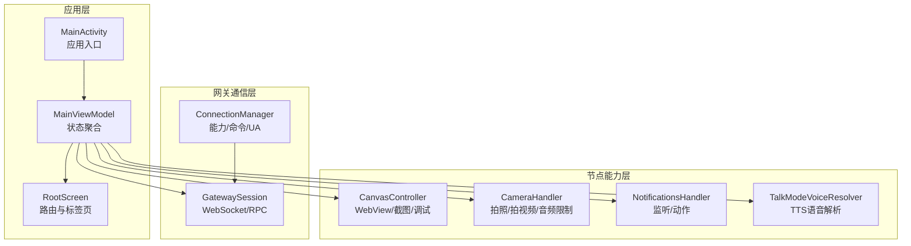
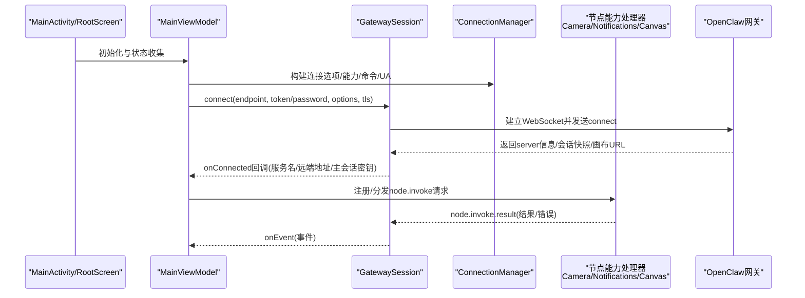
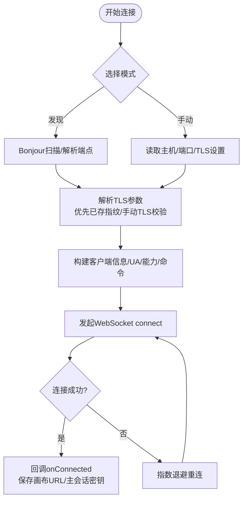
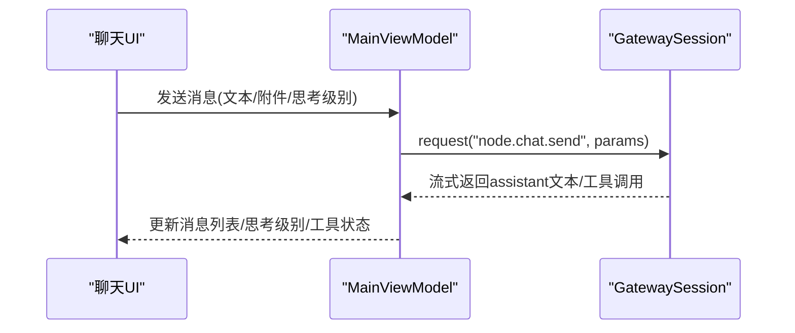
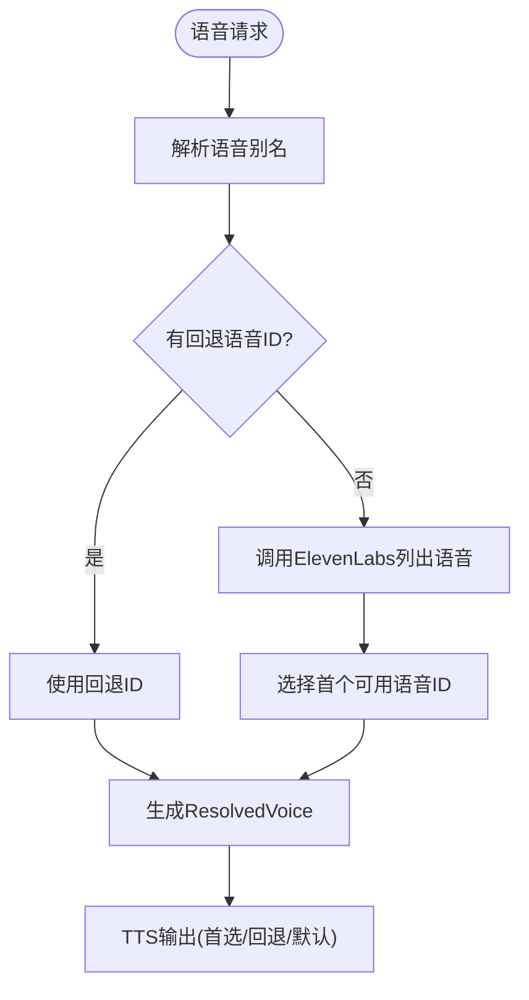
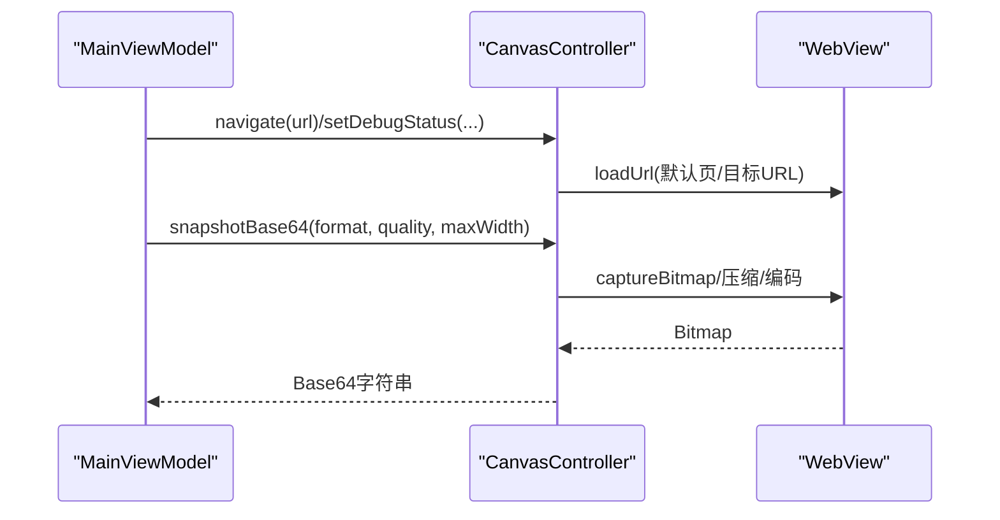
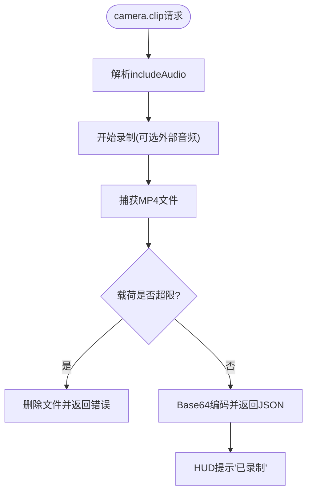
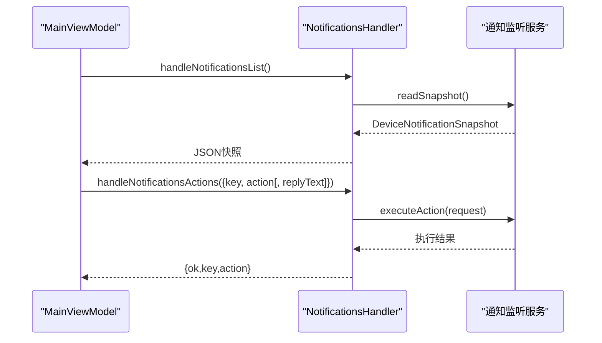
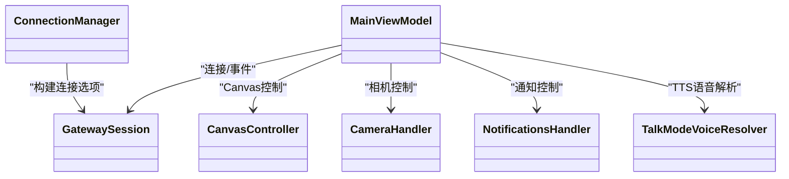

# Android节点

<cite>
**本文引用的文件**
- [apps/android/README.md](file://apps/android/README.md)
- [AndroidManifest.xml](file://apps/android/app/src/main/AndroidManifest.xml)
- [MainActivity.kt](file://apps/android/app/src/main/java/ai/openclaw/app/MainActivity.kt)
- [MainViewModel.kt](file://apps/android/app/src/main/java/ai/openclaw/app/MainViewModel.kt)
- [ConnectionManager.kt](file://apps/android/app/src/main/java/ai/openclaw/app/node/ConnectionManager.kt)
- [GatewaySession.kt](file://apps/android/app/src/main/java/ai/openclaw/app/gateway/GatewaySession.kt)
- [CanvasController.kt](file://apps/android/app/src/main/java/ai/openclaw/app/node/CanvasController.kt)
- [CameraHandler.kt](file://apps/android/app/src/main/java/ai/openclaw/app/node/CameraHandler.kt)
- [NotificationsHandler.kt](file://apps/android/app/src/main/java/ai/openclaw/app/node/NotificationsHandler.kt)
- [TalkModeVoiceResolver.kt](file://apps/android/app/src/main/java/ai/openclaw/app/voice/TalkModeVoiceResolver.kt)
- [RootScreen.kt](file://apps/android/app/src/main/java/ai/openclaw/app/ui/RootScreen.kt)
</cite>

## 目录
1. [简介](#简介)
2. [项目结构](#项目结构)
3. [核心组件](#核心组件)
4. [架构总览](#架构总览)
5. [详细组件分析](#详细组件分析)
6. [依赖关系分析](#依赖关系分析)
7. [性能考量](#性能考量)
8. [故障排除指南](#故障排除指南)
9. [结论](#结论)
10. [附录](#附录)

## 简介
本文件面向OpenClaw Android节点应用，系统化梳理其功能与实现：连接设置（发现/手动/配对）、聊天界面（流式渲染/会话管理）、语音功能（TTS/语音解析/唤醒词）、Canvas共享（WebView承载/截图/调试状态）、相机控制（拍照/拍视频/音频采集限制）、通知管理（监听/动作执行）、以及运行时权限与安全策略。文档同时提供安装部署、权限配置、安全设置、最佳实践、使用指南与二次开发指引。

## 项目结构
Android节点位于apps/android目录，采用Kotlin + Jetpack Compose实现，核心模块按职责拆分：
- 应用入口与生命周期：MainActivity、MainViewModel、RootScreen
- 网关通信：GatewaySession、ConnectionManager、设备认证存储
- 能力处理：CameraHandler、NotificationsHandler、CanvasController
- 语音能力：TalkModeVoiceResolver
- 权限与清单：AndroidManifest.xml

图表来源
- [MainActivity.kt](file://apps/android/app/src/main/java/ai/openclaw/app/MainActivity.kt#L1-L64)
- [MainViewModel.kt](file://apps/android/app/src/main/java/ai/openclaw/app/MainViewModel.kt#L1-L203)
- [RootScreen.kt](file://apps/android/app/src/main/java/ai/openclaw/app/ui/RootScreen.kt#L1-L21)
- [GatewaySession.kt](file://apps/android/app/src/main/java/ai/openclaw/app/gateway/GatewaySession.kt#L1-L761)
- [ConnectionManager.kt](file://apps/android/app/src/main/java/ai/openclaw/app/node/ConnectionManager.kt#L1-L157)
- [CanvasController.kt](file://apps/android/app/src/main/java/ai/openclaw/app/node/CanvasController.kt#L1-L273)
- [CameraHandler.kt](file://apps/android/app/src/main/java/ai/openclaw/app/node/CameraHandler.kt#L1-L176)
- [NotificationsHandler.kt](file://apps/android/app/src/main/java/ai/openclaw/app/node/NotificationsHandler.kt#L1-L162)
- [TalkModeVoiceResolver.kt](file://apps/android/app/src/main/java/ai/openclaw/app/voice/TalkModeVoiceResolver.kt#L1-L119)

章节来源
- [apps/android/README.md](file://apps/android/README.md#L1-L229)
- [AndroidManifest.xml](file://apps/android/app/src/main/AndroidManifest.xml#L1-L77)

## 核心组件
- 应用入口与UI
  - MainActivity负责启动前台服务、权限请求器绑定、保持屏幕常亮开关、Compose内容渲染。
  - MainViewModel聚合所有运行时状态（连接、Canvas、相机、短信、语音、聊天等），并暴露统一的交互接口。
  - RootScreen根据onboarding完成状态切换到引导或主标签页。
- 网关通信
  - GatewaySession封装WebSocket连接、RPC调用、事件分发、TLS参数处理、重连退避、node.invoke请求处理。
  - ConnectionManager生成客户端信息、用户代理、能力列表、命令列表，并基于运行时标志决定启用的能力。
- Canvas共享
  - CanvasController管理WebView加载URL/默认页、调试状态注入、JS执行、PNG/JPEG截图、尺寸缩放与质量控制。
- 相机与通知
  - CameraHandler负责设备枚举、拍照、拍视频（含音频开关与大小限制）、HUD提示与错误回传。
  - NotificationsHandler通过系统通知监听服务读取快照、执行打开/忽略/回复等动作。
- 语音
  - TalkModeVoiceResolver解析语音别名、选择首选/回退/默认语音ID，并可从ElevenLabs拉取可用语音列表。

章节来源
- [MainActivity.kt](file://apps/android/app/src/main/java/ai/openclaw/app/MainActivity.kt#L1-L64)
- [MainViewModel.kt](file://apps/android/app/src/main/java/ai/openclaw/app/MainViewModel.kt#L1-L203)
- [RootScreen.kt](file://apps/android/app/src/main/java/ai/openclaw/app/ui/RootScreen.kt#L1-L21)
- [GatewaySession.kt](file://apps/android/app/src/main/java/ai/openclaw/app/gateway/GatewaySession.kt#L1-L761)
- [ConnectionManager.kt](file://apps/android/app/src/main/java/ai/openclaw/app/node/ConnectionManager.kt#L1-L157)
- [CanvasController.kt](file://apps/android/app/src/main/java/ai/openclaw/app/node/CanvasController.kt#L1-L273)
- [CameraHandler.kt](file://apps/android/app/src/main/java/ai/openclaw/app/node/CameraHandler.kt#L1-L176)
- [NotificationsHandler.kt](file://apps/android/app/src/main/java/ai/openclaw/app/node/NotificationsHandler.kt#L1-L162)
- [TalkModeVoiceResolver.kt](file://apps/android/app/src/main/java/ai/openclaw/app/voice/TalkModeVoiceResolver.kt#L1-L119)

## 架构总览
下图展示从应用UI到网关通信、再到各节点能力处理的整体流程：

图表来源
- [MainActivity.kt](file://apps/android/app/src/main/java/ai/openclaw/app/MainActivity.kt#L1-L64)
- [MainViewModel.kt](file://apps/android/app/src/main/java/ai/openclaw/app/MainViewModel.kt#L1-L203)
- [GatewaySession.kt](file://apps/android/app/src/main/java/ai/openclaw/app/gateway/GatewaySession.kt#L1-L761)
- [ConnectionManager.kt](file://apps/android/app/src/main/java/ai/openclaw/app/node/ConnectionManager.kt#L1-L157)

## 详细组件分析

### 连接与配对（Connect/Pair）
- 支持两种模式：发现（Bonjour）与手动（主机/端口/TLS）。
- TLS指纹策略：优先使用已保存指纹；手动模式下若开启TLS则强制校验；发现模式下若存在TXT指纹则不视为权威，避免中间人风险。
- 用户代理与客户端信息：版本号、Android版本、SDK级别、设备型号等。
- 运行时标志：相机/定位/短信/语音唤醒/运动传感器等能力动态启用。

图表来源
- [ConnectionManager.kt](file://apps/android/app/src/main/java/ai/openclaw/app/node/ConnectionManager.kt#L1-L157)
- [GatewaySession.kt](file://apps/android/app/src/main/java/ai/openclaw/app/gateway/GatewaySession.kt#L1-L761)

章节来源
- [ConnectionManager.kt](file://apps/android/app/src/main/java/ai/openclaw/app/node/ConnectionManager.kt#L24-L156)
- [GatewaySession.kt](file://apps/android/app/src/main/java/ai/openclaw/app/gateway/GatewaySession.kt#L107-L138)

### 聊天界面（Chat UI）
- 流式渲染：支持助手文本流式更新、思考级别、工具调用挂起等。
- 会话管理：加载/刷新/切换/中止会话，携带附件与思考级别。
- 错误与健康：错误消息、健康状态、待处理运行计数。

图表来源
- [MainViewModel.kt](file://apps/android/app/src/main/java/ai/openclaw/app/MainViewModel.kt#L175-L201)
- [GatewaySession.kt](file://apps/android/app/src/main/java/ai/openclaw/app/gateway/GatewaySession.kt#L162-L174)

章节来源
- [MainViewModel.kt](file://apps/android/app/src/main/java/ai/openclaw/app/MainViewModel.kt#L64-L74)

### 语音功能（TTS/语音解析/唤醒词）
- 语音解析：TalkModeVoiceResolver支持别名解析、回退/默认语音ID选择、从ElevenLabs获取可用语音。
- 语音唤醒：与运行时标志联动，需具备录音权限才启用。
- TTS：结合语音解析结果，按首选/回退/默认语音ID输出。

图表来源
- [TalkModeVoiceResolver.kt](file://apps/android/app/src/main/java/ai/openclaw/app/voice/TalkModeVoiceResolver.kt#L1-L119)

章节来源
- [TalkModeVoiceResolver.kt](file://apps/android/app/src/main/java/ai/openclaw/app/voice/TalkModeVoiceResolver.kt#L23-L76)

### Canvas共享（WebView承载/截图/调试）
- WebView承载：默认加载内置scaffold页面，支持导航到指定URL；调试状态可通过JS注入显示标题/副标题。
- 截图能力：PNG/JPEG格式、质量控制、最大宽度缩放；支持Base64编码返回。
- 安全与路径：仅在Screen标签激活且WebView附加时生效；调试状态可开关。

图表来源
- [CanvasController.kt](file://apps/android/app/src/main/java/ai/openclaw/app/node/CanvasController.kt#L1-L273)

章节来源
- [CanvasController.kt](file://apps/android/app/src/main/java/ai/openclaw/app/node/CanvasController.kt#L55-L180)

### 相机控制（拍照/拍视频/音频限制）
- 设备枚举：返回设备ID/名称/朝向/类型。
- 拍照：HUD提示“拍照中”/“已拍照”，闪光灯触发，错误以HUD错误提示。
- 拍视频：支持includeAudio开关；限制最大载荷（超过阈值删除临时文件并报错）。
- 权限与日志：DEBUG构建下记录详细日志，便于问题定位。

图表来源
- [CameraHandler.kt](file://apps/android/app/src/main/java/ai/openclaw/app/node/CameraHandler.kt#L96-L154)

章节来源
- [CameraHandler.kt](file://apps/android/app/src/main/java/ai/openclaw/app/node/CameraHandler.kt#L58-L154)

### 通知管理（监听/动作）
- 快照读取：若未连接监听服务则尝试重新绑定；返回启用状态、连接状态与通知列表。
- 动作执行：支持open/dismiss/reply；reply需提供replyText。
- 错误处理：参数缺失或非法时返回INVALID_REQUEST；执行失败返回UNAVAILABLE。

图表来源
- [NotificationsHandler.kt](file://apps/android/app/src/main/java/ai/openclaw/app/node/NotificationsHandler.kt#L1-L162)

章节来源
- [NotificationsHandler.kt](file://apps/android/app/src/main/java/ai/openclaw/app/node/NotificationsHandler.kt#L49-L116)

### 权限与安全
- 清单权限：网络、前台服务、通知、WiFi设备发现、位置、相机、麦克风、短信、联系人、日历、运动识别、文件读取等。
- 运行时权限：在引导/设置流程中请求；相机/短信需在VM中绑定权限请求器。
- 安全强化：加密持久化（设备身份/令牌）、TLS指纹校验、生物识别锁（见README）。

章节来源
- [AndroidManifest.xml](file://apps/android/app/src/main/AndroidManifest.xml#L1-L77)
- [MainActivity.kt](file://apps/android/app/src/main/java/ai/openclaw/app/MainActivity.kt#L20-L29)
- [apps/android/README.md](file://apps/android/README.md#L165-L174)

## 依赖关系分析
- 组件耦合
  - MainViewModel作为状态中枢，向上承载UI，向下协调GatewaySession与各节点处理器。
  - GatewaySession与ConnectionManager强关联：前者负责连接与RPC，后者负责能力/命令/UA构建。
  - CanvasController、CameraHandler、NotificationsHandler均通过GatewaySession的node.invoke机制被调用。
- 外部依赖
  - OkHttp用于WebSocket连接与TLS配置。
  - Kotlinx Serialization用于JSON解析与序列化。
  - AndroidX Core/Compose用于UI与生命周期管理。

图表来源
- [MainViewModel.kt](file://apps/android/app/src/main/java/ai/openclaw/app/MainViewModel.kt#L1-L203)
- [GatewaySession.kt](file://apps/android/app/src/main/java/ai/openclaw/app/gateway/GatewaySession.kt#L1-L761)
- [ConnectionManager.kt](file://apps/android/app/src/main/java/ai/openclaw/app/node/ConnectionManager.kt#L1-L157)
- [CanvasController.kt](file://apps/android/app/src/main/java/ai/openclaw/app/node/CanvasController.kt#L1-L273)
- [CameraHandler.kt](file://apps/android/app/src/main/java/ai/openclaw/app/node/CameraHandler.kt#L1-L176)
- [NotificationsHandler.kt](file://apps/android/app/src/main/java/ai/openclaw/app/node/NotificationsHandler.kt#L1-L162)
- [TalkModeVoiceResolver.kt](file://apps/android/app/src/main/java/ai/openclaw/app/voice/TalkModeVoiceResolver.kt#L1-L119)

## 性能考量
- 启动与帧时序：提供宏基准与低噪声启动测量脚本，支持热区提取与对比。
- UI与WebView：截图采用绘制方式生成Bitmap，兼顾跨版本稳定性；缩放宽高避免过大内存占用。
- 网络与重连：WebSocket长连接，超时与Ping间隔合理配置；连接失败指数退避，避免频繁重试。
- 语音与相机：DEBUG日志便于定位卡顿；相机拍视频限制载荷上限，防止超大payload导致OOM。

章节来源
- [apps/android/README.md](file://apps/android/README.md#L59-L92)
- [CanvasController.kt](file://apps/android/app/src/main/java/ai/openclaw/app/node/CanvasController.kt#L182-L192)
- [GatewaySession.kt](file://apps/android/app/src/main/java/ai/openclaw/app/gateway/GatewaySession.kt#L290-L303)

## 故障排除指南
- 首次运行/配对失败
  - 在网关侧批准最新设备请求；确保应用处于前台且解锁。
- Canvas不可用
  - 确保网关启用了Canvas主机并可达；保持Screen标签页激活；必要时强制刷新能力。
- 连接异常
  - 检查TLS指纹策略与手动TLS设置；确认Bonjour扫描或手动主机/端口正确。
- 通知监听未就绪
  - 允许通知监听权限并确保服务已绑定；必要时重新绑定。
- 相机拍视频超限
  - 减少时长或降低质量；关注载荷上限提示并重试。

章节来源
- [apps/android/README.md](file://apps/android/README.md#L175-L224)

## 结论
OpenClaw Android节点以清晰的模块化架构实现了连接、聊天、语音、Canvas共享、相机与通知等核心能力。通过严格的TLS校验、运行时权限与前台服务保障、以及完善的错误处理与调试能力，为用户提供了稳定可靠的移动端体验。建议在生产环境中遵循权限最小化、安全默认值与持续监控的最佳实践。

## 附录

### 安装部署与构建
- 开发环境：Android Studio，Gradle构建。
- 构建与安装：提供Debug构建、测试与宏基准任务；支持ADB反向隧道进行USB-only测试。
- 热重载：Compose UI支持Live Edit；部分资源/非结构化代码变更可Apply Changes。

章节来源
- [apps/android/README.md](file://apps/android/README.md#L26-L141)

### 使用指南（设备配对、Canvas操作、语音触发）
- 配对流程：启动网关，应用Connect标签页，使用Setup Code或Manual模式，网关批准后即配对成功。
- Canvas操作：在Screen标签页加载目标URL或使用默认页；可设置调试状态；支持截图。
- 语音触发：启用语音唤醒（需录音权限）；TTS语音解析支持别名与回退策略。

章节来源
- [apps/android/README.md](file://apps/android/README.md#L143-L163)
- [CanvasController.kt](file://apps/android/app/src/main/java/ai/openclaw/app/node/CanvasController.kt#L67-L91)
- [TalkModeVoiceResolver.kt](file://apps/android/app/src/main/java/ai/openclaw/app/voice/TalkModeVoiceResolver.kt#L23-L76)