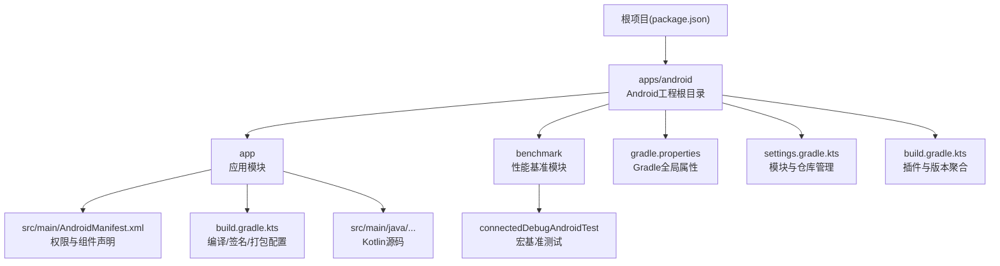
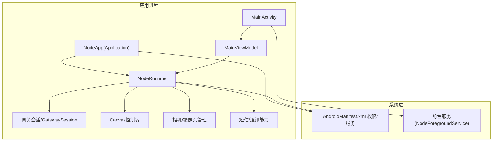
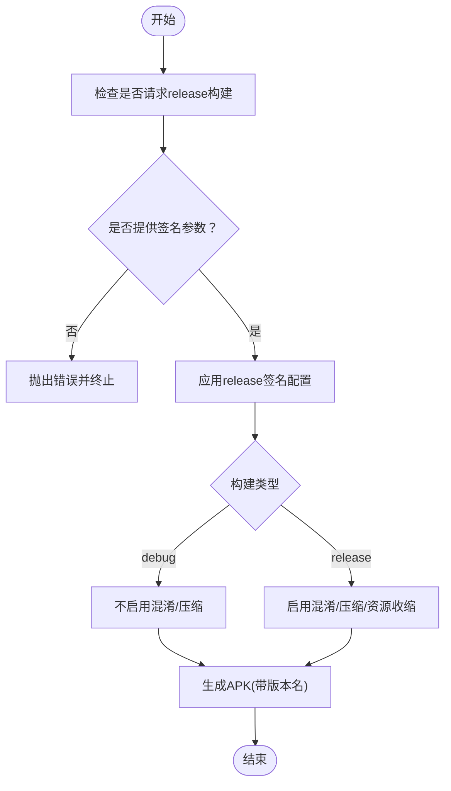
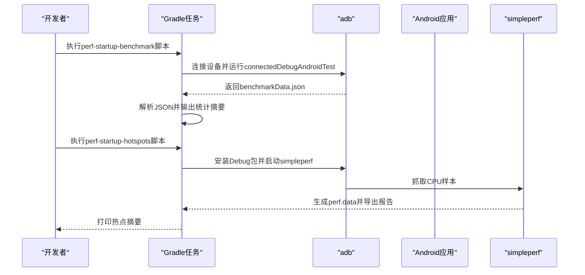
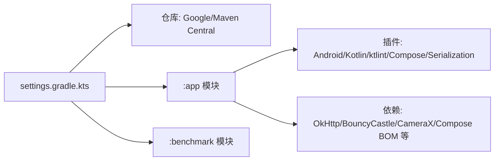

# 安装和配置

<cite>
**本文引用的文件**
- [apps/android/README.md](file://apps/android/README.md)
- [apps/android/build.gradle.kts](file://apps/android/build.gradle.kts)
- [apps/android/gradle.properties](file://apps/android/gradle.properties)
- [apps/android/settings.gradle.kts](file://apps/android/settings.gradle.kts)
- [apps/android/app/build.gradle.kts](file://apps/android/app/build.gradle.kts)
- [apps/android/app/src/main/AndroidManifest.xml](file://apps/android/app/src/main/AndroidManifest.xml)
- [apps/android/scripts/perf-startup-benchmark.sh](file://apps/android/scripts/perf-startup-benchmark.sh)
- [apps/android/scripts/perf-startup-hotspots.sh](file://apps/android/scripts/perf-startup-hotspots.sh)
- [package.json](file://package.json)
- [apps/android/app/src/main/java/ai/openclaw/app/MainActivity.kt](file://apps/android/app/src/main/java/ai/openclaw/app/MainActivity.kt)
- [apps/android/app/src/main/java/ai/openclaw/app/NodeApp.kt](file://apps/android/app/src/main/java/ai/openclaw/app/NodeApp.kt)
- [apps/android/app/src/main/java/ai/openclaw/app/MainViewModel.kt](file://apps/android/app/src/main/java/ai/openclaw/app/MainViewModel.kt)
</cite>

## 目录
1. [简介](#简介)
2. [项目结构](#项目结构)
3. [核心组件](#核心组件)
4. [架构总览](#架构总览)
5. [详细组件分析](#详细组件分析)
6. [依赖关系分析](#依赖关系分析)
7. [性能考虑](#性能考虑)
8. [故障排除指南](#故障排除指南)
9. [结论](#结论)
10. [附录](#附录)

## 简介
本文件面向在Android平台上部署与运行OpenClaw节点应用（Android App）的工程师与运维人员，提供从系统要求、开发环境准备、编译构建到安装运行的完整指南；同时覆盖构建变体、调试配置、发布设置、权限与安全、性能评测以及常见问题排查等主题，帮助您在生产环境中稳定地部署与维护该应用。

## 项目结构
OpenClaw仓库采用多平台与多模块组织方式，Android应用位于apps/android目录下，包含应用模块app、基准测试模块benchmark以及脚本工具。根目录通过package.json提供统一的脚本入口，便于在不同平台间复用命令。

图表来源
- [apps/android/README.md](file://apps/android/README.md#L1-L229)
- [apps/android/settings.gradle.kts](file://apps/android/settings.gradle.kts#L1-L20)
- [apps/android/build.gradle.kts](file://apps/android/build.gradle.kts#L1-L8)
- [apps/android/gradle.properties](file://apps/android/gradle.properties#L1-L10)
- [apps/android/app/build.gradle.kts](file://apps/android/app/build.gradle.kts#L1-L214)
- [apps/android/app/src/main/AndroidManifest.xml](file://apps/android/app/src/main/AndroidManifest.xml#L1-L77)

章节来源
- [apps/android/README.md](file://apps/android/README.md#L1-L229)
- [apps/android/settings.gradle.kts](file://apps/android/settings.gradle.kts#L1-L20)
- [apps/android/build.gradle.kts](file://apps/android/build.gradle.kts#L1-L8)
- [apps/android/gradle.properties](file://apps/android/gradle.properties#L1-L10)
- [apps/android/app/build.gradle.kts](file://apps/android/app/build.gradle.kts#L1-L214)
- [apps/android/app/src/main/AndroidManifest.xml](file://apps/android/app/src/main/AndroidManifest.xml#L1-L77)

## 核心组件
- 应用模块(app)：包含Android应用的源码、资源、清单与构建配置，负责UI、网关连接、节点能力调用、前台服务与权限处理。
- 基准模块(benchmark)：提供宏基准测试任务，用于冷启动与帧时序测量。
- 脚本工具：提供性能评测脚本，支持冷启动基准与热点分析。
- 根脚本入口(package.json)：统一提供android:*系列脚本，简化本地开发流程。

章节来源
- [apps/android/app/build.gradle.kts](file://apps/android/app/build.gradle.kts#L1-L214)
- [apps/android/app/src/main/AndroidManifest.xml](file://apps/android/app/src/main/AndroidManifest.xml#L1-L77)
- [apps/android/scripts/perf-startup-benchmark.sh](file://apps/android/scripts/perf-startup-benchmark.sh#L1-L125)
- [apps/android/scripts/perf-startup-hotspots.sh](file://apps/android/scripts/perf-startup-hotspots.sh#L1-L155)
- [package.json](file://package.json#L217-L334)

## 架构总览
Android应用采用Jetpack Compose进行UI开发，使用Kotlin协程与Material3组件库，并通过OkHttp与BouncyCastle等库实现网络与加密功能。应用在Application中初始化NodeRuntime，在MainActivity中启动前台服务并渲染根界面。清单文件声明了必要的权限与服务组件。

图表来源
- [apps/android/app/src/main/java/ai/openclaw/app/NodeApp.kt](file://apps/android/app/src/main/java/ai/openclaw/app/NodeApp.kt#L1-L27)
- [apps/android/app/src/main/java/ai/openclaw/app/MainActivity.kt](file://apps/android/app/src/main/java/ai/openclaw/app/MainActivity.kt#L1-L64)
- [apps/android/app/src/main/java/ai/openclaw/app/MainViewModel.kt](file://apps/android/app/src/main/java/ai/openclaw/app/MainViewModel.kt#L1-L203)
- [apps/android/app/src/main/AndroidManifest.xml](file://apps/android/app/src/main/AndroidManifest.xml#L1-L77)

## 详细组件分析

### 构建与打包配置
- 编译与目标版本：compileSdk/targetSdk为36，minSdk为31；Java/Kotlin编译目标为JDK 17。
- 构建变体：提供debug与release两种构建类型，默认关闭混淆；release开启混淆与资源收缩。
- 签名：release签名信息通过Gradle属性注入，若请求release构建但未提供签名参数则直接报错。
- 输出命名：根据版本名与构建类型生成输出APK文件名。
- 依赖管理：Compose BOM统一版本，依赖OkHttp、BouncyCastle、CameraX、dnsjava等库。
- Lint与格式化：启用ktlint并配置Android Lint规则，单元测试包含Android资源。

图表来源
- [apps/android/app/build.gradle.kts](file://apps/android/app/build.gradle.kts#L1-L214)

章节来源
- [apps/android/app/build.gradle.kts](file://apps/android/app/build.gradle.kts#L1-L214)

### 清单与权限
- 必需权限：网络访问、网络状态、前台服务、通知、Wi-Fi设备发现、位置、相机、录音、短信发送、媒体读取、联系人、日历、运动识别等。
- 可选硬件特性：相机与电话硬件非强制。
- 组件声明：前台服务、通知监听服务、FileProvider与主Activity。

章节来源
- [apps/android/app/src/main/AndroidManifest.xml](file://apps/android/app/src/main/AndroidManifest.xml#L1-L77)

### 运行与调试
- 在Android Studio中打开apps/android目录即可导入工程。
- 常用命令：构建Debug、安装Debug、运行单元测试、Android Lint、Kotlin格式化、宏基准测试。
- USB联调：启用开发者选项与USB调试，使用adb devices确认设备，通过脚本安装并启动应用。
- 热重载：支持Live Edit与Apply Changes，结构性变更需全量重装。

章节来源
- [apps/android/README.md](file://apps/android/README.md#L22-L142)
- [package.json](file://package.json#L217-L334)

### 性能评测与热点分析
- 冷启动宏基准：仅执行StartupMacrobenchmark的coldStartup，输出中位数/最小值/最大值/Coefficient of Variation，并可与历史快照对比。
- 启动热点分析：基于simpleperf抓取CPU样本，输出DSO与符号级热点，辅助定位启动阶段的热点路径。

图表来源
- [apps/android/scripts/perf-startup-benchmark.sh](file://apps/android/scripts/perf-startup-benchmark.sh#L1-L125)
- [apps/android/scripts/perf-startup-hotspots.sh](file://apps/android/scripts/perf-startup-hotspots.sh#L1-L155)

章节来源
- [apps/android/scripts/perf-startup-benchmark.sh](file://apps/android/scripts/perf-startup-benchmark.sh#L1-L125)
- [apps/android/scripts/perf-startup-hotspots.sh](file://apps/android/scripts/perf-startup-hotspots.sh#L1-L155)

### 网关连接与配对
- 启动本地网关并在应用Connect页面使用“设置码”或“手动模式”连接。
- 在网关侧批准设备配对请求后，应用方可建立受信连接并获取节点能力。

章节来源
- [apps/android/README.md](file://apps/android/README.md#L143-L163)

## 依赖关系分析
- Gradle插件与版本：Android Application/Test插件、Kotlin Compose/Serialization插件、ktlint插件在根级聚合配置。
- 仓库管理：Google/Maven Central/Gradle插件门户，FAIL_ON_PROJECT_REPOS策略确保一致性。
- 应用依赖：Compose BOM、OkHttp、BouncyCastle、CameraX、dnsjava、Kotlin协程与序列化等。

图表来源
- [apps/android/settings.gradle.kts](file://apps/android/settings.gradle.kts#L1-L20)
- [apps/android/build.gradle.kts](file://apps/android/build.gradle.kts#L1-L8)
- [apps/android/app/build.gradle.kts](file://apps/android/app/build.gradle.kts#L155-L209)

章节来源
- [apps/android/settings.gradle.kts](file://apps/android/settings.gradle.kts#L1-L20)
- [apps/android/build.gradle.kts](file://apps/android/build.gradle.kts#L1-L8)
- [apps/android/app/build.gradle.kts](file://apps/android/app/build.gradle.kts#L155-L209)

## 性能考虑
- 冷启动优化：优先减少首帧前的初始化工作，前台服务延后至首帧之后启动。
- 构建优化：release启用R8混淆与资源收缩，减小体积并提升运行效率。
- UI与网络：Compose BOM统一版本，OkHttp与TLS由BouncyCastle支持，确保兼容性与安全性。
- 测试与监控：提供宏基准与热点分析脚本，便于持续评估启动性能与热点回归。

章节来源
- [apps/android/app/build.gradle.kts](file://apps/android/app/build.gradle.kts#L74-L125)
- [apps/android/app/src/main/java/ai/openclaw/app/MainActivity.kt](file://apps/android/app/src/main/java/ai/openclaw/app/MainActivity.kt#L50-L51)
- [apps/android/scripts/perf-startup-benchmark.sh](file://apps/android/scripts/perf-startup-benchmark.sh#L1-L125)
- [apps/android/scripts/perf-startup-hotspots.sh](file://apps/android/scripts/perf-startup-hotspots.sh#L1-L155)

## 故障排除指南
- 设备未授权/adb不可见：重新连接设备并接受调试信任提示。
- 无可用Android设备：检查adb devices状态，确保至少一个设备处于device状态。
- 缺少签名参数导致release构建失败：按提示在用户级gradle.properties中配置签名参数。
- 集成测试前置条件未满足：确保网关已运行且可达、应用已配对、前台保持激活、已授予所需运行时权限、Canvas主机可达且屏幕标签页保持活跃。
- A2UI不可达：确认网关Canvas主机运行并可达，保持应用在屏幕标签页，必要时重新连接并重试。

章节来源
- [apps/android/README.md](file://apps/android/README.md#L93-L142)
- [apps/android/README.md](file://apps/android/README.md#L175-L224)
- [apps/android/app/build.gradle.kts](file://apps/android/app/build.gradle.kts#L19-L31)

## 结论
本文档提供了OpenClaw Android节点应用从开发到生产的全流程安装与配置指导。通过遵循系统要求、正确配置开发环境、理解构建变体与签名策略、合理使用权限与安全机制，并结合性能评测脚本进行持续优化，可在多种Android设备上稳定运行该应用并与本地网关建立可信连接。

## 附录

### A. 系统要求与开发环境
- Android SDK与工具链：Gradle自动检测Android SDK（默认路径），如未设置ANDROID_SDK_ROOT/ANDROID_HOME将使用默认路径。
- JDK版本：Java/Kotlin编译目标为JDK 17。
- Node版本：根项目引擎要求Node >= 22.12.0（用于根脚本与工具链）。

章节来源
- [apps/android/app/build.gradle.kts](file://apps/android/app/build.gradle.kts#L93-L96)
- [apps/android/README.md](file://apps/android/README.md#L57-L57)
- [package.json](file://package.json#L416-L418)

### B. 构建变体与调试配置
- Debug构建：不启用混淆，适合快速迭代与调试。
- Release构建：启用混淆与资源收缩，需提供签名参数；适用于发布渠道。
- 单元测试：包含Android资源，使用JUnit5平台。
- Lint与格式化：ktlint与Android Lint并行执行，保证代码风格一致。

章节来源
- [apps/android/app/build.gradle.kts](file://apps/android/app/build.gradle.kts#L74-L125)
- [apps/android/app/build.gradle.kts](file://apps/android/app/build.gradle.kts#L211-L214)
- [apps/android/app/build.gradle.kts](file://apps/android/app/build.gradle.kts#L147-L153)

### C. 发布设置与签名
- 签名参数来源：从用户级gradle.properties读取OPENCLAW_ANDROID_STORE_FILE、STORE_PASSWORD、KEY_ALIAS、KEY_PASSWORD。
- 参数解析：支持~展开为用户家目录，缺失任一参数将阻止release构建。
- 产物命名：输出APK文件名包含版本名与构建类型，便于归档与分发。

章节来源
- [apps/android/app/build.gradle.kts](file://apps/android/app/build.gradle.kts#L3-L31)
- [apps/android/app/build.gradle.kts](file://apps/android/app/build.gradle.kts#L127-L139)

### D. 权限与安全配置要点
- 必要权限：网络、前台服务、通知、Wi-Fi设备发现、位置、相机、录音、短信、媒体读取、联系人、日历、运动识别等。
- 硬件特性：相机与电话硬件为可选。
- 安全增强：应用在DEBUG模式下启用StrictMode以捕获潜在违规操作；使用安全加密库与TLS通信；前台服务类型明确为数据同步。

章节来源
- [apps/android/app/src/main/AndroidManifest.xml](file://apps/android/app/src/main/AndroidManifest.xml#L1-L77)
- [apps/android/app/src/main/java/ai/openclaw/app/NodeApp.kt](file://apps/android/app/src/main/java/ai/openclaw/app/NodeApp.kt#L11-L24)