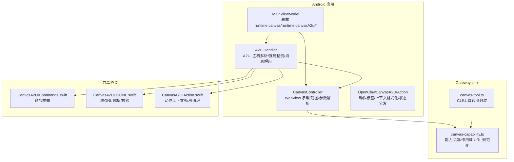
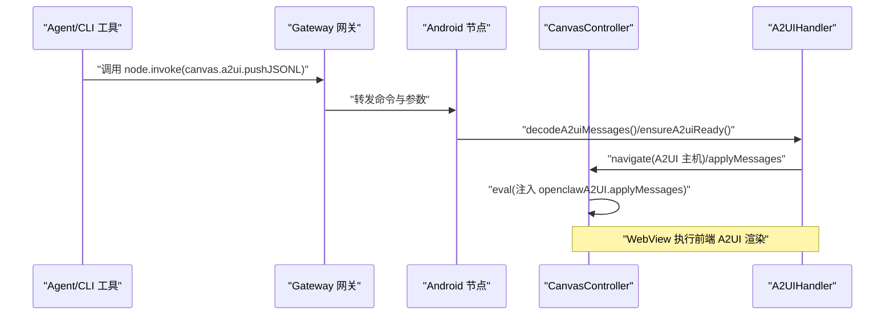
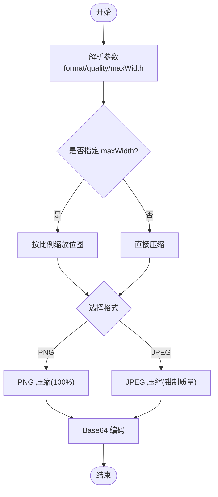
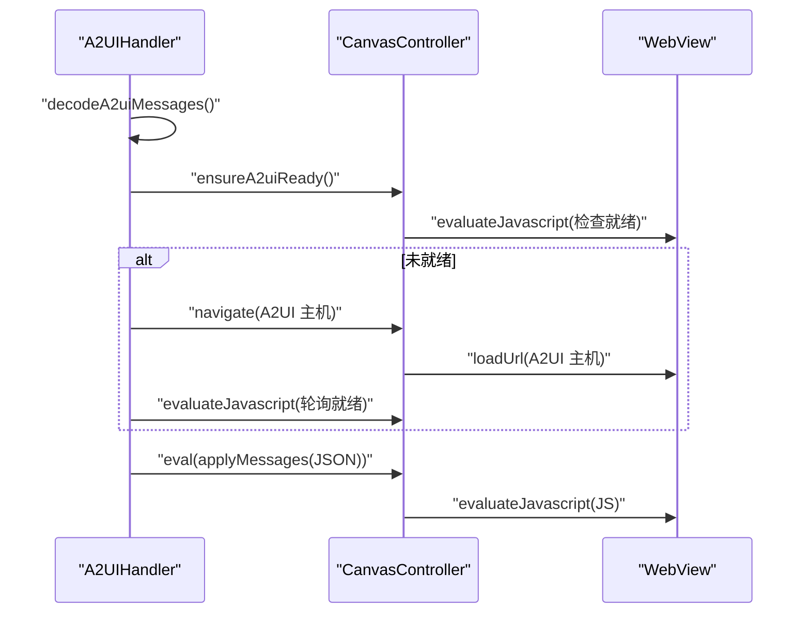
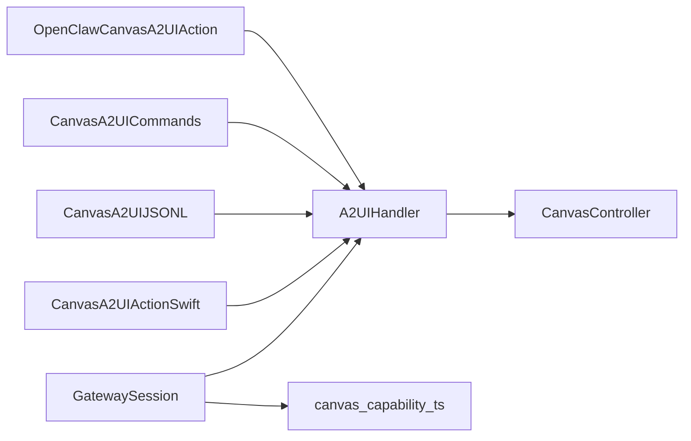

# Canvas共享

<cite>
**本文引用的文件**
- [apps/android/app/src/main/java/ai/openclaw/app/node/CanvasController.kt](file://apps/android/app/src/main/java/ai/openclaw/app/node/CanvasController.kt)
- [apps/android/app/src/main/java/ai/openclaw/app/node/A2UIHandler.kt](file://apps/android/app/src/main/java/ai/openclaw/app/node/A2UIHandler.kt)
- [apps/android/app/src/main/java/ai/openclaw/app/protocol/OpenClawCanvasA2UIAction.kt](file://apps/android/app/src/main/java/ai/openclaw/app/protocol/OpenClawCanvasA2UIAction.kt)
- [apps/shared/OpenClawKit/Sources/OpenClawKit/CanvasA2UIAction.swift](file://apps/shared/OpenClawKit/Sources/OpenClawKit/CanvasA2UIAction.swift)
- [apps/shared/OpenClawKit/Sources/OpenClawKit/CanvasA2UICommands.swift](file://apps/shared/OpenClawKit/Sources/OpenClawKit/CanvasA2UICommands.swift)
- [apps/shared/OpenClawKit/Sources/OpenClawKit/CanvasA2UIJSONL.swift](file://apps/shared/OpenClawKit/Sources/OpenClawKit/CanvasA2UIJSONL.swift)
- [src/gateway/canvas-capability.ts](file://src/gateway/canvas-capability.ts)
- [src/agents/tools/canvas-tool.ts](file://src/agents/tools/canvas-tool.ts)
- [src/cli/nodes-canvas.ts](file://src/cli/nodes-canvas.ts)
- [scripts/canvas-a2ui-copy.ts](file://scripts/canvas-a2ui-copy.ts)
- [apps/android/app/src/test/java/ai/openclaw/app/node/CanvasControllerSnapshotParamsTest.kt](file://apps/android/app/src/test/java/ai/openclaw/app/node/CanvasControllerSnapshotParamsTest.kt)
- [apps/android/app/src/test/java/ai/openclaw/app/protocol/OpenClawCanvasA2UIActionTest.kt](file://apps/android/app/src/test/java/ai/openclaw/app/protocol/OpenClawCanvasA2UIActionTest.kt)
- [apps/android/app/src/main/java/ai/openclaw/app/gateway/GatewaySession.kt](file://apps/android/app/src/main/java/ai/openclaw/app/gateway/GatewaySession.kt)
- [apps/android/app/src/main/java/ai/openclaw/app/MainViewModel.kt](file://apps/android/app/src/main/java/ai/openclaw/app/MainViewModel.kt)
- [docs/platforms/android.md](file://docs/platforms/android.md)
</cite>

## 目录
1. [简介](#简介)
2. [项目结构](#项目结构)
3. [核心组件](#核心组件)
4. [架构总览](#架构总览)
5. [组件详解](#组件详解)
6. [依赖关系分析](#依赖关系分析)
7. [性能考量](#性能考量)
8. [故障排查指南](#故障排查指南)
9. [结论](#结论)
10. [附录](#附录)

## 简介
本文件系统性阐述 OpenClaw Android 节点应用的 Canvas 共享能力，覆盖以下方面：
- Canvas 控制器的设计与实现：屏幕捕获、图像处理、实时传输路径
- A2UIHandler 的用户界面共享：触摸事件转发、手势识别、多点触控支持的前端桥接思路
- Canvas 数据格式、压缩算法与传输协议的技术细节
- 性能优化策略、内存管理与电池消耗控制最佳实践

## 项目结构
Android 应用中与 Canvas 共享直接相关的模块集中在 node 与 protocol 包，以及与 Gateway 的交互层；同时，跨平台共享的 A2UI 协议定义位于 shared/OpenClawKit。

图表来源
- [apps/android/app/src/main/java/ai/openclaw/app/MainViewModel.kt](file://apps/android/app/src/main/java/ai/openclaw/app/MainViewModel.kt#L13-L25)
- [apps/android/app/src/main/java/ai/openclaw/app/node/CanvasController.kt](file://apps/android/app/src/main/java/ai/openclaw/app/node/CanvasController.kt#L26-L76)
- [apps/android/app/src/main/java/ai/openclaw/app/node/A2UIHandler.kt](file://apps/android/app/src/main/java/ai/openclaw/app/node/A2UIHandler.kt#L10-L44)
- [apps/android/app/src/main/java/ai/openclaw/app/protocol/OpenClawCanvasA2UIAction.kt](file://apps/android/app/src/main/java/ai/openclaw/app/protocol/OpenClawCanvasA2UIAction.kt#L6-L67)
- [src/gateway/canvas-capability.ts](file://src/gateway/canvas-capability.ts#L24-L40)
- [src/agents/tools/canvas-tool.ts](file://src/agents/tools/canvas-tool.ts#L80-L106)
- [apps/shared/OpenClawKit/Sources/OpenClawKit/CanvasA2UICommands.swift](file://apps/shared/OpenClawKit/Sources/OpenClawKit/CanvasA2UICommands.swift#L3-L10)
- [apps/shared/OpenClawKit/Sources/OpenClawKit/CanvasA2UIJSONL.swift](file://apps/shared/OpenClawKit/Sources/OpenClawKit/CanvasA2UIJSONL.swift#L14-L27)
- [apps/shared/OpenClawKit/Sources/OpenClawKit/CanvasA2UIAction.swift](file://apps/shared/OpenClawKit/Sources/OpenClawKit/CanvasA2UIAction.swift#L40-L58)

章节来源
- [apps/android/app/src/main/java/ai/openclaw/app/MainViewModel.kt](file://apps/android/app/src/main/java/ai/openclaw/app/MainViewModel.kt#L13-L25)
- [apps/android/app/src/main/java/ai/openclaw/app/node/CanvasController.kt](file://apps/android/app/src/main/java/ai/openclaw/app/node/CanvasController.kt#L26-L76)
- [apps/android/app/src/main/java/ai/openclaw/app/node/A2UIHandler.kt](file://apps/android/app/src/main/java/ai/openclaw/app/node/A2UIHandler.kt#L10-L44)
- [src/gateway/canvas-capability.ts](file://src/gateway/canvas-capability.ts#L24-L40)
- [src/agents/tools/canvas-tool.ts](file://src/agents/tools/canvas-tool.ts#L80-L106)

## 核心组件
- CanvasController：负责 WebView 生命周期、页面导航、调试状态注入、JavaScript 执行与屏幕快照（PNG/JPEG）生成，并提供参数解析与质量/尺寸限制。
- A2UIHandler：负责 A2UI 主机地址解析、A2UI 容器就绪检测、消息解码（数组与 JSONL）、版本兼容性校验，并生成 JS 调用以驱动前端渲染。
- 协议与共享：Android 侧的 OpenClawCanvasA2UIAction 与 shared/OpenClawKit 中的 Swift 版本保持一致的标签清理、上下文格式化与事件分发约定，确保跨平台一致性。
- 网关能力：canvas-capability.ts 提供 Canvas 作用域 URL 的能力令牌与规范化逻辑，Gateway 侧据此生成安全的访问路径并支持动态刷新。

章节来源
- [apps/android/app/src/main/java/ai/openclaw/app/node/CanvasController.kt](file://apps/android/app/src/main/java/ai/openclaw/app/node/CanvasController.kt#L26-L180)
- [apps/android/app/src/main/java/ai/openclaw/app/node/A2UIHandler.kt](file://apps/android/app/src/main/java/ai/openclaw/app/node/A2UIHandler.kt#L10-L147)
- [apps/android/app/src/main/java/ai/openclaw/app/protocol/OpenClawCanvasA2UIAction.kt](file://apps/android/app/src/main/java/ai/openclaw/app/protocol/OpenClawCanvasA2UIAction.kt#L6-L67)
- [apps/shared/OpenClawKit/Sources/OpenClawKit/CanvasA2UIAction.swift](file://apps/shared/OpenClawKit/Sources/OpenClawKit/CanvasA2UIAction.swift#L40-L104)
- [src/gateway/canvas-capability.ts](file://src/gateway/canvas-capability.ts#L15-L40)

## 架构总览
下图展示从 Gateway 到 Android 节点的 Canvas 共享端到端流程，包括能力令牌、A2UI 主机解析、消息解码与 WebView 渲染。

图表来源
- [src/agents/tools/canvas-tool.ts](file://src/agents/tools/canvas-tool.ts#L194-L205)
- [apps/android/app/src/main/java/ai/openclaw/app/node/A2UIHandler.kt](file://apps/android/app/src/main/java/ai/openclaw/app/node/A2UIHandler.kt#L25-L44)
- [apps/android/app/src/main/java/ai/openclaw/app/node/CanvasController.kt](file://apps/android/app/src/main/java/ai/openclaw/app/node/CanvasController.kt#L145-L153)

## 组件详解

### CanvasController：屏幕捕获、图像处理与实时传输
- 页面导航与调试状态
  - 支持默认脚手架与自定义 URL 导航；调试状态通过注入 JS 设置标题/副标题。
- JavaScript 执行
  - 在主线程执行 evaluateJavascript，返回字符串结果，便于读取 DOM 状态或运行片段。
- 屏幕快照
  - PNG/JPEG 双格式输出，JPEG 质量在 [0.1, 1.0] 间钳制，最大宽度按比例缩放，避免超大位图导致内存压力。
  - 截图采用绘制 Canvas 的方式生成 Bitmap，保证跨版本稳定性。
- 参数解析
  - 提供对 format/quality/maxWidth 的健壮解析，默认 JPEG；对非法输入进行兜底与过滤。

图表来源
- [apps/android/app/src/main/java/ai/openclaw/app/node/CanvasController.kt](file://apps/android/app/src/main/java/ai/openclaw/app/node/CanvasController.kt#L166-L180)
- [apps/android/app/src/main/java/ai/openclaw/app/node/CanvasController.kt](file://apps/android/app/src/main/java/ai/openclaw/app/node/CanvasController.kt#L47-L53)
- [apps/android/app/src/main/java/ai/openclaw/app/node/CanvasController.kt](file://apps/android/app/src/main/java/ai/openclaw/app/node/CanvasController.kt#L215-L232)

章节来源
- [apps/android/app/src/main/java/ai/openclaw/app/node/CanvasController.kt](file://apps/android/app/src/main/java/ai/openclaw/app/node/CanvasController.kt#L26-L180)
- [apps/android/app/src/test/java/ai/openclaw/app/node/CanvasControllerSnapshotParamsTest.kt](file://apps/android/app/src/test/java/ai/openclaw/app/node/CanvasControllerSnapshotParamsTest.kt#L8-L42)

### A2UIHandler：用户界面共享与消息桥接
- A2UI 主机解析
  - 优先使用节点侧能力 URL，其次回退到操作者侧 URL，统一追加平台查询参数。
- 就绪检测
  - 通过注入 JS 检查全局 openclawA2UI 是否存在并具备 applyMessages 方法；若未就绪则导航至 A2UI 主机并轮询等待。
- 消息解码与校验
  - 支持 messages 数组与 JSONL 两种输入；对每条消息进行白名单字段校验，确保仅包含 beginRendering/surfaceUpdate/dataModelUpdate/deleteSurface 之一，且不包含 v0.9 的 createSurface 字段。
- JS 调用
  - 生成 applyMessages 调用与 reset 调用的 JS 片段，供 WebView 执行。

图表来源
- [apps/android/app/src/main/java/ai/openclaw/app/node/A2UIHandler.kt](file://apps/android/app/src/main/java/ai/openclaw/app/node/A2UIHandler.kt#L16-L44)
- [apps/android/app/src/main/java/ai/openclaw/app/node/A2UIHandler.kt](file://apps/android/app/src/main/java/ai/openclaw/app/node/A2UIHandler.kt#L46-L103)
- [apps/android/app/src/main/java/ai/openclaw/app/node/CanvasController.kt](file://apps/android/app/src/main/java/ai/openclaw/app/node/CanvasController.kt#L145-L153)

章节来源
- [apps/android/app/src/main/java/ai/openclaw/app/node/A2UIHandler.kt](file://apps/android/app/src/main/java/ai/openclaw/app/node/A2UIHandler.kt#L10-L147)
- [apps/android/app/src/main/java/ai/openclaw/app/protocol/OpenClawCanvasA2UIAction.kt](file://apps/android/app/src/main/java/ai/openclaw/app/protocol/OpenClawCanvasA2UIAction.kt#L6-L67)
- [apps/shared/OpenClawKit/Sources/OpenClawKit/CanvasA2UIAction.swift](file://apps/shared/OpenClawKit/Sources/OpenClawKit/CanvasA2UIAction.swift#L40-L104)
- [apps/shared/OpenClawKit/Sources/OpenClawKit/CanvasA2UICommands.swift](file://apps/shared/OpenClawKit/Sources/OpenClawKit/CanvasA2UICommands.swift#L3-L10)
- [apps/shared/OpenClawKit/Sources/OpenClawKit/CanvasA2UIJSONL.swift](file://apps/shared/OpenClawKit/Sources/OpenClawKit/CanvasA2UIJSONL.swift#L14-L64)

### 协议与跨平台一致性
- 动作标签与上下文格式化
  - Android 与 Swift 两侧均提供提取动作名称、清理标签字符集、格式化 Agent 消息上下文的能力，确保日志与追踪的一致性。
- JSONL 解析与校验
  - 对 JSONL 文本逐行解析，校验消息类型唯一性与版本兼容性，抛出明确错误信息以便定位问题。
- 命令枚举
  - 统一的命令名称（push/pushJSONL/reset），其中 pushJSONL 为 JSONL 场景的兼容别名。

章节来源
- [apps/android/app/src/main/java/ai/openclaw/app/protocol/OpenClawCanvasA2UIAction.kt](file://apps/android/app/src/main/java/ai/openclaw/app/protocol/OpenClawCanvasA2UIAction.kt#L6-L67)
- [apps/shared/OpenClawKit/Sources/OpenClawKit/CanvasA2UIAction.swift](file://apps/shared/OpenClawKit/Sources/OpenClawKit/CanvasA2UIAction.swift#L40-L104)
- [apps/shared/OpenClawKit/Sources/OpenClawKit/CanvasA2UICommands.swift](file://apps/shared/OpenClawKit/Sources/OpenClawKit/CanvasA2UICommands.swift#L3-L10)
- [apps/shared/OpenClawKit/Sources/OpenClawKit/CanvasA2UIJSONL.swift](file://apps/shared/OpenClawKit/Sources/OpenClawKit/CanvasA2UIJSONL.swift#L14-L64)
- [apps/android/app/src/test/java/ai/openclaw/app/protocol/OpenClawCanvasA2UIActionTest.kt](file://apps/android/app/src/test/java/ai/openclaw/app/protocol/OpenClawCanvasA2UIActionTest.kt#L8-L49)

### 网关能力与作用域 URL
- 能力令牌与作用域 URL
  - mintCanvasCapabilityToken 生成随机能力令牌；buildCanvasScopedHostUrl 将基础 URL 重写为带能力前缀的安全路径；normalizeCanvasScopedUrl 解析并规范化作用域 URL，支持从路径或查询参数恢复能力。
- 能力刷新与 URL 重写
  - GatewaySession 通过 node.canvas.capability.refresh 获取最新 canvasCapability，并结合本地 canvasHostUrl 重写为最终可用的 A2UI 主机 URL。

章节来源
- [src/gateway/canvas-capability.ts](file://src/gateway/canvas-capability.ts#L20-L40)
- [apps/android/app/src/main/java/ai/openclaw/app/gateway/GatewaySession.kt](file://apps/android/app/src/main/java/ai/openclaw/app/gateway/GatewaySession.kt#L176-L215)

### CLI/工具与快照传输
- CLI 工具封装
  - canvas-tool.ts 将不同动作（present/hide/navigate/eval/snapshot/a2ui_push/a2ui_reset）映射为 Gateway 调用，统一处理参数与响应。
- 快照传输
  - snapshot 动作返回 { format, base64 }，CLI 层将其写入临时文件并返回 MIME 类型与详情，便于后续上传或展示。

章节来源
- [src/agents/tools/canvas-tool.ts](file://src/agents/tools/canvas-tool.ts#L80-L215)
- [src/cli/nodes-canvas.ts](file://src/cli/nodes-canvas.ts#L5-L18)

### A2UI 资产复制与构建
- A2UI 资产复制
  - canvas-a2ui-copy.ts 负责将 A2UI 前端资源从源目录复制到目标 dist 目录，缺失时根据环境变量决定报错或跳过。

章节来源
- [scripts/canvas-a2ui-copy.ts](file://scripts/canvas-a2ui-copy.ts#L13-L28)

## 依赖关系分析
- Android 侧依赖
  - CanvasController 依赖 WebView 与主线程调度；A2UIHandler 依赖 CanvasController 与 JSON 解析库；OpenClawCanvasA2UIAction 作为协议辅助工具。
- 跨平台共享
  - Android 与 iOS/Swift 使用相同的命令枚举、JSONL 校验规则与动作上下文格式化逻辑，确保行为一致。
- 网关侧依赖
  - Gateway 通过 canvas-capability.ts 生成/解析作用域 URL，并在 UI 侧通过 GatewaySession 刷新能力。

图表来源
- [apps/android/app/src/main/java/ai/openclaw/app/node/A2UIHandler.kt](file://apps/android/app/src/main/java/ai/openclaw/app/node/A2UIHandler.kt#L10-L15)
- [apps/android/app/src/main/java/ai/openclaw/app/node/CanvasController.kt](file://apps/android/app/src/main/java/ai/openclaw/app/node/CanvasController.kt#L26-L38)
- [apps/android/app/src/main/java/ai/openclaw/app/protocol/OpenClawCanvasA2UIAction.kt](file://apps/android/app/src/main/java/ai/openclaw/app/protocol/OpenClawCanvasA2UIAction.kt#L6-L20)
- [apps/shared/OpenClawKit/Sources/OpenClawKit/CanvasA2UICommands.swift](file://apps/shared/OpenClawKit/Sources/OpenClawKit/CanvasA2UICommands.swift#L3-L10)
- [apps/shared/OpenClawKit/Sources/OpenClawKit/CanvasA2UIJSONL.swift](file://apps/shared/OpenClawKit/Sources/OpenClawKit/CanvasA2UIJSONL.swift#L14-L27)
- [apps/shared/OpenClawKit/Sources/OpenClawKit/CanvasA2UIAction.swift](file://apps/shared/OpenClawKit/Sources/OpenClawKit/CanvasA2UIAction.swift#L40-L58)
- [apps/android/app/src/main/java/ai/openclaw/app/gateway/GatewaySession.kt](file://apps/android/app/src/main/java/ai/openclaw/app/gateway/GatewaySession.kt#L176-L215)
- [src/gateway/canvas-capability.ts](file://src/gateway/canvas-capability.ts#L24-L40)

## 性能考量
- 截图与压缩
  - 限定最大宽度并按比例缩放，降低内存占用与传输体积；JPEG 质量钳制在 [0.1, 1.0]，避免极端值带来的编码开销。
- 主线程与协程
  - WebView 操作与 JavaScript 执行在主线程完成，避免跨线程同步复杂度；长耗时任务（如网络请求）应放在后台线程，仅在必要时切换主线程。
- A2UI 加载与轮询
  - ensureA2uiReady 采用延迟轮询，避免忙等；建议在 UI 状态变化时及时中断轮询，减少无意义等待。
- 资产复制与缓存
  - A2UI 资产复制脚本支持跳过缺失场景（通过环境变量），在开发阶段提升迭代效率；生产环境应确保资产齐全。
- 日志与调试
  - 调试状态注入仅在 Debug 构建启用，避免 Release 环境的额外开销。

章节来源
- [apps/android/app/src/main/java/ai/openclaw/app/node/CanvasController.kt](file://apps/android/app/src/main/java/ai/openclaw/app/node/CanvasController.kt#L47-L53)
- [apps/android/app/src/main/java/ai/openclaw/app/node/CanvasController.kt](file://apps/android/app/src/main/java/ai/openclaw/app/node/CanvasController.kt#L166-L180)
- [apps/android/app/src/main/java/ai/openclaw/app/node/A2UIHandler.kt](file://apps/android/app/src/main/java/ai/openclaw/app/node/A2UIHandler.kt#L33-L43)
- [scripts/canvas-a2ui-copy.ts](file://scripts/canvas-a2ui-copy.ts#L13-L28)

## 故障排查指南
- A2UI 主机未就绪
  - 现象：ensureA2uiReady 返回 false。
  - 处理：确认 A2UI 主机 URL 正确、网络可达；检查 WebView 是否成功加载；查看轮询日志与异常栈。
- JSONL 校验失败
  - 现象：抛出“期望 exactly 一个字段”或“看起来是 v0.9”的错误。
  - 处理：确保每条消息仅包含 beginRendering/surfaceUpdate/dataModelUpdate/deleteSurface 之一；移除 v0.9 的 createSurface 字段。
- 参数解析异常
  - 现象：快照参数解析失败或默认值不符合预期。
  - 处理：核对 format/quality/maxWidth 的传入值范围；参考单元测试断言进行对比。
- 能力令牌与 URL 规范化
  - 现象：作用域 URL 无法正确解析或重写。
  - 处理：确认 capability 令牌有效、路径前缀正确；检查查询参数与路径编码。

章节来源
- [apps/android/app/src/main/java/ai/openclaw/app/node/A2UIHandler.kt](file://apps/android/app/src/main/java/ai/openclaw/app/node/A2UIHandler.kt#L89-L103)
- [apps/android/app/src/test/java/ai/openclaw/app/node/CanvasControllerSnapshotParamsTest.kt](file://apps/android/app/src/test/java/ai/openclaw/app/node/CanvasControllerSnapshotParamsTest.kt#L8-L42)
- [apps/android/app/src/test/java/ai/openclaw/app/protocol/OpenClawCanvasA2UIActionTest.kt](file://apps/android/app/src/test/java/ai/openclaw/app/protocol/OpenClawCanvasA2UIActionTest.kt#L8-L49)
- [src/gateway/canvas-capability.ts](file://src/gateway/canvas-capability.ts#L42-L87)

## 结论
OpenClaw 的 Canvas 共享通过 Android 侧的 CanvasController 与 A2UIHandler 实现了从页面导航、JS 执行到屏幕快照与 A2UI 消息桥接的完整链路。配合 Gateway 的能力令牌与作用域 URL 规范化，以及跨平台一致的协议定义，实现了稳定、可扩展的实时 UI 共享体验。在性能与可靠性方面，通过参数钳制、主线程约束与资产复制策略，兼顾了用户体验与资源消耗控制。

## 附录
- 命令与参数参考（来自文档与工具）
  - Canvas 命令（前台）：canvas.eval、canvas.snapshot、canvas.navigate；快照返回 { format, base64 }。
  - A2UI 命令：canvas.a2ui.push、canvas.a2ui.reset（canvas.a2ui.pushJSONL 为 JSONL 场景的兼容别名）。
  - 能力刷新：node.canvas.capability.refresh，返回 canvasCapability 与本地 canvasHostUrl。

章节来源
- [docs/platforms/android.md](file://docs/platforms/android.md#L142-L145)
- [src/agents/tools/canvas-tool.ts](file://src/agents/tools/canvas-tool.ts#L107-L144)
- [apps/android/app/src/main/java/ai/openclaw/app/gateway/GatewaySession.kt](file://apps/android/app/src/main/java/ai/openclaw/app/gateway/GatewaySession.kt#L176-L215)