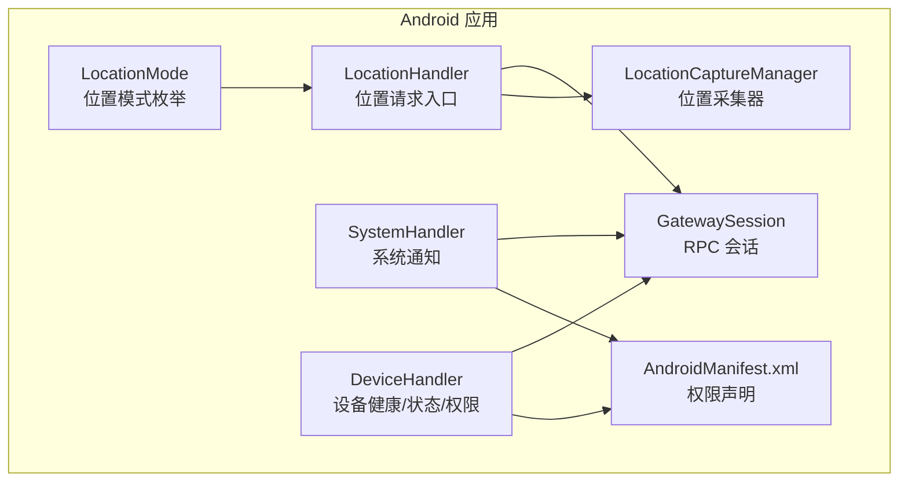
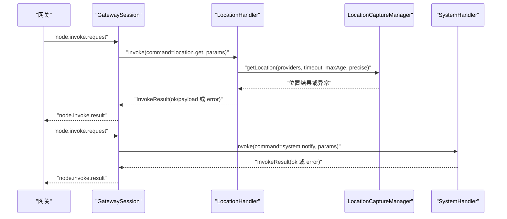
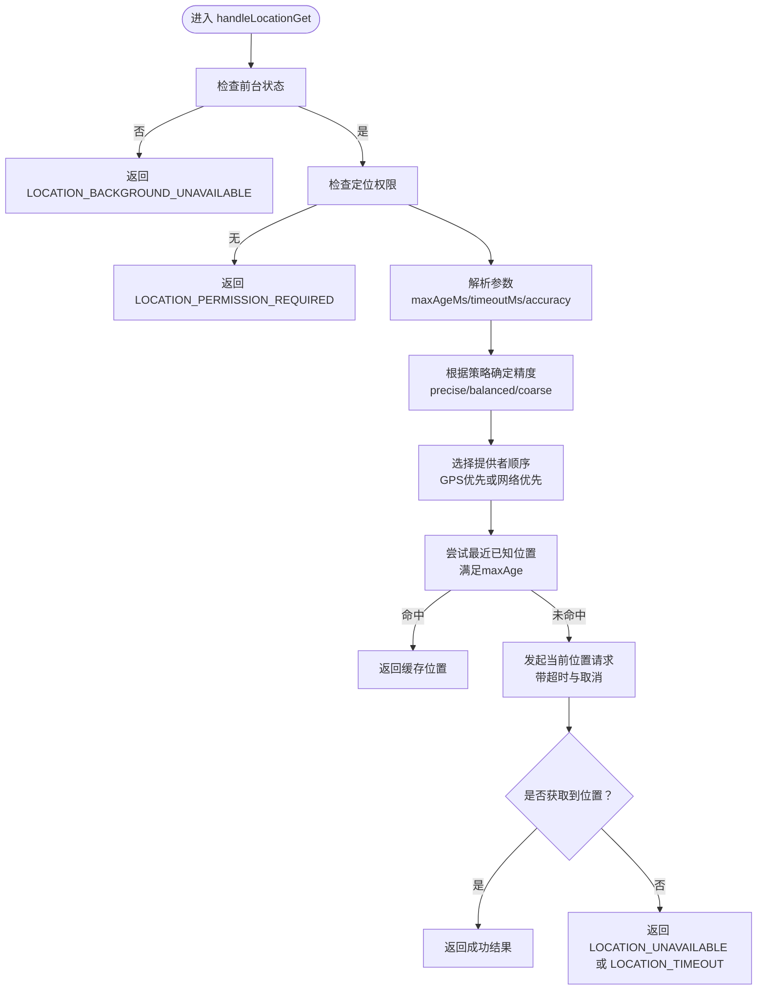
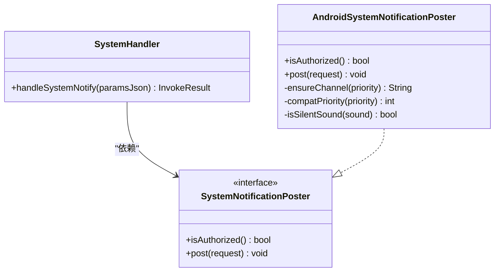
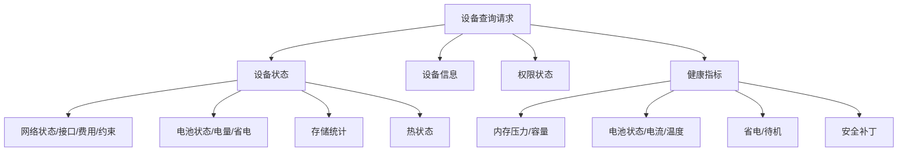
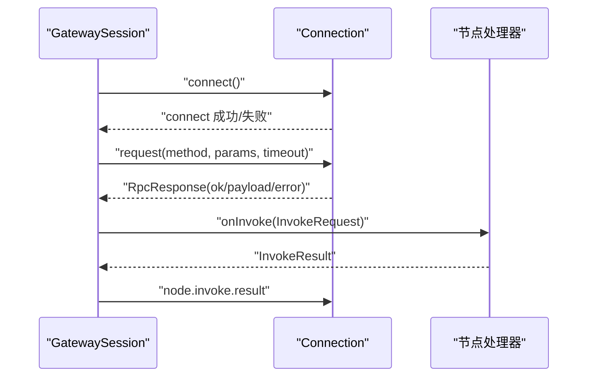
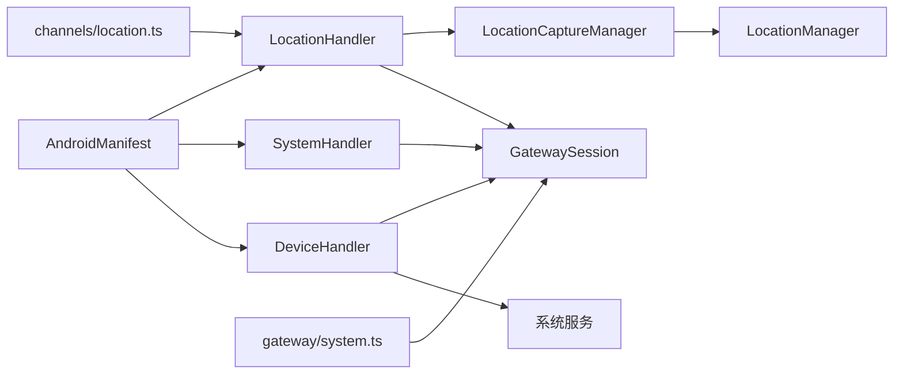

# 位置和系统功能

<cite>
**本文引用的文件**
- [apps/android/app/src/main/java/ai/openclaw/app/node/LocationHandler.kt](file://apps/android/app/src/main/java/ai/openclaw/app/node/LocationHandler.kt)
- [apps/android/app/src/main/java/ai/openclaw/app/node/LocationCaptureManager.kt](file://apps/android/app/src/main/java/ai/openclaw/app/node/LocationCaptureManager.kt)
- [apps/android/app/src/main/java/ai/openclaw/app/LocationMode.kt](file://apps/android/app/src/main/java/ai/openclaw/app/LocationMode.kt)
- [apps/android/app/src/main/java/ai/openclaw/app/node/SystemHandler.kt](file://apps/android/app/src/main/java/ai/openclaw/app/node/SystemHandler.kt)
- [apps/android/app/src/main/java/ai/openclaw/app/node/DeviceHandler.kt](file://apps/android/app/src/main/java/ai/openclaw/app/node/DeviceHandler.kt)
- [apps/android/app/src/main/AndroidManifest.xml](file://apps/android/app/src/main/AndroidManifest.xml)
- [apps/android/app/src/main/java/ai/openclaw/app/gateway/GatewaySession.kt](file://apps/android/app/src/main/java/ai/openclaw/app/gateway/GatewaySession.kt)
- [src/channels/location.ts](file://src/channels/location.ts)
- [src/infra/system-presence.ts](file://src/infra/system-presence.ts)
- [src/gateway/server-methods/system.ts](file://src/gateway/server-methods/system.ts)
</cite>

## 目录
1. [简介](#简介)
2. [项目结构](#项目结构)
3. [核心组件](#核心组件)
4. [架构总览](#架构总览)
5. [详细组件分析](#详细组件分析)
6. [依赖关系分析](#依赖关系分析)
7. [性能考虑](#性能考虑)
8. [故障排查指南](#故障排查指南)
9. [结论](#结论)
10. [附录](#附录)

## 简介
本文件面向OpenClaw Android节点应用，系统化梳理“位置与系统功能”模块的设计与实现，重点覆盖：
- 位置服务：GPS定位、网络定位与位置更新策略，以及精度控制、权限与后台限制、异常降级
- 系统功能：设备信息、存储、网络状态、电池与热管理、通知发布与授权校验
- 兼容性与隐私：权限清单、平台差异、后台运行限制与隐私保护建议

目标是帮助开发者快速理解并正确集成与扩展位置与系统能力。

## 项目结构
Android侧位置与系统功能主要位于apps/android/app/src/main/java/ai/openclaw/app/node目录，配合Gateway会话层与系统权限清单，形成端到端的调用链路。

**图表来源**
- [apps/android/app/src/main/java/ai/openclaw/app/node/LocationHandler.kt](file://apps/android/app/src/main/java/ai/openclaw/app/node/LocationHandler.kt#L1-L100)
- [apps/android/app/src/main/java/ai/openclaw/app/node/LocationCaptureManager.kt](file://apps/android/app/src/main/java/ai/openclaw/app/node/LocationCaptureManager.kt#L1-L117)
- [apps/android/app/src/main/java/ai/openclaw/app/node/SystemHandler.kt](file://apps/android/app/src/main/java/ai/openclaw/app/node/SystemHandler.kt#L1-L173)
- [apps/android/app/src/main/java/ai/openclaw/app/node/DeviceHandler.kt](file://apps/android/app/src/main/java/ai/openclaw/app/node/DeviceHandler.kt#L1-L399)
- [apps/android/app/src/main/java/ai/openclaw/app/LocationMode.kt](file://apps/android/app/src/main/java/ai/openclaw/app/LocationMode.kt#L1-L16)
- [apps/android/app/src/main/AndroidManifest.xml](file://apps/android/app/src/main/AndroidManifest.xml#L1-L30)
- [apps/android/app/src/main/java/ai/openclaw/app/gateway/GatewaySession.kt](file://apps/android/app/src/main/java/ai/openclaw/app/gateway/GatewaySession.kt#L1-L761)

**章节来源**
- [apps/android/app/src/main/java/ai/openclaw/app/node/LocationHandler.kt](file://apps/android/app/src/main/java/ai/openclaw/app/node/LocationHandler.kt#L1-L100)
- [apps/android/app/src/main/java/ai/openclaw/app/node/LocationCaptureManager.kt](file://apps/android/app/src/main/java/ai/openclaw/app/node/LocationCaptureManager.kt#L1-L117)
- [apps/android/app/src/main/java/ai/openclaw/app/node/SystemHandler.kt](file://apps/android/app/src/main/java/ai/openclaw/app/node/SystemHandler.kt#L1-L173)
- [apps/android/app/src/main/java/ai/openclaw/app/node/DeviceHandler.kt](file://apps/android/app/src/main/java/ai/openclaw/app/node/DeviceHandler.kt#L1-L399)
- [apps/android/app/src/main/java/ai/openclaw/app/LocationMode.kt](file://apps/android/app/src/main/java/ai/openclaw/app/LocationMode.kt#L1-L16)
- [apps/android/app/src/main/AndroidManifest.xml](file://apps/android/app/src/main/AndroidManifest.xml#L1-L30)
- [apps/android/app/src/main/java/ai/openclaw/app/gateway/GatewaySession.kt](file://apps/android/app/src/main/java/ai/openclaw/app/gateway/GatewaySession.kt#L1-L761)

## 核心组件
- 位置服务
  - LocationHandler：解析参数、校验权限与前台状态、选择精度与提供者、调用LocationCaptureManager并返回结果
  - LocationCaptureManager：基于LocationManager进行位置采集，支持缓存最近已知位置与超时请求
  - LocationMode：位置模式（关闭/使用中）枚举，用于UI与策略控制
- 系统功能
  - SystemHandler：系统通知发布，含渠道创建、优先级映射、静音判定与授权检查
  - DeviceHandler：设备状态/信息/权限/健康数据聚合输出
- 会话与网关
  - GatewaySession：RPC调用封装、超时与错误转换、节点调用事件分发

**章节来源**
- [apps/android/app/src/main/java/ai/openclaw/app/node/LocationHandler.kt](file://apps/android/app/src/main/java/ai/openclaw/app/node/LocationHandler.kt#L1-L100)
- [apps/android/app/src/main/java/ai/openclaw/app/node/LocationCaptureManager.kt](file://apps/android/app/src/main/java/ai/openclaw/app/node/LocationCaptureManager.kt#L1-L117)
- [apps/android/app/src/main/java/ai/openclaw/app/node/SystemHandler.kt](file://apps/android/app/src/main/java/ai/openclaw/app/node/SystemHandler.kt#L1-L173)
- [apps/android/app/src/main/java/ai/openclaw/app/node/DeviceHandler.kt](file://apps/android/app/src/main/java/ai/openclaw/app/node/DeviceHandler.kt#L1-L399)
- [apps/android/app/src/main/java/ai/openclaw/app/gateway/GatewaySession.kt](file://apps/android/app/src/main/java/ai/openclaw/app/gateway/GatewaySession.kt#L1-L761)

## 架构总览
下图展示从网关到Android节点的调用路径，以及位置与系统功能在其中的角色。

**图表来源**
- [apps/android/app/src/main/java/ai/openclaw/app/gateway/GatewaySession.kt](file://apps/android/app/src/main/java/ai/openclaw/app/gateway/GatewaySession.kt#L523-L585)
- [apps/android/app/src/main/java/ai/openclaw/app/node/LocationHandler.kt](file://apps/android/app/src/main/java/ai/openclaw/app/node/LocationHandler.kt#L35-L80)
- [apps/android/app/src/main/java/ai/openclaw/app/node/LocationCaptureManager.kt](file://apps/android/app/src/main/java/ai/openclaw/app/node/LocationCaptureManager.kt#L22-L117)
- [apps/android/app/src/main/java/ai/openclaw/app/node/SystemHandler.kt](file://apps/android/app/src/main/java/ai/openclaw/app/node/SystemHandler.kt#L105-L138)

## 详细组件分析

### 位置服务：LocationHandler 与 LocationCaptureManager
- 参数解析与策略
  - 支持maxAgeMs（最大年龄）、timeoutMs（超时）、desiredAccuracy（精确/平衡/粗略）
  - 前台状态要求：非前台直接返回不可用错误
  - 权限要求：需至少具备粗/精定位之一
  - 精度选择：当启用“精确位置”且具备精定位权限时优先GPS；否则回退到网络定位
- 位置采集流程
  - 首先尝试最近已知位置（bestLastKnown），满足maxAge条件则直接返回
  - 否则发起getCurrentLocation请求，带取消信号与超时控制
  - 若无可用提供者或无法获取定位，抛出相应异常并由上层捕获
- 错误与降级
  - 超时：返回LOCATION_TIMEOUT
  - 无权限：返回LOCATION_PERMISSION_REQUIRED
  - 无前台：返回LOCATION_BACKGROUND_UNAVAILABLE
  - 无定位：返回LOCATION_UNAVAILABLE

**图表来源**
- [apps/android/app/src/main/java/ai/openclaw/app/node/LocationHandler.kt](file://apps/android/app/src/main/java/ai/openclaw/app/node/LocationHandler.kt#L35-L100)
- [apps/android/app/src/main/java/ai/openclaw/app/node/LocationCaptureManager.kt](file://apps/android/app/src/main/java/ai/openclaw/app/node/LocationCaptureManager.kt#L22-L117)

**章节来源**
- [apps/android/app/src/main/java/ai/openclaw/app/node/LocationHandler.kt](file://apps/android/app/src/main/java/ai/openclaw/app/node/LocationHandler.kt#L35-L100)
- [apps/android/app/src/main/java/ai/openclaw/app/node/LocationCaptureManager.kt](file://apps/android/app/src/main/java/ai/openclaw/app/node/LocationCaptureManager.kt#L22-L117)
- [apps/android/app/src/main/java/ai/openclaw/app/LocationMode.kt](file://apps/android/app/src/main/java/ai/openclaw/app/LocationMode.kt#L1-L16)

### 系统通知：SystemHandler
- 授权与渠道
  - 通知权限：Android 13+需POST_NOTIFICATIONS权限
  - 通知开关：通过NotificationManagerCompat判断系统开关
  - 渠道创建：按优先级（被动/时间敏感/活动）创建不同重要性渠道
- 发布策略
  - 标题/正文必填，空内容拒绝
  - 静音判定：sound为none/silent/off/false/0时设置静默
  - 优先级映射：passive/timesensitive/默认分别映射到低/高/默认
- 错误处理
  - 缺少权限：返回NOT_AUTHORIZED
  - 通知失败：返回UNAVAILABLE并携带错误消息

**图表来源**
- [apps/android/app/src/main/java/ai/openclaw/app/node/SystemHandler.kt](file://apps/android/app/src/main/java/ai/openclaw/app/node/SystemHandler.kt#L100-L173)

**章节来源**
- [apps/android/app/src/main/java/ai/openclaw/app/node/SystemHandler.kt](file://apps/android/app/src/main/java/ai/openclaw/app/node/SystemHandler.kt#L105-L138)

### 设备与系统健康：DeviceHandler
- 设备状态
  - 电池：状态、电量比例、省电模式
  - 存储：总/可用/已用字节
  - 网络：状态（已验证/需要连接/未满足）、是否计费/受限、接口类型（WiFi/蜂窝/以太网/其他）
  - 热管理：热状态等级
  - 运行时长：开机以来秒数
- 设备信息
  - 设备名、型号标识、系统名/版本、应用版本/构建号、语言区域
- 权限状态
  - 摄像头、麦克风、定位（粗/精）、短信、通知监听、通知、相册、通讯录、日历、运动
- 健康指标
  - 内存压力等级、总/可用/已用内存、低内存阈值、低内存标志
  - 电池状态、充电类型、温度、电流
  - 省电/待机模式、安全补丁级别

**图表来源**
- [apps/android/app/src/main/java/ai/openclaw/app/node/DeviceHandler.kt](file://apps/android/app/src/main/java/ai/openclaw/app/node/DeviceHandler.kt#L36-L286)

**章节来源**
- [apps/android/app/src/main/java/ai/openclaw/app/node/DeviceHandler.kt](file://apps/android/app/src/main/java/ai/openclaw/app/node/DeviceHandler.kt#L36-L286)

### 会话与RPC：GatewaySession
- 请求/响应模型：InvokeRequest/InvokeResult/ErrorShape
- 节点调用事件：接收"node.invoke.request"后派发到具体处理器
- 超时与确认：请求超时抛出异常；结果ACK超时范围限定
- 连接与重连：指数回退重连，断线清理挂起请求

**图表来源**
- [apps/android/app/src/main/java/ai/openclaw/app/gateway/GatewaySession.kt](file://apps/android/app/src/main/java/ai/openclaw/app/gateway/GatewaySession.kt#L253-L271)
- [apps/android/app/src/main/java/ai/openclaw/app/gateway/GatewaySession.kt](file://apps/android/app/src/main/java/ai/openclaw/app/gateway/GatewaySession.kt#L523-L585)

**章节来源**
- [apps/android/app/src/main/java/ai/openclaw/app/gateway/GatewaySession.kt](file://apps/android/app/src/main/java/ai/openclaw/app/gateway/GatewaySession.kt#L523-L585)

## 依赖关系分析
- 位置模块
  - LocationHandler依赖LocationCaptureManager、GatewaySession、Json解析、权限检查
  - LocationCaptureManager依赖LocationManager、权限检查、超时与取消信号
- 系统模块
  - SystemHandler依赖通知渠道与权限检查、GatewaySession
  - DeviceHandler依赖系统服务（电池/存储/网络/电源/活动管理）、权限检查
- 权限与清单
  - AndroidManifest声明了定位、通知、网络、前台服务等权限
- 网关与通道
  - 网关侧提供系统事件与心跳方法，通道层对位置文本格式化与来源解析

**图表来源**
- [apps/android/app/src/main/java/ai/openclaw/app/node/LocationHandler.kt](file://apps/android/app/src/main/java/ai/openclaw/app/node/LocationHandler.kt#L1-L100)
- [apps/android/app/src/main/java/ai/openclaw/app/node/LocationCaptureManager.kt](file://apps/android/app/src/main/java/ai/openclaw/app/node/LocationCaptureManager.kt#L1-L117)
- [apps/android/app/src/main/java/ai/openclaw/app/node/SystemHandler.kt](file://apps/android/app/src/main/java/ai/openclaw/app/node/SystemHandler.kt#L1-L173)
- [apps/android/app/src/main/java/ai/openclaw/app/node/DeviceHandler.kt](file://apps/android/app/src/main/java/ai/openclaw/app/node/DeviceHandler.kt#L1-L399)
- [apps/android/app/src/main/AndroidManifest.xml](file://apps/android/app/src/main/AndroidManifest.xml#L1-L30)
- [src/gateway/server-methods/system.ts](file://src/gateway/server-methods/system.ts#L10-L44)
- [src/channels/location.ts](file://src/channels/location.ts#L1-L43)

**章节来源**
- [apps/android/app/src/main/AndroidManifest.xml](file://apps/android/app/src/main/AndroidManifest.xml#L1-L30)
- [src/gateway/server-methods/system.ts](file://src/gateway/server-methods/system.ts#L10-L44)
- [src/channels/location.ts](file://src/channels/location.ts#L1-L43)

## 性能考虑
- 定位超时与预算
  - 默认超时与范围限制避免长时间阻塞；maxAge可复用缓存减少能耗
  - 精确定位优先GPS，但需权衡耗电；平衡策略在网络定位下更节能
- 通知发布
  - 仅在授权与系统开关允许时发布，避免无效调用
  - 静音与优先级降低打扰，提升用户体验
- 设备健康
  - 低内存/高热状态可用于动态调整定位频率与通知策略
  - 计费/受限网络可影响定位与上传策略

[本节为通用指导，无需特定文件引用]

## 故障排查指南
- 位置相关
  - 无前台：确保应用处于前台，或调整位置模式为“始终”
  - 无权限：引导用户授予粗/精定位权限
  - 无定位：检查GPS/网络开关；尝试增大超时或放宽maxAge；确认提供者可用
  - 超时：缩短timeout或提高maxAge；在弱信号区降低精度
- 系统通知
  - 未授权：检查通知权限与系统开关；Android 13+需单独申请POST_NOTIFICATIONS
  - 发布失败：查看错误码与消息，确认标题/正文非空
- 设备健康
  - 低内存/高热：降低定位频率或暂停非必要任务
  - 网络受限/计费：切换至WiFi或降低数据使用

**章节来源**
- [apps/android/app/src/main/java/ai/openclaw/app/node/LocationHandler.kt](file://apps/android/app/src/main/java/ai/openclaw/app/node/LocationHandler.kt#L35-L80)
- [apps/android/app/src/main/java/ai/openclaw/app/node/SystemHandler.kt](file://apps/android/app/src/main/java/ai/openclaw/app/node/SystemHandler.kt#L105-L138)
- [apps/android/app/src/main/java/ai/openclaw/app/node/DeviceHandler.kt](file://apps/android/app/src/main/java/ai/openclaw/app/node/DeviceHandler.kt#L227-L286)

## 结论
Android节点的“位置与系统功能”模块以清晰的职责分离实现：LocationHandler负责策略与参数解析，LocationCaptureManager专注位置采集，SystemHandler与DeviceHandler分别承担通知与系统健康数据聚合。结合GatewaySession的RPC框架，形成稳定、可扩展的节点能力。通过权限与前台限制、超时与缓存策略、通知授权与静音控制，兼顾性能、体验与隐私。

[本节为总结，无需特定文件引用]

## 附录

### 位置精度与策略速查
- desiredAccuracy
  - precise：启用“精确位置”且有精定位权限时使用GPS优先
  - coarse：仅使用网络定位
  - 默认/平衡：根据是否启用精确与权限选择提供者顺序
- maxAgeMs：缓存最近已知位置的时效阈值
- timeoutMs：定位请求超时上限（限定范围）

**章节来源**
- [apps/android/app/src/main/java/ai/openclaw/app/node/LocationHandler.kt](file://apps/android/app/src/main/java/ai/openclaw/app/node/LocationHandler.kt#L48-L61)
- [apps/android/app/src/main/java/ai/openclaw/app/node/LocationCaptureManager.kt](file://apps/android/app/src/main/java/ai/openclaw/app/node/LocationCaptureManager.kt#L64-L84)

### 权限与清单要点
- 定位：ACCESS_FINE_LOCATION、ACCESS_COARSE_LOCATION
- 通知：POST_NOTIFICATIONS（Android 13+）
- 网络：INTERNET、ACCESS_NETWORK_STATE
- 前台服务：FOREGROUND_SERVICE、FOREGROUND_SERVICE_DATA_SYNC
- 其他：相机、录音、短信、媒体读取、联系人、日历、运动识别等

**章节来源**
- [apps/android/app/src/main/AndroidManifest.xml](file://apps/android/app/src/main/AndroidManifest.xml#L1-L30)

### 网关侧系统能力
- 系统事件与心跳：提供系统事件上报与心跳开关管理
- 系统存在性：记录设备/实例/角色/作用域等元信息

**章节来源**
- [src/gateway/server-methods/system.ts](file://src/gateway/server-methods/system.ts#L10-L44)
- [src/infra/system-presence.ts](file://src/infra/system-presence.ts#L1-L49)