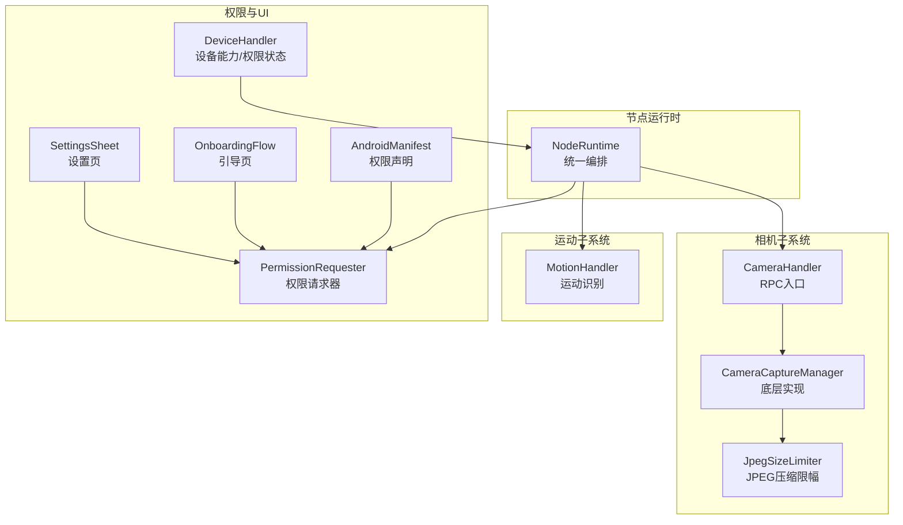
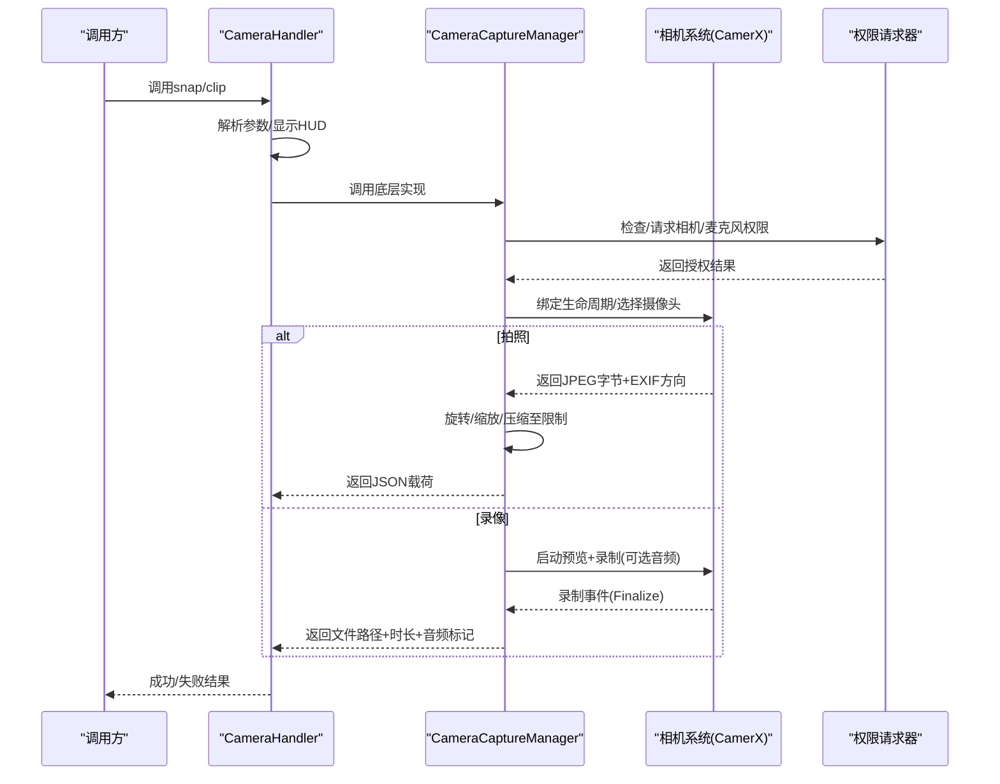
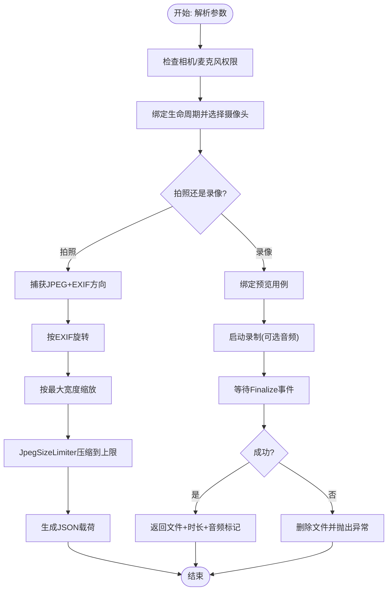
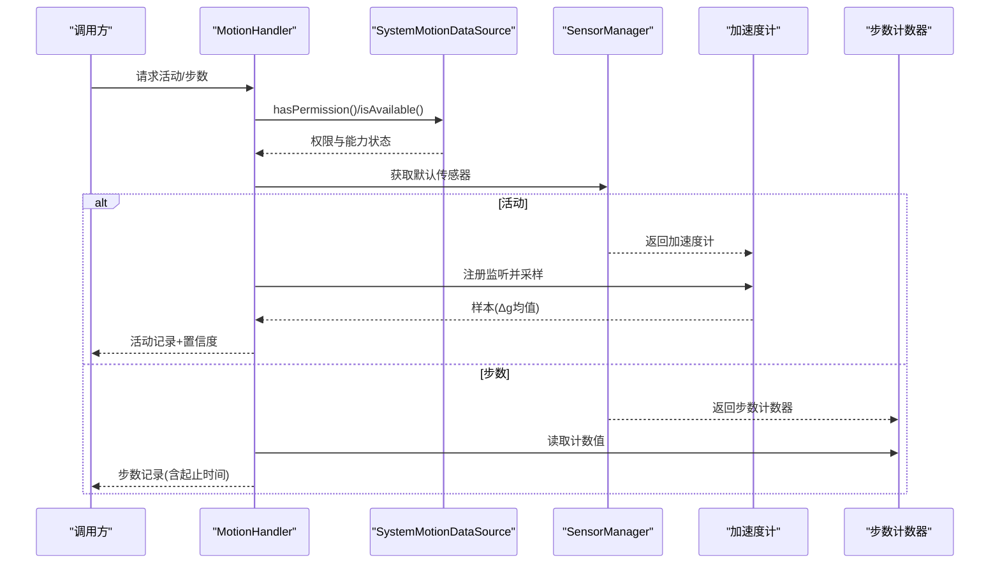
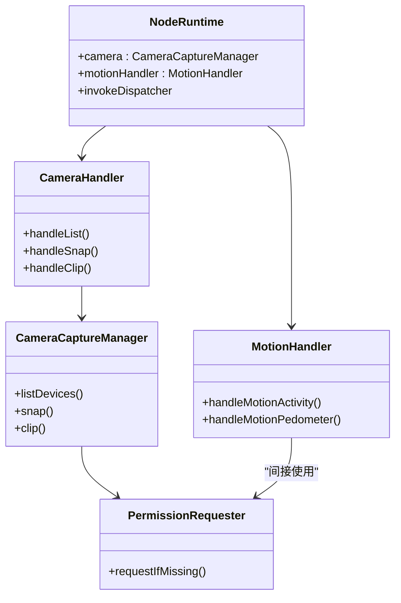

# 相机和语音控制

<cite>
**本文引用的文件**
- [apps/android/app/src/main/java/ai/openclaw/app/node/CameraHandler.kt](file://apps/android/app/src/main/java/ai/openclaw/app/node/CameraHandler.kt)
- [apps/android/app/src/main/java/ai/openclaw/app/node/CameraCaptureManager.kt](file://apps/android/app/src/main/java/ai/openclaw/app/node/CameraCaptureManager.kt)
- [apps/android/app/src/main/java/ai/openclaw/app/node/MotionHandler.kt](file://apps/android/app/src/main/java/ai/openclaw/app/node/MotionHandler.kt)
- [apps/android/app/src/main/java/ai/openclaw/app/node/JpegSizeLimiter.kt](file://apps/android/app/src/main/java/ai/openclaw/app/node/JpegSizeLimiter.kt)
- [apps/android/app/src/main/java/ai/openclaw/app/NodeRuntime.kt](file://apps/android/app/src/main/java/ai/openclaw/app/NodeRuntime.kt)
- [apps/android/app/src/main/java/ai/openclaw/app/PermissionRequester.kt](file://apps/android/app/src/main/java/ai/openclaw/app/PermissionRequester.kt)
- [apps/android/app/src/main/AndroidManifest.xml](file://apps/android/app/src/main/AndroidManifest.xml)
- [apps/android/app/src/main/java/ai/openclaw/app/ui/SettingsSheet.kt](file://apps/android/app/src/main/java/ai/openclaw/app/ui/SettingsSheet.kt)
- [apps/android/app/src/main/java/ai/openclaw/app/ui/OnboardingFlow.kt](file://apps/android/app/src/main/java/ai/openclaw/app/ui/OnboardingFlow.kt)
- [apps/android/app/src/main/java/ai/openclaw/app/node/DeviceHandler.kt](file://apps/android/app/src/main/java/ai/openclaw/app/node/DeviceHandler.kt)
</cite>

## 目录
1. [简介](#简介)
2. [项目结构](#项目结构)
3. [核心组件](#核心组件)
4. [架构总览](#架构总览)
5. [详细组件分析](#详细组件分析)
6. [依赖关系分析](#依赖关系分析)
7. [性能考量](#性能考量)
8. [故障排查指南](#故障排查指南)
9. [结论](#结论)
10. [附录](#附录)

## 简介
本文件面向OpenClaw Android节点应用的相机与语音控制模块，系统性梳理CameraHandler与CameraCaptureManager的实现架构，覆盖相机权限管理、预览控制、拍照与视频录制流程；同时详解MotionHandler的运动检测与处理机制，包括加速度传感器数据采集与运动事件识别。文档还提供相机参数配置、图像质量压缩策略、音频录制技术实现，并总结隐私保护、性能优化与用户体验改进建议。

## 项目结构
Android端相机与运动模块位于apps/android/app/src/main/java/ai/openclaw/app/node目录，配合NodeRuntime统一编排调用，权限请求通过PermissionRequester协调，UI侧在OnboardingFlow与SettingsSheet中呈现权限状态与引导。

图表来源
- [apps/android/app/src/main/java/ai/openclaw/app/NodeRuntime.kt](file://apps/android/app/src/main/java/ai/openclaw/app/NodeRuntime.kt#L44-L166)
- [apps/android/app/src/main/java/ai/openclaw/app/node/CameraHandler.kt](file://apps/android/app/src/main/java/ai/openclaw/app/node/CameraHandler.kt#L22-L94)
- [apps/android/app/src/main/java/ai/openclaw/app/node/CameraCaptureManager.kt](file://apps/android/app/src/main/java/ai/openclaw/app/node/CameraCaptureManager.kt#L44-L160)
- [apps/android/app/src/main/java/ai/openclaw/app/node/JpegSizeLimiter.kt](file://apps/android/app/src/main/java/ai/openclaw/app/node/JpegSizeLimiter.kt#L14-L61)
- [apps/android/app/src/main/java/ai/openclaw/app/PermissionRequester.kt](file://apps/android/app/src/main/java/ai/openclaw/app/PermissionRequester.kt#L33-L74)
- [apps/android/app/src/main/AndroidManifest.xml](file://apps/android/app/src/main/AndroidManifest.xml#L20-L30)
- [apps/android/app/src/main/java/ai/openclaw/app/ui/OnboardingFlow.kt](file://apps/android/app/src/main/java/ai/openclaw/app/ui/OnboardingFlow.kt#L310-L334)
- [apps/android/app/src/main/java/ai/openclaw/app/ui/SettingsSheet.kt](file://apps/android/app/src/main/java/ai/openclaw/app/ui/SettingsSheet.kt#L247-L270)
- [apps/android/app/src/main/java/ai/openclaw/app/node/DeviceHandler.kt](file://apps/android/app/src/main/java/ai/openclaw/app/node/DeviceHandler.kt#L130-L168)

章节来源
- [apps/android/app/src/main/java/ai/openclaw/app/NodeRuntime.kt](file://apps/android/app/src/main/java/ai/openclaw/app/NodeRuntime.kt#L44-L166)
- [apps/android/app/src/main/java/ai/openclaw/app/node/CameraHandler.kt](file://apps/android/app/src/main/java/ai/openclaw/app/node/CameraHandler.kt#L22-L94)
- [apps/android/app/src/main/java/ai/openclaw/app/node/CameraCaptureManager.kt](file://apps/android/app/src/main/java/ai/openclaw/app/node/CameraCaptureManager.kt#L44-L160)
- [apps/android/app/src/main/java/ai/openclaw/app/node/MotionHandler.kt](file://apps/android/app/src/main/java/ai/openclaw/app/node/MotionHandler.kt#L239-L376)
- [apps/android/app/src/main/java/ai/openclaw/app/PermissionRequester.kt](file://apps/android/app/src/main/java/ai/openclaw/app/PermissionRequester.kt#L33-L74)
- [apps/android/app/src/main/AndroidManifest.xml](file://apps/android/app/src/main/AndroidManifest.xml#L20-L30)
- [apps/android/app/src/main/java/ai/openclaw/app/ui/OnboardingFlow.kt](file://apps/android/app/src/main/java/ai/openclaw/app/ui/OnboardingFlow.kt#L310-L334)
- [apps/android/app/src/main/java/ai/openclaw/app/ui/SettingsSheet.kt](file://apps/android/app/src/main/java/ai/openclaw/app/ui/SettingsSheet.kt#L247-L270)
- [apps/android/app/src/main/java/ai/openclaw/app/node/DeviceHandler.kt](file://apps/android/app/src/main/java/ai/openclaw/app/node/DeviceHandler.kt#L130-L168)

## 核心组件
- CameraHandler：对外RPC入口，负责解析参数、触发HUD提示、调用CameraCaptureManager执行拍照/录像、进行结果封装与错误映射。
- CameraCaptureManager：相机底层实现，负责权限校验、生命周期绑定、拍照（含EXIF旋转与尺寸/质量压缩）、视频录制（含预览激活与音频开关）。
- JpegSizeLimiter：JPEG压缩限幅工具，按目标字节数迭代调整尺寸与质量，确保传输payload不超限。
- MotionHandler：运动检测入口，基于加速度计采样与阈值分类，输出活动状态与置信度；支持步数计数（若可用）。
- NodeRuntime：节点运行时，组装各处理器并注入依赖，暴露能力查询接口供连接管理器使用。

章节来源
- [apps/android/app/src/main/java/ai/openclaw/app/node/CameraHandler.kt](file://apps/android/app/src/main/java/ai/openclaw/app/node/CameraHandler.kt#L22-L176)
- [apps/android/app/src/main/java/ai/openclaw/app/node/CameraCaptureManager.kt](file://apps/android/app/src/main/java/ai/openclaw/app/node/CameraCaptureManager.kt#L44-L266)
- [apps/android/app/src/main/java/ai/openclaw/app/node/JpegSizeLimiter.kt](file://apps/android/app/src/main/java/ai/openclaw/app/node/JpegSizeLimiter.kt#L14-L61)
- [apps/android/app/src/main/java/ai/openclaw/app/node/MotionHandler.kt](file://apps/android/app/src/main/java/ai/openclaw/app/node/MotionHandler.kt#L239-L376)
- [apps/android/app/src/main/java/ai/openclaw/app/NodeRuntime.kt](file://apps/android/app/src/main/java/ai/openclaw/app/NodeRuntime.kt#L44-L166)

## 架构总览
相机与语音控制模块围绕“RPC入口—底层实现—权限与UI”的分层设计展开。CameraHandler作为RPC入口，将用户意图转化为具体参数后委派给CameraCaptureManager；后者通过CameraX完成相机绑定、拍照与录制；MotionHandler则独立于相机，直接访问系统传感器进行运动识别。

图表来源
- [apps/android/app/src/main/java/ai/openclaw/app/node/CameraHandler.kt](file://apps/android/app/src/main/java/ai/openclaw/app/node/CameraHandler.kt#L58-L154)
- [apps/android/app/src/main/java/ai/openclaw/app/node/CameraCaptureManager.kt](file://apps/android/app/src/main/java/ai/openclaw/app/node/CameraCaptureManager.kt#L97-L266)
- [apps/android/app/src/main/java/ai/openclaw/app/PermissionRequester.kt](file://apps/android/app/src/main/java/ai/openclaw/app/PermissionRequester.kt#L33-L74)

## 详细组件分析

### 相机模块：CameraHandler 与 CameraCaptureManager
- 参数解析与校验
  - 支持facing/front/back、deviceId、quality、maxWidth、durationMs、includeAudio等参数；对数值范围进行裁剪，保证安全边界。
  - 录像时强制最低画质以减小文件体积，便于WebSocket传输。
- 权限管理
  - 拍照前检查相机权限，录音前检查麦克风权限；未授权时通过PermissionRequester发起请求，必要时展示理由对话框。
- 预览与录制
  - 录制前必须绑定预览用例以激活编码器，避免无有效数据错误；录制完成后等待Finalize事件并处理错误。
- 图像处理与压缩
  - 拍照后根据EXIF方向旋转，按最大宽度缩放，再通过JpegSizeLimiter按目标字节数压缩，确保Base64后不超过API限制。
- 结果封装
  - 拍照返回格式、宽高与Base64；录像返回MP4文件的Base64、时长与是否包含音频。

图表来源
- [apps/android/app/src/main/java/ai/openclaw/app/node/CameraCaptureManager.kt](file://apps/android/app/src/main/java/ai/openclaw/app/node/CameraCaptureManager.kt#L97-L266)
- [apps/android/app/src/main/java/ai/openclaw/app/node/JpegSizeLimiter.kt](file://apps/android/app/src/main/java/ai/openclaw/app/node/JpegSizeLimiter.kt#L14-L61)
- [apps/android/app/src/main/java/ai/openclaw/app/node/CameraHandler.kt](file://apps/android/app/src/main/java/ai/openclaw/app/node/CameraHandler.kt#L58-L154)

章节来源
- [apps/android/app/src/main/java/ai/openclaw/app/node/CameraHandler.kt](file://apps/android/app/src/main/java/ai/openclaw/app/node/CameraHandler.kt#L58-L154)
- [apps/android/app/src/main/java/ai/openclaw/app/node/CameraCaptureManager.kt](file://apps/android/app/src/main/java/ai/openclaw/app/node/CameraCaptureManager.kt#L97-L266)
- [apps/android/app/src/main/java/ai/openclaw/app/node/JpegSizeLimiter.kt](file://apps/android/app/src/main/java/ai/openclaw/app/node/JpegSizeLimiter.kt#L14-L61)

### 运动模块：MotionHandler 的加速度采集与识别
- 能力探测
  - 通过系统SensorManager探测加速度计与步数计数器是否存在，据此判断能力可用性。
- 权限要求
  - 使用加速度计与步数计数需ACTIVITY_RECOGNITION权限。
- 数据采集
  - 加速度计：注册监听，计算三轴向量模长与重力差值，累计足够样本后计算平均Δg。
  - 步数计数：读取TYPE_STEP_COUNTER传感器当前计数值，结合系统开机时间换算起止时间。
- 分类与置信度
  - 基于平均Δg阈值将状态分为静止/步行/跑步；根据样本数量与Δg幅度给出低/中/高置信度。

图表来源
- [apps/android/app/src/main/java/ai/openclaw/app/node/MotionHandler.kt](file://apps/android/app/src/main/java/ai/openclaw/app/node/MotionHandler.kt#L75-L138)
- [apps/android/app/src/main/java/ai/openclaw/app/node/MotionHandler.kt](file://apps/android/app/src/main/java/ai/openclaw/app/node/MotionHandler.kt#L239-L376)

章节来源
- [apps/android/app/src/main/java/ai/openclaw/app/node/MotionHandler.kt](file://apps/android/app/src/main/java/ai/openclaw/app/node/MotionHandler.kt#L75-L138)
- [apps/android/app/src/main/java/ai/openclaw/app/node/MotionHandler.kt](file://apps/android/app/src/main/java/ai/openclaw/app/node/MotionHandler.kt#L239-L376)

### 权限管理与隐私保护
- 权限声明
  - 在清单中声明相机、麦克风、位置、联系人、日历、通知、运动识别等权限。
- 动态请求
  - 通过PermissionRequester统一发起权限请求，支持理由说明与超时控制。
- UI呈现
  - OnboardingFlow与SettingsSheet展示权限开关与状态，便于用户理解与操作。
- 设备能力与权限状态
  - DeviceHandler汇总相机、麦克风、运动识别等权限状态，供上层逻辑使用。

章节来源
- [apps/android/app/src/main/AndroidManifest.xml](file://apps/android/app/src/main/AndroidManifest.xml#L20-L30)
- [apps/android/app/src/main/java/ai/openclaw/app/PermissionRequester.kt](file://apps/android/app/src/main/java/ai/openclaw/app/PermissionRequester.kt#L33-L74)
- [apps/android/app/src/main/java/ai/openclaw/app/ui/OnboardingFlow.kt](file://apps/android/app/src/main/java/ai/openclaw/app/ui/OnboardingFlow.kt#L310-L334)
- [apps/android/app/src/main/java/ai/openclaw/app/ui/SettingsSheet.kt](file://apps/android/app/src/main/java/ai/openclaw/app/ui/SettingsSheet.kt#L247-L270)
- [apps/android/app/src/main/java/ai/openclaw/app/node/DeviceHandler.kt](file://apps/android/app/src/main/java/ai/openclaw/app/node/DeviceHandler.kt#L130-L168)

## 依赖关系分析
- 耦合与内聚
  - CameraHandler与CameraCaptureManager通过职责分离实现高内聚低耦合；前者专注RPC与用户体验，后者专注底层实现。
  - MotionHandler与系统SensorManager强耦合但通过接口抽象隔离了测试与平台差异。
- 外部依赖
  - CameraX用于相机绑定与录制；Android系统传感器用于运动识别；权限框架用于动态授权。
- 循环依赖
  - 未发现循环依赖；NodeRuntime统一装配，避免相互引用。

图表来源
- [apps/android/app/src/main/java/ai/openclaw/app/NodeRuntime.kt](file://apps/android/app/src/main/java/ai/openclaw/app/NodeRuntime.kt#L44-L166)
- [apps/android/app/src/main/java/ai/openclaw/app/node/CameraHandler.kt](file://apps/android/app/src/main/java/ai/openclaw/app/node/CameraHandler.kt#L22-L94)
- [apps/android/app/src/main/java/ai/openclaw/app/node/CameraCaptureManager.kt](file://apps/android/app/src/main/java/ai/openclaw/app/node/CameraCaptureManager.kt#L44-L112)
- [apps/android/app/src/main/java/ai/openclaw/app/PermissionRequester.kt](file://apps/android/app/src/main/java/ai/openclaw/app/PermissionRequester.kt#L33-L74)

章节来源
- [apps/android/app/src/main/java/ai/openclaw/app/NodeRuntime.kt](file://apps/android/app/src/main/java/ai/openclaw/app/NodeRuntime.kt#L44-L166)
- [apps/android/app/src/main/java/ai/openclaw/app/node/CameraHandler.kt](file://apps/android/app/src/main/java/ai/openclaw/app/node/CameraHandler.kt#L22-L94)
- [apps/android/app/src/main/java/ai/openclaw/app/node/CameraCaptureManager.kt](file://apps/android/app/src/main/java/ai/openclaw/app/node/CameraCaptureManager.kt#L44-L112)
- [apps/android/app/src/main/java/ai/openclaw/app/PermissionRequester.kt](file://apps/android/app/src/main/java/ai/openclaw/app/PermissionRequester.kt#L33-L74)

## 性能考量
- 相机
  - 录像采用最低画质与Dummy预览Surface，降低CPU/GPU占用与文件体积。
  - 拍照阶段先缩放再压缩，避免超大Base64导致传输失败。
  - 通过JpegSizeLimiter二分逼近目标大小，兼顾清晰度与体积。
- 运动识别
  - 加速度采样设定固定目标与超时，避免长时间监听造成电量消耗。
  - 步数计数仅读取瞬时值，减少监听开销。
- 权限与UI
  - 权限请求合并与去重，避免重复弹窗；引导页与设置页集中呈现，提升用户效率。

章节来源
- [apps/android/app/src/main/java/ai/openclaw/app/node/CameraCaptureManager.kt](file://apps/android/app/src/main/java/ai/openclaw/app/node/CameraCaptureManager.kt#L162-L266)
- [apps/android/app/src/main/java/ai/openclaw/app/node/CameraCaptureManager.kt](file://apps/android/app/src/main/java/ai/openclaw/app/node/CameraCaptureManager.kt#L97-L160)
- [apps/android/app/src/main/java/ai/openclaw/app/node/JpegSizeLimiter.kt](file://apps/android/app/src/main/java/ai/openclaw/app/node/JpegSizeLimiter.kt#L14-L61)
- [apps/android/app/src/main/java/ai/openclaw/app/node/MotionHandler.kt](file://apps/android/app/src/main/java/ai/openclaw/app/node/MotionHandler.kt#L175-L222)
- [apps/android/app/src/main/java/ai/openclaw/app/PermissionRequester.kt](file://apps/android/app/src/main/java/ai/openclaw/app/PermissionRequester.kt#L33-L74)

## 故障排查指南
- 相机/麦克风权限未授予
  - 现象：抛出“CAMERA_PERMISSION_REQUIRED”或“MIC_PERMISSION_REQUIRED”。
  - 排查：确认清单声明与运行时请求流程；检查OnboardingFlow与SettingsSheet中的权限状态。
- 录制失败或超时
  - 现象：Finalize事件带错误或超时。
  - 排查：检查预览绑定是否成功、设备是否被其他应用占用、存储空间是否充足。
- 录像文件过大
  - 现象：超过payload上限，返回“PAYLOAD_TOO_LARGE”。
  - 排查：缩短时长、降低分辨率或关闭音频；确认最低画质策略已启用。
- 运动识别不可用
  - 现象：返回“MOTION_UNAVAILABLE”或历史范围不支持。
  - 排查：确认具备ACTIVITY_RECOGNITION权限；检查加速度计与步数计数器是否存在。

章节来源
- [apps/android/app/src/main/java/ai/openclaw/app/node/CameraHandler.kt](file://apps/android/app/src/main/java/ai/openclaw/app/node/CameraHandler.kt#L96-L154)
- [apps/android/app/src/main/java/ai/openclaw/app/node/CameraCaptureManager.kt](file://apps/android/app/src/main/java/ai/openclaw/app/node/CameraCaptureManager.kt#L162-L266)
- [apps/android/app/src/main/java/ai/openclaw/app/node/MotionHandler.kt](file://apps/android/app/src/main/java/ai/openclaw/app/node/MotionHandler.kt#L91-L116)
- [apps/android/app/src/main/AndroidManifest.xml](file://apps/android/app/src/main/AndroidManifest.xml#L20-L30)
- [apps/android/app/src/main/java/ai/openclaw/app/ui/OnboardingFlow.kt](file://apps/android/app/src/main/java/ai/openclaw/app/ui/OnboardingFlow.kt#L310-L334)
- [apps/android/app/src/main/java/ai/openclaw/app/ui/SettingsSheet.kt](file://apps/android/app/src/main/java/ai/openclaw/app/ui/SettingsSheet.kt#L247-L270)

## 结论
相机与语音控制模块在Android端通过CameraHandler与CameraCaptureManager实现了从参数解析到图像/视频产出的完整链路，并以JpegSizeLimiter保障传输稳定性；MotionHandler则以轻量采样与阈值分类提供可靠的运动识别能力。配合统一的权限请求与UI呈现，整体在功能完整性、性能与用户体验之间取得平衡。

## 附录
- 相机参数与行为
  - facing: front/back，默认front；deviceId优先于facing。
  - quality: 0.1~1.0，默认0.95；用于JPEG压缩初始质量。
  - maxWidth: 最大宽度，用于缩放；超过将按比例缩放。
  - durationMs: 录像时长，200~60000ms；过短可能导致无有效数据，过长可能超载。
  - includeAudio: 是否包含音频，默认true；开启时需麦克风权限。
- 运动识别参数
  - limit: 样本数量上限，1~1000，默认200。
  - startISO/endISO: 历史范围在Android上不支持，会返回错误。
- 隐私与合规建议
  - 明确告知用户相机/麦克风/运动数据用途；提供最小化授权选项。
  - 对外传输前本地压缩与清理元数据，避免敏感信息泄露。
  - 提供便捷的权限开关与撤销路径，尊重用户控制权。