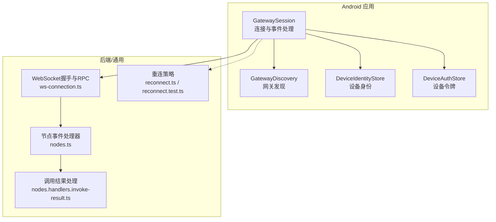
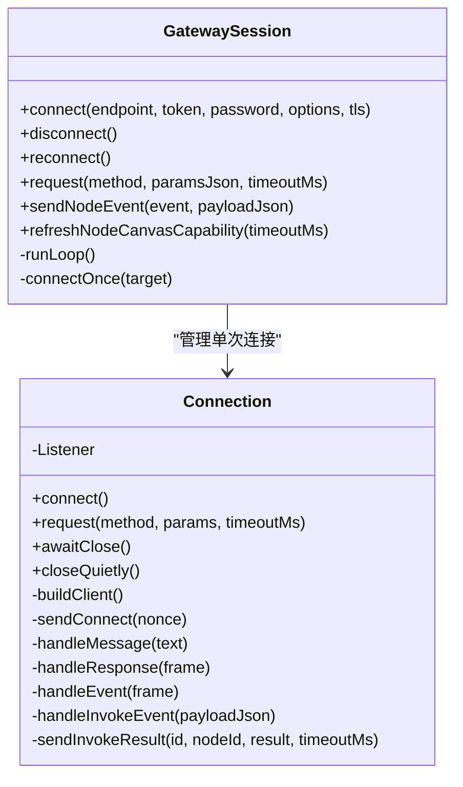
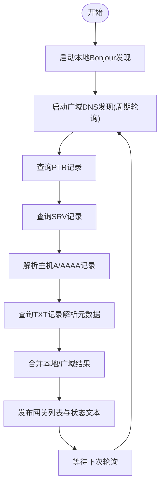
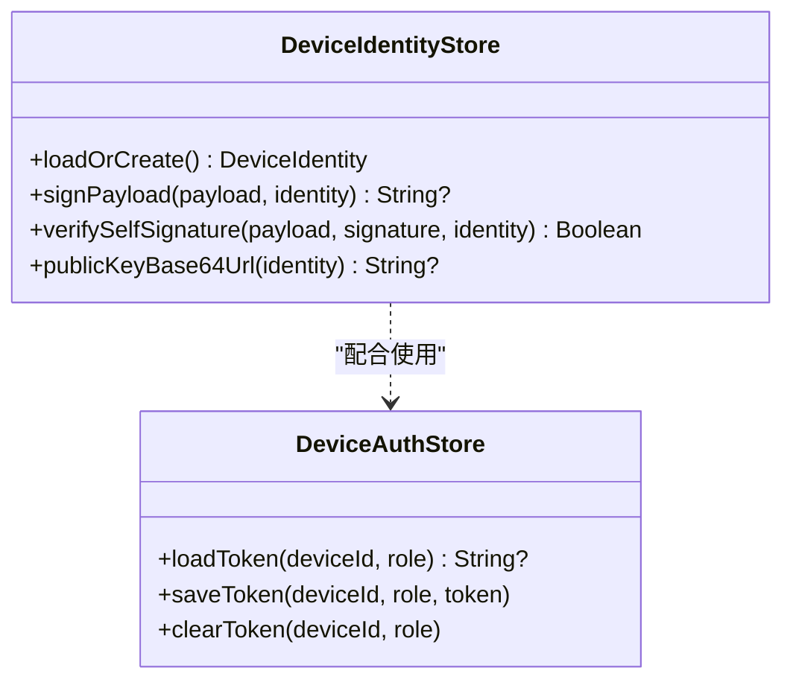
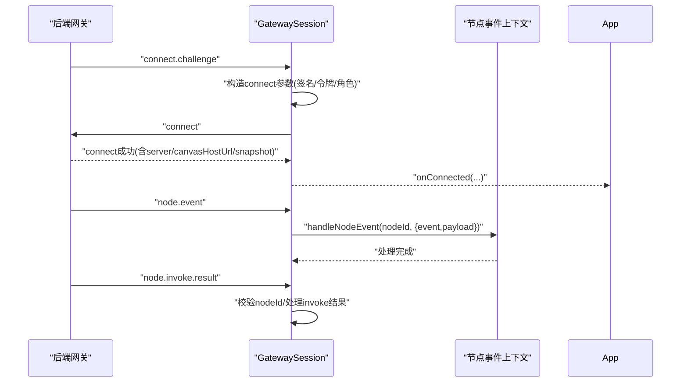
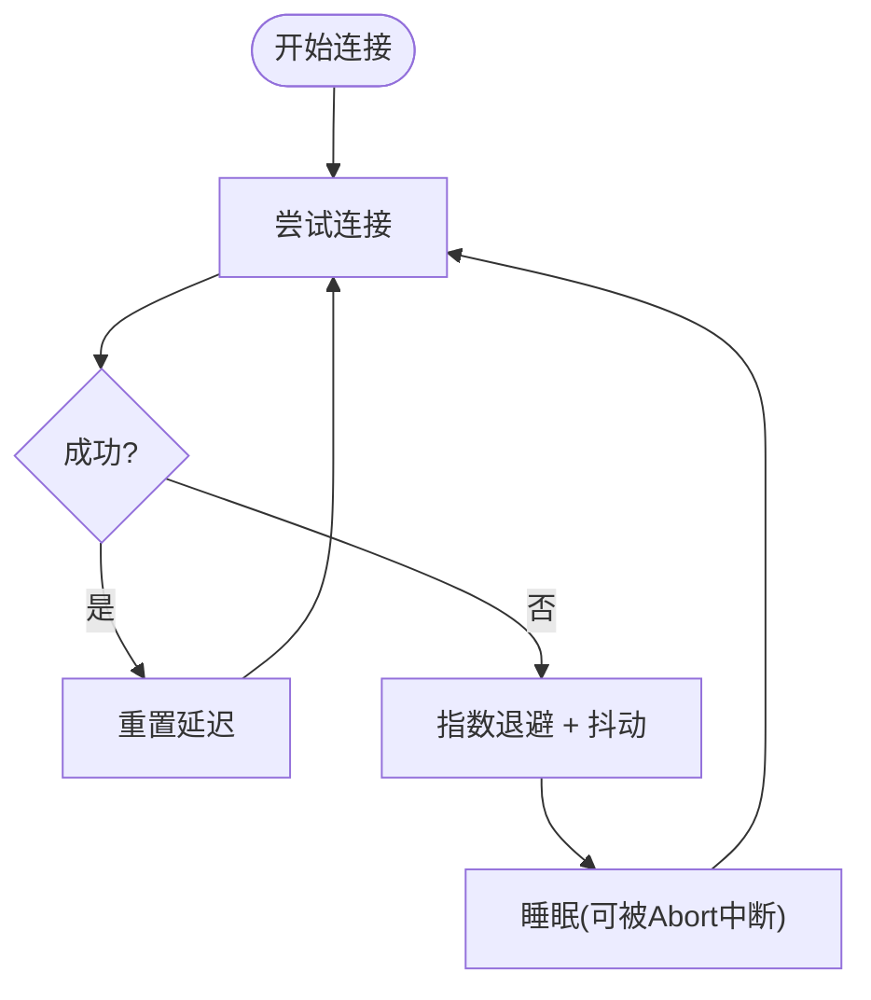
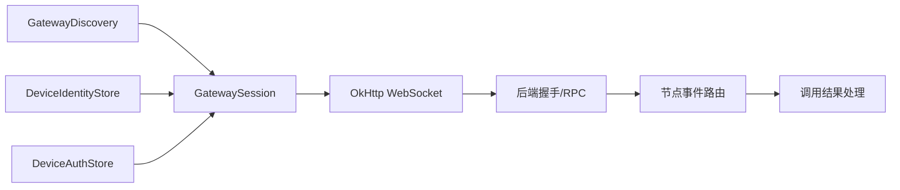

# 连接管理

<cite>
**本文引用的文件**
- [GatewaySession.kt](file://apps/android/app/src/main/java/ai/openclaw/app/gateway/GatewaySession.kt)
- [GatewayDiscovery.kt](file://apps/android/app/src/main/java/ai/openclaw/app/gateway/GatewayDiscovery.kt)
- [DeviceAuthStore.kt](file://apps/android/app/src/main/java/ai/openclaw/app/gateway/DeviceAuthStore.kt)
- [DeviceIdentityStore.kt](file://apps/android/app/src/main/java/ai/openclaw/app/gateway/DeviceIdentityStore.kt)
- [openai-ws-connection.ts](file://src/agents/openai-ws-connection.ts)
- [openai-ws-connection.test.ts](file://src/agents/openai-ws-connection.test.ts)
- [ws-connection.ts](file://src/gateway/server/ws-connection.ts)
- [nodes.handlers.invoke-result.ts](file://src/gateway/server-methods/nodes.handlers.invoke-result.ts)
- [nodes.ts](file://src/gateway/server-methods/nodes.ts)
- [server-node-events-types.ts](file://src/gateway/server-node-events-types.ts)
- [reconnect.test.ts](file://src/web/reconnect.test.ts)
- [reconnect.ts](file://extensions/mattermost/src/mattermost/reconnect.ts)
- [gateway-e2e-harness.ts](file://test/helpers/gateway-e2e-harness.ts)
</cite>

## 目录
1. [简介](#简介)
2. [项目结构](#项目结构)
3. [核心组件](#核心组件)
4. [架构总览](#架构总览)
5. [详细组件分析](#详细组件分析)
6. [依赖关系分析](#依赖关系分析)
7. [性能考量](#性能考量)
8. [故障排查指南](#故障排查指南)
9. [结论](#结论)

## 简介
本文件面向OpenClaw Android节点应用的“连接管理”模块，系统性阐述WebSocket连接建立、维护、断开与重连的全流程；详解心跳与超时控制、重连策略与退避算法、错误处理与异常恢复；并深入解析GatewayEventHandler（在Android侧以GatewaySession中的事件分发体现）的事件处理机制，包括节点状态同步、消息路由与异常恢复。同时给出连接配置参数、网络超时设置与安全认证的实现细节，并提供故障排查与性能优化建议。

## 项目结构
Android侧连接管理主要由以下文件构成：
- GatewaySession：负责WebSocket连接生命周期、RPC请求/响应、事件分发、重连与TLS配置
- GatewayDiscovery：负责网关发现（本地Bonjour与广域DNS查询）
- DeviceIdentityStore/DeviceAuthStore：设备身份与令牌持久化与签名验证
- 对应的后端与通用重连逻辑位于src与extensions目录中，用于理解协议与重连策略

**图表来源**
- [GatewaySession.kt](file://apps/android/app/src/main/java/ai/openclaw/app/gateway/GatewaySession.kt#L55-L130)
- [GatewayDiscovery.kt](file://apps/android/app/src/main/java/ai/openclaw/app/gateway/GatewayDiscovery.kt#L47-L97)
- [DeviceIdentityStore.kt](file://apps/android/app/src/main/java/ai/openclaw/app/gateway/DeviceIdentityStore.kt#L18-L42)
- [DeviceAuthStore.kt](file://apps/android/app/src/main/java/ai/openclaw/app/gateway/DeviceAuthStore.kt#L10-L19)
- [ws-connection.ts](file://src/gateway/server/ws-connection.ts#L141-L179)
- [nodes.ts](file://src/gateway/server-methods/nodes.ts#L1012-L1052)
- [nodes.handlers.invoke-result.ts](file://src/gateway/server-methods/nodes.handlers.invoke-result.ts#L25-L71)
- [reconnect.ts](file://extensions/mattermost/src/mattermost/reconnect.ts#L39-L103)

**章节来源**
- [GatewaySession.kt](file://apps/android/app/src/main/java/ai/openclaw/app/gateway/GatewaySession.kt#L55-L130)
- [GatewayDiscovery.kt](file://apps/android/app/src/main/java/ai/openclaw/app/gateway/GatewayDiscovery.kt#L47-L97)

## 核心组件
- GatewaySession：Android侧WebSocket客户端，封装连接、RPC、事件、重连、TLS与超时配置
- GatewayDiscovery：本地与广域DNS网关发现，提供可用网关列表与状态文本
- DeviceIdentityStore/DeviceAuthStore：设备身份生成/加载、Ed25519签名、令牌存储与加载
- 后端握手与方法处理：服务端WebSocket握手、节点事件路由与调用结果处理
- 通用重连策略：指数退避、抖动、中断与最大延迟控制

**章节来源**
- [GatewaySession.kt](file://apps/android/app/src/main/java/ai/openclaw/app/gateway/GatewaySession.kt#L219-L303)
- [GatewayDiscovery.kt](file://apps/android/app/src/main/java/ai/openclaw/app/gateway/GatewayDiscovery.kt#L47-L97)
- [DeviceIdentityStore.kt](file://apps/android/app/src/main/java/ai/openclaw/app/gateway/DeviceIdentityStore.kt#L18-L42)
- [DeviceAuthStore.kt](file://apps/android/app/src/main/java/ai/openclaw/app/gateway/DeviceAuthStore.kt#L10-L19)
- [ws-connection.ts](file://src/gateway/server/ws-connection.ts#L141-L179)
- [nodes.ts](file://src/gateway/server-methods/nodes.ts#L1012-L1052)
- [nodes.handlers.invoke-result.ts](file://src/gateway/server-methods/nodes.handlers.invoke-result.ts#L25-L71)
- [reconnect.ts](file://extensions/mattermost/src/mattermost/reconnect.ts#L39-L103)

## 架构总览
Android侧通过GatewaySession与后端建立WebSocket连接，完成握手与认证后进入RPC与事件循环。GatewayDiscovery提供候选网关，DeviceIdentityStore/DeviceAuthStore提供设备身份与令牌。后端通过握手发送connect.challenge，客户端据此构造connect请求并完成认证。随后GatewaySession负责事件分发、RPC调用与重连。

```mermaid
sequenceDiagram
participant App as "Android 应用"
participant GS as "GatewaySession"
participant OKHttp as "OkHttp 客户端"
participant GW as "后端网关"
App->>GS : "connect(endpoint, token, options)"
GS->>OKHttp : "newWebSocket(ws : //... 或 wss : //...)"
OKHttp-->>GS : "onOpen()"
GS->>GW : "发送 connect.challenge 请求"
GW-->>GS : "返回 connect.challenge(nonce)"
GS->>GS : "构建 connect 参数(设备签名/令牌/角色等)"
GS->>GW : "请求 connect"
GW-->>GS : "返回 connect 成功(含 server/canvasHostUrl/snapshot)"
GS-->>App : "回调 onConnected(serverName, remoteAddress, mainSessionKey)"
loop "消息循环"
GW-->>GS : "事件/响应"
GS->>GS : "handleMessage() 分发"
GS-->>App : "onEvent()/onInvoke()"
end
GW-->>GS : "连接关闭/异常"
GS->>GS : "runLoop() 指数退避重连"
```

**图表来源**
- [GatewaySession.kt](file://apps/android/app/src/main/java/ai/openclaw/app/gateway/GatewaySession.kt#L241-L359)
- [GatewaySession.kt](file://apps/android/app/src/main/java/ai/openclaw/app/gateway/GatewaySession.kt#L305-L343)
- [ws-connection.ts](file://src/gateway/server/ws-connection.ts#L141-L179)

## 详细组件分析

### GatewaySession：连接、心跳、重连与事件处理
- 连接建立
  - 使用OkHttp创建WebSocket，支持wss与TLS配置（SSL Socket Factory与Hostname Verifier）
  - 建立连接后等待后端的connect.challenge，提取nonce并发送connect请求
  - connect成功后解析server信息、canvasHostUrl与会话默认值，触发onConnected回调
- 心跳与超时
  - OkHttp客户端配置了写超时、读超时与ping间隔，确保长连接保活
  - Android侧未显式实现应用层心跳定时器，依赖OkHttp ping与后端握手/事件维持活跃
- RPC与事件
  - request方法基于JSON-RPC，使用UUID生成请求ID，挂起CompletableDeferred等待响应
  - handleMessage根据帧类型分发到handleResponse或handleEvent
  - node.invoke.request事件通过onInvoke回调交由上层处理，并回传node.invoke.result
- 重连策略
  - runLoop采用指数退避（基础系数与幂次），上限至固定毫秒级，避免风暴
  - 连接失败时更新状态文本，重试直至成功或取消
- 错误处理
  - onOpen失败、onFailure/onClosed均标记连接关闭，清理挂起请求并触发onDisconnected
  - connect超时与挑战超时有明确异常抛出

**图表来源**
- [GatewaySession.kt](file://apps/android/app/src/main/java/ai/openclaw/app/gateway/GatewaySession.kt#L107-L135)
- [GatewaySession.kt](file://apps/android/app/src/main/java/ai/openclaw/app/gateway/GatewaySession.kt#L219-L303)
- [GatewaySession.kt](file://apps/android/app/src/main/java/ai/openclaw/app/gateway/GatewaySession.kt#L470-L598)

**章节来源**
- [GatewaySession.kt](file://apps/android/app/src/main/java/ai/openclaw/app/gateway/GatewaySession.kt#L290-L303)
- [GatewaySession.kt](file://apps/android/app/src/main/java/ai/openclaw/app/gateway/GatewaySession.kt#L305-L343)
- [GatewaySession.kt](file://apps/android/app/src/main/java/ai/openclaw/app/gateway/GatewaySession.kt#L470-L598)
- [GatewaySession.kt](file://apps/android/app/src/main/java/ai/openclaw/app/gateway/GatewaySession.kt#L600-L635)

### GatewayDiscovery：网关发现与状态
- 本地发现：通过NsdManager扫描Bonjour服务，解析TXT记录获取网关元数据
- 广域发现：通过DNS查询PTR/SRV/TXT记录，解析实例名、主机、端口、TLS指纹等
- 状态文本：聚合本地与广域发现结果，输出当前状态提示
- 线程模型：IO协程持续刷新广域发现，本地发现由系统回调驱动

**图表来源**
- [GatewayDiscovery.kt](file://apps/android/app/src/main/java/ai/openclaw/app/gateway/GatewayDiscovery.kt#L99-L127)
- [GatewayDiscovery.kt](file://apps/android/app/src/main/java/ai/openclaw/app/gateway/GatewayDiscovery.kt#L221-L293)
- [GatewayDiscovery.kt](file://apps/android/app/src/main/java/ai/openclaw/app/gateway/GatewayDiscovery.kt#L336-L463)

**章节来源**
- [GatewayDiscovery.kt](file://apps/android/app/src/main/java/ai/openclaw/app/gateway/GatewayDiscovery.kt#L47-L97)
- [GatewayDiscovery.kt](file://apps/android/app/src/main/java/ai/openclaw/app/gateway/GatewayDiscovery.kt#L99-L127)
- [GatewayDiscovery.kt](file://apps/android/app/src/main/java/ai/openclaw/app/gateway/GatewayDiscovery.kt#L221-L293)

### 设备身份与认证：DeviceIdentityStore/DeviceAuthStore
- DeviceIdentityStore
  - 加载或生成设备身份（Ed25519密钥对），计算deviceId（公钥SHA-256十六进制）
  - 提供签名与自验证接口，用于connect请求中的设备签名
- DeviceAuthStore
  - 基于SecurePrefs按设备ID与角色存储/读取网关令牌
  - 支持清除令牌

**图表来源**
- [DeviceIdentityStore.kt](file://apps/android/app/src/main/java/ai/openclaw/app/gateway/DeviceIdentityStore.kt#L18-L42)
- [DeviceIdentityStore.kt](file://apps/android/app/src/main/java/ai/openclaw/app/gateway/DeviceIdentityStore.kt#L44-L77)
- [DeviceAuthStore.kt](file://apps/android/app/src/main/java/ai/openclaw/app/gateway/DeviceAuthStore.kt#L10-L19)

**章节来源**
- [DeviceIdentityStore.kt](file://apps/android/app/src/main/java/ai/openclaw/app/gateway/DeviceIdentityStore.kt#L18-L42)
- [DeviceIdentityStore.kt](file://apps/android/app/src/main/java/ai/openclaw/app/gateway/DeviceIdentityStore.kt#L44-L77)
- [DeviceAuthStore.kt](file://apps/android/app/src/main/java/ai/openclaw/app/gateway/DeviceAuthStore.kt#L10-L19)

### 后端握手、事件路由与调用结果处理
- 握手与挑战
  - 服务端在onOpen后发送connect.challenge，携带随机nonce与时间戳
  - 客户端收到后提取nonce并发送connect请求
- 节点事件路由
  - 服务端接收node.event并转发给handleNodeEvent上下文，进行节点订阅、广播、健康缓存等处理
- 调用结果处理
  - 服务端接收node.invoke.result，校验nodeId一致性，交由nodeRegistry处理
  - 对于超时后的晚到结果，记录日志并返回忽略标志，避免噪声

**图表来源**
- [ws-connection.ts](file://src/gateway/server/ws-connection.ts#L141-L179)
- [nodes.ts](file://src/gateway/server-methods/nodes.ts#L1012-L1052)
- [nodes.handlers.invoke-result.ts](file://src/gateway/server-methods/nodes.handlers.invoke-result.ts#L25-L71)

**章节来源**
- [ws-connection.ts](file://src/gateway/server/ws-connection.ts#L141-L179)
- [nodes.ts](file://src/gateway/server-methods/nodes.ts#L1012-L1052)
- [nodes.handlers.invoke-result.ts](file://src/gateway/server-methods/nodes.handlers.invoke-result.ts#L25-L71)

### 重连策略与退避算法
- 指数退避：每次失败将延迟乘以系数，上限至固定毫秒级
- 抖动：在退避基础上加入抖动，降低同时重连风暴
- 中断：AbortSignal可立即打断睡眠，快速退出
- 上层测试验证默认心跳与重连策略解析、抖动与中断行为

**图表来源**
- [reconnect.ts](file://extensions/mattermost/src/mattermost/reconnect.ts#L39-L103)
- [reconnect.test.ts](file://src/web/reconnect.test.ts#L12-L51)

**章节来源**
- [GatewaySession.kt](file://apps/android/app/src/main/java/ai/openclaw/app/gateway/GatewaySession.kt#L600-L622)
- [reconnect.ts](file://extensions/mattermost/src/mattermost/reconnect.ts#L39-L103)
- [reconnect.test.ts](file://src/web/reconnect.test.ts#L12-L51)

## 依赖关系分析
- GatewaySession依赖OkHttp进行WebSocket通信，依赖DeviceIdentityStore/DeviceAuthStore进行设备身份与令牌管理
- GatewayDiscovery为GatewaySession提供候选网关列表
- 后端通过握手与RPC方法与Android侧交互，事件路由与调用结果处理由服务端方法实现

**图表来源**
- [GatewaySession.kt](file://apps/android/app/src/main/java/ai/openclaw/app/gateway/GatewaySession.kt#L55-L130)
- [GatewayDiscovery.kt](file://apps/android/app/src/main/java/ai/openclaw/app/gateway/GatewayDiscovery.kt#L47-L97)
- [DeviceIdentityStore.kt](file://apps/android/app/src/main/java/ai/openclaw/app/gateway/DeviceIdentityStore.kt#L18-L42)
- [DeviceAuthStore.kt](file://apps/android/app/src/main/java/ai/openclaw/app/gateway/DeviceAuthStore.kt#L10-L19)
- [ws-connection.ts](file://src/gateway/server/ws-connection.ts#L141-L179)
- [nodes.ts](file://src/gateway/server-methods/nodes.ts#L1012-L1052)
- [nodes.handlers.invoke-result.ts](file://src/gateway/server-methods/nodes.handlers.invoke-result.ts#L25-L71)

**章节来源**
- [GatewaySession.kt](file://apps/android/app/src/main/java/ai/openclaw/app/gateway/GatewaySession.kt#L55-L130)
- [GatewayDiscovery.kt](file://apps/android/app/src/main/java/ai/openclaw/app/gateway/GatewayDiscovery.kt#L47-L97)
- [DeviceIdentityStore.kt](file://apps/android/app/src/main/java/ai/openclaw/app/gateway/DeviceIdentityStore.kt#L18-L42)
- [DeviceAuthStore.kt](file://apps/android/app/src/main/java/ai/openclaw/app/gateway/DeviceAuthStore.kt#L10-L19)
- [ws-connection.ts](file://src/gateway/server/ws-connection.ts#L141-L179)
- [nodes.ts](file://src/gateway/server-methods/nodes.ts#L1012-L1052)
- [nodes.handlers.invoke-result.ts](file://src/gateway/server-methods/nodes.handlers.invoke-result.ts#L25-L71)

## 性能考量
- 连接保活：OkHttp ping间隔与后端握手/事件维持连接活跃，减少空闲断线
- 退避上限：Android侧runLoop退避上限固定，避免长时间无进展
- 请求超时：RPC请求默认超时与invoke结果确认超时范围合理，兼顾稳定性与及时性
- 广域发现：DNS轮询周期与解析失败容错，避免阻塞主流程
- 建议
  - 在弱网环境适当提高写超时与ping间隔
  - 避免在事件处理中执行耗时操作，必要时异步化
  - 对高频事件进行去重或节流，降低带宽与CPU占用

[本节为通用指导，无需列出具体文件来源]

## 故障排查指南
- 连接无法建立
  - 检查网关发现是否返回候选网关，确认TLS指纹与域名配置
  - 查看connect.challenge是否到达，connect请求是否返回成功
  - 关注onFailure/onClosed回调中的异常信息
- 连接频繁断开
  - 观察runLoop退避日志，确认是否存在网络波动
  - 检查OkHttp ping是否正常，后端是否定期下发事件
- 认证失败
  - 确认设备签名与令牌是否正确生成与保存
  - 检查connect参数中的角色、作用域与权限
- 事件未送达或invoke结果异常
  - 核对nodeId一致性与invoke超时设置
  - 检查晚到结果的日志与忽略标志
- 端到端验证
  - 使用e2e工具等待节点状态变为已连接与配对

**章节来源**
- [GatewaySession.kt](file://apps/android/app/src/main/java/ai/openclaw/app/gateway/GatewaySession.kt#L322-L343)
- [GatewaySession.kt](file://apps/android/app/src/main/java/ai/openclaw/app/gateway/GatewaySession.kt#L600-L622)
- [DeviceIdentityStore.kt](file://apps/android/app/src/main/java/ai/openclaw/app/gateway/DeviceIdentityStore.kt#L44-L77)
- [DeviceAuthStore.kt](file://apps/android/app/src/main/java/ai/openclaw/app/gateway/DeviceAuthStore.kt#L10-L19)
- [nodes.handlers.invoke-result.ts](file://src/gateway/server-methods/nodes.handlers.invoke-result.ts#L25-L71)
- [gateway-e2e-harness.ts](file://test/helpers/gateway-e2e-harness.ts#L339-L362)

## 结论
Android侧GatewaySession提供了完整的WebSocket连接生命周期管理，结合GatewayDiscovery与设备认证模块，实现了从发现、握手、认证到事件与RPC的闭环。后端通过握手与方法处理保障事件路由与调用结果的可靠性。整体采用指数退避与抖动的重连策略，配合合理的超时与保活机制，在复杂网络环境下具备良好的鲁棒性。建议在实际部署中结合业务场景调整超时与退避参数，并关注事件处理的性能与去重策略。