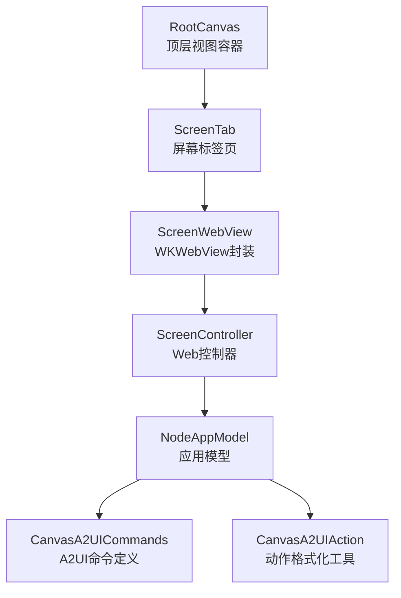
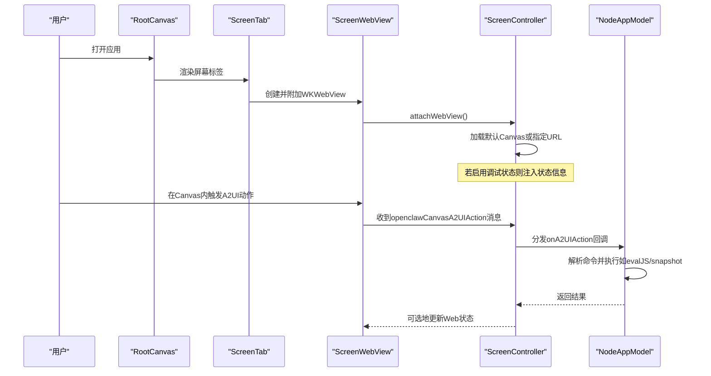
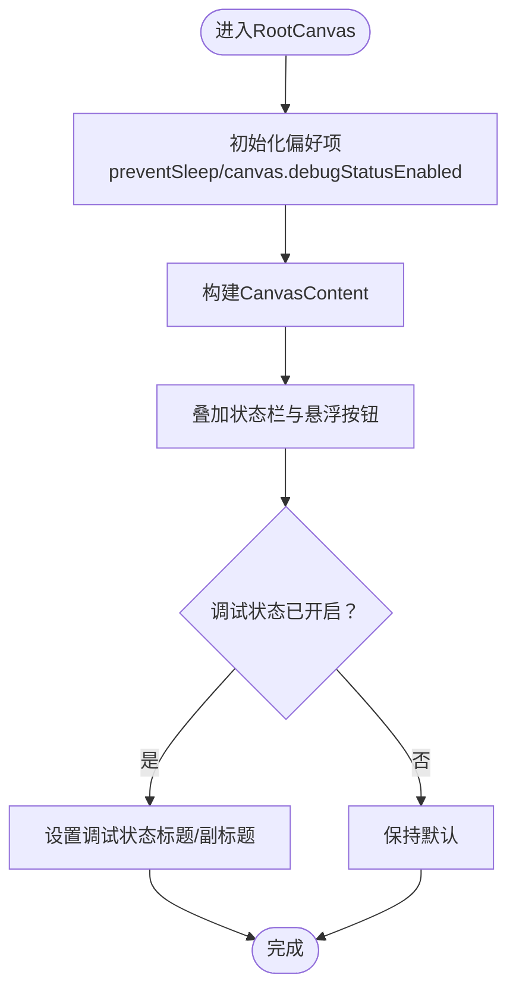
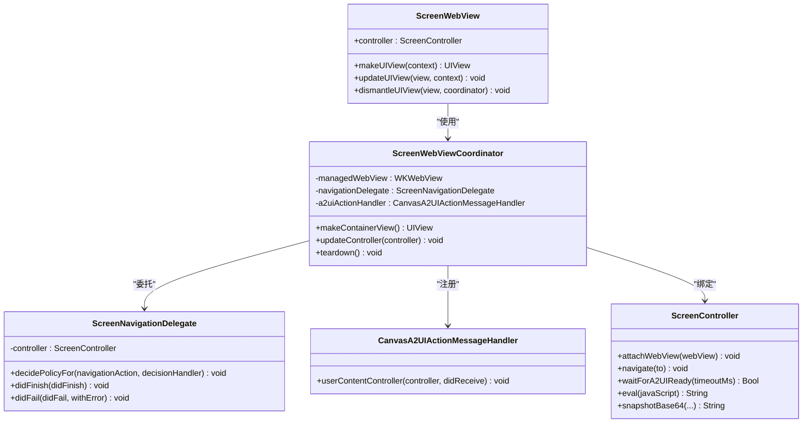
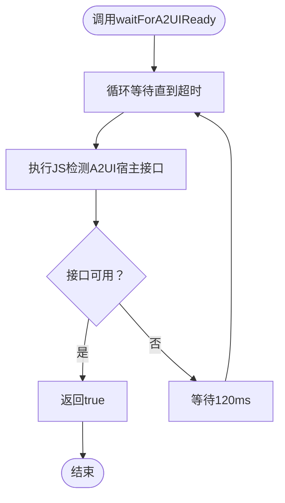
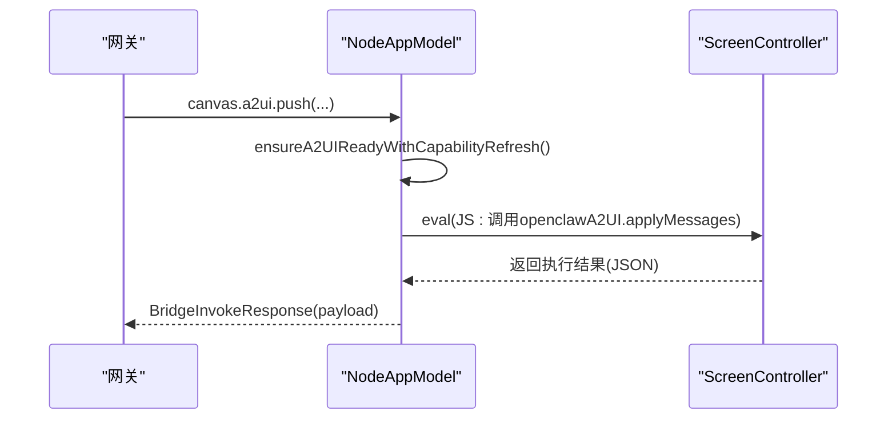
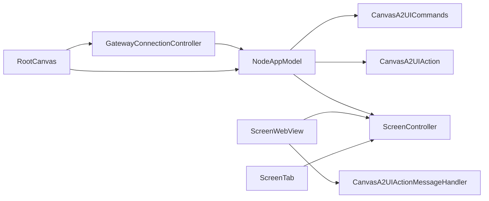

# Canvas界面

<cite>
**本文档引用的文件**
- [apps/ios/Sources/RootCanvas.swift](file://apps/ios/Sources/RootCanvas.swift)
- [apps/ios/Sources/Screen/ScreenTab.swift](file://apps/ios/Sources/Screen/ScreenTab.swift)
- [apps/ios/Sources/Screen/ScreenWebView.swift](file://apps/ios/Sources/Screen/ScreenWebView.swift)
- [apps/ios/Sources/Screen/ScreenController.swift](file://apps/ios/Sources/Screen/ScreenController.swift)
- [apps/ios/Sources/Model/NodeAppModel+Canvas.swift](file://apps/ios/Sources/Model/NodeAppModel+Canvas.swift)
- [apps/ios/Sources/Model/NodeAppModel.swift](file://apps/ios/Sources/Model/NodeAppModel.swift)
- [apps/shared/OpenClawKit/Sources/OpenClawKit/CanvasA2UIAction.swift](file://apps/shared/OpenClawKit/Sources/OpenClawKit/CanvasA2UIAction.swift)
- [apps/shared/OpenClawKit/Sources/OpenClawKit/CanvasA2UICommands.swift](file://apps/shared/OpenClawKit/Sources/OpenClawKit/CanvasA2UICommands.swift)
- [apps/ios/Sources/Gateway/GatewayConnectionController.swift](file://apps/ios/Sources/Gateway/GatewayConnectionController.swift)
</cite>

## 目录
1. [简介](#简介)
2. [项目结构](#项目结构)
3. [核心组件](#核心组件)
4. [架构总览](#架构总览)
5. [详细组件分析](#详细组件分析)
6. [依赖关系分析](#依赖关系分析)
7. [性能考虑](#性能考虑)
8. [故障排查指南](#故障排查指南)
9. [结论](#结论)

## 简介
本文件面向OpenClaw iOS节点的Canvas界面，系统性阐述其设计理念与交互模式，覆盖以下能力：
- 屏幕共享：通过屏幕录制能力将设备画面回传至网关或远端客户端
- 远程控制：通过Canvas A2UI通道接收并执行来自网关的动作指令
- 实时协作：在Canvas中渲染动态UI内容，支持消息推送与状态同步

同时，文档提供Canvas界面的操作方法（手势控制、点击操作、多点触控）、权限配置指南（屏幕录制、辅助功能等）、性能优化建议与用户体验改进策略。

## 项目结构
Canvas界面由iOS应用层的视图与控制器、Web子系统以及跨平台共享模块共同组成：
- 视图层：RootCanvas负责顶层布局与状态栏、悬浮按钮等UI组织
- 控制器层：ScreenController管理Web视图生命周期、导航、快照与调试状态
- Web层：ScreenWebView封装WKWebView，承载Canvas页面并处理A2UI动作消息
- 模型层：NodeAppModel协调Canvas命令、A2UI推送、屏幕录制与错误处理
- 共享模块：OpenClawKit定义Canvas A2UI命令与动作格式化工具

图表来源
- [apps/ios/Sources/RootCanvas.swift](file://apps/ios/Sources/RootCanvas.swift#L86-L194)
- [apps/ios/Sources/Screen/ScreenTab.swift](file://apps/ios/Sources/Screen/ScreenTab.swift#L4-L27)
- [apps/ios/Sources/Screen/ScreenWebView.swift](file://apps/ios/Sources/Screen/ScreenWebView.swift#L5-L124)
- [apps/ios/Sources/Screen/ScreenController.swift](file://apps/ios/Sources/Screen/ScreenController.swift#L8-L268)
- [apps/ios/Sources/Model/NodeAppModel.swift](file://apps/ios/Sources/Model/NodeAppModel.swift#L834-L975)
- [apps/shared/OpenClawKit/Sources/OpenClawKit/CanvasA2UICommands.swift](file://apps/shared/OpenClawKit/Sources/OpenClawKit/CanvasA2UICommands.swift#L3-L27)
- [apps/shared/OpenClawKit/Sources/OpenClawKit/CanvasA2UIAction.swift](file://apps/shared/OpenClawKit/Sources/OpenClawKit/CanvasA2UIAction.swift#L3-L105)

章节来源
- [apps/ios/Sources/RootCanvas.swift](file://apps/ios/Sources/RootCanvas.swift#L1-L275)
- [apps/ios/Sources/Screen/ScreenTab.swift](file://apps/ios/Sources/Screen/ScreenTab.swift#L1-L28)
- [apps/ios/Sources/Screen/ScreenWebView.swift](file://apps/ios/Sources/Screen/ScreenWebView.swift#L1-L194)
- [apps/ios/Sources/Screen/ScreenController.swift](file://apps/ios/Sources/Screen/ScreenController.swift#L1-L268)
- [apps/ios/Sources/Model/NodeAppModel.swift](file://apps/ios/Sources/Model/NodeAppModel.swift#L834-L1029)
- [apps/shared/OpenClawKit/Sources/OpenClawKit/CanvasA2UICommands.swift](file://apps/shared/OpenClawKit/Sources/OpenClawKit/CanvasA2UICommands.swift#L1-L27)
- [apps/shared/OpenClawKit/Sources/OpenClawKit/CanvasA2UIAction.swift](file://apps/shared/OpenClawKit/Sources/OpenClawKit/CanvasA2UIAction.swift#L1-L105)

## 核心组件
- RootCanvas：顶层容器，组织Canvas内容、状态栏、悬浮按钮与引导流程
- ScreenTab：承载ScreenWebView，作为Canvas的入口
- ScreenWebView：WKWebView封装，安装A2UI消息处理器，拦截深链
- ScreenController：管理Web视图、导航、快照、调试状态与A2UI就绪检测
- NodeAppModel：Canvas命令处理、A2UI推送、屏幕录制、权限检查与错误响应
- CanvasA2UICommands/A2UIAction：定义A2UI命令与动作格式化工具

章节来源
- [apps/ios/Sources/RootCanvas.swift](file://apps/ios/Sources/RootCanvas.swift#L4-L194)
- [apps/ios/Sources/Screen/ScreenTab.swift](file://apps/ios/Sources/Screen/ScreenTab.swift#L4-L27)
- [apps/ios/Sources/Screen/ScreenWebView.swift](file://apps/ios/Sources/Screen/ScreenWebView.swift#L25-L124)
- [apps/ios/Sources/Screen/ScreenController.swift](file://apps/ios/Sources/Screen/ScreenController.swift#L8-L268)
- [apps/ios/Sources/Model/NodeAppModel.swift](file://apps/ios/Sources/Model/NodeAppModel.swift#L834-L975)
- [apps/shared/OpenClawKit/Sources/OpenClawKit/CanvasA2UICommands.swift](file://apps/shared/OpenClawKit/Sources/OpenClawKit/CanvasA2UICommands.swift#L3-L27)
- [apps/shared/OpenClawKit/Sources/OpenClawKit/CanvasA2UIAction.swift](file://apps/shared/OpenClawKit/Sources/OpenClawKit/CanvasA2UIAction.swift#L3-L105)

## 架构总览
Canvas的运行时架构围绕“Web渲染 + 原生桥接”的模式展开：
- Canvas页面由本地HTML或远端HTTP加载，支持本地网络URL校验
- A2UI动作通过WKWebView的消息通道从Canvas传递到原生层
- NodeAppModel统一解析命令，调用ScreenController执行具体操作
- 调试状态与错误信息通过ScreenController注入到Web环境

图表来源
- [apps/ios/Sources/RootCanvas.swift](file://apps/ios/Sources/RootCanvas.swift#L86-L194)
- [apps/ios/Sources/Screen/ScreenTab.swift](file://apps/ios/Sources/Screen/ScreenTab.swift#L7-L24)
- [apps/ios/Sources/Screen/ScreenWebView.swift](file://apps/ios/Sources/Screen/ScreenWebView.swift#L26-L124)
- [apps/ios/Sources/Screen/ScreenController.swift](file://apps/ios/Sources/Screen/ScreenController.swift#L190-L258)
- [apps/ios/Sources/Model/NodeAppModel.swift](file://apps/ios/Sources/Model/NodeAppModel.swift#L834-L975)

## 详细组件分析

### RootCanvas：顶层布局与状态栏
- 组织Canvas内容、状态栏、悬浮按钮（聊天、语音唤醒、设置）
- 管理首次引导、快速设置与网关连接状态提示
- 通过AppStorage控制“防止休眠”“Canvas调试状态”等偏好项

图表来源
- [apps/ios/Sources/RootCanvas.swift](file://apps/ios/Sources/RootCanvas.swift#L196-L210)

章节来源
- [apps/ios/Sources/RootCanvas.swift](file://apps/ios/Sources/RootCanvas.swift#L1-L275)

### ScreenTab：Canvas入口
- 将ScreenWebView作为Canvas入口，全屏覆盖
- 当存在错误文本且未连接网关时显示错误提示

章节来源
- [apps/ios/Sources/Screen/ScreenTab.swift](file://apps/ios/Sources/Screen/ScreenTab.swift#L4-L27)

### ScreenWebView：WKWebView封装与A2UI消息
- 创建非持久化数据存储的WKWebView，禁用透明背景以避免下层叠层影响
- 安装CanvasA2UIActionMessageHandler，拦截openclawCanvasA2UIAction消息
- 拦截openclaw://深链，交由ScreenController处理

图表来源
- [apps/ios/Sources/Screen/ScreenWebView.swift](file://apps/ios/Sources/Screen/ScreenWebView.swift#L25-L124)
- [apps/ios/Sources/Screen/ScreenWebView.swift](file://apps/ios/Sources/Screen/ScreenWebView.swift#L127-L193)
- [apps/ios/Sources/Screen/ScreenController.swift](file://apps/ios/Sources/Screen/ScreenController.swift#L8-L268)

章节来源
- [apps/ios/Sources/Screen/ScreenWebView.swift](file://apps/ios/Sources/Screen/ScreenWebView.swift#L1-L194)
- [apps/ios/Sources/Screen/ScreenController.swift](file://apps/ios/Sources/Screen/ScreenController.swift#L1-L268)

### ScreenController：Web控制与A2UI就绪检测
- 导航：支持空URL（默认Canvas）、文件URL与HTTP URL；禁止加载环回地址
- 快照：支持PNG/JPEG编码，可限制最大宽度与质量
- 调试状态：按需注入标题/副标题
- A2UI就绪检测：通过定时轮询检测window对象上的A2UI宿主接口
- 安全校验：仅允许受信任的本地Canvas URL或本地网络URL触发A2UI动作

图表来源
- [apps/ios/Sources/Screen/ScreenController.swift](file://apps/ios/Sources/Screen/ScreenController.swift#L97-L118)

章节来源
- [apps/ios/Sources/Screen/ScreenController.swift](file://apps/ios/Sources/Screen/ScreenController.swift#L1-L268)

### NodeAppModel：Canvas命令与A2UI处理
- Canvas命令：present/hide/navigate/evalJS/snapshot
- A2UI命令：push/pushJSONL/reset，自动确保A2UI宿主可用
- 错误处理：对未知命令、后台受限、权限不足等情况返回明确错误码与消息
- 屏幕录制：限制格式为mp4，返回base64编码视频片段

图表来源
- [apps/ios/Sources/Model/NodeAppModel.swift](file://apps/ios/Sources/Model/NodeAppModel.swift#L888-L975)
- [apps/ios/Sources/Model/NodeAppModel+Canvas.swift](file://apps/ios/Sources/Model/NodeAppModel+Canvas.swift#L52-L69)

章节来源
- [apps/ios/Sources/Model/NodeAppModel.swift](file://apps/ios/Sources/Model/NodeAppModel.swift#L834-L1029)
- [apps/ios/Sources/Model/NodeAppModel+Canvas.swift](file://apps/ios/Sources/Model/NodeAppModel+Canvas.swift#L1-L102)

### CanvasA2UI命令与动作格式化
- 命令类型：push、pushJSONL、reset
- 动作上下文：包含会话、组件与上下文JSON，支持格式化为可读字符串
- JS分发动画：生成CustomEvent用于通知Web侧动作状态

章节来源
- [apps/shared/OpenClawKit/Sources/OpenClawKit/CanvasA2UICommands.swift](file://apps/shared/OpenClawKit/Sources/OpenClawKit/CanvasA2UICommands.swift#L3-L27)
- [apps/shared/OpenClawKit/Sources/OpenClawKit/CanvasA2UIAction.swift](file://apps/shared/OpenClawKit/Sources/OpenClawKit/CanvasA2UIAction.swift#L3-L105)

## 依赖关系分析
- RootCanvas依赖NodeAppModel与GatewayConnectionController提供的状态
- ScreenTab依赖ScreenController进行导航与错误展示
- ScreenWebView依赖ScreenController与CanvasA2UIActionMessageHandler
- NodeAppModel依赖ScreenController执行命令，依赖CanvasA2UI命令与动作工具
- 权限检查由GatewayConnectionController提供，用于配额与能力上报

图表来源
- [apps/ios/Sources/RootCanvas.swift](file://apps/ios/Sources/RootCanvas.swift#L4-L194)
- [apps/ios/Sources/Screen/ScreenTab.swift](file://apps/ios/Sources/Screen/ScreenTab.swift#L4-L27)
- [apps/ios/Sources/Screen/ScreenWebView.swift](file://apps/ios/Sources/Screen/ScreenWebView.swift#L25-L124)
- [apps/ios/Sources/Screen/ScreenController.swift](file://apps/ios/Sources/Screen/ScreenController.swift#L8-L268)
- [apps/ios/Sources/Model/NodeAppModel.swift](file://apps/ios/Sources/Model/NodeAppModel.swift#L834-L975)
- [apps/ios/Sources/Gateway/GatewayConnectionController.swift](file://apps/ios/Sources/Gateway/GatewayConnectionController.swift#L875-L896)

章节来源
- [apps/ios/Sources/RootCanvas.swift](file://apps/ios/Sources/RootCanvas.swift#L1-L275)
- [apps/ios/Sources/Screen/ScreenWebView.swift](file://apps/ios/Sources/Screen/ScreenWebView.swift#L1-L194)
- [apps/ios/Sources/Screen/ScreenController.swift](file://apps/ios/Sources/Screen/ScreenController.swift#L1-L268)
- [apps/ios/Sources/Model/NodeAppModel.swift](file://apps/ios/Sources/Model/NodeAppModel.swift#L834-L1029)
- [apps/ios/Sources/Gateway/GatewayConnectionController.swift](file://apps/ios/Sources/Gateway/GatewayConnectionController.swift#L875-L896)

## 性能考虑
- 快照质量与尺寸
  - 默认JPEG最大宽度约1600，PNG约900，避免超出网关负载上限
  - 可通过参数调整质量与宽度，兼顾清晰度与传输效率
- A2UI就绪检测
  - 采用固定周期轮询检测A2UI宿主接口，超时后刷新能力并重试
- Web视图配置
  - 非持久化数据存储减少磁盘占用
  - 禁用透明背景与滚动指示器，降低合成开销
- 调试状态
  - 仅在需要时启用，避免频繁注入DOM更新

章节来源
- [apps/ios/Sources/Model/NodeAppModel.swift](file://apps/ios/Sources/Model/NodeAppModel.swift#L859-L879)
- [apps/ios/Sources/Screen/ScreenWebView.swift](file://apps/ios/Sources/Screen/ScreenWebView.swift#L93-L111)
- [apps/ios/Sources/RootCanvas.swift](file://apps/ios/Sources/RootCanvas.swift#L204-L210)

## 故障排查指南
- Canvas无法加载或显示错误
  - 检查URL是否为空或为环回地址；环回地址在远程网关场景会被拒绝
  - 查看ScreenController的错误文本提示
- A2UI动作无效
  - 确认消息来源URL为受信任的本地Canvas或本地网络URL
  - 确认Canvas已就绪（waitForA2UIReady返回true）
- 屏幕录制失败
  - 确认格式为mp4；其他格式将被拒绝
  - 检查系统屏幕录制权限是否授权
- 权限不足导致命令失败
  - 检查NodeAppModel对后台命令的限制与权限状态
  - 对于相机、麦克风、照片库等权限，参考GatewayConnectionController中的权限映射

章节来源
- [apps/ios/Sources/Screen/ScreenController.swift](file://apps/ios/Sources/Screen/ScreenController.swift#L28-L70)
- [apps/ios/Sources/Screen/ScreenWebView.swift](file://apps/ios/Sources/Screen/ScreenWebView.swift#L171-L193)
- [apps/ios/Sources/Model/NodeAppModel.swift](file://apps/ios/Sources/Model/NodeAppModel.swift#L722-L732)
- [apps/ios/Sources/Model/NodeAppModel.swift](file://apps/ios/Sources/Model/NodeAppModel.swift#L1037-L1066)
- [apps/ios/Sources/Gateway/GatewayConnectionController.swift](file://apps/ios/Sources/Gateway/GatewayConnectionController.swift#L875-L896)

## 结论
OpenClaw iOS的Canvas界面以Web渲染为核心，结合原生桥接实现远程控制与实时协作。通过严格的URL校验、权限检查与A2UI就绪检测，保障了安全性与稳定性。配合合理的快照策略与调试开关，可在保证用户体验的同时兼顾性能与可维护性。