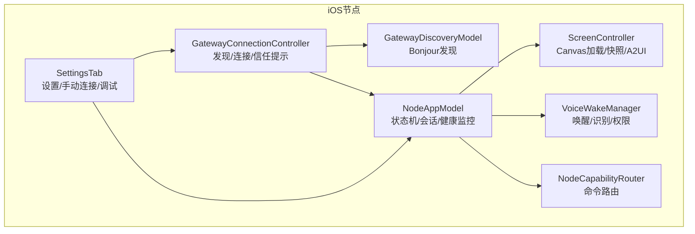
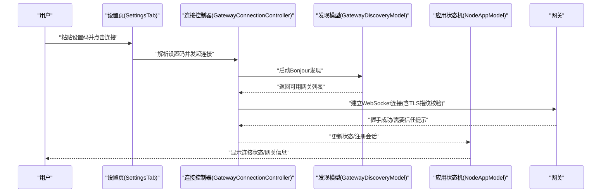
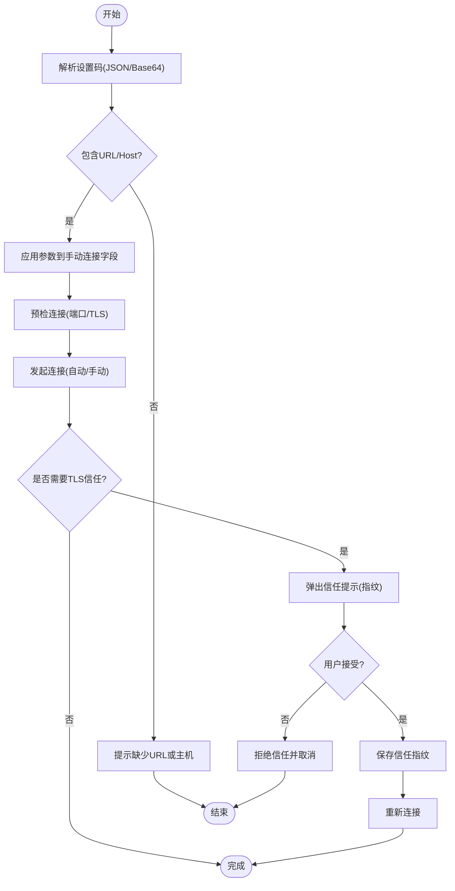
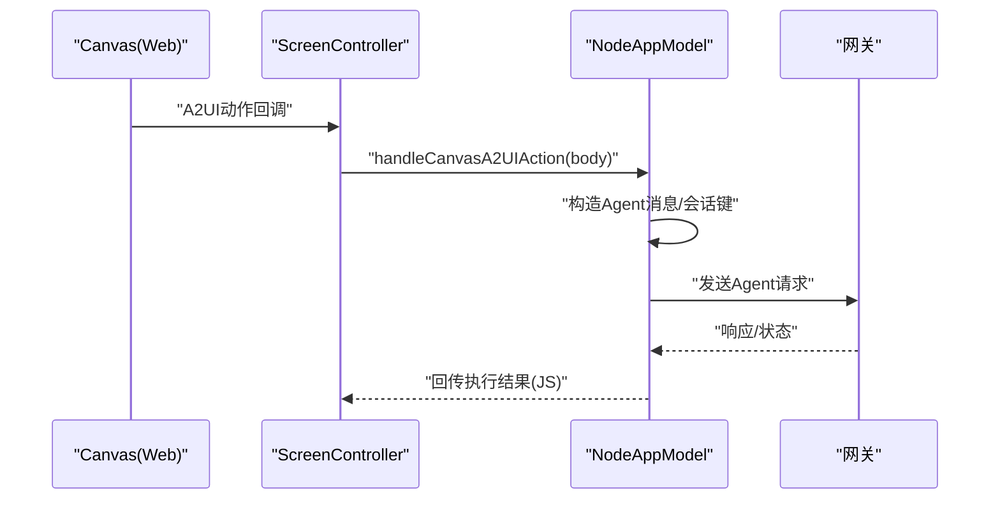
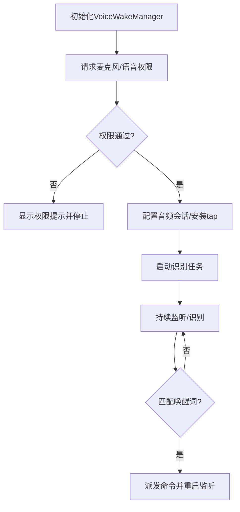
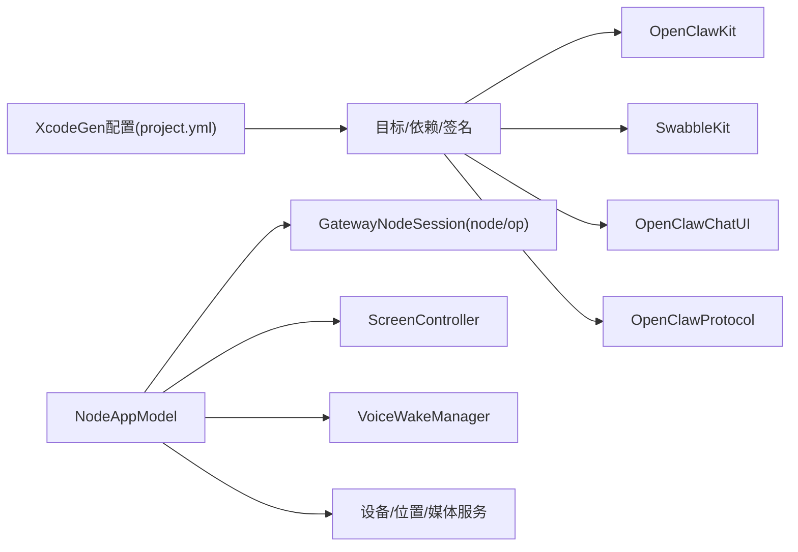

# iOS节点

<cite>
**本文引用的文件**
- [apps/ios/README.md](file://apps/ios/README.md)
- [apps/ios/project.yml](file://apps/ios/project.yml)
- [apps/ios/Sources/Gateway/GatewayConnectionController.swift](file://apps/ios/Sources/Gateway/GatewayConnectionController.swift)
- [apps/ios/Sources/Gateway/GatewayDiscoveryModel.swift](file://apps/ios/Sources/Gateway/GatewayDiscoveryModel.swift)
- [apps/ios/Sources/Gateway/GatewaySetupCode.swift](file://apps/ios/Sources/Gateway/GatewaySetupCode.swift)
- [apps/ios/Sources/Settings/SettingsTab.swift](file://apps/ios/Sources/Settings/SettingsTab.swift)
- [apps/ios/Sources/Model/NodeAppModel.swift](file://apps/ios/Sources/Model/NodeAppModel.swift)
- [apps/ios/Sources/Screen/ScreenController.swift](file://apps/ios/Sources/Screen/ScreenController.swift)
- [apps/ios/Sources/Voice/VoiceWakeManager.swift](file://apps/ios/Sources/Voice/VoiceWakeManager.swift)
- [apps/ios/Sources/Capabilities/NodeCapabilityRouter.swift](file://apps/ios/Sources/Capabilities/NodeCapabilityRouter.swift)
- [apps/shared/OpenClawKit/Sources/OpenClawKit/CanvasCommands.swift](file://apps/shared/OpenClawKit/Sources/OpenClawKit/CanvasCommands.swift)
- [apps/shared/OpenClawKit/Sources/OpenClawKit/CanvasCommandParams.swift](file://apps/shared/OpenClawKit/Sources/OpenClawKit/CanvasCommandParams.swift)
</cite>

## 目录
1. [简介](#简介)
2. [项目结构](#项目结构)
3. [核心组件](#核心组件)
4. [架构总览](#架构总览)
5. [详细组件分析](#详细组件分析)
6. [依赖关系分析](#依赖关系分析)
7. [性能考量](#性能考量)
8. [故障排除指南](#故障排除指南)
9. [结论](#结论)
10. [附录](#附录)

## 简介
本文件面向OpenClaw iOS节点应用，系统性阐述其技术架构与实现细节，覆盖设备配对、Canvas共享、语音触发（Voice Wake）、远程控制（Talk）等核心能力；并提供连接与配对流程说明、安装部署指南、权限配置、使用技巧、开发环境与二次开发建议。

## 项目结构
iOS节点位于apps/ios目录，采用XcodeGen生成工程，核心模块包括：
- Gateway：发现与连接网关（Bonjour、TLS指纹校验、自动重连）
- Settings：设置页与高级调试项（手动连接、发现日志、调试状态）
- Model：应用主状态机（NodeAppModel），协调网关会话、能力路由、健康监测
- Screen：Canvas承载与交互（导航、快照、A2UI动作）
- Voice：语音唤醒与Talk模式（麦克风权限、识别管线、与Talk互斥）
- Capabilities：命令分发路由（canvas、camera、screen、location等）

图表来源
- [apps/ios/Sources/Gateway/GatewayConnectionController.swift](file://apps/ios/Sources/Gateway/GatewayConnectionController.swift#L20-L80)
- [apps/ios/Sources/Gateway/GatewayDiscoveryModel.swift](file://apps/ios/Sources/Gateway/GatewayDiscoveryModel.swift#L8-L38)
- [apps/ios/Sources/Settings/SettingsTab.swift](file://apps/ios/Sources/Settings/SettingsTab.swift#L9-L50)
- [apps/ios/Sources/Model/NodeAppModel.swift](file://apps/ios/Sources/Model/NodeAppModel.swift#L50-L120)
- [apps/ios/Sources/Screen/ScreenController.swift](file://apps/ios/Sources/Screen/ScreenController.swift#L8-L26)
- [apps/ios/Sources/Voice/VoiceWakeManager.swift](file://apps/ios/Sources/Voice/VoiceWakeManager.swift#L83-L120)
- [apps/ios/Sources/Capabilities/NodeCapabilityRouter.swift](file://apps/ios/Sources/Capabilities/NodeCapabilityRouter.swift#L4-L25)

章节来源
- [apps/ios/project.yml](file://apps/ios/project.yml#L1-L324)

## 核心组件
- 连接控制器（GatewayConnectionController）：负责Bonjour发现、服务解析、TLS指纹探测与信任提示、自动/手动连接、自动重连策略与安全约束（仅已信任网关自动连接）。
- 发现模型（GatewayDiscoveryModel）：封装NWBrowser进行Bonjour服务发现，聚合结果并维护状态文本与调试日志。
- 设置页（SettingsTab）：提供配对码输入、手动连接、自动连接开关、发现日志、调试信息展示等。
- 应用状态机（NodeAppModel）：管理两个会话（node/operator）、健康监测、背景恢复、Canvas A2UI动作、Talk/Voice Wake协同。
- Canvas控制器（ScreenController）：加载默认或指定URL，支持快照、A2UI动作回调、调试状态注入。
- 语音唤醒（VoiceWakeManager）：麦克风与语音识别权限申请、实时音频采集与识别、与Talk互斥暂停/恢复。
- 能力路由（NodeCapabilityRouter）：根据命令分派到具体处理器，统一错误处理。

章节来源
- [apps/ios/Sources/Gateway/GatewayConnectionController.swift](file://apps/ios/Sources/Gateway/GatewayConnectionController.swift#L20-L80)
- [apps/ios/Sources/Gateway/GatewayDiscoveryModel.swift](file://apps/ios/Sources/Gateway/GatewayDiscoveryModel.swift#L8-L38)
- [apps/ios/Sources/Settings/SettingsTab.swift](file://apps/ios/Sources/Settings/SettingsTab.swift#L9-L50)
- [apps/ios/Sources/Model/NodeAppModel.swift](file://apps/ios/Sources/Model/NodeAppModel.swift#L50-L120)
- [apps/ios/Sources/Screen/ScreenController.swift](file://apps/ios/Sources/Screen/ScreenController.swift#L8-L26)
- [apps/ios/Sources/Voice/VoiceWakeManager.swift](file://apps/ios/Sources/Voice/VoiceWakeManager.swift#L83-L120)
- [apps/ios/Sources/Capabilities/NodeCapabilityRouter.swift](file://apps/ios/Sources/Capabilities/NodeCapabilityRouter.swift#L4-L25)

## 架构总览
iOS节点以Node角色接入OpenClaw网关，通过WebSocket双向通信实现：
- 设备配对：通过Telegram指令获取“设置码”，在应用中粘贴后自动解析并连接，随后在Telegram执行“批准”完成配对。
- Canvas共享：Node作为Canvas宿主，支持present/hide/navigate/eval/snapshot等命令，配合A2UI动作实现与网页UI的交互。
- 语音触发：Voice Wake在前台监听唤醒词，触发后将转写文本发送至网关；Talk模式与Voice Wake互斥，避免麦克风抢占。
- 远程控制：Talk模式下可与网关侧Agent进行语音对话，支持后台保持（受系统限制）。

图表来源
- [apps/ios/Sources/Settings/SettingsTab.swift](file://apps/ios/Sources/Settings/SettingsTab.swift#L714-L733)
- [apps/ios/Sources/Gateway/GatewayConnectionController.swift](file://apps/ios/Sources/Gateway/GatewayConnectionController.swift#L95-L156)
- [apps/ios/Sources/Gateway/GatewayDiscoveryModel.swift](file://apps/ios/Sources/Gateway/GatewayDiscoveryModel.swift#L51-L100)

## 详细组件分析

### 组件A：连接与配对流程
- 配对码解析：支持JSON或Base64编码的设置码，提取URL或主机端口、TLS标志、令牌与密码，并写入本地存储。
- 自动连接策略：优先使用已信任的网关（存储TLS指纹）；若无信任记录则要求用户确认指纹后再连接。
- 手动连接：当发现不可用时，可通过设置页输入主机、端口、TLS选项进行直连。
- 健康监测与自动重连：连接健康检查失败时断开并重新尝试；前台恢复时主动重建会话。

图表来源
- [apps/ios/Sources/Gateway/GatewaySetupCode.swift](file://apps/ios/Sources/Gateway/GatewaySetupCode.swift#L12-L41)
- [apps/ios/Sources/Settings/SettingsTab.swift](file://apps/ios/Sources/Settings/SettingsTab.swift#L714-L786)
- [apps/ios/Sources/Gateway/GatewayConnectionController.swift](file://apps/ios/Sources/Gateway/GatewayConnectionController.swift#L158-L207)

章节来源
- [apps/ios/Sources/Gateway/GatewaySetupCode.swift](file://apps/ios/Sources/Gateway/GatewaySetupCode.swift#L12-L41)
- [apps/ios/Sources/Settings/SettingsTab.swift](file://apps/ios/Sources/Settings/SettingsTab.swift#L714-L806)
- [apps/ios/Sources/Gateway/GatewayConnectionController.swift](file://apps/ios/Sources/Gateway/GatewayConnectionController.swift#L95-L278)

### 组件B：Canvas共享与A2UI
- Canvas命令：支持present/hide/navigate/eval/snapshot等，Node侧忽略placement提示，始终全屏展示Canvas。
- A2UI动作：从Canvas内触发的动作通过回调传递到NodeAppModel，构造Agent消息并投递到网关。
- 快照与调试：支持PNG/JPEG快照与调试状态注入，便于问题定位。

图表来源
- [apps/ios/Sources/Screen/ScreenController.swift](file://apps/ios/Sources/Screen/ScreenController.swift#L242-L258)
- [apps/ios/Sources/Model/NodeAppModel.swift](file://apps/ios/Sources/Model/NodeAppModel.swift#L222-L297)
- [apps/shared/OpenClawKit/Sources/OpenClawKit/CanvasCommands.swift](file://apps/shared/OpenClawKit/Sources/OpenClawKit/CanvasCommands.swift#L3-L9)
- [apps/shared/OpenClawKit/Sources/OpenClawKit/CanvasCommandParams.swift](file://apps/shared/OpenClawKit/Sources/OpenClawKit/CanvasCommandParams.swift#L25-L41)

章节来源
- [apps/ios/Sources/Screen/ScreenController.swift](file://apps/ios/Sources/Screen/ScreenController.swift#L28-L70)
- [apps/ios/Sources/Model/NodeAppModel.swift](file://apps/ios/Sources/Model/NodeAppModel.swift#L834-L856)
- [apps/shared/OpenClawKit/Sources/OpenClawKit/CanvasCommands.swift](file://apps/shared/OpenClawKit/Sources/OpenClawKit/CanvasCommands.swift#L3-L9)
- [apps/shared/OpenClawKit/Sources/OpenClawKit/CanvasCommandParams.swift](file://apps/shared/OpenClawKit/Sources/OpenClawKit/CanvasCommandParams.swift#L25-L41)

### 组件C：语音触发（Voice Wake）
- 权限与会话：请求麦克风与语音识别权限，配置音频会话，安装输入节点tap，启动识别任务。
- 唤醒词匹配：基于Swabble的WakeWordGate进行触发词匹配，最小间隔过滤重复触发。
- 与Talk协作：Talk启用时暂停Voice Wake，Talk结束或外部音频占用时恢复。

图表来源
- [apps/ios/Sources/Voice/VoiceWakeManager.swift](file://apps/ios/Sources/Voice/VoiceWakeManager.swift#L160-L213)
- [apps/ios/Sources/Voice/VoiceWakeManager.swift](file://apps/ios/Sources/Voice/VoiceWakeManager.swift#L301-L354)

章节来源
- [apps/ios/Sources/Voice/VoiceWakeManager.swift](file://apps/ios/Sources/Voice/VoiceWakeManager.swift#L83-L120)
- [apps/ios/Sources/Voice/VoiceWakeManager.swift](file://apps/ios/Sources/Voice/VoiceWakeManager.swift#L160-L213)
- [apps/ios/Sources/Voice/VoiceWakeManager.swift](file://apps/ios/Sources/Voice/VoiceWakeManager.swift#L301-L354)

### 组件D：远程控制（Talk）
- 模式切换：Talk启用时暂停Voice Wake；Talk禁用时恢复Voice Wake。
- 后台保持：可选后台保持，但受系统限制，需谨慎使用以避免耗电。
- 与网关同步：Talk模式变更通过事件流同步到网关，保持两端一致。

章节来源
- [apps/ios/Sources/Model/NodeAppModel.swift](file://apps/ios/Sources/Model/NodeAppModel.swift#L489-L507)
- [apps/ios/Sources/Model/NodeAppModel.swift](file://apps/ios/Sources/Model/NodeAppModel.swift#L623-L676)

### 组件E：能力路由与背景限制
- 路由机制：NodeCapabilityRouter按命令分派到具体处理器，未知命令返回错误。
- 背景限制：Canvas、Camera、Screen、Talk类命令在后台被限制，需前台执行。

章节来源
- [apps/ios/Sources/Capabilities/NodeCapabilityRouter.swift](file://apps/ios/Sources/Capabilities/NodeCapabilityRouter.swift#L19-L25)
- [apps/ios/Sources/Model/NodeAppModel.swift](file://apps/ios/Sources/Model/NodeAppModel.swift#L722-L773)

## 依赖关系分析
- 工程配置：XcodeGen定义目标、依赖、签名、Info.plist与Entitlements；依赖OpenClawKit、SwabbleKit、OpenClawChatUI等。
- 运行时依赖：NodeAppModel依赖GatewayNodeSession（node/operator双会话）、ScreenController、VoiceWakeManager、Location/Device/Photos/Contacts/Calendar/Reminders/Motion等服务。
- 网络与系统：Bonjour发现依赖Network框架；语音识别依赖Speech；音频处理依赖AVFoundation；推送通知依赖APNs（Entitlements中aps-environment=development）。

图表来源
- [apps/ios/project.yml](file://apps/ios/project.yml#L38-L144)
- [apps/ios/Sources/Model/NodeAppModel.swift](file://apps/ios/Sources/Model/NodeAppModel.swift#L151-L185)

章节来源
- [apps/ios/project.yml](file://apps/ios/project.yml#L1-L324)
- [apps/ios/Sources/Model/NodeAppModel.swift](file://apps/ios/Sources/Model/NodeAppModel.swift#L151-L185)

## 性能考量
- 背景行为：iOS可能在后台挂起网络套接字，前台恢复时主动重建会话，避免“已连接但死”的状态。
- 语音唤醒：Simulator音频栈不稳定，不建议在模拟器上长期录音；识别任务周期性重启以提升鲁棒性。
- Canvas快照：快照配置支持宽度裁剪与质量控制，避免过大图片带来的内存压力。
- 电池与热管理：后台保持Talk会增加耗电，应按需开启；Location Always权限用于后台位置事件，注意资源影响。

## 故障排除指南
- 构建与签名基线
  - 重新生成工程（xcodegen generate），核对团队/Bundle ID/Provisioning Profile。
  - 查看Xcode日志子系统：ai.openclaw.ios、GatewayDiag、APNs registration failed。
- 网关连接
  - 若需要配对/认证阻塞，等待人工修复后再重试；查看设置页“网关”状态与服务器地址。
  - 发现不稳定时，启用“发现调试日志”，在“设置->网关->发现日志”查看最新条目。
  - 网络路径不明确时，切换到手动主机/端口+TLS并在“网关高级设置”中配置。
- 语音与权限
  - Voice Wake在模拟器不支持；麦克风/语音识别权限未授予时会显示相应提示。
  - Talk与Voice Wake互斥，Talk启用时Voice Wake暂停，Talk结束后自动恢复。
- 调试与复现
  - 先在前台复现，再测试后台切回前台的重连行为；确保无后台唤醒循环。
  - Canvas快照失败或Web视图不可用时，检查错误信息并重试。

章节来源
- [apps/ios/README.md](file://apps/ios/README.md#L120-L142)
- [apps/ios/Sources/Settings/SettingsTab.swift](file://apps/ios/Sources/Settings/SettingsTab.swift#L422-L438)
- [apps/ios/Sources/Voice/VoiceWakeManager.swift](file://apps/ios/Sources/Voice/VoiceWakeManager.swift#L169-L177)

## 结论
iOS节点以清晰的职责划分实现了与OpenClaw网关的稳定连接与丰富交互：通过Bonjour自动发现与TLS信任机制保障安全连接；以Canvas为核心承载UI与A2UI动作；以Voice Wake与Talk提供自然的人机交互入口；配合健康监测与自动重连策略提升可靠性。开发者可基于现有架构扩展新能力或定制化UI/交互。

## 附录

### 安装部署与开发环境
- 环境要求：Xcode 16+、pnpm、xcodegen；Apple开发签名配置。
- 本地构建步骤：在仓库根目录执行安装与生成，进入apps/ios并打开工程运行。
- 分发状态：当前为内部开发版本，无TestFlight；可通过Xcode本地部署。

章节来源
- [apps/ios/README.md](file://apps/ios/README.md#L21-L51)

### 权限与隐私声明
- 语音与麦克风：用于Voice Wake与Talk；需授权麦克风与语音识别。
- 位置：支持前台/后台位置权限；后台位置需“始终”权限。
- 相册/相机/运动：按需授权，用于相关命令调用。
- 推送通知：Debug构建注册沙盒APNs；Release注册生产APNs。

章节来源
- [apps/ios/project.yml](file://apps/ios/project.yml#L120-L133)
- [apps/ios/README.md](file://apps/ios/README.md#L53-L61)

### 使用技巧
- Canvas操作：在设置中启用“调试Canvas状态”便于观察加载与交互；A2UI动作通过回调即时反馈。
- 语音唤醒：在设置中配置唤醒词；Talk启用时自动暂停Voice Wake，避免冲突。
- 手动连接：当Bonjour受限时，使用“使用手动网关”输入主机、端口与TLS选项直连。
- 自动重连：前台恢复时主动重建会话；后台保持Talk需谨慎使用。

章节来源
- [apps/ios/Sources/Settings/SettingsTab.swift](file://apps/ios/Sources/Settings/SettingsTab.swift#L211-L237)
- [apps/ios/Sources/Model/NodeAppModel.swift](file://apps/ios/Sources/Model/NodeAppModel.swift#L300-L382)