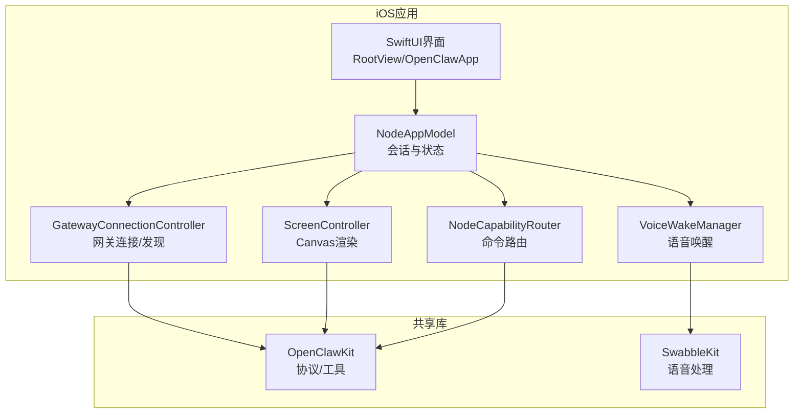
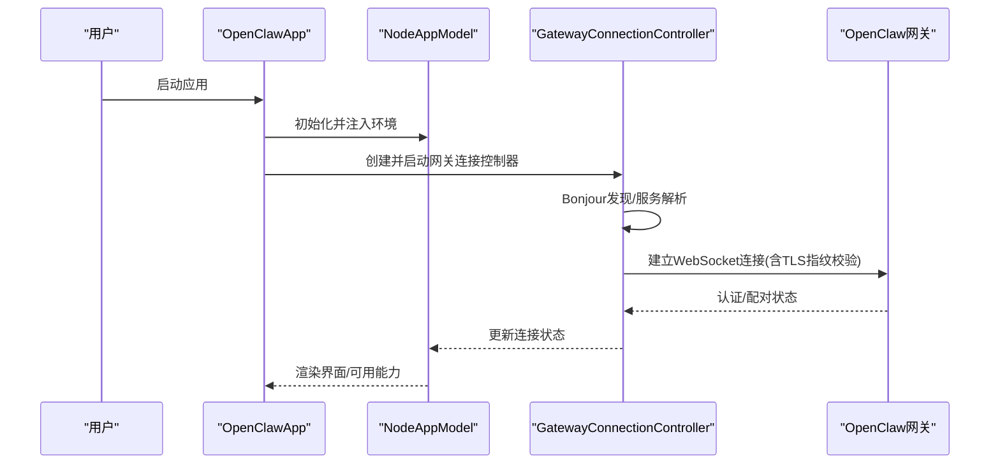
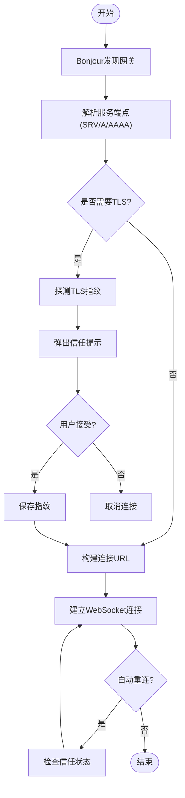
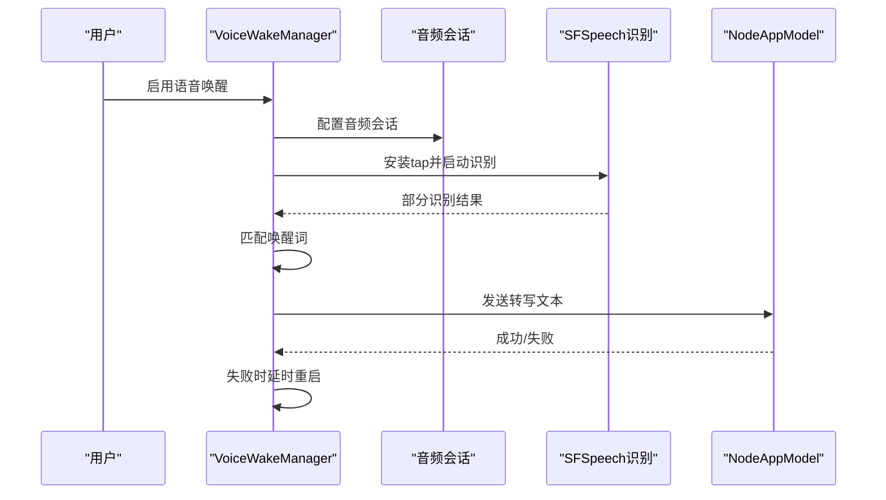
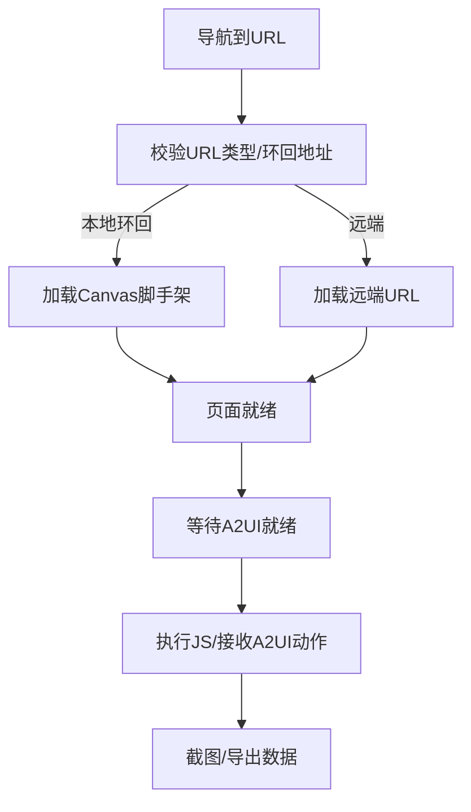
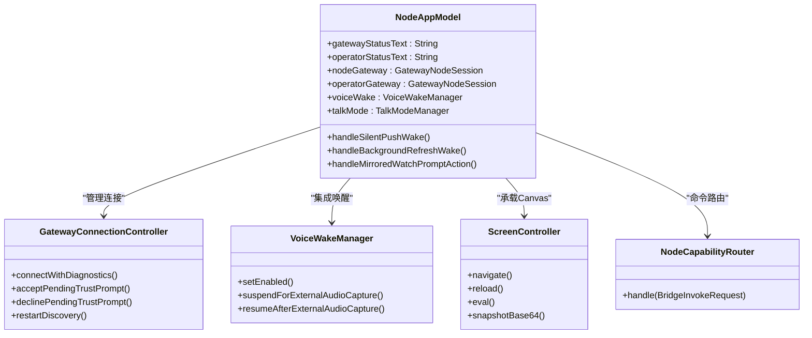
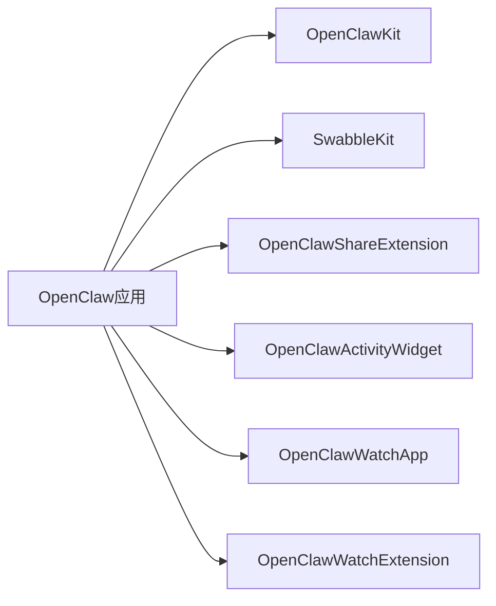

# iOS节点概述

<cite>
**本文档引用的文件**
- [apps/ios/README.md](file://apps/ios/README.md)
- [apps/ios/project.yml](file://apps/ios/project.yml)
- [apps/ios/Sources/Info.plist](file://apps/ios/Sources/Info.plist)
- [apps/ios/Sources/OpenClawApp.swift](file://apps/ios/Sources/OpenClawApp.swift)
- [apps/ios/Sources/RootView.swift](file://apps/ios/Sources/RootView.swift)
- [apps/ios/Sources/Gateway/GatewayConnectionController.swift](file://apps/ios/Sources/Gateway/GatewayConnectionController.swift)
- [apps/ios/Sources/Voice/VoiceWakeManager.swift](file://apps/ios/Sources/Voice/VoiceWakeManager.swift)
- [apps/ios/Sources/Model/NodeAppModel.swift](file://apps/ios/Sources/Model/NodeAppModel.swift)
- [apps/ios/Sources/Screen/ScreenController.swift](file://apps/ios/Sources/Screen/ScreenController.swift)
- [apps/ios/Sources/Capabilities/NodeCapabilityRouter.swift](file://apps/ios/Sources/Capabilities/NodeCapabilityRouter.swift)
- [apps/shared/OpenClawKit/Package.swift](file://apps/shared/OpenClawKit/Package.swift)
</cite>

## 目录
1. [简介](#简介)
2. [项目结构](#项目结构)
3. [核心组件](#核心组件)
4. [架构总览](#架构总览)
5. [详细组件分析](#详细组件分析)
6. [依赖关系分析](#依赖关系分析)
7. [性能考虑](#性能考虑)
8. [故障排除指南](#故障排除指南)
9. [结论](#结论)
10. [附录](#附录)

## 简介
OpenClaw iOS节点是OpenClaw生态中的“节点”角色，负责与网关建立安全连接、承载设备能力并执行远程命令。它以iPhone/iPad为载体，提供以下核心能力：
- 设备配对：通过Telegram等渠道完成配对流程，确保节点与网关的信任链路建立
- Canvas共享：通过内置WebView加载并渲染Canvas界面，支持导航、脚本执行与截图
- 语音触发：基于本地语音识别的“唤醒词”检测，实现免接触触发
- 远程控制：在前台运行时可调用相机、屏幕录制、位置、联系人、日历、提醒事项、照片、运动、本地通知等能力；后台受系统限制约束

iOS节点在OpenClaw生态系统中扮演“设备能力代理”的角色，既作为Operator会话的入口（聊天/语音），也作为Node会话的承载者（设备能力与命令执行）。它与网关通过WebSocket进行双向通信，并通过Bonjour服务发现网关。

章节来源
- [apps/ios/README.md](file://apps/ios/README.md#L1-L142)

## 项目结构
iOS应用采用SwiftUI框架构建，核心代码位于apps/ios/Sources目录，按功能域划分为：
- Gateway：网关发现、连接、信任校验与自动重连
- Voice：语音唤醒与麦克风权限管理
- Screen：Canvas渲染与交互（WKWebView）
- Model：应用状态模型与会话协调
- Capabilities：命令路由与设备能力封装
- 其他模块：设备信息、位置、媒体、通知、LiveActivity等

应用通过XcodeGen根据project.yml生成工程配置，依赖共享库OpenClawKit与Swabble语音处理库。

图表来源
- [apps/ios/project.yml](file://apps/ios/project.yml#L38-L144)
- [apps/ios/Sources/OpenClawApp.swift](file://apps/ios/Sources/OpenClawApp.swift#L492-L526)
- [apps/ios/Sources/RootView.swift](file://apps/ios/Sources/RootView.swift#L1-L8)
- [apps/ios/Sources/Gateway/GatewayConnectionController.swift](file://apps/ios/Sources/Gateway/GatewayConnectionController.swift#L20-L80)
- [apps/ios/Sources/Voice/VoiceWakeManager.swift](file://apps/ios/Sources/Voice/VoiceWakeManager.swift#L81-L120)
- [apps/ios/Sources/Screen/ScreenController.swift](file://apps/ios/Sources/Screen/ScreenController.swift#L6-L26)
- [apps/ios/Sources/Capabilities/NodeCapabilityRouter.swift](file://apps/ios/Sources/Capabilities/NodeCapabilityRouter.swift#L4-L26)
- [apps/shared/OpenClawKit/Package.swift](file://apps/shared/OpenClawKit/Package.swift#L1-L62)

章节来源
- [apps/ios/project.yml](file://apps/ios/project.yml#L1-L324)
- [apps/ios/Sources/Info.plist](file://apps/ios/Sources/Info.plist#L1-L97)

## 核心组件
- 应用入口与生命周期
  - OpenClawApp：应用主入口，初始化NodeAppModel与GatewayConnectionController，处理深链与场景切换
  - OpenClawAppDelegate：处理APNs注册、静默推送唤醒、后台刷新任务与手表提示镜像
- 网关连接控制器
  - GatewayConnectionController：负责Bonjour发现、服务解析、TLS指纹探测与信任提示、自动重连策略
- 应用状态模型
  - NodeAppModel：维护Node与Operator双会话、语音唤醒集成、位置事件、手表消息镜像、Canvas交互桥接
- 语音唤醒
  - VoiceWakeManager：麦克风权限申请、音频引擎配置、本地语音识别、唤醒词匹配与回调
- Canvas渲染
  - ScreenController：WKWebView承载Canvas，支持导航、脚本执行、截图与调试状态
- 能力路由
  - NodeCapabilityRouter：将网关下发的命令路由到对应的服务处理器

章节来源
- [apps/ios/Sources/OpenClawApp.swift](file://apps/ios/Sources/OpenClawApp.swift#L16-L263)
- [apps/ios/Sources/Gateway/GatewayConnectionController.swift](file://apps/ios/Sources/Gateway/GatewayConnectionController.swift#L20-L800)
- [apps/ios/Sources/Model/NodeAppModel.swift](file://apps/ios/Sources/Model/NodeAppModel.swift#L47-L200)
- [apps/ios/Sources/Voice/VoiceWakeManager.swift](file://apps/ios/Sources/Voice/VoiceWakeManager.swift#L81-L477)
- [apps/ios/Sources/Screen/ScreenController.swift](file://apps/ios/Sources/Screen/ScreenController.swift#L6-L200)
- [apps/ios/Sources/Capabilities/NodeCapabilityRouter.swift](file://apps/ios/Sources/Capabilities/NodeCapabilityRouter.swift#L4-L26)

## 架构总览
iOS节点采用“双会话”架构：
- Node会话：用于设备能力与node.invoke请求，承载Canvas与能力命令
- Operator会话：用于聊天、语音、配置与语音唤醒等操作

图表来源
- [apps/ios/Sources/OpenClawApp.swift](file://apps/ios/Sources/OpenClawApp.swift#L492-L526)
- [apps/ios/Sources/Gateway/GatewayConnectionController.swift](file://apps/ios/Sources/Gateway/GatewayConnectionController.swift#L90-L160)

章节来源
- [apps/ios/Sources/OpenClawApp.swift](file://apps/ios/Sources/OpenClawApp.swift#L492-L526)
- [apps/ios/Sources/Gateway/GatewayConnectionController.swift](file://apps/ios/Sources/Gateway/GatewayConnectionController.swift#L20-L80)

## 详细组件分析

### 网关连接与自动重连
- 发现与解析
  - 使用Bonjour服务发现网关，解析SRV/A/AAAA记录，提取主机与端口
  - 支持手动输入主机/端口，自动推断TLS端口与强制TLS（如Tailscale域名）
- TLS信任校验
  - 首次连接探测TLS指纹，弹出信任提示；已信任网关直接复用存储的指纹
  - 自动重连仅允许已信任网关，保障安全性
- 自动重连策略
  - 场景切换（前台/后台）触发发现或停止
  - 配对暂停期间抑制重连，避免UI闪烁
  - 支持从上次连接恢复（手动/发现）

图表来源
- [apps/ios/Sources/Gateway/GatewayConnectionController.swift](file://apps/ios/Sources/Gateway/GatewayConnectionController.swift#L90-L280)

章节来源
- [apps/ios/Sources/Gateway/GatewayConnectionController.swift](file://apps/ios/Sources/Gateway/GatewayConnectionController.swift#L20-L800)

### 语音唤醒（Voice Wake）
- 权限与会话
  - 请求麦克风与语音识别权限，配置音频会话为测量模式
  - 在Talk或外部音频占用时暂停监听，避免冲突
- 识别与触发
  - 通过SFSpeech识别部分结果，结合Swabble的唤醒词门控算法匹配触发词
  - 触发后回调NodeAppModel发送转写文本至网关
- 失败与恢复
  - 识别错误时短暂延迟后自动重启监听
  - 支持Simulator降级提示

图表来源
- [apps/ios/Sources/Voice/VoiceWakeManager.swift](file://apps/ios/Sources/Voice/VoiceWakeManager.swift#L160-L350)
- [apps/ios/Sources/Model/NodeAppModel.swift](file://apps/ios/Sources/Model/NodeAppModel.swift#L187-L195)

章节来源
- [apps/ios/Sources/Voice/VoiceWakeManager.swift](file://apps/ios/Sources/Voice/VoiceWakeManager.swift#L81-L477)
- [apps/ios/Sources/Model/NodeAppModel.swift](file://apps/ios/Sources/Model/NodeAppModel.swift#L187-L195)

### Canvas共享与交互
- 渲染与导航
  - 通过ScreenController加载本地或远端URL，支持文件URL与HTTP(S)URL
  - 默认加载Canvas脚手架URL，支持调试状态注入
- 交互与脚本
  - 提供JavaScript评估接口，等待A2UI就绪后执行动作
  - 支持截图（PNG/JPEG）并返回Base64编码
- 深链与A2UI
  - 捕获openclaw://深链与A2UI动作回调，转发给NodeAppModel处理

图表来源
- [apps/ios/Sources/Screen/ScreenController.swift](file://apps/ios/Sources/Screen/ScreenController.swift#L28-L188)

章节来源
- [apps/ios/Sources/Screen/ScreenController.swift](file://apps/ios/Sources/Screen/ScreenController.swift#L6-L200)

### 应用状态与会话协调
- 双会话模型
  - Node会话：设备能力与node.invoke
  - Operator会话：聊天、语音、配置与语音唤醒
- 通知与手表镜像
  - 处理APNs静默推送唤醒、后台刷新任务
  - 将手表提示镜像为本地通知，支持快速回复动作
- 背景行为与资源保护
  - 背景态抑制部分高耗能命令，保留必要唤醒与健康监控
  - 提供后台宽限期与重连抑制策略

图表来源
- [apps/ios/Sources/Model/NodeAppModel.swift](file://apps/ios/Sources/Model/NodeAppModel.swift#L47-L200)
- [apps/ios/Sources/Gateway/GatewayConnectionController.swift](file://apps/ios/Sources/Gateway/GatewayConnectionController.swift#L20-L80)
- [apps/ios/Sources/Voice/VoiceWakeManager.swift](file://apps/ios/Sources/Voice/VoiceWakeManager.swift#L81-L120)
- [apps/ios/Sources/Screen/ScreenController.swift](file://apps/ios/Sources/Screen/ScreenController.swift#L6-L26)
- [apps/ios/Sources/Capabilities/NodeCapabilityRouter.swift](file://apps/ios/Sources/Capabilities/NodeCapabilityRouter.swift#L4-L26)

章节来源
- [apps/ios/Sources/Model/NodeAppModel.swift](file://apps/ios/Sources/Model/NodeAppModel.swift#L47-L200)
- [apps/ios/Sources/OpenClawApp.swift](file://apps/ios/Sources/OpenClawApp.swift#L16-L263)

## 依赖关系分析
- 工程与目标
  - OpenClaw（应用）、OpenClawShareExtension（分享扩展）、OpenClawActivityWidget（小组件）、OpenClawWatchApp/Extension（手表）
- 依赖包
  - OpenClawKit：协议、工具与聊天UI
  - Swabble：语音唤醒与语音处理
- 平台与权限
  - Info.plist声明Bonjour服务、网络权限、位置权限、麦克风权限、Live Activities等
  - 支持后台模式：音频播放与远程通知

图表来源
- [apps/ios/project.yml](file://apps/ios/project.yml#L38-L264)
- [apps/ios/Sources/Info.plist](file://apps/ios/Sources/Info.plist#L47-L68)

章节来源
- [apps/ios/project.yml](file://apps/ios/project.yml#L1-L324)
- [apps/ios/Sources/Info.plist](file://apps/ios/Sources/Info.plist#L1-L97)

## 性能考虑
- 语音唤醒
  - 使用测量模式音频会话，降低延迟；识别错误后短时退避再启动
  - 外部音频占用时暂停，避免CoreAudio死锁风险
- Canvas渲染
  - 截图前压缩质量参数可控，避免大体积数据传输
  - 等待A2UI就绪再执行动作，减少无效调用
- 网络与连接
  - 自动重连仅针对已信任网关，减少握手失败开销
  - 背景态抑制非必要命令，延长电池寿命
- 资源保护
  - 背景宽限期与重连抑制，避免频繁重建连接导致热耗与电量消耗

## 故障排除指南
- 常见问题
  - 无法连接网关：检查TLS指纹是否已保存；确认Bonjour服务可达；必要时改为手动主机/端口+TLS
  - 语音唤醒不可用：确认麦克风与语音识别权限；Simulator不支持长期录音
  - 背景命令受限：前台优先执行；后台仅允许必要唤醒与健康监控
  - APNs注册失败：检查签名配置与推送能力；确认主题与Bundle一致
- 排查步骤
  - 重新生成工程并核对团队/Bundle；在设置中查看网关状态与发现日志
  - 执行配对批准后再重连；在网络不明确时切换手动主机/端口+TLS
  - 在Xcode控制台按子系统过滤日志（ai.openclaw.ios、GatewayDiag、APNs registration failed）
  - 先在前台复现，再验证后台切回后的重连行为

章节来源
- [apps/ios/README.md](file://apps/ios/README.md#L120-L142)
- [apps/ios/Sources/OpenClawApp.swift](file://apps/ios/Sources/OpenClawApp.swift#L61-L96)

## 结论
OpenClaw iOS节点以“前台可靠、后台克制”的设计理念，为OpenClaw生态提供了安全、稳定的设备能力代理。通过双会话架构、严格的TLS信任机制与本地语音唤醒，它在保证用户体验的同时兼顾了隐私与能耗控制。随着后续自动唤醒/重连加固与后台行为优化，iOS节点将在自动化与跨设备协同方面发挥更大价值。

## 附录
- 应用场景与价值
  - 移动自动化：基于位置事件触发自动化，避免持续GPS常驻
  - 跨设备协作：Canvas共享与手表镜像通知提升多端一致性
  - 语音交互：免接触触发聊天与语音，适合双手忙碌场景
- 关键特性清单
  - 设备配对：Telegram配对流程与网关信任校验
  - Canvas共享：导航、脚本执行、截图与调试状态
  - 语音触发：本地唤醒词识别与权限管理
  - 远程控制：前台相机、屏幕录制、位置、联系人、日历、提醒、照片、运动、通知等
  - 背景策略：静默推送唤醒、后台刷新任务与命令抑制

章节来源
- [apps/ios/README.md](file://apps/ios/README.md#L62-L100)
- [apps/ios/Sources/Model/NodeAppModel.swift](file://apps/ios/Sources/Model/NodeAppModel.swift#L187-L195)
- [apps/ios/Sources/Screen/ScreenController.swift](file://apps/ios/Sources/Screen/ScreenController.swift#L120-L188)
- [apps/ios/Sources/Voice/VoiceWakeManager.swift](file://apps/ios/Sources/Voice/VoiceWakeManager.swift#L160-L213)