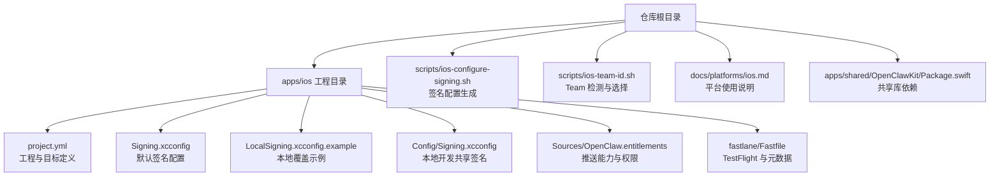
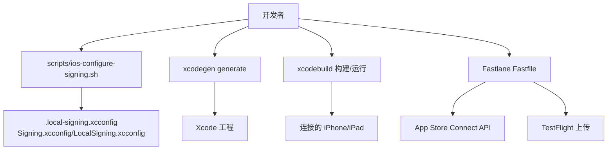
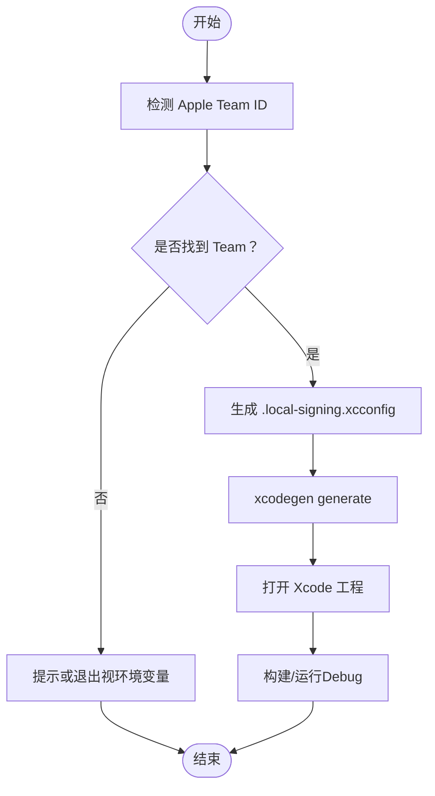
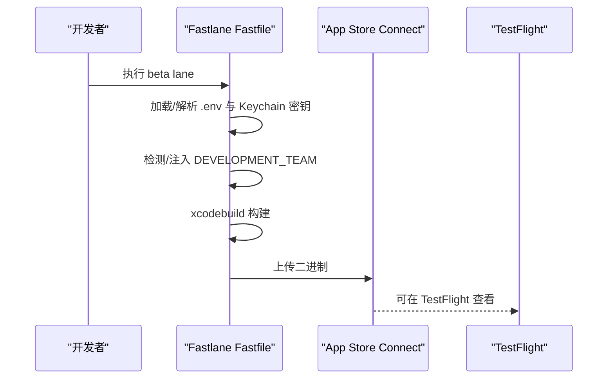
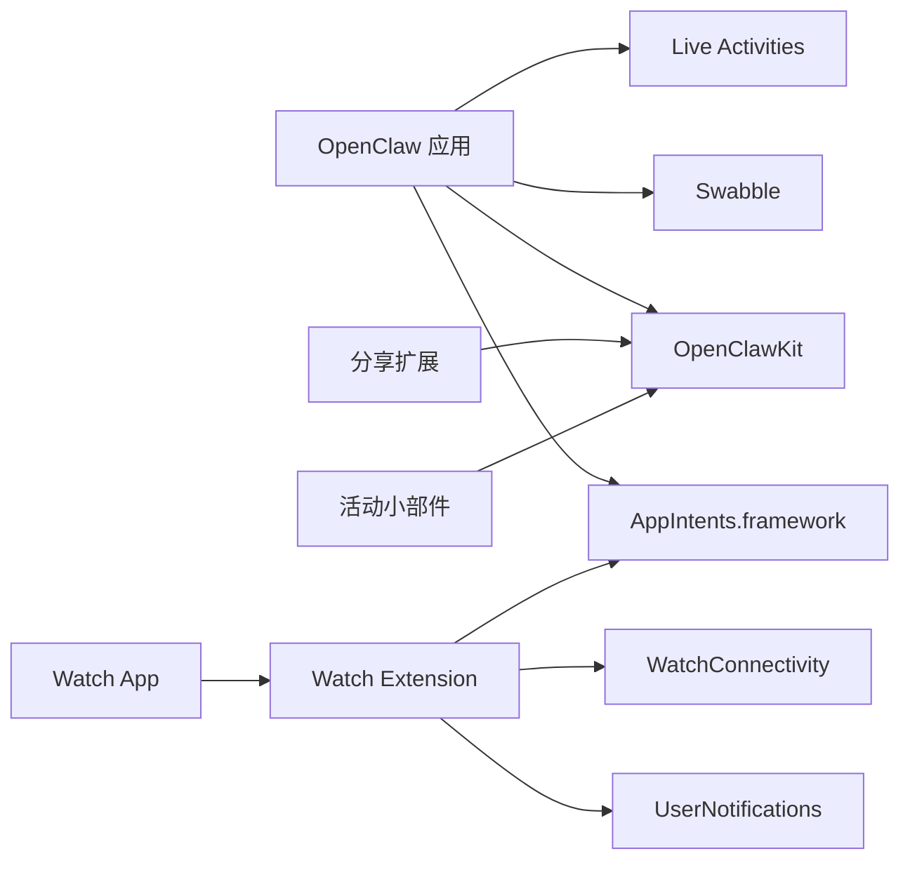

# 安装与配置

<cite>
**本文引用的文件**
- [apps/ios/README.md](file://apps/ios/README.md)
- [apps/ios/project.yml](file://apps/ios/project.yml)
- [apps/ios/Signing.xcconfig](file://apps/ios/Signing.xcconfig)
- [apps/ios/LocalSigning.xcconfig.example](file://apps/ios/LocalSigning.xcconfig.example)
- [apps/ios/Config/Signing.xcconfig](file://apps/ios/Config/Signing.xcconfig)
- [scripts/ios-configure-signing.sh](file://scripts/ios-configure-signing.sh)
- [scripts/ios-team-id.sh](file://scripts/ios-team-id.sh)
- [apps/ios/fastlane/Fastfile](file://apps/ios/fastlane/Fastfile)
- [apps/shared/OpenClawKit/Package.swift](file://apps/shared/OpenClawKit/Package.swift)
- [docs/platforms/ios.md](file://docs/platforms/ios.md)
- [apps/ios/Sources/OpenClaw.entitlements](file://apps/ios/Sources/OpenClaw.entitlements)
- [package.json](file://package.json)
</cite>

## 目录
1. [简介](#简介)
2. [项目结构](#项目结构)
3. [核心组件](#核心组件)
4. [架构总览](#架构总览)
5. [详细组件分析](#详细组件分析)
6. [依赖关系分析](#依赖关系分析)
7. [性能考虑](#性能考虑)
8. [故障排查指南](#故障排查指南)
9. [结论](#结论)
10. [附录](#附录)

## 简介
本指南面向在 iOS 上运行 OpenClaw 节点（Node）应用的开发者与测试人员，覆盖从开发环境准备、Xcode 工程生成与签名配置，到本地调试、自动化构建与上传的完整流程。当前 iOS 应用处于内部预览阶段，采用本地/手动方式从源码通过 Xcode 部署；App Store 发布流程尚未纳入当前开发路径。

## 项目结构
iOS 节点应用位于 apps/ios 目录，核心由以下部分组成：
- 工程定义：使用 xcodegen 的 project.yml 描述工程、目标、方案、构建设置与依赖。
- 签名配置：通过 .xcconfig 文件族管理团队、Bundle ID、Provisioning Profile 等。
- 构建脚本：自动检测 Apple Team、生成本地签名配置、驱动 xcodegen 与 xcodebuild。
- Fastlane：提供 TestFlight 上传与元数据同步的自动化流水线。
- 文档：平台级 iOS 使用说明与排障指引。

图表来源
- [apps/ios/project.yml](file://apps/ios/project.yml#L1-L324)
- [apps/ios/Signing.xcconfig](file://apps/ios/Signing.xcconfig#L1-L21)
- [apps/ios/LocalSigning.xcconfig.example](file://apps/ios/LocalSigning.xcconfig.example#L1-L16)
- [apps/ios/Config/Signing.xcconfig](file://apps/ios/Config/Signing.xcconfig#L1-L20)
- [apps/ios/Sources/OpenClaw.entitlements](file://apps/ios/Sources/OpenClaw.entitlements#L1-L10)
- [apps/ios/fastlane/Fastfile](file://apps/ios/fastlane/Fastfile#L1-L201)
- [scripts/ios-configure-signing.sh](file://scripts/ios-configure-signing.sh#L1-L104)
- [scripts/ios-team-id.sh](file://scripts/ios-team-id.sh#L1-L208)
- [docs/platforms/ios.md](file://docs/platforms/ios.md#L1-L109)
- [apps/shared/OpenClawKit/Package.swift](file://apps/shared/OpenClawKit/Package.swift#L1-L62)

章节来源
- [apps/ios/README.md](file://apps/ios/README.md#L1-L142)
- [apps/ios/project.yml](file://apps/ios/project.yml#L1-L324)

## 核心组件
- 工程与目标
  - 工程名称、Bundle 前缀、iOS 部署目标、Xcode 版本、Swift 版本均在 project.yml 中集中声明。
  - 主应用目标包含主 App、分享扩展、活动小部件、Watch App 及其 Extension，并依赖共享库 OpenClawKit 与 Swabble。
- 签名与配置
  - 默认签名配置由 Signing.xcconfig 提供，支持本地覆盖（.local-signing.xcconfig 与 LocalSigning.xcconfig）。
  - scripts/ios-configure-signing.sh 自动检测 Team、生成本地签名配置并写入 .local-signing.xcconfig。
  - entitlements 文件设置 aps-environment 为 development，用于本地/调试推送。
- 构建与测试
  - 通过 xcodegen 生成 Xcode 工程，再使用 xcodebuild 进行构建与运行。
  - 提供 npm 脚本封装一键生成工程、打开工程、构建与运行。
- 分发与发布
  - Fastlane Fastfile 支持 TestFlight 上传与元数据同步，需配置 App Store Connect API Key 或 ASC Keychain 密钥。
  - 当前 App Store 流程未作为内部开发路径的一部分。

章节来源
- [apps/ios/project.yml](file://apps/ios/project.yml#L1-L324)
- [apps/ios/Signing.xcconfig](file://apps/ios/Signing.xcconfig#L1-L21)
- [apps/ios/LocalSigning.xcconfig.example](file://apps/ios/LocalSigning.xcconfig.example#L1-L16)
- [apps/ios/Config/Signing.xcconfig](file://apps/ios/Config/Signing.xcconfig#L1-L20)
- [scripts/ios-configure-signing.sh](file://scripts/ios-configure-signing.sh#L1-L104)
- [apps/ios/Sources/OpenClaw.entitlements](file://apps/ios/Sources/OpenClaw.entitlements#L1-L10)
- [apps/ios/fastlane/Fastfile](file://apps/ios/fastlane/Fastfile#L1-L201)
- [package.json](file://package.json#L265-L268)

## 架构总览
下图展示 iOS 节点应用在开发与分发阶段的关键交互：

图表来源
- [scripts/ios-configure-signing.sh](file://scripts/ios-configure-signing.sh#L1-L104)
- [apps/ios/Signing.xcconfig](file://apps/ios/Signing.xcconfig#L1-L21)
- [apps/ios/LocalSigning.xcconfig.example](file://apps/ios/LocalSigning.xcconfig.example#L1-L16)
- [apps/ios/project.yml](file://apps/ios/project.yml#L1-L324)
- [apps/ios/fastlane/Fastfile](file://apps/ios/fastlane/Fastfile#L135-L167)

## 详细组件分析

### 开发环境与工具链
- Xcode 版本
  - 工程要求 Xcode 16.0+。
- Swift 版本
  - 工程使用 Swift 6.0。
- iOS 部署目标
  - 工程目标 iOS 18.0；共享库 OpenClawKit 对 iOS 的最低版本为 18。
- 其他工具
  - 需要 pnpm、xcodegen；可选 swiftformat/swiftlint（工程内已集成对应构建脚本）。

章节来源
- [apps/ios/project.yml](file://apps/ios/project.yml#L3-L11)
- [apps/shared/OpenClawKit/Package.swift](file://apps/shared/OpenClawKit/Package.swift#L7-L10)

### Xcode 工程生成与本地签名配置
- 自动生成签名配置
  - 执行 scripts/ios-configure-signing.sh 将检测 Apple Team 并生成 .local-signing.xcconfig，其中包含：
    - 代码签名样式（Automatic/Manual）
    - 开发团队 ID
    - 主应用与各扩展/子目标的 Bundle ID
    - 可选的 Provisioning Profile 名称
  - 若无法检测到 Team，脚本会提示或根据环境变量处理。
- 工程生成
  - 在 apps/ios 目录执行 xcodegen generate，生成 Xcode 工程。
- 本地覆盖
  - 如需手动覆盖，可复制 LocalSigning.xcconfig.example 为 LocalSigning.xcconfig，并按需修改 Bundle ID 与签名参数。

图表来源
- [scripts/ios-configure-signing.sh](file://scripts/ios-configure-signing.sh#L34-L104)
- [scripts/ios-team-id.sh](file://scripts/ios-team-id.sh#L143-L178)
- [apps/ios/project.yml](file://apps/ios/project.yml#L42-L44)

章节来源
- [apps/ios/README.md](file://apps/ios/README.md#L21-L51)
- [scripts/ios-configure-signing.sh](file://scripts/ios-configure-signing.sh#L1-L104)
- [scripts/ios-team-id.sh](file://scripts/ios-team-id.sh#L1-L208)
- [apps/ios/Signing.xcconfig](file://apps/ios/Signing.xcconfig#L1-L21)
- [apps/ios/LocalSigning.xcconfig.example](file://apps/ios/LocalSigning.xcconfig.example#L1-L16)

### 签名与权限配置
- 默认签名
  - Signing.xcconfig 提供默认团队、Bundle ID 与 Profile 名称，并允许本地覆盖。
- 本地覆盖
  - Config/Signing.xcconfig 提供本地开发共享默认值，并包含对 .local-signing.xcconfig 与 LocalSigning.xcconfig 的 include。
- 推送通知权限
  - entitlements 文件设置 aps-environment 为 development，用于本地调试推送；发布版将切换为 production。
- 常见签名问题
  - 若个人团队签名失败，可使用 LocalSigning.xcconfig 生成唯一本地 Bundle ID 后重试。

章节来源
- [apps/ios/Signing.xcconfig](file://apps/ios/Signing.xcconfig#L1-L21)
- [apps/ios/Config/Signing.xcconfig](file://apps/ios/Config/Signing.xcconfig#L1-L20)
- [apps/ios/Sources/OpenClaw.entitlements](file://apps/ios/Sources/OpenClaw.entitlements#L1-L10)
- [apps/ios/README.md](file://apps/ios/README.md#L43-L46)

### 构建与运行
- 一键命令
  - package.json 提供 ios:open、ios:gen、ios:build、ios:run 等脚本，封装签名配置、工程生成与构建/运行。
- Xcode 手动流程
  - 在 Xcode 中选择 Scheme 为 OpenClaw、Destination 为目标设备、Build Configuration 为 Debug，然后 Run。
- 调试建议
  - 在 Xcode 控制台中过滤日志子系统：ai.openclaw.ios、GatewayDiag、APNs registration failed。

章节来源
- [package.json](file://package.json#L265-L268)
- [apps/ios/README.md](file://apps/ios/README.md#L38-L46)

### 生产环境与分发（TestFlight）
- TestFlight 上传
  - Fastfile 的 beta lane 支持构建并上传至 TestFlight，需要配置 App Store Connect API Key 或从 Keychain 加载 ASC Key。
- 元数据与截图
  - Fastfile 的 metadata lane 支持上传应用元数据，可选择跳过截图或元数据。
- 团队 ID 与签名
  - Fastfile 会在必要时调用 ios-team-id.sh 获取团队 ID，并通过 xcargs 注入 DEVELOPMENT_TEAM。

图表来源
- [apps/ios/fastlane/Fastfile](file://apps/ios/fastlane/Fastfile#L135-L167)
- [apps/ios/fastlane/Fastfile](file://apps/ios/fastlane/Fastfile#L87-L134)

章节来源
- [apps/ios/fastlane/Fastfile](file://apps/ios/fastlane/Fastfile#L1-L201)
- [scripts/ios-team-id.sh](file://scripts/ios-team-id.sh#L1-L208)

### 平台使用与排障
- 功能范围
  - 支持通过发现或手动主机端口连接网关、配对、聊天与 Talk 表面、前台模式下的相机、画布、屏幕录制、位置、联系人、日历、提醒事项、照片、运动与本地通知。
- 常见限制
  - 后台命令受限；后台定位需 Always 权限；语音唤醒与 Talk 会争用麦克风。
- 调试清单
  - 重新生成工程、确认团队与 Bundle ID、检查网关状态与配对状态、启用发现调试日志、在 Xcode 中过滤关键日志子系统。

章节来源
- [apps/ios/README.md](file://apps/ios/README.md#L62-L142)
- [docs/platforms/ios.md](file://docs/platforms/ios.md#L1-L109)

## 依赖关系分析
- 工程目标依赖
  - 主应用依赖 OpenClawKit（协议、UI、核心）、Swabble、AppIntents、Live Activities 等框架。
  - 分享扩展、活动小部件、Watch App/Extension 也依赖 OpenClawKit 与 AppIntents。
- 共享库
  - OpenClawKit 对 iOS 的最低版本为 18，与工程目标一致。
- 依赖图

图表来源
- [apps/ios/project.yml](file://apps/ios/project.yml#L38-L60)
- [apps/ios/project.yml](file://apps/ios/project.yml#L145-L182)
- [apps/ios/project.yml](file://apps/ios/project.yml#L183-L211)
- [apps/ios/project.yml](file://apps/ios/project.yml#L214-L264)
- [apps/shared/OpenClawKit/Package.swift](file://apps/shared/OpenClawKit/Package.swift#L11-L52)

章节来源
- [apps/ios/project.yml](file://apps/ios/project.yml#L38-L60)
- [apps/shared/OpenClawKit/Package.swift](file://apps/shared/OpenClawKit/Package.swift#L1-L62)

## 性能考虑
- 前台优先：iOS 可能在后台挂起网络连接，建议优先在前台验证功能，再进行后台场景测试。
- 资源影响：在后台移动事件触发后，关注热节拍与电池消耗，避免长时间高负载运行。
- 重连策略：在前台稳定后再进行后台/前台切换测试，确保不会出现频繁重连循环。

章节来源
- [apps/ios/README.md](file://apps/ios/README.md#L70-L100)

## 故障排查指南
- 签名与 Team
  - 无法检测 Team：在 Xcode 中登录 Apple 账户并首次构建项目以写入团队信息；或直接设置 IOS_DEVELOPMENT_TEAM。
  - 个人团队签名失败：使用 LocalSigning.xcconfig 生成唯一本地 Bundle ID 后重试。
- 推送通知
  - 本地调试使用 aps-environment=development；若推送注册失败，请检查推送能力与 Provisioning 是否匹配。
- 构建与运行
  - 重新生成工程（xcodegen generate），确认所选 Team 与 Bundle ID；在 Xcode 控制台过滤 ai.openclaw.ios、GatewayDiag、APNs registration failed。
- 分发与 TestFlight
  - Fastfile 需要有效的 App Store Connect API Key 或 ASC Keychain 密钥；如缺少密钥，按提示配置或从 Keychain 加载。

章节来源
- [scripts/ios-team-id.sh](file://scripts/ios-team-id.sh#L158-L178)
- [apps/ios/README.md](file://apps/ios/README.md#L43-L61)
- [apps/ios/Sources/OpenClaw.entitlements](file://apps/ios/Sources/OpenClaw.entitlements#L1-L10)
- [apps/ios/fastlane/Fastfile](file://apps/ios/fastlane/Fastfile#L112-L133)

## 结论
本指南提供了 OpenClaw iOS 节点应用从开发到分发的全链路配置方法。当前以本地/手动部署为主，Fastlane 已具备 TestFlight 上传能力。建议在开发阶段优先使用一键脚本与工程自动生成流程，遇到签名或推送问题时结合本地覆盖与调试日志快速定位。

## 附录

### 快速安装与运行清单
- 安装依赖
  - pnpm、xcodegen、Xcode 16+
- 生成签名配置与工程
  - 执行 scripts/ios-configure-signing.sh
  - 在 apps/ios 目录执行 xcodegen generate
  - 打开生成的 Xcode 工程
- 本地运行
  - 在 Xcode 中选择 OpenClaw 方案、目标设备与 Debug 配置，点击 Run
- 一键脚本
  - package.json 提供 ios:open、ios:gen、ios:build、ios:run 等脚本

章节来源
- [apps/ios/README.md](file://apps/ios/README.md#L21-L51)
- [package.json](file://package.json#L265-L268)