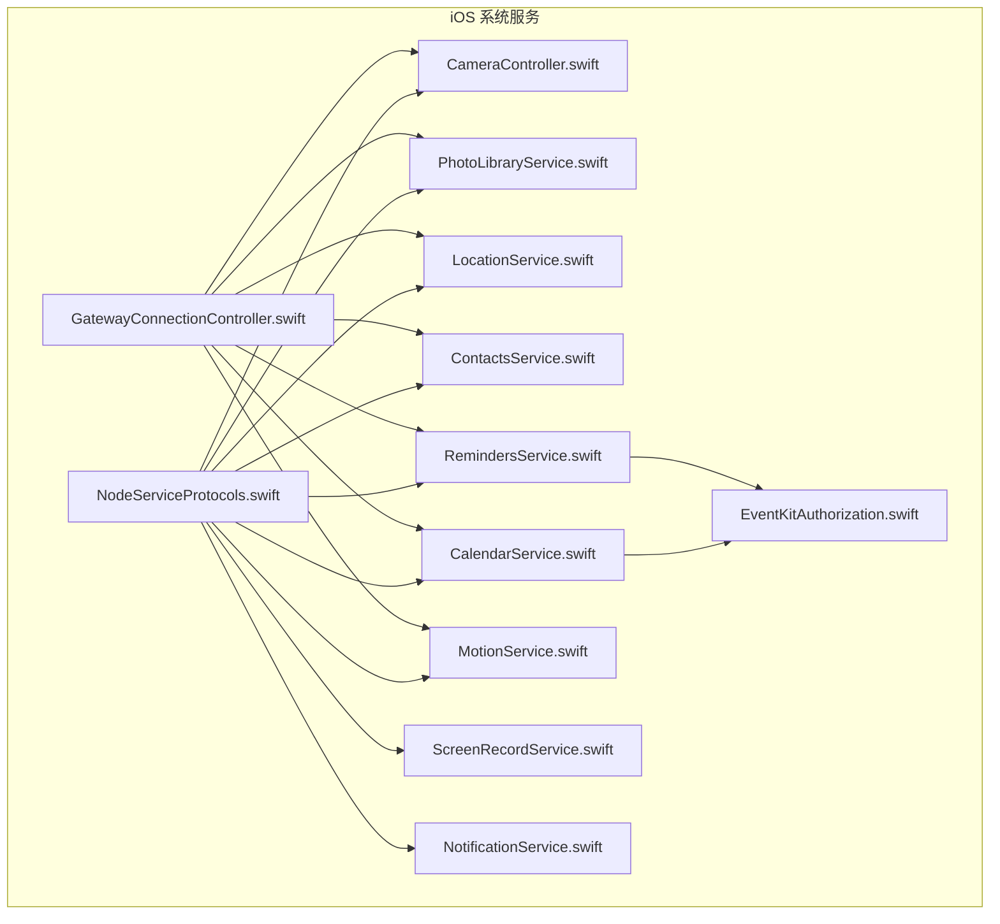
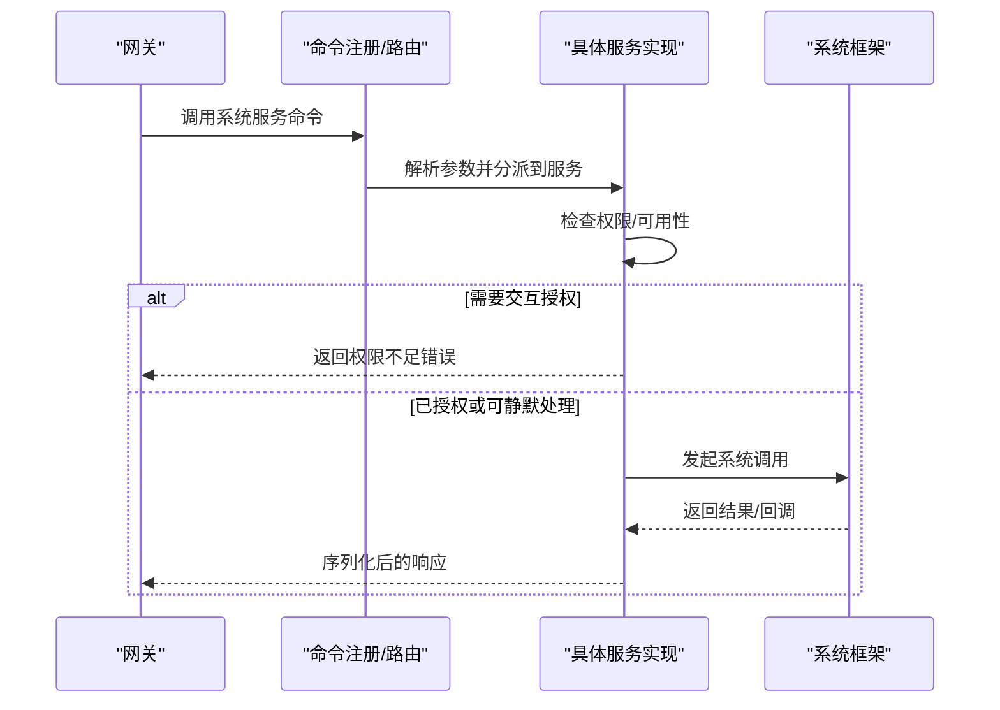
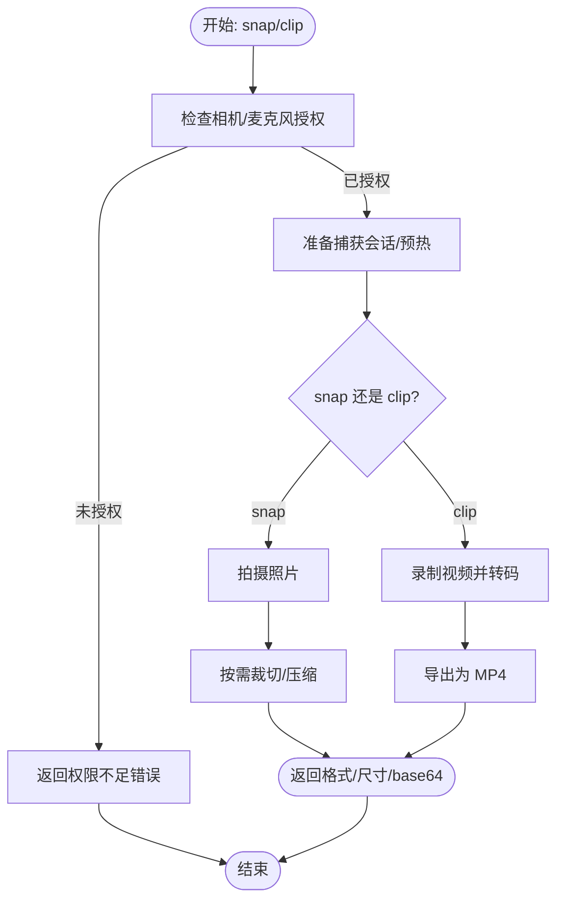
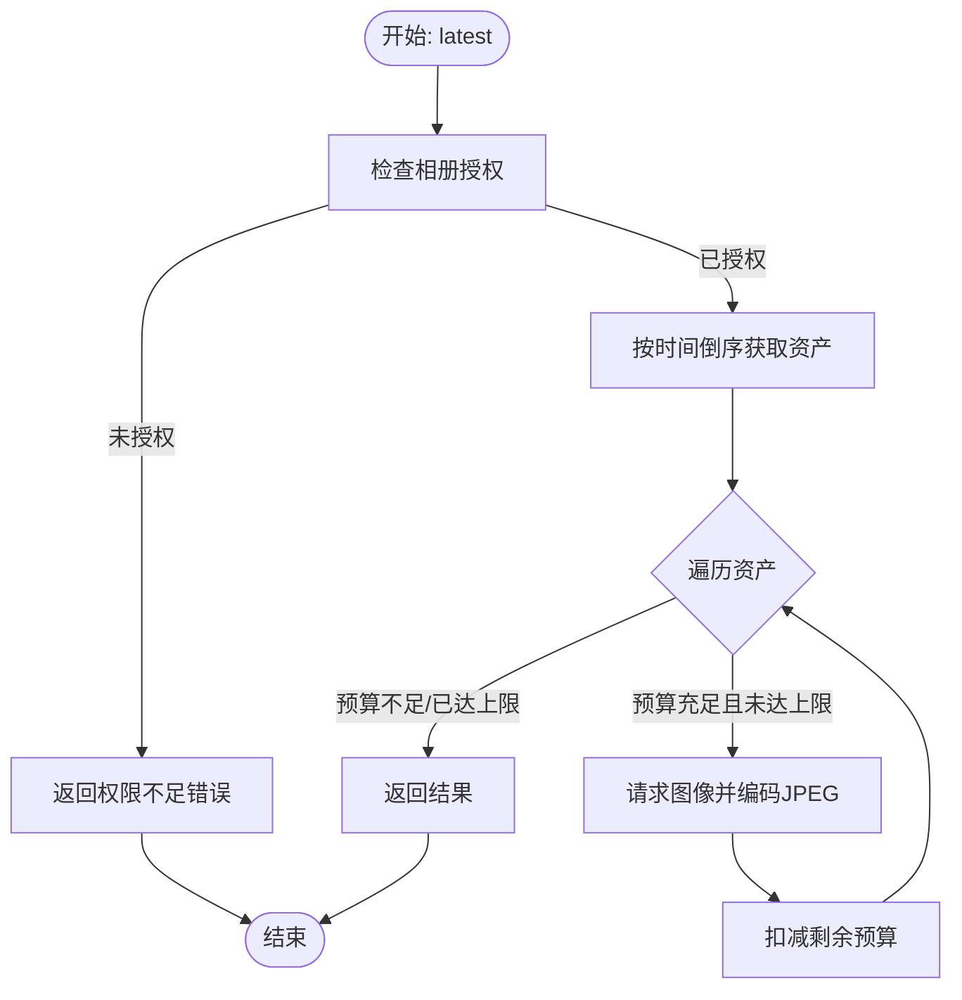
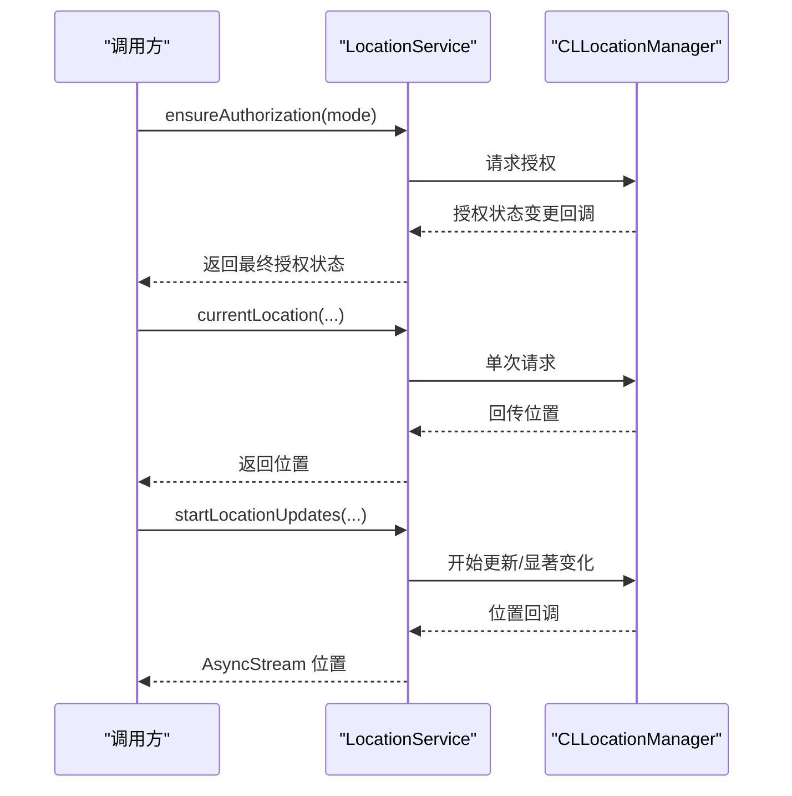
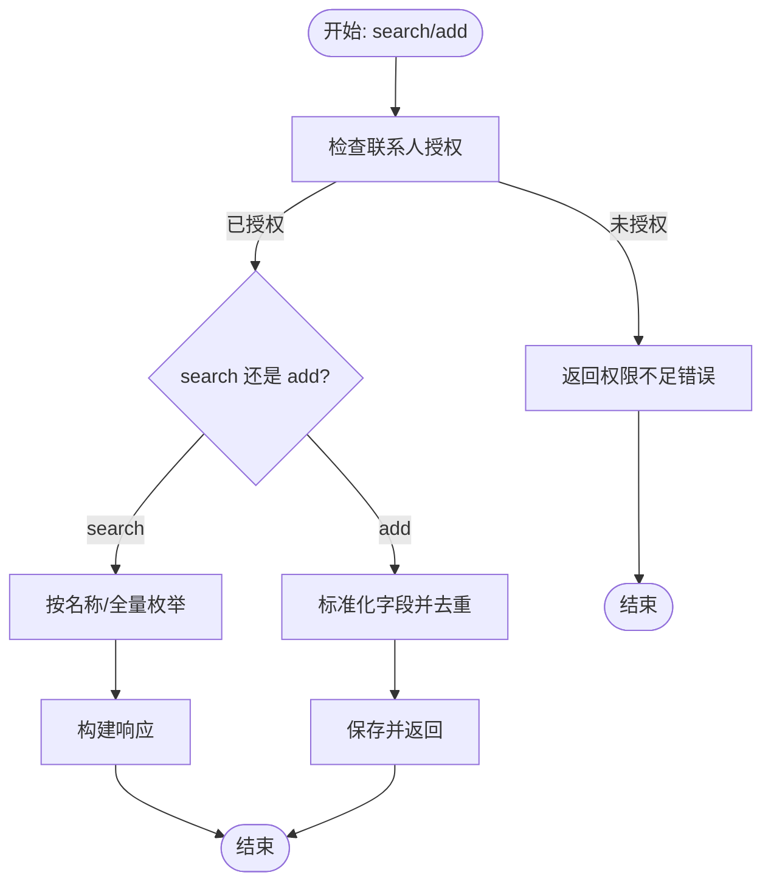
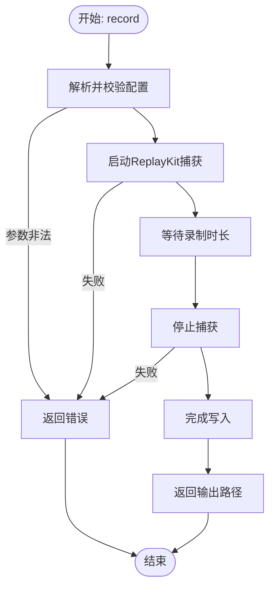
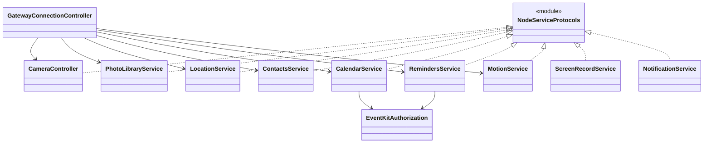

# 系统服务

<cite>
**本文引用的文件**
- [apps/ios/Sources/Services/NodeServiceProtocols.swift](file://apps/ios/Sources/Services/NodeServiceProtocols.swift)
- [apps/ios/Sources/Camera/CameraController.swift](file://apps/ios/Sources/Camera/CameraController.swift)
- [apps/ios/Sources/Media/PhotoLibraryService.swift](file://apps/ios/Sources/Media/PhotoLibraryService.swift)
- [apps/ios/Sources/Location/LocationService.swift](file://apps/ios/Sources/Location/LocationService.swift)
- [apps/ios/Sources/Contacts/ContactsService.swift](file://apps/ios/Sources/Contacts/ContactsService.swift)
- [apps/ios/Sources/Calendar/CalendarService.swift](file://apps/ios/Sources/Calendar/CalendarService.swift)
- [apps/ios/Sources/Reminders/RemindersService.swift](file://apps/ios/Sources/Reminders/RemindersService.swift)
- [apps/ios/Sources/Motion/MotionService.swift](file://apps/ios/Sources/Motion/MotionService.swift)
- [apps/ios/Sources/Screen/ScreenRecordService.swift](file://apps/ios/Sources/Screen/ScreenRecordService.swift)
- [apps/ios/Sources/Services/NotificationService.swift](file://apps/ios/Sources/Services/NotificationService.swift)
- [apps/ios/Sources/EventKit/EventKitAuthorization.swift](file://apps/ios/Sources/EventKit/EventKitAuthorization.swift)
- [apps/ios/Sources/Gateway/GatewayConnectionController.swift](file://apps/ios/Sources/Gateway/GatewayConnectionController.swift)
</cite>

## 目录
1. [简介](#简介)
2. [项目结构](#项目结构)
3. [核心组件](#核心组件)
4. [架构总览](#架构总览)
5. [详细组件分析](#详细组件分析)
6. [依赖关系分析](#依赖关系分析)
7. [性能与资源管理](#性能与资源管理)
8. [故障排查指南](#故障排查指南)
9. [结论](#结论)

## 简介
本文件面向OpenClaw iOS节点的系统服务能力，系统性梳理并说明以下能力：相机拍照/录像、相册读取、位置服务、联系人访问、日历与提醒事项、运动与步数统计、屏幕录制、通知中心接口，以及权限状态采集与上报。文档覆盖权限申请与使用流程、隐私保护与用户授权机制、服务配置与自定义选项（如权限范围）、性能优化策略、资源管理与错误处理。

## 项目结构
iOS系统服务主要位于apps/ios/Sources目录下，按功能域划分模块：
- Services：服务协议与通用通知接口
- Camera：相机拍照/录像与设备发现
- Media：相册读取与媒体转码
- Location：位置获取、更新与显著位置变化监控
- Contacts/Calendar/Reminders：联系人、日历、提醒事项
- Motion：运动活动与步数统计
- Screen：屏幕录制
- Gateway：权限状态聚合与上报

**图表来源**
- [apps/ios/Sources/Services/NodeServiceProtocols.swift](file://apps/ios/Sources/Services/NodeServiceProtocols.swift#L1-L108)
- [apps/ios/Sources/Camera/CameraController.swift](file://apps/ios/Sources/Camera/CameraController.swift#L1-L354)
- [apps/ios/Sources/Media/PhotoLibraryService.swift](file://apps/ios/Sources/Media/PhotoLibraryService.swift#L1-L165)
- [apps/ios/Sources/Location/LocationService.swift](file://apps/ios/Sources/Location/LocationService.swift#L1-L179)
- [apps/ios/Sources/Contacts/ContactsService.swift](file://apps/ios/Sources/Contacts/ContactsService.swift#L1-L211)
- [apps/ios/Sources/Calendar/CalendarService.swift](file://apps/ios/Sources/Calendar/CalendarService.swift#L1-L136)
- [apps/ios/Sources/Reminders/RemindersService.swift](file://apps/ios/Sources/Reminders/RemindersService.swift#L1-L134)
- [apps/ios/Sources/Motion/MotionService.swift](file://apps/ios/Sources/Motion/MotionService.swift#L1-L101)
- [apps/ios/Sources/Screen/ScreenRecordService.swift](file://apps/ios/Sources/Screen/ScreenRecordService.swift#L1-L352)
- [apps/ios/Sources/Services/NotificationService.swift](file://apps/ios/Sources/Services/NotificationService.swift#L1-L59)
- [apps/ios/Sources/EventKit/EventKitAuthorization.swift](file://apps/ios/Sources/EventKit/EventKitAuthorization.swift#L1-L35)
- [apps/ios/Sources/Gateway/GatewayConnectionController.swift](file://apps/ios/Sources/Gateway/GatewayConnectionController.swift#L875-L928)

**章节来源**
- [apps/ios/Sources/Services/NodeServiceProtocols.swift](file://apps/ios/Sources/Services/NodeServiceProtocols.swift#L1-L108)
- [apps/ios/Sources/Gateway/GatewayConnectionController.swift](file://apps/ios/Sources/Gateway/GatewayConnectionController.swift#L875-L928)

## 核心组件
- 服务协议层：统一抽象各类系统服务的能力边界，便于在网关侧以命令形式调用。
- 具体服务实现：围绕系统框架（AVFoundation、Photos、CoreLocation、Contacts、EventKit、CoreMotion、ReplayKit、UserNotifications）封装，提供参数校验、权限检查、错误映射与资源清理。
- 权限状态聚合：在连接控制器中汇总当前设备权限状态，供网关侧展示与决策。

关键职责与边界
- 协议层仅定义输入输出与行为契约，不直接持有系统对象。
- 实现层负责与系统框架交互，并对异常进行语义化包装。
- 权限状态聚合用于“能力通告”，避免在RPC调用中触发交互式授权。

**章节来源**
- [apps/ios/Sources/Services/NodeServiceProtocols.swift](file://apps/ios/Sources/Services/NodeServiceProtocols.swift#L9-L108)
- [apps/ios/Sources/Gateway/GatewayConnectionController.swift](file://apps/ios/Sources/Gateway/GatewayConnectionController.swift#L878-L910)

## 架构总览
系统服务通过协议与实现分离，形成清晰的边界；网关侧通过命令调用对应服务，服务内部完成权限校验与系统交互。

[此图为概念性流程示意，无需图表来源]

## 详细组件分析

### 相机服务（Camera）
- 能力
  - 列举可用摄像头设备
  - 拍照（支持指定前置/后置、最大宽度、质量、延时）
  - 录像（默认MP4，支持音频开关、时长限制）
- 关键点
  - 访问前确保相机/麦克风授权，未授权抛出语义化错误
  - 默认限制单次请求最大宽度与视频时长，避免超大载荷
  - 录像结束后清理临时文件
- 错误处理
  - 设备不可用、设置失败、导出失败、权限拒绝等均有明确错误类型

**图表来源**
- [apps/ios/Sources/Camera/CameraController.swift](file://apps/ios/Sources/Camera/CameraController.swift#L40-L142)

**章节来源**
- [apps/ios/Sources/Camera/CameraController.swift](file://apps/ios/Sources/Camera/CameraController.swift#L1-L354)

### 相册服务（Photos）
- 能力
  - 获取最新照片列表（限制数量、最大宽度、质量预算）
  - 自动控制单张与总量的base64长度，避免超过网关WS最大载荷
- 关键点
  - 读写授权均可使用；读取时同步请求图片，避免异步阻塞
  - 优先降低JPEG质量，再按需缩放尺寸
- 错误处理
  - 加载失败、编码失败、超出传输预算等均抛出语义化错误

**图表来源**
- [apps/ios/Sources/Media/PhotoLibraryService.swift](file://apps/ios/Sources/Media/PhotoLibraryService.swift#L16-L55)

**章节来源**
- [apps/ios/Sources/Media/PhotoLibraryService.swift](file://apps/ios/Sources/Media/PhotoLibraryService.swift#L1-L165)

### 位置服务（Location）
- 能力
  - 查询授权状态、精度授权
  - 确保授权（支持“始终”与“使用期间”模式）
  - 单次定位（带超时/过期策略）
  - 位置流式更新（显著位置变化或常规更新）
- 关键点
  - 使用CLLocationManagerDelegate处理授权变更与位置回调
  - 显著位置变化与常规更新共存时，两者都会收到数据
- 错误处理
  - 超时、不可用等错误类型化

**图表来源**
- [apps/ios/Sources/Location/LocationService.swift](file://apps/ios/Sources/Location/LocationService.swift#L34-L135)

**章节来源**
- [apps/ios/Sources/Location/LocationService.swift](file://apps/ios/Sources/Location/LocationService.swift#L1-L179)

### 联系人服务（Contacts）
- 能力
  - 搜索联系人（支持名称匹配与全量枚举）
  - 新增联系人（自动去重/合并）
- 关键点
  - 读取需要Full Access或Limited；写入需要Full Access或WriteOnly
  - 不在RPC调用中弹窗授权，避免阻塞与超时
- 错误处理
  - 参数无效、权限不足、查找/保存失败等

**图表来源**
- [apps/ios/Sources/Contacts/ContactsService.swift](file://apps/ios/Sources/Contacts/ContactsService.swift#L17-L99)
- [apps/ios/Sources/EventKit/EventKitAuthorization.swift](file://apps/ios/Sources/EventKit/EventKitAuthorization.swift#L1-L35)

**章节来源**
- [apps/ios/Sources/Contacts/ContactsService.swift](file://apps/ios/Sources/Contacts/ContactsService.swift#L1-L211)

### 日历服务（Calendar）
- 能力
  - 查询事件（支持日期范围与数量限制）
  - 新增事件（标题必填、起止时间必填）
- 关键点
  - 读取需要Full Access或WriteOnly；写入需要Full Access或WriteOnly
  - 未授权时抛出语义化错误
- 错误处理
  - 参数非法、日历不存在、保存失败等

**章节来源**
- [apps/ios/Sources/Calendar/CalendarService.swift](file://apps/ios/Sources/Calendar/CalendarService.swift#L1-L136)

### 提醒事项服务（Reminders）
- 能力
  - 列出提醒（支持状态过滤）
  - 新增提醒（可选截止时间）
- 关键点
  - 读取/写入均要求Full Access或WriteOnly
  - 未授权时抛出语义化错误
- 错误处理
  - 标题为空、列表不存在、保存失败等

**章节来源**
- [apps/ios/Sources/Reminders/RemindersService.swift](file://apps/ios/Sources/Reminders/RemindersService.swift#L1-L134)

### 运动与步数服务（Motion）
- 能力
  - 查询运动活动（支持时间范围与数量限制）
  - 查询步数统计（支持时间范围）
- 关键点
  - 需要“健康与健身”授权（.authorized）
  - 不可用时返回语义化错误
- 错误处理
  - 设备不支持、授权不足、查询失败等

**章节来源**
- [apps/ios/Sources/Motion/MotionService.swift](file://apps/ios/Sources/Motion/MotionService.swift#L1-L101)

### 屏幕录制服务（Screen Recording）
- 能力
  - 录制屏幕（支持时长、帧率、音频开关、输出路径）
- 关键点
  - 基于ReplayKit与AVFoundation，序列化写入避免并发问题
  - 采样间隔控制帧率，避免过度写入
  - 录制完成后完成写入并返回输出路径
- 错误处理
  - 输入索引非法、捕获失败、写入失败等

**图表来源**
- [apps/ios/Sources/Screen/ScreenRecordService.swift](file://apps/ios/Sources/Screen/ScreenRecordService.swift#L44-L68)

**章节来源**
- [apps/ios/Sources/Screen/ScreenRecordService.swift](file://apps/ios/Sources/Screen/ScreenRecordService.swift#L1-L352)

### 通知服务（Notification Center）
- 能力
  - 查询授权状态（含Provisional/Ephemeral）
  - 请求授权
  - 添加通知请求
- 关键点
  - 封装UNUserNotificationCenter，提供异步接口
  - 授权状态映射为统一枚举

**章节来源**
- [apps/ios/Sources/Services/NotificationService.swift](file://apps/ios/Sources/Services/NotificationService.swift#L1-L59)

### 权限状态聚合与上报
- 能力
  - 汇总相机、麦克风、语音识别、位置、屏幕录制、相册、联系人、日历、提醒、运动、手表等权限状态
  - 上报给网关用于能力通告与诊断
- 关键点
  - 位置需同时满足授权状态与系统开关开启
  - 日历/提醒使用EventKit授权判断
  - 运动使用运动活动与步数计数器授权任一满足即视为可用

**章节来源**
- [apps/ios/Sources/Gateway/GatewayConnectionController.swift](file://apps/ios/Sources/Gateway/GatewayConnectionController.swift#L878-L928)

## 依赖关系分析
- 协议与实现解耦：协议定义在NodeServiceProtocols.swift，具体实现以扩展方式接入协议，便于替换与测试
- 系统框架依赖：各服务直接依赖相应系统框架（AVFoundation、Photos、CoreLocation、Contacts、EventKit、CoreMotion、ReplayKit、UserNotifications）
- 权限判定复用：EventKitAuthorization统一处理日历/提醒的读写授权判定
- 网关集成：GatewayConnectionController聚合权限状态，作为能力通告的基础

**图表来源**
- [apps/ios/Sources/Services/NodeServiceProtocols.swift](file://apps/ios/Sources/Services/NodeServiceProtocols.swift#L105-L108)
- [apps/ios/Sources/EventKit/EventKitAuthorization.swift](file://apps/ios/Sources/EventKit/EventKitAuthorization.swift#L1-L35)
- [apps/ios/Sources/Gateway/GatewayConnectionController.swift](file://apps/ios/Sources/Gateway/GatewayConnectionController.swift#L878-L928)

**章节来源**
- [apps/ios/Sources/Services/NodeServiceProtocols.swift](file://apps/ios/Sources/Services/NodeServiceProtocols.swift#L1-L108)
- [apps/ios/Sources/EventKit/EventKitAuthorization.swift](file://apps/ios/Sources/EventKit/EventKitAuthorization.swift#L1-L35)
- [apps/ios/Sources/Gateway/GatewayConnectionController.swift](file://apps/ios/Sources/Gateway/GatewayConnectionController.swift#L878-L928)

## 性能与资源管理
- 负载控制
  - 相册服务对单张与总量base64长度设限，避免网关WS断连
  - 相机服务默认限制最大宽度与视频时长，减少payload体积
- 资源清理
  - 相机录像与屏幕录制在完成后清理临时文件
  - 录制过程中严格控制写入队列，避免并发冲突
- 能耗与体验
  - 位置服务支持显著位置变化监听，降低功耗
  - 录制帧率与采样间隔受控，避免过度CPU/IO占用

[本节为通用性能建议，无需章节来源]

## 故障排查指南
- 相机/麦克风权限
  - 现象：调用失败并提示权限不足
  - 处理：在系统设置中授予相机/麦克风权限；若为静默调用，建议引导用户在设置中手动授权
- 相册权限
  - 现象：相册读取失败
  - 处理：确认相册授权状态；Limited也可满足读取需求
- 位置服务
  - 现象：位置不可用或授权失败
  - 处理：检查系统定位开关与应用授权；必要时切换为“始终允许”
- 日历/提醒
  - 现象：读取/写入失败
  - 处理：确认Full Access或WriteOnly授权；检查日历是否存在
- 运动与步数
  - 现象：设备不支持或授权不足
  - 处理：确认“健康与健身”授权；部分设备可能不支持某些功能
- 屏幕录制
  - 现象：录制失败或无画面
  - 处理：检查ReplayKit可用性与音频开关；确认输出路径可写

**章节来源**
- [apps/ios/Sources/Camera/CameraController.swift](file://apps/ios/Sources/Camera/CameraController.swift#L154-L158)
- [apps/ios/Sources/Media/PhotoLibraryService.swift](file://apps/ios/Sources/Media/PhotoLibraryService.swift#L17-L22)
- [apps/ios/Sources/Location/LocationService.swift](file://apps/ios/Sources/Location/LocationService.swift#L34-L54)
- [apps/ios/Sources/Calendar/CalendarService.swift](file://apps/ios/Sources/Calendar/CalendarService.swift#L8-L14)
- [apps/ios/Sources/Reminders/RemindersService.swift](file://apps/ios/Sources/Reminders/RemindersService.swift#L7-L14)
- [apps/ios/Sources/Motion/MotionService.swift](file://apps/ios/Sources/Motion/MotionService.swift#L7-L17)
- [apps/ios/Sources/Screen/ScreenRecordService.swift](file://apps/ios/Sources/Screen/ScreenRecordService.swift#L278-L297)

## 结论
OpenClaw iOS节点的系统服务以协议抽象与实现解耦为核心设计，结合严格的权限检查、负载控制与资源清理策略，在保证用户体验的同时兼顾了隐私与性能。通过GatewayConnectionController的权限聚合，网关侧能够准确感知节点能力并进行合理调度。建议在生产环境中遵循最小授权原则，按需启用功能，并持续关注系统版本差异带来的能力变化。