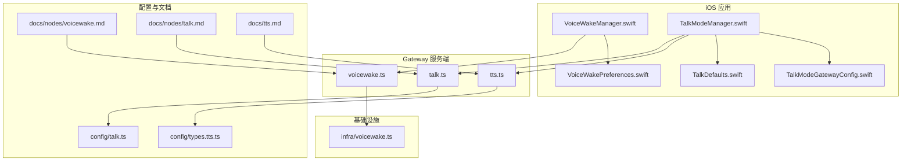
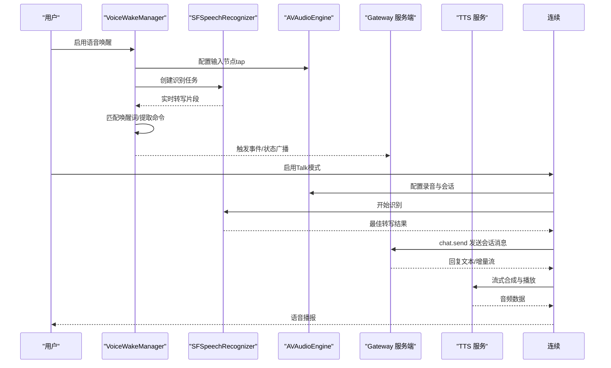
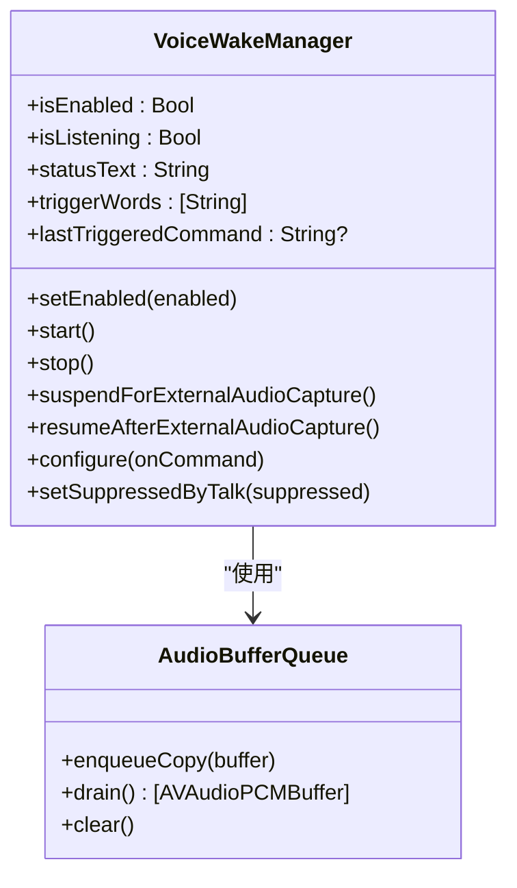
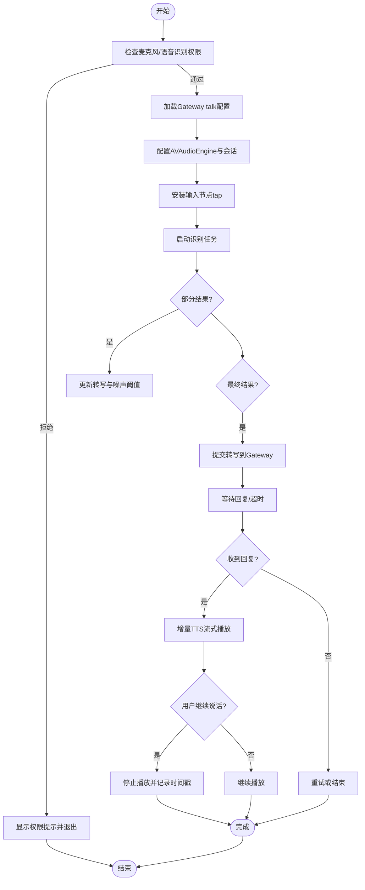
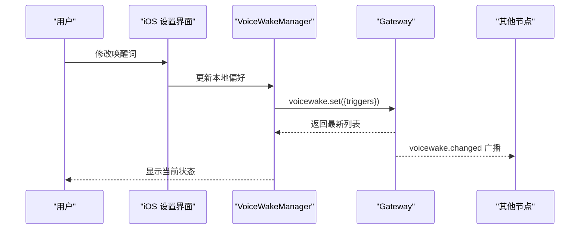
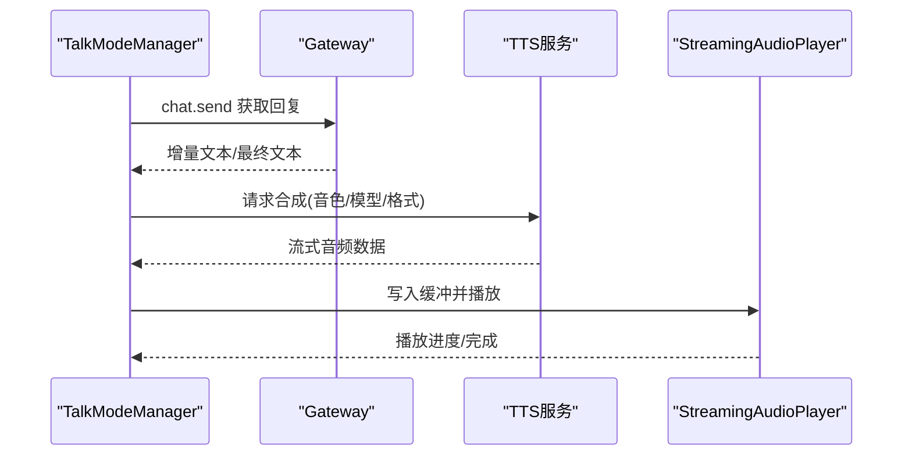
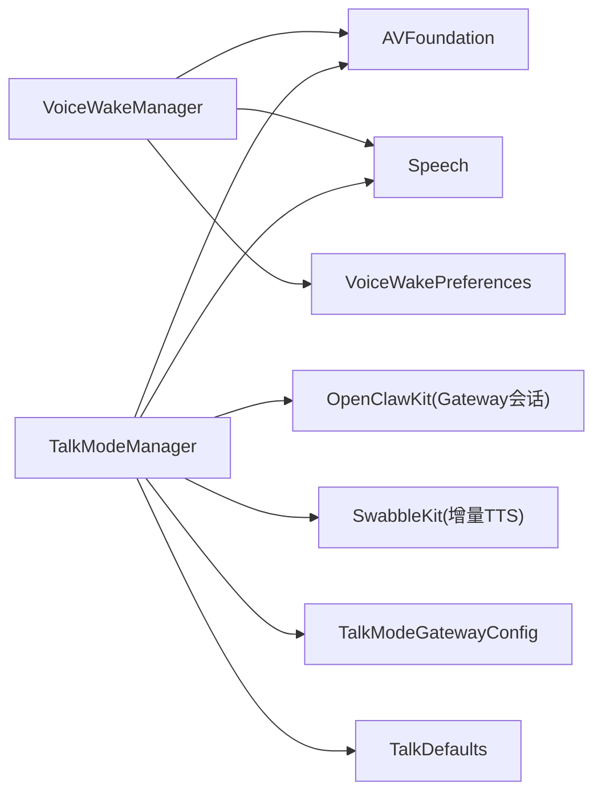

# 语音功能

<cite>
**本文引用的文件**
- [apps/ios/Sources/Voice/VoiceWakeManager.swift](file://apps/ios/Sources/Voice/VoiceWakeManager.swift)
- [apps/ios/Sources/Voice/VoiceWakePreferences.swift](file://apps/ios/Sources/Voice/VoiceWakePreferences.swift)
- [apps/ios/Sources/Voice/TalkModeManager.swift](file://apps/ios/Sources/Voice/TalkModeManager.swift)
- [apps/ios/Sources/Voice/TalkDefaults.swift](file://apps/ios/Sources/Voice/TalkDefaults.swift)
- [apps/ios/Sources/Voice/TalkModeGatewayConfig.swift](file://apps/ios/Sources/Voice/TalkModeGatewayConfig.swift)
- [docs/nodes/voicewake.md](file://docs/nodes/voicewake.md)
- [docs/nodes/talk.md](file://docs/nodes/talk.md)
- [docs/tts.md](file://docs/tts.md)
- [src/gateway/server-methods/voicewake.ts](file://src/gateway/server-methods/voicewake.ts)
- [src/gateway/server-methods/talk.ts](file://src/gateway/server-methods/talk.ts)
- [src/gateway/server-methods/tts.ts](file://src/gateway/server-methods/tts.ts)
- [src/infra/voicewake.ts](file://src/infra/voicewake.ts)
- [src/config/talk.ts](file://src/config/talk.ts)
- [src/config/types.tts.ts](file://src/config/types.tts.ts)
</cite>

## 目录
1. [简介](#简介)
2. [项目结构](#项目结构)
3. [核心组件](#核心组件)
4. [架构总览](#架构总览)
5. [详细组件分析](#详细组件分析)
6. [依赖关系分析](#依赖关系分析)
7. [性能与质量优化](#性能与质量优化)
8. [权限与配置指南](#权限与配置指南)
9. [故障排查](#故障排查)
10. [结论](#结论)

## 简介
本文件面向OpenClaw iOS节点的语音能力，系统性梳理并解释以下内容：
- 语音唤醒：全局唤醒词同步、本地启用开关、权限请求与状态管理、误唤醒抑制策略
- 语音识别（ASR）：连续监听、静音窗口、推一下说（PTT）、中断播放、错误恢复
- 语音合成（TTS）：ElevenLabs/OpenAI/Edge TTS多提供商支持、增量流式播放、输出格式与限制
- 语音质量与降噪：噪声阈值估计、动态阈值、音频会话配置
- 权限与配置：麦克风与语音识别权限、TTS密钥与输出格式、唤醒词配置与同步

## 项目结构
iOS侧语音相关代码集中在apps/ios/Sources/Voice目录，配合Gateway侧的协议方法与配置解析，形成“本地采集 + 网关推理 + 流式播放”的完整链路。

**图表来源**
- [apps/ios/Sources/Voice/VoiceWakeManager.swift](file://apps/ios/Sources/Voice/VoiceWakeManager.swift#L83-L477)
- [apps/ios/Sources/Voice/VoiceWakePreferences.swift](file://apps/ios/Sources/Voice/VoiceWakePreferences.swift#L1-L45)
- [apps/ios/Sources/Voice/TalkModeManager.swift](file://apps/ios/Sources/Voice/TalkModeManager.swift#L32-L800)
- [apps/ios/Sources/Voice/TalkDefaults.swift](file://apps/ios/Sources/Voice/TalkDefaults.swift#L1-L4)
- [apps/ios/Sources/Voice/TalkModeGatewayConfig.swift](file://apps/ios/Sources/Voice/TalkModeGatewayConfig.swift#L1-L70)
- [src/gateway/server-methods/voicewake.ts](file://src/gateway/server-methods/voicewake.ts)
- [src/gateway/server-methods/talk.ts](file://src/gateway/server-methods/talk.ts)
- [src/gateway/server-methods/tts.ts](file://src/gateway/server-methods/tts.ts)
- [src/infra/voicewake.ts](file://src/infra/voicewake.ts)
- [src/config/talk.ts](file://src/config/talk.ts)
- [src/config/types.tts.ts](file://src/config/types.tts.ts)
- [docs/nodes/voicewake.md](file://docs/nodes/voicewake.md#L1-L67)
- [docs/nodes/talk.md](file://docs/nodes/talk.md#L1-L93)
- [docs/tts.md](file://docs/tts.md#L1-L404)

**章节来源**
- [apps/ios/Sources/Voice/VoiceWakeManager.swift](file://apps/ios/Sources/Voice/VoiceWakeManager.swift#L83-L477)
- [apps/ios/Sources/Voice/TalkModeManager.swift](file://apps/ios/Sources/Voice/TalkModeManager.swift#L32-L800)
- [docs/nodes/voicewake.md](file://docs/nodes/voicewake.md#L1-L67)
- [docs/nodes/talk.md](file://docs/nodes/talk.md#L1-L93)
- [docs/tts.md](file://docs/tts.md#L1-L404)

## 核心组件
- 语音唤醒（VoiceWakeManager）
  - 负责麦克风权限与语音识别权限的申请与状态展示
  - 建立AVAudioEngine输入节点tap，将音频缓冲区注入SFSpeechAudioBufferRecognitionRequest
  - 使用SwabbleKit进行唤醒词匹配与命令提取
  - 支持外部音频抢占暂停与恢复
- 语音唤醒偏好（VoiceWakePreferences）
  - 存储与清洗唤醒词列表（去空白、截断、上限控制）
  - 解码来自Gateway的触发词payload
- 连续对话（TalkModeManager）
  - 连续/PTT两种捕获模式，静音窗口自动提交
  - 与Gateway建立会话订阅，发送消息并等待回复
  - 增量TTS流式播放，支持打断、超时与错误恢复
  - 音频会话配置、噪声阈值估计与动态阈值
- 说话默认参数（TalkDefaults）
  - 默认静音窗口（毫秒）
- 会话配置解析（TalkModeGatewayConfig）
  - 解析Gateway下发的talk配置，选择活跃提供商、默认音色/模型/输出格式、静音窗口、是否打断等

**章节来源**
- [apps/ios/Sources/Voice/VoiceWakeManager.swift](file://apps/ios/Sources/Voice/VoiceWakeManager.swift#L83-L477)
- [apps/ios/Sources/Voice/VoiceWakePreferences.swift](file://apps/ios/Sources/Voice/VoiceWakePreferences.swift#L1-L45)
- [apps/ios/Sources/Voice/TalkModeManager.swift](file://apps/ios/Sources/Voice/TalkModeManager.swift#L32-L800)
- [apps/ios/Sources/Voice/TalkDefaults.swift](file://apps/ios/Sources/Voice/TalkDefaults.swift#L1-L4)
- [apps/ios/Sources/Voice/TalkModeGatewayConfig.swift](file://apps/ios/Sources/Voice/TalkModeGatewayConfig.swift#L1-L70)

## 架构总览
下图展示了iOS节点在语音唤醒与连续对话中的关键交互：本地权限与引擎管理、Gateway协议方法、以及TTS/ASR服务端处理。

**图表来源**
- [apps/ios/Sources/Voice/VoiceWakeManager.swift](file://apps/ios/Sources/Voice/VoiceWakeManager.swift#L160-L350)
- [apps/ios/Sources/Voice/TalkModeManager.swift](file://apps/ios/Sources/Voice/TalkModeManager.swift#L166-L208)
- [src/gateway/server-methods/voicewake.ts](file://src/gateway/server-methods/voicewake.ts)
- [src/gateway/server-methods/talk.ts](file://src/gateway/server-methods/talk.ts)
- [src/gateway/server-methods/tts.ts](file://src/gateway/server-methods/tts.ts)

## 详细组件分析

### 语音唤醒（VoiceWakeManager）
- 关键职责
  - 权限管理：麦克风与语音识别授权请求与超时处理
  - 音频管道：安装输入节点tap，将实时缓冲复制到识别请求
  - 识别循环：持续接收部分结果，提取最佳转写与分段，匹配唤醒词
  - 状态与恢复：错误后自动重启；外部抢占暂停/恢复；受Talk模式抑制
- 数据结构与算法
  - AudioBufferQueue：线程安全的环形缓冲队列，用于跨线程传递音频帧
  - WakeWord匹配：基于SwabbleKit的门控匹配器，支持最小触发后间隔
- 错误处理
  - 识别错误分类：取消、无语音、其他；对连续模式进行自动重启
  - 权限失败：显示明确提示并阻断启动
- 平台差异
  - 模拟器：不支持长期录音，启动时直接提示不支持

**图表来源**
- [apps/ios/Sources/Voice/VoiceWakeManager.swift](file://apps/ios/Sources/Voice/VoiceWakeManager.swift#L83-L477)

**章节来源**
- [apps/ios/Sources/Voice/VoiceWakeManager.swift](file://apps/ios/Sources/Voice/VoiceWakeManager.swift#L83-L477)
- [apps/ios/Sources/Voice/VoiceWakePreferences.swift](file://apps/ios/Sources/Voice/VoiceWakePreferences.swift#L1-L45)
- [docs/nodes/voicewake.md](file://docs/nodes/voicewake.md#L1-L67)

### 连续对话（TalkModeManager）
- 关键职责
  - 捕获模式：连续/推一下说（PTT），静音窗口自动提交
  - 会话管理：订阅主会话，发送chat消息，等待完成或超时
  - 增量TTS：按回复增量播放，支持打断、超时与错误恢复
  - 音频质量：噪声阈值估计与动态阈值，平滑micLevel反馈
- 数据流
  - 输入tap -> SFSpeechRecognitionTask -> 部分/最终结果 -> 提交/等待 -> 流式TTS -> 播放
- 中断与恢复
  - 打断：检测到用户说话时停止播放
  - 自动重启：识别错误后短暂延迟重启
- 配置解析
  - 从Gateway配置中解析活跃提供商、默认音色/模型/输出格式、静音窗口、是否打断

**图表来源**
- [apps/ios/Sources/Voice/TalkModeManager.swift](file://apps/ios/Sources/Voice/TalkModeManager.swift#L166-L800)
- [apps/ios/Sources/Voice/TalkModeGatewayConfig.swift](file://apps/ios/Sources/Voice/TalkModeGatewayConfig.swift#L17-L69)

**章节来源**
- [apps/ios/Sources/Voice/TalkModeManager.swift](file://apps/ios/Sources/Voice/TalkModeManager.swift#L32-L800)
- [apps/ios/Sources/Voice/TalkDefaults.swift](file://apps/ios/Sources/Voice/TalkDefaults.swift#L1-L4)
- [apps/ios/Sources/Voice/TalkModeGatewayConfig.swift](file://apps/ios/Sources/Voice/TalkModeGatewayConfig.swift#L1-L70)
- [docs/nodes/talk.md](file://docs/nodes/talk.md#L1-L93)

### 语音唤醒词配置与同步
- 全局列表与同步
  - 唤醒词由Gateway持有并广播，所有节点共享同一列表
  - iOS本地保存启用开关与唤醒词列表，编辑后调用Gateway设置方法并保持本地响应
- 本地偏好
  - 清洗规则：去空白、去空项、数量与长度上限、默认值回退
  - 解码Gateway payload并应用清洗
- Gateway协议
  - 方法：获取/设置唤醒词、事件通知
  - 存储位置：Gateway主机上的设置文件

**图表来源**
- [apps/ios/Sources/Voice/VoiceWakeManager.swift](file://apps/ios/Sources/Voice/VoiceWakeManager.swift#L133-L158)
- [apps/ios/Sources/Voice/VoiceWakePreferences.swift](file://apps/ios/Sources/Voice/VoiceWakePreferences.swift#L23-L44)
- [docs/nodes/voicewake.md](file://docs/nodes/voicewake.md#L30-L67)
- [src/gateway/server-methods/voicewake.ts](file://src/gateway/server-methods/voicewake.ts)
- [src/infra/voicewake.ts](file://src/infra/voicewake.ts)

**章节来源**
- [apps/ios/Sources/Voice/VoiceWakePreferences.swift](file://apps/ios/Sources/Voice/VoiceWakePreferences.swift#L1-L45)
- [docs/nodes/voicewake.md](file://docs/nodes/voicewake.md#L1-L67)

### 语音合成（TTS）与流式播放
- 多提供商支持
  - ElevenLabs、OpenAI、Edge TTS；可配置默认提供商与回退策略
  - 支持模型覆盖指令（当启用模型驱动覆盖时）
- 输出格式与平台适配
  - iOS默认PCM 44.1kHz；Android默认PCM 24kHz；Telegram语音采用Opus
- 增量流式播放
  - Talk模式支持增量TTS，边听边播，降低延迟
- 自动化与限制
  - 可配置自动TTS模式（仅入站/标签/总是/关闭）
  - 文本长度上限、超时、摘要阈值等

**图表来源**
- [apps/ios/Sources/Voice/TalkModeManager.swift](file://apps/ios/Sources/Voice/TalkModeManager.swift#L758-L800)
- [src/gateway/server-methods/tts.ts](file://src/gateway/server-methods/tts.ts)
- [docs/tts.md](file://docs/tts.md#L1-L404)

**章节来源**
- [docs/tts.md](file://docs/tts.md#L1-L404)
- [src/gateway/server-methods/tts.ts](file://src/gateway/server-methods/tts.ts)

## 依赖关系分析
- 组件内聚与耦合
  - VoiceWakeManager与TalkModeManager均强依赖AVFoundation与Speech框架
  - TalkModeManager与Gateway协议方法紧密耦合（会话订阅、消息发送、TTS调用）
- 外部依赖
  - SwabbleKit用于唤醒词匹配
  - OpenClawKit提供Gateway会话与协议类型
- 协议与配置
  - Gateway提供voicewake与talk/tts RPC方法
  - iOS侧解析Gateway配置并应用到运行时行为

**图表来源**
- [apps/ios/Sources/Voice/VoiceWakeManager.swift](file://apps/ios/Sources/Voice/VoiceWakeManager.swift#L1-L13)
- [apps/ios/Sources/Voice/TalkModeManager.swift](file://apps/ios/Sources/Voice/TalkModeManager.swift#L1-L10)
- [apps/ios/Sources/Voice/VoiceWakePreferences.swift](file://apps/ios/Sources/Voice/VoiceWakePreferences.swift#L1-L45)
- [apps/ios/Sources/Voice/TalkModeGatewayConfig.swift](file://apps/ios/Sources/Voice/TalkModeGatewayConfig.swift#L1-L70)
- [apps/ios/Sources/Voice/TalkDefaults.swift](file://apps/ios/Sources/Voice/TalkDefaults.swift#L1-L4)

**章节来源**
- [apps/ios/Sources/Voice/VoiceWakeManager.swift](file://apps/ios/Sources/Voice/VoiceWakeManager.swift#L83-L477)
- [apps/ios/Sources/Voice/TalkModeManager.swift](file://apps/ios/Sources/Voice/TalkModeManager.swift#L32-L800)

## 性能与质量优化
- 低延迟与流式播放
  - 增量TTS与流式播放显著降低端到端延迟
  - iOS默认PCM 44.1kHz以提升清晰度
- 静音窗口与打断
  - 可配置静音窗口，减少误触发
  - 打断播放避免重复与延迟累积
- 动态阈值与噪声估计
  - 基于输入音频估计噪声底噪，动态调整阈值，提高稳定性
- 会话与资源管理
  - 识别错误后短延时重启，避免频繁抖动
  - 外部抢占时释放音频会话，恢复后自动重启

**章节来源**
- [apps/ios/Sources/Voice/TalkModeManager.swift](file://apps/ios/Sources/Voice/TalkModeManager.swift#L533-L560)
- [apps/ios/Sources/Voice/TalkModeManager.swift](file://apps/ios/Sources/Voice/TalkModeManager.swift#L624-L642)
- [docs/nodes/talk.md](file://docs/nodes/talk.md#L65-L93)

## 权限与配置指南
- 权限
  - 麦克风权限：录音授权失败时，VoiceWake与Talk均无法启动
  - 语音识别权限：SFSpeechRecognizer授权失败时，识别不可用
  - 权限超时保护：请求权限带超时，避免UI卡死
- 配置
  - 唤醒词：Gateway集中管理，iOS本地存储并清洗
  - Talk模式：静音窗口、是否打断、默认音色/模型/输出格式
  - TTS：提供商选择、API密钥、输出格式、最大文本长度、摘要阈值
- 平台差异
  - iOS默认静音窗口较长；Android默认较短
  - Telegram语音采用Opus以获得圆润语音气泡体验

**章节来源**
- [apps/ios/Sources/Voice/VoiceWakeManager.swift](file://apps/ios/Sources/Voice/VoiceWakeManager.swift#L177-L195)
- [apps/ios/Sources/Voice/TalkModeManager.swift](file://apps/ios/Sources/Voice/TalkModeManager.swift#L176-L190)
- [apps/ios/Sources/Voice/VoiceWakePreferences.swift](file://apps/ios/Sources/Voice/VoiceWakePreferences.swift#L23-L44)
- [docs/nodes/talk.md](file://docs/nodes/talk.md#L50-L93)
- [docs/tts.md](file://docs/tts.md#L64-L239)

## 故障排查
- 语音唤醒
  - 现象：提示“不支持模拟器”或“权限被拒”
  - 排查：确认设备真机、麦克风与语音识别权限已授予
  - 处理：重新授权或在设置中开启权限
- 连续对话
  - 现象：识别报错或“无语音检测”，状态停留在“Speech error”
  - 排查：检查音频会话配置、输入格式有效性、网络连通性
  - 处理：等待短暂延迟后自动重启识别；必要时手动重启Talk模式
- TTS
  - 现象：PCM被拒（订阅限制）、输出格式不兼容
  - 排查：切换为MP3输出或更换提供商；检查API密钥与配额
  - 处理：会话内自动回退至MP3；调整配置后重试

**章节来源**
- [apps/ios/Sources/Voice/VoiceWakeManager.swift](file://apps/ios/Sources/Voice/VoiceWakeManager.swift#L177-L195)
- [apps/ios/Sources/Voice/TalkModeManager.swift](file://apps/ios/Sources/Voice/TalkModeManager.swift#L575-L621)
- [docs/tts.md](file://docs/tts.md#L201-L239)

## 结论
OpenClaw iOS节点的语音功能以“本地采集 + Gateway推理 + 流式播放”为核心路径，具备：
- 全局统一的唤醒词管理与同步
- 稳定的连续/PTT识别与静音窗口策略
- 多提供商TTS与增量流式播放
- 完善的权限与错误恢复机制
建议在生产环境中结合平台特性（如iOS默认静音窗口）与业务需求（如Telegram语音气泡）进行配置优化，并关注权限与网络稳定性对用户体验的影响。