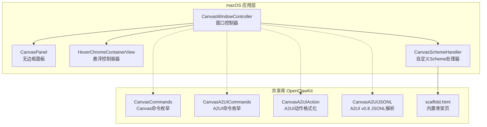
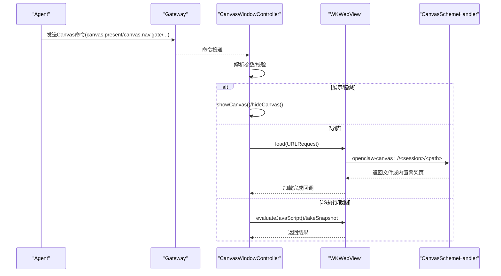
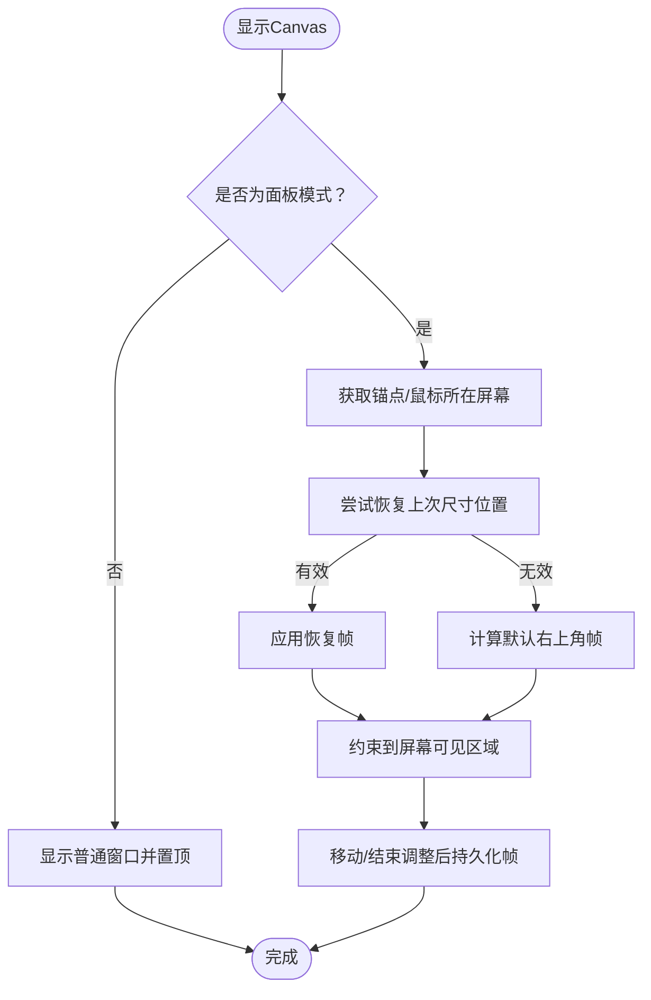
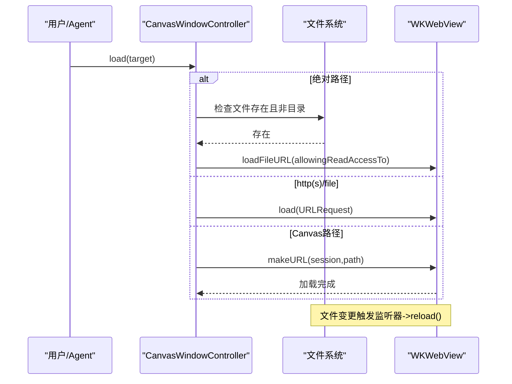
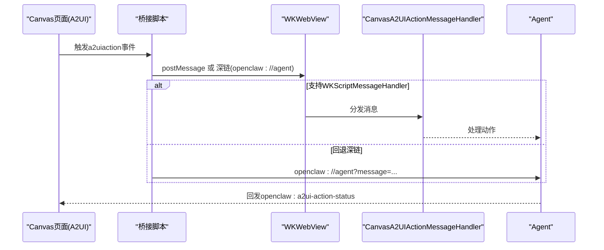
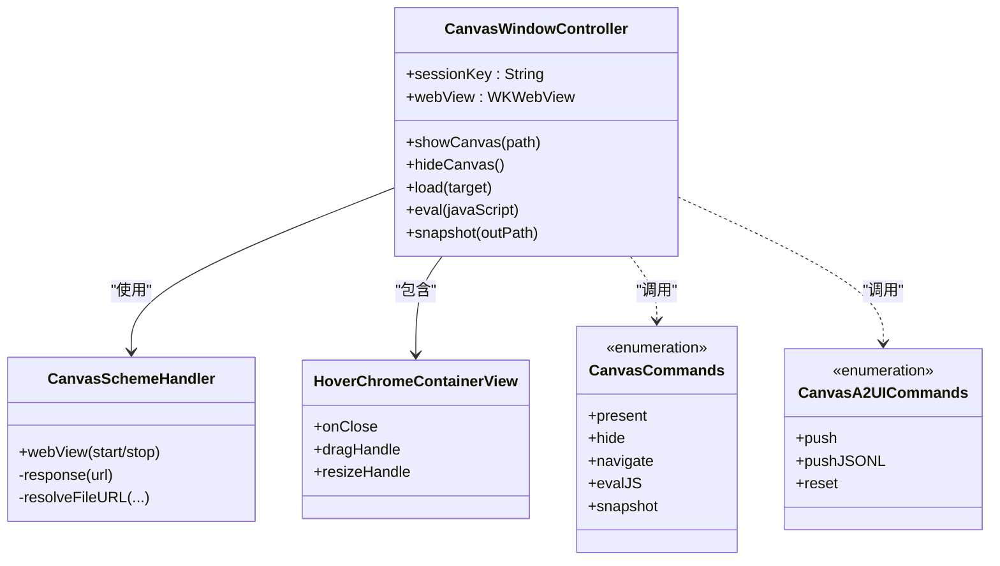

# Canvas界面

<cite>
**本文引用的文件**
- [CanvasWindow.swift](file://apps/macos/Sources/OpenClaw/CanvasWindow.swift)
- [CanvasWindowController.swift](file://apps/macos/Sources/OpenClaw/CanvasWindowController.swift)
- [CanvasWindowController+Window.swift](file://apps/macos/Sources/OpenClaw/CanvasWindowController+Window.swift)
- [CanvasWindowController+Helpers.swift](file://apps/macos/Sources/OpenClaw/CanvasWindowController+Helpers.swift)
- [CanvasChromeContainerView.swift](file://apps/macos/Sources/OpenClaw/CanvasChromeContainerView.swift)
- [CanvasSchemeHandler.swift](file://apps/macos/Sources/OpenClaw/CanvasSchemeHandler.swift)
- [CanvasA2UICommands.swift](file://apps/shared/OpenClawKit/Sources/OpenClawKit/CanvasA2UICommands.swift)
- [CanvasCommands.swift](file://apps/shared/OpenClawKit/Sources/OpenClawKit/CanvasCommands.swift)
- [CanvasA2UIAction.swift](file://apps/shared/OpenClawKit/Sources/OpenClawKit/CanvasA2UIAction.swift)
- [CanvasA2UIJSONL.swift](file://apps/shared/OpenClawKit/Sources/OpenClawKit/CanvasA2UIJSONL.swift)
- [scaffold.html](file://apps/shared/OpenClawKit/Sources/OpenClawKit/Resources/CanvasScaffold/scaffold.html)
- [canvas.md](file://docs/platforms/mac/canvas.md)
</cite>

## 目录
1. [简介](#简介)
2. [项目结构](#项目结构)
3. [核心组件](#核心组件)
4. [架构总览](#架构总览)
5. [详细组件分析](#详细组件分析)
6. [依赖关系分析](#依赖关系分析)
7. [性能考量](#性能考量)
8. [故障排查指南](#故障排查指南)
9. [结论](#结论)
10. [附录](#附录)

## 简介
本文件面向OpenClaw macOS平台的Canvas界面，系统性阐述其设计理念、交互模式、功能特性与实现细节。Canvas以WKWebView嵌入为核心，通过自定义URL Scheme提供安全可控的本地可视化工作区，并支持A2UI渲染与Agent触发的深链调用。文档覆盖窗口布局、工具栏与拖拽调整、画布操作、实时协作（通过文件监听自动重载）、配置与主题样式、快捷键与工作流优化，以及与OpenClaw其他组件的数据同步与状态管理。

## 项目结构
Canvas界面主要由macOS应用层与共享库两部分构成：
- macOS应用层：负责窗口生命周期、面板锚定、拖拽调整、深链与脚本桥接、文件监听与自动重载等。
- 共享库（OpenClawKit）：提供Canvas命令、A2UI命令与消息格式、资源内嵌的scaffold页面等。

图表来源
- [CanvasWindowController.swift](file://apps/macos/Sources/OpenClaw/CanvasWindowController.swift#L1-L348)
- [CanvasChromeContainerView.swift](file://apps/macos/Sources/OpenClaw/CanvasChromeContainerView.swift#L1-L236)
- [CanvasSchemeHandler.swift](file://apps/macos/Sources/OpenClaw/CanvasSchemeHandler.swift#L1-L260)
- [CanvasCommands.swift](file://apps/shared/OpenClawKit/Sources/OpenClawKit/CanvasCommands.swift#L1-L10)
- [CanvasA2UICommands.swift](file://apps/shared/OpenClawKit/Sources/OpenClawKit/CanvasA2UICommands.swift#L1-L27)
- [CanvasA2UIAction.swift](file://apps/shared/OpenClawKit/Sources/OpenClawKit/CanvasA2UIAction.swift#L1-L105)
- [CanvasA2UIJSONL.swift](file://apps/shared/OpenClawKit/Sources/OpenClawKit/CanvasA2UIJSONL.swift#L1-L82)
- [scaffold.html](file://apps/shared/OpenClawKit/Sources/OpenClawKit/Resources/CanvasScaffold/scaffold.html#L1-L226)

章节来源
- [CanvasWindow.swift](file://apps/macos/Sources/OpenClaw/CanvasWindow.swift#L1-L32)
- [CanvasWindowController.swift](file://apps/macos/Sources/OpenClaw/CanvasWindowController.swift#L1-L348)
- [CanvasWindowController+Window.swift](file://apps/macos/Sources/OpenClaw/CanvasWindowController+Window.swift#L1-L167)
- [CanvasWindowController+Helpers.swift](file://apps/macos/Sources/OpenClaw/CanvasWindowController+Helpers.swift#L1-L44)
- [CanvasChromeContainerView.swift](file://apps/macos/Sources/OpenClaw/CanvasChromeContainerView.swift#L1-L236)
- [CanvasSchemeHandler.swift](file://apps/macos/Sources/OpenClaw/CanvasSchemeHandler.swift#L1-L260)
- [CanvasCommands.swift](file://apps/shared/OpenClawKit/Sources/OpenClawKit/CanvasCommands.swift#L1-L10)
- [CanvasA2UICommands.swift](file://apps/shared/OpenClawKit/Sources/OpenClawKit/CanvasA2UICommands.swift#L1-L27)
- [CanvasA2UIAction.swift](file://apps/shared/OpenClawKit/Sources/OpenClawKit/CanvasA2UIAction.swift#L1-L105)
- [CanvasA2UIJSONL.swift](file://apps/shared/OpenClawKit/Sources/OpenClawKit/CanvasA2UIJSONL.swift#L1-L82)
- [scaffold.html](file://apps/shared/OpenClawKit/Sources/OpenClawKit/Resources/CanvasScaffold/scaffold.html#L1-L226)

## 核心组件
- CanvasWindowController：Canvas窗口的核心控制器，负责WebView初始化、自定义Scheme安装、A2UI桥接脚本注入、文件监听与自动重载、窗口显示/隐藏、目标导航、JS执行与截图等。
- CanvasChromeContainerView：悬浮控制容器，提供拖拽标题栏、调整大小手柄、关闭按钮等交互元素，并在鼠标进入时淡入、离开时淡出。
- CanvasSchemeHandler：自定义openclaw-canvas:// Scheme处理器，将请求路径映射到会话目录，提供安全的本地文件服务与内置骨架页回退。
- CanvasCommands/A2UICommands：Canvas对外暴露的命令集合，包括展示/隐藏、导航、JS求值、截图、A2UI推送/重置等。
- scaffold.html：内置骨架页，提供Canvas默认背景与调试状态卡片，支持平台适配与动画效果。

章节来源
- [CanvasWindowController.swift](file://apps/macos/Sources/OpenClaw/CanvasWindowController.swift#L1-L348)
- [CanvasChromeContainerView.swift](file://apps/macos/Sources/OpenClaw/CanvasChromeContainerView.swift#L1-L236)
- [CanvasSchemeHandler.swift](file://apps/macos/Sources/OpenClaw/CanvasSchemeHandler.swift#L1-L260)
- [CanvasCommands.swift](file://apps/shared/OpenClawKit/Sources/OpenClawKit/CanvasCommands.swift#L1-L10)
- [CanvasA2UICommands.swift](file://apps/shared/OpenClawKit/Sources/OpenClawKit/CanvasA2UICommands.swift#L1-L27)
- [scaffold.html](file://apps/shared/OpenClawKit/Sources/OpenClawKit/Resources/CanvasScaffold/scaffold.html#L1-L226)

## 架构总览
Canvas采用“应用层窗口 + Web内容 + 自定义协议”的分层架构。应用层负责窗口与交互，Web内容承载A2UI与HTML/CSS/JS，自定义协议保障本地文件访问的安全边界。

图表来源
- [CanvasWindowController.swift](file://apps/macos/Sources/OpenClaw/CanvasWindowController.swift#L201-L267)
- [CanvasSchemeHandler.swift](file://apps/macos/Sources/OpenClaw/CanvasSchemeHandler.swift#L47-L106)

## 详细组件分析

### 窗口与布局
- 窗口类型：支持普通窗口与无边框面板两种呈现方式。面板默认位于右上角，可按屏幕可见区域约束并记忆尺寸位置；窗口最小尺寸限制保证可用性。
- 拖拽与调整：拖拽标题栏可移动窗口；右下角调整手柄支持动态改变宽高，同时保持最小尺寸约束。
- 可见性与焦点：面板模式下可成为主/键盘第一响应者，且在激活时置于前台。

图表来源
- [CanvasWindowController+Window.swift](file://apps/macos/Sources/OpenClaw/CanvasWindowController+Window.swift#L45-L89)
- [CanvasWindowController+Window.swift](file://apps/macos/Sources/OpenClaw/CanvasWindowController+Window.swift#L100-L146)
- [CanvasWindowController+Helpers.swift](file://apps/macos/Sources/OpenClaw/CanvasWindowController+Helpers.swift#L25-L42)

章节来源
- [CanvasWindow.swift](file://apps/macos/Sources/OpenClaw/CanvasWindow.swift#L5-L31)
- [CanvasWindowController+Window.swift](file://apps/macos/Sources/OpenClaw/CanvasWindowController+Window.swift#L7-L43)
- [CanvasChromeContainerView.swift](file://apps/macos/Sources/OpenClaw/CanvasChromeContainerView.swift#L60-L102)
- [CanvasWindowController+Window.swift](file://apps/macos/Sources/OpenClaw/CanvasWindowController+Window.swift#L148-L166)

### 工具栏与交互控件
- 悬浮控制层：在鼠标进入容器时渐显，包含拖拽标题栏、调整大小手柄与关闭按钮；点击事件透传至对应控件。
- 关闭行为：关闭按钮触发Canvas隐藏，同时在面板模式下持久化当前帧。
- 动画与视觉：容器圆角、半透明遮罩、阴影与模糊材质，提升沉浸感。

章节来源
- [CanvasChromeContainerView.swift](file://apps/macos/Sources/OpenClaw/CanvasChromeContainerView.swift#L104-L218)
- [CanvasChromeContainerView.swift](file://apps/macos/Sources/OpenClaw/CanvasChromeContainerView.swift#L220-L235)

### 画布操作与实时协作
- 导航策略：支持本地Canvas路径、HTTP(S) URL与file:// URL；若路径为空或根路径，优先寻找index.html/htm，不存在则返回内置骨架页。
- 自动重载：基于文件监听器，当会话目录下的本地内容变化时，自动刷新当前页面（仅对本地Canvas内容生效）。
- JS执行与截图：提供JS求值与截图能力，截图默认保存至临时目录并返回路径。
- 调试状态：可通过查询参数启用调试状态卡片，显示标题与副标题信息。

图表来源
- [CanvasWindowController.swift](file://apps/macos/Sources/OpenClaw/CanvasWindowController.swift#L227-L288)
- [CanvasWindowController.swift](file://apps/macos/Sources/OpenClaw/CanvasWindowController.swift#L141-L162)

章节来源
- [CanvasWindowController.swift](file://apps/macos/Sources/OpenClaw/CanvasWindowController.swift#L227-L288)
- [CanvasWindowController.swift](file://apps/macos/Sources/OpenClaw/CanvasWindowController.swift#L141-L162)

### 自定义URL Scheme与安全边界
- Scheme注册：为所有Canvas支持的协议安装URL Scheme处理器。
- 路径映射：请求路径直接映射到会话目录，自动解析index文件，禁止目录穿越。
- 安全策略：仅允许会话根目录内的文件被服务，异常时返回相应错误页；内置骨架页作为根目录无index时的回退。

章节来源
- [CanvasWindowController.swift](file://apps/macos/Sources/OpenClaw/CanvasWindowController.swift#L41-L49)
- [CanvasSchemeHandler.swift](file://apps/macos/Sources/OpenClaw/CanvasSchemeHandler.swift#L47-L106)
- [CanvasSchemeHandler.swift](file://apps/macos/Sources/OpenClaw/CanvasSchemeHandler.swift#L201-L231)

### A2UI集成与消息桥接
- A2UI命令：支持推送（支持JSON与JSONL）与重置命令；JSONL需符合v0.8规范。
- 消息桥接：在DOM中注入脚本，捕获a2uiaction事件并通过WKScriptMessageHandler或深链转发给Agent。
- 动作格式化：将动作名称、会话、组件、主机与实例ID等信息规范化，生成Agent可识别的消息字符串。
- 状态反馈：向页面回发动作处理状态事件，便于前端感知。

图表来源
- [CanvasWindowController.swift](file://apps/macos/Sources/OpenClaw/CanvasWindowController.swift#L58-L129)
- [CanvasA2UIAction.swift](file://apps/shared/OpenClawKit/Sources/OpenClawKit/CanvasA2UIAction.swift#L69-L81)
- [CanvasA2UIJSONL.swift](file://apps/shared/OpenClawKit/Sources/OpenClawKit/CanvasA2UIJSONL.swift#L66-L70)

章节来源
- [CanvasA2UICommands.swift](file://apps/shared/OpenClawKit/Sources/OpenClawKit/CanvasA2UICommands.swift#L1-L27)
- [CanvasA2UIAction.swift](file://apps/shared/OpenClawKit/Sources/OpenClawKit/CanvasA2UIAction.swift#L1-L105)
- [CanvasA2UIJSONL.swift](file://apps/shared/OpenClawKit/Sources/OpenClawKit/CanvasA2UIJSONL.swift#L1-L82)
- [CanvasWindowController.swift](file://apps/macos/Sources/OpenClaw/CanvasWindowController.swift#L169-L182)

### 主题样式与内置骨架页
- scaffold.html提供暗色系默认主题，含网格与光晕动画背景，支持Android平台数据标记以切换背景风格。
- 调试状态卡片：可选显示标题与副标题，配合查询参数启用。

章节来源
- [scaffold.html](file://apps/shared/OpenClawKit/Sources/OpenClawKit/Resources/CanvasScaffold/scaffold.html#L22-L143)
- [scaffold.html](file://apps/shared/OpenClawKit/Sources/OpenClawKit/Resources/CanvasScaffold/scaffold.html#L144-L226)

## 依赖关系分析
- 组件耦合：CanvasWindowController依赖OpenClawIPC与OpenClawKit，组合使用WKWebView、CanvasSchemeHandler与HoverChromeContainerView。
- 外部依赖：WebKit用于渲染与脚本执行；AppKit用于窗口与视图；Foundation用于文件系统与UserDefaults持久化。
- 协议契约：CanvasCommands与CanvasA2UICommands定义了Agent侧的调用接口；scaffold.html与A2UI v0.8规范定义了前端渲染契约。

图表来源
- [CanvasWindowController.swift](file://apps/macos/Sources/OpenClaw/CanvasWindowController.swift#L1-L348)
- [CanvasSchemeHandler.swift](file://apps/macos/Sources/OpenClaw/CanvasSchemeHandler.swift#L1-L260)
- [CanvasChromeContainerView.swift](file://apps/macos/Sources/OpenClaw/CanvasChromeContainerView.swift#L1-L236)
- [CanvasCommands.swift](file://apps/shared/OpenClawKit/Sources/OpenClawKit/CanvasCommands.swift#L1-L10)
- [CanvasA2UICommands.swift](file://apps/shared/OpenClawKit/Sources/OpenClawKit/CanvasA2UICommands.swift#L1-L27)

章节来源
- [CanvasWindowController.swift](file://apps/macos/Sources/OpenClaw/CanvasWindowController.swift#L1-L348)
- [CanvasSchemeHandler.swift](file://apps/macos/Sources/OpenClaw/CanvasSchemeHandler.swift#L1-L260)
- [CanvasChromeContainerView.swift](file://apps/macos/Sources/OpenClaw/CanvasChromeContainerView.swift#L1-L236)
- [CanvasCommands.swift](file://apps/shared/OpenClawKit/Sources/OpenClawKit/CanvasCommands.swift#L1-L10)
- [CanvasA2UICommands.swift](file://apps/shared/OpenClawKit/Sources/OpenClawKit/CanvasA2UICommands.swift#L1-L27)

## 性能考量
- 渲染与缩放：Canvas页面根据设备像素比设置画布尺寸，避免过度缩放导致的重绘压力。
- 自动重载：仅对本地Canvas内容启用监听与重载，减少不必要的网络请求与页面重建。
- 面板约束：在多屏环境下对尺寸与位置进行约束，降低窗口抖动与越界带来的重排成本。
- 资源加载：内置骨架页作为回退，避免空目录时的错误页闪烁。

## 故障排查指南
- 无法加载本地内容：检查Canvas路径是否以会话名开头，确认index.html/htm是否存在；确保未发生目录穿越。
- 页面空白或404：确认请求路径映射正确，必要时查看内置骨架页回退逻辑。
- A2UI不生效：确认JSONL格式符合v0.8规范，且未包含v0.9的createSurface；检查桥接脚本是否注入成功。
- 深链触发失败：确认深链参数包含有效密钥或已授权，否则会弹出确认提示。
- 调试状态不可见：确认查询参数已启用调试状态，或在代码中调用设置状态函数。

章节来源
- [CanvasSchemeHandler.swift](file://apps/macos/Sources/OpenClaw/CanvasSchemeHandler.swift#L47-L106)
- [CanvasA2UIJSONL.swift](file://apps/shared/OpenClawKit/Sources/OpenClawKit/CanvasA2UIJSONL.swift#L29-L64)
- [CanvasWindowController.swift](file://apps/macos/Sources/OpenClaw/CanvasWindowController.swift#L58-L129)

## 结论
Canvas界面通过轻量的WKWebView嵌入与自定义协议，为Agent提供了可控、可扩展的可视化工作区。其面板模式、拖拽调整、自动重载与A2UI集成，共同构成了高效的人机协作界面。配合清晰的命令接口与安全的文件服务边界，Canvas在macOS平台上实现了良好的可用性与安全性平衡。

## 附录

### 配置选项与自定义设置
- 会话根目录：每个会话独立存储于Application Support下的canvas/<session>目录。
- 尺寸位置记忆：面板尺寸与位置通过UserDefaults持久化，按会话键恢复。
- 调试状态：可通过查询参数启用调试状态卡片，显示标题与副标题。

章节来源
- [canvas.md](file://docs/platforms/mac/canvas.md#L18-L42)
- [CanvasWindowController+Window.swift](file://apps/macos/Sources/OpenClaw/CanvasWindowController+Window.swift#L64-L89)
- [CanvasWindowController+Helpers.swift](file://apps/macos/Sources/OpenClaw/CanvasWindowController+Helpers.swift#L25-L42)
- [scaffold.html](file://apps/shared/OpenClawKit/Sources/OpenClawKit/Resources/CanvasScaffold/scaffold.html#L160-L196)

### 主题样式说明
- 默认主题：暗色系背景，含网格与光晕动画；Android平台有不同背景风格。
- 状态卡片：半透明背景与模糊效果，支持标题与副标题显示。

章节来源
- [scaffold.html](file://apps/shared/OpenClawKit/Sources/OpenClawKit/Resources/CanvasScaffold/scaffold.html#L22-L143)

### 使用技巧与工作流程优化
- 快捷键与交互：拖拽标题栏移动、右下角调整手柄改变尺寸、关闭按钮隐藏面板。
- 自动重载：在本地开发时开启文件监听，修改即刻预览。
- A2UI推送：优先使用JSONL推送，确保消息顺序与一致性。
- 深链触发：在Canvas内通过深链触发Agent运行，避免重复输入。

章节来源
- [CanvasChromeContainerView.swift](file://apps/macos/Sources/OpenClaw/CanvasChromeContainerView.swift#L60-L102)
- [CanvasWindowController.swift](file://apps/macos/Sources/OpenClaw/CanvasWindowController.swift#L141-L162)
- [canvas.md](file://docs/platforms/mac/canvas.md#L107-L120)

### 数据同步与状态管理
- 会话隔离：每个会话拥有独立目录与窗口状态，避免跨会话干扰。
- 窗口状态：面板模式下记录帧信息并在移动/调整结束时持久化。
- 文件监听：本地Canvas内容变化时自动重载，确保与Agent渲染一致。
- 消息桥接：DOM事件与WKScriptMessageHandler双向桥接，保证前后端通信顺畅。

章节来源
- [CanvasWindowController+Window.swift](file://apps/macos/Sources/OpenClaw/CanvasWindowController+Window.swift#L154-L165)
- [CanvasWindowController.swift](file://apps/macos/Sources/OpenClaw/CanvasWindowController.swift#L141-L162)
- [CanvasA2UIAction.swift](file://apps/shared/OpenClawKit/Sources/OpenClawKit/CanvasA2UIAction.swift#L69-L81)