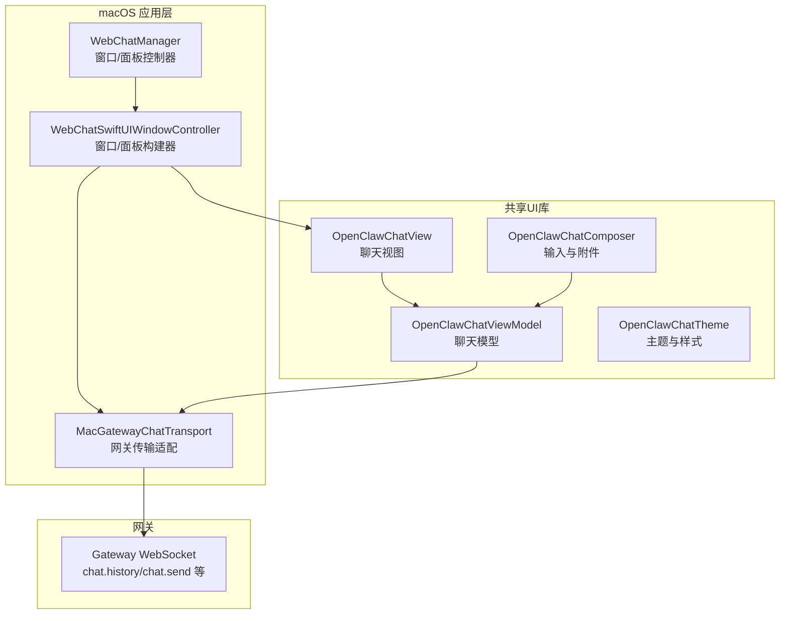
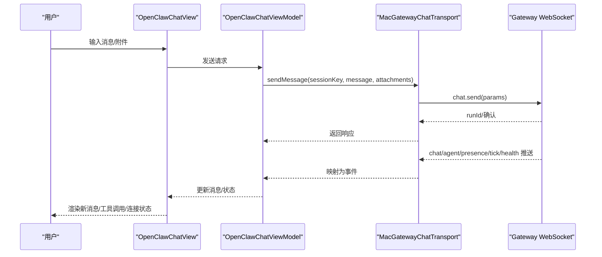
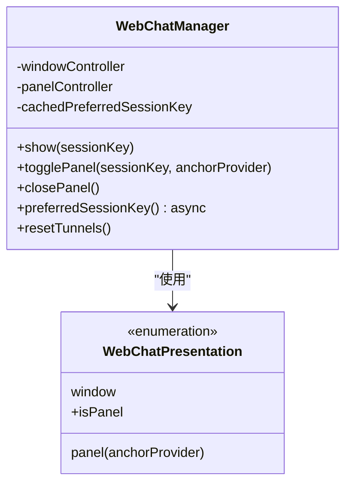
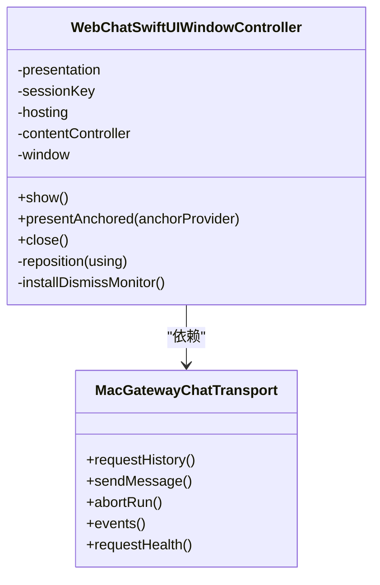
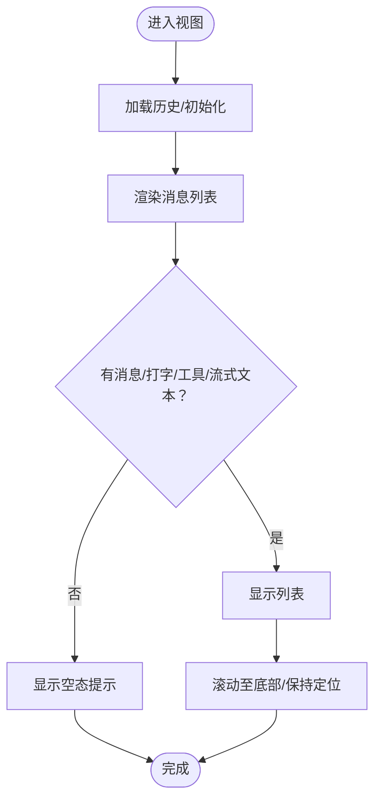
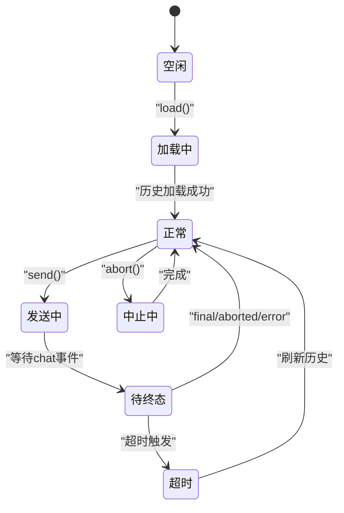
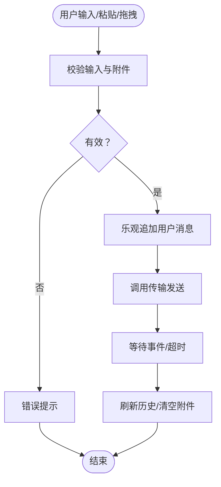
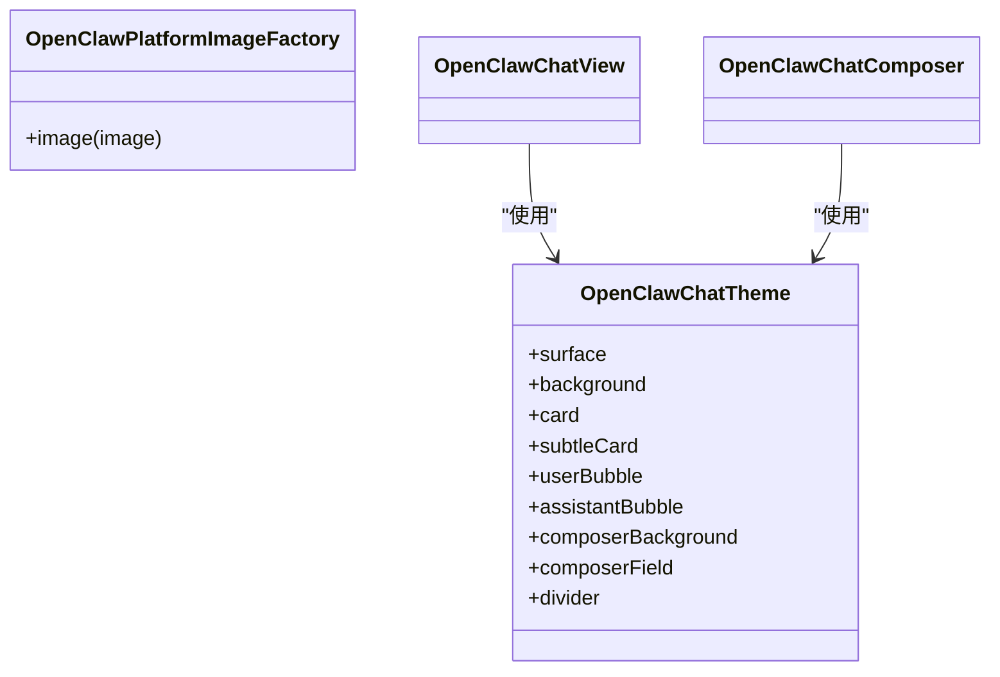
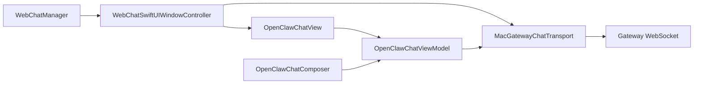

# WebChat界面

<cite>
**本文档引用的文件**
- [WebChatManager.swift](file://apps/macos/Sources/OpenClaw/WebChatManager.swift)
- [WebChatSwiftUI.swift](file://apps/macos/Sources/OpenClaw/WebChatSwiftUI.swift)
- [ChatView.swift](file://apps/shared/OpenClawKit/Sources/OpenClawChatUI/ChatView.swift)
- [ChatViewModel.swift](file://apps/shared/OpenClawKit/Sources/OpenClawChatUI/ChatViewModel.swift)
- [ChatComposer.swift](file://apps/shared/OpenClawKit/Sources/OpenClawChatUI/ChatComposer.swift)
- [ChatTheme.swift](file://apps/shared/OpenClawKit/Sources/OpenClawChatUI/ChatTheme.swift)
- [webchat.md（平台）](file://docs/platforms/mac/webchat.md)
- [webchat.md（Web）](file://docs/web/webchat.md)
</cite>

## 目录
1. [简介](#简介)
2. [项目结构](#项目结构)
3. [核心组件](#核心组件)
4. [架构总览](#架构总览)
5. [详细组件分析](#详细组件分析)
6. [依赖关系分析](#依赖关系分析)
7. [性能考虑](#性能考虑)
8. [故障排除指南](#故障排除指南)
9. [结论](#结论)
10. [附录](#附录)

## 简介
本文件面向OpenClaw在macOS上的WebChat界面，系统性阐述其设计架构、用户交互流程与功能实现。内容覆盖界面布局、消息显示、输入处理、附件管理、会话切换、主题与个性化、与OpenClaw网关的集成方式、数据同步机制与实时通信、响应式设计与多窗口管理，以及用户体验优化策略。文档同时提供配置参考与调试建议，帮助开发者与运维人员快速理解并高效使用该界面。

## 项目结构
WebChat界面由macOS应用层与共享UI库两部分组成：
- macOS应用层：负责窗口/面板展示、生命周期管理、与网关的WebSocket通信桥接。
- 共享UI库：提供跨平台的聊天视图、模型、主题与输入组件，确保macOS/iOS/其他平台的一致体验。

**图表来源**
- [WebChatManager.swift](file://apps/macos/Sources/OpenClaw/WebChatManager.swift#L25-L122)
- [WebChatSwiftUI.swift](file://apps/macos/Sources/OpenClaw/WebChatSwiftUI.swift#L140-L374)
- [ChatView.swift](file://apps/shared/OpenClawKit/Sources/OpenClawChatUI/ChatView.swift#L6-L93)
- [ChatViewModel.swift](file://apps/shared/OpenClawKit/Sources/OpenClawChatUI/ChatViewModel.swift#L15-L100)
- [ChatComposer.swift](file://apps/shared/OpenClawKit/Sources/OpenClawChatUI/ChatComposer.swift#L10-L83)

**章节来源**
- [WebChatManager.swift](file://apps/macos/Sources/OpenClaw/WebChatManager.swift#L1-L122)
- [WebChatSwiftUI.swift](file://apps/macos/Sources/OpenClaw/WebChatSwiftUI.swift#L1-L374)
- [ChatView.swift](file://apps/shared/OpenClawKit/Sources/OpenClawChatUI/ChatView.swift#L1-L593)
- [ChatViewModel.swift](file://apps/shared/OpenClawKit/Sources/OpenClawChatUI/ChatViewModel.swift#L1-L686)
- [ChatComposer.swift](file://apps/shared/OpenClawKit/Sources/OpenClawChatUI/ChatComposer.swift#L1-L728)
- [ChatTheme.swift](file://apps/shared/OpenClawKit/Sources/OpenClawChatUI/ChatTheme.swift#L1-L175)

## 核心组件
- WebChatManager：单例管理器，负责窗口与面板的创建、切换、缓存与可见性回调；支持按会话键打开或复用窗口/面板，并维护首选会话键缓存。
- WebChatSwiftUIWindowController：根据展示类型（窗口/面板）构建NSWindow或无边框面板，注入OpenClawChatView与主题色，处理尺寸、阴影、动画与全局点击关闭。
- OpenClawChatView：聊天主视图，包含消息列表、输入区、会话切换弹窗、空态与错误提示、滚动行为与自动定位。
- OpenClawChatViewModel：聊天状态与业务逻辑核心，负责历史加载、发送、中止、事件订阅、去重与合并、工具调用跟踪、会话切换与健康检查。
- OpenClawChatComposer：输入编辑器、粘贴图片、拖拽上传、附件条、发送/中止按钮、会话选择与思考级别控制。
- OpenClawChatTheme：跨平台主题与颜色体系，含背景材质、气泡色、输入框样式、分隔线等。

**章节来源**
- [WebChatManager.swift](file://apps/macos/Sources/OpenClaw/WebChatManager.swift#L25-L122)
- [WebChatSwiftUI.swift](file://apps/macos/Sources/OpenClaw/WebChatSwiftUI.swift#L140-L374)
- [ChatView.swift](file://apps/shared/OpenClawKit/Sources/OpenClawChatUI/ChatView.swift#L6-L93)
- [ChatViewModel.swift](file://apps/shared/OpenClawKit/Sources/OpenClawChatUI/ChatViewModel.swift#L15-L100)
- [ChatComposer.swift](file://apps/shared/OpenClawKit/Sources/OpenClawChatUI/ChatComposer.swift#L10-L83)
- [ChatTheme.swift](file://apps/shared/OpenClawKit/Sources/OpenClawChatUI/ChatTheme.swift#L17-L164)

## 架构总览
WebChat采用“应用层窗口/面板 + 共享UI库 + 网关WebSocket”的三层架构：
- 应用层：通过WebChatManager与WebChatSwiftUIWindowController管理UI容器与生命周期；MacGatewayChatTransport封装与网关的通信细节。
- 共享UI库：OpenClawChatView/ViewModel/Composer/Theme提供一致的渲染与交互；ViewModel订阅网关推送事件并驱动视图更新。
- 网关：提供WebSocket接口（chat.history、chat.send、chat.abort、chat.inject、chat、agent、presence、tick、health等），并持久化会话历史。

**图表来源**
- [WebChatSwiftUI.swift](file://apps/macos/Sources/OpenClaw/WebChatSwiftUI.swift#L19-L136)
- [ChatViewModel.swift](file://apps/shared/OpenClawKit/Sources/OpenClawChatUI/ChatViewModel.swift#L319-L420)
- [ChatView.swift](file://apps/shared/OpenClawKit/Sources/OpenClawChatUI/ChatView.swift#L64-L93)

**章节来源**
- [webchat.md（Web）](file://docs/web/webchat.md#L8-L62)
- [webchat.md（平台）](file://docs/platforms/mac/webchat.md#L8-L44)

## 详细组件分析

### WebChatManager（窗口/面板管理）
- 单例持有当前窗口与面板控制器及会话键，避免重复创建。
- 支持窗口模式与面板模式（可锚定到屏幕区域），面板具备全局点击外部自动关闭能力。
- 提供首选会话键缓存与隧道重置，便于测试与远程场景。

**图表来源**
- [WebChatManager.swift](file://apps/macos/Sources/OpenClaw/WebChatManager.swift#L15-L122)

**章节来源**
- [WebChatManager.swift](file://apps/macos/Sources/OpenClaw/WebChatManager.swift#L25-L122)

### WebChatSwiftUIWindowController（窗口/面板构建与动画）
- 根据展示类型创建窗口或面板，设置透明背景、圆角、阴影与层级。
- 使用NSHostingController承载OpenClawChatView，注入主题色与会话开关。
- 面板模式支持锚定位置、进入动画与全局点击关闭监控。

**图表来源**
- [WebChatSwiftUI.swift](file://apps/macos/Sources/OpenClaw/WebChatSwiftUI.swift#L140-L374)

**章节来源**
- [WebChatSwiftUI.swift](file://apps/macos/Sources/OpenClaw/WebChatSwiftUI.swift#L140-L374)

### OpenClawChatView（消息列表与空态/错误提示）
- 布局采用LazyVStack与滚动目标定位，保证首次滚动与新消息自动定位。
- 条件渲染：可见消息、打字指示、待执行工具、流式助手文本。
- 错误提示以横幅或卡片形式呈现，支持刷新与消失。
- 空态文案随平台变化（macOS强调“回车发送/Shift+回车换行”）。

**图表来源**
- [ChatView.swift](file://apps/shared/OpenClawKit/Sources/OpenClawChatUI/ChatView.swift#L95-L187)

**章节来源**
- [ChatView.swift](file://apps/shared/OpenClawKit/Sources/OpenClawChatUI/ChatView.swift#L64-L335)

### OpenClawChatViewModel（状态机与事件处理）
- 初始化时启动事件流订阅，处理health、tick、chat、agent等事件。
- 发送消息采用乐观UI更新，记录运行ID与超时任务，支持中止。
- 历史加载与去重：基于消息身份键与ID重用，避免闪烁与重复。
- 工具调用：聚合tool_result，合并到对应tool_call消息，支持trace模式显示。

**图表来源**
- [ChatViewModel.swift](file://apps/shared/OpenClawKit/Sources/OpenClawChatUI/ChatViewModel.swift#L460-L567)

**章节来源**
- [ChatViewModel.swift](file://apps/shared/OpenClawKit/Sources/OpenClawChatUI/ChatViewModel.swift#L15-L686)

### OpenClawChatComposer（输入与附件）
- 多平台差异化：macOS使用自定义NSTextView，支持粘贴图片、拖拽文件、回车发送/Shift+回车换行。
- 附件管理：限制大小（默认5MB）、仅允许图片类型、预览缩略图、批量移除。
- 会话与思考级别：会话选择器、思考级别菜单；连接状态胶囊提示。
- 发送/中止：禁用条件与进度反馈，保障响应性。

**图表来源**
- [ChatComposer.swift](file://apps/shared/OpenClawKit/Sources/OpenClawChatUI/ChatComposer.swift#L241-L305)
- [ChatViewModel.swift](file://apps/shared/OpenClawKit/Sources/OpenClawChatUI/ChatViewModel.swift#L319-L420)

**章节来源**
- [ChatComposer.swift](file://apps/shared/OpenClawKit/Sources/OpenClawChatUI/ChatComposer.swift#L10-L728)
- [ChatViewModel.swift](file://apps/shared/OpenClawKit/Sources/OpenClawChatUI/ChatViewModel.swift#L137-L147)

### 主题与个性化（OpenClawChatTheme）
- 背景：macOS采用多层渐变与径向光晕叠加；非macOS使用系统背景。
- 气泡色：用户气泡使用固定色值；助手气泡在macOS下动态解析系统外观。
- 输入区：不同平台采用不同材质与边框，保持一致的圆角与阴影。
- 可定制项：通过应用层传入用户强调色（seamColorHex），影响主题色系。

**图表来源**
- [ChatTheme.swift](file://apps/shared/OpenClawKit/Sources/OpenClawChatUI/ChatTheme.swift#L17-L164)

**章节来源**
- [ChatTheme.swift](file://apps/shared/OpenClawKit/Sources/OpenClawChatUI/ChatTheme.swift#L1-L175)

## 依赖关系分析
- WebChatManager依赖WebChatSwiftUIWindowController与会话键，负责UI容器生命周期。
- WebChatSwiftUIWindowController依赖MacGatewayChatTransport与OpenClawChatView，负责容器与主题注入。
- OpenClawChatView依赖OpenClawChatViewModel与OpenClawChatComposer，负责渲染与交互。
- OpenClawChatViewModel依赖OpenClawChatTransport（MacGatewayChatTransport），负责与网关通信与事件处理。
- OpenClawChatTransport映射网关推送事件到统一事件模型，供ViewModel消费。

**图表来源**
- [WebChatManager.swift](file://apps/macos/Sources/OpenClaw/WebChatManager.swift#L25-L122)
- [WebChatSwiftUI.swift](file://apps/macos/Sources/OpenClaw/WebChatSwiftUI.swift#L140-L166)
- [ChatView.swift](file://apps/shared/OpenClawKit/Sources/OpenClawChatUI/ChatView.swift#L6-L93)
- [ChatViewModel.swift](file://apps/shared/OpenClawKit/Sources/OpenClawChatUI/ChatViewModel.swift#L15-L100)
- [ChatComposer.swift](file://apps/shared/OpenClawKit/Sources/OpenClawChatUI/ChatComposer.swift#L10-L83)

**章节来源**
- [WebChatSwiftUI.swift](file://apps/macos/Sources/OpenClaw/WebChatSwiftUI.swift#L19-L136)
- [ChatViewModel.swift](file://apps/shared/OpenClawKit/Sources/OpenClawChatUI/ChatViewModel.swift#L55-L69)

## 性能考虑
- 滚动优化：使用滚动目标定位与稳定ID，避免ScrollViewReader重排抖动。
- 历史加载：从网关拉取历史，避免本地文件监听；对长文本与大对象进行截断与省略，提升稳定性。
- 事件流：异步流订阅网关推送，按需刷新，减少主线程阻塞。
- 附件处理：并发加载与类型校验，限制大小与类型，避免内存压力。
- 动画与阴影：面板入场动画与阴影在macOS上启用，注意在低端设备上的性能表现。

[本节为通用指导，无需特定文件引用]

## 故障排除指南
- 连接失败/只读：当网关不可达时，WebChat变为只读；检查网关端口、认证与远程隧道。
- 无法发送：健康检查失败或正在发送/中止中；查看连接胶囊状态与错误提示。
- 事件丢失：序列间隙（seqGap）触发强制刷新历史与健康检查；关注日志与重试。
- 附件问题：超出大小限制或非图片类型；调整附件或检查MIME类型。
- 面板不消失：全局点击外部关闭依赖NSEvent监控；确保未被其他窗口遮挡。

**章节来源**
- [webchat.md（Web）](file://docs/web/webchat.md#L24-L62)
- [ChatViewModel.swift](file://apps/shared/OpenClawKit/Sources/OpenClawChatUI/ChatViewModel.swift#L470-L477)
- [ChatComposer.swift](file://apps/shared/OpenClawKit/Sources/OpenClawChatUI/ChatComposer.swift#L649-L674)

## 结论
OpenClaw macOS WebChat界面以清晰的分层架构与跨平台UI库为核心，结合网关WebSocket的实时推送，实现了高性能、可扩展且体验一致的聊天界面。通过会话管理、工具调用聚合、流式文本与错误提示等机制，满足日常对话与复杂工作流场景。配合面板锚定、动画与主题系统，进一步提升了可用性与个性化程度。

[本节为总结，无需特定文件引用]

## 附录

### 配置与集成参考
- 网关WebSocket端点与认证：gateway.port、gateway.bind、gateway.auth.mode/token/password、trusted-proxy等。
- 远程模式：通过SSH或Tailscale隧道转发网关控制端口。
- 通道路由：WebChat使用与其它通道相同的会话与路由规则，确定性地将回复路由回WebChat。
- 控制UI工具面板：通过tools.catalog获取运行时目录，遵循策略优先级。

**章节来源**
- [webchat.md（Web）](file://docs/web/webchat.md#L47-L62)
- [webchat.md（平台）](file://docs/platforms/mac/webchat.md#L18-L44)

### 响应式设计与多窗口管理
- 尺寸与最小尺寸：窗口模式与面板模式分别设定尺寸与最小约束，确保在小屏或多显示器环境下的可用性。
- 多窗口：同一会话可复用已有窗口，避免重复创建；面板模式支持多个会话的面板缓存。
- 屏幕适配：面板锚定与屏幕边界检测，自动调整位置与阴影。

**章节来源**
- [WebChatSwiftUI.swift](file://apps/macos/Sources/OpenClaw/WebChatSwiftUI.swift#L12-L17)
- [WebChatSwiftUI.swift](file://apps/macos/Sources/OpenClaw/WebChatSwiftUI.swift#L214-L237)
- [WebChatManager.swift](file://apps/macos/Sources/OpenClaw/WebChatManager.swift#L96-L121)