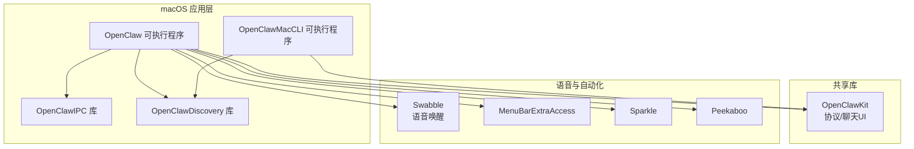
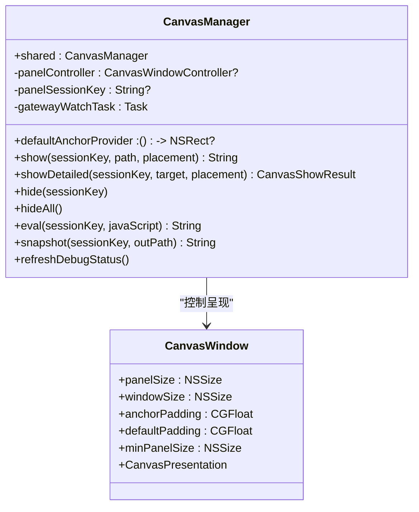
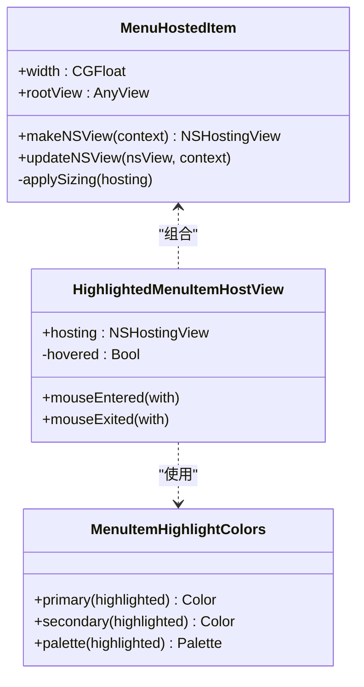
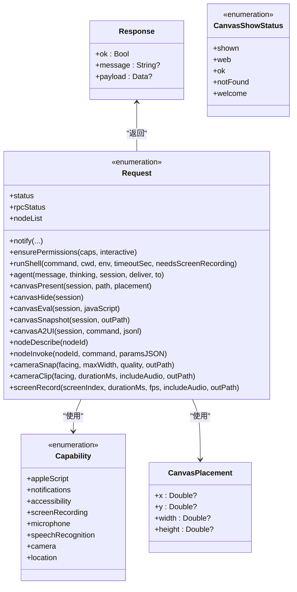
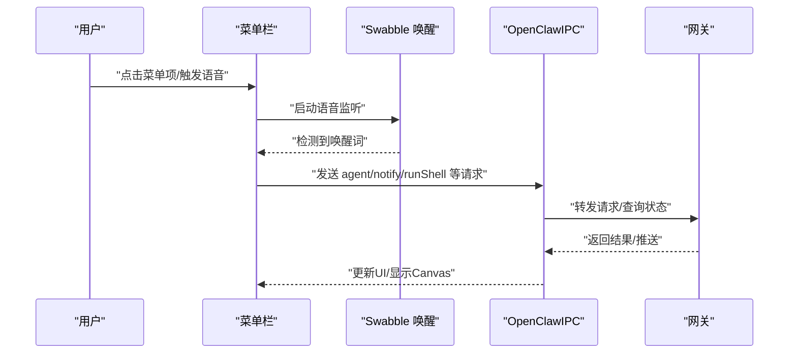
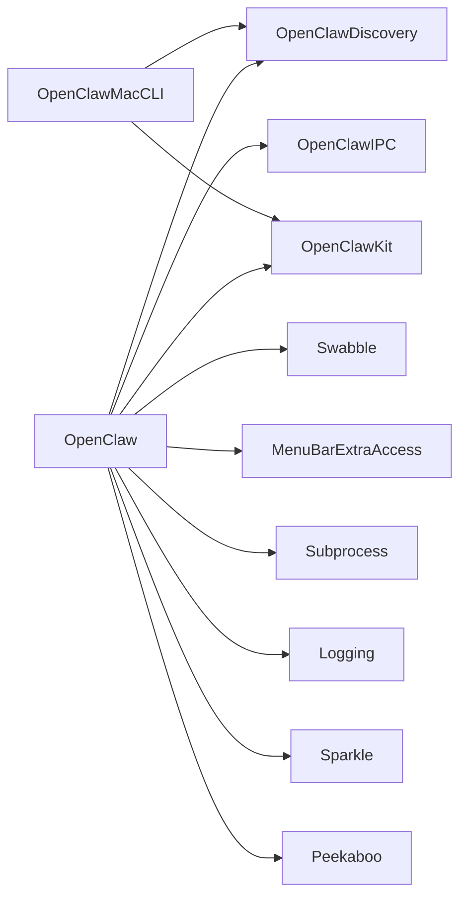

# macOS应用

<cite>
**本文引用的文件**
- [apps/macos/Package.swift](file://apps/macos/Package.swift)
- [apps/macos/README.md](file://apps/macos/README.md)
- [apps/macos/Sources/OpenClawIPC/IPC.swift](file://apps/macos/Sources/OpenClawIPC/IPC.swift)
- [apps/macos/Sources/OpenClaw/CanvasManager.swift](file://apps/macos/Sources/OpenClaw/CanvasManager.swift)
- [apps/macos/Sources/OpenClaw/CanvasWindow.swift](file://apps/macos/Sources/OpenClaw/CanvasWindow.swift)
- [apps/macos/Sources/OpenClaw/MenuHostedItem.swift](file://apps/macos/Sources/OpenClaw/MenuHostedItem.swift)
- [apps/macos/Sources/OpenClaw/MenuItemHighlightColors.swift](file://apps/macos/Sources/OpenClaw/MenuItemHighlightColors.swift)
- [apps/macos/Sources/OpenClaw/MenuHighlightedHostView.swift](file://apps/macos/Sources/OpenClaw/MenuHighlightedHostView.swift)
- [apps/shared/OpenClawKit/Package.swift](file://apps/shared/OpenClawKit/Package.swift)
- [Swabble/Package.swift](file://Swabble/Package.swift)
- [scripts/package-mac-app.sh](file://scripts/package-mac-app.sh)
- [scripts/codesign-mac-app.sh](file://scripts/codesign-mac-app.sh)
- [scripts/restart-mac.sh](file://scripts/restart-mac.sh)
</cite>

## 目录
1. [简介](#简介)
2. [项目结构](#项目结构)
3. [核心组件](#核心组件)
4. [架构总览](#架构总览)
5. [详细组件分析](#详细组件分析)
6. [依赖关系分析](#依赖关系分析)
7. [性能与可用性考量](#性能与可用性考量)
8. [使用与配置指南](#使用与配置指南)
9. [开发与构建指南](#开发与构建指南)
10. [故障排除](#故障排除)
11. [结论](#结论)

## 简介
本文件面向OpenClaw的macOS菜单栏应用（OpenClaw.app），系统化梳理其架构设计、核心能力与使用方式，覆盖菜单栏控制、Canvas Web界面、语音唤醒（Swabble）、远程网关控制、健康监控、调试工具等模块，并提供安装部署、权限配置、安全模型与最佳实践，以及二次开发与定制建议。

## 项目结构
OpenClaw macOS应用位于apps/macos目录，采用Swift Package Manager组织多目标产物：菜单栏可执行程序、IPC库、发现库与CLI工具；同时复用共享库OpenClawKit提供协议、聊天UI与资源；语音唤醒能力来自Swabble子工程。



图示来源
- [apps/macos/Package.swift](file://apps/macos/Package.swift#L26-L78)
- [apps/shared/OpenClawKit/Package.swift](file://apps/shared/OpenClawKit/Package.swift#L20-L52)
- [Swabble/Package.swift](file://Swabble/Package.swift#L1-L20)

章节来源
- [apps/macos/Package.swift](file://apps/macos/Package.swift#L1-L93)
- [apps/shared/OpenClawKit/Package.swift](file://apps/shared/OpenClawKit/Package.swift#L1-L62)
- [Swabble/Package.swift](file://Swabble/Package.swift#L1-L20)

## 核心组件
- 菜单栏控制与交互
  - 使用MenuBarExtraAccess实现菜单栏入口，通过NSViewRepresentable桥接SwiftUI内容到NSMenuItem，支持高亮态与尺寸适配。
- Canvas Web界面
  - CanvasManager负责会话管理、窗口锚定、自动导航至A2UI、调试状态更新与截图等。
  - CanvasWindow定义面板尺寸、窗口布局与呈现模式。
- 语音唤醒（Swabble）
  - 通过SwabbleKit/WakeWordGate等组件接入唤醒词检测与语音流水线。
- 远程网关控制
  - 通过IPC请求调用后端网关，支持通知、权限确认、节点查询/调用、摄像头/屏幕录制等。
- 安全与权限
  - Capability枚举涵盖AppleScript、通知、辅助功能、屏幕录制、麦克风、语音识别、相机、位置等权限。
- 自动更新
  - 集成Sparkle进行应用更新。

章节来源
- [apps/macos/Sources/OpenClaw/MenuHostedItem.swift](file://apps/macos/Sources/OpenClaw/MenuHostedItem.swift#L1-L29)
- [apps/macos/Sources/OpenClaw/MenuItemHighlightColors.swift](file://apps/macos/Sources/OpenClaw/MenuItemHighlightColors.swift#L1-L22)
- [apps/macos/Sources/OpenClaw/MenuHighlightedHostView.swift](file://apps/macos/Sources/OpenClaw/MenuHighlightedHostView.swift#L1-L47)
- [apps/macos/Sources/OpenClaw/CanvasManager.swift](file://apps/macos/Sources/OpenClaw/CanvasManager.swift#L1-L343)
- [apps/macos/Sources/OpenClaw/CanvasWindow.swift](file://apps/macos/Sources/OpenClaw/CanvasWindow.swift#L1-L32)
- [apps/macos/Sources/OpenClawIPC/IPC.swift](file://apps/macos/Sources/OpenClawIPC/IPC.swift#L6-L16)
- [apps/macos/Sources/OpenClawIPC/IPC.swift](file://apps/macos/Sources/OpenClawIPC/IPC.swift#L108-L136)
- [apps/macos/Sources/OpenClawIPC/IPC.swift](file://apps/macos/Sources/OpenClawIPC/IPC.swift#L410-L417)

## 架构总览
OpenClaw macOS应用以菜单栏入口为核心，通过IPC与后端网关通信，承载Canvas Web界面用于可视化与调试，结合Swabble实现语音唤醒，借助Sparkle完成更新。

```mermaid
graph TB
subgraph "用户交互"
MB["菜单栏入口"]
CV["Canvas 面板/窗口"]
SW["语音唤醒(Swabble)"]
end
subgraph "应用内核"
CM["CanvasManager"]
IPC["OpenClawIPC"]
GW["网关连接(GatewayConnection)"]
end
subgraph "系统与第三方"
TCC["TCC 权限"]
SPK["Sparkle 更新"]
PBO["Peekaboo 桥接"]
end
MB --> CM
CV <- --> CM
SW --> IPC
IPC --> GW
MB --> IPC
MB --> SPK
MB --> PBO
MB --> TCC
```

图示来源
- [apps/macos/Sources/OpenClaw/CanvasManager.swift](file://apps/macos/Sources/OpenClaw/CanvasManager.swift#L1-L343)
- [apps/macos/Sources/OpenClawIPC/IPC.swift](file://apps/macos/Sources/OpenClawIPC/IPC.swift#L108-L136)
- [apps/macos/Package.swift](file://apps/macos/Package.swift#L42-L57)

## 详细组件分析

### Canvas 界面与会话管理
CanvasManager负责：
- 会话生命周期管理（创建/复用/隐藏）
- 锚定策略（菜单栏或鼠标位置）
- 自动导航至A2UI（基于网关推送）
- 调试状态展示（本地/远程模式、连接状态）
- JavaScript执行与截图



图示来源
- [apps/macos/Sources/OpenClaw/CanvasManager.swift](file://apps/macos/Sources/OpenClaw/CanvasManager.swift#L8-L114)
- [apps/macos/Sources/OpenClaw/CanvasWindow.swift](file://apps/macos/Sources/OpenClaw/CanvasWindow.swift#L5-L31)

章节来源
- [apps/macos/Sources/OpenClaw/CanvasManager.swift](file://apps/macos/Sources/OpenClaw/CanvasManager.swift#L1-L343)
- [apps/macos/Sources/OpenClaw/CanvasWindow.swift](file://apps/macos/Sources/OpenClaw/CanvasWindow.swift#L1-L32)

### 菜单栏与交互
菜单栏通过MenuBarExtraAccess渲染，使用MenuHostedItem将SwiftUI视图嵌入NSMenuItem，支持悬停高亮与尺寸自适应。



图示来源
- [apps/macos/Sources/OpenClaw/MenuHostedItem.swift](file://apps/macos/Sources/OpenClaw/MenuHostedItem.swift#L8-L28)
- [apps/macos/Sources/OpenClaw/MenuHighlightedHostView.swift](file://apps/macos/Sources/OpenClaw/MenuHighlightedHostView.swift#L4-L47)
- [apps/macos/Sources/OpenClaw/MenuItemHighlightColors.swift](file://apps/macos/Sources/OpenClaw/MenuItemHighlightColors.swift#L3-L21)

章节来源
- [apps/macos/Sources/OpenClaw/MenuHostedItem.swift](file://apps/macos/Sources/OpenClaw/MenuHostedItem.swift#L1-L29)
- [apps/macos/Sources/OpenClaw/MenuHighlightedHostView.swift](file://apps/macos/Sources/OpenClaw/MenuHighlightedHostView.swift#L1-L47)
- [apps/macos/Sources/OpenClaw/MenuItemHighlightColors.swift](file://apps/macos/Sources/OpenClaw/MenuItemHighlightColors.swift#L1-L22)

### IPC 请求与响应
OpenClawIPC定义了统一的请求类型集合，涵盖通知、权限确认、Shell执行、状态查询、代理消息、Canvas操作、节点管理、媒体采集与屏幕录制等。



图示来源
- [apps/macos/Sources/OpenClawIPC/IPC.swift](file://apps/macos/Sources/OpenClawIPC/IPC.swift#L6-L16)
- [apps/macos/Sources/OpenClawIPC/IPC.swift](file://apps/macos/Sources/OpenClawIPC/IPC.swift#L46-L58)
- [apps/macos/Sources/OpenClawIPC/IPC.swift](file://apps/macos/Sources/OpenClawIPC/IPC.swift#L62-L99)
- [apps/macos/Sources/OpenClawIPC/IPC.swift](file://apps/macos/Sources/OpenClawIPC/IPC.swift#L108-L136)
- [apps/macos/Sources/OpenClawIPC/IPC.swift](file://apps/macos/Sources/OpenClawIPC/IPC.swift#L140-L151)

章节来源
- [apps/macos/Sources/OpenClawIPC/IPC.swift](file://apps/macos/Sources/OpenClawIPC/IPC.swift#L1-L417)

### 语音唤醒（Swabble）工作流
Swabble提供唤醒词门控与语音流水线，OpenClaw通过SwabbleKit集成到菜单栏应用中，实现“语音触发—命令分发—Canvas/网关联动”的闭环。



图示来源
- [apps/macos/Package.swift](file://apps/macos/Package.swift#L50-L56)
- [Swabble/Package.swift](file://Swabble/Package.swift#L1-L20)

章节来源
- [apps/macos/Package.swift](file://apps/macos/Package.swift#L17-L25)
- [Swabble/Package.swift](file://Swabble/Package.swift#L1-L20)

## 依赖关系分析
- 目标产物与产品
  - OpenClaw（可执行）、OpenClawMacCLI（可执行）、OpenClawIPC（库）、OpenClawDiscovery（库）
- 外部依赖
  - MenuBarExtraAccess：菜单栏入口
  - swift-subprocess：Shell执行
  - swift-log：日志
  - Sparkle：自动更新
  - Peekaboo：桥接/自动化
  - OpenClawKit：协议/聊天UI
  - Swabble：语音唤醒
- 平台与并发
  - Swift并发严格模式启用，目标平台macOS 15+



图示来源
- [apps/macos/Package.swift](file://apps/macos/Package.swift#L42-L78)
- [apps/shared/OpenClawKit/Package.swift](file://apps/shared/OpenClawKit/Package.swift#L20-L52)

章节来源
- [apps/macos/Package.swift](file://apps/macos/Package.swift#L1-L93)
- [apps/shared/OpenClawKit/Package.swift](file://apps/shared/OpenClawKit/Package.swift#L1-L62)

## 性能与可用性考量
- 并发与线程
  - 启用StrictConcurrency，避免数据竞争；CanvasManager在主线程更新UI，后台任务处理网关观察与A2UI解析。
- UI呈现
  - CanvasPanel尺寸固定，最小尺寸约束保证可用性；锚定策略优先菜单栏，其次鼠标位置。
- IPC与网络
  - 控制套接字路径位于用户应用支持目录，减少跨进程通信开销；Canvas会话按需创建，避免重复初始化。
- 日志与可观测性
  - 使用OSLog记录Canvas与IPC关键路径，便于定位问题。

章节来源
- [apps/macos/Sources/OpenClaw/CanvasWindow.swift](file://apps/macos/Sources/OpenClaw/CanvasWindow.swift#L5-L11)
- [apps/macos/Sources/OpenClaw/CanvasManager.swift](file://apps/macos/Sources/OpenClaw/CanvasManager.swift#L11-L20)
- [apps/macos/Sources/OpenClawIPC/IPC.swift](file://apps/macos/Sources/OpenClawIPC/IPC.swift#L410-L417)

## 使用与配置指南

### 安装与首次运行
- 开发运行
  - 使用脚本快速重启并加载应用，支持跳过签名与强制签名两种模式。
- 打包与签名
  - 生成OpenClaw.app并签名，自动校验Team ID一致性；可选择禁用库验证（仅开发）。

章节来源
- [apps/macos/README.md](file://apps/macos/README.md#L3-L15)
- [apps/macos/README.md](file://apps/macos/README.md#L17-L23)
- [apps/macos/README.md](file://apps/macos/README.md#L25-L56)

### 权限配置与安全模型
- 必要权限
  - 通知、辅助功能、屏幕录制、麦克风、语音识别、相机、位置、AppleScript等。
- 交互式权限确认
  - 通过ensurePermissions接口弹窗引导用户授权，支持非交互批量检查。
- 安全建议
  - 仅授予必要权限；定期审查权限状态；远程模式下确保网关可信与通道加密。

章节来源
- [apps/macos/Sources/OpenClawIPC/IPC.swift](file://apps/macos/Sources/OpenClawIPC/IPC.swift#L6-L16)
- [apps/macos/Sources/OpenClawIPC/IPC.swift](file://apps/macos/Sources/OpenClawIPC/IPC.swift#L115)

### Canvas 界面操作
- 会话管理
  - 显示/隐藏Canvas，指定目标路径或默认根路径；支持JavaScript注入与截图。
- 自动导航
  - 基于网关推送的Canvas主机地址，自动导航至A2UI页面。
- 调试面板
  - 切换调试面板显示，展示连接模式与状态。

章节来源
- [apps/macos/Sources/OpenClaw/CanvasManager.swift](file://apps/macos/Sources/OpenClaw/CanvasManager.swift#L32-L114)
- [apps/macos/Sources/OpenClaw/CanvasManager.swift](file://apps/macos/Sources/OpenClaw/CanvasManager.swift#L142-L195)
- [apps/macos/Sources/OpenClaw/CanvasManager.swift](file://apps/macos/Sources/OpenClaw/CanvasManager.swift#L202-L229)

### 语音唤醒（Voice Wake）
- 集成方式
  - 通过SwabbleKit接入唤醒词检测与语音流水线，菜单栏入口触发监听。
- 最佳实践
  - 在安静环境下训练唤醒词；合理设置灵敏度；避免误唤醒。

章节来源
- [apps/macos/Package.swift](file://apps/macos/Package.swift#L50-L56)
- [Swabble/Package.swift](file://Swabble/Package.swift#L1-L20)

### 远程网关控制
- 控制通道
  - 通过IPC请求与网关通信，支持节点列表/描述/调用、媒体采集、Canvas操作等。
- 连接模式
  - 本地/远程/未配置三种模式，调试面板实时反映连接状态。

章节来源
- [apps/macos/Sources/OpenClawIPC/IPC.swift](file://apps/macos/Sources/OpenClawIPC/IPC.swift#L108-L136)
- [apps/macos/Sources/OpenClaw/CanvasManager.swift](file://apps/macos/Sources/OpenClaw/CanvasManager.swift#L208-L229)

### 健康监控与调试工具
- Canvas健康
  - 会话目录、目标解析状态（本地/欢迎页/404）、有效URL与加载状态。
- 网关健康
  - 订阅网关快照，解析Canvas主机URL，自动导航至A2UI。
- 调试面板
  - 展示当前模式与连接状态，便于排障。

章节来源
- [apps/macos/Sources/OpenClaw/CanvasManager.swift](file://apps/macos/Sources/OpenClaw/CanvasManager.swift#L269-L293)
- [apps/macos/Sources/OpenClaw/CanvasManager.swift](file://apps/macos/Sources/OpenClaw/CanvasManager.swift#L142-L172)

## 开发与构建指南

### 开发环境搭建
- 工具链
  - macOS 15+，Swift 6.2+，Xcode命令行工具。
- 依赖安装
  - SwiftPM自动拉取MenuBarExtraAccess、Subprocess、Logging、Sparkle、Peekaboo、OpenClawKit、Swabble等。

章节来源
- [apps/macos/Package.swift](file://apps/macos/Package.swift#L8-L25)
- [apps/shared/OpenClawKit/Package.swift](file://apps/shared/OpenClawKit/Package.swift#L16-L19)

### 构建与打包流程
- 快速运行
  - 使用脚本一键重启应用，支持无签名与强制签名两种模式。
- 打包签名
  - 生成并签名OpenClaw.app，自动Team ID审计；可禁用库验证（开发）或跳过审计（特殊场景）。

章节来源
- [apps/macos/README.md](file://apps/macos/README.md#L3-L15)
- [apps/macos/README.md](file://apps/macos/README.md#L17-L23)
- [apps/macos/README.md](file://apps/macos/README.md#L25-L56)
- [scripts/package-mac-app.sh](file://scripts/package-mac-app.sh)
- [scripts/codesign-mac-app.sh](file://scripts/codesign-mac-app.sh)
- [scripts/restart-mac.sh](file://scripts/restart-mac.sh)

### 二次开发与定制
- 新增菜单项
  - 使用MenuBarExtraAccess与MenuHostedItem封装SwiftUI视图，注意尺寸与高亮态。
- 扩展IPC能力
  - 在Request/Response中新增命令，补充对应的后端处理逻辑与错误码。
- 自定义Canvas行为
  - 通过CanvasPlacement与锚定策略调整面板位置；在CanvasManager中扩展导航与调试逻辑。
- 语音唤醒集成
  - 引入SwabbleKit组件，配置唤醒词与回调，映射到IPC请求。

章节来源
- [apps/macos/Sources/OpenClaw/MenuHostedItem.swift](file://apps/macos/Sources/OpenClaw/MenuHostedItem.swift#L8-L28)
- [apps/macos/Sources/OpenClawIPC/IPC.swift](file://apps/macos/Sources/OpenClawIPC/IPC.swift#L108-L136)
- [apps/macos/Sources/OpenClaw/CanvasManager.swift](file://apps/macos/Sources/OpenClaw/CanvasManager.swift#L24-L26)
- [apps/macos/Package.swift](file://apps/macos/Package.swift#L50-L56)

## 故障排除
- Sparkle Team ID 不匹配导致加载失败
  - 打包时自动审计Team ID；若因证书类型限制，可在开发阶段启用禁用库验证选项。
- TCC 权限不持久
  - 无签名或临时签名可能导致权限不持久；建议使用正式签名或手动授权。
- Canvas 无法自动导航至A2UI
  - 检查网关快照中的Canvas主机URL是否有效；确认Canvas面板可见且未锁定导航。
- Shell 执行超时或失败
  - 检查命令参数、工作目录与环境变量；适当增加超时时间或降级为非交互模式。

章节来源
- [apps/macos/README.md](file://apps/macos/README.md#L37-L56)
- [apps/macos/Sources/OpenClaw/CanvasManager.swift](file://apps/macos/Sources/OpenClaw/CanvasManager.swift#L142-L172)
- [apps/macos/Sources/OpenClawIPC/IPC.swift](file://apps/macos/Sources/OpenClawIPC/IPC.swift#L116-L121)

## 结论
OpenClaw macOS应用以菜单栏为入口，结合IPC、Canvas、Swabble与Sparkle，形成“语音触发—菜单控制—Web界面—远程网关”的完整体验。通过严格的并发模型、清晰的权限抽象与完善的调试工具，既满足日常使用，也为二次开发提供了良好的扩展点。建议在生产环境中启用正式签名与最小权限原则，在开发阶段善用禁用库验证与跳过审计选项以提升效率。