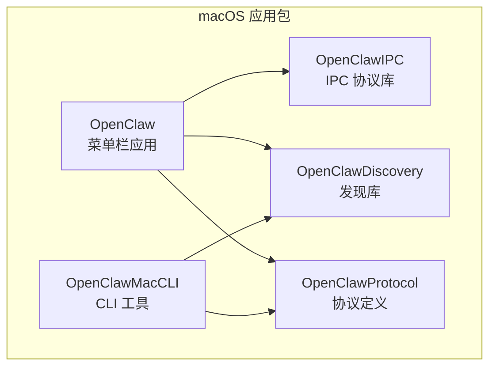
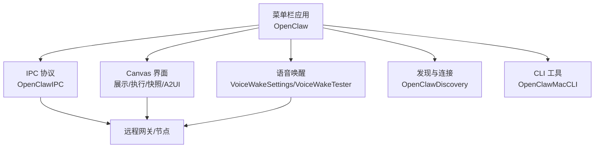
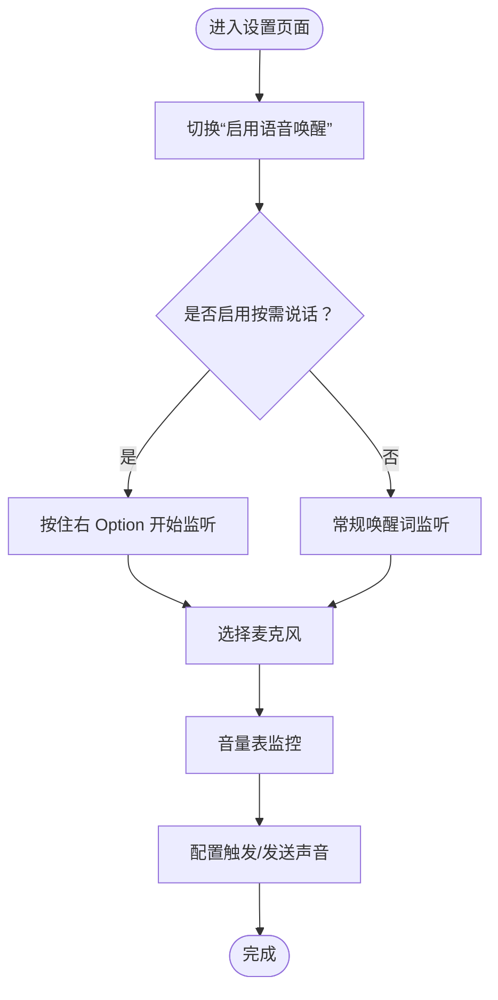
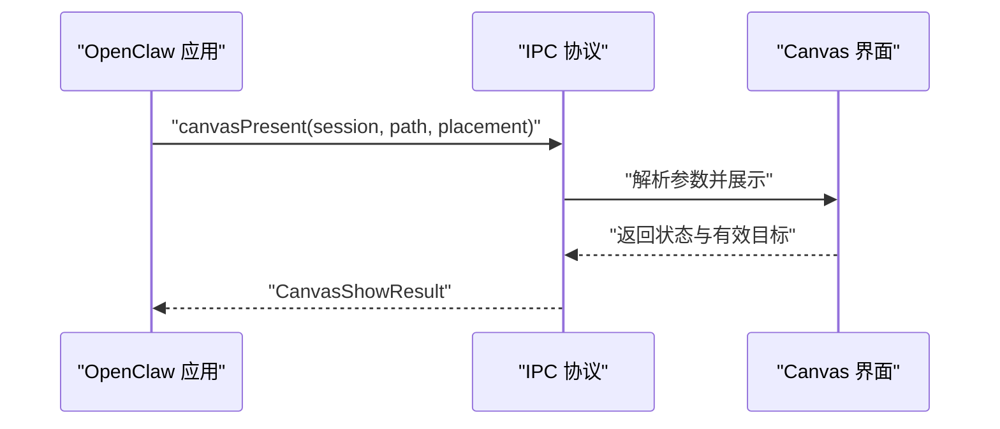
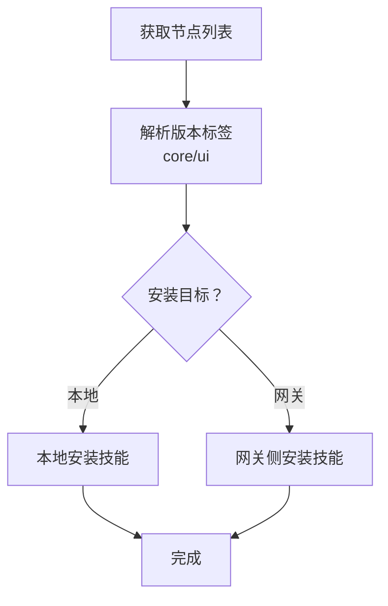
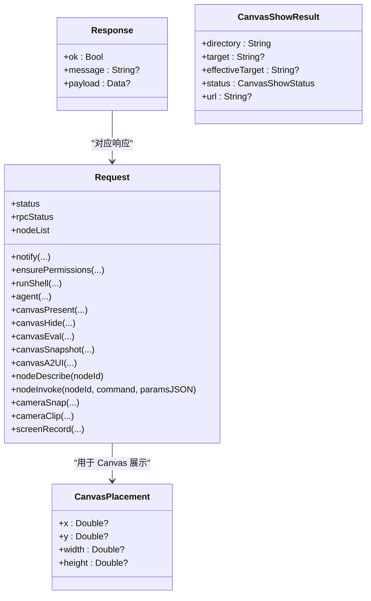
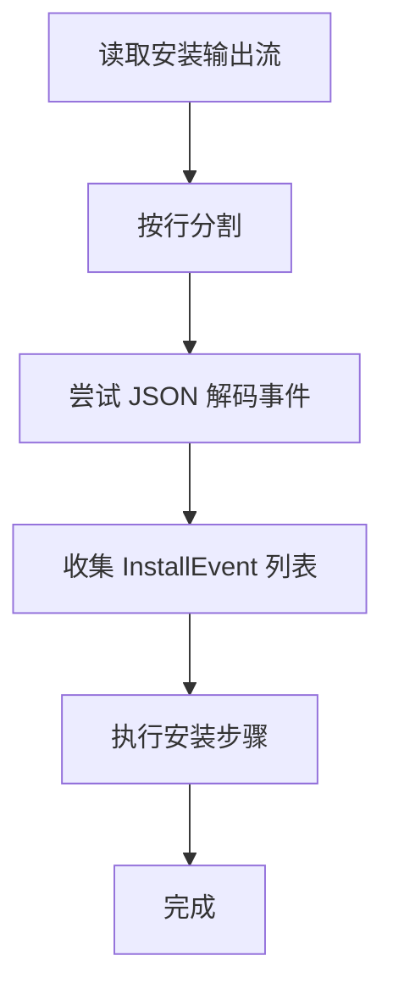
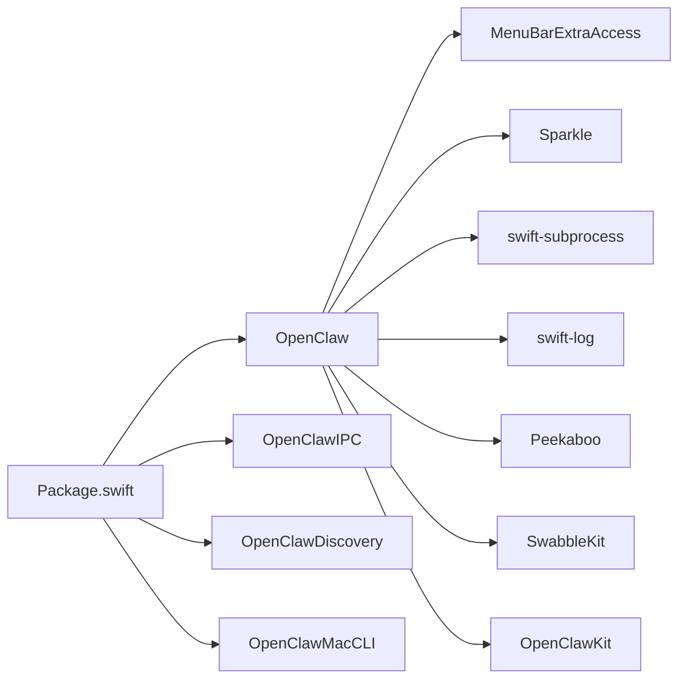

# 应用概览

<cite>
**本文引用的文件**
- [apps/macos/README.md](file://apps/macos/README.md)
- [apps/macos/Package.swift](file://apps/macos/Package.swift)
- [apps/macos/Sources/OpenClawIPC/IPC.swift](file://apps/macos/Sources/OpenClawIPC/IPC.swift)
- [apps/macos/Sources/OpenClaw/VoiceWakeSettings.swift](file://apps/macos/Sources/OpenClaw/VoiceWakeSettings.swift)
- [apps/macos/Sources/OpenClaw/VoiceWakeTester.swift](file://apps/macos/Sources/OpenClaw/VoiceWakeTester.swift)
- [apps/macos/Sources/OpenClaw/NodesMenu.swift](file://apps/macos/Sources/OpenClaw/NodesMenu.swift)
- [apps/macos/Sources/OpenClaw/SystemSettingsURLSupport.swift](file://apps/macos/Sources/OpenClaw/SystemSettingsURLSupport.swift)
- [apps/macos/Sources/OpenClaw/CLIInstaller.swift](file://apps/macos/Sources/OpenClaw/CLIInstaller.swift)
- [apps/macos/Sources/OpenClaw/RuntimeLocator.swift](file://apps/macos/Sources/OpenClaw/RuntimeLocator.swift)
- [apps/macos/Sources/OpenClaw/SkillsSettings.swift](file://apps/macos/Sources/OpenClaw/SkillsSettings.swift)
- [apps/macos/Sources/OpenClaw/OpenClawConfigFile.swift](file://apps/macos/Sources/OpenClaw/OpenClawConfigFile.swift)
- [docs/reference/device-models.md](file://docs/reference/device-models.md)
- [scripts/install.sh](file://scripts/install.sh)
</cite>

## 目录
1. [简介](#简介)
2. [项目结构](#项目结构)
3. [核心组件](#核心组件)
4. [架构总览](#架构总览)
5. [详细组件分析](#详细组件分析)
6. [依赖关系分析](#依赖关系分析)
7. [性能考虑](#性能考虑)
8. [故障排除指南](#故障排除指南)
9. [结论](#结论)
10. [附录](#附录)

## 简介
本文件为 OpenClaw macOS 应用的概览文档，面向希望快速理解并使用 OpenClaw 生态系统中 macOS 菜单栏常驻应用的用户与开发者。文档重点介绍应用的整体架构、核心功能特性（菜单栏控制、语音唤醒、Canvas 界面、远程网关控制等）、系统要求与兼容性、安装方式以及如何通过界面与命令行进行操作。

OpenClaw 在 macOS 上以菜单栏应用为核心入口，配合 IPC 库、发现库、更新框架与语音识别能力，实现对本地与远程节点的统一控制，并通过 Canvas 提供可扩展的可视化交互界面。

## 项目结构
macOS 应用位于 apps/macos 目录，采用 Swift Package Manager 组织多目标产物：菜单栏主应用、IPC 库、发现库、CLI 工具等。其核心目标包括：
- OpenClaw：菜单栏常驻应用，负责权限管理、语音唤醒、Canvas 展示、与网关通信等
- OpenClawIPC：跨进程通信协议定义与传输路径
- OpenClawDiscovery：设备/网关发现与连接辅助
- OpenClawMacCLI：macOS 平台专用 CLI 工具
- OpenClawProtocol：与网关通信协议的共享定义

图表来源
- [apps/macos/Package.swift](file://apps/macos/Package.swift#L26-L78)

章节来源
- [apps/macos/Package.swift](file://apps/macos/Package.swift#L1-L93)

## 核心组件
- 菜单栏控制与状态管理：通过菜单项与设置面板提供语音唤醒开关、触发词配置、麦克风选择、音量表、声音提示等；支持打开系统设置直达相关权限页。
- 语音唤醒（Voice Wake）：基于 Swabble 的唤醒词检测与监听流程，支持按住右 Option 键的“按需说话”模式；具备测试与音量表监控能力。
- Canvas 界面：支持展示本地或远程 Canvas 页面，提供显示、隐藏、JavaScript 执行、快照、A2UI 推送等功能；支持窗口位置与尺寸提示。
- 远程网关控制：通过节点列表与版本信息展示，支持在本地或网关侧安装技能；具备运行时定位与版本解析能力。
- IPC 通信：定义统一请求/响应模型，覆盖通知、权限确保、Shell 执行、Canvas 操作、节点查询与调用、媒体采集（相机/屏幕）等。
- CLI 安装与运行：提供安装事件解析、参数转义、运行时二进制定位与版本查询等能力。

章节来源
- [apps/macos/Sources/OpenClaw/VoiceWakeSettings.swift](file://apps/macos/Sources/OpenClaw/VoiceWakeSettings.swift#L1-L260)
- [apps/macos/Sources/OpenClaw/VoiceWakeTester.swift](file://apps/macos/Sources/OpenClaw/VoiceWakeTester.swift#L455-L467)
- [apps/macos/Sources/OpenClawIPC/IPC.swift](file://apps/macos/Sources/OpenClawIPC/IPC.swift#L1-L417)
- [apps/macos/Sources/OpenClaw/NodesMenu.swift](file://apps/macos/Sources/OpenClaw/NodesMenu.swift#L94-L129)
- [apps/macos/Sources/OpenClaw/CLIInstaller.swift](file://apps/macos/Sources/OpenClaw/CLIInstaller.swift#L79-L103)
- [apps/macos/Sources/OpenClaw/RuntimeLocator.swift](file://apps/macos/Sources/OpenClaw/RuntimeLocator.swift#L113-L135)

## 架构总览
OpenClaw macOS 应用围绕菜单栏常驻进程构建，通过 IPC 与本地/远程网关通信，结合语音识别与 Canvas 界面，形成统一的人机交互入口。

图表来源
- [apps/macos/Package.swift](file://apps/macos/Package.swift#L26-L78)
- [apps/macos/Sources/OpenClawIPC/IPC.swift](file://apps/macos/Sources/OpenClawIPC/IPC.swift#L108-L136)

## 详细组件分析

### 组件一：菜单栏控制与系统集成
- 功能要点
  - 语音唤醒开关与按需说话模式
  - 唤醒词触发与声音提示配置
  - 麦克风选择与音量表监控
  - 打开系统设置直达相关权限页
- 设计理念
  - 将常用控制集中于菜单栏，降低上下文切换成本
  - 通过系统设置直连提升权限配置效率
- 兼容性
  - 语音唤醒在较新系统版本上可用，低版本提供降级提示

图表来源
- [apps/macos/Sources/OpenClaw/VoiceWakeSettings.swift](file://apps/macos/Sources/OpenClaw/VoiceWakeSettings.swift#L42-L82)

章节来源
- [apps/macos/Sources/OpenClaw/VoiceWakeSettings.swift](file://apps/macos/Sources/OpenClaw/VoiceWakeSettings.swift#L1-L260)
- [apps/macos/Sources/OpenClaw/SystemSettingsURLSupport.swift](file://apps/macos/Sources/OpenClaw/SystemSettingsURLSupport.swift#L1-L12)

### 组件二：Canvas 界面与交互
- 功能要点
  - 展示本地或远程 Canvas 页面，支持窗口位置与尺寸提示
  - 支持隐藏、JavaScript 执行、截图、A2UI 推送
  - 返回加载结果与有效目标，便于调试与回溯
- 处理逻辑
  - 解析请求参数，决定是否导航到指定路径
  - 记录会话目录、目标与最终 URL，返回状态码

图表来源
- [apps/macos/Sources/OpenClawIPC/IPC.swift](file://apps/macos/Sources/OpenClawIPC/IPC.swift#L125-L129)
- [apps/macos/Sources/OpenClawIPC/IPC.swift](file://apps/macos/Sources/OpenClawIPC/IPC.swift#L75-L99)

章节来源
- [apps/macos/Sources/OpenClawIPC/IPC.swift](file://apps/macos/Sources/OpenClawIPC/IPC.swift#L42-L136)

### 组件三：远程网关控制与节点管理
- 功能要点
  - 列出可用节点，解析核心与 UI 版本标签
  - 支持在本地或网关侧安装技能
  - 运行时定位与版本查询，确保兼容性
- 设计理念
  - 以节点为中心的分布式控制，兼顾本地与远程能力
  - 通过版本标签与兼容性检查，降低升级风险

图表来源
- [apps/macos/Sources/OpenClaw/NodesMenu.swift](file://apps/macos/Sources/OpenClaw/NodesMenu.swift#L94-L129)
- [apps/macos/Sources/OpenClaw/SkillsSettings.swift](file://apps/macos/Sources/OpenClaw/SkillsSettings.swift#L321-L344)
- [apps/macos/Sources/OpenClaw/RuntimeLocator.swift](file://apps/macos/Sources/OpenClaw/RuntimeLocator.swift#L113-L135)

章节来源
- [apps/macos/Sources/OpenClaw/NodesMenu.swift](file://apps/macos/Sources/OpenClaw/NodesMenu.swift#L94-L129)
- [apps/macos/Sources/OpenClaw/SkillsSettings.swift](file://apps/macos/Sources/OpenClaw/SkillsSettings.swift#L321-L344)
- [apps/macos/Sources/OpenClaw/RuntimeLocator.swift](file://apps/macos/Sources/OpenClaw/RuntimeLocator.swift#L113-L135)

### 组件四：IPC 协议与通信模型
- 数据模型
  - 请求类型覆盖通知、权限、Shell 执行、Canvas 操作、节点查询/调用、媒体采集等
  - 响应包含成功标志、消息与可选载荷（如图片字节）
  - 传输路径固定为用户目录下的套接字文件
- 设计特点
  - 使用编码/解码映射区分请求类型，保证向后兼容
  - 对部分字段提供默认值与可选处理，增强鲁棒性

图表来源
- [apps/macos/Sources/OpenClawIPC/IPC.swift](file://apps/macos/Sources/OpenClawIPC/IPC.swift#L108-L136)
- [apps/macos/Sources/OpenClawIPC/IPC.swift](file://apps/macos/Sources/OpenClawIPC/IPC.swift#L46-L99)
- [apps/macos/Sources/OpenClawIPC/IPC.swift](file://apps/macos/Sources/OpenClawIPC/IPC.swift#L140-L151)

章节来源
- [apps/macos/Sources/OpenClawIPC/IPC.swift](file://apps/macos/Sources/OpenClawIPC/IPC.swift#L1-L417)

### 组件五：CLI 安装与运行支持
- 功能要点
  - 解析安装事件流，逐行解析 JSON 事件
  - 参数转义与安全拼接，避免注入风险
  - 运行时二进制定位与版本查询，支持 PATH 环境传递
- 设计理念
  - 通过结构化日志与事件流，提升可观测性与自动化能力
  - 严格的参数处理与环境隔离，保障安全性

图表来源
- [apps/macos/Sources/OpenClaw/CLIInstaller.swift](file://apps/macos/Sources/OpenClaw/CLIInstaller.swift#L79-L103)

章节来源
- [apps/macos/Sources/OpenClaw/CLIInstaller.swift](file://apps/macos/Sources/OpenClaw/CLIInstaller.swift#L79-L103)
- [apps/macos/Sources/OpenClaw/RuntimeLocator.swift](file://apps/macos/Sources/OpenClaw/RuntimeLocator.swift#L113-L135)

## 依赖关系分析
- 平台与工具链
  - 最低系统版本：macOS 15
  - 依赖第三方库：MenuBarExtraAccess、swift-subprocess、swift-log、Sparkle、Peekaboo、SwabbleKit、OpenClawKit
- 包组织
  - 产品：OpenClawIPC、OpenClawDiscovery、OpenClaw（可执行）、OpenClawMacCLI（可执行）
  - 测试目标：OpenClawIPCTests

图表来源
- [apps/macos/Package.swift](file://apps/macos/Package.swift#L17-L25)
- [apps/macos/Package.swift](file://apps/macos/Package.swift#L42-L57)

章节来源
- [apps/macos/Package.swift](file://apps/macos/Package.swift#L1-L93)

## 性能考虑
- 语音唤醒与监听
  - 建议在安静环境中使用，减少误触发
  - 合理设置麦克风与音量阈值，避免资源占用过高
- Canvas 加载
  - 优先使用本地静态资源，减少网络延迟
  - 对大图或长视频场景，建议开启快照与缓存策略
- IPC 通信
  - 控制套接字位于用户目录，注意磁盘 I/O 影响
  - 大载荷（如截图）建议分步处理，避免阻塞主线程

## 故障排除指南
- 权限问题
  - 通过系统设置直连权限页，快速修复自动化、辅助功能、屏幕录制、麦克风、相机等权限
- 语音唤醒不可用
  - 确认系统版本满足要求；若版本过低，将出现降级提示
  - 检查隐私描述字符串是否完整，确保录音与麦克风权限声明存在
- 安装与运行
  - 使用安装脚本前确保具备管理员权限
  - 若 Homebrew 未安装，脚本会引导安装并更新 PATH
- 设备标识与兼容性
  - 更新设备标识清单后，确保 macOS 应用可正常构建且无告警

章节来源
- [apps/macos/Sources/OpenClaw/SystemSettingsURLSupport.swift](file://apps/macos/Sources/OpenClaw/SystemSettingsURLSupport.swift#L1-L12)
- [apps/macos/Sources/OpenClaw/VoiceWakeTester.swift](file://apps/macos/Sources/OpenClaw/VoiceWakeTester.swift#L460-L467)
- [scripts/install.sh](file://scripts/install.sh#L1216-L1250)
- [docs/reference/device-models.md](file://docs/reference/device-models.md#L42-L48)

## 结论
OpenClaw macOS 应用以菜单栏为核心入口，整合语音唤醒、Canvas 界面与远程网关控制，形成统一的人机交互与自动化平台。通过清晰的 IPC 协议、完善的权限管理与系统集成功能，用户可在本地与远程之间无缝切换，高效完成日常任务与复杂工作流。

## 附录

### 安装方式与系统要求
- 系统要求
  - 最低系统版本：macOS 15
- 安装脚本
  - 自动检测并安装 Homebrew（需要管理员权限）
  - 安装完成后自动更新 PATH，便于后续工具链使用

章节来源
- [apps/macos/Package.swift](file://apps/macos/Package.swift#L8-L10)
- [scripts/install.sh](file://scripts/install.sh#L1216-L1250)

### 兼容性与设备标识
- 设备标识清单需与上游保持一致，更新后需验证 macOS 应用可正常构建
- 如遇构建告警，优先检查清单文件与版本号一致性

章节来源
- [docs/reference/device-models.md](file://docs/reference/device-models.md#L42-L48)