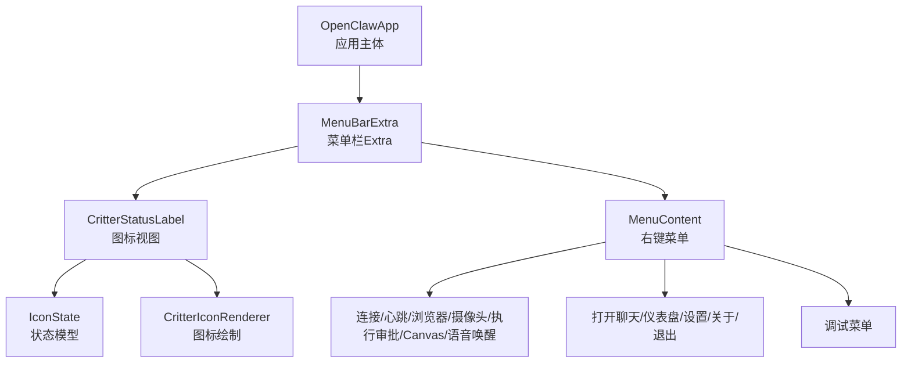
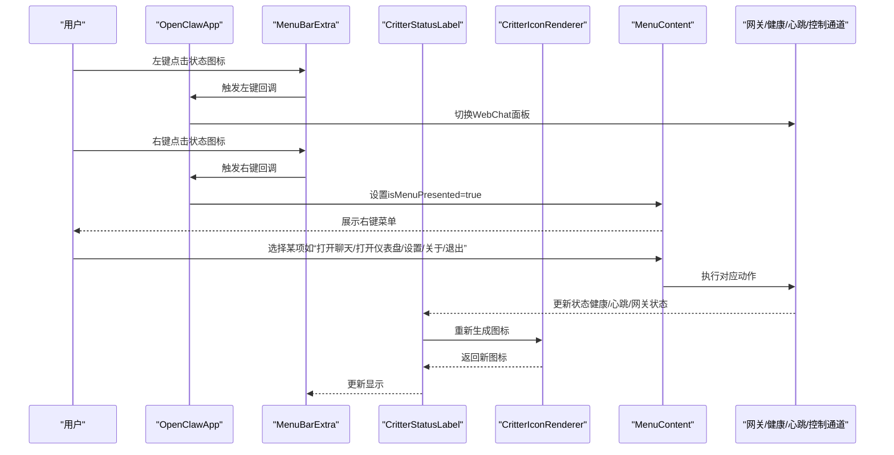
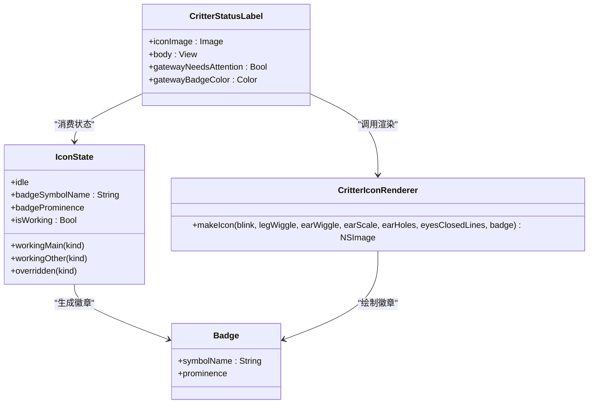
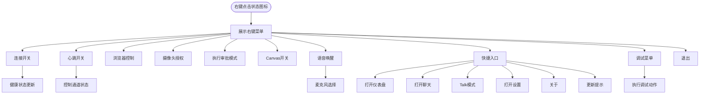
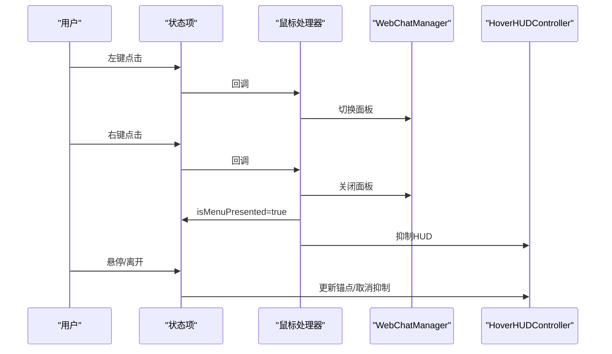
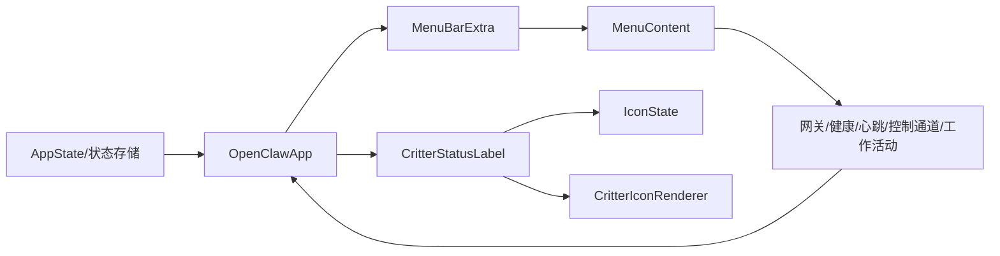

# 菜单栏控制

<cite>
**本文引用的文件**
- [apps/macos/Sources/OpenClaw/MenuBar.swift](file://apps/macos/Sources/OpenClaw/MenuBar.swift)
- [apps/macos/Sources/OpenClaw/MenuContentView.swift](file://apps/macos/Sources/OpenClaw/MenuContentView.swift)
- [apps/macos/Sources/OpenClaw/IconState.swift](file://apps/macos/Sources/OpenClaw/IconState.swift)
- [apps/macos/Sources/OpenClaw/CritterIconRenderer.swift](file://apps/macos/Sources/OpenClaw/CritterIconRenderer.swift)
- [apps/macos/Sources/OpenClaw/CritterStatusLabel.swift](file://apps/macos/Sources/OpenClaw/CritterStatusLabel.swift)
- [apps/macos/Sources/OpenClaw/CritterStatusLabel+Behavior.swift](file://apps/macos/Sources/OpenClaw/CritterStatusLabel+Behavior.swift)
</cite>

## 目录
1. [简介](#简介)
2. [项目结构](#项目结构)
3. [核心组件](#核心组件)
4. [架构总览](#架构总览)
5. [组件详解](#组件详解)
6. [依赖关系分析](#依赖关系分析)
7. [性能考量](#性能考量)
8. [故障排除指南](#故障排除指南)
9. [结论](#结论)

## 简介
本文件面向OpenClaw的macOS菜单栏控制功能，系统化阐述菜单栏图标的运行状态指示、右键菜单的功能与交互、快捷操作与上下文菜单的使用方法，并给出最佳实践与故障排除建议。读者无需深入Swift实现即可理解如何通过菜单栏进行网关状态监控、会话管理、频道配置、健康检查等日常运维与控制。

## 项目结构
OpenClaw的macOS菜单栏控制由“应用主体 + 图标渲染 + 菜单视图”三层构成：
- 应用主体：负责菜单栏Extra的创建、状态项外观、鼠标事件处理、面板可见性联动等
- 图标渲染：根据状态生成18x18像素的模板图标，支持动态表情（眨眼、抖动、耳朵放大）、徽章（工具类型）
- 菜单视图：提供右键菜单的完整控制入口，包含连接开关、心跳发送、浏览器控制、摄像头授权、执行审批模式、Canvas开关、语音唤醒、聊天与仪表盘、调试与关于、退出等

图表来源
- [apps/macos/Sources/OpenClaw/MenuBar.swift](file://apps/macos/Sources/OpenClaw/MenuBar.swift#L11-L92)
- [apps/macos/Sources/OpenClaw/CritterStatusLabel.swift](file://apps/macos/Sources/OpenClaw/CritterStatusLabel.swift#L3-L23)
- [apps/macos/Sources/OpenClaw/CritterIconRenderer.swift](file://apps/macos/Sources/OpenClaw/CritterIconRenderer.swift#L106-L149)
- [apps/macos/Sources/OpenClaw/MenuContentView.swift](file://apps/macos/Sources/OpenClaw/MenuContentView.swift#L41-L157)

章节来源
- [apps/macos/Sources/OpenClaw/MenuBar.swift](file://apps/macos/Sources/OpenClaw/MenuBar.swift#L11-L92)
- [apps/macos/Sources/OpenClaw/MenuContentView.swift](file://apps/macos/Sources/OpenClaw/MenuContentView.swift#L7-L33)

## 核心组件
- 应用主体与菜单栏Extra
  - 创建并配置MenuBarExtra，绑定状态项按钮，安装会话注入器，注册鼠标事件处理器，维护面板可见性与悬停HUD抑制
  - 响应状态切换、连接模式变更、控制通道状态变化，动态调整图标外观与禁用态
- 图标状态模型与渲染
  - IconState定义空闲、主要工作、其他工作、覆盖四种状态及对应徽章符号与显著度
  - CritterIconRenderer按状态生成位图，支持眨眼、腿部抖动、耳朵摆动、耳朵放大、透明洞形徽章
  - CritterStatusLabel将状态模型与渲染器结合，驱动动画任务与事件响应
- 右键菜单内容
  - 连接开关：显示当前连接模式与健康状态，支持暂停/恢复
  - 心跳发送：可开启/关闭心跳上报，显示最近心跳状态与时间
  - 浏览器控制：可开启/关闭浏览器控制，保存到配置
  - 摄像头授权：允许/禁止使用摄像头
  - 执行审批模式：快速选择执行审批策略
  - Canvas开关：允许/禁止Canvas，支持打开/关闭
  - 语音唤醒：启用/禁用语音唤醒，支持麦克风选择
  - 快捷入口：打开仪表盘、打开聊天、Talk模式、设置、关于、更新提示、退出
  - 调试菜单：健康检查、测试心跳、重置远程隧道、日志级别、打开会话存储、代理事件窗口、打开日志、发送测试语音、发送测试通知、重启网关/引导/应用等

章节来源
- [apps/macos/Sources/OpenClaw/MenuBar.swift](file://apps/macos/Sources/OpenClaw/MenuBar.swift#L41-L92)
- [apps/macos/Sources/OpenClaw/IconState.swift](file://apps/macos/Sources/OpenClaw/IconState.swift#L18-L67)
- [apps/macos/Sources/OpenClaw/CritterIconRenderer.swift](file://apps/macos/Sources/OpenClaw/CritterIconRenderer.swift#L106-L149)
- [apps/macos/Sources/OpenClaw/CritterStatusLabel.swift](file://apps/macos/Sources/OpenClaw/CritterStatusLabel.swift#L3-L23)
- [apps/macos/Sources/OpenClaw/MenuContentView.swift](file://apps/macos/Sources/OpenClaw/MenuContentView.swift#L41-L157)

## 架构总览
菜单栏控制的端到端流程如下：

图表来源
- [apps/macos/Sources/OpenClaw/MenuBar.swift](file://apps/macos/Sources/OpenClaw/MenuBar.swift#L134-L173)
- [apps/macos/Sources/OpenClaw/MenuContentView.swift](file://apps/macos/Sources/OpenClaw/MenuContentView.swift#L109-L156)
- [apps/macos/Sources/OpenClaw/CritterStatusLabel+Behavior.swift](file://apps/macos/Sources/OpenClaw/CritterStatusLabel+Behavior.swift#L13-L68)

## 组件详解

### 图标状态与指示含义
- 状态模型
  - 空闲：无活动，无徽章
  - 主要工作：当前会话为主角色，徽章显著度高
  - 其他工作：当前会话为其他角色，徽章显著度中等
  - 覆盖：强制覆盖状态，用于演示或调试
- 徽章符号
  - 不同工具类型映射不同符号（如读写编辑、附件、其他），用于直观表达当前活动性质
- 图标渲染
  - 支持眨眼、腿部抖动、耳朵摆动、耳朵放大（耳Boost）等动画
  - 当网关异常或停止时，在图标右上角显示警示圆点（红/橙）

图表来源
- [apps/macos/Sources/OpenClaw/IconState.swift](file://apps/macos/Sources/OpenClaw/IconState.swift#L18-L67)
- [apps/macos/Sources/OpenClaw/CritterIconRenderer.swift](file://apps/macos/Sources/OpenClaw/CritterIconRenderer.swift#L6-L19)
- [apps/macos/Sources/OpenClaw/CritterStatusLabel+Behavior.swift](file://apps/macos/Sources/OpenClaw/CritterStatusLabel+Behavior.swift#L106-L130)

章节来源
- [apps/macos/Sources/OpenClaw/IconState.swift](file://apps/macos/Sources/OpenClaw/IconState.swift#L18-L67)
- [apps/macos/Sources/OpenClaw/CritterIconRenderer.swift](file://apps/macos/Sources/OpenClaw/CritterIconRenderer.swift#L106-L149)
- [apps/macos/Sources/OpenClaw/CritterStatusLabel+Behavior.swift](file://apps/macos/Sources/OpenClaw/CritterStatusLabel+Behavior.swift#L106-L130)

### 右键菜单功能与交互
- 连接与健康
  - 连接标签：显示“未配置/远程激活/本地激活”
  - 健康状态：实时显示健康检查结果、刷新年龄、降级原因、登录需求等
  - 配对提示：当存在节点或设备配对待审批时，显示橙色提示
- 心跳与控制通道
  - 开启/关闭心跳；显示最近心跳状态与时间
  - 控制通道断连时以红色提示
- 浏览器控制与摄像头
  - 开启/关闭浏览器控制，保存到配置
  - 允许/禁止使用摄像头
- 执行审批模式
  - 快速切换执行审批策略
- Canvas
  - 允许/禁止Canvas；打开/关闭Canvas面板
- 语音唤醒
  - 启用/禁用语音唤醒；在支持时显示麦克风选择器
- 快捷入口
  - 打开仪表盘（根据当前连接模式计算URL）
  - 打开聊天（预选会话）
  - Talk模式（启动/停止）
  - 设置、关于、更新提示、退出
- 调试菜单
  - 健康检查、测试心跳、重置远程隧道、日志级别、打开会话存储、代理事件窗口、打开日志、发送测试语音、发送测试通知、重启网关/引导/应用等

图表来源
- [apps/macos/Sources/OpenClaw/MenuContentView.swift](file://apps/macos/Sources/OpenClaw/MenuContentView.swift#L41-L157)
- [apps/macos/Sources/OpenClaw/MenuContentView.swift](file://apps/macos/Sources/OpenClaw/MenuContentView.swift#L229-L329)

章节来源
- [apps/macos/Sources/OpenClaw/MenuContentView.swift](file://apps/macos/Sources/OpenClaw/MenuContentView.swift#L41-L157)
- [apps/macos/Sources/OpenClaw/MenuContentView.swift](file://apps/macos/Sources/OpenClaw/MenuContentView.swift#L229-L329)

### 鼠标事件与面板联动
- 左键点击：切换WebChat面板显示
- 右键点击：关闭聊天面板，置isMenuPresented为true，触发菜单展示
- 悬停：根据悬停位置更新HUD锚点，避免遮挡
- 面板可见性变化：同步更新状态项高亮与HUD抑制

图表来源
- [apps/macos/Sources/OpenClaw/MenuBar.swift](file://apps/macos/Sources/OpenClaw/MenuBar.swift#L134-L173)
- [apps/macos/Sources/OpenClaw/MenuBar.swift](file://apps/macos/Sources/OpenClaw/MenuBar.swift#L187-L192)

章节来源
- [apps/macos/Sources/OpenClaw/MenuBar.swift](file://apps/macos/Sources/OpenClaw/MenuBar.swift#L134-L173)
- [apps/macos/Sources/OpenClaw/MenuBar.swift](file://apps/macos/Sources/OpenClaw/MenuBar.swift#L187-L192)

## 依赖关系分析
- 应用主体依赖状态管理与服务协调器（网关、控制通道、心跳、工作活动）
- 图标渲染依赖状态模型与渲染器，输出NSImage供状态标签使用
- 菜单内容依赖状态管理与服务协调器，提供丰富的控制与调试能力
- 面板可见性与HUD抑制通过回调联动，确保用户体验一致

图表来源
- [apps/macos/Sources/OpenClaw/MenuBar.swift](file://apps/macos/Sources/OpenClaw/MenuBar.swift#L11-L39)
- [apps/macos/Sources/OpenClaw/MenuContentView.swift](file://apps/macos/Sources/OpenClaw/MenuContentView.swift#L9-L33)
- [apps/macos/Sources/OpenClaw/CritterStatusLabel.swift](file://apps/macos/Sources/OpenClaw/CritterStatusLabel.swift#L3-L23)

章节来源
- [apps/macos/Sources/OpenClaw/MenuBar.swift](file://apps/macos/Sources/OpenClaw/MenuBar.swift#L11-L39)
- [apps/macos/Sources/OpenClaw/MenuContentView.swift](file://apps/macos/Sources/OpenClaw/MenuContentView.swift#L9-L33)
- [apps/macos/Sources/OpenClaw/CritterStatusLabel.swift](file://apps/macos/Sources/OpenClaw/CritterStatusLabel.swift#L3-L23)

## 性能考量
- 动画驱动方式
  - 使用Swift并发任务替代Combine定时器，降低系统版本特定崩溃风险
  - 动画参数随机化，避免全局同步抖动
- 渲染与绘制
  - 强制双倍像素密度（36x36）以保证Retina清晰度
  - 关闭抗锯齿与模板渲染，提升菜单栏图标对比度
- 事件处理
  - 面板可见性与悬停状态变化时才更新HUD，减少不必要计算
  - 睡眠态与暂停态下重置动画，避免无效渲染

章节来源
- [apps/macos/Sources/OpenClaw/CritterStatusLabel+Behavior.swift](file://apps/macos/Sources/OpenClaw/CritterStatusLabel+Behavior.swift#L19-L32)
- [apps/macos/Sources/OpenClaw/CritterIconRenderer.swift](file://apps/macos/Sources/OpenClaw/CritterIconRenderer.swift#L151-L167)
- [apps/macos/Sources/OpenClaw/MenuBar.swift](file://apps/macos/Sources/OpenClaw/MenuBar.swift#L29-L32)

## 故障排除指南
- 图标不显示或显示异常
  - 检查是否处于暂停/睡眠态；暂停态显示静态图标，睡眠态显示闭眼图标
  - 确认动画是否被禁用；动画禁用时不会播放眨眼/抖动
- 网关异常闪烁警示
  - 网关失败或停止时会在图标右上角显示红/橙色警示；优先排查网关状态与控制通道连接
- 菜单无法打开或点击无响应
  - 确认右键点击后isMenuPresented已置为true；若面板正在显示，先关闭面板再打开菜单
  - 检查是否有重复实例导致终止；应用启动时会检测并终止重复实例
- 健康检查/心跳异常
  - 在调试菜单中手动运行健康检查与发送测试心跳，确认服务可达性
  - 远程模式下可尝试重置隧道以恢复连接
- 日志与诊断
  - 使用调试菜单中的“打开日志/打开会话存储/代理事件窗口”定位问题
  - 切换日志级别与文件日志开关，收集更多信息

章节来源
- [apps/macos/Sources/OpenClaw/CritterStatusLabel+Behavior.swift](file://apps/macos/Sources/OpenClaw/CritterStatusLabel+Behavior.swift#L210-L226)
- [apps/macos/Sources/OpenClaw/MenuBar.swift](file://apps/macos/Sources/OpenClaw/MenuBar.swift#L320-L325)
- [apps/macos/Sources/OpenClaw/MenuContentView.swift](file://apps/macos/Sources/OpenClaw/MenuContentView.swift#L229-L329)

## 结论
OpenClaw的菜单栏控制以简洁直观的方式提供了从网关状态监控到会话管理、频道配置、健康检查的全链路控制入口。通过状态模型与渲染器的解耦设计，图标能够准确传达系统状态与活动类型；通过右键菜单与快捷操作，用户可以高效完成日常运维与调试任务。遵循本文的最佳实践与故障排除建议，可在保持低资源占用的同时获得稳定可靠的菜单栏体验。