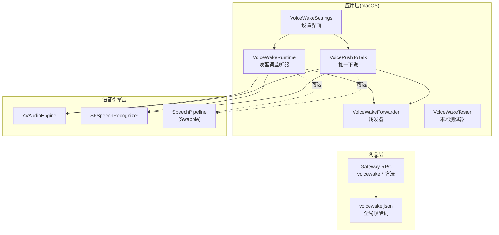
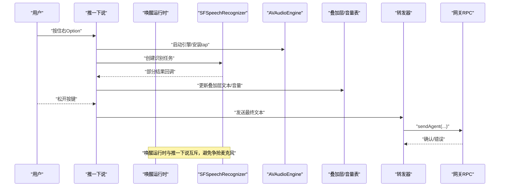
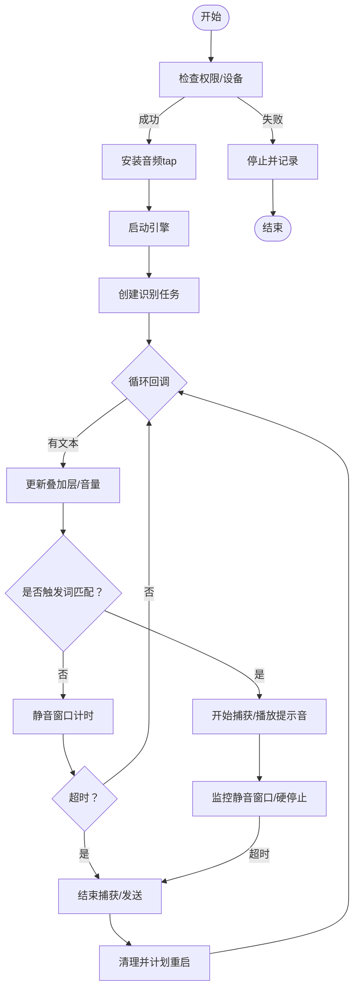
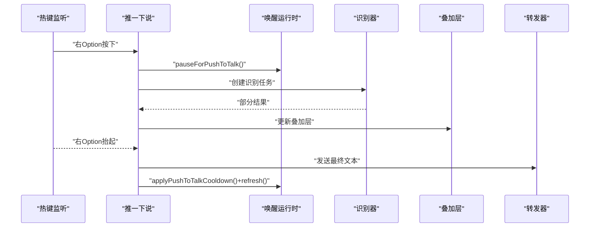
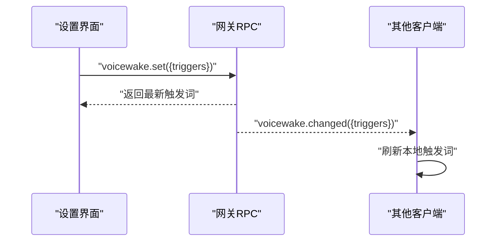
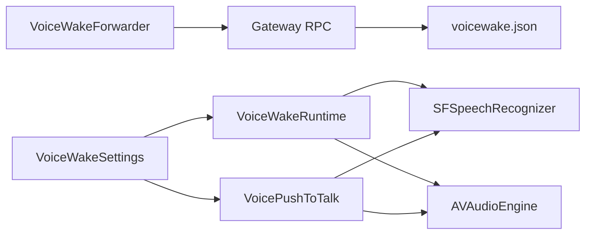

# 语音功能

<cite>
**本文引用的文件**
- [apps/macos/Sources/OpenClaw/VoiceWakeRuntime.swift](file://apps/macos/Sources/OpenClaw/VoiceWakeRuntime.swift)
- [apps/macos/Sources/OpenClaw/VoicePushToTalk.swift](file://apps/macos/Sources/OpenClaw/VoicePushToTalk.swift)
- [apps/macos/Sources/OpenClaw/VoiceWakeForwarder.swift](file://apps/macos/Sources/OpenClaw/VoiceWakeForwarder.swift)
- [apps/macos/Sources/OpenClaw/VoiceWakeSettings.swift](file://apps/macos/Sources/OpenClaw/VoiceWakeSettings.swift)
- [apps/macos/Sources/OpenClaw/VoiceWakeTester.swift](file://apps/macos/Sources/OpenClaw/VoiceWakeTester.swift)
- [src/gateway/server-methods/voicewake.ts](file://src/gateway/server-methods/voicewake.ts)
- [src/infra/voicewake.ts](file://src/infra/voicewake.ts)
- [docs/nodes/voicewake.md](file://docs/nodes/voicewake.md)
- [docs/platforms/mac/voicewake.md](file://docs/platforms/mac/voicewake.md)
- [Swabble/Sources/SwabbleCore/Speech/SpeechPipeline.swift](file://Swabble/Sources/SwabbleCore/Speech/SpeechPipeline.swift)
</cite>

## 目录
1. [简介](#简介)
2. [项目结构](#项目结构)
3. [核心组件](#核心组件)
4. [架构总览](#架构总览)
5. [详细组件分析](#详细组件分析)
6. [依赖关系分析](#依赖关系分析)
7. [性能考虑](#性能考虑)
8. [故障排除指南](#故障排除指南)
9. [结论](#结论)
10. [附录](#附录)

## 简介
本文件面向 OpenClaw 在 macOS 平台上的语音功能，系统性阐述语音唤醒、语音输入（推一下说）、语音输出转发与设置界面，并覆盖权限管理、音频设备选择、调试与测试、性能优化与最佳实践，以及与网关和其他功能模块的集成方式。文档同时给出关键流程图与时序图，帮助读者快速理解端到端工作流。

## 项目结构
OpenClaw 的语音能力在 macOS 上由多个层次协同完成：
- 应用层：负责权限请求、麦克风选择、实时识别、UI 叠加、声音提示、与网关通信。
- 语音引擎层：基于 AVFoundation 的 AVAudioEngine 与 Speech 框架，提供录音与识别。
- 网关层：集中存储与同步全局“唤醒词”，并广播给所有节点。
- 工具库层：Swabble 提供更现代的 SpeechPipeline 抽象（新版本可用）。

图表来源
- [apps/macos/Sources/OpenClaw/VoiceWakeRuntime.swift](file://apps/macos/Sources/OpenClaw/VoiceWakeRuntime.swift#L1-L777)
- [apps/macos/Sources/OpenClaw/VoicePushToTalk.swift](file://apps/macos/Sources/OpenClaw/VoicePushToTalk.swift#L1-L410)
- [apps/macos/Sources/OpenClaw/VoiceWakeForwarder.swift](file://apps/macos/Sources/OpenClaw/VoiceWakeForwarder.swift#L1-L74)
- [src/gateway/server-methods/voicewake.ts](file://src/gateway/server-methods/voicewake.ts#L1-L35)
- [src/infra/voicewake.ts](file://src/infra/voicewake.ts#L1-L60)
- [Swabble/Sources/SwabbleCore/Speech/SpeechPipeline.swift](file://Swabble/Sources/SwabbleCore/Speech/SpeechPipeline.swift#L1-L115)

章节来源
- [docs/platforms/mac/voicewake.md](file://docs/platforms/mac/voicewake.md#L1-L68)
- [docs/nodes/voicewake.md](file://docs/nodes/voicewake.md#L1-L67)

## 核心组件
- 语音唤醒运行时（VoiceWakeRuntime）
  - 始终常驻的唤醒词监听器，基于 AVAudioEngine + SFSpeechRecognizer 实时采集与识别。
  - 支持 RMS 音量检测、静音窗口判定、触发后命令提取、叠加层展示与声音提示。
  - 具备冷却去抖、硬停止保护、重启策略等鲁棒性设计。
- 推一下说（VoicePushToTalk）
  - 全局快捷键监听（右 Option），按住即开始识别，释放即发送。
  - 与唤醒运行时互斥，避免双管线争抢麦克风。
- 转发器（VoiceWakeForwarder）
  - 将最终识别文本封装为统一前缀消息，通过网关 RPC 发送到 Agent。
- 设置界面（VoiceWakeSettings）
  - 唤醒词列表编辑、语言与麦克风选择、实时音量表、测试器。
- 本地测试器（VoiceWakeTester）
  - 仅用于本地验证权限、设备与识别链路，不转发至网关。
- 网关与持久化（Gateway RPC + voicewake.json）
  - 提供获取/设置唤醒词的 RPC；全局唤醒词存储于网关主机的 JSON 文件中，支持广播同步。

章节来源
- [apps/macos/Sources/OpenClaw/VoiceWakeRuntime.swift](file://apps/macos/Sources/OpenClaw/VoiceWakeRuntime.swift#L1-L777)
- [apps/macos/Sources/OpenClaw/VoicePushToTalk.swift](file://apps/macos/Sources/OpenClaw/VoicePushToTalk.swift#L1-L410)
- [apps/macos/Sources/OpenClaw/VoiceWakeForwarder.swift](file://apps/macos/Sources/OpenClaw/VoiceWakeForwarder.swift#L1-L74)
- [apps/macos/Sources/OpenClaw/VoiceWakeSettings.swift](file://apps/macos/Sources/OpenClaw/VoiceWakeSettings.swift#L1-L663)
- [apps/macos/Sources/OpenClaw/VoiceWakeTester.swift](file://apps/macos/Sources/OpenClaw/VoiceWakeTester.swift#L1-L458)
- [src/gateway/server-methods/voicewake.ts](file://src/gateway/server-methods/voicewake.ts#L1-L35)
- [src/infra/voicewake.ts](file://src/infra/voicewake.ts#L1-L60)

## 架构总览
下图展示了 macOS 语音功能从用户交互到网关转发的端到端流程：

图表来源
- [apps/macos/Sources/OpenClaw/VoicePushToTalk.swift](file://apps/macos/Sources/OpenClaw/VoicePushToTalk.swift#L145-L379)
- [apps/macos/Sources/OpenClaw/VoiceWakeRuntime.swift](file://apps/macos/Sources/OpenClaw/VoiceWakeRuntime.swift#L141-L233)
- [apps/macos/Sources/OpenClaw/VoiceWakeForwarder.swift](file://apps/macos/Sources/OpenClaw/VoiceWakeForwarder.swift#L43-L73)

## 详细组件分析

### 语音唤醒运行时（VoiceWakeRuntime）
- 功能要点
  - 常驻监听，权限与设备校验通过后启动 AVAudioEngine + SFSpeechRecognizer。
  - 使用 RMS 音量自适应阈值判断语音活动，结合静音窗口与触发后命令提取逻辑。
  - 触发词匹配采用 Swabble 的 WakeWordGate，支持“仅触发词暂停”与“静默回退”两种模式。
  - 通过叠加层控制器与会话协调器驱动 UI 展示与收尾。
  - 发送前进行冷却去抖，硬停止防止长时间占用资源，结束后清理并计划重启。
- 关键参数与行为
  - 静音窗口：触发后为较短窗口，仅触发词阶段为较长窗口。
  - 硬停止：最大捕获时长，避免泄漏。
  - 冷却：发送后的去抖间隔。
  - RMS 音量：自适应噪声底噪，提升跨设备稳定性。
- 错误处理
  - 设备不可用、无可用输入格式、权限不足、识别器不可用等均会安全降级并记录日志。

图表来源
- [apps/macos/Sources/OpenClaw/VoiceWakeRuntime.swift](file://apps/macos/Sources/OpenClaw/VoiceWakeRuntime.swift#L278-L651)

章节来源
- [apps/macos/Sources/OpenClaw/VoiceWakeRuntime.swift](file://apps/macos/Sources/OpenClaw/VoiceWakeRuntime.swift#L1-L777)

### 推一下说（VoicePushToTalk）
- 功能要点
  - 全局快捷键监听（右 Option），按住即开始识别，释放即发送。
  - 与唤醒运行时互斥：开始时暂停唤醒运行时，结束时恢复并应用冷却。
  - 采用叠加层展示部分结果，最终合并“已采纳前缀”与当前识别文本。
- 关键点
  - 识别请求与引擎延迟创建，避免应用启动时抢占音频资源。
  - 识别回调与 UI 更新解耦，保证流畅体验。
  - 超时保护：若未收到最终结果，等待短暂宽限时间后强制发送。

图表来源
- [apps/macos/Sources/OpenClaw/VoicePushToTalk.swift](file://apps/macos/Sources/OpenClaw/VoicePushToTalk.swift#L145-L379)

章节来源
- [apps/macos/Sources/OpenClaw/VoicePushToTalk.swift](file://apps/macos/Sources/OpenClaw/VoicePushToTalk.swift#L1-L410)

### 转发器（VoiceWakeForwarder）
- 功能要点
  - 统一消息前缀，包含机器名与提醒语，便于下游 Agent 与用户区分语音输入来源。
  - 通过网关连接发送到当前活跃 Agent，支持交付开关与目标通道。
- 错误处理
  - 连接状态检查与失败日志记录，便于定位网络或授权问题。

章节来源
- [apps/macos/Sources/OpenClaw/VoiceWakeForwarder.swift](file://apps/macos/Sources/OpenClaw/VoiceWakeForwarder.swift#L1-L74)

### 设置界面（VoiceWakeSettings）
- 功能要点
  - 唤醒词表格：增删改、重置默认、同步到全局状态。
  - 语言与麦克风选择：实时音量表、设备变更提示、断开后自动回退。
  - 测试器：本地验证权限、设备与识别链路，不转发。
- 用户体验
  - 预览模式下的界面渲染与交互验证。
  - 触发词规范化与长度/数量限制。

章节来源
- [apps/macos/Sources/OpenClaw/VoiceWakeSettings.swift](file://apps/macos/Sources/OpenClaw/VoiceWakeSettings.swift#L1-L663)
- [apps/macos/Sources/OpenClaw/VoiceWakeTester.swift](file://apps/macos/Sources/OpenClaw/VoiceWakeTester.swift#L1-L458)

### 网关与全局唤醒词
- 功能要点
  - RPC 方法：获取/设置全局唤醒词，设置后广播给所有客户端。
  - 存储：网关主机 JSON 文件，包含唤醒词数组与更新时间戳。
  - 客户端行为：macOS 与 iOS 使用全局列表作为触发条件，Android 当前禁用唤醒，使用手动麦克风。
- 协议与事件
  - 方法：voicewake.get、voicewake.set
  - 事件：voicewake.changed（广播）

图表来源
- [src/gateway/server-methods/voicewake.ts](file://src/gateway/server-methods/voicewake.ts#L1-L35)
- [src/infra/voicewake.ts](file://src/infra/voicewake.ts#L1-L60)
- [docs/nodes/voicewake.md](file://docs/nodes/voicewake.md#L1-L67)

章节来源
- [docs/nodes/voicewake.md](file://docs/nodes/voicewake.md#L1-L67)
- [src/gateway/server-methods/voicewake.ts](file://src/gateway/server-methods/voicewake.ts#L1-L35)
- [src/infra/voicewake.ts](file://src/infra/voicewake.ts#L1-L60)

### Swabble 新式语音管道（可选）
- 功能要点
  - 提供更高层的 SpeechPipeline，封装授权、格式协商、缓冲转换与结果流。
  - 适用于新系统版本（macOS/iOS 26+）。
- 适用场景
  - 若需简化音频格式适配与结果流处理，可替换现有 AVAudioEngine + SFSpeechRecognizer 组合。

章节来源
- [Swabble/Sources/SwabbleCore/Speech/SpeechPipeline.swift](file://Swabble/Sources/SwabbleCore/Speech/SpeechPipeline.swift#L1-L115)

## 依赖关系分析
- 组件耦合
  - VoiceWakeRuntime 与 VoicePushToTalk 通过共享的音频资源与 UI 协调器保持互斥与一致的用户体验。
  - VoiceWakeForwarder 与网关 RPC 解耦，便于替换后端或扩展通道。
- 外部依赖
  - AVFoundation（音频引擎与格式）、Speech（识别器与授权）、OSLog（诊断日志）。
- 数据流
  - 麦克风 → AVAudioEngine tap → SFSpeechAudioBufferRecognitionRequest → 识别回调 → UI/转发。

图表来源
- [apps/macos/Sources/OpenClaw/VoiceWakeRuntime.swift](file://apps/macos/Sources/OpenClaw/VoiceWakeRuntime.swift#L1-L777)
- [apps/macos/Sources/OpenClaw/VoicePushToTalk.swift](file://apps/macos/Sources/OpenClaw/VoicePushToTalk.swift#L1-L410)
- [apps/macos/Sources/OpenClaw/VoiceWakeForwarder.swift](file://apps/macos/Sources/OpenClaw/VoiceWakeForwarder.swift#L1-L74)
- [src/gateway/server-methods/voicewake.ts](file://src/gateway/server-methods/voicewake.ts#L1-L35)
- [src/infra/voicewake.ts](file://src/infra/voicewake.ts#L1-L60)

## 性能考虑
- 音频资源管理
  - 延迟创建 AVAudioEngine，避免应用启动时抢占蓝牙 HFP 或耳机切换到低质量配置。
  - 识别完成后及时停止引擎与移除 tap，释放音频会话。
- 识别鲁棒性
  - RMS 自适应噪声底噪，提升不同设备与环境下的稳定性。
  - 静音窗口与硬停止策略，避免长时间占用与内存泄漏。
- UI 与回调解耦
  - 识别回调在后台任务中处理 UI 更新，降低主线程压力。
- 互斥与并发
  - 唤醒运行时与推一下说互斥，减少争抢与死锁风险。
- 新式管道（可选）
  - 使用 Swabble 的 SpeechPipeline 可简化格式协商与缓冲转换，减少手写样板代码带来的潜在问题。

章节来源
- [apps/macos/Sources/OpenClaw/VoiceWakeRuntime.swift](file://apps/macos/Sources/OpenClaw/VoiceWakeRuntime.swift#L141-L233)
- [apps/macos/Sources/OpenClaw/VoicePushToTalk.swift](file://apps/macos/Sources/OpenClaw/VoicePushToTalk.swift#L228-L284)
- [Swabble/Sources/SwabbleCore/Speech/SpeechPipeline.swift](file://Swabble/Sources/SwabbleCore/Speech/SpeechPipeline.swift#L32-L84)

## 故障排除指南
- 权限问题
  - 微型摄像头与语音识别权限未授予会导致无法启动识别或弹出授权提示。
  - 本地测试器会显式检查并请求权限，可据此定位问题。
- 麦克风设备
  - 无可用输入设备或设备格式异常会导致启动失败。
  - 断开后自动回退系统默认设备，重新连接后恢复上次选择。
- 识别链路
  - 识别器不可用、引擎准备失败、tap 安装失败等均会记录错误并停止。
- 网关转发
  - RPC 不可达或 Agent 不可用时，转发失败但不会阻塞 UI。
- 常见症状与建议
  - 听不到任何声音：检查系统声音与应用权限。
  - 识别不准：调整触发词、提高麦克风增益、改善环境噪音。
  - 无法唤醒：确认权限、设备可用、触发词正确且未被冷却。

章节来源
- [apps/macos/Sources/OpenClaw/VoiceWakeTester.swift](file://apps/macos/Sources/OpenClaw/VoiceWakeTester.swift#L431-L458)
- [apps/macos/Sources/OpenClaw/VoiceWakeRuntime.swift](file://apps/macos/Sources/OpenClaw/VoiceWakeRuntime.swift#L169-L184)
- [apps/macos/Sources/OpenClaw/VoicePushToTalk.swift](file://apps/macos/Sources/OpenClaw/VoicePushToTalk.swift#L248-L254)
- [apps/macos/Sources/OpenClaw/VoiceWakeForwarder.swift](file://apps/macos/Sources/OpenClaw/VoiceWakeForwarder.swift#L68-L73)

## 结论
OpenClaw 的 macOS 语音功能以“唤醒词监听 + 推一下说 + 统一转发”为核心路径，配合全局唤醒词同步与本地设置界面，形成完整的端到端体验。通过严格的权限与设备校验、RMS 音量自适应、静音窗口与硬停止策略，系统在易用性与鲁棒性之间取得平衡。建议在生产环境中优先采用延迟创建引擎与互斥机制，结合 Swabble 新式管道以简化复杂度，并持续关注权限与设备变化对用户体验的影响。

## 附录

### 权限与设备配置清单
- 必需权限
  - 麦克风访问（AVCaptureDevice.audio）
  - 语音识别授权（SFSpeechRecognizer）
  - 推一下说需要“辅助功能/输入监控”以接收全局快捷键事件
- 设备选择
  - 支持系统默认与指定麦克风；断开后自动回退，重连后恢复上次选择
- 语言与触发词
  - 语言 ID 与唤醒词列表来自全局配置，支持重置默认

章节来源
- [apps/macos/Sources/OpenClaw/VoiceWakeSettings.swift](file://apps/macos/Sources/OpenClaw/VoiceWakeSettings.swift#L1-L663)
- [docs/nodes/voicewake.md](file://docs/nodes/voicewake.md#L1-L67)
- [docs/platforms/mac/voicewake.md](file://docs/platforms/mac/voicewake.md#L1-L68)