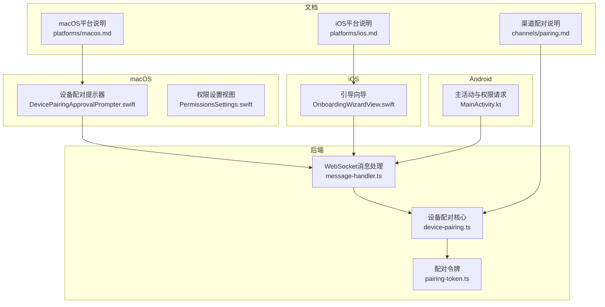
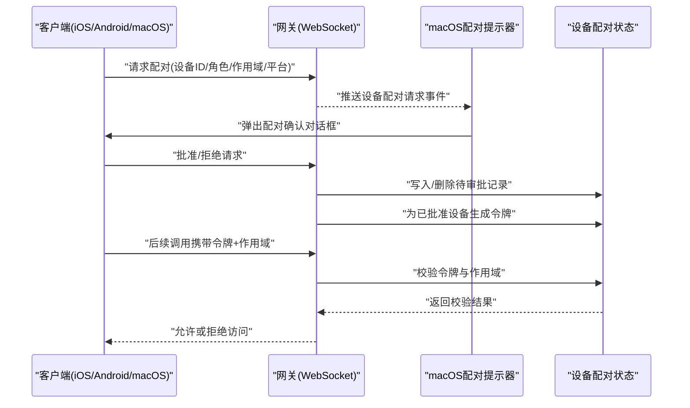
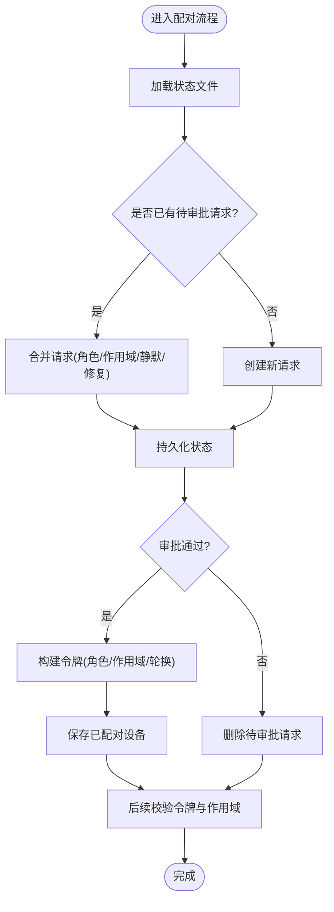
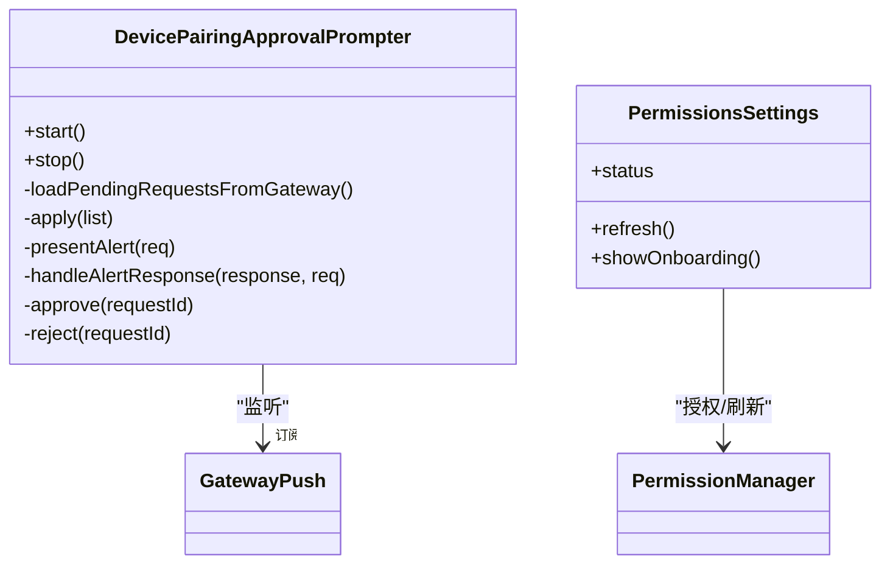
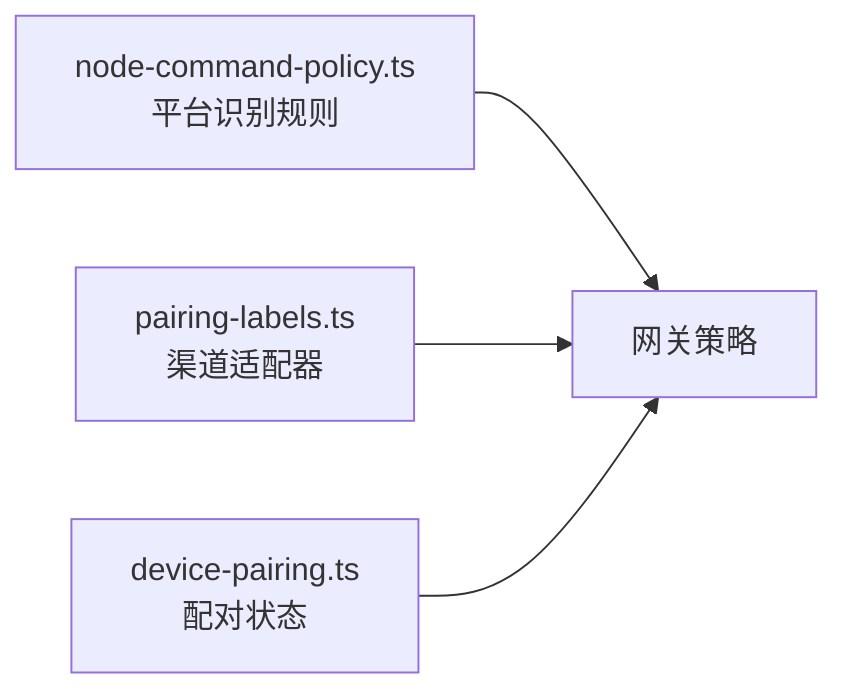

# 设备配对与权限

<cite>
**本文引用的文件**
- [src/infra/device-pairing.ts](file://src/infra/device-pairing.ts)
- [src/infra/pairing-token.ts](file://src/infra/pairing-token.ts)
- [apps/macos/Sources/OpenClaw/DevicePairingApprovalPrompter.swift](file://apps/macos/Sources/OpenClaw/DevicePairingApprovalPrompter.swift)
- [apps/macos/Sources/OpenClaw/PermissionsSettings.swift](file://apps/macos/Sources/OpenClaw/PermissionsSettings.swift)
- [apps/ios/Sources/Onboarding/OnboardingWizardView.swift](file://apps/ios/Sources/Onboarding/OnboardingWizardView.swift)
- [apps/android/app/src/main/java/ai/openclaw/app/MainActivity.kt](file://apps/android/app/src/main/java/ai/openclaw/app/MainActivity.kt)
- [docs/channels/pairing.md](file://docs/channels/pairing.md)
- [docs/platforms/macos.md](file://docs/platforms/macos.md)
- [docs/platforms/ios.md](file://docs/platforms/ios.md)
- [src/gateway/server/ws-connection/message-handler.ts](file://src/gateway/server/ws-connection/message-handler.ts)
- [src/pairing/pairing-labels.ts](file://src/pairing/pairing-labels.ts)
- [src/gateway/node-command-policy.ts](file://src/gateway/node-command-policy.ts)
</cite>

## 目录
1. [简介](#简介)
2. [项目结构](#项目结构)
3. [核心组件](#核心组件)
4. [架构总览](#架构总览)
5. [详细组件分析](#详细组件分析)
6. [依赖关系分析](#依赖关系分析)
7. [性能考量](#性能考量)
8. [故障排除指南](#故障排除指南)
9. [结论](#结论)
10. [附录](#附录)

## 简介
本文件面向OpenClaw设备配对与权限管理，覆盖以下主题：
- 设备配对机制：请求、审批、令牌签发与校验、作用域与角色控制、状态持久化与并发保护
- 平台配对流程：macOS、iOS、Android的差异与注意事项
- 权限体系：TCC权限（macOS）、系统权限（iOS/Android）与应用权限配置
- 故障排除：常见配对失败、权限缺失、令牌不匹配等问题定位与修复
- 开发者指南：配对协议要点、自定义配对流程扩展方法

## 项目结构
OpenClaw在多语言与多平台下实现统一的设备配对与权限管理：
- 后端基础设施（Node/TypeScript）：设备配对状态存储、令牌生成与校验、作用域与角色兼容性检查
- 客户端应用（SwiftUI/Swift、Kotlin、SwiftUI）：配对提示、权限引导、连接与认证流程
- 文档与策略：渠道配对（Telegram等）与平台使用指南

图表来源
- [src/infra/device-pairing.ts](file://src/infra/device-pairing.ts#L1-L654)
- [src/infra/pairing-token.ts](file://src/infra/pairing-token.ts#L1-L13)
- [apps/macos/Sources/OpenClaw/DevicePairingApprovalPrompter.swift](file://apps/macos/Sources/OpenClaw/DevicePairingApprovalPrompter.swift#L1-L257)
- [apps/macos/Sources/OpenClaw/PermissionsSettings.swift](file://apps/macos/Sources/OpenClaw/PermissionsSettings.swift#L1-L294)
- [apps/ios/Sources/Onboarding/OnboardingWizardView.swift](file://apps/ios/Sources/Onboarding/OnboardingWizardView.swift#L1-L800)
- [apps/android/app/src/main/java/ai/openclaw/app/MainActivity.kt](file://apps/android/app/src/main/java/ai/openclaw/app/MainActivity.kt#L1-L64)
- [docs/channels/pairing.md](file://docs/channels/pairing.md#L1-L111)
- [docs/platforms/macos.md](file://docs/platforms/macos.md#L1-L227)
- [docs/platforms/ios.md](file://docs/platforms/ios.md#L1-L109)

章节来源
- [src/infra/device-pairing.ts](file://src/infra/device-pairing.ts#L1-L654)
- [src/infra/pairing-token.ts](file://src/infra/pairing-token.ts#L1-L13)
- [apps/macos/Sources/OpenClaw/DevicePairingApprovalPrompter.swift](file://apps/macos/Sources/OpenClaw/DevicePairingApprovalPrompter.swift#L1-L257)
- [apps/macos/Sources/OpenClaw/PermissionsSettings.swift](file://apps/macos/Sources/OpenClaw/PermissionsSettings.swift#L1-L294)
- [apps/ios/Sources/Onboarding/OnboardingWizardView.swift](file://apps/ios/Sources/Onboarding/OnboardingWizardView.swift#L1-L800)
- [apps/android/app/src/main/java/ai/openclaw/app/MainActivity.kt](file://apps/android/app/src/main/java/ai/openclaw/app/MainActivity.kt#L1-L64)
- [docs/channels/pairing.md](file://docs/channels/pairing.md#L1-L111)
- [docs/platforms/macos.md](file://docs/platforms/macos.md#L1-L227)
- [docs/platforms/ios.md](file://docs/platforms/ios.md#L1-L109)

## 核心组件
- 设备配对状态机与令牌
  - 请求、合并、审批、拒绝、移除、元数据更新、令牌轮换与吊销
  - 基于锁的并发安全与过期清理
- 配对令牌生成与校验
  - 使用安全随机源生成，使用常量时间比较避免时序攻击
- macOS配对提示与权限设置
  - 推送式配对提醒、审批/拒绝、权限状态刷新与TCC授权
- iOS连接与配对向导
  - QR扫描/相册导入、手动连接、配对后自动重试、配对暂停与恢复
- Android主界面与权限请求
  - 生命周期绑定权限请求器、前台服务启动、保持屏幕常亮等

章节来源
- [src/infra/device-pairing.ts](file://src/infra/device-pairing.ts#L255-L654)
- [src/infra/pairing-token.ts](file://src/infra/pairing-token.ts#L1-L13)
- [apps/macos/Sources/OpenClaw/DevicePairingApprovalPrompter.swift](file://apps/macos/Sources/OpenClaw/DevicePairingApprovalPrompter.swift#L1-L257)
- [apps/macos/Sources/OpenClaw/PermissionsSettings.swift](file://apps/macos/Sources/OpenClaw/PermissionsSettings.swift#L1-L294)
- [apps/ios/Sources/Onboarding/OnboardingWizardView.swift](file://apps/ios/Sources/Onboarding/OnboardingWizardView.swift#L1-L800)
- [apps/android/app/src/main/java/ai/openclaw/app/MainActivity.kt](file://apps/android/app/src/main/java/ai/openclaw/app/MainActivity.kt#L1-L64)

## 架构总览
OpenClaw的设备配对采用“请求-推送-审批-令牌发放”的闭环：
- 客户端发起配对请求（含设备标识、角色、作用域、平台信息）
- 网关通过事件推送至macOS客户端，显示配对提醒
- 管理员批准后，网关生成设备令牌并写入本地状态
- 客户端在后续握手或调用中携带令牌与作用域进行验证

图表来源
- [apps/macos/Sources/OpenClaw/DevicePairingApprovalPrompter.swift](file://apps/macos/Sources/OpenClaw/DevicePairingApprovalPrompter.swift#L85-L210)
- [src/infra/device-pairing.ts](file://src/infra/device-pairing.ts#L272-L403)
- [src/infra/device-pairing.ts](file://src/infra/device-pairing.ts#L470-L508)
- [src/gateway/server/ws-connection/message-handler.ts](file://src/gateway/server/ws-connection/message-handler.ts#L843-L868)

## 详细组件分析

### 设备配对核心（后端）
- 数据模型
  - 待审批请求、已配对设备、令牌条目、令牌摘要
- 关键流程
  - 请求合并：合并来自多次交互的请求，保留静默策略与修复标记
  - 审批：合并角色与作用域，生成新令牌或沿用旧令牌并记录轮换时间
  - 拒绝：删除待审批记录
  - 移除：从已配对列表移除设备
  - 更新元数据：动态更新设备显示名、平台、角色、作用域等
  - 令牌操作：校验、确保存在、轮换、吊销
- 并发与持久化
  - 全局异步锁保证状态一致性
  - 分离待审批与已配对两个JSON文件，原子写入
  - 过期清理：待审批请求TTL到期自动清理

图表来源
- [src/infra/device-pairing.ts](file://src/infra/device-pairing.ts#L159-L318)
- [src/infra/device-pairing.ts](file://src/infra/device-pairing.ts#L320-L384)
- [src/infra/device-pairing.ts](file://src/infra/device-pairing.ts#L470-L508)

章节来源
- [src/infra/device-pairing.ts](file://src/infra/device-pairing.ts#L1-L654)

### 配对令牌生成与校验
- 令牌长度与编码：固定字节数的URL安全Base64编码
- 校验策略：常量时间比较，避免侧信道泄露
- 与作用域兼容：令牌内含角色与作用域，后续调用需满足角色与作用域要求

章节来源
- [src/infra/pairing-token.ts](file://src/infra/pairing-token.ts#L1-L13)
- [src/infra/device-pairing.ts](file://src/infra/device-pairing.ts#L237-L253)
- [src/infra/device-pairing.ts](file://src/infra/device-pairing.ts#L497-L500)

### macOS配对提示与权限设置
- 配对提示器
  - 订阅网关推送，队列化待审批请求，弹窗展示设备信息与作用域
  - 支持“稍后提醒”、“批准”、“拒绝”，并处理解析事件
- 权限设置
  - 列举TCC能力（通知、辅助功能、屏幕录制、麦克风、语音识别、相机、位置）
  - 提供一键授权与状态刷新；授权后延时再次刷新以等待系统状态稳定

图表来源
- [apps/macos/Sources/OpenClaw/DevicePairingApprovalPrompter.swift](file://apps/macos/Sources/OpenClaw/DevicePairingApprovalPrompter.swift#L1-L257)
- [apps/macos/Sources/OpenClaw/PermissionsSettings.swift](file://apps/macos/Sources/OpenClaw/PermissionsSettings.swift#L1-L294)

章节来源
- [apps/macos/Sources/OpenClaw/DevicePairingApprovalPrompter.swift](file://apps/macos/Sources/OpenClaw/DevicePairingApprovalPrompter.swift#L1-L257)
- [apps/macos/Sources/OpenClaw/PermissionsSettings.swift](file://apps/macos/Sources/OpenClaw/PermissionsSettings.swift#L1-L294)

### iOS连接与配对向导
- 流程步骤：欢迎/模式选择/连接/认证/成功
- 连接方式：QR扫描（含相册导入）、自动发现、手动主机/端口/TLS
- 配对状态：当网关提示需要配对时，UI进入认证步骤，支持“配对后恢复”与自动重试
- 异常处理：凭据错误时停止自动重连，直到用户重新扫描或更新凭据

章节来源
- [apps/ios/Sources/Onboarding/OnboardingWizardView.swift](file://apps/ios/Sources/Onboarding/OnboardingWizardView.swift#L1-L800)

### Android主界面与权限请求
- 生命周期集成：在STARTED阶段收集“保持唤醒”信号，按需设置FLAG_KEEP_SCREEN_ON
- 权限请求器：将相机与短信权限请求委托给统一的权限请求器
- 前台服务：首帧渲染后启动节点前台服务，减少冷启动开销

章节来源
- [apps/android/app/src/main/java/ai/openclaw/app/MainActivity.kt](file://apps/android/app/src/main/java/ai/openclaw/app/MainActivity.kt#L1-L64)

### 渠道配对与节点配对
- 渠道配对（Telegram/WhatsApp/Signal/iMessage/Discord/Slack/飞书）
  - 策略：短代码+过期控制+上限限制
  - 存储：通道级待审批与允许名单文件
- 节点设备配对（iOS/Android/macOS/headless）
  - 通过Telegram首次配对：指令+一次性设置码（含网关心跳URL与短期令牌）
  - 存储：设备目录下的待审批与已配对JSON文件

章节来源
- [docs/channels/pairing.md](file://docs/channels/pairing.md#L1-L111)

### 平台权限与能力
- macOS
  - TCC能力清单与位置权限模式（关闭/使用时/始终）
  - 执行审批策略（默认拒绝/询问/白名单）与环境变量过滤
- iOS
  - 节点能力：Canvas、屏幕快照、相机、位置、Talk/Voice Wake
  - 常见错误：后台不可用、Canvas主机未配置、重装后Keychain令牌丢失
- Android
  - 主界面与权限请求器集成，前台服务启动

章节来源
- [docs/platforms/macos.md](file://docs/platforms/macos.md#L1-L227)
- [docs/platforms/ios.md](file://docs/platforms/ios.md#L1-L109)
- [apps/android/app/src/main/java/ai/openclaw/app/MainActivity.kt](file://apps/android/app/src/main/java/ai/openclaw/app/MainActivity.kt#L1-L64)

## 依赖关系分析
- 平台识别与命令策略
  - 通过前缀与设备族令牌识别平台（iOS/Android/macOS/Windows/Linux）
- 配对标识标签
  - 不同渠道的配对ID标签（如用户ID）由适配器决定

图表来源
- [src/gateway/node-command-policy.ts](file://src/gateway/node-command-policy.ts#L118-L160)
- [src/pairing/pairing-labels.ts](file://src/pairing/pairing-labels.ts#L1-L6)

章节来源
- [src/gateway/node-command-policy.ts](file://src/gateway/node-command-policy.ts#L118-L160)
- [src/pairing/pairing-labels.ts](file://src/pairing/pairing-labels.ts#L1-L6)

## 性能考量
- 并发控制：配对状态写入使用全局异步锁，避免竞态与文件损坏
- 原子写入：待审批与已配对文件分别原子写入，降低部分写入风险
- 过期清理：待审批请求TTL到期自动清理，避免无限增长
- UI响应：macOS权限刷新采用分段延迟重试，等待系统状态稳定后再刷新
- 连接抖动：iOS在凭据缺失/被拒时停止自动重连，避免产生过多待审批请求

## 故障排除指南
- 配对未出现或无响应
  - 在网关侧查看待审批列表并手动批准
  - iOS：若配对提示未出现，执行设备列表并手动批准
- 令牌不匹配/被拒绝
  - 检查客户端是否携带正确的角色与作用域
  - 若令牌被吊销或过期，需重新轮换或重新配对
- 权限缺失（macOS）
  - 通过权限设置界面逐一授权TCC能力，授权后等待系统状态稳定再刷新
  - 位置权限“始终”可能需要系统设置额外批准
- 凭据错误
  - iOS：凭据被拒时会停止自动重连，需重新扫描或更新令牌/密码
- 平台相关问题
  - iOS：后台音频受限导致Voice Wake不可用；Canvas/相机/屏幕命令需前台运行
  - Android：重装后Keychain令牌丢失需重新配对

章节来源
- [apps/macos/Sources/OpenClaw/PermissionsSettings.swift](file://apps/macos/Sources/OpenClaw/PermissionsSettings.swift#L143-L151)
- [apps/ios/Sources/Onboarding/OnboardingWizardView.swift](file://apps/ios/Sources/Onboarding/OnboardingWizardView.swift#L243-L294)
- [docs/platforms/ios.md](file://docs/platforms/ios.md#L97-L103)

## 结论
OpenClaw通过统一的设备配对与权限管理框架，在多平台下实现了安全、可控且可审计的设备接入流程。后端以状态文件与令牌为核心，前端以可视化提示与权限引导提升用户体验。遵循本文的安全最佳实践与故障排除建议，可有效降低配对与权限相关问题的发生率。

## 附录

### 开发者配对协议说明
- 请求字段
  - 设备ID、公钥、显示名、平台、设备族、客户端ID/模式、角色/角色列表、作用域、远端IP、静默标志、修复标志、时间戳
- 审批字段
  - 合并角色与作用域，生成令牌，记录创建与轮换时间
- 校验字段
  - 角色必须存在；令牌未吊销；令牌内容匹配；请求的作用域在允许范围内；最后使用时间更新

章节来源
- [src/infra/device-pairing.ts](file://src/infra/device-pairing.ts#L14-L77)
- [src/infra/device-pairing.ts](file://src/infra/device-pairing.ts#L320-L384)
- [src/infra/device-pairing.ts](file://src/infra/device-pairing.ts#L470-L508)

### 自定义配对流程实现指南
- 扩展渠道适配器
  - 实现配对ID标签解析，使不同渠道使用一致的配对体验
- 自定义平台识别
  - 基于前缀与设备族令牌扩展平台识别规则，确保命令策略正确
- 客户端集成
  - 在客户端添加新的配对入口（如深度链接、快捷指令），并在网关侧推送事件
- 安全加固
  - 使用常量时间比较校验令牌，严格限制作用域范围，定期轮换令牌

章节来源
- [src/pairing/pairing-labels.ts](file://src/pairing/pairing-labels.ts#L1-L6)
- [src/gateway/node-command-policy.ts](file://src/gateway/node-command-policy.ts#L118-L160)
- [src/infra/pairing-token.ts](file://src/infra/pairing-token.ts#L10-L12)