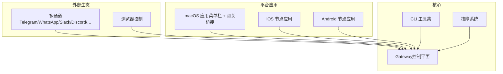
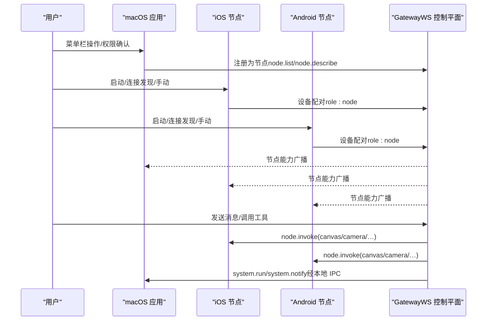
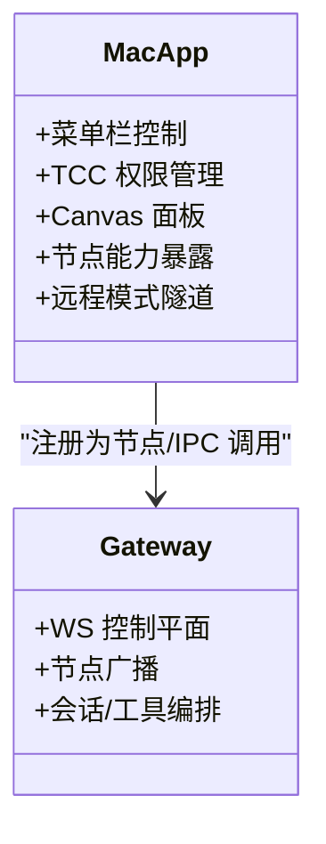
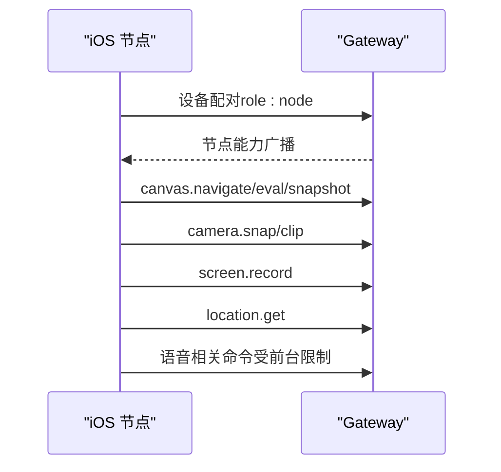
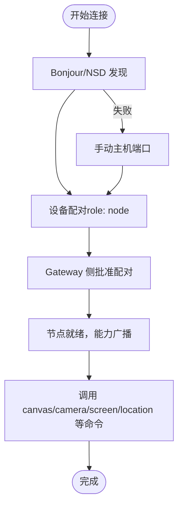
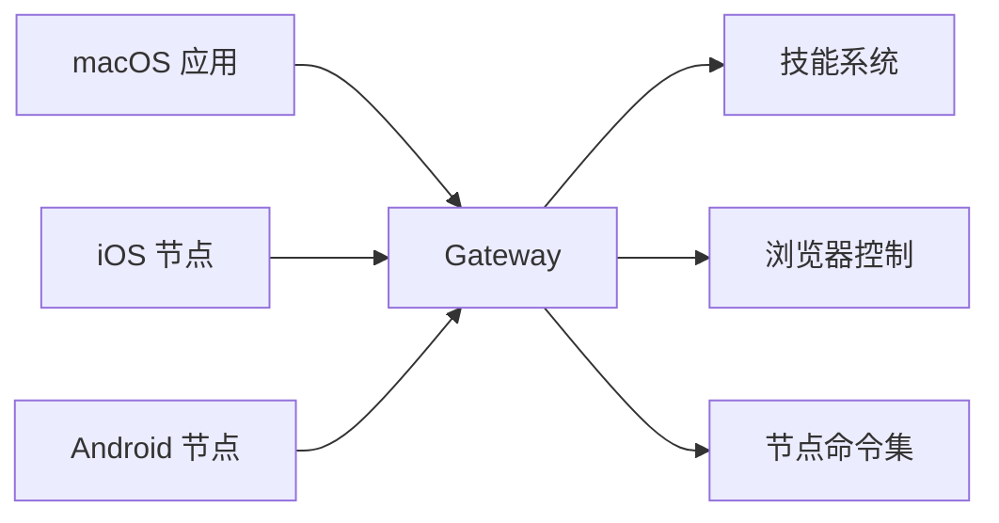

# 跨平台应用

<cite>
**本文引用的文件**
- [README.md](file://README.md)
- [apps/macos/README.md](file://apps/macos/README.md)
- [apps/ios/README.md](file://apps/ios/README.md)
- [apps/android/README.md](file://apps/android/README.md)
- [docs/platforms/macos.md](file://docs/platforms/macos.md)
- [docs/platforms/android.md](file://docs/platforms/android.md)
- [docs/platforms/ios.md](file://docs/platforms/ios.md)
- [docs/platforms/mac/canvas.md](file://docs/platforms/mac/canvas.md)
- [docs/nodes/voicewake.md](file://docs/nodes/voicewake.md)
- [docs/nodes/talk.md](file://docs/nodes/talk.md)
- [docs/nodes/camera.md](file://docs/nodes/camera.md)
- [docs/nodes/audio.md](file://docs/nodes/audio.md)
- [docs/nodes/index.md](file://docs/nodes/index.md)
- [docs/tools/skills.md](file://docs/tools/skills.md)
</cite>

## 目录
1. [简介](#简介)
2. [项目结构](#项目结构)
3. [核心组件](#核心组件)
4. [架构总览](#架构总览)
5. [详细组件分析](#详细组件分析)
6. [依赖关系分析](#依赖关系分析)
7. [性能考虑](#性能考虑)
8. [故障排查指南](#故障排查指南)
9. [结论](#结论)
10. [附录](#附录)

## 简介
OpenClaw 是一个可在本地设备上运行的个人 AI 助手，支持在 macOS、iOS、Android 上作为“节点”（nodes）连接到统一的“网关”（Gateway），并通过 WebSocket 控制平面实现会话、工具与事件的集中编排。它提供菜单栏控制、语音唤醒、Canvas 可视化工作区、远程网关控制等能力；同时支持 iOS 节点的连接与控制、Android 节点的相机/屏幕录制/位置/通知等完整功能集合。

本技术文档面向希望部署、使用与二次开发的工程师与高级用户，覆盖安装部署、权限配置、平台特性、平台特定开发指南与集成方案。

## 项目结构
仓库采用多模块组织：核心后端（Gateway）、CLI、通道适配器、工具与技能系统，以及各平台的应用与节点工程（macOS、iOS、Android）。平台应用与节点应用通过“设备配对 + WebSocket 连接”的方式接入 Gateway，形成统一的控制平面。

图示来源
- [README.md](file://README.md#L185-L212)
- [docs/platforms/macos.md](file://docs/platforms/macos.md#L9-L25)
- [docs/platforms/android.md](file://docs/platforms/android.md#L10-L18)
- [docs/platforms/ios.md](file://docs/platforms/ios.md#L10-L18)

章节来源
- [README.md](file://README.md#L185-L212)
- [docs/platforms/macos.md](file://docs/platforms/macos.md#L9-L25)
- [docs/platforms/android.md](file://docs/platforms/android.md#L10-L18)
- [docs/platforms/ios.md](file://docs/platforms/ios.md#L10-L18)

## 核心组件
- 网关（Gateway）
  - 单一 WebSocket 控制平面，承载会话、存在性、配置、定时任务、Webhook、Canvas 主机与节点控制。
  - 支持本地或远程模式，可通过 SSH 隧道或 Tailscale 暴露服务面。
- 平台应用
  - macOS：菜单栏控制、权限管理、Canvas 面板、远程网关控制、节点能力暴露（Canvas、Camera、Screen、system.run/notify）。
  - iOS：节点角色，支持 Canvas、相机、屏幕录制、位置、语音唤醒/连续对话、分享扩展。
  - Android：节点角色，支持连接/配对、聊天、语音、Canvas、相机/视频、位置、通知、日历/联系人/运动等。
- 技能系统（Skills）
  - 基于 AgentSkills 规范，支持捆绑、托管与工作区三层优先级，按环境/二进制/配置条件动态加载。
- 通道与工具
  - 多通道消息入口；浏览器控制、Canvas/A2UI、节点命令（canvas/camera/screen/device/notifications/system）等。

章节来源
- [README.md](file://README.md#L126-L176)
- [docs/tools/skills.md](file://docs/tools/skills.md#L9-L27)
- [docs/platforms/macos.md](file://docs/platforms/macos.md#L50-L65)
- [docs/platforms/ios.md](file://docs/platforms/ios.md#L14-L18)
- [docs/platforms/android.md](file://docs/platforms/android.md#L10-L18)

## 架构总览
OpenClaw 的运行时由“网关 + 节点 + 平台应用 + 通道/工具”构成。节点以设备配对的方式接入网关，通过 node.invoke 执行命令；平台应用在 macOS 上可作为节点暴露系统能力，并提供菜单栏控制与 Canvas 面板。

图示来源
- [README.md](file://README.md#L185-L212)
- [docs/platforms/macos.md](file://docs/platforms/macos.md#L50-L73)
- [docs/platforms/ios.md](file://docs/platforms/ios.md#L14-L27)
- [docs/platforms/android.md](file://docs/platforms/android.md#L24-L38)

## 详细组件分析

### macOS 应用（菜单栏 + 网关桥接）
- 职责
  - 菜单栏状态与通知；TCC 权限提示与管理；本地/远程模式下的 Gateway 生命周期管理；作为节点暴露 Canvas、Camera、Screen、system.run/system.notify。
  - 在远程模式下通过 SSH 隧道将本地 UI 组件与远端 Gateway 通信。
- 关键能力
  - Canvas：自定义 URL Scheme 提供本地文件访问，支持 A2UI 推送与快照。
  - 语音：菜单栏“Talk”叠加层、中断策略、ElevenLabs 流式播放。
  - 系统执行：基于“执行审批”策略的 system.run，结合 exec-approvals.json。
- 开发与打包
  - 支持快速开发运行与签名打包流程，含团队 ID 审计与库验证绕过开关（仅开发）。

图示来源
- [docs/platforms/macos.md](file://docs/platforms/macos.md#L15-L33)
- [docs/platforms/macos.md](file://docs/platforms/macos.md#L50-L73)
- [apps/macos/README.md](file://apps/macos/README.md#L17-L23)

章节来源
- [docs/platforms/macos.md](file://docs/platforms/macos.md#L15-L73)
- [apps/macos/README.md](file://apps/macos/README.md#L1-L65)

### iOS 节点应用（Canvas + 语音 + 位置）
- 连接与配对
  - 通过 Bonjour 或手动主机端口连接 Gateway；首次需在 Gateway 侧批准设备配对请求。
- 能力与限制
  - Canvas（WKWebView）、相机拍照/录像、屏幕录制、位置、通知、日历/联系人/提醒事项、运动数据。
  - 前台优先：Canvas、相机、屏幕录制、Talk 等在后台受限。
- 语音与唤醒
  - 语音唤醒与连续对话在设置中启用；与麦克风占用冲突时，Talk 会抑制唤醒捕获。
- 调试要点
  - 使用 Discovery Debug Logs 与 Gateway Diag 子系统过滤日志；必要时切换手动主机端口与 TLS。

图示来源
- [docs/platforms/ios.md](file://docs/platforms/ios.md#L28-L51)
- [docs/platforms/ios.md](file://docs/platforms/ios.md#L67-L91)
- [apps/ios/README.md](file://apps/ios/README.md#L62-L69)

章节来源
- [docs/platforms/ios.md](file://docs/platforms/ios.md#L14-L51)
- [apps/ios/README.md](file://apps/ios/README.md#L53-L109)

### Android 节点应用（相机/屏幕/位置/通知）
- 连接与配对
  - 支持“Setup Code”与“Manual”两种连接模式；首次需在 Gateway 侧批准设备配对请求。
- 能力矩阵
  - Canvas（A2UI）、相机拍照/录像、屏幕录制、位置、通知列表/动作、联系人/日历、运动数据、短信发送（取决于权限与设备）。
- 权限与前台服务
  - 需要相机/录音/位置/通知等权限；通过前台服务维持连接稳定性。
- 性能与基准
  - 提供宏基准与热点分析脚本，支持冷启动测量与热点定位。

图示来源
- [docs/platforms/android.md](file://docs/platforms/android.md#L24-L38)
- [docs/platforms/android.md](file://docs/platforms/android.md#L73-L86)
- [apps/android/README.md](file://apps/android/README.md#L143-L164)

章节来源
- [docs/platforms/android.md](file://docs/platforms/android.md#L24-L165)
- [apps/android/README.md](file://apps/android/README.md#L1-L229)

### Canvas 与 A2UI（macOS/Android/iOS）
- macOS Canvas
  - 自定义 openclaw-canvas:// URL Scheme 提供本地文件访问；支持 A2UI v0.8 消息推送与快照。
- 跨平台 Canvas
  - iOS/Android 通过 node.invoke 驱动 Canvas，Gateway Canvas Host 提供 /__openclaw__/canvas/ 与 /__openclaw__/a2ui/。
- 使用建议
  - 在需要编辑 HTML/CSS/JS 的场景使用 Gateway Canvas Host；在移动端保持 Screen Tab 常驻以确保 Canvas 能力可用。

章节来源
- [docs/platforms/mac/canvas.md](file://docs/platforms/mac/canvas.md#L10-L77)
- [docs/platforms/ios.md](file://docs/platforms/ios.md#L67-L81)
- [docs/platforms/android.md](file://docs/platforms/android.md#L121-L146)

### 语音唤醒与连续对话（Talk）
- 语音唤醒
  - 全局唤醒词列表由 Gateway 维护并广播至所有客户端；macOS/iOS 本地保留启用开关。
- 连续对话（Talk）
  - 监听→思考→说话三阶段；支持打断、JSON 前缀控制语音参数；默认输出格式与延迟参数因平台而异。
- 配置
  - 通过 ~/.openclaw/openclaw.json 设置 ElevenLabs 语音、模型、输出格式与超时等。

章节来源
- [docs/nodes/voicewake.md](file://docs/nodes/voicewake.md#L9-L49)
- [docs/nodes/talk.md](file://docs/nodes/talk.md#L9-L93)

### 相机与音频处理
- 相机
  - iOS/Android/macOS 节点均支持拍照（jpg）与短片录制（mp4），部分平台要求前台运行与权限。
- 音频/语音笔记
  - 自动检测本地 CLI 或提供商模型进行转写；支持前缀转写回显、提及检测、代理环境变量等。

章节来源
- [docs/nodes/camera.md](file://docs/nodes/camera.md#L9-L163)
- [docs/nodes/audio.md](file://docs/nodes/audio.md#L8-L188)

### 节点协议与命令体系
- 节点角色
  - 通过 role: node 与 Gateway 建立 WS 连接，暴露 canvas/camera/screen/device/notifications/system 等命令族。
- 命令调用
  - 低层 node.invoke；高层 openclaw nodes … 辅助命令；部分命令支持 MEDIA 输出以便代理上下文。
- 远程节点主机
  - 通过 node host 在不同主机间转发 system.run/system.which，配合 exec-approvals 策略。

章节来源
- [docs/nodes/index.md](file://docs/nodes/index.md#L10-L44)
- [docs/nodes/index.md](file://docs/nodes/index.md#L147-L232)
- [docs/nodes/index.md](file://docs/nodes/index.md#L290-L316)

### 技能系统（Skills）
- 加载与优先级
  - 捆绑 → 托管（~/.openclaw/skills） → 工作区（workspace/skills），支持 per-agent 与共享技能。
- 装配与注入
  - 基于 AgentSkills 规范；metadata.openclaw 用于环境/二进制/配置条件门控；运行时注入 env/apiKey/config。
- 安全与热重载
  - 第三方技能视为不受信代码；支持 watch 与会话快照；远程 macOS 节点可按命令支持与二进制探测提升技能可用性。

章节来源
- [docs/tools/skills.md](file://docs/tools/skills.md#L9-L77)
- [docs/tools/skills.md](file://docs/tools/skills.md#L106-L187)
- [docs/tools/skills.md](file://docs/tools/skills.md#L248-L253)

## 依赖关系分析
- 平台应用与节点应用依赖 Gateway 的 WebSocket 控制平面与设备配对机制。
- macOS 应用在本地模式下直接与 Gateway 交互，在远程模式下通过 SSH 隧道桥接。
- iOS/Android 节点通过 Bonjour/NSD 或手动主机端口连接 Gateway，并在 Gateway 侧完成设备配对。
- 技能系统与工具链（浏览器、Canvas、节点命令）均通过 Gateway 统一编排。

图示来源
- [docs/platforms/macos.md](file://docs/platforms/macos.md#L26-L33)
- [docs/platforms/ios.md](file://docs/platforms/ios.md#L20-L27)
- [docs/platforms/android.md](file://docs/platforms/android.md#L24-L38)
- [docs/tools/skills.md](file://docs/tools/skills.md#L9-L27)

章节来源
- [docs/platforms/macos.md](file://docs/platforms/macos.md#L26-L33)
- [docs/platforms/ios.md](file://docs/platforms/ios.md#L20-L27)
- [docs/platforms/android.md](file://docs/platforms/android.md#L24-L38)
- [docs/tools/skills.md](file://docs/tools/skills.md#L9-L27)

## 性能考虑
- 启动与迭代
  - Android 支持 Live Edit 与 Apply Changes，适合 UI 快速迭代；Canvas 内容支持从 Gateway 的 Canvas Host 实时刷新。
- 基准测试
  - 提供宏基准与热点分析脚本，支持冷启动测量、COV 统计与符号热点提取。
- 资源与功耗
  - iOS/Android 在后台对 Canvas/camera/screen 等命令有限制，避免持续高负载；位置自动化应避免持续 GPS 轮询。

章节来源
- [apps/android/README.md](file://apps/android/README.md#L134-L142)
- [apps/android/README.md](file://apps/android/README.md#L59-L92)
- [apps/ios/README.md](file://apps/ios/README.md#L101-L110)

## 故障排查指南
- macOS
  - 使用 openclaw-mac connect/discover 进行连通性诊断；对比 macOS 应用与 Node CLI 的发现差异。
  - 远程模式下检查 SSH 隧道与 loopback IP 显示。
- iOS
  - 检查配对状态、Discovery Debug Logs、APNs 注册失败日志；前台优先保证 Canvas/camera/screen 命令可用。
- Android
  - 确认 Gateway 可达、前台服务运行、权限授予；集成测试套件可验证命令契约与常见错误修复路径。

章节来源
- [docs/platforms/macos.md](file://docs/platforms/macos.md#L171-L199)
- [apps/ios/README.md](file://apps/ios/README.md#L120-L142)
- [apps/android/README.md](file://apps/android/README.md#L175-L224)

## 结论
OpenClaw 通过统一的 Gateway 控制平面，将 macOS 菜单栏应用、iOS/Android 节点与多通道消息入口整合为一体，既满足本地化、低延迟与安全可控的需求，又提供了丰富的可视化与多媒体能力。对于开发者而言，平台应用与节点应用遵循清晰的协议与权限模型，便于二次开发与定制。

## 附录

### 安装与部署要点
- Gateway
  - 本地/远程模式选择；SSH 隧道或 Tailscale 暴露；守护进程管理（launchd/systemd）。
- macOS 应用
  - 本地模式自动挂载/启动 Gateway；远程模式通过 SSH 隧道桥接；签名与权限持久化。
- iOS/Android 节点
  - Bonjour/NSD 发现或手动主机端口；首次设备配对；前台服务维持连接稳定。

章节来源
- [docs/platforms/macos.md](file://docs/platforms/macos.md#L26-L33)
- [docs/platforms/macos.md](file://docs/platforms/macos.md#L200-L220)
- [docs/platforms/ios.md](file://docs/platforms/ios.md#L28-L51)
- [docs/platforms/android.md](file://docs/platforms/android.md#L24-L38)

### 平台特定开发指南
- macOS
  - Swift 原生开发与打包脚本；菜单栏 UI、Canvas 面板、系统执行审批策略。
- iOS
  - Xcode 手动部署流程；APNs 能力与签名；前台优先的命令限制与调试日志。
- Android
  - Kotlin/Jetpack Compose；权限请求与前台服务；宏基准与热点分析。

章节来源
- [apps/macos/README.md](file://apps/macos/README.md#L1-L65)
- [apps/ios/README.md](file://apps/ios/README.md#L21-L52)
- [apps/android/README.md](file://apps/android/README.md#L22-L56)