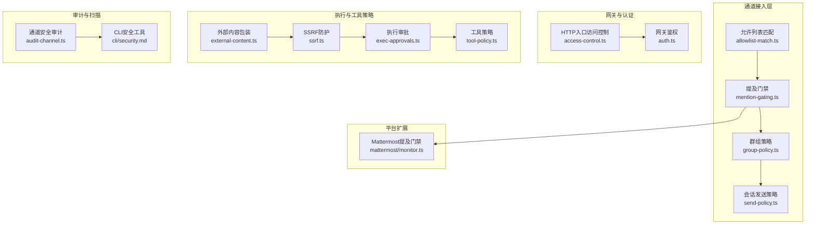
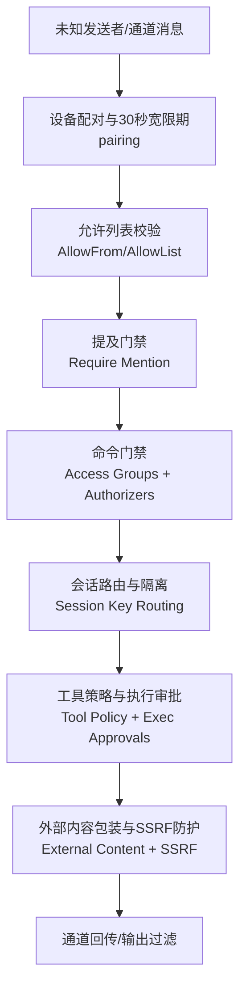
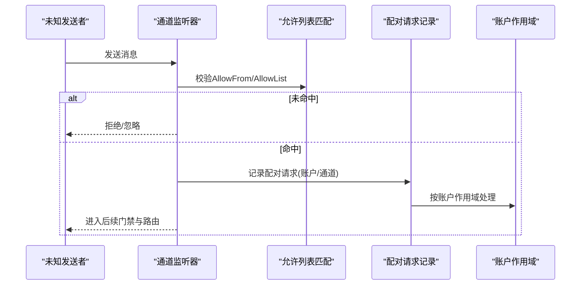
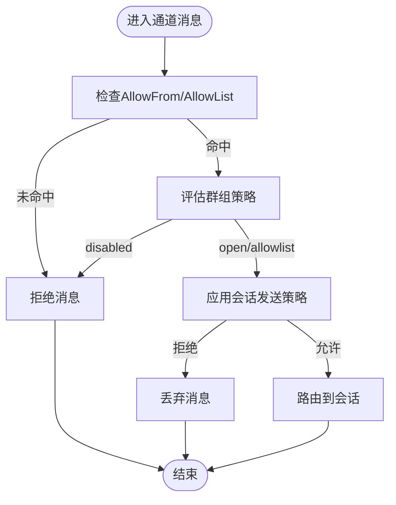
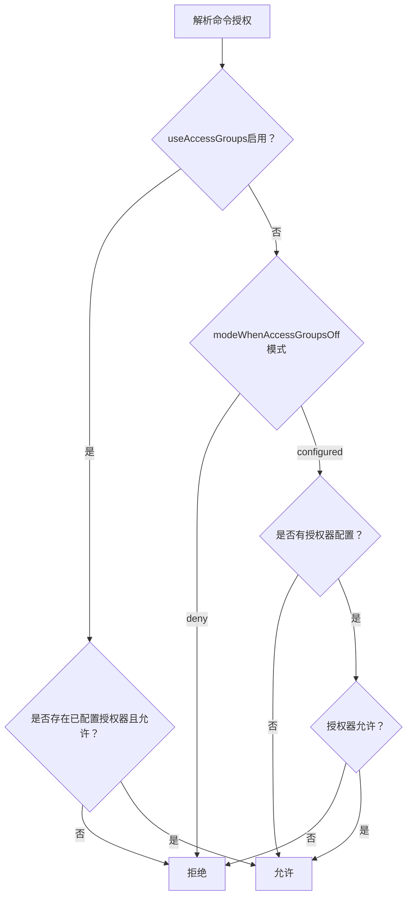
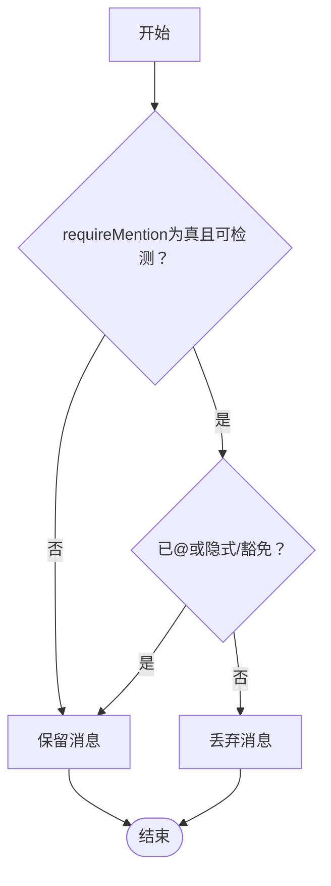
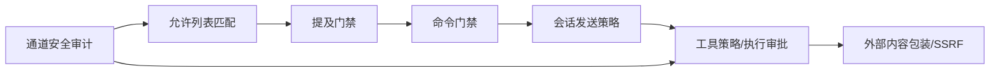

# 安全策略和权限控制

<cite>
**本文引用的文件**
- [SECURITY.md](file://SECURITY.md)
- [docs/security/README.md](file://docs/security/README.md)
- [docs/security/THREAT-MODEL-ATLAS.md](file://docs/security/THREAT-MODEL-ATLAS.md)
- [docs/security/CONTRIBUTING-THREAT-MODEL.md](file://docs/security/CONTRIBUTING-THREAT-MODEL.md)
- [docs/cli/security.md](file://docs/cli/security.md)
- [src/security/audit-channel.ts](file://src/security/audit-channel.ts)
- [src/channels/allowlist-match.ts](file://src/channels/allowlist-match.ts)
- [src/channels/command-gating.ts](file://src/channels/command-gating.ts)
- [src/channels/mention-gating.ts](file://src/channels/mention-gating.ts)
- [extensions/mattermost/src/mattermost/monitor.ts](file://extensions/mattermost/src/mattermost/monitor.ts)
- [src/channels/account-snapshot-fields.ts](file://src/channels/account-snapshot-fields.ts)
- [src/sessions/send-policy.ts](file://src/sessions/send-policy.ts)
- [src/config/group-policy.ts](file://src/config/group-policy.ts)
- [src/discord/monitor/listeners.ts](file://src/discord/monitor/listeners.ts)
- [src/gateway/auth.ts](file://src/gateway/auth.ts)
- [src/web/inbound/access-control.ts](file://src/web/inbound/access-control.ts)
- [src/infra/net/ssrf.ts](file://src/infra/net/ssrf.ts)
- [src/security/external-content.ts](file://src/security/external-content.ts)
- [src/agents/sandbox/tool-policy.ts](file://src/agents/sandbox/tool-policy.ts)
- [src/infra/exec-approvals.ts](file://src/infra/exec-approvals.ts)
- [extensions/zalouser/src/monitor.account-scope.test.ts](file://extensions/zalouser/src/monitor.account-scope.test.ts)
</cite>

## 目录
1. [简介](#简介)
2. [项目结构](#项目结构)
3. [核心组件](#核心组件)
4. [架构总览](#架构总览)
5. [详细组件分析](#详细组件分析)
6. [依赖关系分析](#依赖关系分析)
7. [性能考量](#性能考量)
8. [故障排查指南](#故障排查指南)
9. [结论](#结论)
10. [附录](#附录)

## 简介
本文件面向OpenClaw通道安全策略与权限控制，系统化阐述未知发送者安全策略、配对机制与允许列表控制；深入解析命令门禁与提及门禁；说明账户快照字段的安全处理；并覆盖通道级访问控制、身份验证与授权流程。同时提供威胁模型、漏洞防护、安全配置指南、合规与审计建议，以及安全事件监控与应急响应要点。

## 项目结构
围绕通道安全的关键代码分布在以下模块：
- 通道接入与路由：允许列表匹配、提及门禁、群组策略、会话发送策略
- 网关与认证：HTTP入口访问控制、网关鉴权
- 执行与工具策略：外部内容包装、SSRF防护、执行审批、工具策略
- 审计与扫描：通道安全审计、危险配置扫描
- 平台扩展：特定通道（如Mattermost）的提及门禁实现

**图表来源**
- [src/channels/allowlist-match.ts](file://src/channels/allowlist-match.ts#L56-L115)
- [src/channels/mention-gating.ts](file://src/channels/mention-gating.ts#L1-L59)
- [src/config/group-policy.ts](file://src/config/group-policy.ts#L325-L359)
- [src/sessions/send-policy.ts](file://src/sessions/send-policy.ts#L83-L123)
- [src/web/inbound/access-control.ts](file://src/web/inbound/access-control.ts)
- [src/gateway/auth.ts](file://src/gateway/auth.ts)
- [src/security/external-content.ts](file://src/security/external-content.ts)
- [src/infra/net/ssrf.ts](file://src/infra/net/ssrf.ts)
- [src/infra/exec-approvals.ts](file://src/infra/exec-approvals.ts)
- [src/agents/sandbox/tool-policy.ts](file://src/agents/sandbox/tool-policy.ts)
- [src/security/audit-channel.ts](file://src/security/audit-channel.ts#L290-L304)
- [docs/cli/security.md](file://docs/cli/security.md#L1-L72)
- [extensions/mattermost/src/mattermost/monitor.ts](file://extensions/mattermost/src/mattermost/monitor.ts#L222-L273)

**章节来源**
- [docs/security/README.md](file://docs/security/README.md#L1-L18)
- [docs/security/THREAT-MODEL-ATLAS.md](file://docs/security/THREAT-MODEL-ATLAS.md#L57-L123)

## 核心组件
- 允许列表匹配：统一处理ID/名称/通配符匹配，支持大小写归一化与缓存优化，避免重复计算。
- 提及门禁：在群聊中强制@提及或隐式/豁免条件，结合检测能力决定是否丢弃消息。
- 命令门禁：基于访问组与授权器的控制命令授权策略，支持“关闭时拒绝/按配置”等模式。
- 账户快照字段：安全投影账户信息，剔除签名密钥、Webhook等敏感字段，仅保留状态与来源信息。
- 通道级访问控制：结合群组策略、允许列表与会话键前缀，实现细粒度路由与访问控制。
- 身份验证与授权：网关鉴权与HTTP入口访问控制，配合信任模型与部署假设保障边界。
- 外部内容与SSRF：对外部URL/邮件/Webhook进行包装与安全提示注入，并实施SSRF阻断。
- 执行审批与工具策略：对高危命令与工具调用进行审批与策略约束，降低宿主执行风险。

**章节来源**
- [src/channels/allowlist-match.ts](file://src/channels/allowlist-match.ts#L56-L115)
- [src/channels/mention-gating.ts](file://src/channels/mention-gating.ts#L1-L59)
- [src/channels/command-gating.ts](file://src/channels/command-gating.ts)
- [src/channels/account-snapshot-fields.ts](file://src/channels/account-snapshot-fields.ts#L175-L181)
- [src/sessions/send-policy.ts](file://src/sessions/send-policy.ts#L83-L123)
- [src/web/inbound/access-control.ts](file://src/web/inbound/access-control.ts)
- [src/gateway/auth.ts](file://src/gateway/auth.ts)
- [src/security/external-content.ts](file://src/security/external-content.ts)
- [src/infra/net/ssrf.ts](file://src/infra/net/ssrf.ts)
- [src/infra/exec-approvals.ts](file://src/infra/exec-approvals.ts)
- [src/agents/sandbox/tool-policy.ts](file://src/agents/sandbox/tool-policy.ts)

## 架构总览
下图展示从通道到执行的多层信任边界与控制点，强调“通道接入—会话隔离—执行沙箱—外部内容”的分层安全设计。

**图表来源**
- [docs/security/THREAT-MODEL-ATLAS.md](file://docs/security/THREAT-MODEL-ATLAS.md#L70-L123)
- [src/channels/allowlist-match.ts](file://src/channels/allowlist-match.ts#L56-L115)
- [src/channels/mention-gating.ts](file://src/channels/mention-gating.ts#L1-L59)
- [src/channels/command-gating.ts](file://src/channels/command-gating.ts)
- [src/sessions/send-policy.ts](file://src/sessions/send-policy.ts#L83-L123)
- [src/security/external-content.ts](file://src/security/external-content.ts)
- [src/infra/net/ssrf.ts](file://src/infra/net/ssrf.ts)
- [src/infra/exec-approvals.ts](file://src/infra/exec-approvals.ts)
- [src/agents/sandbox/tool-policy.ts](file://src/agents/sandbox/tool-policy.ts)

## 详细组件分析

### 未知发送者安全策略与配对机制
- 配对宽限期：设备配对存在短暂宽限期，需通过现有通道发送一次性验证码，到期自动失效。
- 入站校验：通道侧对允许列表进行严格匹配，未命中允许列表的消息被拒绝。
- 账户作用域与配对请求：扩展插件可记录配对请求并按账户/通道维度管理，避免跨账户冒用。

**图表来源**
- [docs/security/THREAT-MODEL-ATLAS.md](file://docs/security/THREAT-MODEL-ATLAS.md#L74-L76)
- [src/channels/allowlist-match.ts](file://src/channels/allowlist-match.ts#L56-L115)
- [extensions/zalouser/src/monitor.account-scope.test.ts](file://extensions/zalouser/src/monitor.account-scope.test.ts#L83-L113)

**章节来源**
- [docs/security/THREAT-MODEL-ATLAS.md](file://docs/security/THREAT-MODEL-ATLAS.md#L170-L181)
- [extensions/zalouser/src/monitor.account-scope.test.ts](file://extensions/zalouser/src/monitor.account-scope.test.ts#L83-L113)

### 允许列表控制与通道级访问控制
- 允许列表匹配：支持ID/名称/通配符，大小写归一化与缓存，提升性能与一致性。
- 群组策略：支持open/disabled/allowlist三种模式，结合默认组与显式组配置，实现灵活的群组级访问控制。
- 会话发送策略：基于通道、聊天类型、会话键前缀的规则与默认策略，确保消息仅路由至授权会话。

**图表来源**
- [src/channels/allowlist-match.ts](file://src/channels/allowlist-match.ts#L56-L115)
- [src/config/group-policy.ts](file://src/config/group-policy.ts#L325-L359)
- [src/sessions/send-policy.ts](file://src/sessions/send-policy.ts#L83-L123)

**章节来源**
- [src/channels/allowlist-match.ts](file://src/channels/allowlist-match.ts#L56-L115)
- [src/config/group-policy.ts](file://src/config/group-policy.ts#L325-L359)
- [src/sessions/send-policy.ts](file://src/sessions/send-policy.ts#L83-L123)

### 命令门禁与授权流程
- 基于访问组与授权器：当启用访问组时，若无已配置授权器则拒绝；否则任一授权器允许即通过。
- 关闭时行为：可通过配置选择“关闭时拒绝”或“关闭时按配置”两种模式，增强灵活性与安全性。
- 控制命令门禁：当存在控制命令且未授权时，根据配置决定是否阻断。

**图表来源**
- [src/channels/command-gating.ts](file://src/channels/command-gating.ts)

**章节来源**
- [src/channels/command-gating.ts](file://src/channels/command-gating.ts)

### 提及门禁与豁免逻辑
- 基础门禁：在非私聊场景中，若需要@提及而未检测到，则丢弃消息。
- 豁免条件：当为控制命令、已触发onchar、或具备隐式提及条件时，允许绕过@要求。
- Mattermost扩展：提供更细粒度的“是否需要提及”解析与决策，结合线程根ID与账户配置。

**图表来源**
- [src/channels/mention-gating.ts](file://src/channels/mention-gating.ts#L1-L59)
- [extensions/mattermost/src/mattermost/monitor.ts](file://extensions/mattermost/src/mattermost/monitor.ts#L222-L273)

**章节来源**
- [src/channels/mention-gating.ts](file://src/channels/mention-gating.ts#L1-L59)
- [extensions/mattermost/src/mattermost/monitor.ts](file://extensions/mattermost/src/mattermost/monitor.ts#L222-L273)

### 账户快照字段的安全机制
- 投影安全字段：仅保留令牌来源、状态与部分可见元数据，剔除签名密钥、Webhook等敏感字段。
- 用于审计与可视化：避免在日志或界面中泄露凭证与接口地址。

**章节来源**
- [src/channels/account-snapshot-fields.ts](file://src/channels/account-snapshot-fields.ts#L175-L181)

### 通道级别的访问控制、身份验证与授权
- HTTP入口访问控制：限制未授权访问，结合网关鉴权与受信代理配置。
- 网关鉴权：令牌/密码/Tailscale等多种认证方式，默认绑定本地回环以降低暴露面。
- 信任模型：单用户受信任操作员模型，会话标识为路由控制而非多租户授权边界。

**章节来源**
- [src/web/inbound/access-control.ts](file://src/web/inbound/access-control.ts)
- [src/gateway/auth.ts](file://src/gateway/auth.ts)
- [SECURITY.md](file://SECURITY.md#L88-L102)

### 外部内容包装与SSRF防护
- 外部内容包装：对外部URL/邮件/Webhook内容使用XML标签包裹并注入安全提示，降低LLM被绕过的风险。
- SSRF防护：DNS固定与IP黑名单，阻断内部网络访问与回连。

**章节来源**
- [src/security/external-content.ts](file://src/security/external-content.ts)
- [src/infra/net/ssrf.ts](file://src/infra/net/ssrf.ts)

### 执行审批与工具策略
- 执行审批：对高危命令采用“白名单+询问”机制，防止误执行。
- 工具策略：按代理配置工具集与权限，限制文件系统与执行范围。

**章节来源**
- [src/infra/exec-approvals.ts](file://src/infra/exec-approvals.ts)
- [src/agents/sandbox/tool-policy.ts](file://src/agents/sandbox/tool-policy.ts)

## 依赖关系分析
- 通道接入层依赖于允许列表匹配与提及门禁，二者共同决定消息是否进入会话路由。
- 会话路由依赖群组策略与发送策略，确保消息仅投递至授权会话。
- 执行层依赖工具策略与执行审批，结合外部内容包装与SSRF防护，降低攻击面。
- 审计与扫描贯穿各层，提供危险配置识别与修复建议。

**图表来源**
- [src/channels/allowlist-match.ts](file://src/channels/allowlist-match.ts#L56-L115)
- [src/channels/mention-gating.ts](file://src/channels/mention-gating.ts#L1-L59)
- [src/channels/command-gating.ts](file://src/channels/command-gating.ts)
- [src/sessions/send-policy.ts](file://src/sessions/send-policy.ts#L83-L123)
- [src/agents/sandbox/tool-policy.ts](file://src/agents/sandbox/tool-policy.ts)
- [src/infra/exec-approvals.ts](file://src/infra/exec-approvals.ts)
- [src/security/external-content.ts](file://src/security/external-content.ts)
- [src/infra/net/ssrf.ts](file://src/infra/net/ssrf.ts)
- [src/security/audit-channel.ts](file://src/security/audit-channel.ts#L290-L304)

**章节来源**
- [src/security/audit-channel.ts](file://src/security/audit-channel.ts#L290-L304)
- [docs/cli/security.md](file://docs/cli/security.md#L17-L72)

## 性能考量
- 允许列表匹配采用缓存与大小写归一化，减少重复计算与字符串处理开销。
- 提及门禁与命令门禁逻辑简洁，优先短路判断，避免不必要的分支。
- 审计工具支持JSON输出与批量修复，便于CI集成与自动化加固。

[本节为通用指导，无需具体文件分析]

## 故障排查指南
- 审计与修复
  - 使用安全审计工具快速识别危险配置（如开放组策略、不安全的沙箱网络模式、未设置会话键前缀等），并应用安全修复。
  - 结合JSON输出在CI中进行策略检查。
- 常见问题定位
  - 若消息被提及门禁丢弃，检查是否在群聊中正确@提及或满足豁免条件。
  - 若命令被门禁拒绝，确认访问组与授权器配置，或调整“关闭时行为”模式。
  - 若通道消息未进入会话，检查群组策略与发送策略规则。
- 安全事件响应
  - 启用并审查审计日志，关注异常的配对请求、未授权的工具调用与外部内容访问。
  - 对可疑账户快照进行核查，确认令牌来源与状态。

**章节来源**
- [docs/cli/security.md](file://docs/cli/security.md#L17-L72)
- [src/channels/mention-gating.ts](file://src/channels/mention-gating.ts#L1-L59)
- [src/channels/command-gating.ts](file://src/channels/command-gating.ts)
- [src/sessions/send-policy.ts](file://src/sessions/send-policy.ts#L83-L123)
- [src/channels/account-snapshot-fields.ts](file://src/channels/account-snapshot-fields.ts#L175-L181)

## 结论
OpenClaw通过“通道允许列表—提及门禁—命令门禁—会话路由—工具策略—执行审批—外部内容包装—SSRF防护”的多层安全设计，在个人助理信任模型下实现了对未知发送者与恶意输入的有效控制。结合威胁模型与持续审计，可进一步降低提示注入、供应链与执行风险，确保在默认宽松的受信操作员模型中保持稳健的安全边界。

[本节为总结，无需具体文件分析]

## 附录

### 威胁模型与风险矩阵摘要
- 关键威胁路径：技能持久化、提示注入到RCE、间接注入经由抓取内容、凭据窃取等。
- 关键推荐：完善ClawHub供应链扫描与沙箱、改进执行审批体验与验证、实施URL白名单与速率限制、加密凭据与配置完整性校验。

**章节来源**
- [docs/security/THREAT-MODEL-ATLAS.md](file://docs/security/THREAT-MODEL-ATLAS.md#L485-L527)
- [docs/security/THREAT-MODEL-ATLAS.md](file://docs/security/THREAT-MODEL-ATLAS.md#L530-L556)

### 安全配置与合规要点
- 默认绑定本地回环，谨慎暴露网关HTTP表面；Canvas主机仅在受信节点场景下非回环绑定。
- 使用工具策略与执行审批限制高危工具与命令；启用工作区范围限制与只读容器运行。
- 审计与扫描：定期运行安全审计，使用detect-secrets扫描密钥泄露；CI中集成JSON报告与修复。

**章节来源**
- [SECURITY.md](file://SECURITY.md#L205-L286)
- [docs/cli/security.md](file://docs/cli/security.md#L17-L72)

### 安全事件监控与应急响应
- 审计日志：记录通道接入、命令授权、工具调用与外部内容访问；对异常行为进行告警。
- 应急响应：快速隔离受影响账户/通道，撤销凭据，回滚配置变更，复核供应链与插件安装记录。

**章节来源**
- [SECURITY.md](file://SECURITY.md#L205-L286)
- [src/security/audit-channel.ts](file://src/security/audit-channel.ts#L290-L304)