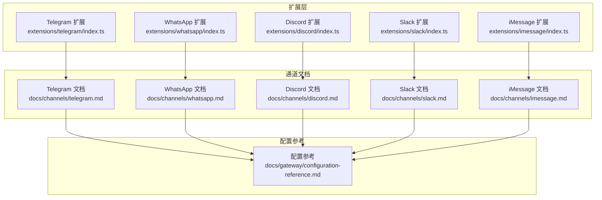
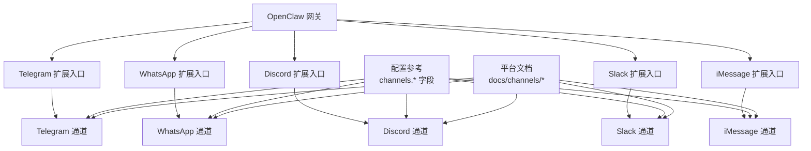
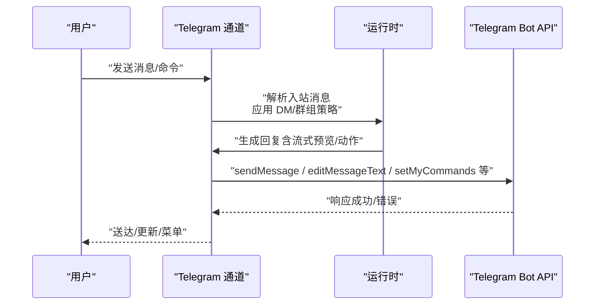
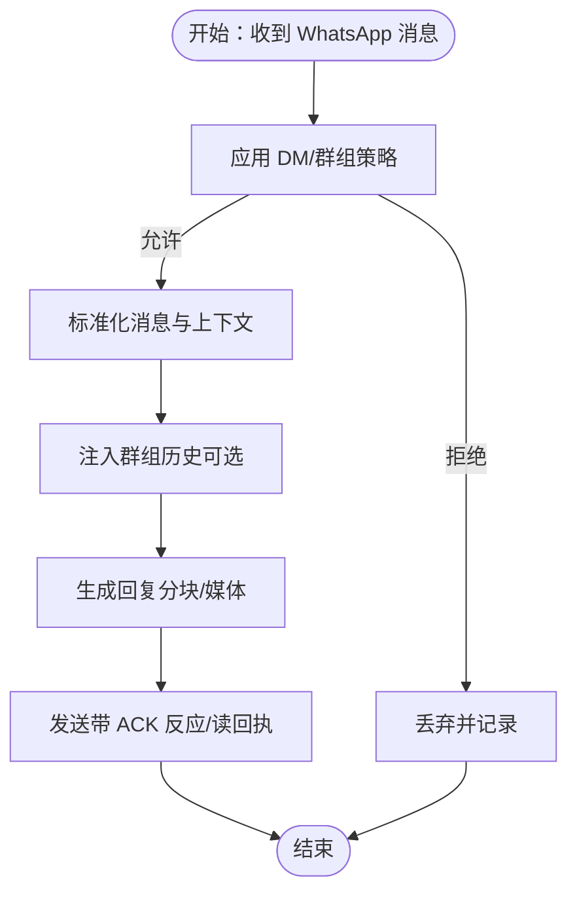
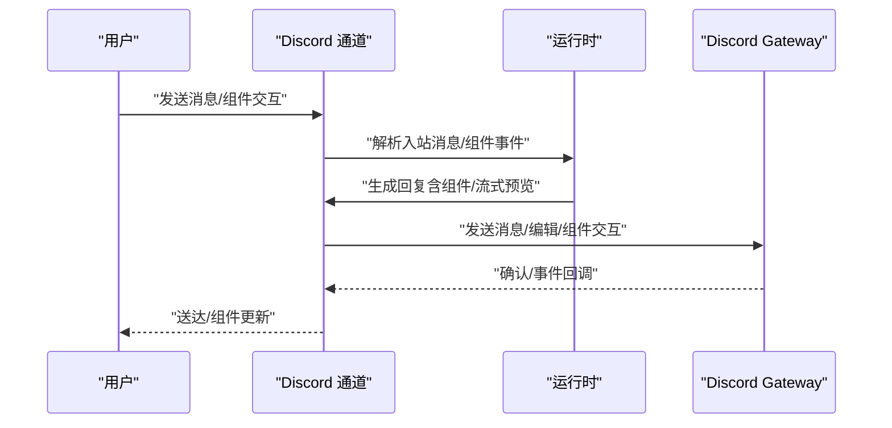
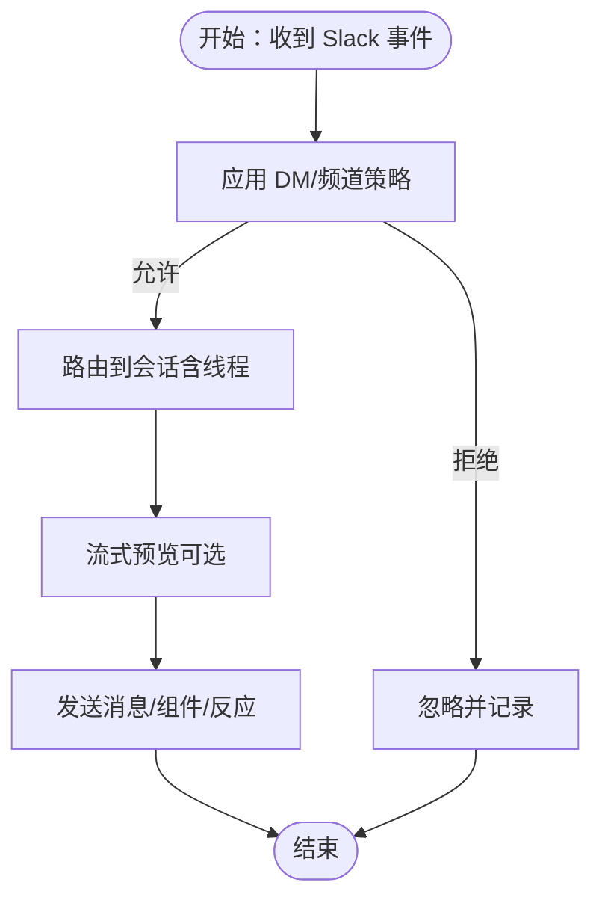
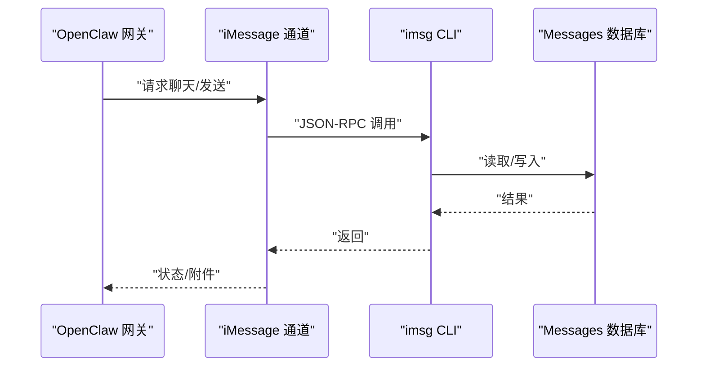
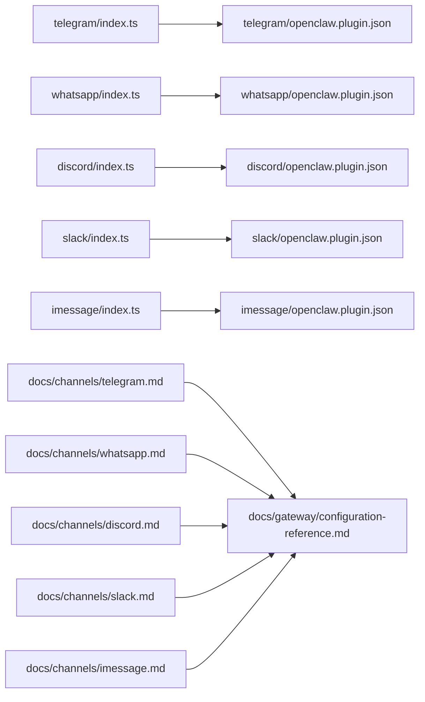

# 主流平台

<cite>
**本文引用的文件**
- [docs/channels/telegram.md](file://docs/channels/telegram.md)
- [docs/channels/whatsapp.md](file://docs/channels/whatsapp.md)
- [docs/channels/discord.md](file://docs/channels/discord.md)
- [docs/channels/slack.md](file://docs/channels/slack.md)
- [docs/channels/imessage.md](file://docs/channels/imessage.md)
- [extensions/telegram/index.ts](file://extensions/telegram/index.ts)
- [extensions/whatsapp/index.ts](file://extensions/whatsapp/index.ts)
- [extensions/discord/index.ts](file://extensions/discord/index.ts)
- [extensions/slack/index.ts](file://extensions/slack/index.ts)
- [extensions/imessage/index.ts](file://extensions/imessage/index.ts)
- [extensions/telegram/openclaw.plugin.json](file://extensions/telegram/openclaw.plugin.json)
- [extensions/whatsapp/openclaw.plugin.json](file://extensions/whatsapp/openclaw.plugin.json)
- [extensions/discord/openclaw.plugin.json](file://extensions/discord/openclaw.plugin.json)
- [extensions/slack/openclaw.plugin.json](file://extensions/slack/openclaw.plugin.json)
- [extensions/imessage/openclaw.plugin.json](file://extensions/imessage/openclaw.plugin.json)
- [docs/gateway/configuration-reference.md](file://docs/gateway/configuration-reference.md)
- [docs/channels/index.md](file://docs/channels/index.md)
</cite>

## 目录
1. [简介](#简介)
2. [项目结构](#项目结构)
3. [核心组件](#核心组件)
4. [架构总览](#架构总览)
5. [详细组件分析](#详细组件分析)
6. [依赖关系分析](#依赖关系分析)
7. [性能考虑](#性能考虑)
8. [故障排查指南](#故障排查指南)
9. [结论](#结论)
10. [附录](#附录)

## 简介
本章节面向在 OpenClaw 上集成主流即时通讯平台（Telegram、WhatsApp、Discord、Slack、iMessage）的用户与工程师，系统性说明各平台的接入方式、认证配置、部署要点、运行特性、功能边界与最佳实践，并提供平台对比与迁移建议。文档以仓库内官方文档与插件注册入口为依据，确保内容可追溯、可落地。

## 项目结构
OpenClaw 将“通道”抽象为插件化模块，每个平台通过独立扩展包注册到网关。核心结构包括：
- 平台文档：位于 docs/channels 下，覆盖各平台的快速设置、访问控制、特性与排错。
- 插件入口：位于 extensions/<platform>/index.ts，负责注册通道与运行时。
- 插件清单：extensions/<platform>/openclaw.plugin.json，声明通道能力与配置模式。
- 配置参考：docs/gateway/configuration-reference.md，提供通道级字段、默认值与兼容性说明。

图表来源
- [extensions/telegram/index.ts](file://extensions/telegram/index.ts#L1-L18)
- [extensions/whatsapp/index.ts](file://extensions/whatsapp/index.ts#L1-L18)
- [extensions/discord/index.ts](file://extensions/discord/index.ts#L1-L20)
- [extensions/slack/index.ts](file://extensions/slack/index.ts#L1-L18)
- [extensions/imessage/index.ts](file://extensions/imessage/index.ts#L1-L18)
- [docs/channels/telegram.md](file://docs/channels/telegram.md#L1-L948)
- [docs/channels/whatsapp.md](file://docs/channels/whatsapp.md#L1-L446)
- [docs/channels/discord.md](file://docs/channels/discord.md#L1-L1223)
- [docs/channels/slack.md](file://docs/channels/slack.md#L1-L555)
- [docs/channels/imessage.md](file://docs/channels/imessage.md#L1-L368)
- [docs/gateway/configuration-reference.md](file://docs/gateway/configuration-reference.md#L1-L2982)

章节来源
- [docs/channels/index.md](file://docs/channels/index.md#L1-L48)
- [docs/gateway/configuration-reference.md](file://docs/gateway/configuration-reference.md#L1-L2982)

## 核心组件
- 通道插件注册：各平台通过扩展入口调用 setXxxRuntime 并注册通道插件，完成运行时注入与通道暴露。
- 通道能力清单：openclaw.plugin.json 声明通道 ID 与支持的通道类型，供网关识别与加载。
- 通道文档：提供平台特有的配置项、行为差异、限制与排错指引。

章节来源
- [extensions/telegram/index.ts](file://extensions/telegram/index.ts#L1-L18)
- [extensions/whatsapp/index.ts](file://extensions/whatsapp/index.ts#L1-L18)
- [extensions/discord/index.ts](file://extensions/discord/index.ts#L1-L20)
- [extensions/slack/index.ts](file://extensions/slack/index.ts#L1-L18)
- [extensions/imessage/index.ts](file://extensions/imessage/index.ts#L1-L18)
- [extensions/telegram/openclaw.plugin.json](file://extensions/telegram/openclaw.plugin.json#L1-L10)
- [extensions/whatsapp/openclaw.plugin.json](file://extensions/whatsapp/openclaw.plugin.json#L1-L10)
- [extensions/discord/openclaw.plugin.json](file://extensions/discord/openclaw.plugin.json#L1-L10)
- [extensions/slack/openclaw.plugin.json](file://extensions/slack/openclaw.plugin.json#L1-L10)
- [extensions/imessage/openclaw.plugin.json](file://extensions/imessage/openclaw.plugin.json#L1-L10)

## 架构总览
下图展示 OpenClaw 网关如何通过扩展加载各通道，并在运行期按通道策略路由消息、执行动作与处理事件。

图表来源
- [extensions/telegram/index.ts](file://extensions/telegram/index.ts#L1-L18)
- [extensions/whatsapp/index.ts](file://extensions/whatsapp/index.ts#L1-L18)
- [extensions/discord/index.ts](file://extensions/discord/index.ts#L1-L20)
- [extensions/slack/index.ts](file://extensions/slack/index.ts#L1-L18)
- [extensions/imessage/index.ts](file://extensions/imessage/index.ts#L1-L18)
- [docs/gateway/configuration-reference.md](file://docs/gateway/configuration-reference.md#L1-L2982)
- [docs/channels/telegram.md](file://docs/channels/telegram.md#L1-L948)
- [docs/channels/whatsapp.md](file://docs/channels/whatsapp.md#L1-L446)
- [docs/channels/discord.md](file://docs/channels/discord.md#L1-L1223)
- [docs/channels/slack.md](file://docs/channels/slack.md#L1-L555)
- [docs/channels/imessage.md](file://docs/channels/imessage.md#L1-L368)

## 详细组件分析

### Telegram 组件分析
- 认证与部署
  - 使用 BotFather 获取 botToken；支持环境变量回退（仅默认账户）。
  - 默认长轮询；可选 Webhook 模式（需配置 webhookUrl、webhookSecret、可选 host/port/path）。
- 访问控制
  - DM 策略：pairing（默认）、allowlist、open、disabled。
  - 群组策略：groupPolicy 支持 open/allowlist/disabled；支持 per-group 允许列表与 per-topic 覆盖。
  - 提及行为：requireMention 默认开启；可通过 mentionPatterns 与会话级命令调整。
- 运行特性
  - 会话隔离：按 chatId 或 forum topic 分离；DM 支持 message_thread_id。
  - 流式预览：partial/block/progress（映射至 partial），文本优先；复杂媒体回退为最终发送并清理预览。
  - 原生命令：setMyCommands 注册菜单；自定义命令受规则约束。
  - 内联按钮：capabilities.inlineButtons 支持 off/dm/group/all/allowlist。
  - 动作工具：sendMessage/react/deleteMessage/editMessage/createForumTopic 等。
  - 反应通知：reactionNotifications/reactionLevel 控制范围与粒度。
  - 配置写入：默认启用，支持群迁移与 /config set/unset。
- 限制与 CLI
  - textChunkLimit、chunkMode、mediaMaxMb、timeoutSeconds、历史限制、重试策略。
  - CLI 发送目标支持数字 ID 或用户名；poll 支持论坛主题。
- 最佳实践
  - 生产环境优先长轮询；公网场景使用 Webhook 时务必配置 webhookSecret 并前置反向代理。
  - 群组可见性：若需全量消息，关闭隐私模式或提升为管理员。
  - 安全：dmPolicy 优先 allowlist；群组 sender 授权不继承 DM pairing-store。

图表来源
- [docs/channels/telegram.md](file://docs/channels/telegram.md#L1-L948)
- [extensions/telegram/index.ts](file://extensions/telegram/index.ts#L1-L18)

章节来源
- [docs/channels/telegram.md](file://docs/channels/telegram.md#L1-L948)
- [extensions/telegram/index.ts](file://extensions/telegram/index.ts#L1-L18)
- [extensions/telegram/openclaw.plugin.json](file://extensions/telegram/openclaw.plugin.json#L1-L10)

### WhatsApp 组件分析
- 认证与部署
  - 通过 QR 登录链接设备；支持多账户；凭据存储于 ~/.openclaw/credentials/whatsapp/<id>/creds.json。
  - 建议专用号码；个人号模式支持 self-chat 保护。
- 访问控制
  - DM：pairing（默认）、allowlist、open、disabled。
  - 群组：groupPolicy + groupAllowFrom；支持 per-group 与 per-topic 配置。
  - 提及：默认 requireMention；支持正则与回复引用检测。
- 运行特性
  - 会话隔离：DM 使用 session.dmScope；群组按 jid 隔离。
  - 自读回执：默认开启；self-chat 跳过。
  - 历史注入：群组未触发消息缓冲注入上下文。
  - 媒体：图片/视频/音频/文档；voice-note 兼容；GIF 播放；自动优化尺寸。
  - ACK 反应：channels.whatsapp.ackReaction 支持直接/提及场景。
- 限制与 CLI
  - textChunkLimit、chunkMode、mediaMaxMb；历史限制；无活动监听时发送失败。
- 最佳实践
  - 生产环境使用 Node；避免 Bun；保持稳定网络与重连策略。
  - 多账户隔离凭据目录；必要时禁用全局读回执以减少干扰。

图表来源
- [docs/channels/whatsapp.md](file://docs/channels/whatsapp.md#L1-L446)

章节来源
- [docs/channels/whatsapp.md](file://docs/channels/whatsapp.md#L1-L446)
- [extensions/whatsapp/index.ts](file://extensions/whatsapp/index.ts#L1-L18)
- [extensions/whatsapp/openclaw.plugin.json](file://extensions/whatsapp/openclaw.plugin.json#L1-L10)

### Discord 组件分析
- 认证与部署
  - 在 Discord 开发者门户创建应用与 Bot，启用 Message Content Intent 与 Server Members Intent。
  - 通过邀请 URL 添加机器人到服务器；支持 DM pairing。
- 访问控制
  - DM：pairing（默认）、allowlist、open、disabled。
  - 群组：guilds.allowlist；per-channel users/roles；支持名称匹配（谨慎启用）。
  - 提及：默认 requireMention；支持正则与回复引用。
- 运行特性
  - 会话隔离：DM 使用 main 会话或指定 agent；频道按 channelId 隔离。
  - 论坛线程：支持自动创建线程与显式创建；父频道不接受组件。
  - 交互组件：支持 actions/media-gallery/file/modal；可限制点击用户与复用。
  - 命令：原生 slash 命令；ephemeral 默认开启；模型选择器交互。
  - 回复标签：支持 [[reply_to_current]]/[[reply_to:<id>]]；replyToMode 控制隐式回复。
  - 流式预览：partial/block；preview 仅文本；媒体回退正常发送。
  - 线程绑定：支持线程到子代理/ACP 的持久绑定与自动聚焦。
  - 反应通知：per-guild 模式 own/all/allowlist。
- 限制与 CLI
  - historyLimit、dmHistoryLimit、thread 行为、draftChunk（block 模式）。
- 最佳实践
  - 私有服务器推荐关闭 requireMention；生产环境严格角色/用户白名单。
  - 使用线程绑定实现“常驻”工作空间；注意线程生命周期与自动解绑。

图表来源
- [docs/channels/discord.md](file://docs/channels/discord.md#L1-L1223)

章节来源
- [docs/channels/discord.md](file://docs/channels/discord.md#L1-L1223)
- [extensions/discord/index.ts](file://extensions/discord/index.ts#L1-L20)
- [extensions/discord/openclaw.plugin.json](file://extensions/discord/openclaw.plugin.json#L1-L10)

### Slack 组件分析
- 认证与部署
  - Socket Mode（默认）：需要 appToken（xapp-...）+ botToken（xoxb-...）。
  - HTTP Events API：需要 botToken + signingSecret；配置 Request URL。
- 访问控制
  - DM：pairing（默认）、allowlist、open、disabled；支持 group DM。
  - 频道：groupPolicy + channels.allowlist；per-channel users/allowBots/skills/systemPrompt。
  - 提及：默认 requireMention；支持正则与回复引用。
- 运行特性
  - 会话隔离：DM direct；频道 channel；MPIM group；线程按 threadTs 后缀。
  - 命令：原生命令默认关闭；可启用单个 slashCommand 或全局 native。
  - 交互：block kit 与 modal；长选项菜单自适应渲染策略。
  - 流式预览：partial/block；支持 nativeStreaming（chat.startStream/append/stop）。
  - 媒体：inbound 文件下载与大小限制；outbound 上传与 thread_ts。
  - ACK/打字：ackReaction（shortcode）与 typingReaction（临时反应）。
- 限制与 CLI
  - textChunkLimit、chunkMode、mediaMaxMb；replyToMode/byChatType；actions.* 网关。
- 最佳实践
  - Socket Mode 更稳定；HTTP 模式需唯一 webhookPath 且校验签名。
  - 为写操作保留 botToken；用户 token 仅在只读场景使用。

图表来源
- [docs/channels/slack.md](file://docs/channels/slack.md#L1-L555)

章节来源
- [docs/channels/slack.md](file://docs/channels/slack.md#L1-L555)
- [extensions/slack/index.ts](file://extensions/slack/index.ts#L1-L18)
- [extensions/slack/openclaw.plugin.json](file://extensions/slack/openclaw.plugin.json#L1-L10)

### iMessage 组件分析（已标记为遗留）
- 认证与部署
  - 通过 imsg CLI 与 JSON-RPC stdio 通信；推荐 BlueBubbles 新路径。
  - 支持本地 Mac 与 SSH 远程 Mac；附件根目录可配置。
- 访问控制
  - DM：pairing（默认）、allowlist、open、disabled。
  - 群组：groupPolicy；sender 允许列表；regex 提及检测。
- 运行特性
  - 会话隔离：DM 直接路由；群组按 chat_id 隔离；部分多人群组可按配置视为群组。
  - 媒体：可选下载；SCP 远程附件；严格主机密钥检查。
- 限制与 CLI
  - includeAttachments、mediaMaxMb、textChunkLimit/chunkMode；地址格式支持 chat_id/chat_guid/chat_identifier/handle。
- 最佳实践
  - 新部署请使用 BlueBubbles；遗留 imsg 未来可能移除。
  - 为自动化与磁盘访问授予必要权限；SSH/SCP 需预先信任主机。

图表来源
- [docs/channels/imessage.md](file://docs/channels/imessage.md#L1-L368)

章节来源
- [docs/channels/imessage.md](file://docs/channels/imessage.md#L1-L368)
- [extensions/imessage/index.ts](file://extensions/imessage/index.ts#L1-L18)
- [extensions/imessage/openclaw.plugin.json](file://extensions/imessage/openclaw.plugin.json#L1-L10)

## 依赖关系分析
- 插件注册依赖：各扩展入口统一调用 setXxxRuntime 并注册通道插件，形成“扩展 → 通道 → 网关”的依赖链。
- 配置耦合：通道行为由 channels.* 字段驱动，跨平台共享 DM/群组策略、历史与限流等通用语义。
- 文档耦合：各平台文档与配置参考相互引用，保证一致性与可追溯性。

图表来源
- [extensions/telegram/index.ts](file://extensions/telegram/index.ts#L1-L18)
- [extensions/whatsapp/index.ts](file://extensions/whatsapp/index.ts#L1-L18)
- [extensions/discord/index.ts](file://extensions/discord/index.ts#L1-L20)
- [extensions/slack/index.ts](file://extensions/slack/index.ts#L1-L18)
- [extensions/imessage/index.ts](file://extensions/imessage/index.ts#L1-L18)
- [extensions/telegram/openclaw.plugin.json](file://extensions/telegram/openclaw.plugin.json#L1-L10)
- [extensions/whatsapp/openclaw.plugin.json](file://extensions/whatsapp/openclaw.plugin.json#L1-L10)
- [extensions/discord/openclaw.plugin.json](file://extensions/discord/openclaw.plugin.json#L1-L10)
- [extensions/slack/openclaw.plugin.json](file://extensions/slack/openclaw.plugin.json#L1-L10)
- [extensions/imessage/openclaw.plugin.json](file://extensions/imessage/openclaw.plugin.json#L1-L10)
- [docs/channels/telegram.md](file://docs/channels/telegram.md#L1-L948)
- [docs/channels/whatsapp.md](file://docs/channels/whatsapp.md#L1-L446)
- [docs/channels/discord.md](file://docs/channels/discord.md#L1-L1223)
- [docs/channels/slack.md](file://docs/channels/slack.md#L1-L555)
- [docs/channels/imessage.md](file://docs/channels/imessage.md#L1-L368)
- [docs/gateway/configuration-reference.md](file://docs/gateway/configuration-reference.md#L1-L2982)

章节来源
- [docs/gateway/configuration-reference.md](file://docs/gateway/configuration-reference.md#L1-L2982)
- [docs/channels/index.md](file://docs/channels/index.md#L1-L48)

## 性能考虑
- 传输与并发
  - Telegram：长轮询基于 grammY Runner，整体并发受 agents.defaults.maxConcurrent 控制。
  - Slack：Socket Mode 低延迟；HTTP 模式需关注签名验证与并发处理。
  - Discord：组件与流式预览对带宽与 CPU 有额外开销，建议按需启用。
  - WhatsApp：Baileys Web 依赖网络稳定性；合理设置重连与心跳。
- 媒体与限速
  - 各平台均提供 mediaMaxMb/textChunkLimit/chunkMode；建议结合带宽与模型输出长度调优。
- 事件与回执
  - Slack 的 assistant:write 与 Discord 的 reaction/typing 更新需权限与正确配置，避免失败重试放大延迟。

## 故障排查指南
- Telegram
  - Bot 不响应非提及群消息：检查 requireMention 与隐私模式；必要时关闭隐私或提升管理员。
  - Webhook 无法接收：核对 webhookUrl/webhookSecret/webhookPath/host/port。
- WhatsApp
  - 未链接/断线循环：doctor 诊断；必要时重新登录。
  - 无活动监听：确保网关运行且账户已链接。
- Discord
  - 无回复：检查 groupPolicy、channels.allowlist、requireMention、users/roles。
  - Socket/HTTP 模式：核对 intents、权限与 Request URL。
- Slack
  - 无回复/命令无效：核对 groupPolicy、channels.allowlist、requireMention、commands.native/slashCommand。
  - Socket/HTTP 模式：校验 appToken/botToken/signingSecret/webhookPath。
- iMessage（遗留）
  - imsg RPC 不支持：升级 imsg；核对权限与路径。
  - 远程附件失败：检查 remoteHost/known_hosts/远程路径可读性。

章节来源
- [docs/channels/telegram.md](file://docs/channels/telegram.md#L793-L948)
- [docs/channels/whatsapp.md](file://docs/channels/whatsapp.md#L374-L446)
- [docs/channels/discord.md](file://docs/channels/discord.md#L433-L800)
- [docs/channels/slack.md](file://docs/channels/slack.md#L433-L555)
- [docs/channels/imessage.md](file://docs/channels/imessage.md#L304-L368)

## 结论
- Telegram 适合快速上手与群组管理；WhatsApp 适合移动端生态但需 QR 登录与状态管理；Discord 适合社区与协作；Slack 适合企业工作区；iMessage 遗留方案建议迁移到 BlueBubbles。
- 配置参考与平台文档是部署与运维的关键；遵循 DM/群组策略、流式预览与媒体限速的最佳实践可显著提升稳定性与体验。

## 附录
- 平台对比与迁移建议
  - 快速上手：Telegram（最简）→ Discord（社区）→ Slack（企业）→ WhatsApp（移动）→ iMessage（遗留，建议 BlueBubbles）。
  - 群组管理：Telegram（论坛主题/话题）、Discord（论坛/线程）、Slack（线程）、WhatsApp（群组）。
  - 媒体支持：Telegram（图片/视频/音频/贴纸/投票）、Discord（组件/媒体/模态）、Slack（上传/线程）、WhatsApp（多格式）、iMessage（附件/SCP）。
  - 反应与交互：Telegram（反应/内联按钮/命令）、Discord（组件/反应/模型选择器）、Slack（反应/块组件/模态）、WhatsApp（反应）、iMessage（受限）。
  - 迁移路径：从遗留 iMessage 迁移至 BlueBubbles；WhatsApp 与 Telegram 可并行运行；Discord/Slack 依组织策略选择。

章节来源
- [docs/channels/index.md](file://docs/channels/index.md#L1-L48)
- [docs/channels/telegram.md](file://docs/channels/telegram.md#L1-L948)
- [docs/channels/whatsapp.md](file://docs/channels/whatsapp.md#L1-L446)
- [docs/channels/discord.md](file://docs/channels/discord.md#L1-L1223)
- [docs/channels/slack.md](file://docs/channels/slack.md#L1-L555)
- [docs/channels/imessage.md](file://docs/channels/imessage.md#L1-L368)