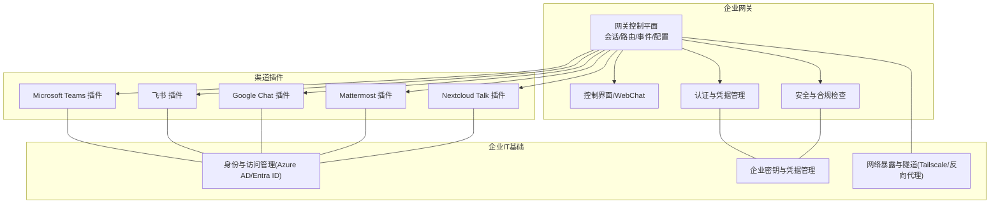
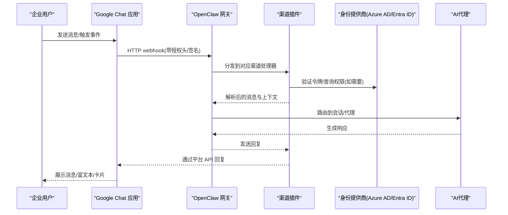
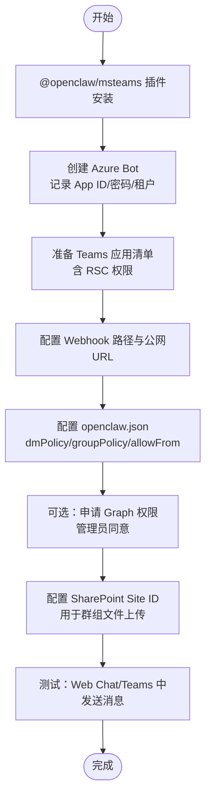
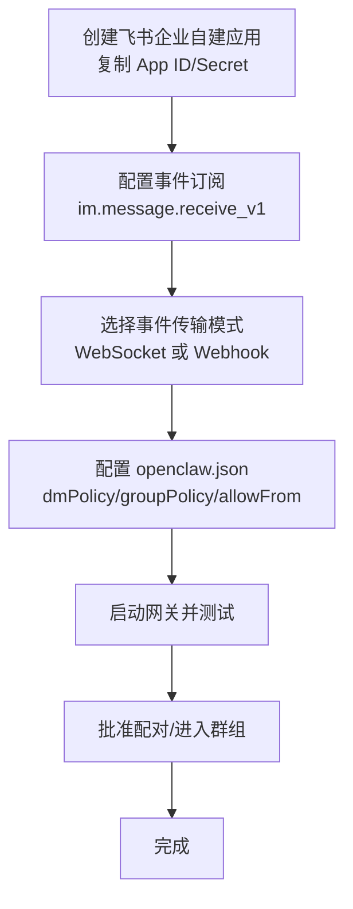
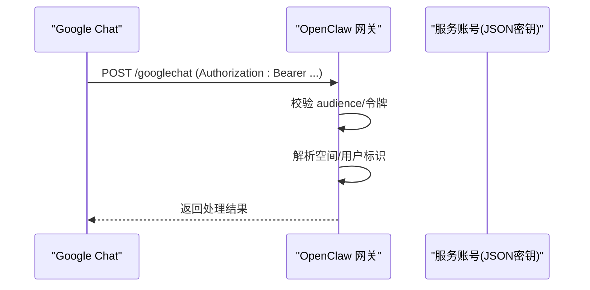
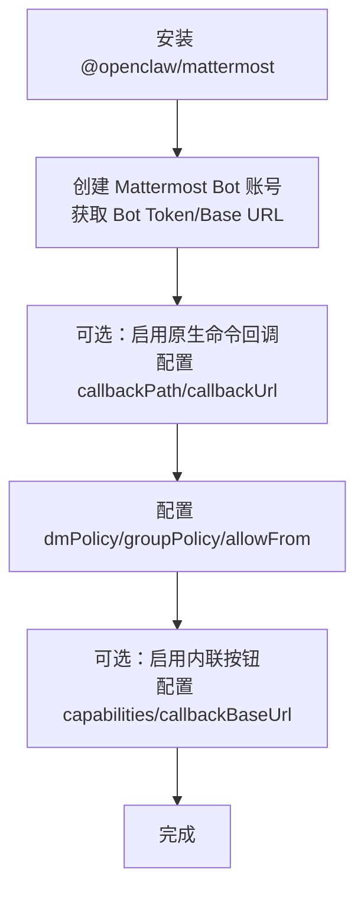
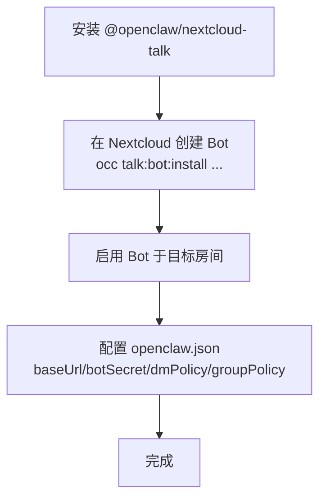
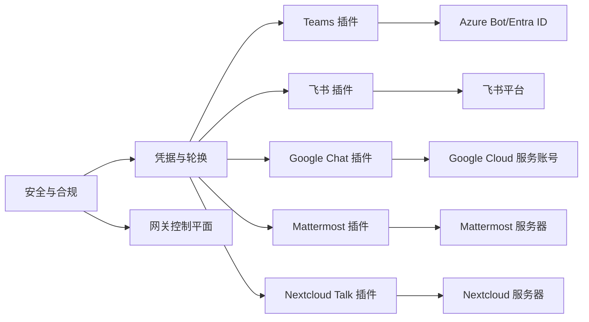

# 企业平台

<cite>
**本文引用的文件**
- [README.md](file://README.md)
- [docs/index.md](file://docs/index.md)
- [docs/channels/index.md](file://docs/channels/index.md)
- [docs/channels/msteams.md](file://docs/channels/msteams.md)
- [docs/channels/feishu.md](file://docs/channels/feishu.md)
- [docs/channels/googlechat.md](file://docs/channels/googlechat.md)
- [docs/channels/mattermost.md](file://docs/channels/mattermost.md)
- [docs/channels/nextcloud-talk.md](file://docs/channels/nextcloud-talk.md)
- [docs/gateway/authentication.md](file://docs/gateway/authentication.md)
- [docs/gateway/configuration.md](file://docs/gateway/configuration.md)
- [docs/security/README.md](file://docs/security/README.md)
- [SECURITY.md](file://SECURITY.md)
</cite>

## 目录
1. [简介](#简介)
2. [项目结构](#项目结构)
3. [核心组件](#核心组件)
4. [架构总览](#架构总览)
5. [详细组件分析](#详细组件分析)
6. [依赖关系分析](#依赖关系分析)
7. [性能考量](#性能考量)
8. [故障排查指南](#故障排查指南)
9. [结论](#结论)
10. [附录](#附录)

## 简介
本指南面向企业级即时通讯平台集成，聚焦在 OpenClaw 的多通道网关能力之上，系统性阐述如何将企业常用平台（Microsoft Teams、飞书、Google Chat、Mattermost、Nextcloud Talk）接入 OpenClaw，并配套企业环境下的认证机制、权限管理与合规要求、大规模部署最佳实践、安全配置与监控策略，以及与现有企业 IT 基础设施的对接与 API 限制处理方案。

OpenClaw 提供统一的网关控制平面，支持跨平台消息通道、会话路由、工具调用与自动化，适合在企业内部署以实现“个人 AI 助手”式的本地化、可审计、可隔离的智能体服务。

## 项目结构
OpenClaw 采用“网关 + 插件 + 渠道”的分层架构：  
- 网关负责会话、路由、事件与控制面；  
- 渠道通过插件扩展，覆盖主流 IM 平台；  
- 安全与信任体系贯穿配置、认证与运行时。

图示来源
- [docs/index.md](file://docs/index.md#L59-L71)
- [docs/channels/index.md](file://docs/channels/index.md#L14-L47)

章节来源
- [README.md](file://README.md#L21-L29)
- [docs/index.md](file://docs/index.md#L59-L71)
- [docs/channels/index.md](file://docs/channels/index.md#L14-L47)

## 核心组件
- 网关控制平面：统一的 WebSocket 控制面，承载会话、路由、工具与事件；提供 CLI、控制 UI 与远程访问能力。
- 渠道插件：各平台专用插件，负责认证、事件订阅/接收、消息发送与媒体处理。
- 认证与凭据：支持 API Key、OAuth、SecretRef 等多种凭据形式与轮换策略。
- 安全与合规：默认最小权限、沙箱隔离、文件权限审计、可信边界与漏洞上报流程。

章节来源
- [docs/index.md](file://docs/index.md#L59-L71)
- [docs/gateway/configuration.md](file://docs/gateway/configuration.md#L10-L24)
- [docs/gateway/authentication.md](file://docs/gateway/authentication.md#L9-L26)
- [docs/security/README.md](file://docs/security/README.md#L1-L18)

## 架构总览
下图展示 OpenClaw 在企业环境中的典型部署形态：  
- 网关运行于受控服务器或容器中；  
- 通过 Tailscale 或反向代理对外暴露必要的 webhook 路径；  
- 各渠道插件按需启用，使用平台提供的应用/机器人凭据；  
- 会话与工具调用在安全边界内执行，支持多代理隔离与按需沙箱。

图示来源
- [docs/channels/googlechat.md](file://docs/channels/googlechat.md#L139-L153)
- [docs/channels/msteams.md](file://docs/channels/msteams.md#L142-L150)

章节来源
- [docs/channels/googlechat.md](file://docs/channels/googlechat.md#L139-L153)
- [docs/channels/msteams.md](file://docs/channels/msteams.md#L142-L150)

## 详细组件分析

### Microsoft Teams 集成
- 插件化：Teams 作为独立插件安装与启用，便于版本解耦与依赖更新。
- 凭据与暴露：Azure Bot（App ID/密码/租户）、Webhook 路径与公网 URL；本地开发可用 ngrok 或 Tailscale Funnel。
- 权限与能力：基于资源特定权限（RSC）实现实时消息；若需历史消息与文件下载，需 Graph API 应用权限并完成管理员同意。
- 访问控制：DM 默认配对策略；群组默认白名单且需 @ 提及；支持按团队/频道粒度覆盖。
- 文件发送：个人 DM 使用 FileConsentCard；群组/频道需 SharePoint Site ID 与 Graph 权限。
- 适配卡片与投票：通过 Adaptive Cards 发送任意卡片；投票以卡片形式实现。
- 故障排查：图标为空、权限未生效、版本不一致、401 等常见问题定位与修复步骤。

图示来源
- [docs/channels/msteams.md](file://docs/channels/msteams.md#L24-L63)
- [docs/channels/msteams.md](file://docs/channels/msteams.md#L151-L193)
- [docs/channels/msteams.md](file://docs/channels/msteams.md#L293-L359)
- [docs/channels/msteams.md](file://docs/channels/msteams.md#L417-L428)
- [docs/channels/msteams.md](file://docs/channels/msteams.md#L531-L597)

章节来源
- [docs/channels/msteams.md](file://docs/channels/msteams.md#L14-L63)
- [docs/channels/msteams.md](file://docs/channels/msteams.md#L151-L193)
- [docs/channels/msteams.md](file://docs/channels/msteams.md#L293-L359)
- [docs/channels/msteams.md](file://docs/channels/msteams.md#L417-L428)
- [docs/channels/msteams.md](file://docs/channels/msteams.md#L531-L597)
- [docs/channels/msteams.md](file://docs/channels/msteams.md#L696-L700)
- [docs/channels/msteams.md](file://docs/channels/msteams.md#L745-L760)

### 飞书（Lark）集成
- 插件：当前版本已内置，无需单独安装。
- 两种事件传输：WebSocket（推荐，无需公网 URL）与 Webhook（需验证令牌）。
- 凭据：App ID 与 App Secret；可在配置或环境变量中设置。
- 访问控制：DM 默认配对策略；群组默认开放但可要求 @ 提及；支持按群组细粒度允许列表与发送者白名单。
- 多账号与流式输出：支持多账号、消息分片与卡片流式输出。
- 常见问题：应用未发布/审批、事件订阅未启用长连接、权限缺失、消息发送失败等。

图示来源
- [docs/channels/feishu.md](file://docs/channels/feishu.md#L70-L161)
- [docs/channels/feishu.md](file://docs/channels/feishu.md#L164-L262)
- [docs/channels/feishu.md](file://docs/channels/feishu.md#L299-L326)

章节来源
- [docs/channels/feishu.md](file://docs/channels/feishu.md#L15-L67)
- [docs/channels/feishu.md](file://docs/channels/feishu.md#L70-L161)
- [docs/channels/feishu.md](file://docs/channels/feishu.md#L164-L262)
- [docs/channels/feishu.md](file://docs/channels/feishu.md#L299-L326)
- [docs/channels/feishu.md](file://docs/channels/feishu.md#L450-L480)

### Google Chat 集成
- 服务账号：创建 Google Cloud 项目与服务账号，下载 JSON 密钥；配置应用与触发器。
- 公网暴露：仅暴露 /googlechat 路径，建议使用 Tailscale Serve/Funnel 或反向代理；避免将网关根路径暴露到公网。
- 认证：请求携带 Bearer Token，网关按 audience 类型与值进行校验；支持按空间/用户标识进行路由与配对。
- 访问控制：DM 默认配对；群组默认需要 @ 提及；支持 per-space 与 per-user 细粒度策略。
- 媒体与反应：支持附件下载与大小限制；反应工具可启用。

图示来源
- [docs/channels/googlechat.md](file://docs/channels/googlechat.md#L139-L153)
- [docs/channels/googlechat.md](file://docs/channels/googlechat.md#L64-L118)

章节来源
- [docs/channels/googlechat.md](file://docs/channels/googlechat.md#L12-L51)
- [docs/channels/googlechat.md](file://docs/channels/googlechat.md#L64-L118)
- [docs/channels/googlechat.md](file://docs/channels/googlechat.md#L139-L153)
- [docs/channels/googlechat.md](file://docs/channels/googlechat.md#L154-L207)
- [docs/channels/googlechat.md](file://docs/channels/googlechat.md#L209-L256)

### Mattermost 集成
- 插件：独立插件安装，支持 Bot Token + WebSocket 事件。
- 原生斜杠命令：可选注册与回调，回调端点可达性需满足 Mattermost 出站策略。
- 访问控制：DM 默认配对；群组默认白名单且需 @ 提及；支持 per-channel 与 per-user 允许列表。
- 交互按钮：支持内联按钮与回调校验（HMAC-SHA256），回调 URL 可配置；注意 Mattermost 对 action id 的限制。
- 多账号：支持多账户配置与回调基地址覆盖。

图示来源
- [docs/channels/mattermost.md](file://docs/channels/mattermost.md#L15-L41)
- [docs/channels/mattermost.md](file://docs/channels/mattermost.md#L58-L96)
- [docs/channels/mattermost.md](file://docs/channels/mattermost.md#L132-L147)
- [docs/channels/mattermost.md](file://docs/channels/mattermost.md#L178-L235)

章节来源
- [docs/channels/mattermost.md](file://docs/channels/mattermost.md#L15-L41)
- [docs/channels/mattermost.md](file://docs/channels/mattermost.md#L58-L96)
- [docs/channels/mattermost.md](file://docs/channels/mattermost.md#L132-L147)
- [docs/channels/mattermost.md](file://docs/channels/mattermost.md#L178-L235)
- [docs/channels/mattermost.md](file://docs/channels/mattermost.md#L351-L363)

### Nextcloud Talk 集成
- 插件：独立插件安装，基于 Webhook Bot。
- 限制：Bot 无法主动发起 DM，需用户先发消息；媒体上传不支持，以 URL 形式发送；Webhook 无法区分 DM 与房间，可通过 API 用户/密码启用房间类型识别。
- 访问控制：DM 默认配对；群组默认白名单且可要求 @ 提及；支持 per-room 允许列表与历史限制。

图示来源
- [docs/channels/nextcloud-talk.md](file://docs/channels/nextcloud-talk.md#L12-L47)
- [docs/channels/nextcloud-talk.md](file://docs/channels/nextcloud-talk.md#L70-L97)

章节来源
- [docs/channels/nextcloud-talk.md](file://docs/channels/nextcloud-talk.md#L12-L47)
- [docs/channels/nextcloud-talk.md](file://docs/channels/nextcloud-talk.md#L70-L97)
- [docs/channels/nextcloud-talk.md](file://docs/channels/nextcloud-talk.md#L109-L139)

## 依赖关系分析
- 渠道插件与平台依赖：Teams 依赖 Azure Bot 与 Graph；飞书依赖平台 App 与事件订阅；Google Chat 依赖服务账号与应用配置；Mattermost 依赖 Bot Token 与回调可达性；Nextcloud Talk 依赖服务器 Bot 与 Webhook。
- 认证与凭据：API Key 与 OAuth 双轨；SecretRef 支持从环境、文件或外部执行器加载；模型凭据支持轮换与优先级。
- 安全与合规：文件权限审计、可信边界、漏洞上报与威胁模型文档。

图示来源
- [docs/channels/msteams.md](file://docs/channels/msteams.md#L151-L193)
- [docs/channels/feishu.md](file://docs/channels/feishu.md#L70-L161)
- [docs/channels/googlechat.md](file://docs/channels/googlechat.md#L12-L51)
- [docs/channels/mattermost.md](file://docs/channels/mattermost.md#L15-L41)
- [docs/channels/nextcloud-talk.md](file://docs/channels/nextcloud-talk.md#L12-L47)
- [docs/gateway/authentication.md](file://docs/gateway/authentication.md#L9-L26)

章节来源
- [docs/gateway/authentication.md](file://docs/gateway/authentication.md#L9-L26)
- [docs/gateway/configuration.md](file://docs/gateway/configuration.md#L501-L536)
- [docs/security/README.md](file://docs/security/README.md#L1-L18)
- [SECURITY.md](file://SECURITY.md#L48-L67)

## 性能考量
- 事件处理吞吐：各渠道插件均通过网关统一调度，建议为高并发场景预留 CPU/内存与队列容量。
- 媒体与附件：设置合理的媒体上限与分片策略，避免单次响应过大导致延迟。
- 消息历史：Teams Graph 历史拉取与通道消息历史查询需谨慎使用，避免频繁调用造成速率限制。
- 运维可观测性：结合心跳、钩子与日志聚合，建立端到端链路追踪与告警。

## 故障排查指南
- Teams
  - 图标为空、权限未生效、版本不一致、401 未授权等；确认应用清单字段、权限与管理员同意状态。
  - 文件上传失败：检查 SharePoint Site ID 与 Graph 权限组合。
- 飞书
  - 应用未发布/审批、事件订阅未启用长连接、权限缺失、消息发送失败。
- Google Chat
  - 405 方法不允许：确认通道已配置、插件启用、网关重启；核对 audience 类型与值。
  - 公网暴露路径错误：仅暴露 /googlechat，避免将网关根路径暴露。
- Mattermost
  - 回调不可达：确保 Mattermost 可访问回调 URL，必要时配置 AllowedUntrustedInternalConnections。
  - 按钮点击无效：检查 action id 是否仅含字母数字，以及 HMAC 校验参数是否完整。
- Nextcloud Talk
  - Bot 无法发起 DM：需用户先发消息；媒体以 URL 形式发送；启用 API 用户/密码以区分 DM 与房间。

章节来源
- [docs/channels/msteams.md](file://docs/channels/msteams.md#L745-L760)
- [docs/channels/feishu.md](file://docs/channels/feishu.md#L450-L480)
- [docs/channels/googlechat.md](file://docs/channels/googlechat.md#L209-L256)
- [docs/channels/mattermost.md](file://docs/channels/mattermost.md#L351-L363)
- [docs/channels/nextcloud-talk.md](file://docs/channels/nextcloud-talk.md#L63-L69)

## 结论
通过插件化渠道与统一网关控制平面，OpenClaw 能够在企业环境中安全、可控地接入 Teams、飞书、Google Chat、Mattermost 与 Nextcloud Talk 等平台。结合严格的认证与权限策略、沙箱隔离与合规文档，可满足企业对数据主权、访问控制与审计追溯的要求。建议在生产部署前完成凭据轮换、网络暴露最小化与监控告警的闭环建设。

## 附录

### 企业环境下的认证机制
- API Key：长期稳定、易于轮换，适合网关常驻主机。
- OAuth：订阅类账号支持 setup-token 流程，需关注平台条款与风险。
- SecretRef：从环境、文件或外部执行器动态注入，适合多租户与多机部署。
- 轮换行为：按优先级顺序重试，仅在速率限制错误时切换备用密钥。

章节来源
- [docs/gateway/authentication.md](file://docs/gateway/authentication.md#L21-L57)
- [docs/gateway/authentication.md](file://docs/gateway/authentication.md#L123-L139)
- [docs/gateway/authentication.md](file://docs/gateway/authentication.md#L140-L159)
- [docs/gateway/configuration.md](file://docs/gateway/configuration.md#L501-L536)

### 权限管理与合规要求
- 默认最小权限：DM 配对、群组白名单与 @ 提及默认开启；可按团队/频道细化。
- 文件权限审计：凭证目录与认证文件的读写权限检查，避免世界可写/可读。
- 合规与漏洞上报：遵循信任页与漏洞披露流程，定期审查威胁模型与缓解措施。

章节来源
- [docs/channels/msteams.md](file://docs/channels/msteams.md#L85-L122)
- [docs/channels/feishu.md](file://docs/channels/feishu.md#L299-L326)
- [docs/channels/googlechat.md](file://docs/channels/googlechat.md#L154-L207)
- [src/security/audit-extra.async.ts](file://src/security/audit-extra.async.ts#L983-L1067)
- [docs/security/README.md](file://docs/security/README.md#L10-L18)
- [SECURITY.md](file://SECURITY.md#L48-L67)

### 大规模部署最佳实践
- 网络暴露最小化：仅暴露必要路径（如 /googlechat），其余端口保持私网访问。
- 多实例与负载：网关支持热重载与多代理路由，结合反向代理或 Tailscale 实现高可用。
- 沙箱与隔离：非主会话启用 Docker 沙箱，限制工具集与文件系统访问。
- 监控与告警：心跳、钩子与日志聚合，结合速率限制与异常检测。

章节来源
- [docs/channels/googlechat.md](file://docs/channels/googlechat.md#L64-L118)
- [docs/gateway/configuration.md](file://docs/gateway/configuration.md#L206-L226)
- [docs/gateway/configuration.md](file://docs/gateway/configuration.md#L228-L247)

### 与现有企业 IT 基础设施的集成
- 身份与访问：Teams 使用 Entra ID；飞书/Google Chat 使用平台服务账号；Mattermost 使用 Bot Token；Nextcloud Talk 使用 OCC Bot。
- 网络与隧道：Tailscale Serve/Funnel 与反向代理，确保仅暴露必要端点。
- 凭据与密钥：SecretRef 与环境变量注入，结合企业密钥管理与轮换策略。

章节来源
- [docs/channels/msteams.md](file://docs/channels/msteams.md#L151-L193)
- [docs/channels/feishu.md](file://docs/channels/feishu.md#L164-L262)
- [docs/channels/googlechat.md](file://docs/channels/googlechat.md#L12-L51)
- [docs/channels/mattermost.md](file://docs/channels/mattermost.md#L15-L41)
- [docs/channels/nextcloud-talk.md](file://docs/channels/nextcloud-talk.md#L33-L47)
- [docs/gateway/configuration.md](file://docs/gateway/configuration.md#L501-L536)

### API 限制处理方案
- 速率限制：按优先级轮换备用密钥，仅在速率限制错误时切换。
- 历史与媒体：Teams Graph 需管理员同意与权限；Google Chat 仅在具备权限时下载媒体。
- 回调可达性：Mattermost 需配置出站允许列表与回调可达性，避免按钮点击无效。

章节来源
- [docs/gateway/authentication.md](file://docs/gateway/authentication.md#L123-L139)
- [docs/channels/msteams.md](file://docs/channels/msteams.md#L417-L428)
- [docs/channels/googlechat.md](file://docs/channels/googlechat.md#L197-L205)
- [docs/channels/mattermost.md](file://docs/channels/mattermost.md#L86-L96)
- [docs/channels/mattermost.md](file://docs/channels/mattermost.md#L224-L235)