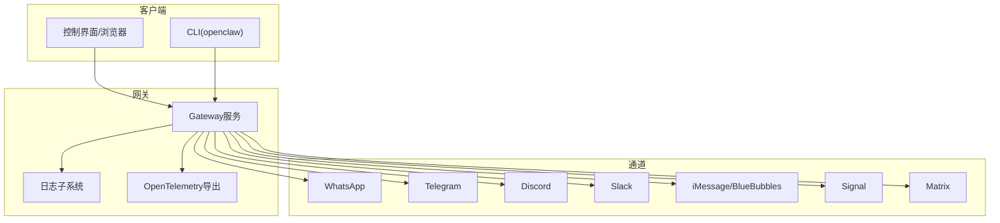
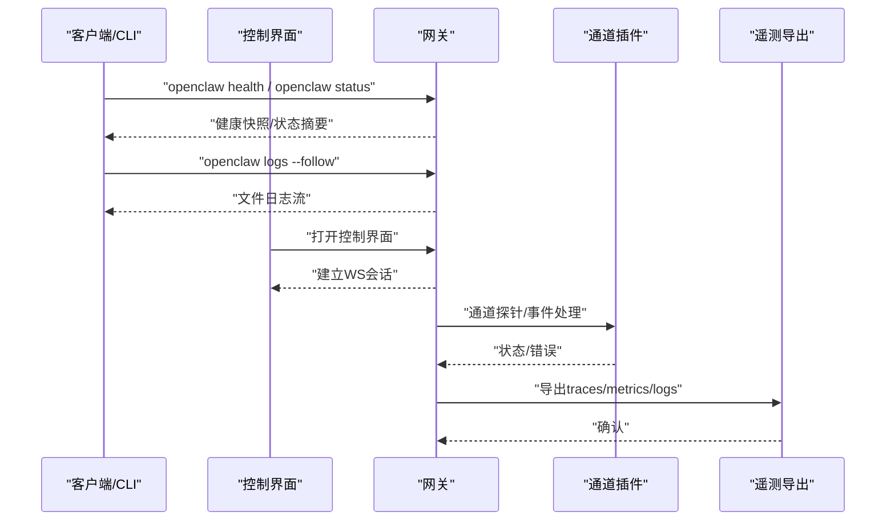
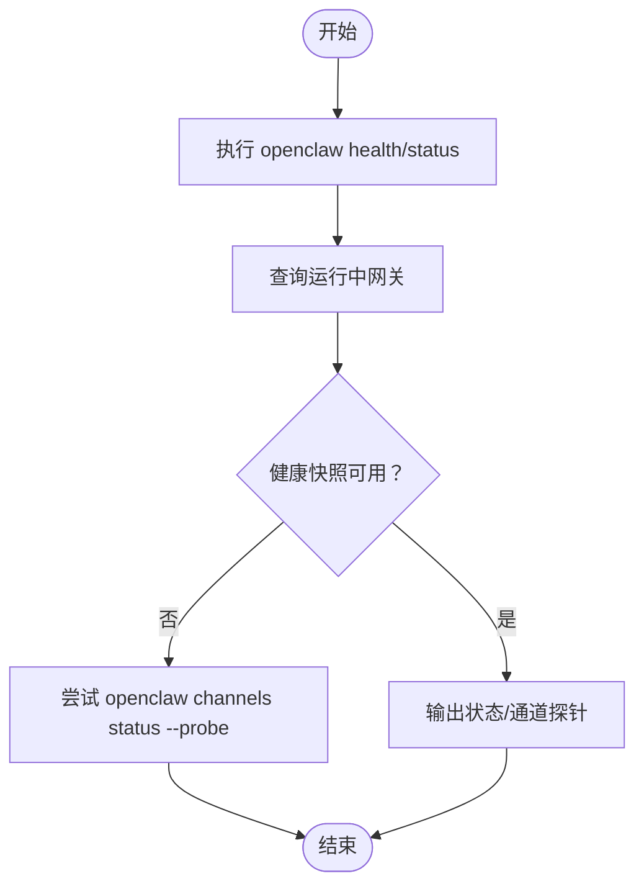
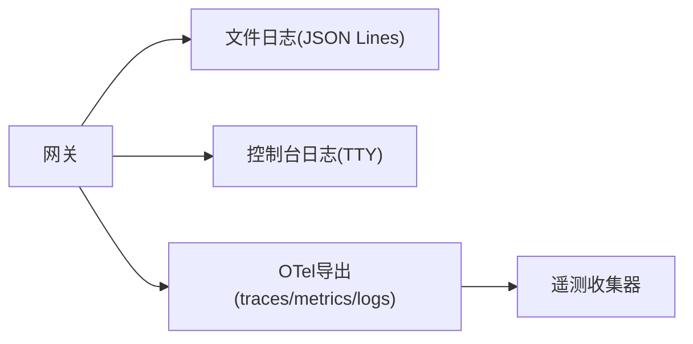
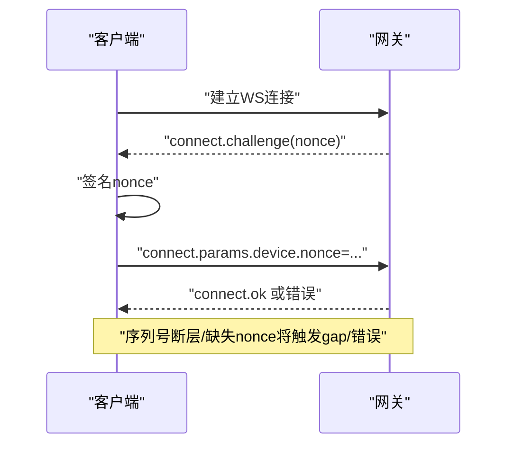
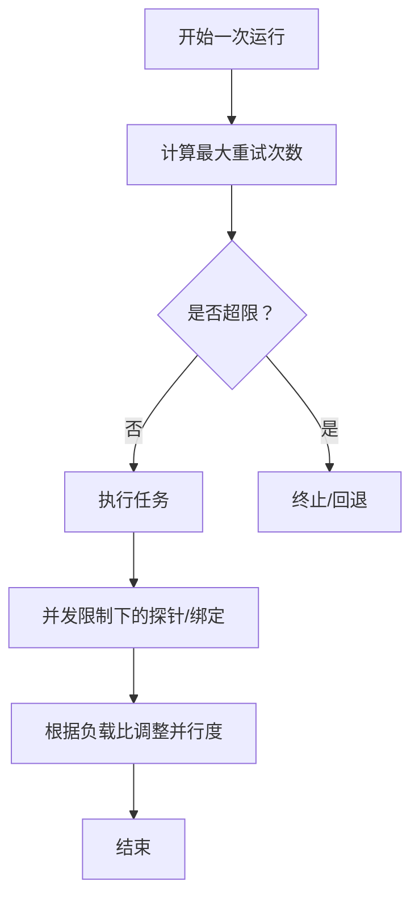
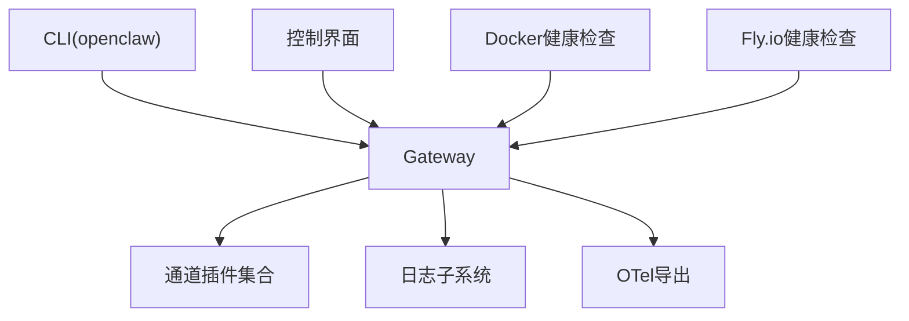

# 故障排除和监控

<cite>
**本文引用的文件**
- [docs/gateway/troubleshooting.md](file://docs/gateway/troubleshooting.md)
- [docs/channels/troubleshooting.md](file://docs/channels/troubleshooting.md)
- [docs/gateway/health.md](file://docs/gateway/health.md)
- [docs/cli/health.md](file://docs/cli/health.md)
- [docs/gateway/logging.md](file://docs/gateway/logging.md)
- [extensions/diagnostics-otel/src/service.ts](file://extensions/diagnostics-otel/src/service.ts)
- [src/config/schema.help.ts](file://src/config/schema.help.ts)
- [src/gateway/client.ts](file://src/gateway/client.ts)
- [apps/android/app/src/main/java/ai/openclaw/app/gateway/GatewaySession.kt](file://apps/android/app/src/main/java/ai/openclaw/app/gateway/GatewaySession.kt)
- [apps/macos/Tests/OpenClawIPCTests/GatewayChannelConnectTests.swift](file://apps/macos/Tests/OpenClawIPCTests/GatewayChannelConnectTests.swift)
- [docs/install/docker.md](file://docs/install/docker.md)
- [docs/install/fly.md](file://docs/install/fly.md)
- [src/agents/pi-embedded-runner/run.ts](file://src/agents/pi-embedded-runner/run.ts)
- [src/discord/monitor/thread-bindings.lifecycle.ts](file://src/discord/monitor/thread-bindings.lifecycle.ts)
- [src/infra/diagnostic-events.ts](file://src/infra/diagnostic-events.ts)
- [src/logging/diagnostic.ts](file://src/logging/diagnostic.ts)
- [src/config/schema.tags.ts](file://src/config/schema.tags.ts)
- [scripts/test-parallel.mjs](file://scripts/test-parallel.mjs)
- [src/gateway/open-responses.schema.ts](file://src/gateway/open-responses.schema.ts)
- [extensions/msteams/src/monitor-types.ts](file://extensions/msteams/src/monitor-types.ts)
- [docs/refactor/cluster.md](file://docs/refactor/cluster.md)
</cite>

## 目录
1. [简介](#简介)
2. [项目结构](#项目结构)
3. [核心组件](#核心组件)
4. [架构总览](#架构总览)
5. [详细组件分析](#详细组件分析)
6. [依赖关系分析](#依赖关系分析)
7. [性能考量](#性能考量)
8. [故障排除指南](#故障排除指南)
9. [结论](#结论)
10. [附录](#附录)

## 简介
本运维文档面向OpenClaw通道系统的运行与维护，聚焦于通道连接失败、认证错误、消息延迟与性能问题的诊断与修复；覆盖健康检查机制、监控指标采集与告警配置；提供日志分析技巧、调试工具使用与问题定位方法；并给出性能监控、容量规划与扩展性建议，以及运维最佳实践与应急预案。

## 项目结构
OpenClaw通过“网关（Gateway）+ 多通道插件（Channels）+ CLI/控制台”的方式组织能力。运维侧关注以下关键路径：
- 健康检查与状态：CLI健康命令、容器健康端点、通道探针
- 日志与可观测性：文件日志、控制台日志、OpenTelemetry导出
- 连接与认证：WebSocket握手、设备身份挑战、令牌校验
- 性能与并发：重试策略、并发限制、负载感知

图示来源
- [docs/gateway/health.md](file://docs/gateway/health.md#L12-L36)
- [docs/gateway/logging.md](file://docs/gateway/logging.md#L13-L114)
- [extensions/diagnostics-otel/src/service.ts](file://extensions/diagnostics-otel/src/service.ts#L72-L148)

章节来源
- [docs/gateway/health.md](file://docs/gateway/health.md#L12-L36)
- [docs/gateway/logging.md](file://docs/gateway/logging.md#L13-L114)

## 核心组件
- 健康检查与状态
  - CLI健康命令：用于查询运行中网关的健康快照与通道探针结果
  - 容器健康端点：/healthz（存活）、/readyz（就绪）
- 日志与可观测性
  - 文件日志：滚动JSON Lines日志，支持级别与敏感信息脱敏
  - 控制台日志：TTY感知、子系统前缀、颜色与样式
  - OpenTelemetry导出：可选开启，支持traces/metrics/logs
- 连接与认证
  - WebSocket握手流程：connect.challenge与nonce校验
  - 设备身份挑战：nonce签名与时间戳约束
  - 令牌与权限：远程绑定需令牌，通道权限不足导致401/403
- 性能与可靠性
  - 重试与回退：运行时重试上限与模型回退
  - 并发与限流：线程绑定生命周期中的并发限制
  - 负载感知：测试脚本中的CPU负载比例自适应

章节来源
- [docs/cli/health.md](file://docs/cli/health.md#L8-L22)
- [docs/gateway/health.md](file://docs/gateway/health.md#L12-L36)
- [docs/install/docker.md](file://docs/install/docker.md#L469-L495)
- [docs/gateway/logging.md](file://docs/gateway/logging.md#L18-L114)
- [extensions/diagnostics-otel/src/service.ts](file://extensions/diagnostics-otel/src/service.ts#L72-L148)
- [src/gateway/client.ts](file://src/gateway/client.ts#L360-L395)
- [src/agents/pi-embedded-runner/run.ts](file://src/agents/pi-embedded-runner/run.ts#L121-L155)
- [src/discord/monitor/thread-bindings.lifecycle.ts](file://src/discord/monitor/thread-bindings.lifecycle.ts#L45-L81)
- [scripts/test-parallel.mjs](file://scripts/test-parallel.mjs#L243-L275)

## 架构总览
下图展示从客户端到网关、再到各通道的典型调用链路与健康检查位置：

图示来源
- [docs/cli/health.md](file://docs/cli/health.md#L8-L22)
- [docs/gateway/logging.md](file://docs/gateway/logging.md#L18-L114)
- [extensions/diagnostics-otel/src/service.ts](file://extensions/diagnostics-otel/src/service.ts#L72-L148)

## 详细组件分析

### 健康检查与状态
- CLI健康命令
  - openclaw health：获取运行中网关健康快照，支持--json与--verbose
  - openclaw status：本地汇总（运行态、模式、会话与最近活动）
- 容器健康端点
  - /healthz：进程存活探测
  - /readyz：启动宽限期后，若关键通道未就绪则返回非就绪
- 通道探针
  - openclaw channels status --probe：通道连通性与就绪状态
  - openclaw doctor：配置与服务健康扫描

图示来源
- [docs/cli/health.md](file://docs/cli/health.md#L8-L22)
- [docs/gateway/health.md](file://docs/gateway/health.md#L12-L36)

章节来源
- [docs/cli/health.md](file://docs/cli/health.md#L8-L22)
- [docs/gateway/health.md](file://docs/gateway/health.md#L12-L36)

### 日志与可观测性
- 文件日志
  - 默认滚动文件：/tmp/openclaw/openclaw-YYYY-MM-DD.log
  - 可通过配置调整路径与级别
- 控制台日志
  - 子系统前缀、颜色、TTY感知、样式切换
  - 工具摘要脱敏仅影响控制台，不改变文件日志
- OpenTelemetry导出
  - 支持协议：http/protobuf（当前实现）
  - 可选开启traces/metrics/logs
  - 采样率、服务名、刷新间隔、头部元数据

图示来源
- [docs/gateway/logging.md](file://docs/gateway/logging.md#L18-L114)
- [extensions/diagnostics-otel/src/service.ts](file://extensions/diagnostics-otel/src/service.ts#L72-L148)
- [src/config/schema.help.ts](file://src/config/schema.help.ts#L489-L501)

章节来源
- [docs/gateway/logging.md](file://docs/gateway/logging.md#L18-L114)
- [extensions/diagnostics-otel/src/service.ts](file://extensions/diagnostics-otel/src/service.ts#L72-L148)
- [src/config/schema.help.ts](file://src/config/schema.help.ts#L489-L501)

### 连接与认证
- WebSocket握手与挑战
  - 网关发送connect.challenge携带nonce
  - 客户端需在收到挑战后签名并回传对应nonce
  - 缺失nonce或序列号断层将触发错误与重连
- 设备身份挑战
  - 非法/过期签名、时间戳不匹配、缺少设备身份等均会导致认证失败
- 令牌与权限
  - 非环回绑定需令牌
  - 通道权限不足导致401/403

图示来源
- [src/gateway/client.ts](file://src/gateway/client.ts#L360-L395)
- [apps/android/app/src/main/java/ai/openclaw/app/gateway/GatewaySession.kt](file://apps/android/app/src/main/java/ai/openclaw/app/gateway/GatewaySession.kt#L470-L476)
- [apps/macos/Tests/OpenClawIPCTests/GatewayChannelConnectTests.swift](file://apps/macos/Tests/OpenClawIPCTests/GatewayChannelConnectTests.swift#L12-L35)

章节来源
- [src/gateway/client.ts](file://src/gateway/client.ts#L360-L395)
- [apps/android/app/src/main/java/ai/openclaw/app/gateway/GatewaySession.kt](file://apps/android/app/src/main/java/ai/openclaw/app/gateway/GatewaySession.kt#L470-L476)
- [apps/macos/Tests/OpenClawIPCTests/GatewayChannelConnectTests.swift](file://apps/macos/Tests/OpenClawIPCTests/GatewayChannelConnectTests.swift#L12-L35)

### 性能与可靠性
- 运行时重试与回退
  - 运行循环最大重试次数按候选模型数量线性增长，有上下界保护
- 并发与限流
  - 线程绑定生命周期中对启动扇出进行并发限制，避免Acp探针尖峰
- 负载感知
  - 测试脚本根据系统负载比动态调整工作线程数，极端压力下降速

图示来源
- [src/agents/pi-embedded-runner/run.ts](file://src/agents/pi-embedded-runner/run.ts#L121-L155)
- [src/discord/monitor/thread-bindings.lifecycle.ts](file://src/discord/monitor/thread-bindings.lifecycle.ts#L45-L81)
- [scripts/test-parallel.mjs](file://scripts/test-parallel.mjs#L243-L275)

章节来源
- [src/agents/pi-embedded-runner/run.ts](file://src/agents/pi-embedded-runner/run.ts#L121-L155)
- [src/discord/monitor/thread-bindings.lifecycle.ts](file://src/discord/monitor/thread-bindings.lifecycle.ts#L45-L81)
- [scripts/test-parallel.mjs](file://scripts/test-parallel.mjs#L243-L275)

### 监控指标与告警
- 指标来源
  - 运行时状态：openclaw status/health
  - 通道状态：openclaw channels status --probe
  - 文件日志：tail /tmp/openclaw/*.log并过滤关键关键词
  - OTel导出：traces/metrics/logs
- 建议指标
  - 连接成功率、重连次数、通道延迟、队列长度、错误分布
  - CPU/内存/磁盘使用率、网络往返时间
- 告警阈值
  - 连续重连超过阈值
  - 通道延迟持续高于SLA
  - 错误率突增（如4xx/5xx、认证失败、权限不足）

章节来源
- [docs/gateway/health.md](file://docs/gateway/health.md#L12-L36)
- [docs/gateway/logging.md](file://docs/gateway/logging.md#L18-L114)
- [extensions/diagnostics-otel/src/service.ts](file://extensions/diagnostics-otel/src/service.ts#L72-L148)

## 依赖关系分析
- 组件耦合
  - 网关与通道：通过统一事件帧与响应帧交互，通道插件遵循通用生命周期
  - 日志与OTel：日志作为观测数据源，OTel作为外部收集器出口
  - CLI与网关：通过RPC/WS通信，CLI负责健康与状态查询
- 外部依赖
  - 容器环境：Docker Compose健康检查、Ready探针
  - 云平台：Fly.io的健康检查、自动启停与最小实例数

图示来源
- [docs/install/docker.md](file://docs/install/docker.md#L469-L495)
- [docs/install/fly.md](file://docs/install/fly.md#L245-L277)

章节来源
- [docs/install/docker.md](file://docs/install/docker.md#L469-L495)
- [docs/install/fly.md](file://docs/install/fly.md#L245-L277)

## 性能考量
- 连接与认证
  - 优化握手与挑战流程，减少nonce缺失与签名错误
  - 合理设置重连退避与最大重试次数
- 通道处理
  - 使用并发限制避免大规模绑定启动时的探针风暴
  - 对高延迟通道采用独立队列与优先级调度
- 资源与容量
  - 容器部署建议2GB以上内存，Fly.io按需提升VM内存
  - 关注磁盘热点：媒体、会话、转录、日志与cron运行记录

章节来源
- [src/discord/monitor/thread-bindings.lifecycle.ts](file://src/discord/monitor/thread-bindings.lifecycle.ts#L45-L81)
- [docs/install/docker.md](file://docs/install/docker.md#L26-L34)
- [docs/install/fly.md](file://docs/install/fly.md#L259-L277)

## 故障排除指南

### 常见症状与排查步骤
- 网关服务不可达
  - 检查运行态与端口占用，必要时强制重启
  - 非环回绑定需配置令牌
- 控制界面无法连接
  - 校验URL、认证模式与安全上下文
  - 设备身份挑战失败：更新客户端以正确完成nonce签名
- 通道已连接但无回复
  - 检查配对状态、允许白名单与提及策略
  - 核对通道API权限与作用域
- 认证错误
  - 令牌/密码不匹配、设备签名过期或时间戳不一致
  - 升级后URL覆盖行为变更：显式--url不会回退存储凭据
- 消息延迟
  - 观察通道探针与日志延迟信号
  - 检查并发限制与负载比

章节来源
- [docs/gateway/troubleshooting.md](file://docs/gateway/troubleshooting.md#L14-L367)
- [docs/channels/troubleshooting.md](file://docs/channels/troubleshooting.md#L13-L118)

### 通道特定快速检查
- WhatsApp：配对列表、断线重登、凭证目录健康
- Telegram：/start后无回复、隐私模式与提及要求、DNS/IPv6/代理到api.telegram.org
- Discord：服务器/频道允许与消息意图、提及策略
- Slack：Socket模式令牌与所需作用域、DM策略
- iMessage/BlueBubbles：Webhook/服务器可达性与macOS隐私权限
- Signal：daemon URL/账户与接收模式
- Matrix：房间允许与提及策略、加密模块与同步

章节来源
- [docs/channels/troubleshooting.md](file://docs/channels/troubleshooting.md#L31-L118)

### 日志分析与调试工具
- 日志定位
  - openclaw logs --follow 实时跟踪
  - 过滤关键词：web-heartbeat、web-reconnect、web-auto-reply、web-inbound
- 调试开关
  - --verbose 提升控制台详细度（不影响文件日志级别）
  - 调整 logging.level 与 logging.consoleLevel
- 工具摘要脱敏
  - 仅对控制台输出生效，避免敏感信息泄露

章节来源
- [docs/gateway/health.md](file://docs/gateway/health.md#L12-L36)
- [docs/gateway/logging.md](file://docs/gateway/logging.md#L35-L114)

### 健康检查与状态命令
- openclaw health：获取运行中网关健康快照
- openclaw status：本地汇总与深度诊断
- openclaw channels status --probe：通道连通性与就绪
- openclaw doctor：配置与服务健康扫描

章节来源
- [docs/cli/health.md](file://docs/cli/health.md#L8-L22)
- [docs/gateway/health.md](file://docs/gateway/health.md#L12-L36)

### 运维最佳实践
- 配置与标签
  - 使用配置标签体系识别安全、访问、性能、可靠性、存储、可观测性等维度
- 容器与云平台
  - Docker HEALTHCHECK与/healthz、/readyz端点
  - Fly.io最小实例数与自动启停，内存充足（建议2GB+）
- 监控与告警
  - 基于OTel导出与文件日志构建仪表盘
  - 设置重连次数、延迟、错误率阈值告警
- 扩展性
  - 通道绑定并发限制与负载感知
  - 多代理场景下隔离与资源限制

章节来源
- [src/config/schema.tags.ts](file://src/config/schema.tags.ts#L55-L80)
- [docs/install/docker.md](file://docs/install/docker.md#L469-L495)
- [docs/install/fly.md](file://docs/install/fly.md#L63-L92)
- [extensions/diagnostics-otel/src/service.ts](file://extensions/diagnostics-otel/src/service.ts#L72-L148)

### 应急预案
- 短路恢复
  - relink：当出现登录状态码409–515或loggedOut时，先logout再login
  - 强制重启：端口占用或服务异常时使用--force
- 通道应急
  - 临时放宽提及策略与允许白名单，确保业务连续性
  - 切换备用通道或回退模型
- 云平台应急
  - Fly.io：增加内存、释放公共IP改为私有部署、使用ngrok隧道处理回调

章节来源
- [docs/gateway/health.md](file://docs/gateway/health.md#L27-L36)
- [docs/gateway/troubleshooting.md](file://docs/gateway/troubleshooting.md#L294-L367)
- [docs/install/fly.md](file://docs/install/fly.md#L259-L277)

## 结论
通过规范化的健康检查、完善的日志与可观测性、严谨的连接与认证流程、以及性能与容量规划，OpenClaw通道系统可在多平台与多通道环境下保持稳定运行。建议将CLI健康命令、容器健康端点、OTel导出与通道探针纳入统一监控视图，并结合应急预案形成闭环运维体系。

## 附录

### 配置参考与帮助
- OTel相关配置项说明：端点、协议、头部、服务名、信号开关、采样率、刷新间隔
- 配置标签规则：基于前缀与关键字的分类，便于审计与治理

章节来源
- [src/config/schema.help.ts](file://src/config/schema.help.ts#L489-L501)
- [src/config/schema.tags.ts](file://src/config/schema.tags.ts#L55-L80)

### 数据模型与状态
- 响应状态枚举：in_progress/completed/failed/cancelled/incomplete
- 状态补丁：通道连接状态与最近事件时间戳一致性

章节来源
- [src/gateway/open-responses.schema.ts](file://src/gateway/open-responses.schema.ts#L214-L222)
- [src/gateway/channel-status-patches.test.ts](file://src/gateway/channel-status-patches.test.ts#L1-L12)

### 诊断事件与会话状态
- 诊断事件分发：监听器容错、序列号与时间戳增强
- 诊断会话状态计数与心跳：用于测试与诊断

章节来源
- [src/infra/diagnostic-events.ts](file://src/infra/diagnostic-events.ts#L204-L242)
- [src/logging/diagnostic.ts](file://src/logging/diagnostic.ts#L419-L433)

### 平台与集成
- 容器化与云平台部署要点：健康端点、持久化、内存与并发
- 插件监控类型接口：日志记录器抽象

章节来源
- [docs/install/docker.md](file://docs/install/docker.md#L469-L495)
- [docs/install/fly.md](file://docs/install/fly.md#L245-L277)
- [extensions/msteams/src/monitor-types.ts](file://extensions/msteams/src/monitor-types.ts#L1-L5)

### 重构与集群
- 通道插件配置与安全脚手架的重构集群清单
- 有助于降低重复代码与提升一致性

章节来源
- [docs/refactor/cluster.md](file://docs/refactor/cluster.md#L13-L300)