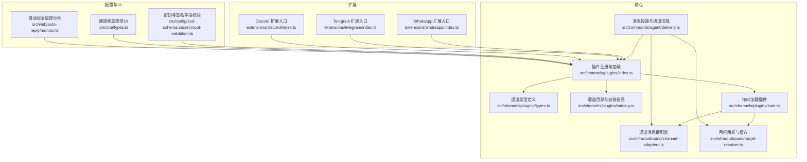
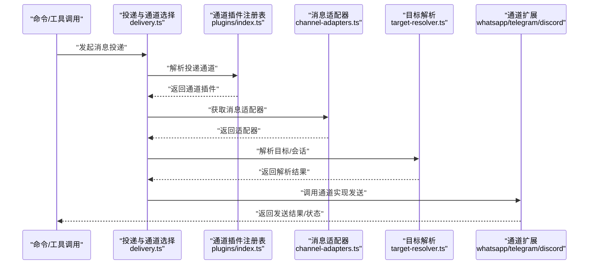
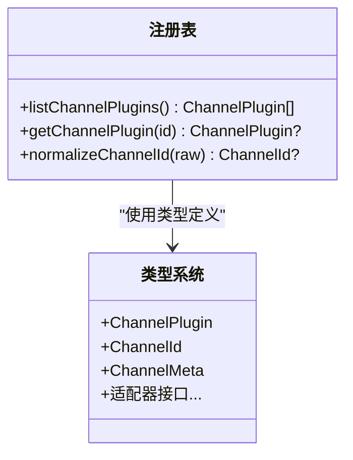
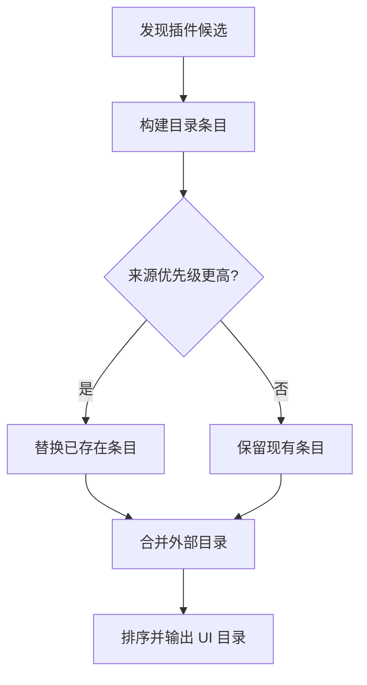
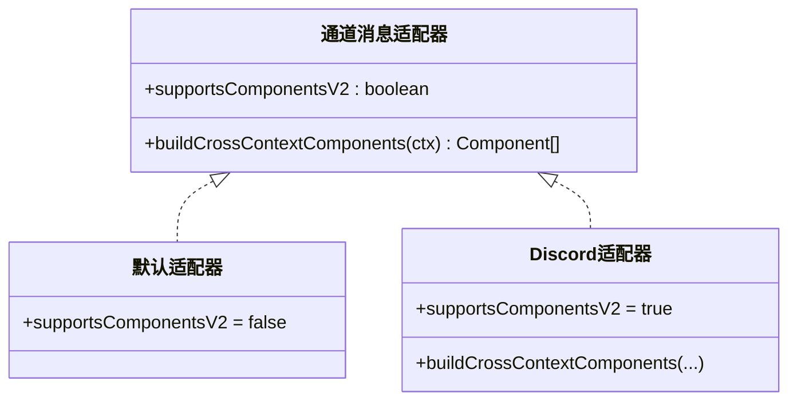
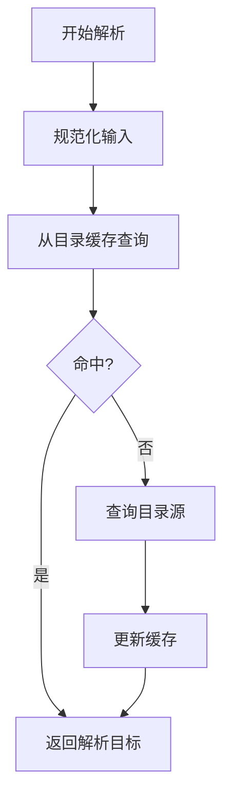
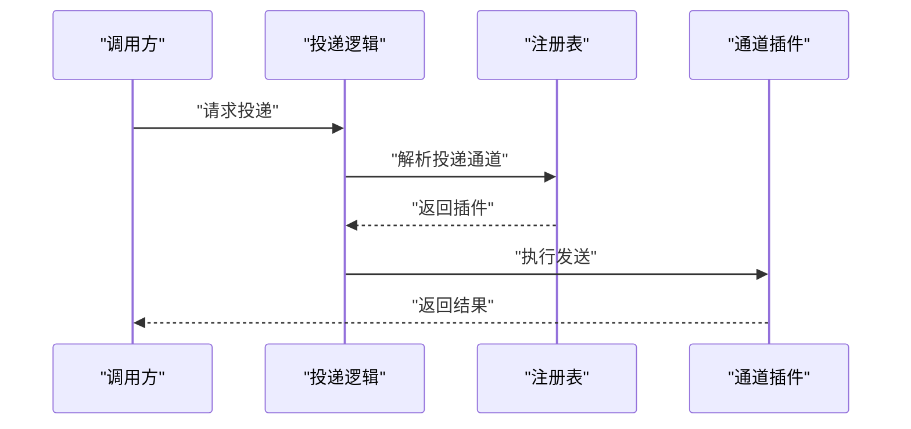
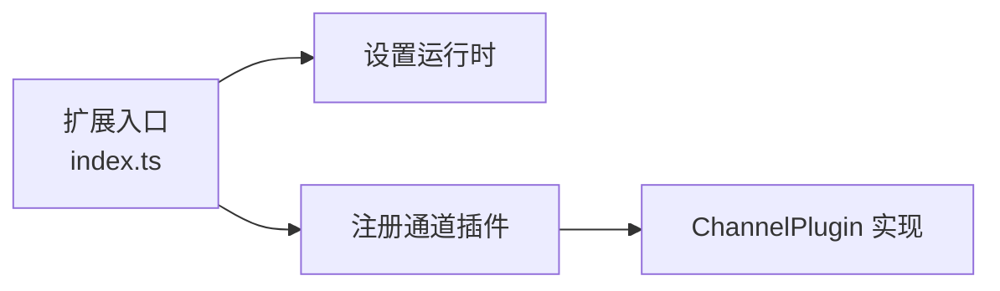
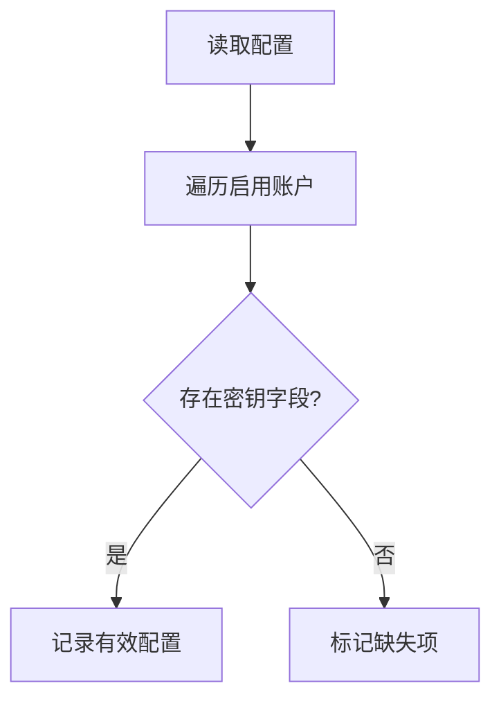
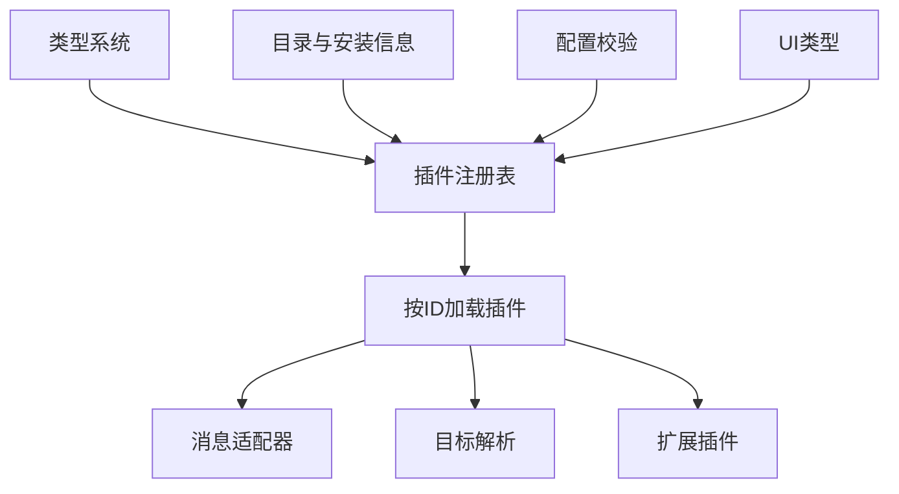

# 通道系统

<cite>
**本文引用的文件**
- [docs/channels/index.md](file://docs/channels/index.md)
- [src/channels/plugins/index.ts](file://src/channels/plugins/index.ts)
- [src/channels/plugins/types.ts](file://src/channels/plugins/types.ts)
- [src/channels/plugins/catalog.ts](file://src/channels/plugins/catalog.ts)
- [src/channels/plugins/load.ts](file://src/channels/plugins/load.ts)
- [src/infra/outbound/channel-adapters.ts](file://src/infra/outbound/channel-adapters.ts)
- [src/infra/outbound/target-resolver.ts](file://src/infra/outbound/target-resolver.ts)
- [src/commands/agent/delivery.ts](file://src/commands/agent/delivery.ts)
- [extensions/whatsapp/index.ts](file://extensions/whatsapp/index.ts)
- [extensions/telegram/index.ts](file://extensions/telegram/index.ts)
- [extensions/discord/index.ts](file://extensions/discord/index.ts)
- [src/config/zod-schema.secret-input-validation.ts](file://src/config/zod-schema.secret-input-validation.ts)
- [ui/src/ui/types.ts](file://ui/src/ui/types.ts)
- [src/web/auto-reply/monitor.ts](file://src/web/auto-reply/monitor.ts)
</cite>

## 目录
1. [简介](#简介)
2. [项目结构](#项目结构)
3. [核心组件](#核心组件)
4. [架构总览](#架构总览)
5. [详细组件分析](#详细组件分析)
6. [依赖关系分析](#依赖关系分析)
7. [性能考量](#性能考量)
8. [故障排查指南](#故障排查指南)
9. [结论](#结论)
10. [附录](#附录)

## 简介
本文件为 OpenClaw 通道系统的技术文档，聚焦于“通道适配器架构”与“消息路由处理机制”。文档将解释如何通过统一的插件接口适配不同即时通讯平台（如 WhatsApp、Telegram、Discord、Slack 等），并给出消息格式统一、认证方式与 API 差异的处理策略；同时提供面向用户的配置指引（API 密钥、Webhook、权限等）以及安全最佳实践（未知发送者策略与配对机制）。  
支持的通道列表可参考官方文档索引，涵盖 20+ 种平台。

章节来源
- file://docs/channels/index.md#L14-L37

## 项目结构
OpenClaw 的通道系统由“核心插件注册与发现”“通道适配器”“目标解析与路由”“UI 状态类型”“配置校验”等模块组成，并通过各平台扩展（如 WhatsApp、Telegram、Discord）以插件形式接入。

图表来源
- [src/channels/plugins/index.ts](file://src/channels/plugins/index.ts#L74-L84)
- [src/channels/plugins/types.ts](file://src/channels/plugins/types.ts#L1-L66)
- [src/channels/plugins/catalog.ts](file://src/channels/plugins/catalog.ts#L231-L257)
- [src/channels/plugins/load.ts](file://src/channels/plugins/load.ts#L1-L9)
- [src/infra/outbound/channel-adapters.ts](file://src/infra/outbound/channel-adapters.ts#L40-L56)
- [src/infra/outbound/target-resolver.ts](file://src/infra/outbound/target-resolver.ts#L1-L44)
- [src/commands/agent/delivery.ts](file://src/commands/agent/delivery.ts#L96-L117)
- [extensions/whatsapp/index.ts](file://extensions/whatsapp/index.ts#L1-L18)
- [extensions/telegram/index.ts](file://extensions/telegram/index.ts#L1-L18)
- [extensions/discord/index.ts](file://extensions/discord/index.ts#L1-L20)
- [src/config/zod-schema.secret-input-validation.ts](file://src/config/zod-schema.secret-input-validation.ts#L1-L41)
- [ui/src/ui/types.ts](file://ui/src/ui/types.ts#L74-L138)
- [src/web/auto-reply/monitor.ts](file://src/web/auto-reply/monitor.ts#L71-L94)

章节来源
- file://src/channels/plugins/index.ts#L1-L118
- file://src/channels/plugins/types.ts#L1-L66
- file://src/channels/plugins/catalog.ts#L1-L308
- file://src/channels/plugins/load.ts#L1-L9
- file://src/infra/outbound/channel-adapters.ts#L40-L56
- file://src/infra/outbound/target-resolver.ts#L1-L44
- file://src/commands/agent/delivery.ts#L96-L117
- file://extensions/whatsapp/index.ts#L1-L18
- file://extensions/telegram/index.ts#L1-L18
- file://extensions/discord/index.ts#L1-L20
- file://src/config/zod-schema.secret-input-validation.ts#L1-L41
- file://ui/src/ui/types.ts#L74-L138
- file://src/web/auto-reply/monitor.ts#L71-L94

## 核心组件
- 插件注册与发现：集中管理通道插件，去重排序，按 ID 缓存，提供标准化查询接口。
- 类型系统：统一定义通道适配器、账户状态、能力、动作等核心类型。
- 目录与安装信息：从插件清单与外部目录构建 UI 元数据与安装信息。
- 消息适配器：针对特定通道（如 Discord）提供组件增强与跨上下文组件构建。
- 目标解析：将用户输入的目标规范化并从目录中解析，支持缓存与歧义处理策略。
- 投递与通道选择：在内部通道与外部通道之间进行解析与选择，通过插件注册表对接具体通道。

章节来源
- file://src/channels/plugins/index.ts#L74-L84
- file://src/channels/plugins/types.ts#L1-L66
- file://src/channels/plugins/catalog.ts#L231-L257
- file://src/infra/outbound/channel-adapters.ts#L40-L56
- file://src/infra/outbound/target-resolver.ts#L1-L44
- file://src/commands/agent/delivery.ts#L96-L117

## 架构总览
下图展示通道系统的关键交互：命令层决定投递通道，插件注册表解析到具体通道插件，消息经适配器转换后由对应通道实现发送；目标解析贯穿入站/出站流程。

图表来源
- [src/commands/agent/delivery.ts](file://src/commands/agent/delivery.ts#L96-L117)
- [src/channels/plugins/index.ts](file://src/channels/plugins/index.ts#L74-L84)
- [src/infra/outbound/channel-adapters.ts](file://src/infra/outbound/channel-adapters.ts#L40-L56)
- [src/infra/outbound/target-resolver.ts](file://src/infra/outbound/target-resolver.ts#L32-L41)
- [extensions/whatsapp/index.ts](file://extensions/whatsapp/index.ts#L1-L18)
- [extensions/telegram/index.ts](file://extensions/telegram/index.ts#L1-L18)
- [extensions/discord/index.ts](file://extensions/discord/index.ts#L1-L20)

## 详细组件分析

### 组件A：通道插件注册与加载
- 职责：维护通道插件列表，按顺序与优先级排序，去重缓存，提供按 ID 查询与标准化通道名的能力。
- 关键点：
  - 去重与排序：基于预设顺序与自定义 order 字段排序。
  - 缓存：基于注册表版本缓存，避免重复构建。
  - 规范化：统一通道 ID 规范化逻辑，确保后续匹配一致。

图表来源
- [src/channels/plugins/index.ts](file://src/channels/plugins/index.ts#L74-L90)
- [src/channels/plugins/types.ts](file://src/channels/plugins/types.ts#L1-L66)

章节来源
- file://src/channels/plugins/index.ts#L1-L118
- file://src/channels/plugins/types.ts#L1-L66

### 组件B：通道目录与安装信息
- 职责：从插件清单与外部目录构建 UI 元数据（标签、详情、图标等）与安装信息（npm/local 选择）。
- 关键点：
  - 外部目录路径解析：支持环境变量与默认路径。
  - 优先级合并：按来源优先级保留唯一项。
  - UI 目录生成：输出 UI 可读的条目与映射。

图表来源
- [src/channels/plugins/catalog.ts](file://src/channels/plugins/catalog.ts#L259-L296)
- [src/channels/plugins/catalog.ts](file://src/channels/plugins/catalog.ts#L231-L257)

章节来源
- file://src/channels/plugins/catalog.ts#L1-L308

### 组件C：消息适配器（通道消息格式统一）
- 职责：针对特定通道提供消息组件增强与跨上下文组件构建，保证不同通道的消息表现一致性。
- 关键点：
  - 默认适配器：通用行为。
  - Discord 适配器：启用组件 v2 并提供跨上下文容器组件。

图表来源
- [src/infra/outbound/channel-adapters.ts](file://src/infra/outbound/channel-adapters.ts#L40-L56)

章节来源
- file://src/infra/outbound/channel-adapters.ts#L40-L56

### 组件D：目标解析与路由
- 职责：将用户输入的目标规范化并从目录中解析，支持缓存与歧义处理策略；在入站/出站流程中统一目标语义。
- 关键点：
  - 规范化：统一输入格式，便于跨通道匹配。
  - 缓存：目录缓存提升解析性能。
  - 结果：返回解析目标或候选集合用于进一步决策。

图表来源
- [src/infra/outbound/target-resolver.ts](file://src/infra/outbound/target-resolver.ts#L32-L44)

章节来源
- file://src/infra/outbound/target-resolver.ts#L1-L44

### 组件E：消息投递与通道选择
- 职责：在内部通道与外部通道之间进行解析与选择，通过插件注册表对接具体通道插件，完成最终投递。
- 关键点：
  - 内部通道提示：当投递通道为内部通道且未显式指定时，尝试解析用户选择。
  - 外部通道：通过通道 ID 获取对应插件并执行发送。

图表来源
- [src/commands/agent/delivery.ts](file://src/commands/agent/delivery.ts#L96-L117)
- [src/channels/plugins/index.ts](file://src/channels/plugins/index.ts#L74-L84)

章节来源
- file://src/commands/agent/delivery.ts#L96-L117
- file://src/channels/plugins/index.ts#L74-L84

### 组件F：扩展插件（WhatsApp/Telegram/Discord）
- 职责：以插件形式注册通道实现，注入运行时并暴露统一的 ChannelPlugin 接口。
- 关键点：
  - 注册流程：设置运行时后注册通道插件。
  - 配置模式：空配置模式（emptyPluginConfigSchema）作为占位，具体参数由各通道实现与文档定义。

图表来源
- [extensions/whatsapp/index.ts](file://extensions/whatsapp/index.ts#L1-L18)
- [extensions/telegram/index.ts](file://extensions/telegram/index.ts#L1-L18)
- [extensions/discord/index.ts](file://extensions/discord/index.ts#L1-L20)

章节来源
- file://extensions/whatsapp/index.ts#L1-L18
- file://extensions/telegram/index.ts#L1-L18
- file://extensions/discord/index.ts#L1-L20

### 组件G：配置校验（密钥与签名字段）
- 职责：对 Telegram/Slack 等通道的密钥与签名字段进行遍历与校验，确保启用账户的配置完整性。
- 关键点：
  - 遍历启用账户：仅对 enabled=true 的账户进行检查。
  - 字段覆盖：Telegram 的 webhookUrl/webhookSecret，Slack 的 signingSecret 等。

图表来源
- [src/config/zod-schema.secret-input-validation.ts](file://src/config/zod-schema.secret-input-validation.ts#L28-L41)

章节来源
- file://src/config/zod-schema.secret-input-validation.ts#L1-L41

### 组件H：UI 状态类型（通道状态）
- 职责：为 UI 提供通道状态的类型定义，例如 Telegram 的机器人探测、Webhook 状态，WhatsApp 的连接与断开状态等。
- 关键点：
  - Telegram：探测结果、Webhook 状态、机器人信息。
  - WhatsApp：连接状态、断开原因、重连次数、最后事件时间等。

章节来源
- file://ui/src/ui/types.ts#L74-L138

### 组件I：自动回复监控（示例）
- 职责：在自动回复场景中，根据账户配置动态注入 WhatsApp 的允许来源、群组策略等参数，体现通道配置对运行时的影响。
- 关键点：
  - 动态合并：将账户级配置合并到运行时配置中。
  - 参数覆盖：允许来源、群组策略、文本分片限制等。

章节来源
- file://src/web/auto-reply/monitor.ts#L71-L94

## 依赖关系分析
- 插件注册表依赖类型系统与目录配置，提供稳定的查询接口。
- 消息适配器与目标解析在投递前被调用，确保消息格式与目标正确性。
- 扩展插件通过注册表对接到核心系统，形成松耦合的通道实现。
- 配置校验与 UI 类型为通道配置与可视化提供支撑。

图表来源
- [src/channels/plugins/types.ts](file://src/channels/plugins/types.ts#L1-L66)
- [src/channels/plugins/index.ts](file://src/channels/plugins/index.ts#L74-L84)
- [src/channels/plugins/catalog.ts](file://src/channels/plugins/catalog.ts#L231-L257)
- [src/infra/outbound/channel-adapters.ts](file://src/infra/outbound/channel-adapters.ts#L40-L56)
- [src/infra/outbound/target-resolver.ts](file://src/infra/outbound/target-resolver.ts#L1-L44)
- [src/config/zod-schema.secret-input-validation.ts](file://src/config/zod-schema.secret-input-validation.ts#L1-L41)
- [ui/src/ui/types.ts](file://ui/src/ui/types.ts#L74-L138)

章节来源
- file://src/channels/plugins/types.ts#L1-L66
- file://src/channels/plugins/index.ts#L1-L118
- file://src/channels/plugins/catalog.ts#L1-L308
- file://src/infra/outbound/channel-adapters.ts#L40-L56
- file://src/infra/outbound/target-resolver.ts#L1-L44
- file://src/config/zod-schema.secret-input-validation.ts#L1-L41
- file://ui/src/ui/types.ts#L74-L138

## 性能考量
- 目标解析缓存：目录缓存 TTL 为固定值，减少重复查询成本。
- 插件注册表缓存：基于注册表版本缓存，避免重复构建插件列表。
- 适配器选择：按通道 ID 快速选择适配器，降低分支判断开销。
- 配置校验批量化：遍历启用账户时仅处理有效账户，减少无效 IO。

章节来源
- file://src/infra/outbound/target-resolver.ts#L43-L44
- file://src/channels/plugins/index.ts#L42-L72
- file://src/infra/outbound/channel-adapters.ts#L51-L56
- file://src/config/zod-schema.secret-input-validation.ts#L28-L41

## 故障排查指南
- 通道未显示或无法加载
  - 检查插件注册表是否缓存命中，必要时重启服务以刷新缓存。
  - 确认扩展入口已正确注册通道插件。
- 目标解析失败
  - 核对输入是否符合规范化规则；查看目录缓存是否过期。
  - 对于歧义目标，确认是否采用“最佳/首个”策略。
- Telegram/Slack 配置问题
  - 使用配置校验逻辑检查启用账户的密钥字段是否完整。
  - Telegram：确认 webhookUrl/webhookSecret；Slack：确认 signingSecret。
- UI 状态异常
  - 查看 UI 类型中的探测与状态字段，定位连接、断开、重连等异常。

章节来源
- file://src/channels/plugins/index.ts#L42-L72
- file://src/infra/outbound/target-resolver.ts#L32-L41
- file://src/config/zod-schema.secret-input-validation.ts#L16-L26
- file://ui/src/ui/types.ts#L74-L138

## 结论
OpenClaw 通道系统通过“插件注册表 + 类型系统 + 适配器 + 目标解析”的架构，实现了对多平台通道的统一接入与路由。该设计在保持扩展性的同时，提供了可配置的安全策略与可观测的状态类型，便于在不同平台上实现一致的消息体验。

## 附录

### 支持的即时通讯平台与集成要点
- 平台列表与概览可参考官方通道索引，涵盖 WhatsApp、Telegram、Discord、Slack 等 20+ 平台。
- 集成方式：通过扩展插件以 ChannelPlugin 形式注册，结合注册表与适配器完成消息收发与目标解析。

章节来源
- file://docs/channels/index.md#L14-L37

### 配置与安全最佳实践（摘要）
- API 密钥与签名：使用配置校验逻辑确保启用账户的密钥字段完整。
- Webhook 设置：Telegram 需要 webhookUrl 与 webhookSecret；Slack 需要 signingSecret。
- 权限与配对：通道层面通常需要配对/授权流程（如 WhatsApp 的 QR 登录），并配合允许名单控制未知发送者。
- 运行时参数：自动回复等场景可动态合并账户级配置，确保策略生效。

章节来源
- file://src/config/zod-schema.secret-input-validation.ts#L16-L26
- file://src/web/auto-reply/monitor.ts#L71-L94
- file://ui/src/ui/types.ts#L74-L138