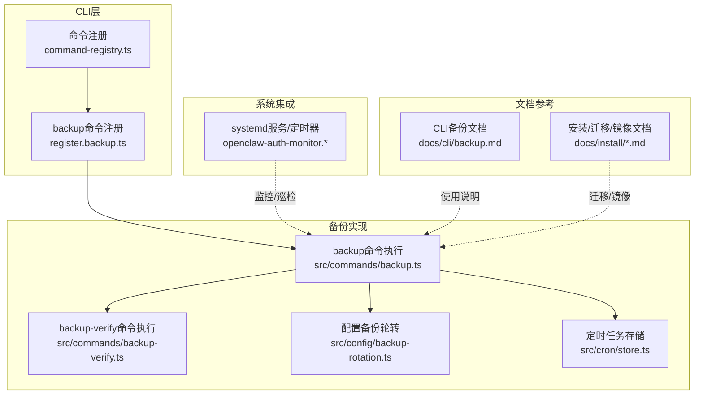
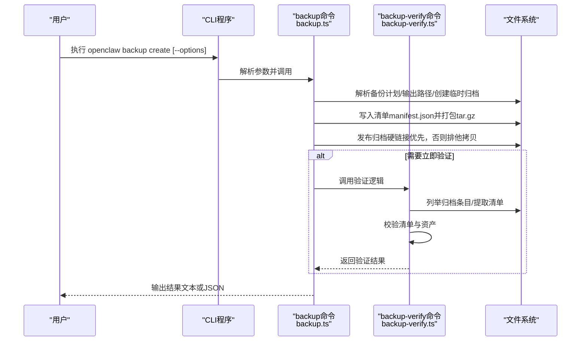
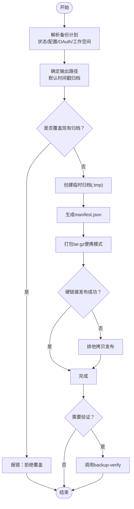
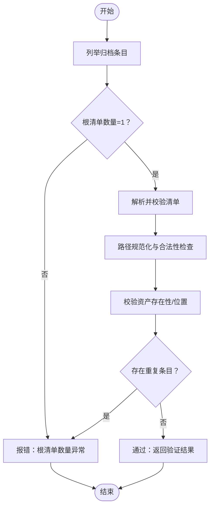
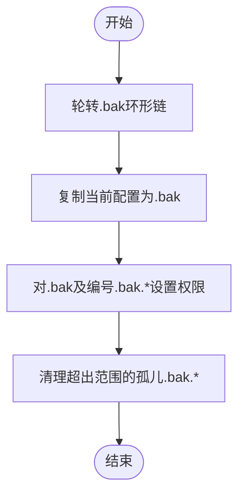
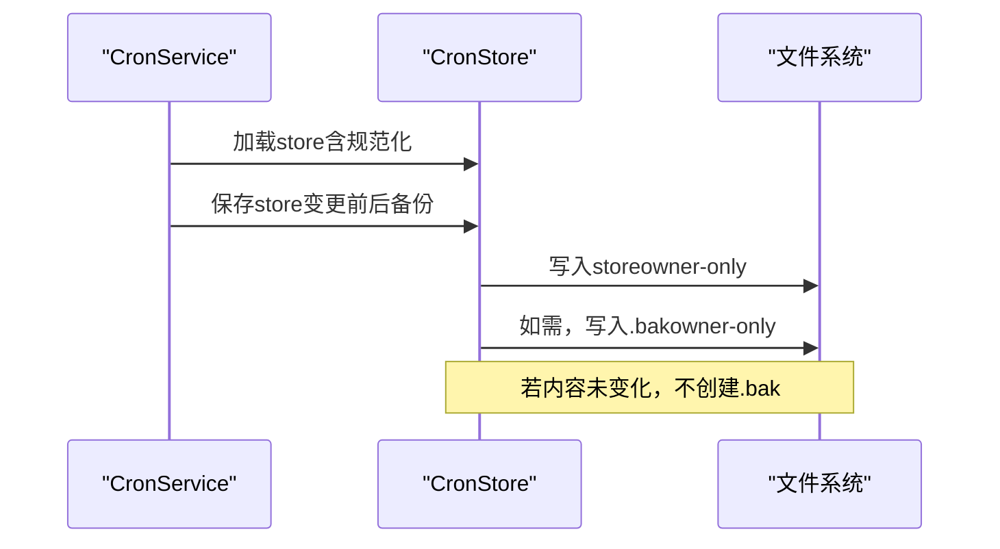
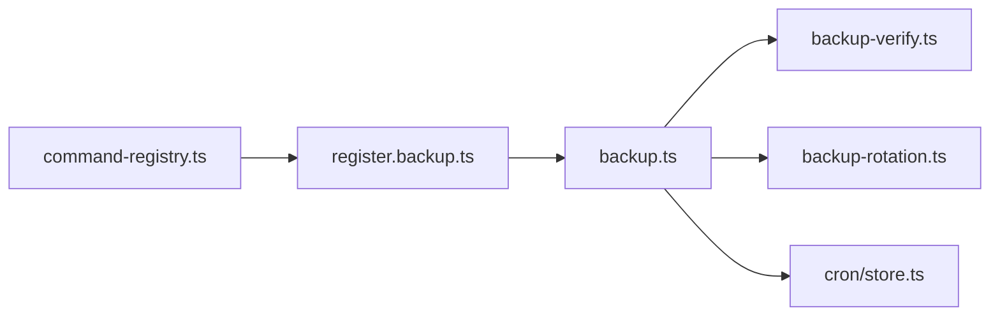

# 备份和恢复

<cite>
**本文引用的文件**
- [docs/cli/backup.md](file://docs/cli/backup.md)
- [src/cli/program/command-registry.ts](file://src/cli/program/command-registry.ts)
- [src/cli/program/register.backup.ts](file://src/cli/program/register.backup.ts)
- [src/commands/backup.ts](file://src/commands/backup.ts)
- [src/commands/backup-verify.ts](file://src/commands/backup-verify.ts)
- [src/config/backup-rotation.ts](file://src/config/backup-rotation.ts)
- [src/config/config.backup-rotation.test.ts](file://src/config/config.backup-rotation.test.ts)
- [src/cron/store.ts](file://src/cron/store.ts)
- [src/cron/service.issue-35195-backup-timing.test.ts](file://src/cron/service.issue-35195-backup-timing.test.ts)
- [src/config/paths.ts](file://src/config/paths.ts)
- [scripts/systemd/openclaw-auth-monitor.service](file://scripts/systemd/openclaw-auth-monitor.service)
- [scripts/systemd/openclaw-auth-monitor.timer](file://scripts/systemd/openclaw-auth-monitor.timer)
- [docs/install/docker.md](file://docs/install/docker.md)
- [docs/install/migrating.md](file://docs/install/migrating.md)
- [docs/refactor/outbound-session-mirroring.md](file://docs/refactor/outbound-session-mirroring.md)
- [docs/concepts/session-pruning.md](file://docs/concepts/session-pruning.md)
- [docs/cli/reset.md](file://docs/cli/reset.md)
</cite>

## 目录
1. [简介](#简介)
2. [项目结构](#项目结构)
3. [核心组件](#核心组件)
4. [架构总览](#架构总览)
5. [详细组件分析](#详细组件分析)
6. [依赖关系分析](#依赖关系分析)
7. [性能考量](#性能考量)
8. [故障排查指南](#故障排查指南)
9. [结论](#结论)
10. [附录](#附录)

## 简介
本运维手册面向OpenClaw的备份与恢复场景，覆盖以下目标：
- 配置备份策略：配置文件、会话数据、插件与技能、定时任务存储等
- 自动化备份：本地归档、验证、输出路径与覆盖保护、硬链接优先发布
- 恢复流程：完整恢复、选择性恢复、版本回滚（基于配置轮转）
- 验证与测试：归档清单校验、路径规范化、重复项检测、完整性检查
- 高级策略：灾难恢复、数据迁移、多环境同步与镜像复制

## 项目结构
围绕备份与恢复的关键模块与文档如下：
- CLI子命令注册与选项：backup create/verify
- 归档打包与清单生成：备份计划、输出路径、临时归档、硬链接发布
- 归档验证：清单解析、路径合法性、资产存在性、重复项检测
- 配置轮转与权限加固：.bak环形轮转、权限硬化、孤儿备份清理
- 定时任务存储备份：变更前后备份、安全权限写入
- 系统服务与定时器：认证过期监控与周期性检查
- 运维参考文档：安装、迁移、会话修剪、镜像复制等

图表来源
- [src/cli/program/command-registry.ts](file://src/cli/program/command-registry.ts#L85-L107)
- [src/cli/program/register.backup.ts](file://src/cli/program/register.backup.ts#L20-L49)
- [src/commands/backup.ts](file://src/commands/backup.ts#L274-L383)
- [src/commands/backup-verify.ts](file://src/commands/backup-verify.ts#L279-L325)
- [src/config/backup-rotation.ts](file://src/config/backup-rotation.ts#L16-L125)
- [src/cron/store.ts](file://src/cron/store.ts#L63-L75)
- [scripts/systemd/openclaw-auth-monitor.service](file://scripts/systemd/openclaw-auth-monitor.service#L1-L15)
- [scripts/systemd/openclaw-auth-monitor.timer](file://scripts/systemd/openclaw-auth-monitor.timer#L1-L11)
- [docs/cli/backup.md](file://docs/cli/backup.md#L1-L77)

章节来源
- [src/cli/program/command-registry.ts](file://src/cli/program/command-registry.ts#L85-L107)
- [src/cli/program/register.backup.ts](file://src/cli/program/register.backup.ts#L20-L49)
- [docs/cli/backup.md](file://docs/cli/backup.md#L1-L77)

## 核心组件
- 备份归档与清单
  - 备份计划：从状态目录、配置文件、凭据目录、工作空间（可选）解析源路径
  - 输出路径：默认时间戳归档；拒绝写入到源树内部；支持目录或具体文件路径
  - 临时归档与发布：先写临时文件，再尝试硬链接发布；不支持硬链接时使用排他拷贝
  - 清单生成：记录schema版本、创建时间、归档根、运行时版本、平台、Node版本、选项、路径、资产列表、跳过项
- 归档验证
  - 解析并校验清单：schema版本、archiveRoot、createdAt、assets字段
  - 路径规范化：相对路径、正斜杠、无路径穿越、不越出archiveRoot
  - 资产存在性：payload根下每个资产必须在归档中存在或被包含
  - 去重与完整性：不允许重复条目；仅允许一个根清单
- 配置备份轮转
  - 环形轮转：最多保留N个.bak及编号.bak.1..N-1
  - 权限硬化：对所有.bak设置owner-only权限
  - 孤儿清理：删除不在轮转范围内的.bak.*
- 定时任务存储备份
  - 变更前备份：内容未变化时不创建.bak
  - 安全权限：store与.bak均为owner-only
  - 目录权限：首次创建时将目录设为owner-only
- CLI命令
  - backup create：创建归档、干跑预览、验证归档、仅备份配置、排除工作空间
  - backup verify：校验归档清单与资产布局

章节来源
- [src/commands/backup.ts](file://src/commands/backup.ts#L20-L78)
- [src/commands/backup.ts](file://src/commands/backup.ts#L80-L170)
- [src/commands/backup.ts](file://src/commands/backup.ts#L192-L233)
- [src/commands/backup.ts](file://src/commands/backup.ts#L274-L383)
- [src/commands/backup-verify.ts](file://src/commands/backup-verify.ts#L14-L52)
- [src/commands/backup-verify.ts](file://src/commands/backup-verify.ts#L62-L90)
- [src/commands/backup-verify.ts](file://src/commands/backup-verify.ts#L218-L253)
- [src/commands/backup-verify.ts](file://src/commands/backup-verify.ts#L279-L325)
- [src/config/backup-rotation.ts](file://src/config/backup-rotation.ts#L16-L62)
- [src/config/backup-rotation.ts](file://src/config/backup-rotation.ts#L72-L109)
- [src/config/backup-rotation.ts](file://src/config/backup-rotation.ts#L115-L125)
- [src/cron/store.ts](file://src/cron/store.ts#L59-L75)
- [docs/cli/backup.md](file://docs/cli/backup.md#L1-L77)

## 架构总览
下图展示从CLI到备份实现、验证与配置轮转的整体流程。

图表来源
- [src/cli/program/register.backup.ts](file://src/cli/program/register.backup.ts#L20-L49)
- [src/commands/backup.ts](file://src/commands/backup.ts#L274-L383)
- [src/commands/backup-verify.ts](file://src/commands/backup-verify.ts#L279-L325)

章节来源
- [src/cli/program/register.backup.ts](file://src/cli/program/register.backup.ts#L20-L49)
- [src/commands/backup.ts](file://src/commands/backup.ts#L274-L383)
- [src/commands/backup-verify.ts](file://src/commands/backup-verify.ts#L279-L325)

## 详细组件分析

### 组件A：备份归档与清单生成
- 功能要点
  - 备份计划：解析状态目录、配置文件、OAuth目录、工作空间（可选）
  - 输出路径：默认当前目录或用户家目录，避免写入源树内部
  - 临时归档：使用随机UUID后缀，完成后发布到最终路径
  - 硬链接发布：优先硬链接，不支持时使用COPYFILE_EXCL排他拷贝
  - 清单：包含schema版本、创建时间、归档根、运行时版本、平台、Node版本、选项、路径、资产列表、跳过项
- 错误处理
  - 不覆盖现有归档；拒绝写入到源树内部；空归档报错
- 性能特性
  - 支持干跑预览；可选立即验证；gzip压缩；便携模式打包

图表来源
- [src/commands/backup.ts](file://src/commands/backup.ts#L80-L170)
- [src/commands/backup.ts](file://src/commands/backup.ts#L192-L233)
- [src/commands/backup.ts](file://src/commands/backup.ts#L274-L383)

章节来源
- [src/commands/backup.ts](file://src/commands/backup.ts#L20-L78)
- [src/commands/backup.ts](file://src/commands/backup.ts#L80-L170)
- [src/commands/backup.ts](file://src/commands/backup.ts#L192-L233)
- [src/commands/backup.ts](file://src/commands/backup.ts#L274-L383)

### 组件B：归档验证
- 功能要点
  - 列举归档条目；提取并解析清单
  - 路径规范化：相对路径、正斜杠、无路径穿越、不越出archiveRoot
  - 资产校验：每个资产在payload根下存在或被包含
  - 去重与完整性：仅允许一个根清单；不允许重复条目
- 输出
  - 成功时返回归档路径、archiveRoot、createdAt、runtimeVersion、资产数、扫描条目数

图表来源
- [src/commands/backup-verify.ts](file://src/commands/backup-verify.ts#L173-L183)
- [src/commands/backup-verify.ts](file://src/commands/backup-verify.ts#L218-L253)
- [src/commands/backup-verify.ts](file://src/commands/backup-verify.ts#L279-L325)

章节来源
- [src/commands/backup-verify.ts](file://src/commands/backup-verify.ts#L14-L52)
- [src/commands/backup-verify.ts](file://src/commands/backup-verify.ts#L62-L90)
- [src/commands/backup-verify.ts](file://src/commands/backup-verify.ts#L218-L253)
- [src/commands/backup-verify.ts](file://src/commands/backup-verify.ts#L279-L325)

### 组件C：配置备份轮转与权限加固
- 功能要点
  - 环形轮转：最多保留N个.bak及编号.bak.1..N-1
  - 权限硬化：对所有.bak设置owner-only权限
  - 孤儿清理：删除超出轮转范围的.bak.*
- 顺序保证
  - 轮转→创建新.bak→权限硬化→孤儿清理

图表来源
- [src/config/backup-rotation.ts](file://src/config/backup-rotation.ts#L16-L36)
- [src/config/backup-rotation.ts](file://src/config/backup-rotation.ts#L115-L125)

章节来源
- [src/config/backup-rotation.ts](file://src/config/backup-rotation.ts#L16-L62)
- [src/config/backup-rotation.ts](file://src/config/backup-rotation.ts#L72-L109)
- [src/config/backup-rotation.ts](file://src/config/backup-rotation.ts#L115-L125)
- [src/config/config.backup-rotation.test.ts](file://src/config/config.backup-rotation.test.ts#L17-L38)

### 组件D：定时任务存储备份
- 行为特征
  - 变更前后备份：内容未变化时不创建.bak
  - 安全权限：store与.bak均为owner-only
  - 目录权限：首次创建时将目录设为owner-only
- 测试关注点
  - 编辑前后.bak保持为编辑前的store
  - 权限在不同平台下的行为差异

图表来源
- [src/cron/store.ts](file://src/cron/store.ts#L24-L53)
- [src/cron/store.ts](file://src/cron/store.ts#L63-L75)
- [src/cron/service.issue-35195-backup-timing.test.ts](file://src/cron/service.issue-35195-backup-timing.test.ts#L11-L41)

章节来源
- [src/cron/store.ts](file://src/cron/store.ts#L24-L75)
- [src/cron/service.issue-35195-backup-timing.test.ts](file://src/cron/service.issue-35195-backup-timing.test.ts#L11-L41)

### 组件E：CLI命令与选项
- backup create
  - 选项：--output、--json、--dry-run、--verify、--only-config、--no-include-workspace
  - 行为：解析计划、输出路径、写入清单、打包、发布、可选验证
- backup verify
  - 选项：--json
  - 行为：校验清单、路径、资产、重复项

章节来源
- [src/cli/program/register.backup.ts](file://src/cli/program/register.backup.ts#L20-L49)
- [docs/cli/backup.md](file://docs/cli/backup.md#L1-L77)

## 依赖关系分析
- CLI注册与命令分发
  - 命令注册集中于program层，backup子命令由独立模块注册
- 备份实现依赖
  - 备份命令依赖备份共享工具（计划解析、路径编码、归档根构建）
  - 验证命令独立于备份命令，但共享清单格式约定
- 配置轮转与定时任务存储
  - 配置轮转用于配置写回时的.bak维护
  - 定时任务存储在保存时进行备份与权限控制

图表来源
- [src/cli/program/command-registry.ts](file://src/cli/program/command-registry.ts#L85-L107)
- [src/cli/program/register.backup.ts](file://src/cli/program/register.backup.ts#L20-L49)
- [src/commands/backup.ts](file://src/commands/backup.ts#L10-L17)
- [src/commands/backup-verify.ts](file://src/commands/backup-verify.ts#L1-L5)
- [src/config/backup-rotation.ts](file://src/config/backup-rotation.ts#L1-L10)
- [src/cron/store.ts](file://src/cron/store.ts#L1-L10)

章节来源
- [src/cli/program/command-registry.ts](file://src/cli/program/command-registry.ts#L85-L107)
- [src/cli/program/register.backup.ts](file://src/cli/program/register.backup.ts#L20-L49)
- [src/commands/backup.ts](file://src/commands/backup.ts#L10-L17)
- [src/commands/backup-verify.ts](file://src/commands/backup-verify.ts#L1-L5)
- [src/config/backup-rotation.ts](file://src/config/backup-rotation.ts#L1-L10)
- [src/cron/store.ts](file://src/cron/store.ts#L1-L10)

## 性能考量
- 大型工作空间
  - 工作空间是归档体积的主要驱动因素
  - 建议使用--no-include-workspace或--only-config以减小体积
- 压缩与I/O
  - 使用gzip压缩；便携模式打包减少平台差异
  - 硬链接优先发布，不支持时采用排他拷贝
- 验证成本
  - --verify或backup verify会重新扫描归档，带来额外CPU与I/O开销
- 并发与资源
  - 避免同时运行多个大型备份；合理安排磁盘空间与并发进程

## 故障排查指南
- 常见错误与定位
  - “拒绝覆盖现有备份”：输出路径已存在；请更换路径或删除旧归档
  - “输出路径不得位于源树内”：输出路径不能在任一源路径之下
  - “空归档”：归档中无任何条目
  - “根清单数量异常”：归档中存在0个或多个根清单
  - “路径遍历/非法路径”：归档条目包含路径穿越或非相对路径
  - “资产缺失”：清单声明的资产在归档中不存在
  - “重复条目”：归档包含重复的标准化路径
- 排查步骤
  - 使用--dry-run与--json预览备份计划
  - 使用backup verify检查清单与资产布局
  - 检查输出目录权限与磁盘空间
  - 在Windows/macOS/Linux上分别确认权限行为差异
- 配置轮转问题
  - 确认.bak与.bak.N是否存在且权限正确
  - 检查孤儿.bak.*是否被清理
- 定时任务存储
  - 确认store与.bak权限为owner-only
  - 若内容未变化，不会创建.bak，属预期行为

章节来源
- [src/commands/backup.ts](file://src/commands/backup.ts#L115-L126)
- [src/commands/backup.ts](file://src/commands/backup.ts#L290-L306)
- [src/commands/backup-verify.ts](file://src/commands/backup-verify.ts#L284-L302)
- [src/commands/backup-verify.ts](file://src/commands/backup-verify.ts#L312-L324)
- [src/config/backup-rotation.ts](file://src/config/backup-rotation.ts#L44-L62)
- [src/cron/store.ts](file://src/cron/store.ts#L59-L75)

## 结论
OpenClaw提供了完善的本地备份与恢复能力：
- 通过CLI命令实现一键式归档与即时验证
- 以清单驱动的归档布局确保可追溯与可验证
- 配置轮转与权限硬化保障历史版本与数据安全
- 定时任务存储备份与安全权限写入降低变更风险
结合本文提供的策略与流程，可在生产环境中稳定地执行日常备份、灾难恢复与多环境同步。

## 附录

### A. 配置备份策略
- 配置文件
  - 使用配置轮转与权限硬化，保留固定数量的历史.bak
  - 通过--only-config仅备份活动配置文件
- 会话数据
  - 默认包含状态目录；如需瘦身可排除工作空间
- 插件与技能
  - 默认包含工作空间（可选关闭）；技能清单与命令规范由工作空间解析
- 定时任务存储
  - 变更前后备份，权限严格控制

章节来源
- [src/config/backup-rotation.ts](file://src/config/backup-rotation.ts#L16-L125)
- [src/cron/store.ts](file://src/cron/store.ts#L63-L75)
- [docs/cli/backup.md](file://docs/cli/backup.md#L34-L47)

### B. 自动化备份脚本与调度
- 本地归档
  - 使用backup create创建归档；--dry-run预览；--verify立即验证
  - 输出路径默认时间戳归档；支持指定目录或文件路径
- 系统服务与定时器
  - 认证过期监控服务与定时器可用于周期性巡检与告警
- 建议
  - 将backup create纳入自动化脚本；结合--output与--only-config
  - 使用systemd timer定期触发备份任务

章节来源
- [docs/cli/backup.md](file://docs/cli/backup.md#L13-L31)
- [scripts/systemd/openclaw-auth-monitor.service](file://scripts/systemd/openclaw-auth-monitor.service#L1-L15)
- [scripts/systemd/openclaw-auth-monitor.timer](file://scripts/systemd/openclaw-auth-monitor.timer#L1-L11)

### C. 数据恢复流程
- 完整恢复
  - 使用backup verify确认归档有效
  - 将归档中的manifest.json与payload解包至目标环境
- 选择性恢复
  - 仅恢复配置文件或状态目录；通过--only-config或排除工作空间
- 版本回滚
  - 基于配置轮转：.bak为最近一次写回前的配置；编号.bak.1..N-1为历史版本
- 注意事项
  - 恢复前确保目标环境与平台兼容
  - 恢复后验证关键功能（会话、定时任务、插件）

章节来源
- [src/commands/backup-verify.ts](file://src/commands/backup-verify.ts#L279-L325)
- [src/config/backup-rotation.ts](file://src/config/backup-rotation.ts#L16-L125)
- [docs/cli/reset.md](file://docs/cli/reset.md#L13-L18)

### D. 备份验证与测试
- 清单校验：schema版本、archiveRoot、createdAt、assets字段
- 路径校验：相对路径、正斜杠、无路径穿越、不越出archiveRoot
- 资产校验：payload根下每个资产存在或被包含
- 重复项检测：不允许重复条目
- 建议测试
  - 使用--dry-run与--json预览
  - 对关键归档执行backup verify
  - 在不同平台验证权限行为

章节来源
- [src/commands/backup-verify.ts](file://src/commands/backup-verify.ts#L97-L171)
- [src/commands/backup-verify.ts](file://src/commands/backup-verify.ts#L218-L253)
- [src/commands/backup-verify.ts](file://src/commands/backup-verify.ts#L279-L325)

### E. 灾难恢复与数据迁移
- 灾难恢复
  - 使用最新有效归档进行完整恢复
  - 如配置损坏，使用--only-config先行恢复配置
- 数据迁移
  - 使用--no-include-workspace仅迁移状态与配置
  - 结合安装/迁移文档指导部署
- 多环境同步
  - 使用归档作为“快照”在环境间传输
  - 参考会话修剪与镜像复制文档优化会话一致性

章节来源
- [docs/cli/backup.md](file://docs/cli/backup.md#L49-L61)
- [docs/install/docker.md](file://docs/install/docker.md)
- [docs/install/migrating.md](file://docs/install/migrating.md)
- [docs/refactor/outbound-session-mirroring.md](file://docs/refactor/outbound-session-mirroring.md)
- [docs/concepts/session-pruning.md](file://docs/concepts/session-pruning.md)