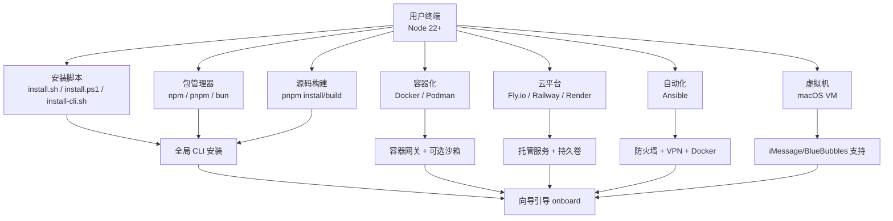
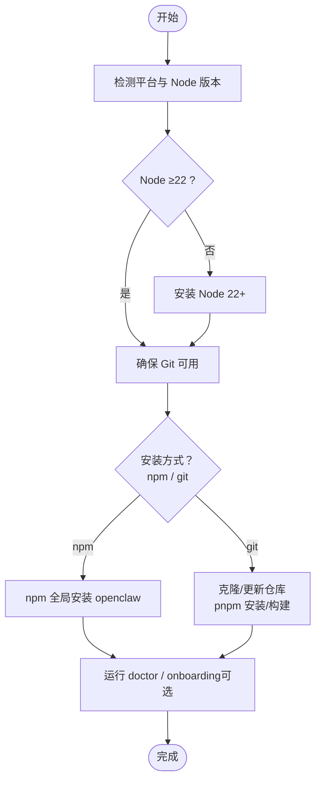
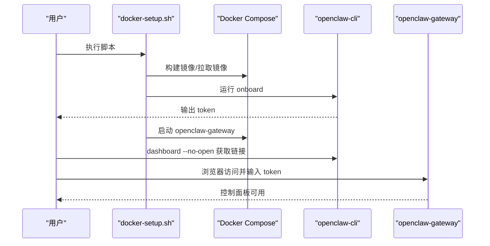
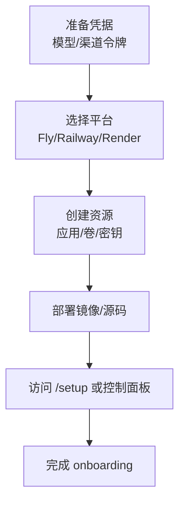
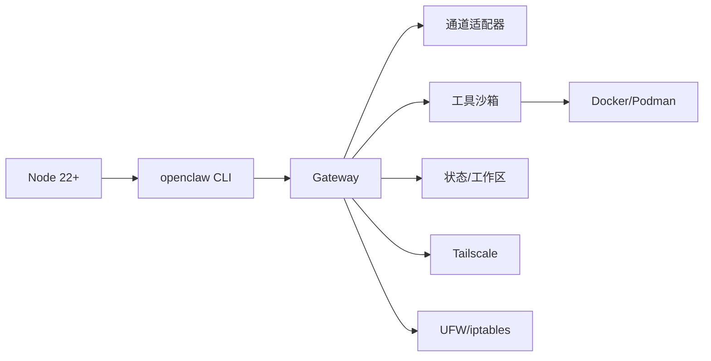

# 安装和设置

<cite>
**本文引用的文件**
- [README.md](file://README.md)
- [docs/install/index.md](file://docs/install/index.md)
- [docs/install/docker.md](file://docs/install/docker.md)
- [docs/install/nix.md](file://docs/install/nix.md)
- [docs/install/podman.md](file://docs/install/podman.md)
- [docs/install/fly.md](file://docs/install/fly.md)
- [docs/install/railway.mdx](file://docs/install/railway.mdx)
- [docs/install/render.mdx](file://docs/install/render.mdx)
- [docs/install/ansible.md](file://docs/install/ansible.md)
- [docs/install/bun.md](file://docs/install/bun.md)
- [docs/install/exe-dev.md](file://docs/install/exe-dev.md)
- [docs/install/macos-vm.md](file://docs/install/macos-vm.md)
- [docs/install/uninstall.md](file://docs/install/uninstall.md)
- [docs/install/updating.md](file://docs/install/updating.md)
- [docs/install/migrating.md](file://docs/install/migrating.md)
- [docs/install/installer.md](file://docs/install/installer.md)
</cite>

## 目录
1. [简介](#简介)
2. [项目结构](#项目结构)
3. [核心组件](#核心组件)
4. [架构总览](#架构总览)
5. [详细组件分析](#详细组件分析)
6. [依赖关系分析](#依赖关系分析)
7. [性能考量](#性能考量)
8. [故障排除指南](#故障排除指南)
9. [结论](#结论)
10. [附录](#附录)

## 简介
本指南面向希望在本地或云端部署 OpenClaw 的用户，覆盖多种安装方式与平台：传统包管理器安装、Docker 容器化部署、Nix 声明式配置、云平台一键部署（Fly.io、Railway、Render）、以及在 macOS 虚拟机中运行等。文档同时提供各安装方式的前置条件、系统要求、配置选项、网络与安全注意事项，并给出安装验证方法、常见问题排查与迁移/卸载/更新流程。

## 项目结构
OpenClaw 提供多条安装路径，既可直接通过 npm/pnpm/bun 安装 CLI，也可使用官方安装脚本自动完成 Node 检测/安装、OpenClaw 安装与向导引导；对于需要隔离或容器化场景，可采用 Docker/Podman 部署；在云平台上，可通过 Fly.io、Railway、Render 等一键部署；企业级生产环境可借助 Ansible 自动化安装并强化安全。

图表来源
- [docs/install/index.md](file://docs/install/index.md#L24-L141)
- [docs/install/docker.md](file://docs/install/docker.md#L35-L240)
- [docs/install/nix.md](file://docs/install/nix.md#L10-L99)
- [docs/install/podman.md](file://docs/install/podman.md#L8-L123)
- [docs/install/fly.md](file://docs/install/fly.md#L10-L120)
- [docs/install/railway.mdx](file://docs/install/railway.mdx#L1-L100)
- [docs/install/render.mdx](file://docs/install/render.mdx#L1-L160)
- [docs/install/ansible.md](file://docs/install/ansible.md#L10-L209)
- [docs/install/bun.md](file://docs/install/bun.md#L9-L60)
- [docs/install/exe-dev.md](file://docs/install/exe-dev.md#L9-L127)
- [docs/install/macos-vm.md](file://docs/install/macos-vm.md#L11-L282)

章节来源
- [docs/install/index.md](file://docs/install/index.md#L14-L141)
- [README.md](file://README.md#L50-L111)

## 核心组件
- 安装脚本：提供跨平台安装体验，自动检测/安装 Node 22+，支持 npm/git 安装方式与非交互模式。
- 包管理器安装：npm/pnpm/bun 直接安装，适合已有 Node 环境的用户。
- 源码构建：从仓库克隆后使用 pnpm 安装依赖、构建 UI 与主程序，适合开发者与自建环境。
- 容器化：Docker/Podman 提供容器网关与可选工具沙箱，便于隔离与快速部署。
- 云平台一键部署：Fly.io、Railway、Render 提供托管服务与持久存储，简化运维。
- 自动化部署：Ansible 提供防火墙、VPN、Docker 与 systemd 组合的安全加固方案。
- 虚拟机：macOS VM（如 Lume）用于需要 iMessage/BlueBubbles 或严格隔离的场景。
- 运维工具：doctor、update、uninstall、migrating 等命令保障升级、迁移与清理。

章节来源
- [docs/install/installer.md](file://docs/install/installer.md#L10-L406)
- [docs/install/docker.md](file://docs/install/docker.md#L9-L240)
- [docs/install/podman.md](file://docs/install/podman.md#L8-L123)
- [docs/install/fly.md](file://docs/install/fly.md#L10-L120)
- [docs/install/railway.mdx](file://docs/install/railway.mdx#L1-L100)
- [docs/install/render.mdx](file://docs/install/render.mdx#L1-L160)
- [docs/install/ansible.md](file://docs/install/ansible.md#L10-L209)
- [docs/install/bun.md](file://docs/install/bun.md#L9-L60)
- [docs/install/exe-dev.md](file://docs/install/exe-dev.md#L9-L127)
- [docs/install/macos-vm.md](file://docs/install/macos-vm.md#L11-L282)
- [docs/install/uninstall.md](file://docs/install/uninstall.md#L9-L129)
- [docs/install/updating.md](file://docs/install/updating.md#L9-L258)
- [docs/install/migrating.md](file://docs/install/migrating.md#L9-L193)

## 架构总览
下图展示了 OpenClaw 在不同安装方式下的典型运行架构与数据流：

```mermaid
graph TB
subgraph "本地安装"
U["用户终端"] --> S["安装脚本/包管理器"]
S --> CLI["openclaw CLI"]
CLI --> GW["Gateway 进程"]
GW --> CH["通道连接<br/>WhatsApp/Telegram/Discord/..."]
GW --> WS["会话/工作区<br/>~/.openclaw"]
end
subgraph "容器化"
U2["用户终端"] --> DC["Docker Compose"]
DC --> GW2["容器网关"]
GW2 --> SB["工具沙箱<br/>Docker"]
GW2 --> WS2["持久卷<br/>/home/node/.openclaw"]
end
subgraph "云平台"
U3["浏览器/CLI"] --> SVC["托管服务<br/>Fly/Railway/Render"]
SVC --> GW3["Gateway 实例"]
GW3 --> VOL["持久盘<br/>/data"]
end
subgraph "自动化"
U4["运维脚本"] --> ANS["Ansible Playbook"]
ANS --> SYS["防火墙/VPN/Docker"]
SYS --> GW4["宿主机 Gateway"]
end
subgraph "虚拟机"
U5["Mac 本机"] --> VM["Lume macOS VM"]
VM --> GW5["VM 内 Gateway"]
GW5 --> BB["BlueBubbles/iMessage"]
end
```

图表来源
- [docs/install/docker.md](file://docs/install/docker.md#L35-L240)
- [docs/install/fly.md](file://docs/install/fly.md#L10-L120)
- [docs/install/railway.mdx](file://docs/install/railway.mdx#L1-L100)
- [docs/install/render.mdx](file://docs/install/render.mdx#L1-L160)
- [docs/install/ansible.md](file://docs/install/ansible.md#L10-L209)
- [docs/install/macos-vm.md](file://docs/install/macos-vm.md#L11-L282)

## 详细组件分析

### 安装脚本（install.sh / install-cli.sh / install.ps1）
- 功能概览：自动检测/安装 Node 22+、Git；支持 npm 与 git 两种安装方式；可选择是否运行 onboarding；支持 dry-run、verbose、环境变量控制。
- 适用场景：交互式安装、CI/自动化、Windows 用户。
- 关键特性：
  - install.sh：推荐的交互式安装，支持 macOS/Linux/WSL。
  - install-cli.sh：将 Node 与 OpenClaw 安装到本地前缀（无需 root），适合受限环境。
  - install.ps1：Windows 平台安装，支持 npm/git 安装方式与非交互模式。
- 常用参数与环境变量参考见“章节来源”。

图表来源
- [docs/install/installer.md](file://docs/install/installer.md#L67-L164)

章节来源
- [docs/install/installer.md](file://docs/install/installer.md#L10-L406)

### 包管理器安装（npm / pnpm / bun）
- npm：最常用方式，适合大多数用户。
- pnpm：构建源码时推荐；首次安装需批准构建脚本。
- bun：实验性，适合本地开发与 watch，不建议用于生产（WhatsApp/Telegram 存在兼容性问题）。
- 注意事项：libvips 冲突时可设置 SHARP_IGNORE_GLOBAL_LIBVIPS=1；Windows 需确保 PATH 包含 npm prefix 输出目录。

章节来源
- [docs/install/index.md](file://docs/install/index.md#L72-L103)
- [docs/install/bun.md](file://docs/install/bun.md#L9-L60)

### 源码构建（开发环境）
- 步骤：克隆仓库 → pnpm 安装 → UI 构建 → 主程序构建 → 运行 onboarding → 开发循环（watch）。
- 适用：贡献者与需要从本地分支运行的用户。

章节来源
- [docs/install/index.md](file://docs/install/index.md#L107-L140)
- [README.md](file://README.md#L92-L111)

### Docker 容器化部署
- 适用场景：需要隔离、快速验证、CI/CD、或在无本地安装的主机上运行。
- 关键点：
  - 容器网关：完整容器化 Gateway，支持 onboarding、dashboard、设备配对。
  - 工具沙箱：在 Docker 中隔离执行工具，支持 per-agent/per-session/shared 等作用域。
  - 环境变量：OPENCLAW_IMAGE、OPENCLAW_SANDBOX、OPENCLAW_DOCKER_SOCKET、OPENCLAW_EXTRA_MOUNTS、OPENCLAW_HOME_VOLUME 等。
  - 安全：默认非 root 用户运行；注意权限与端口映射；VPS 上需遵循网络安全加固指南。
  - 健康检查：/healthz 与 /readyz；容器内置 HEALTHCHECK。
- 建议：先使用 docker-setup.sh 快速启动，再按需启用沙箱与额外挂载。

图表来源
- [docs/install/docker.md](file://docs/install/docker.md#L35-L240)

章节来源
- [docs/install/docker.md](file://docs/install/docker.md#L9-L844)

### Podman（rootless 容器）
- 适用场景：偏好 Podman、需要 rootless 运行、或在不支持 Docker 的环境中。
- 关键点：
  - setup-podman.sh 一次性设置：创建 openclaw 用户、构建镜像、生成启动脚本。
  - 可选 systemd Quadlet：以用户服务方式开机自启与自动重启。
  - 环境变量：OPENCLAW_PODMAN_*、OPENCLAW_CONFIG_DIR、OPENCLAW_WORKSPACE_DIR 等。
  - 存储模型：主机目录持久化；沙箱容器 tmpfs 短暂挂载。
- 建议：首次运行使用 setup-podman.sh，后续通过 run-openclaw-podman.sh 启动。

章节来源
- [docs/install/podman.md](file://docs/install/podman.md#L8-L123)

### Nix 声明式安装
- 适用场景：追求可复现、可回滚、声明式管理的用户与团队。
- 关键点：
  - 使用 nix-openclaw（Home Manager 模块）进行安装与配置。
  - Nix 模式下禁用自动安装与自变更，强调确定性与可审计性。
  - 环境变量：OPENCLAW_STATE_DIR、OPENCLAW_CONFIG_PATH、OPENCLAW_HOME 等需指向 Nix 管理位置。
- 建议：结合 nix-openclaw 仓库的完整指南进行配置。

章节来源
- [docs/install/nix.md](file://docs/install/nix.md#L10-L99)

### 云平台一键部署
- Fly.io：通过 flyctl 创建应用、创建持久卷、设置密钥、部署；支持公网/私网部署与隧道访问。
- Railway：一键模板，通过 /setup 网页向导完成配置；支持持久卷与备份导出。
- Render：Blueprint 声明式定义服务、磁盘、环境变量；支持健康检查与自定义域名。
- 共同点：均提供持久存储、健康检查、环境变量注入与备份导出能力。

图表来源
- [docs/install/fly.md](file://docs/install/fly.md#L10-L120)
- [docs/install/railway.mdx](file://docs/install/railway.mdx#L1-L100)
- [docs/install/render.mdx](file://docs/install/render.mdx#L1-L160)

章节来源
- [docs/install/fly.md](file://docs/install/fly.md#L10-L491)
- [docs/install/railway.mdx](file://docs/install/railway.mdx#L1-L100)
- [docs/install/render.mdx](file://docs/install/render.mdx#L1-L160)

### 自动化部署（Ansible）
- 适用场景：生产服务器自动化、安全加固、防火墙隔离与 VPN 访问。
- 关键点：
  - 安装 Tailscale、UFW、Docker、Node.js 22、pnpm、OpenClaw。
  - systemd 服务自启动与安全硬化（NoNewPrivileges、PrivateTmp 等）。
  - 仅暴露 SSH 与 Tailscale，Gateway 仅通过 VPN 访问。
- 建议：使用 openclaw-ansible 仓库的完整指南与 playbook。

章节来源
- [docs/install/ansible.md](file://docs/install/ansible.md#L10-L209)

### 虚拟机部署（macOS VM）
- 适用场景：需要 iMessage/BlueBubbles、严格隔离或可重置环境。
- 方案：Lume 在本机 Apple Silicon Mac 上创建 macOS VM；或使用托管 Mac 供应商。
- 关键点：
  - 通过 BlueBubbles 将 iMessage 接入 OpenClaw。
  - 支持快照/克隆，便于重置与对比。
  - 建议保持 VM 常开或使用 dedicated 硬件以获得稳定体验。

章节来源
- [docs/install/macos-vm.md](file://docs/install/macos-vm.md#L11-L282)

### exe.dev（VM + HTTPS 代理）
- 适用场景：低成本、始终在线的 Linux VM 作为 Gateway，配合 exe.dev 的 HTTPS 与代理转发。
- 关键点：
  - 使用 Shelley Agent 一键安装 OpenClaw。
  - 通过 nginx 反代 WebSocket，将端口 18789 暴露至 80/443。
  - 通过 token 或 pairing 完成授权与设备批准。

章节来源
- [docs/install/exe-dev.md](file://docs/install/exe-dev.md#L9-L127)

## 依赖关系分析
- 运行时依赖：Node 22+（安装脚本会自动处理）；pnpm 仅在源码构建时需要。
- 平台差异：
  - macOS/Linux/WSL：install.sh 最佳体验；也可用 npm/pnpm/bun。
  - Windows：install.ps1；需确保 PATH 包含 npm prefix 输出目录。
- 容器依赖：Docker/Podman；沙箱需 Docker CLI 支持（可选）。
- 云平台依赖：flyctl、Railway CLI、Render Blueprint。
- 安全依赖：Tailscale（Ansible 场景）、UFW、iptables DOCKER-USER 链。

图表来源
- [docs/install/docker.md](file://docs/install/docker.md#L545-L790)
- [docs/install/ansible.md](file://docs/install/ansible.md#L87-L111)

章节来源
- [docs/install/index.md](file://docs/install/index.md#L14-L22)
- [docs/install/docker.md](file://docs/install/docker.md#L26-L34)
- [docs/install/ansible.md](file://docs/install/ansible.md#L35-L53)

## 性能考量
- 内存与磁盘：容器/云平台部署建议至少 2GB RAM；关注媒体、会话日志与 cron 输出的磁盘增长热点。
- 构建缓存：Dockerfile 层顺序优化可减少 pnpm install 重跑次数。
- 浏览器与沙箱：容器内浏览器默认启用安全限制（如禁用 GPU/扩展），如需 WebGL/3D 或扩展支持，可调整相关环境变量。
- 并发与并发限制：根据负载调整 Gateway 并发与沙箱资源限制（CPU/内存/ulimits）。

章节来源
- [docs/install/docker.md](file://docs/install/docker.md#L405-L436)
- [docs/install/docker.md](file://docs/install/docker.md#L702-L789)
- [docs/install/fly.md](file://docs/install/fly.md#L259-L277)

## 故障排除指南
- “openclaw”未找到：
  - 检查 npm prefix 输出目录是否在 PATH 中；macOS/Linux 使用 $(npm prefix -g)/bin，Windows 使用 $(npm prefix -g)。
  - 重新加载 shell 或执行 rehash/hash -r。
- PATH 诊断与修复：使用提供的诊断命令输出 Node/npm/prefix/PATH，确认 prefix/bin 是否存在。
- Windows：确保 PATH 包含 npm prefix 输出目录；必要时以管理员权限添加。
- 容器权限错误（EACCES）：确保主机挂载目录拥有正确的 uid/gid（默认 node 用户 uid 1000）。
- Docker/Podman 端口/网络：确认 bind 模式与端口映射；LAN vs loopback 的区别。
- 云平台健康检查失败：确保 internal_port 与进程绑定端口一致；内存不足会导致 OOM。
- 升级后异常：运行 openclaw doctor；必要时回滚到已知版本或切换到稳定通道。
- 迁移后配置不生效：确认新机器使用相同的 profile/state 目录；检查文件所有权与权限。

章节来源
- [docs/install/index.md](file://docs/install/index.md#L181-L204)
- [docs/install/docker.md](file://docs/install/docker.md#L392-L404)
- [docs/install/podman.md](file://docs/install/podman.md#L111-L119)
- [docs/install/fly.md](file://docs/install/fly.md#L245-L327)
- [docs/install/updating.md](file://docs/install/updating.md#L206-L258)
- [docs/install/migrating.md](file://docs/install/migrating.md#L133-L178)

## 结论
OpenClaw 提供从本地到云端、从单机到容器化的多样化安装路径。对于个人用户，推荐使用安装脚本或包管理器进行快速安装；对于需要隔离与自动化的企业用户，Docker/Podman 与 Ansible 是更稳妥的选择；云平台一键部署则适合希望最小化运维成本的场景。无论采用哪种方式，都应重视安全加固、持久化存储与健康监控，并在升级与迁移时遵循文档建议的流程。

## 附录

### 安装验证清单
- 运行 openclaw doctor：检查配置与潜在风险。
- 运行 openclaw status：确认 Gateway 状态。
- 打开浏览器访问 dashboard：验证控制面板可用。
- 设备配对：使用 openclaw devices list 与 approve 完成授权。
- 健康检查：容器环境使用 /healthz 与 /readyz；云平台检查服务日志与健康检查结果。

章节来源
- [docs/install/index.md](file://docs/install/index.md#L163-L180)
- [docs/install/docker.md](file://docs/install/docker.md#L469-L495)
- [docs/install/fly.md](file://docs/install/fly.md#L245-L247)

### 卸载与迁移
- 卸载：优先使用 openclaw uninstall；若服务仍在运行，按平台手动停止并移除服务单元/计划任务。
- 迁移：复制 $OPENCLAW_STATE_DIR 与 workspace；在新机器安装后运行 doctor 并重启 Gateway；注意 profile 与权限一致性。

章节来源
- [docs/install/uninstall.md](file://docs/install/uninstall.md#L9-L129)
- [docs/install/migrating.md](file://docs/install/migrating.md#L9-L193)