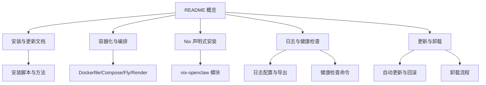
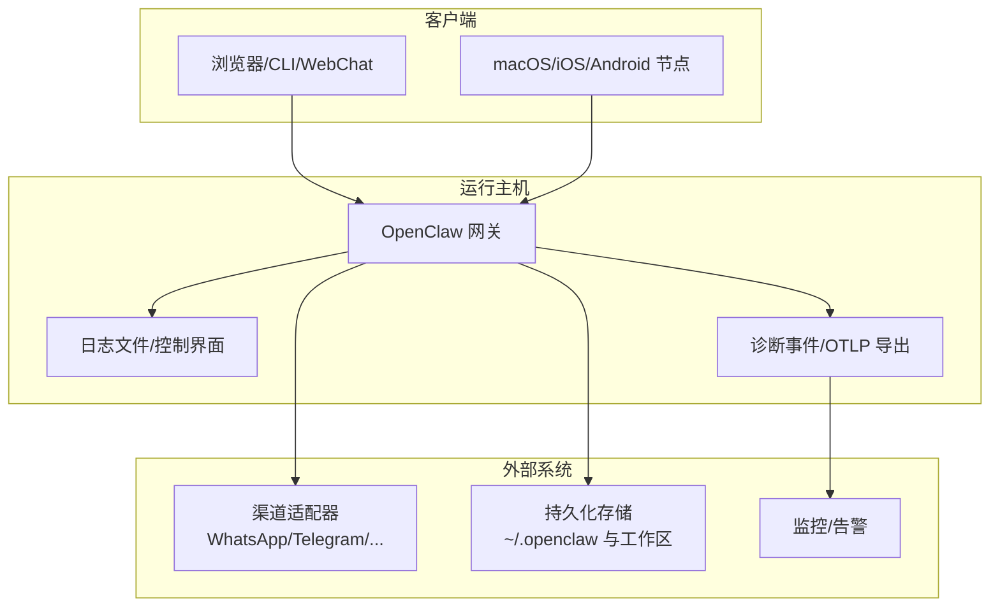
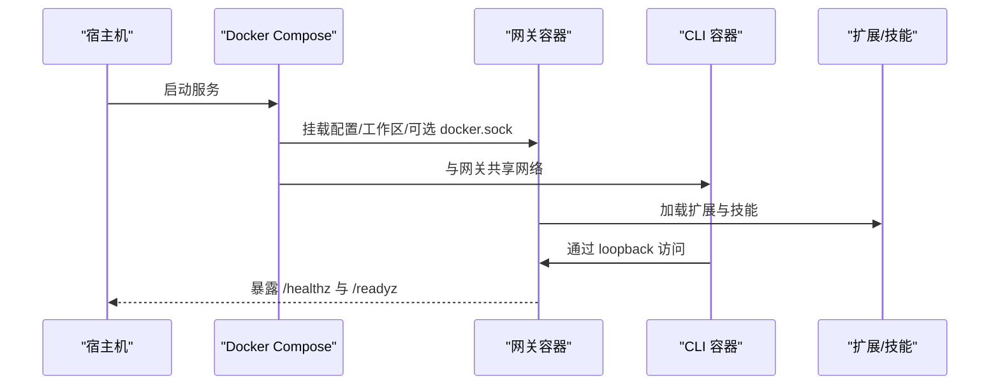
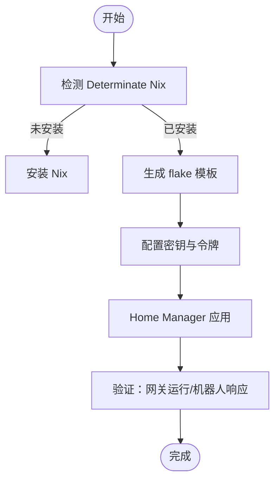
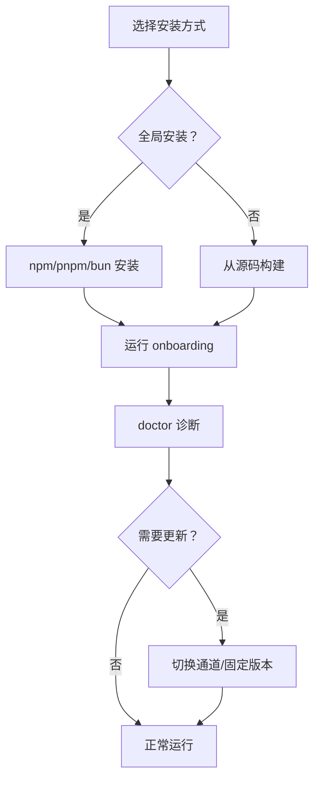
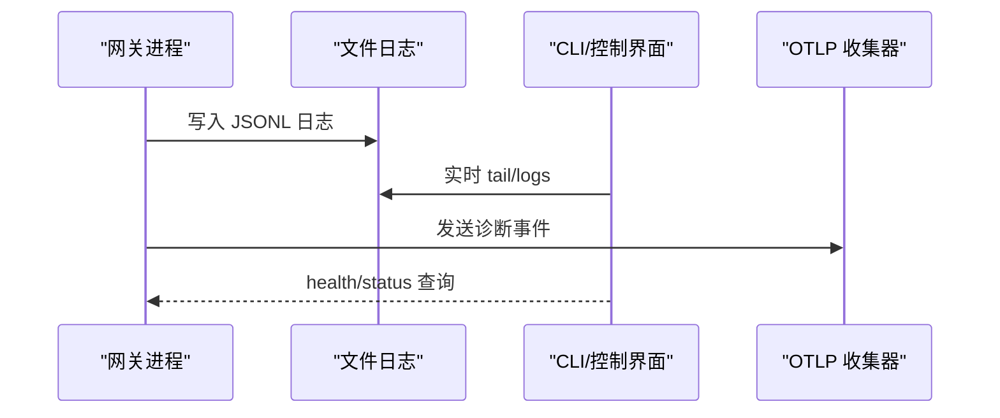
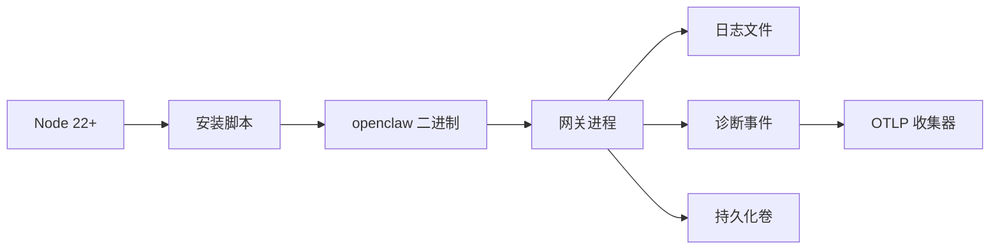

# 部署和运维

<cite>
**本文引用的文件**
- [README.md](file://README.md)
- [Dockerfile](file://Dockerfile)
- [docker-compose.yml](file://docker-compose.yml)
- [fly.toml](file://fly.toml)
- [render.yaml](file://render.yaml)
- [setup-podman.sh](file://scripts/setup-podman.sh)
- [docs/install/docker.md](file://docs/install/docker.md)
- [docs/install/nix.md](file://docs/install/nix.md)
- [docs/install/index.md](file://docs/install/index.md)
- [docs/gateway/health.md](file://docs/gateway/health.md)
- [docs/logging.md](file://docs/logging.md)
- [docs/install/updating.md](file://docs/install/updating.md)
- [docs/install/uninstall.md](file://docs/install/uninstall.md)
- [scripts/install.sh](file://scripts/install.sh)
- [scripts/systemd/openclaw-auth-monitor.service](file://scripts/systemd/openclaw-auth-monitor.service)
</cite>

## 目录
1. [简介](#简介)
2. [项目结构](#项目结构)
3. [核心组件](#核心组件)
4. [架构总览](#架构总览)
5. [详细组件分析](#详细组件分析)
6. [依赖关系分析](#依赖关系分析)
7. [性能考量](#性能考量)
8. [故障排除指南](#故障排除指南)
9. [结论](#结论)
10. [附录](#附录)

## 简介
本指南面向生产环境的 OpenClaw 部署与运维，覆盖多种部署方式（Docker 容器化、Nix 声明式、传统安装）以及多平台（Linux、macOS、Windows）的最佳实践；同时提供监控与日志体系、备份与恢复策略、安全加固建议、故障排除手册与常见问题解答，帮助您稳定、可审计地运行 OpenClaw。

## 项目结构
OpenClaw 提供了从本地安装到容器化与云平台的一体化部署路径，并配套丰富的文档与脚本工具：
- 安装与更新：支持 npm/pnpm/bun 全局安装、从源码构建、一键安装脚本、自动更新与回滚。
- 容器化：官方 Dockerfile、docker-compose 编排、Fly.io 与 Render 平台配置示例。
- 声明式安装：通过 nix-openclaw 在 Nix/NixOS 上实现可复现、可回滚的安装。
- 运维工具：日志、健康检查、更新、卸载、认证监控服务单元等。

章节来源
- file://README.md#L1-L560

## 核心组件
- 容器镜像与健康探针：Dockerfile 内置健康检查端点与非 root 用户运行，适合在 Docker、Buildx、Podman 等环境中使用。
- Compose 编排：docker-compose.yml 将网关与 CLI 容器组合，支持持久化配置与工作区、沙箱 Docker CLI 可选挂载。
- 云平台配置：fly.toml 与 render.yaml 展示了在 Fly.io 与 Render 上的部署参数与磁盘挂载。
- 安装与更新：scripts/install.sh 提供一键安装、构建工具检测与自动修复、版本通道切换与更新流程。
- 日志与诊断：docs/logging.md 详述文件日志、控制界面、OTLP 导出与诊断标志。
- 健康检查：docs/gateway/health.md 提供状态、深度诊断与常见问题处理步骤。
- 卸载与回滚：docs/install/uninstall.md 与 docs/install/updating.md 提供完整卸载与回滚策略。

章节来源
- file://Dockerfile#L224-L231
- file://docker-compose.yml#L1-L77
- file://fly.toml#L1-L35
- file://render.yaml#L1-L22
- file://scripts/install.sh#L1-L800
- file://docs/logging.md#L1-L353
- file://docs/gateway/health.md#L1-L36
- file://docs/install/uninstall.md#L1-L129
- file://docs/install/updating.md#L1-L258

## 架构总览
下图展示了 OpenClaw 的典型生产部署形态：容器或虚拟机承载网关，通过本地或远程客户端连接；日志与诊断输出用于监控与排障。

## 详细组件分析

### Docker 容器化部署
- 镜像与运行
  - 使用官方 Dockerfile 构建最小运行时镜像，默认以非 root 用户运行，内置健康检查端点。
  - 支持通过 build-arg 注入扩展、系统包、浏览器与 Docker CLI，满足沙箱与自动化需求。
- 编排与持久化
  - docker-compose.yml 将网关与 CLI 容器组合，挂载配置与工作区目录，支持按需启用沙箱 Docker CLI。
  - 云平台示例：fly.toml（Fly.io）与 render.yaml（Render）展示端口、内存、磁盘挂载与健康检查路径。
- 最佳实践
  - 绑定模式：默认 loopback，若需外网访问需改为 lan 并设置鉴权。
  - 浏览器与 Playwright：可在镜像中预装 Chromium，减少启动时下载时间。
  - 沙箱：启用 agents.defaults.sandbox 时，需在镜像中安装 Docker CLI 或在宿主挂载 docker.sock。

图表来源
- [Dockerfile](file://Dockerfile#L224-L231)
- [docker-compose.yml](file://docker-compose.yml#L1-L77)
- [fly.toml](file://fly.toml#L1-L35)
- [render.yaml](file://render.yaml#L1-L22)

章节来源
- file://Dockerfile#L1-L231
- file://docker-compose.yml#L1-L77
- file://docs/install/docker.md#L1-L844
- file://fly.toml#L1-L35
- file://render.yaml#L1-L22

### Nix 声明式安装
- nix-openclaw 模块提供可复现、可回滚的安装体验，适用于 macOS 与 NixOS。
- Nix 模式下禁用自安装与自我变异，确保配置确定性与可审计性。
- 推荐设置 OPENCLAW_STATE_DIR、OPENCLAW_CONFIG_PATH 等路径指向 Nix 管理位置。

图表来源
- [docs/install/nix.md](file://docs/install/nix.md#L1-L99)

章节来源
- file://docs/install/nix.md#L1-L99

### 传统安装与更新
- 一键安装脚本：支持 macOS/Linux，自动检测 Node 版本、必要构建工具并进行安装。
- 更新策略：推荐重新执行网站安装脚本进行就地升级；支持通道切换（stable/beta/dev）与自动更新配置。
- 回滚：可通过固定版本或基于日期的 Git 提交回退。

图表来源
- [scripts/install.sh](file://scripts/install.sh#L1-L800)
- [docs/install/updating.md](file://docs/install/updating.md#L1-L258)
- [docs/install/index.md](file://docs/install/index.md#L1-L219)

章节来源
- file://scripts/install.sh#L1-L800
- file://docs/install/updating.md#L1-L258
- file://docs/install/index.md#L1-L219

### 监控与日志体系
- 文件日志：默认写入 /tmp/openclaw/openclaw-YYYY-MM-DD.log，支持 JSONL 结构与 CLI/控制界面实时查看。
- 控制界面：通过 Logs 标签页实时跟踪日志。
- 诊断与 OTLP：可启用诊断事件并通过 diagnostics-otel 插件导出至任意 OTLP 收集器。
- 健康检查：CLI 提供 status/health 命令与 /healthz、/readyz 探针端点。

图表来源
- [docs/logging.md](file://docs/logging.md#L1-L353)
- [docs/gateway/health.md](file://docs/gateway/health.md#L1-L36)
- [Dockerfile](file://Dockerfile#L224-L231)

章节来源
- file://docs/logging.md#L1-L353
- file://docs/gateway/health.md#L1-L36
- file://Dockerfile#L224-L231

### 备份与恢复策略
- 配置备份：~/.openclaw/openclaw.json 与 credentials 目录。
- 工作区备份：~/.openclaw/workspace。
- 数据迁移：通过 Compose 挂载卷或云平台磁盘挂载实现跨主机迁移。
- 灾难恢复：结合卸载与重装流程，配合固定版本回滚与通道切换。

章节来源
- file://docs/install/uninstall.md#L1-L129
- file://docs/install/updating.md#L1-L258
- file://docker-compose.yml#L12-L14

### 安全加固指南
- 网络暴露与防火墙：仅在受信网络内暴露端口，必要时使用 Tailscale Serve/Funnel 或 SSH 隧道。
- 鉴权与令牌：设置 OPENCLAW_GATEWAY_TOKEN，避免 loopback 绑定导致的外网可达风险。
- 非 root 运行：容器默认以 node 用户运行，降低权限提升风险。
- 服务单元与认证监控：systemd 用户服务与定时任务可用于认证过期提醒与通知。

章节来源
- file://Dockerfile#L211-L214
- file://scripts/systemd/openclaw-auth-monitor.service#L1-L15
- file://docs/install/docker.md#L26-L34

### 故障排除手册
- 常见症状与处理
  - 网关不可达：检查服务状态、端口占用与绑定模式；必要时使用 --force 强制重启。
  - 渠道断连：根据日志中的 409–515 或 logged out 状态执行 relink 流程。
  - 权限问题：确认宿主机挂载目录属主为 UID 1000。
- 诊断工具
  - openclaw status/health --json 获取运行态快照。
  - openclaw logs --follow 实时查看日志。
  - docker compose exec 执行容器内诊断命令。

章节来源
- file://docs/gateway/health.md#L1-L36
- file://docs/logging.md#L1-L353
- file://docs/install/docker.md#L462-L532

## 依赖关系分析
- 安装与运行
  - Node 22+ 为运行时要求；npm/pnpm/bun 用于安装与开发。
  - 一键安装脚本会自动检测并安装构建工具（make/cmake/gcc 等）。
- 容器与编排
  - Dockerfile 依赖 node:22-bookworm 镜像；Compose 通过卷挂载持久化配置与工作区。
  - 云平台配置示例定义了端口、内存、磁盘挂载与健康检查路径。
- 诊断与监控
  - 诊断事件可导出至 OTLP 收集器；日志级别与脱敏策略可配置。

图表来源
- [scripts/install.sh](file://scripts/install.sh#L1-L800)
- [Dockerfile](file://Dockerfile#L1-L231)
- [docker-compose.yml](file://docker-compose.yml#L1-L77)
- [docs/logging.md](file://docs/logging.md#L1-L353)

章节来源
- file://scripts/install.sh#L1-L800
- file://Dockerfile#L1-L231
- file://docker-compose.yml#L1-L77
- file://docs/logging.md#L1-L353

## 性能考量
- 容器镜像层优化：将依赖安装置于缓存友好的顺序，避免无关变更触发重建。
- 浏览器与 Playwright：在镜像中预装 Chromium 可显著降低首次启动延迟。
- 资源限制：Fly.io 与 Render 示例展示了 CPU/内存与磁盘大小的合理配置。
- 日志与诊断：高吞吐场景建议通过 OTLP 采样与过滤减轻后端压力。

## 故障排除指南
- 症状：网关不可达
  - 步骤：openclaw status、openclaw gateway restart、检查端口占用。
- 症状：渠道断连/登录失效
  - 步骤：openclaw channels logout && openclaw channels login；核对 allowFrom 与群组规则。
- 症状：容器内权限错误
  - 步骤：确保挂载目录属主为 UID 1000；或调整宿主机权限。
- 症状：日志为空
  - 步骤：确认网关正在运行、日志文件路径正确、提升日志级别为 debug/trace。

章节来源
- file://docs/gateway/health.md#L1-L36
- file://docs/logging.md#L1-L353
- file://docs/install/docker.md#L392-L404

## 结论
通过统一的安装脚本、容器化与云平台配置、完善的日志与诊断体系，以及明确的备份与回滚策略，OpenClaw 能够在多平台上实现稳定、可观测且可审计的生产级部署。建议在上线前完成绑定模式与鉴权配置审查，并建立定期健康检查与日志巡检机制。

## 附录
- 平台最佳实践
  - Linux：使用 systemd 用户服务与持久化卷；确保 systemd linger 以支持注销后运行。
  - macOS：使用 nix-openclaw 或安装脚本；注意 Info.plist 与签名以保持权限持久。
  - Windows：优先使用 WSL2 运行 OpenClaw，避免原生 Windows 的兼容性问题。
- 自动化运维
  - 使用 systemd timer 或 Cron 触发认证监控服务单元，提前预警令牌过期。
  - 在 CI 中使用 docker compose run -T 非交互模式执行 CLI 命令，避免伪终端噪声。

章节来源
- file://scripts/systemd/openclaw-auth-monitor.service#L1-L15
- file://docs/install/docker.md#L117-L129
- file://docs/install/nix.md#L1-L99