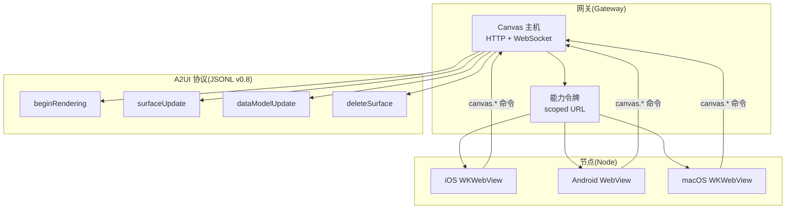
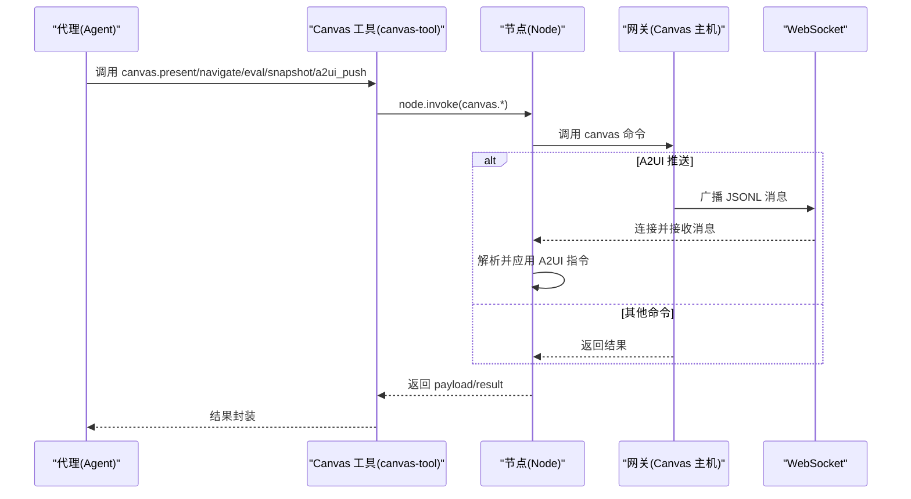
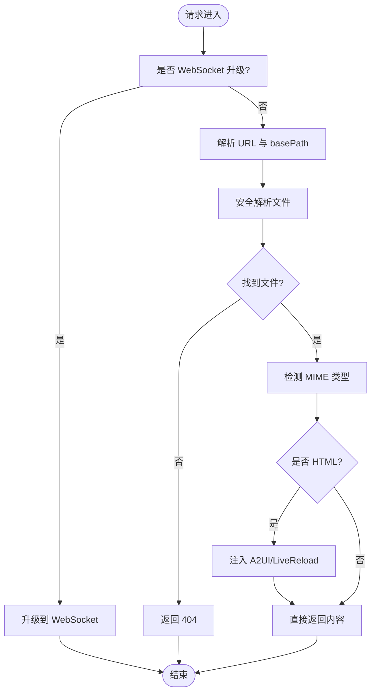
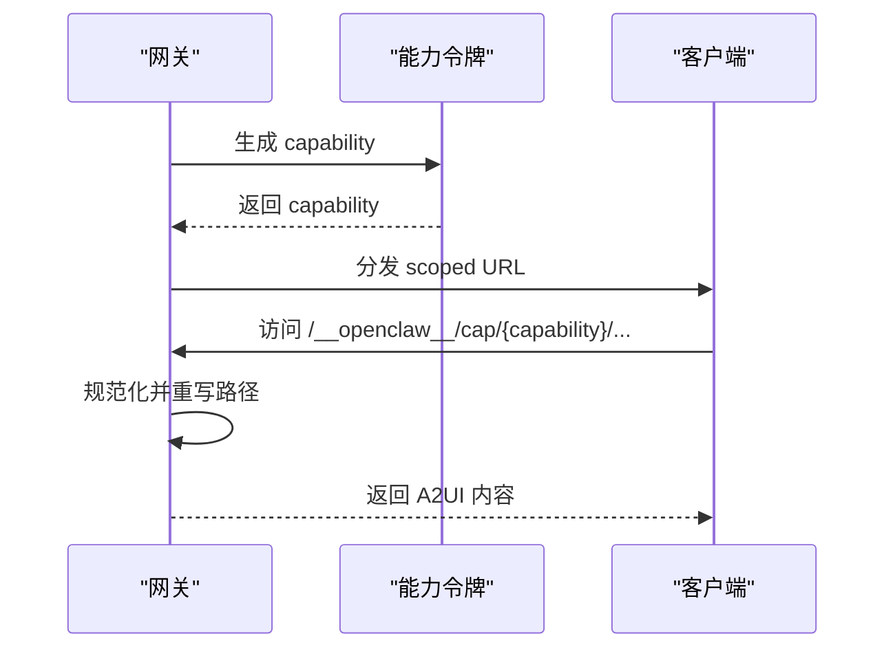
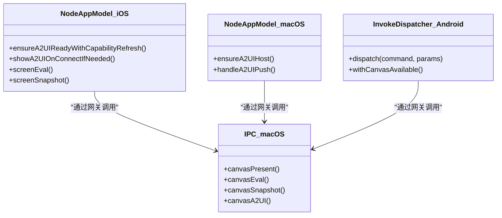
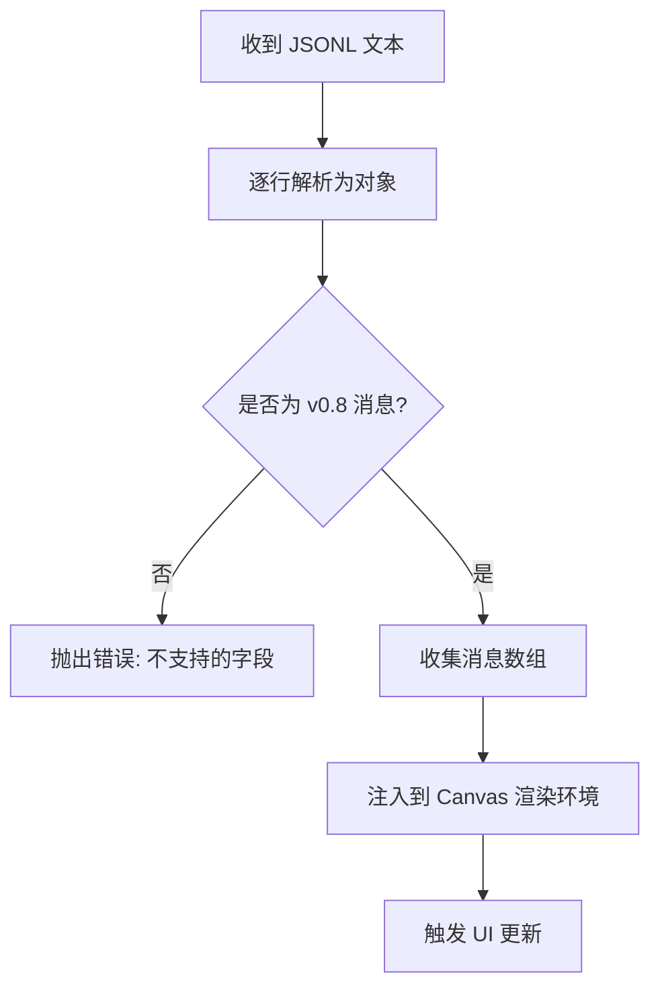
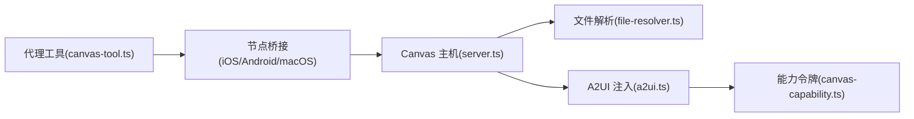

# Canvas 可视化工作区

<cite>
**本文引用的文件**
- [server.ts](file://src/canvas-host/server.ts)
- [a2ui.ts](file://src/canvas-host/a2ui.ts)
- [file-resolver.ts](file://src/canvas-host/file-resolver.ts)
- [canvas-capability.ts](file://src/gateway/canvas-capability.ts)
- [canvas-host-url.ts](file://src/infra/canvas-host-url.ts)
- [canvas-tool.ts](file://src/agents/tools/canvas-tool.ts)
- [nodes-canvas.ts](file://src/cli/nodes-canvas.ts)
- [canvas.md](file://docs/platforms/mac/canvas.md)
- [CanvasA2UIAction.swift](file://apps/shared/OpenClawKit/Sources/OpenClawKit/CanvasA2UIAction.swift)
- [CanvasA2UICommands.swift](file://apps/shared/OpenClawKit/Sources/OpenClawKit/CanvasA2UICommands.swift)
- [CanvasA2UIJSONL.swift](file://apps/shared/OpenClawKit/Sources/OpenClawKit/CanvasA2UIJSONL.swift)
- [CanvasA2UIActionMessageHandler.swift](file://apps/macos/Sources/OpenClaw/CanvasA2UIActionMessageHandler.swift)
- [MacNodeRuntime.swift](file://apps/macos/Sources/OpenClaw/NodeMode/MacNodeRuntime.swift)
- [NodeAppModel.swift](file://apps/ios/Sources/Model/NodeAppModel.swift)
- [NodeAppModel+Canvas.swift](file://apps/ios/Sources/Model/NodeAppModel+Canvas.swift)
- [OpenClawCanvasA2UIAction.kt](file://apps/android/app/src/main/java/ai/openclaw/app/protocol/OpenClawCanvasA2UIAction.kt)
- [InvokeDispatcher.kt](file://apps/android/app/src/main/java/ai/openclaw/app/node/InvokeDispatcher.kt)
- [IPC.swift](file://apps/macos/Sources/OpenClawIPC/IPC.swift)
</cite>

## 目录
1. [简介](#简介)
2. [项目结构](#项目结构)
3. [核心组件](#核心组件)
4. [架构总览](#架构总览)
5. [详细组件分析](#详细组件分析)
6. [依赖关系分析](#依赖关系分析)
7. [性能考虑](#性能考虑)
8. [故障排查指南](#故障排查指南)
9. [结论](#结论)
10. [附录](#附录)

## 简介
本文件面向 OpenClaw 的 Canvas 可视化工作区系统，系统性阐述基于 Canvas 的可视化工作空间架构，涵盖 A2UI（Agent-to-User Interface）主机实现、实时渲染引擎与跨平台适配机制。文档重点说明 Canvas API 接口、绘图命令规范、事件处理机制与性能优化策略，并覆盖 macOS、iOS、Android 平台的集成实现、屏幕录制能力与用户交互处理。同时解释 Canvas 与代理系统的协作模式、数据绑定机制与动态更新策略，提供开发示例、调试工具与性能监控方法，帮助开发者构建丰富的可视化应用。

## 项目结构
Canvas 工作区由“网关侧 Canvas 主机”“跨平台节点侧桥接层”“A2UI 渲染协议”三部分协同构成：
- 网关侧：提供 Canvas 静态资源托管、A2UI 资产分发、WebSocket 实时推送与能力令牌管理。
- 节点侧：在各平台以 WebView 或原生控件承载 Canvas，暴露统一的 Canvas 命令接口，支持 present/hide/navigate/eval/snapshot/a2ui_push/a2ui_reset。
- A2UI 协议：以 JSONL 流形式传输 UI 渲染指令，当前版本支持 v0.8 的 beginRendering/surfaceUpdate/dataModelUpdate/deleteSurface。

图表来源
- [server.ts:1-479](file://src/canvas-host/server.ts#L1-L479)
- [a2ui.ts:1-210](file://src/canvas-host/a2ui.ts#L1-L210)
- [canvas-capability.ts:1-88](file://src/gateway/canvas-capability.ts#L1-L88)
- [canvas.md:1-126](file://docs/platforms/mac/canvas.md#L1-L126)

章节来源
- [server.ts:1-479](file://src/canvas-host/server.ts#L1-L479)
- [a2ui.ts:1-210](file://src/canvas-host/a2ui.ts#L1-L210)
- [canvas-capability.ts:1-88](file://src/gateway/canvas-capability.ts#L1-L88)
- [canvas-host-url.ts:1-94](file://src/infra/canvas-host-url.ts#L1-L94)
- [canvas.md:1-126](file://docs/platforms/mac/canvas.md#L1-L126)

## 核心组件
- Canvas 主机（Node 侧静态资源服务）
  - 提供 HTTP 服务与 WebSocket 升级，支持自动重载与 A2UI 注入。
  - 默认根目录位于应用状态目录下的 canvas 子目录，支持自定义 basePath。
- A2UI 主机（网关侧）
  - 托管 A2UI 资产（index.html 与打包脚本），注入跨平台动作桥接与 WebSocket 自动刷新。
  - 支持 capability 令牌生成与 scoped URL 规范化，确保安全访问。
- 跨平台 Canvas 命令桥接
  - iOS/Android/macOS 统一通过 IPC/桥接发送 canvas.* 命令到网关，再由 Canvas 主机响应。
  - 支持 present/hide/navigate/eval/snapshot/a2ui_push/a2ui_reset。
- A2UI JSONL 协议
  - 以每行一条 JSON 对象的流式格式传输 UI 指令，当前仅支持 v0.8 消息集。

章节来源
- [server.ts:205-397](file://src/canvas-host/server.ts#L205-L397)
- [a2ui.ts:14-79](file://src/canvas-host/a2ui.ts#L14-L79)
- [canvas-capability.ts:20-87](file://src/gateway/canvas-capability.ts#L20-L87)
- [CanvasA2UICommands.swift:1-26](file://apps/shared/OpenClawKit/Sources/OpenClawKit/CanvasA2UICommands.swift#L1-L26)
- [IPC.swift:101-138](file://apps/macos/Sources/OpenClawIPC/IPC.swift#L101-L138)

## 架构总览
Canvas 工作区采用“网关-节点-协议”三层架构：
- 网关负责 Canvas 主机与 A2UI 资产托管、能力令牌与 WebSocket 升级；节点侧通过 WebView/原生控件承载 Canvas。
- 代理通过工具或 CLI 发起 canvas 命令，节点侧解析并调用网关 Canvas 主机，实现 UI 展示、脚本执行与快照捕获。
- A2UI 通过 JSONL 流驱动 Canvas 动态渲染，节点侧将消息转换为平台特定的渲染指令。

图表来源
- [canvas-tool.ts:80-216](file://src/agents/tools/canvas-tool.ts#L80-L216)
- [server.ts:416-442](file://src/canvas-host/server.ts#L416-L442)
- [a2ui.ts:142-209](file://src/canvas-host/a2ui.ts#L142-L209)

章节来源
- [canvas-tool.ts:80-216](file://src/agents/tools/canvas-tool.ts#L80-L216)
- [server.ts:399-479](file://src/canvas-host/server.ts#L399-L479)
- [a2ui.ts:142-209](file://src/canvas-host/a2ui.ts#L142-L209)

## 详细组件分析

### Canvas 主机（Node 侧静态资源服务）
- 功能要点
  - HTTP 服务器：解析请求路径，定位文件并返回内容，支持 HEAD/GET，自动注入 A2UI 与 Live Reload。
  - WebSocket 升级：在指定路径上建立连接，用于向客户端推送“reload”指令触发页面刷新。
  - 文件解析器：限制路径遍历，仅允许在 root 目录内访问，避免符号链接与越权读取。
  - A2UI 注入：在 HTML 中注入跨平台动作桥接与 WebSocket 自动刷新逻辑。
- 性能与安全
  - 使用 chokidar 监听文件变更，带去抖与写入完成检测，降低频繁刷新对性能的影响。
  - 严格的安全打开策略，防止目录穿越与符号链接攻击。
- 关键路径
  - 创建处理器与启动服务器：[createCanvasHostHandler:205-397](file://src/canvas-host/server.ts#L205-L397)，[startCanvasHost:399-479](file://src/canvas-host/server.ts#L399-L479)
  - 请求处理与升级：[handleHttpRequest:301-379](file://src/canvas-host/server.ts#L301-L379)，[handleUpgrade:287-299](file://src/canvas-host/server.ts#L287-L299)
  - 文件解析与安全打开：[resolveFileWithinRoot:11-50](file://src/canvas-host/file-resolver.ts#L11-L50)

图表来源
- [server.ts:301-379](file://src/canvas-host/server.ts#L301-L379)
- [file-resolver.ts:11-50](file://src/canvas-host/file-resolver.ts#L11-L50)
- [a2ui.ts:81-140](file://src/canvas-host/a2ui.ts#L81-L140)

章节来源
- [server.ts:205-397](file://src/canvas-host/server.ts#L205-L397)
- [file-resolver.ts:1-51](file://src/canvas-host/file-resolver.ts#L1-L51)
- [a2ui.ts:81-140](file://src/canvas-host/a2ui.ts#L81-L140)

### A2UI 主机与能力令牌
- A2UI 主机
  - 托管 A2UI 资产目录，提供 /__openclaw__/a2ui/ 路径下的静态资源，自动注入跨平台动作桥接与 WebSocket 自动刷新。
  - 当资产缺失时返回 503，便于诊断。
- 能力令牌与 Scoped URL
  - 生成随机 capability 字符串，构建带 capability 的 scoped URL，规范化后剥离 capability 并重写路径，确保访问受控且可追踪。
  - 支持 TTL 控制与错误路径识别，保障安全性与可用性。

图表来源
- [a2ui.ts:142-209](file://src/canvas-host/a2ui.ts#L142-L209)
- [canvas-capability.ts:20-87](file://src/gateway/canvas-capability.ts#L20-L87)

章节来源
- [a2ui.ts:14-79](file://src/canvas-host/a2ui.ts#L14-L79)
- [canvas-capability.ts:1-88](file://src/gateway/canvas-capability.ts#L1-L88)

### 跨平台 Canvas 命令桥接
- iOS
  - 通过 NodeAppModel+Canvas.swift 管理 A2UI 就绪状态与导航，支持本地/远程 Canvas 切换与 ready 状态等待。
  - 通过 NodeAppModel.swift 处理 canvas.* 命令，支持 snapshot、eval 等。
- Android
  - 通过 InvokeDispatcher.kt 解析命令参数，校验前台可用性与能力可用性，执行 navigate/present/eval/snapshot。
  - 通过 OpenClawCanvasA2UIAction.kt 格式化 A2UI 消息与状态回传 JS。
- macOS
  - 通过 IPC.swift 定义 Canvas 命令集合，包括 canvasPresent/canvasHide/canvasEval/canvasSnapshot/canvasA2UI。
  - 通过 MacNodeRuntime.swift 处理 canvas.a2ui.pushJSONL，将消息注入到 Canvas 渲染环境。

图表来源
- [NodeAppModel+Canvas.swift:36-67](file://apps/ios/Sources/Model/NodeAppModel+Canvas.swift#L36-L67)
- [NodeAppModel.swift:866-896](file://apps/ios/Sources/Model/NodeAppModel.swift#L866-L896)
- [MacNodeRuntime.swift:376-410](file://apps/macos/Sources/OpenClaw/NodeMode/MacNodeRuntime.swift#L376-L410)
- [InvokeDispatcher.kt:45-94](file://apps/android/app/src/main/java/ai/openclaw/app/node/InvokeDispatcher.kt#L45-L94)
- [IPC.swift:101-138](file://apps/macos/Sources/OpenClawIPC/IPC.swift#L101-L138)

章节来源
- [NodeAppModel+Canvas.swift:36-67](file://apps/ios/Sources/Model/NodeAppModel+Canvas.swift#L36-L67)
- [NodeAppModel.swift:866-896](file://apps/ios/Sources/Model/NodeAppModel.swift#L866-L896)
- [MacNodeRuntime.swift:376-410](file://apps/macos/Sources/OpenClaw/NodeMode/MacNodeRuntime.swift#L376-L410)
- [InvokeDispatcher.kt:45-94](file://apps/android/app/src/main/java/ai/openclaw/app/node/InvokeDispatcher.kt#L45-L94)
- [IPC.swift:101-138](file://apps/macos/Sources/OpenClawIPC/IPC.swift#L101-L138)

### A2UI JSONL 协议与消息处理
- 协议规范
  - 以 JSONL 形式传输，每行一个对象，支持 beginRendering/surfaceUpdate/dataModelUpdate/deleteSurface。
  - 不支持 createSurface（v0.9），若检测到将抛出错误。
- 平台实现
  - Swift 侧提供 JSONL 解析与校验，支持从 JSONL 文本解码为消息数组，并进行 v0.8 校验。
  - Android 侧提供 JSONL 解析与校验，支持从 params.json 中提取 jsonl 字段并逐行校验。
- 消息格式化
  - 通过 OpenClawCanvasA2UIAction.swift 将用户动作格式化为 CANVAS_A2UI 文本消息，携带会话、组件、主机与实例等上下文信息，并通过 JS 回调通知状态。

图表来源
- [CanvasA2UIJSONL.swift:14-81](file://apps/shared/OpenClawKit/Sources/OpenClawKit/CanvasA2UIJSONL.swift#L14-L81)
- [CanvasA2UIAction.swift:69-104](file://apps/shared/OpenClawKit/Sources/OpenClawKit/CanvasA2UIAction.swift#L69-L104)

章节来源
- [CanvasA2UIJSONL.swift:1-82](file://apps/shared/OpenClawKit/Sources/OpenClawKit/CanvasA2UIJSONL.swift#L1-L82)
- [CanvasA2UIAction.swift:1-105](file://apps/shared/OpenClawKit/Sources/OpenClawKit/CanvasA2UIAction.swift#L1-L105)

### 代理工具与 CLI 集成
- Canvas 工具
  - 支持 present/hide/navigate/eval/snapshot/a2ui_push/a2ui_reset 等动作，参数校验与网关调用由工具封装。
  - snapshot 动作将结果写入临时文件并返回图片元数据。
- CLI 集成
  - nodes-canvas.ts 提供快照负载解析与临时文件命名规则，便于 CLI 与工具链集成。

章节来源
- [canvas-tool.ts:80-216](file://src/agents/tools/canvas-tool.ts#L80-L216)
- [nodes-canvas.ts:1-25](file://src/cli/nodes-canvas.ts#L1-L25)

## 依赖关系分析
- 组件耦合
  - Canvas 主机依赖文件解析与 MIME 检测，A2UI 主机依赖能力令牌与 WebSocket 升级。
  - 节点侧通过 IPC/桥接调用 Canvas 命令，与网关层解耦。
- 外部依赖
  - WebSocket 库用于实时推送；chokidar 用于文件监听；平台 WebView/原生控件承载 Canvas。
- 安全边界
  - 能力令牌与 scoped URL 限定访问范围；文件解析器禁止目录穿越与符号链接；WebSocket 仅在指定路径允许升级。

图表来源
- [server.ts:1-479](file://src/canvas-host/server.ts#L1-L479)
- [file-resolver.ts:1-51](file://src/canvas-host/file-resolver.ts#L1-L51)
- [a2ui.ts:1-210](file://src/canvas-host/a2ui.ts#L1-L210)
- [canvas-capability.ts:1-88](file://src/gateway/canvas-capability.ts#L1-L88)
- [canvas-tool.ts:1-216](file://src/agents/tools/canvas-tool.ts#L1-L216)

章节来源
- [server.ts:1-479](file://src/canvas-host/server.ts#L1-L479)
- [file-resolver.ts:1-51](file://src/canvas-host/file-resolver.ts#L1-L51)
- [a2ui.ts:1-210](file://src/canvas-host/a2ui.ts#L1-L210)
- [canvas-capability.ts:1-88](file://src/gateway/canvas-capability.ts#L1-L88)
- [canvas-tool.ts:1-216](file://src/agents/tools/canvas-tool.ts#L1-L216)

## 性能考虑
- 文件监听与自动刷新
  - 使用 chokidar 监听 canvas 根目录，设置写入稳定阈值与轮询间隔，测试模式下降低延迟以提升反馈速度。
- WebSocket 降级与错误处理
  - 当 WebSocket 未就绪时，HTTP 仍可提供静态资源；错误时记录日志并优雅降级。
- 快照与媒体处理
  - snapshot 动作支持最大宽度与质量参数，CLI 侧提供临时文件命名与 MIME 推断，减少内存占用与 I/O 开销。
- 跨平台桥接
  - iOS/Android/macOS 通过 WebView/原生控件承载 Canvas，尽量复用系统渲染管线，避免重复绘制。

章节来源
- [server.ts:261-286](file://src/canvas-host/server.ts#L261-L286)
- [canvas-tool.ts:162-193](file://src/agents/tools/canvas-tool.ts#L162-L193)
- [nodes-canvas.ts:20-25](file://src/cli/nodes-canvas.ts#L20-L25)

## 故障排查指南
- A2UI 资产缺失
  - 现象：返回 503，提示 A2UI 资产未找到。
  - 处理：确认 A2UI 目录存在 index.html 与打包脚本；检查进程启动路径与资源复制。
- WebSocket 升级失败
  - 现象：浏览器控制台报 upgrade required 或连接被销毁。
  - 处理：确认路径为 /__openclaw__/ws；检查 capability 查询参数；验证 HTTPS 代理场景下的端口映射。
- 文件访问 404/405
  - 现象：访问路径返回 404 或 Method Not Allowed。
  - 处理：确认 basePath 与 URL 前缀匹配；确保文件位于 root 目录内且非符号链接；使用 GET/HEAD 方法。
- A2UI 消息校验失败
  - 现象：JSONL 行解析失败或包含不支持字段。
  - 处理：仅使用 beginRendering/surfaceUpdate/dataModelUpdate/deleteSurface；确保每行仅包含一个合法键。
- 能力令牌无效
  - 现象：scoped URL 无法访问或路径重写失败。
  - 处理：重新生成 capability；检查 URL 编码与查询参数 oc_cap 是否正确传递。

章节来源
- [a2ui.ts:165-171](file://src/canvas-host/a2ui.ts#L165-L171)
- [server.ts:309-314](file://src/canvas-host/server.ts#L309-L314)
- [canvas-capability.ts:42-87](file://src/gateway/canvas-capability.ts#L42-L87)
- [CanvasA2UIJSONL.swift:29-64](file://apps/shared/OpenClawKit/Sources/OpenClawKit/CanvasA2UIJSONL.swift#L29-L64)

## 结论
OpenClaw 的 Canvas 可视化工作区通过“网关 Canvas 主机 + A2UI 资产 + 跨平台桥接”的组合，实现了代理驱动的动态可视化工作空间。其设计强调安全性（能力令牌与路径限制）、可维护性（自动刷新与错误降级）与跨平台一致性（统一命令与 JSONL 协议）。开发者可通过代理工具与 CLI 快速集成 Canvas 能力，并利用 A2UI JSONL 实现丰富的 UI 动态更新。建议在生产环境中启用 capability 与安全路径策略，在开发阶段开启 live reload 以提升迭代效率。

## 附录
- 开发示例
  - 通过代理工具调用 canvas.present/navigate/eval/snapshot/a2ui_push，参考：[canvas-tool.ts:80-216](file://src/agents/tools/canvas-tool.ts#L80-L216)
  - 在 macOS 中使用 CLI 触发 Canvas 命令，参考：[canvas.md:53-66](file://docs/platforms/mac/canvas.md#L53-L66)
- 调试工具
  - 启用 Canvas 主机日志与 WebSocket 错误日志，定位网络与权限问题。
  - 使用 A2UI JSONL 校验工具验证消息格式，参考：[CanvasA2UIJSONL.swift:14-81](file://apps/shared/OpenClawKit/Sources/OpenClawKit/CanvasA2UIJSONL.swift#L14-L81)
- 性能监控
  - 监控文件变更频率与 WebSocket 广播次数，评估 live reload 对 CPU/网络的影响。
  - 对 snapshot 动作设置合理的 maxWidth/quality，避免大图导致内存压力。