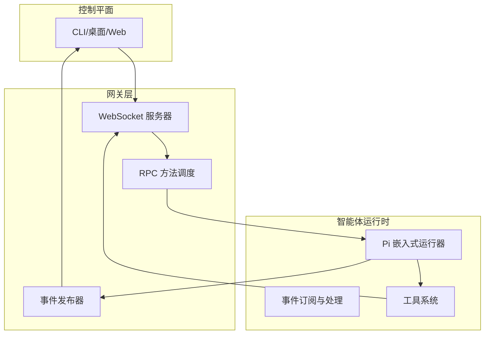
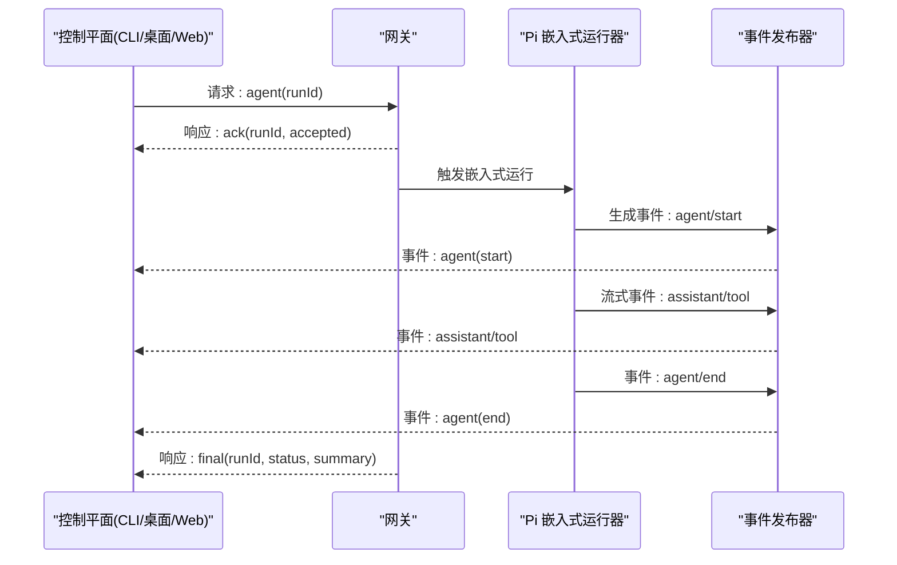
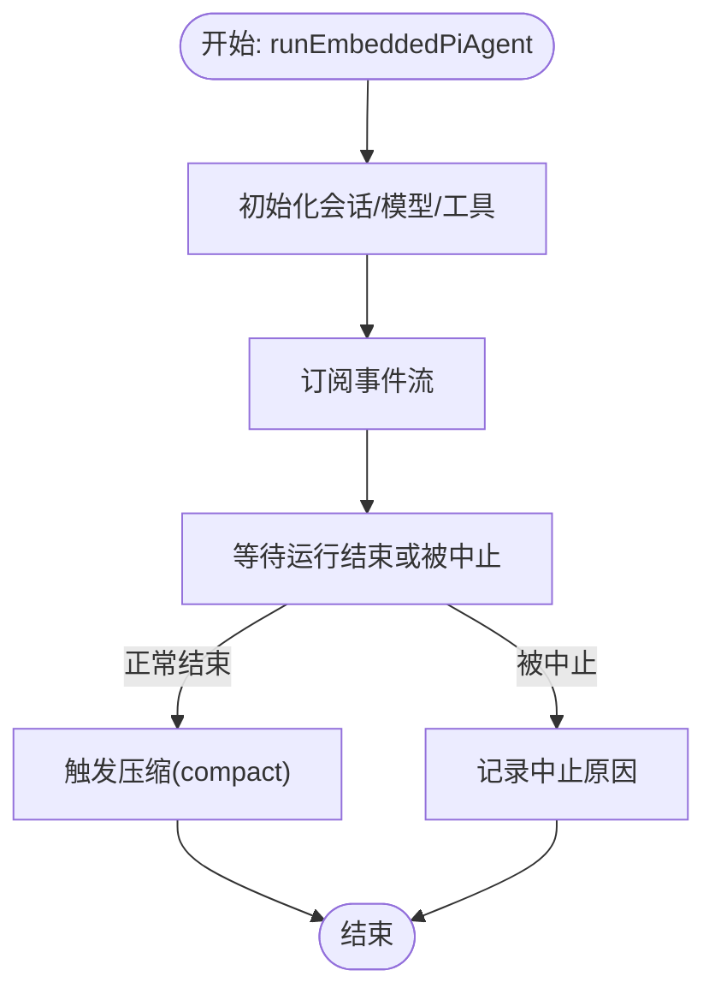
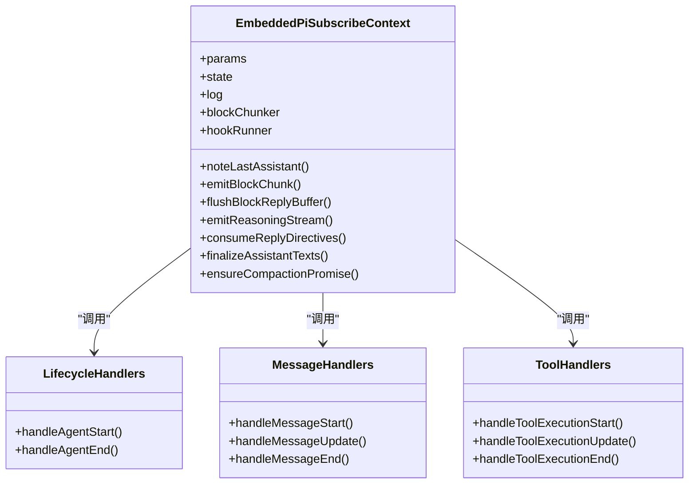
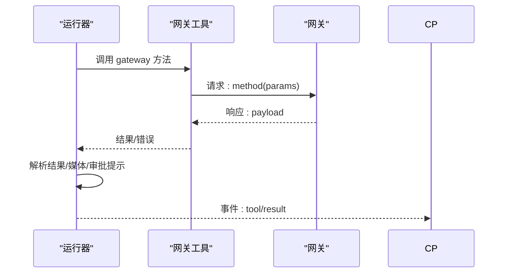
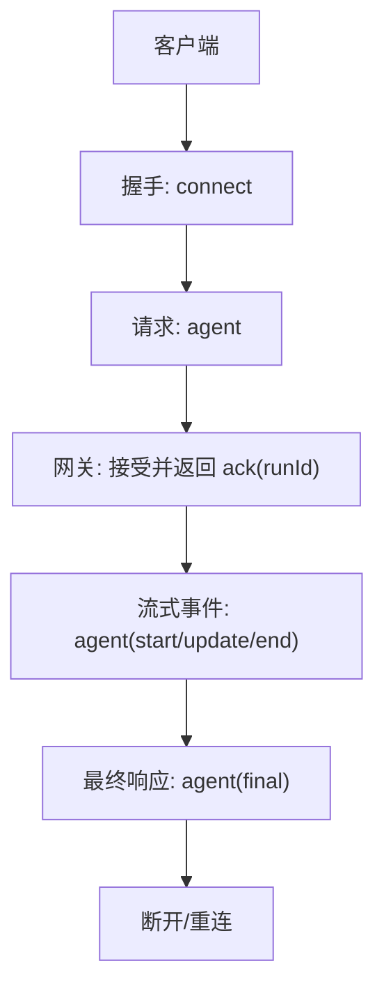
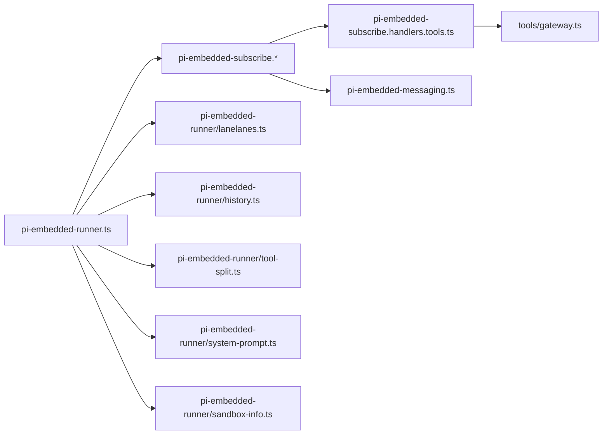

# Pi Agent 架构设计

<cite>
**本文引用的文件**
- [architecture.md](file://docs/concepts/architecture.md)
- [gateway/index.md](file://docs/zh-CN/gateway/index.md)
- [pi.md](file://docs/zh-CN/pi.md)
- [pi-embedded-runner.ts](file://src/agents/pi-embedded-runner.ts)
- [pi-embedded.ts](file://src/agents/pi-embedded.ts)
- [pi-embedded-subscribe.types.ts](file://src/agents/pi-embedded-subscribe.types.ts)
- [pi-embedded-subscribe.handlers.types.ts](file://src/agents/pi-embedded-subscribe.handlers.types.ts)
- [pi-embedded-subscribe.handlers.lifecycle.ts](file://src/agents/pi-embedded-subscribe.handlers.lifecycle.ts)
- [pi-embedded-subscribe.handlers.messages.ts](file://src/agents/pi-embedded-subscribe.handlers.messages.ts)
- [pi-embedded-subscribe.handlers.tools.ts](file://src/agents/pi-embedded-subscribe.handlers.tools.ts)
- [pi-embedded-runner/run.ts](file://src/agents/pi-embedded-runner/run.ts)
- [pi-embedded-runner/runs.ts](file://src/agents/pi-embedded-runner/runs.ts)
- [pi-embedded-runner/compact.ts](file://src/agents/pi-embedded-runner/compact.ts)
- [pi-embedded-runner/lanelanes.ts](file://src/agents/pi-embedded-runner/lanelanes.ts)
- [pi-embedded-runner/history.ts](file://src/agents/pi-embedded-runner/history.ts)
- [pi-embedded-runner/tool-split.ts](file://src/agents/pi-embedded-runner/tool-split.ts)
- [pi-embedded-runner/system-prompt.ts](file://src/agents/pi-embedded-runner/system-prompt.ts)
- [pi-embedded-runner/sandbox-info.ts](file://src/agents/pi-embedded-runner/sandbox-info.ts)
- [pi-embedded-runner/extra-params.ts](file://src/agents/pi-embedded-runner/extra-params.ts)
- [pi-embedded-runner/google.ts](file://src/agents/pi-embedded-runner/google.ts)
- [pi-embedded-runner/types.ts](file://src/agents/pi-embedded-runner/types.ts)
- [pi-embedded-messaging.ts](file://src/agents/pi-embedded-messaging.ts)
- [pi-embedded-block-chunker.ts](file://src/agents/pi-embedded-block-chunker.ts)
- [pi-embedded-helpers.ts](file://src/agents/pi-embedded-helpers.ts)
- [pi-embedded-utils.ts](file://src/agents/pi-embedded-utils.ts)
- [pi-tools.ts](file://src/agents/pi-tools.ts)
- [tools/gateway.ts](file://src/agents/tools/gateway.ts)
- [tools/message-tool.ts](file://src/agents/tools/message-tool.ts)
- [gateway/server-methods/agent-job.ts](file://src/gateway/server-methods/agent-job.ts)
- [gateway/GatewayProtocol.kt](file://apps/android/app/src/main/java/ai/openclaw/app/gateway/GatewayProtocol.kt)
</cite>

## 目录
1. [简介](#简介)
2. [项目结构](#项目结构)
3. [核心组件](#核心组件)
4. [架构总览](#架构总览)
5. [详细组件分析](#详细组件分析)
6. [依赖关系分析](#依赖关系分析)
7. [性能考量](#性能考量)
8. [故障排查指南](#故障排查指南)
9. [结论](#结论)
10. [附录](#附录)

## 简介
本文件面向 Pi Agent 在 OpenClaw 生态中的嵌入式运行架构，系统性阐述其整体架构模式、组件关系与设计原则，重点覆盖以下方面：
- 嵌入式 Pi Agent 的运行机制与生命周期
- WebSocket 控制平面交互协议与 RPC 调用流程
- 事件订阅与流式输出的处理管线
- 与 OpenClaw 网关、通道与工具系统的集成协作
- 架构决策的技术考量、性能优化策略与可扩展性设计

## 项目结构
OpenClaw 将“网关（Gateway）+ 控制平面 + 智能体运行时（Pi Agent）”解耦为清晰边界：
- 网关负责长连接、协议编解码、事件分发与方法调用
- 控制平面（CLI/桌面/Web）通过 WebSocket 与网关交互
- 智能体运行时（Pi Agent）在网关侧以嵌入式方式执行，产出流式事件并驱动工具调用

**图表来源**
- [architecture.md:27-92](file://docs/concepts/architecture.md#L27-L92)
- [pi.md:42-133](file://docs/zh-CN/pi.md#L42-L133)

**章节来源**
- [architecture.md:12-140](file://docs/concepts/architecture.md#L12-L140)
- [pi.md:42-133](file://docs/zh-CN/pi.md#L42-L133)

## 核心组件
- 嵌入式运行器入口与导出
  - 提供 run、abort、queue、compact、lane、history、sandbox、system-prompt、tool-split 等能力的统一导出接口
- 事件订阅与处理管线
  - 生命周期、消息流、工具调用三类事件处理器，支持块回复、思考流、指令解析等
- 工具系统
  - 与网关工具、消息工具、节点工具等对接，支持审批提示、媒体 URL 过滤与去重
- 网关集成
  - 通过 WebSocket 协议与网关交互，遵循请求/响应/事件三类帧格式，支持鉴权与幂等键

**章节来源**
- [pi-embedded-runner.ts:1-29](file://src/agents/pi-embedded-runner.ts#L1-L29)
- [pi-embedded-subscribe.types.ts:11-39](file://src/agents/pi-embedded-subscribe.types.ts#L11-L39)
- [pi-embedded-subscribe.handlers.types.ts:14-127](file://src/agents/pi-embedded-subscribe.handlers.types.ts#L14-L127)
- [pi-embedded-subscribe.handlers.lifecycle.ts:17-31](file://src/agents/pi-embedded-subscribe.handlers.lifecycle.ts#L17-L31)
- [pi-embedded-subscribe.handlers.messages.ts:59-76](file://src/agents/pi-embedded-subscribe.handlers.messages.ts#L59-L76)
- [pi-embedded-subscribe.handlers.tools.ts:298-306](file://src/agents/pi-embedded-subscribe.handlers.tools.ts#L298-L306)
- [tools/gateway.ts:140-160](file://src/agents/tools/gateway.ts#L140-L160)
- [gateway/index.md:146-166](file://docs/zh-CN/gateway/index.md#L146-L166)

## 架构总览
Pi Agent 在 OpenClaw 中采用“嵌入式运行时 + 控制平面 + 网关”的三层协作模式：
- 控制平面通过 WebSocket 向网关发起 agent 方法，网关返回 runId 并开始流式推送事件
- 网关侧运行器负责实际推理、工具调用与状态持久化，并通过事件通道向客户端推送
- 工具调用可复用网关提供的工具（如 gateway、message），并与节点能力协同

**图表来源**
- [architecture.md:59-78](file://docs/concepts/architecture.md#L59-L78)
- [gateway/index.md:153-166](file://docs/zh-CN/gateway/index.md#L153-L166)

## 详细组件分析

### 组件一：嵌入式运行器与运行时控制
- 运行入口与参数
  - 运行器提供 runEmbeddedPiAgent、queueEmbeddedPiMessage、waitForEmbeddedPiRunEnd、abortEmbeddedPiRun 等 API
  - 支持历史限制、会话车道、沙箱信息、系统提示词构建、工具拆分等
- 运行时状态与等待机制
  - ACTIVE_RUNS/EMBEDDED_RUN_WAITERS 维护活动运行与等待者集合，支持超时与通知
- 自动压缩与会话管理
  - compactEmbeddedPiSession 支持自动/手动压缩，减少上下文开销

**图表来源**
- [pi-embedded-runner/run.ts](file://src/agents/pi-embedded-runner/run.ts)
- [pi-embedded-runner/runs.ts:182-227](file://src/agents/pi-embedded-runner/runs.ts#L182-L227)
- [pi-embedded-runner/compact.ts](file://src/agents/pi-embedded-runner/compact.ts)

**章节来源**
- [pi-embedded-runner.ts:6-22](file://src/agents/pi-embedded-runner.ts#L6-L22)
- [pi-embedded-runner/runs.ts:182-227](file://src/agents/pi-embedded-runner/runs.ts#L182-L227)
- [pi-embedded-runner/compact.ts](file://src/agents/pi-embedded-runner/compact.ts)

### 组件二：事件订阅与处理管线
- 生命周期事件
  - agent.start 与 agent.end：记录起止时间、错误分类与观察字段，必要时延迟错误上报以避免过早终止
- 消息事件
  - message_start/message_update/message_end：维护 deltaBuffer/blockBuffer，解析思考标签与块回复，支持部分/最终输出
  - 思考流与块回复：根据配置决定在 text_end 或 message_end 时发出块回复
- 工具事件
  - tool.start/tool.update/tool.result：记录工具元信息、去重与媒体 URL 过滤，支持审批提示与不可用提示的确定性输出

**图表来源**
- [pi-embedded-subscribe.handlers.types.ts:83-127](file://src/agents/pi-embedded-subscribe.handlers.types.ts#L83-L127)
- [pi-embedded-subscribe.handlers.lifecycle.ts:17-31](file://src/agents/pi-embedded-subscribe.handlers.lifecycle.ts#L17-L31)
- [pi-embedded-subscribe.handlers.messages.ts:59-76](file://src/agents/pi-embedded-subscribe.handlers.messages.ts#L59-L76)
- [pi-embedded-subscribe.handlers.tools.ts:298-306](file://src/agents/pi-embedded-subscribe.handlers.tools.ts#L298-L306)

**章节来源**
- [pi-embedded-subscribe.handlers.lifecycle.ts:33-95](file://src/agents/pi-embedded-subscribe.handlers.lifecycle.ts#L33-L95)
- [pi-embedded-subscribe.handlers.messages.ts:78-253](file://src/agents/pi-embedded-subscribe.handlers.messages.ts#L78-L253)
- [pi-embedded-subscribe.handlers.tools.ts:422-548](file://src/agents/pi-embedded-subscribe.handlers.tools.ts#L422-L548)

### 组件三：工具系统与网关集成
- 网关工具调用
  - 通过 callGatewayTool 解析网关选项（URL、令牌、超时），并以最小权限作用域调用指定方法
- 消息工具与去重
  - 记录已发送文本/目标/媒体 URL，避免重复发送；支持审批提示与不可用提示的确定性输出
- 工具结果输出
  - 支持摘要/详细两种输出模式；在非错误场景下提取媒体 URL 并过滤

**图表来源**
- [tools/gateway.ts:140-160](file://src/agents/tools/gateway.ts#L140-L160)
- [pi-embedded-subscribe.handlers.tools.ts:220-296](file://src/agents/pi-embedded-subscribe.handlers.tools.ts#L220-L296)

**章节来源**
- [tools/gateway.ts:116-160](file://src/agents/tools/gateway.ts#L116-L160)
- [tools/message-tool.ts:838-859](file://src/agents/tools/message-tool.ts#L838-L859)
- [pi-embedded-subscribe.handlers.tools.ts:49-79](file://src/agents/pi-embedded-subscribe.handlers.tools.ts#L49-L79)

### 组件四：WebSocket 控制平面与 RPC 流程
- 协议与握手
  - 首帧必须是 connect；后续为 req/res 与 event；支持鉴权令牌与幂等键
- 方法与事件
  - agent 方法用于运行智能体轮次并流式返回事件；presence/tick/shutdown 等事件由网关推送
- 运行缓存与错误宽限期
  - 网关侧维护运行快照与待定错误，避免在认证/模型故障恢复期间过早标记失败

**图表来源**
- [architecture.md:80-91](file://docs/concepts/architecture.md#L80-L91)
- [gateway/index.md:153-166](file://docs/zh-CN/gateway/index.md#L153-L166)
- [gateway/server-methods/agent-job.ts:1-51](file://src/gateway/server-methods/agent-job.ts#L1-L51)

**章节来源**
- [architecture.md:80-140](file://docs/concepts/architecture.md#L80-L140)
- [gateway/index.md:146-166](file://docs/zh-CN/gateway/index.md#L146-L166)
- [gateway/server-methods/agent-job.ts:39-51](file://src/gateway/server-methods/agent-job.ts#L39-L51)

## 依赖关系分析
- 运行器与订阅器
  - 运行器导出 run/abort/queue/compact 等能力，订阅器基于这些能力进行事件分发
- 订阅器与工具系统
  - 订阅器在工具事件中调用工具系统，处理审批提示、媒体 URL 与去重逻辑
- 网关与工具系统
  - 网关工具封装通用调用流程，订阅器在工具结果阶段将其与事件流对接
- 会话与车道
  - 会话键与车道解析确保并发与优先级控制，避免冲突

**图表来源**
- [pi-embedded-runner.ts:1-29](file://src/agents/pi-embedded-runner.ts#L1-L29)
- [pi-embedded-subscribe.handlers.tools.ts:1-27](file://src/agents/pi-embedded-subscribe.handlers.tools.ts#L1-L27)
- [tools/gateway.ts:140-160](file://src/agents/tools/gateway.ts#L140-L160)
- [pi-embedded-messaging.ts](file://src/agents/pi-embedded-messaging.ts)

**章节来源**
- [pi-embedded-runner.ts:1-29](file://src/agents/pi-embedded-runner.ts#L1-L29)
- [pi-embedded-subscribe.handlers.tools.ts:1-27](file://src/agents/pi-embedded-subscribe.handlers.tools.ts#L1-L27)

## 性能考量
- 事件流与块回复
  - 使用 deltaBuffer/blockBuffer 保证单调递增与边界安全；在 text_end 或 message_end 时分别触发块回复，平衡实时性与一致性
- 去重与媒体过滤
  - 对消息工具发送内容进行标准化与去重，避免重复输出；媒体 URL 过滤减少冗余传输
- 压缩与上下文修剪
  - 自动/手动压缩与历史限制降低上下文开销，提升长对话稳定性
- 并发与车道
  - 会话/全局命令车道避免争用；定时任务专用车道保障关键路径不被阻塞
- 错误宽限期
  - 网关侧对运行错误设置宽限期，避免在认证/模型切换期间过早终止

**章节来源**
- [pi-embedded-subscribe.handlers.messages.ts:165-172](file://src/agents/pi-embedded-subscribe.handlers.messages.ts#L165-L172)
- [pi-embedded-subscribe.handlers.tools.ts:472-490](file://src/agents/pi-embedded-subscribe.handlers.tools.ts#L472-L490)
- [pi-embedded-runner/compact.ts](file://src/agents/pi-embedded-runner/compact.ts)
- [pi-embedded-runner/history.ts:7-10](file://src/agents/pi-embedded-runner/history.ts#L7-L10)
- [pi-embedded-runner/lanelanes.ts](file://src/agents/pi-embedded-runner/lanelanes.ts)
- [gateway/server-methods/agent-job.ts:5-9](file://src/gateway/server-methods/agent-job.ts#L5-L9)

## 故障排查指南
- 常见问题定位
  - 运行中止：检查 isRunnerAbortError 与运行器日志，区分显式 AbortError 与“aborted”字符串
  - 工具错误：查看工具事件中的错误字段与摘要，结合 lastToolError 与 mutation fingerprint 定位重复失败动作
  - 审批提示：当工具返回 approval-pending/approval-unavailable 时，确认审批路由与平台支持情况
- 事件丢失与重连
  - 网关不重放事件，客户端需在断线后刷新状态；注意幂等键避免重复副作用
- 网关协议版本
  - 客户端需匹配网关协议版本，避免字段不兼容导致握手失败

**章节来源**
- [pi-embedded-runner/abort.ts:6-17](file://src/agents/pi-embedded-runner/abort.ts#L6-L17)
- [pi-embedded-subscribe.handlers.tools.ts:446-470](file://src/agents/pi-embedded-subscribe.handlers.tools.ts#L446-L470)
- [gateway/GatewayProtocol.kt:1-3](file://apps/android/app/src/main/java/ai/openclaw/app/gateway/GatewayProtocol.kt#L1-L3)
- [architecture.md:135-140](file://docs/concepts/architecture.md#L135-L140)

## 结论
Pi Agent 在 OpenClaw 中通过“嵌入式运行器 + 事件订阅 + 工具系统 + 网关协议”的组合，实现了高内聚、低耦合的智能体执行框架。其设计强调：
- 事件驱动与流式输出，确保控制平面与运行时的解耦
- 工具调用的最小权限与确定性输出，提升安全性与可观测性
- 会话与车道的并发控制，保障关键路径稳定
- 压缩与上下文修剪的性能优化，兼顾成本与效果

该架构为扩展更多模型提供商、工具与通道提供了清晰的接入点与演进空间。

## 附录
- 关键类型与职责
  - EmbeddedPiSubscribeContext：承载订阅上下文与回调，协调事件处理
  - ToolHandlerContext：聚焦工具事件的上下文，便于测试与解耦
  - 订阅参数 SubscribeEmbeddedPiSessionParams：定义事件回调、块回复策略与推理模式

**章节来源**
- [pi-embedded-subscribe.handlers.types.ts:83-127](file://src/agents/pi-embedded-subscribe.handlers.types.ts#L83-L127)
- [pi-embedded-subscribe.types.ts:11-39](file://src/agents/pi-embedded-subscribe.types.ts#L11-L39)